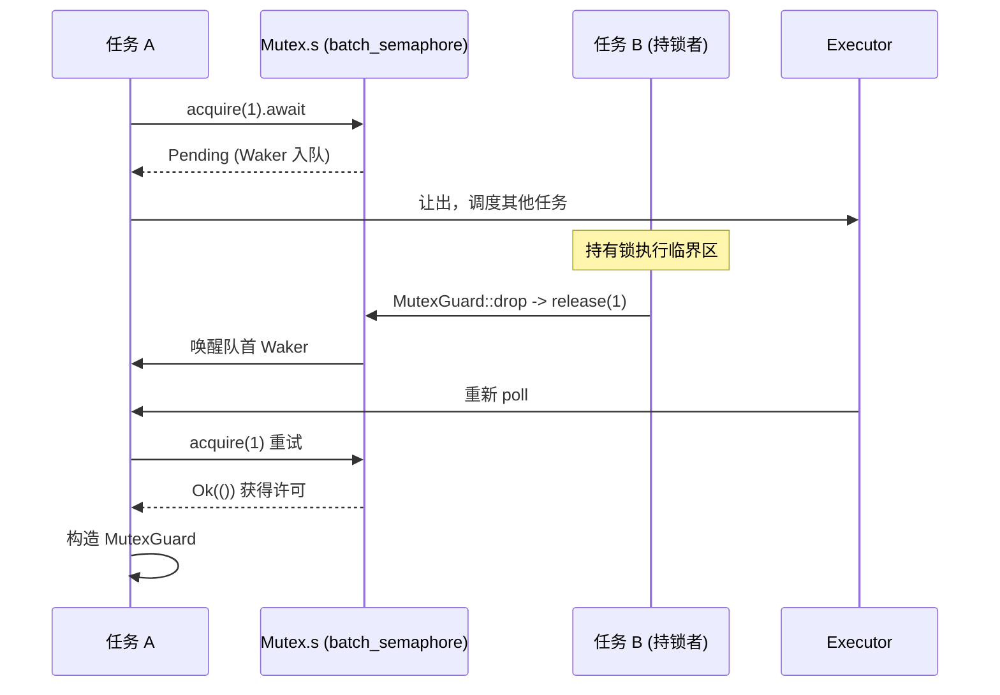

# Voltar ao topo ↑

Progresso do livro: Capítulo 7 / 14

# Status de verificação: linhas FACT com ancoragem real

## O capítulo anterior revelou como o tempo é abstraído como um tipo de evento de I/O, fazendo com que timers e prontidão de fd compartilhem o mesmo ponto de espera park/unpark. No entanto, quando múltiplas tarefas competem pelo mesmo lock ou trocam mensagens por canais, o objeto de espera não é mais um fd ou um relógio, mas sim a mudança de estado de outra tarefa. Este capítulo entra na família tokio::sync para descobrir onde exatamente um lock().await ou recv().await armazena o Waker ao bloquear, e como ele é reagendado ao ser despertado.

`std::sync::Mutex`Por que o Mutex assíncrono não pode reutilizar a implementação de std`lock()`Modelo intuitivo: de "ocupar o lugar" para "ceder o assento"**O**de**, quando o lock está ocupado,**bloqueia a thread atual`Pending`— a thread é suspensa pelo sistema operacional até que o lock seja liberado. Isso é desastroso em um runtime assíncrono: uma worker thread pode estar conduzindo centenas ou milhares de tarefas ao mesmo tempo; se ela bloquear esperando por um lock, todas as outras tarefas que ela carrega param. A exigência central do Mutex assíncrono é: ao esperar pelo lock,

ceder a thread`Mutex`, registrar em uma fila o fato de que "estou esperando por este lock", e então retornar**Construído inteiramente sobre semáforos**。

## Estrutura de dados e layout de memória

`Mutex<T>`Os campos de são minimalistas:

[FACT:tokio/src/sync/mutex.rs:133-138]

```rust
pub struct Mutex {
    #[cfg(all(tokio_unstable, feature = "tracing"))]
    resource_span: tracing::Span,
    s: semaphore::Semaphore,
    c: UnsafeCell,
}
```

Os três campos desempenham cada um o seu papel:`s`é um**semáforo com contagem de permissões igual a 1**，`c`é`UnsafeCell<T>`dados protegidos envolvidos por . Note que aqui`semaphore`é`batch_semaphore`um alias de[FACT:tokio/src/sync/mutex.rs:3-3], ou seja, a implementação subjacente, e não`sync::Semaphore`aquela camada de encapsulamento pública.

`MutexGuard<'a, T>`por sua vez contém apenas uma referência a`Mutex`:

[FACT:tokio/src/sync/mutex.rs:151-157]

```rust
pub struct MutexGuard {
    #[cfg(all(tokio_unstable, feature = "tracing"))]
    resource_span: tracing::Span,
    lock: &'a Mutex,
}
```

Há aqui um design crucial:`MutexGuard` **não mantém o objeto de permissão do semáforo**, mantém apenas`&Mutex`. A ação de libertar o lock ocorre em`Drop`, chamando diretamente`self.lock.s.release(1)` [FACT:tokio/src/sync/mutex.rs:959-961]. Isto difere de`SemaphorePermit`que mantém`permits: usize`contagem e a devolve no Drop — o Mutex tem sempre uma contagem de permissões igual a 1, não precisa de contagem.

`Send`/`Sync`As fronteiras de merecem uma análise separada:

[FACT:tokio/src/sync/mutex.rs:258-259]

```rust
unsafe impl Send for Mutex where T: ?Sized + Send {}
unsafe impl Sync for Mutex where T: ?Sized + Send {}
```

`Sync`requer apenas`T: Send`e não`T: Sync`— o que é razoável, pois o acesso mutuamente exclusivo garante que apenas uma thread pode tocar em`T`ao mesmo tempo, transferir a propriedade de`T`entre threads (`Send`) é suficiente, não é necessário que`T`em si seja partilhável (`Sync`). É precisamente isto que permite a`Mutex<T>`transformar um`Sync`que não é`T`num`Sync`.

## Passo a Passo: a viagem completa de um`lock().await`

Cenário: a tarefa A chama`mutex.lock().await`, estando o lock livre.

Primeiro passo,`lock()`constrói um bloco async, internamente primeiro`self.acquire().await`, após sucesso constrói`MutexGuard` [FACT:tokio/src/sync/mutex.rs:434-443]。

Segundo passo,`acquire()`delega diretamente ao semáforo:

[FACT:tokio/src/sync/mutex.rs:655-663]

```rust
async fn acquire(&self) {
    crate::trace::async_trace_leaf().await;
    self.s.acquire(1).await.unwrap_or_else(|_| {
        unreachable!()
    });
}
```

`unwrap_or_else(|_| unreachable!())`Esta linha de comentário revela a restrição de design: o Mutex nunca fecha explicitamente o semáforo e mantém-no em exclusivo, portanto`acquire`nunca retorna`Err`. Isto exclui ao nível do tipo o caminho de erro "semáforo fechado".

Terceiro passo, se o lock estiver ocupado,`s.acquire(1)`retorna`Pending`, o Waker da tarefa atual é registado na fila de espera do semáforo.**Onde está guardado o Waker?**A resposta está em`batch_semaphore`na fila de espera de (o ficheiro não é explorado no material fonte deste capítulo, mas o seu papel é: cada esperante mantém um Waker, em fila FIFO).

Quarto passo, quando a tarefa B que detém o lock o liberta,`MutexGuard::drop`chama`s.release(1)` [FACT:tokio/src/sync/mutex.rs:965-975], o semáforo entrega a permissão ao primeiro da fila e acorda o seu Waker, a tarefa A é reagendada,`acquire`retorna`Ok`, construindo`MutexGuard`。

Todo o fluxo pode ser descrito pelo seguinte diagrama de sequência:



## Reflexão de design: justiça FIFO e segurança de cancelamento

A documentação declara explicitamente que o Mutex do Tokio garante FIFO[FACT:tokio/src/sync/mutex.rs:20-22]. Esta justiça vem da semântica de fila do semáforo subjacente. O custo da justiça é: um`lock`cancelado (por exemplo, ao perder em`select!`) faz com que**perca a posição na fila** [FACT:tokio/src/sync/mutex.rs:415-419]. Isto não é um bug, mas uma consequência inevitável da fila FIFO — cancelar significa remover da fila, um novo`lock`tem de voltar a entrar na fila.

Outro design contra-intuitivo é**não envenenar**（no poisoning）。`std::sync::Mutex`marca como poisoned quando a thread que detém o lock entra em panic, e`lock`subsequentes retornam`Err`. O Mutex do Tokio não faz isto: quando o detentor do lock entra em panic, o lock é libertado normalmente[FACT:tokio/src/sync/mutex.rs:122-125]. A documentação avisa que, se o panic for capturado, os dados protegidos podem ficar num estado inconsistente. É um compromisso pragmático em cenários assíncronos — um panic numa tarefa assíncrona normalmente significa terminação da tarefa, e o mecanismo de envenenamento só acrescentaria complexidade.

`MutexGuard::map`A série de métodos merece menção. Permite degradar todo o`MutexGuard<T>`para um`MappedMutexGuard<U>`que protege apenas um subcampo. Na implementação, primeiro usa um closure para calcular o ponteiro do subcampo`data`, depois através de`skip_drop`desmonta o guard original num`MutexGuardInner`que não dispara Drop, e finalmente constrói um novo guard[FACT:tokio/src/sync/mutex.rs:869-883]。`skip_drop`usando`ManuallyDrop` + `ptr::read`para transferir a propriedade do campo, evitando que`Drop`seja chamado duas vezes[FACT:tokio/src/sync/mutex.rs:827-836]. Esta é a técnica clássica em Rust de "transferir propriedade sem disparar o destrutor".

# Semaphore: como a contagem de permissões e a fila de espera implementam backpressure

## Modelo intuitivo: lugares de estacionamento

O semáforo é como um parque de estacionamento:`acquire`é entrar de carro, se houver lugar entra, se não houver fica à espera à porta;`release`é sair de carro, ao libertar um lugar notifica o primeiro carro da fila para entrar. O número de permissões é o total de lugares,`acquire_many(n)`é um carro grande que ocupa n lugares.

## Estrutura de dados e layout de memória

O público`Semaphore`é apenas um fino encapsulamento do subjacente`batch_semaphore::Semaphore`:

[FACT:tokio/src/sync/semaphore.rs:427-432]

```rust
pub struct Semaphore {
    ll_sem: ll::Semaphore,
    #[cfg(all(tokio_unstable, feature = "tracing"))]
    resource_span: tracing::Span,
}
```

`SemaphorePermit<'a>`mantém a referência ao semáforo e a contagem de permissões:

[FACT:tokio/src/sync/semaphore.rs:442-445]

```rust
pub struct SemaphorePermit {
    sem: &'a Semaphore,
    permits: usize,
}
```

`permits`O campo é a chave para entender`forget`/`merge`/`split`.`forget`coloca`permits`a zero[FACT:tokio/src/sync/semaphore.rs:1193-1195], assim no Drop devolve 0 permissões — equivalente a "consumir permanentemente" essas permissões.`split`corta n permissões das atuais para o novo permit[FACT:tokio/src/sync/semaphore.rs:1260-1271]。`merge`funde a contagem de outro permit, e afirma que ambos vêm do mesmo semáforo[FACT:tokio/src/sync/semaphore.rs:1230-1240]。

> **[Design Inference & Architectural Trade-offs]**
> `MAX_PERMITS`é`usize::MAX >> 3` [FACT:tokio/src/sync/semaphore.rs:476-479]. Porquê deslocar 3 bits à direita? O subjacente`batch_semaphore`precisa de codificar flags de estado (como a flag de fecho) nos bits altos, por isso limita o número de permissões disponíveis aos bits baixos, deixando os bits altos para flags. Esta é a técnica comum de comprimir "contagem + estado" num único`usize`.

## Passo a Passo: o fluxo de permissões de acquire e release

Cenário: semáforo com 2 permissões iniciais, tarefa A`acquire()`, tarefa B`acquire_many(2)`。

`acquire()`delega a`ll_sem.acquire(1)`, após sucesso constrói`SemaphorePermit { permits: 1 }` [FACT:tokio/src/sync/semaphore.rs:614-631]。`acquire_many(2)`semelhante, mas passa 2[FACT:tokio/src/sync/semaphore.rs:661-679]。

Se as permissões forem insuficientes,`ll_sem.acquire(n)`retorna`Pending`, o Waker entra na fila. Há aqui um detalhe de justiça: a documentação indica que, se o primeiro da fila for um`acquire_many(5)`e restarem apenas 3 permissões, mesmo que atrás haja um`acquire(1)`que possa ser satisfeito imediatamente, tem de esperar — porque o carro grande à frente ocupa a fila[FACT:tokio/src/sync/semaphore.rs:19-24]. Este é o custo do FIFO estrito, que evita a fome.

O caminho de libertação está no Drop:

[FACT:tokio/src/sync/semaphore.rs:1402-1404]

```rust
impl Drop for SemaphorePermit {
    fn drop(&mut self) {
        self.sem.add_permits(self.permits);
    }
}
```

`add_permits`delega a`ll_sem.release(n)` [FACT:tokio/src/sync/semaphore.rs:568-570], o subjacente devolve as permissões à fila de espera e acorda os esperantes que conseguem reunir permissões suficientes.

Em termos de ordenação de memória, a documentação dá garantias fortes: acquire, release e close são todos`AcqRel`operações, totalmente ordenadas entre si, equivalentes a uma única variável atómica`AcqRel` [FACT:tokio/src/sync/semaphore.rs:35-42]。Isso significa que a escrita de "escrever os dados primeiro e depois liberar a permissão" é visível para a tarefa que "adquire a permissão depois" — o semáforo pode transferir dados com segurança entre tarefas.

## Reflexão de design: close e backpressure

`close()`Faz com que todos os waiters recebam`AcquireError`, e subsequentemente`try_acquire`retorna`Closed` [FACT:tokio/src/sync/semaphore.rs:1161-1163]. Esta é a base do encerramento gracioso: quando o lado receptor não precisa mais de dados, o close do semáforo permite que todos os senders bloqueados falhem e retornem imediatamente, em vez de esperar para sempre.

A essência do backpressure fica mais clara no mpsc. Na próxima seção veremos que o controle de capacidade do mpsc é implementado com um semáforo cujo número de permissões é igual ao tamanho do buffer.

# Família de canais: diferentes trade-offs entre fila de waiters e despertar por Waker

## Modelo intuitivo: quatro tipos de canais, quatro estratégias de espera

`oneshot`é um "envelope descartável" — só pode enviar uma carta, o sender não espera (`send`é síncrono), o receiver`await`espera a carta.`mpsc`é uma "esteira transportadora limitada" — o sender espera quando a esteira está cheia, o receiver espera quando está vazia, e a capacidade é controlada por semáforo.`broadcast`e`watch`são um "alto-falante de broadcast" — um sender, múltiplos receivers, mas os dois tratam o "atraso" de maneiras completamente diferentes.

O material do código-fonte desta seção foca em`oneshot`e`mpsc::bounded`, vamos destrinchá-los um por um.

## oneshot: handshake minimalista codificado com bits de estado

`oneshot`A estrutura`Inner`de é o núcleo para entender seu design:

[FACT:tokio/src/sync/oneshot.rs:386-409]

```rust
struct Inner {
    state: AtomicUsize,
    value: UnsafeCell>,
    tx_task: Task,
    rx_task: Task,
}
```

`state`é um`AtomicUsize`, que codifica todo o estado do canal com flags de bits. As quatro flags são definidas no final do arquivo:

[FACT:tokio/src/sync/oneshot.rs:1488-1505]

```rust
const RX_TASK_SET: usize = 0b00001;
const VALUE_SENT: usize = 0b00010;
const CLOSED: usize = 0b00100;
const TX_TASK_SET: usize = 0b01000;
```

`value`é`UnsafeCell<Option<T>>`，`tx_task`e`rx_task`são`Task`tipos, internamente é`UnsafeCell<MaybeUninit<Waker>>` [FACT:tokio/src/sync/oneshot.rs:411-411]. Observe`MaybeUninit`— o Waker pode não estar inicializado, e se é válido é determinado pelo bit`state`em`RX_TASK_SET`/`TX_TASK_SET`[FACT:tokio/src/sync/oneshot.rs:396-399]。

**A essência deste design**：`VALUE_SENT`O bit não apenas indica "o valor foi enviado", mas também determina a quem pertence o direito de acesso a`UnsafeCell`. O comentário é muito claro[FACT:tokio/src/sync/oneshot.rs:1491-1496]: se`VALUE_SENT`estiver setado,`UnsafeCell`só pode ser acessado pelo receiver; se não estiver setado, só pode ser acessado pelo sender. Assim, um único bit atômico implementa transferência de ownership sem lock, evitando locks adicionais.

`send`O fluxo de

[FACT:tokio/src/sync/oneshot.rs:622-646]

```rust
pub fn send(mut self, t: T) -> Result {
    let inner = self.inner.take().unwrap();
    inner.value.with_mut(|ptr| unsafe {
        *ptr = Some(t);
    });
    if !inner.complete() {
        unsafe {
            return Err(inner.consume_value().unwrap());
        }
    }
    Ok(())
}
```

Primeiro escreve o valor em`UnsafeCell`(neste momento`VALUE_SENT`não está setado, o receiver não acessará), depois chama`complete()`para tentar setar`VALUE_SENT`。`complete()`é um loop CAS:

[FACT:tokio/src/sync/oneshot.rs:1516-1549]

```rust
fn set_complete(cell: &AtomicUsize) -> State {
    let mut state = cell.load(Ordering::Relaxed);
    loop {
        if State(state).is_closed() {
            break;
        }
        match cell.compare_exchange_weak(
            state, state | VALUE_SENT, Ordering::AcqRel, Ordering::Acquire,
        ) {
            Ok(_) => break,
            Err(actual) => state = actual,
        }
    }
    State(state)
}
```

Por que usar CAS em vez de um simples`fetch_or`? O comentário explica claramente[FACT:tokio/src/sync/oneshot.rs:1517-1529]: se o canal já estiver`CLOSED`, então**não pode**setar`VALUE_SENT`novamente. Porque uma vez setado, o receiver pensará que pode acessar`UnsafeCell`, mas neste momento o sender está prestes a pegar o valor de volta (`consume_value`), e ambos acessando ao mesmo tempo causaria data race. Portanto, o loop CAS faz break antecipado ao encontrar`CLOSED`, sem setar.

`complete()`Após retornar, se o set foi bem-sucedido e`RX_TASK_SET`já estava setado, desperta o receiver:

[FACT:tokio/src/sync/oneshot.rs:1300-1315]

```rust
fn complete(&self) -> bool {
    let prev = State::set_complete(&self.state);
    if prev.is_closed() {
        return false;
    }
    if prev.is_rx_task_set() {
        unsafe {
            self.rx_task.with_task(Waker::wake_by_ref);
        }
    }
    true
}
```

O`poll_recv`do receiver é o núcleo da máquina de estados:

[FACT:tokio/src/sync/oneshot.rs:1317-1384]

Ele primeiro carrega o estado; se`is_complete()`então retorna diretamente`consume_value`; se`is_closed()`retorna`Err`; caso contrário entra no branch de "registrar Waker". Ao registrar, primeiro verifica`is_rx_task_set()`; se já estiver setado e`will_wake`determinar que é o mesmo Waker, não seta novamente; se for diferente, primeiro unset e depois set. Aqui há um tratamento sutil de corrida: após o unset, se descobrir que`is_complete()`se tornou verdadeiro, é preciso**setar a flag de volta** [FACT:tokio/src/sync/oneshot.rs:1342-1344], caso contrário o Waker vazará no Drop (porque o Drop depende da flag para decidir se deve dropar o Waker).

Esse padrão de "unset e depois set novamente" também aparece em`poll_closed`[FACT:tokio/src/sync/oneshot.rs:839-848], e é a técnica padrão do oneshot para lidar com despertares concorrentes.

## mpsc::bounded: backpressure guiado por semáforo

O controle de capacidade do mpsc é totalmente delegado ao semáforo.`channel`A função cria um semáforo com número de permissões igual ao buffer:

[FACT:tokio/src/sync/mpsc/bounded.rs:159-171]

```rust
pub fn channel(buffer: usize) -> (Sender, Receiver) {
    assert!(buffer > 0, "mpsc bounded channel requires buffer > 0");
    let semaphore = Semaphore {
        semaphore: semaphore::Semaphore::new(buffer),
        bound: buffer,
    };
    let (tx, rx) = chan::channel(semaphore);
    let tx = Sender::new(tx);
    let rx = Receiver::new(rx);
    (tx, rx)
}
```

`Semaphore`é um wrapper interno do mpsc, que mantém ao mesmo tempo o semáforo subjacente e`bound`(capacidade máxima)[FACT:tokio/src/sync/mpsc/bounded.rs:176-179]。`bound`é usado para consulta`max_capacity`, enquanto`available_permits`fornece a capacidade atual[FACT:tokio/src/sync/mpsc/bounded.rs:591-593]。

O caminho de envio`send`primeiro`reserve`e depois`send`：

[FACT:tokio/src/sync/mpsc/bounded.rs:816-824]

```rust
pub async fn send(&self, value: T) -> Result> {
    match self.reserve().await {
        Ok(permit) => {
            permit.send(value);
            Ok(())
        }
        Err(_) => Err(SendError(value)),
    }
}
```

`reserve`Internamente chama`reserve_inner(1)`, que primeiro verifica`n > max_capacity`e retorna erro diretamente, depois`acquire(n)` [FACT:tokio/src/sync/mpsc/bounded.rs:1272-1311]. Aqui há um guard`WakeReceiverOnDrop`engenhoso:

[FACT:tokio/src/sync/mpsc/bounded.rs:1286-1301]

```rust
struct WakeReceiverOnDrop {
    chan: &'a chan::Tx,
}
impl Drop for WakeReceiverOnDrop {
    fn drop(&mut self) {
        use chan::Semaphore;
        let semaphore = self.chan.semaphore();
        if semaphore.is_closed() && semaphore.is_idle() {
            self.chan.wake_rx();
        }
    }
}
```

O comentário explica a motivação[FACT:tokio/src/sync/mpsc/bounded.rs:1279-1285]: se`reserve`for cancelado após obter permissões parciais (por exemplo,`select!`perde), o`Acquire`subjacente devolverá essas permissões no Drop, mas**não**notificará o receiver como`Permit`faria. Se neste momento o canal já estiver fechado e ocioso, o receiver pode nunca receber a notificação de "canal fechado". Este guard adiciona esse despertar no Drop. Em caso de sucesso, usa`mem::forget(guard)`para cancelar o guard[FACT:tokio/src/sync/mpsc/bounded.rs:1306-1306], porque o caminho de sucesso tem`Permit`assumindo a responsabilidade de notificação.

`Permit`O Drop de

[FACT:tokio/src/sync/mpsc/bounded.rs:1732-1745]

```rust
impl Drop for Permit {
    fn drop(&mut self) {
        use chan::Semaphore;
        let semaphore = self.chan.semaphore();
        semaphore.add_permit();
        if semaphore.is_closed() && semaphore.is_idle() {
            self.chan.wake_rx();
        }
    }
}
```

`Permit::send`Copiar`mem::forget`usa[FACT:tokio/src/sync/mpsc/bounded.rs:1721-1728]。

para pular o Drop, evitando devolver permissões`recv`O caminho de recepção`poll_fn`usa`chan.recv(cx)` [FACT:tokio/src/sync/mpsc/bounded.rs:243-246]。`poll_recv`para envolver[FACT:tokio/src/sync/mpsc/bounded.rs:650-652]e delega diretamente`chan`. A lógica real da fila de espera está no módulo`chan::Rx`(não abordado neste capítulo), mas pode-se inferir: o Waker do receiver fica em`send`, e é despertado quando o sender faz

`try_send`mostra o caminho não bloqueante:

[FACT:tokio/src/sync/mpsc/bounded.rs:924-934]

```rust
pub fn try_send(&self, message: T) -> Result> {
    match self.chan.semaphore().semaphore.try_acquire(1) {
        Ok(()) => {}
        Err(TryAcquireError::Closed) => return Err(TrySendError::Closed(message)),
        Err(TryAcquireError::NoPermits) => return Err(TrySendError::Full(message)),
    }
    self.chan.send(message);
    Ok(())
}
```

`try_acquire`Os dois tipos de erro de`Closed`mapeiam precisamente para`Full`e

## , distinguindo "canal fechado" e "buffer cheio".

Reflexão de design: cancel safety e perda de mensagens[FACT:tokio/src/sync/mpsc/bounded.rs:776-784]：`send`A documentação do mpsc enfatiza repetidamente cancel safety`select!`Quando**perde em**, a mensagem será descartada`reserve`. Para evitar perda, é preciso usar`Permit`para obter`send`e depois`Permit`— porque`send`já reservou a capacidade,

`recv`é síncrono e não será interrompido.[FACT:tokio/src/sync/mpsc/bounded.rs:199-204]é cancel-safe`recv`: se`select!`perder em`recv`, garante que nenhuma mensagem foi consumida. Isso porque o`poll_recv`de`Ready`，`Pending`só retorna

`oneshot`quando realmente obtém a mensagem`Receiver`e não mexe na fila.[FACT:tokio/src/sync/oneshot.rs:246-251]O`oneshot`de`send`como Future também é cancel-safe`Err`. Mas atenção:

# o

**Armadilha um: usar Mutex assíncrono para proteger dados puros.**A documentação recomenda explicitamente[FACT:tokio/src/sync/mutex.rs:26-36]: se o que está protegido são dados puros (sem`.await`requisitos), usar`std::sync::Mutex`ou`parking_lot`é mais rápido. O custo do Mutex assíncrono está nas operações atômicas do semáforo e no possível agendamento de tarefas. Só quando for necessário`.await`durante a posse do lock (por exemplo, acessar uma conexão de banco de dados com o lock em mãos), deve-se usar Mutex assíncrono.

**Armadilha dois: manter o lock através de`.await`causando deadlock.**Esta é a armadilha mais perigosa do Mutex assíncrono. Se a tarefa A, após adquirir o lock,`.await`um evento que requer a conclusão da tarefa B, e a tarefa B está esperando por esse lock, ocorre deadlock.`std::sync::Mutex`O guard de`Send`não é`.await`(em tarefas móveis), o compilador impede manter através de`Send` [FACT:tokio/src/sync/mutex.rs:314-314]; mas o guard do Mutex assíncrono é

**, o compilador não te impede, você mesmo precisa garantir que não se forme espera circular.`reserve`Armadilha três:`send`。** `Permit`esquecer o Drop de[FACT:tokio/src/sync/mpsc/bounded.rs:1732-1745]O Drop devolve o permit

**, então não vaza capacidade. Mas se o canal já estiver fechado e ocioso, o Drop acorda o receptor — esse despertar é necessário, caso contrário o receptor pode nunca receber a notificação de fechamento.`oneshot`Armadilha quatro:`poll`O`Pending`。**pode falsamente[FACT:tokio/src/sync/oneshot.rs:236-242]A documentação explica`poll`: mesmo que a mensagem já tenha sido enviada,`Pending`pode retornar

**. Isso não é um bug, mas um fenômeno normal em condições de corrida — o chamador será acordado para tentar novamente, a mensagem não será perdida, apenas atrasada.`forget_permits`Armadilha cinco:** `forget_permits(n)`A semântica de[FACT:tokio/src/sync/semaphore.rs:576-578]Tenta reduzir n permits, retornando a quantidade efetivamente reduzida

# . Não bloqueia, nem acorda esperadores — simplesmente "engole" permits. Usado para encolher dinamicamente a capacidade do semáforo.

Resumo do capítulo`tokio::sync`Este capítulo revelou**o padrão central de**。

- `Mutex`: todas as primitivas de espera assíncrona são construídas sobre "fila de esperadores + despertar por Waker", e a implementação concreta da fila varia conforme o cenário`MutexGuard`reutiliza um semáforo com contagem de permits igual a 1,`release(1)`mantém apenas referências, no Drop
- `Semaphore`, FIFO justo mas sem envenenamento.`SemaphorePermit`é contagem de permits + fila de espera,`permits`usa`forget`/`merge`/`split`，`MAX_PERMITS`contagem para suportar
- `oneshot`deslocamento à direita de 3 bits reserva espaço para flags de estado.`AtomicUsize`usa um único`VALUE_SENT`flag de bits para codificar o estado,`UnsafeCell`bits simultaneamente determinam`CLOSED`a quem pertence o direito de acesso, o loop CAS previne definir após
- `mpsc::bounded`.`WakeReceiverOnDrop`usa um semáforo com número de permits igual ao buffer para implementar backpressure,

# guard lida com a compensação de despertar em caso de cancelamento.

Reflexões e autoavaliação do capítulo`set_complete`Q: Se mudarmos`fetch_or(VALUE_SENT)`o loop CAS de

**para um simples**：`set_complete`, em quais cenários de concorrência ocorreria uma condição de corrida de dados?`fetch_or`Análise de referência[FACT:tokio/src/sync/oneshot.rs:1517-1529]A razão de`VALUE_SENT`usar loop CAS em vez de`CLOSED`está escrita nos comentários`fetch_or`: é necessário verificar`close()`antes de definir`CLOSED` [FACT:tokio/src/sync/oneshot.rs:1569-1574]. Se mudarmos para`send`incondicional`fetch_or(VALUE_SENT)`, considere esta sequência temporal: o receptor primeiro chama`VALUE_SENT`define`CLOSED`, o emissor em seguida`poll_recv`escreve o valor e`is_complete()`. Neste momento`consume_value`e[FACT:tokio/src/sync/oneshot.rs:1325-1330]são definidos simultaneamente, o`complete()`do receptor vê`prev.is_closed()`como verdadeiro, chamará`consume_value`para pegar o valor[FACT:tokio/src/sync/oneshot.rs:1300-1315]; e o`UnsafeCell`do emissor após retornar, porque`CLOSED`é verdadeiro, chamará`VALUE_SENT`para pegar o valor de volta

Q: `reserve_inner`. Ambos os lados acessam`WakeReceiverOnDrop`simultaneamente, condição de corrida de dados. O loop CAS ao descobrir`mem::forget`faz break antecipado, não define`forget`, garantindo assim o invariante "após fechamento, o emissor tem acesso exclusivo".

**O**guard em[FACT:tokio/src/sync/mpsc/bounded.rs:1290-1298]na rota de sucesso usa`acquire(n)`para pular, o que aconteceria se removêssemos esse`Ok`?`Permit`Análise de referência`Permit`: a lógica de Drop do guard é "se o semáforo já estiver fechado e ocioso, acordar o receptor"`reserve_inner`. Na rota de sucesso,`is_idle`retorna`Permit`, o chamador obtém o permit e construirá`mem::forget`, sendo`forget`responsável pelas notificações subsequentes. Se não removermos o guard, o guard ao ser Dropado no retorno da função, verificará extra uma vez "fechado e ocioso" — mas neste momento o permit já está em posse do chamador de`acquire`, o semáforo não está ocioso (`Ok`é falso), então na prática não haverá despertar duplicado. Mas mais crucial é a clareza semântica: a responsabilidade de despertar na rota de sucesso deve ser inteiramente de`Permit`, o guard só lida com a compensação da rota de "cancelamento/falha".

expressa claramente a intenção de "esta rota não precisa de guard". Se removermos`MutexGuard`e por acaso o semáforo estiver no estado limítrofe de "fechado e ocioso" (por exemplo,`SemaphorePermit`retorna

**mas o permit ainda não foi assumido por**), pode ocorrer um despertar supérfluo — embora não cause erro, desperdiça um agendamento.`MutexGuard`Q: Se mudarmos`&Mutex`para manter o objeto de permit do semáforo (como`self.lock.s.release(1)` [FACT:tokio/src/sync/mutex.rs:959-961]faz), quais problemas seriam introduzidos?`MutexGuard::map`Análise de referência`MappedMutexGuard`: Atualmente[FACT:tokio/src/sync/mutex.rs:869-883]mantém apenas`MappedMutexGuard`, no Drop chama`&Semaphore`. Se mudássemos para manter o objeto de permit, vários problemas surgiriam. Primeiro,[FACT:tokio/src/sync/mutex.rs:190-199]a série de métodos precisa desmontar o guard em`self.s.release(1)` [FACT:tokio/src/sync/mutex.rs:1252-1262], protegendo apenas o subcampo`MappedMutexGuard`. No design atual,`permits: usize`só precisa manter`MutexGuard`e o ponteiro do subcampo`Send`/`Sync`, no Drop`unsafe impl`. Se o guard mantivesse o objeto de permit, no map seria necessário transferir a propriedade do objeto de permit, e[FACT:tokio/src/sync/mutex.rs:260-263]o layout dos campos seria mais complexo. Segundo, o objeto de permit geralmente carrega`map`。

contagem, para Mutex essa contagem é sempre 1, é redundante. Terceiro,`tokio::sync`o`spawn_blocking`de`block_on`já controla precisamente

O local de armazenamento do Waker varia conforme a primitiva: Mutex/Semaphore armazenam na fila de espera do semáforo subjacente, oneshot armazena nos campos tx_task/rx_task do Inner, mpsc armazena nas filas de envio e recebimento do módulo chan. Mas o mecanismo de despertar é unificado: quando o estado muda, o Waker é retirado e wake_by_ref é chamado, e o executor reagenda a tarefa. Até aqui, a espera e o despertar dentro das primitivas assíncronas estão claramente visíveis. No entanto, nem todo código pode ser tornado assíncrono — o próximo capítulo explorará como usar spawn_blocking para fazer a ponte com operações bloqueantes, e como block_on impulsiona Futures em contextos não assíncronos.
