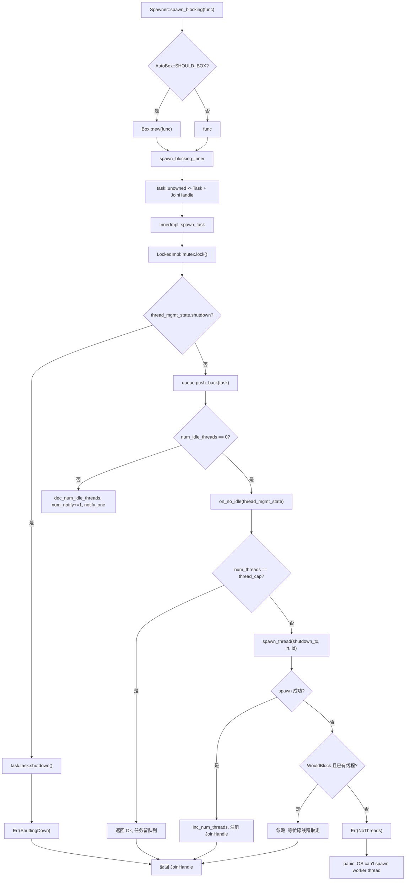
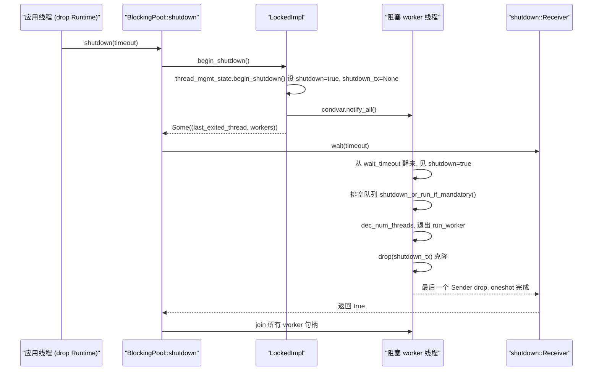

# Capítulo 8: Bloqueio e ponte: o limite entre o pool de threads spawn_blocking e block_on

No capítulo anterior vimos que a razão pela qual o Mutex assíncrono e os canais conseguem não ocupar uma thread enquanto esperam é que eles armazenam o Waker na fila de espera e, quando a condição é satisfeita, o despertador reagenda a tarefa. Mas tudo isso pressupõe que a tarefa possa ceder ativamente a thread quando está em Pending. Assim que o código chama std::fs::read, libsqlite3 ou um loop de compressão puramente em CPU, ele monopoliza a worker thread até retornar, e durante esse período todas as outras tarefas nessa thread ficam famintas. A solução do Tokio é terceirizar esse tipo de trabalho para um pool de threads bloqueantes independente e usar block_on para impulsionar Futures em contextos não assíncronos. Este capítulo disseca esses dois limites.

# 8.1 Layout de memória do pool de threads bloqueantes: Inner e fila com implementação dupla

**Modelo intuitivo**：`spawn_blocking`O pool de threads é como o "pool de ajudantes terceirizados" de um restaurante. Os garçons de salão (worker threads) só cuidam de anotar pedidos e servir pratos; quando encontram um prato que precisa de cozimento lento, escrevem uma ordem de serviço e a jogam na janela de entrega da cozinha (fila), e os ajudantes (threads bloqueantes) pegam a ordem na janela. Sem esse pool, o garçom teria que cozinhar pessoalmente e o restaurante inteiro pararia.

**Estrutura central**. Todo o pool é mantido por`BlockingPool`que armazena apenas duas coisas: um`Spawner`clonável (ponto de entrada de envio) e um`shutdown_rx`(receptor do sinal de encerramento)[FACT:tokio/src/runtime/blocking/pool.rs:20-23]。`Spawner`internamente é`Arc<Inner>`, todos os remetentes compartilham o mesmo estado[FACT:tokio/src/runtime/blocking/pool.rs:26-28]。

`Inner`é todo o estado do pool, e os campos merecem ser examinados um a um[FACT:tokio/src/runtime/blocking/pool.rs:77-104]：

- `inner_impl: InnerImpl`: implementação de fila + notificação + topologia de lock, é um enum com`Locked`e`Sharded`duas variantes[FACT:tokio/src/runtime/blocking/pool.rs:107-110]. Esta é a abstração mais crucial deste capítulo — ela unifica "fila de lock único" e "fila fragmentada" sob uma única interface.
- `thread_cap: usize`: limite superior do número de threads, ou seja,`max_blocking_threads`。
- `scheduler_threads: usize`: número de worker threads do scheduler, usado para deduzir nas métricas, fazendo com que`num_blocking_threads`conte apenas threads bloqueantes[FACT:tokio/src/runtime/blocking/pool.rs:455-460]。
- `keep_alive: Duration`: tempo de vida de threads ociosas, padrão`KEEP_ALIVE = 10s` [FACT:tokio/src/runtime/blocking/pool.rs:231]。
- `metrics: SpawnerMetrics`: três contadores atômicos —`num_threads`、`num_idle_threads`、`queue_depth` [FACT:tokio/src/runtime/blocking/pool.rs:31-35]。

> **[Design Inference & Architectural Trade-offs]**
> **Por que usar contadores atômicos em vez de campos dentro do lock?** `num_idle_threads`é lido no caminho quente de`spawn_task`(para decidir se é necessário despertar uma thread ociosa); se ele estivesse escondido em`Mutex`, cada envio precisaria primeiro adquirir o lock e depois ler. Ao torná-lo`MetricAtomicUsize`, o caminho de envio pode fazer uma verificação rápida sem manter o lock da fila. O custo é que não há garantia de atomicidade entre esses contadores e o estado da fila, então o código usa o contador`num_notify`para compensar — veja abaixo.

**Estado de gerenciamento de threads**。`ThreadManagementState`é extraído separadamente para ser reutilizado pelas duas implementações de fila[FACT:tokio/src/runtime/blocking/pool.rs:135-150]：

- `shutdown: bool`: flag de encerramento.
- `shutdown_tx: Option<shutdown::Sender>`: cada worker thread mantém uma cópia clonada; após todas serem dropadas,`shutdown_rx`recebe a notificação.
- `last_exiting_thread: Option<JoinHandle<()>>`: handle da última thread que saiu por timeout.
- `worker_threads: HashMap<usize, JoinHandle<()>>`: handles de todos os workers vivos.
- `worker_thread_index: usize`: alocador monotonicamente crescente de ID de thread.

`last_exiting_thread`A motivação de design está claramente escrita nos comentários: uma thread que sai por timeout fará join na última thread que saiu por timeout, evitando falsos positivos do Valgrind[FACT:tokio/src/runtime/blocking/pool.rs:135-150]。`worker_timed_out`é exatamente a implementação desse join encadeado — ela remove seu próprio handle e troca o`last_exiting_thread`antigo, retornando-o ao chamador para fazer join[FACT:tokio/src/runtime/blocking/pool.rs:172-178]。

**Encapsulamento de tarefa**. O que é armazenado na fila é`Task`, que envolve um`UnownedTask<BlockingSchedule>`e uma flag`Mandatory`que decide se, no encerramento, essa tarefa é descartada ou executada à força:[FACT:tokio/src/runtime/blocking/pool.rs:187-191]。`Mandatory`chama`shutdown_or_run_if_mandatory`em`NonMandatory`, e chama`shutdown()`em`Mandatory`. Esta é a diferença entre`run()` [FACT:tokio/src/runtime/blocking/pool.rs:223-228](não forçado) e`spawn_blocking`(forçado, usado por fs)`spawn_mandatory_blocking`Layout de memória da implementação de lock único[FACT:tokio/src/runtime/blocking/pool.rs:233-265]。

**é a topologia mais primitiva: um**。`LockedImpl`mais um`Mutex<LockedInner>`dentro está`Condvar` [FACT:tokio/src/runtime/blocking/pool.rs:113-116]。`LockedInner`e`VecDeque<Task>`、`num_notify: u32`. Observe que`thread_mgmt_state` [FACT:tokio/src/runtime/blocking/pool.rs:118-124]e`num_notify`estão sob o mesmo lock, enquanto`thread_mgmt_state`é uma quantidade atômica fora do lock — esse layout híbrido de "parte do estado dentro do lock, parte fora" é exatamente a raiz de todas as sutilezas de concorrência posteriores.`num_idle_threads`8.2 Caminho de envio: de spawn_blocking ao despertar de thread

# Cenário

**: uma tarefa assíncrona chama**, o que acontece neste momento?`tokio::task::spawn_blocking(move || heavy_compute(data))`Primeiro passo: decisão de boxing e construção da tarefa

**primeiro mede o tamanho da closure**。`Spawner::spawn_blocking`, depois decide, com base em`fn_size`, se deve colocar a closure em`AutoBox::<F>::SHOULD_BOX`(boxing)`Box`. Esta é a estratégia genérica do Tokio de "boxing automático para Futures grandes": quando a closure é grande demais, ela é boxada para evitar o inchaço da struct de tarefa.[FACT:tokio/src/runtime/blocking/pool.rs:359-389]Entra em

, primeiro aloca o ID da tarefa, depois usa`spawn_blocking_inner`para envolver a closure em um Future, e por fim usa`blocking_task`para construir`task::unowned`e`UnownedTask`. Observe que aqui é retornado um`JoinHandle` [FACT:tokio/src/runtime/blocking/pool.rs:440-449]tupla dupla — o handle e o resultado do envio são retornados separadamente.`(JoinHandle<R>, Result<(), SpawnError>)`Segundo passo: três tratamentos do resultado do envio

**. Voltando a**, faz match em`spawn_blocking`:`spawn_result`: normal, retorna o handle.[FACT:tokio/src/runtime/blocking/pool.rs:381-388]：

- `Ok(())`：正常，返回句柄。
- `Err(ShuttingDown)`：**não entra em panic**, ainda retorna o handle. O comentário explica que isso é por consideração de compatibilidade — o handle nunca será resolvido, mas o chamador não entrará em panic porque o runtime está sendo encerrado.
- `Err(NoThreads(e))`: o SO não consegue criar a thread e ninguém no pool a assume, então entra diretamente em panic.

**Terceiro passo: decisão de enfileiramento e despertar**。`spawn_task`passa a`on_no_idle`closure para`InnerImpl::spawn_task`, e a implementação concreta decide quando chamá-la[FACT:tokio/src/runtime/blocking/pool.rs:462-506]. Veja`LockedImpl::spawn_task`a seção crítica de[FACT:tokio/src/runtime/blocking/pool.rs:603-639]：

```rust
let mut locked = self.mutex.lock();

if locked.thread_mgmt_state.shutdown {
    task.task.shutdown();
    return Err(SpawnError::ShuttingDown);
}

locked.queue.push_back(task);
metrics.inc_queue_depth();

if metrics.num_idle_threads() == 0 {
    on_no_idle(&mut locked.thread_mgmt_state)?;
} else {
    metrics.dec_num_idle_threads();
    locked.num_notify += 1;
    self.condvar.notify_one();
}
```

Aqui há dois pontos-chave. Primeiro, a verificação de encerramento ocorre antes do enfileiramento, e mesmo que a tarefa seja`Mandatory`também diretamente`shutdown()`— o comentário explica: ela só foi agendada depois do início do encerramento, então descartá-la é legal[FACT:tokio/src/runtime/blocking/pool.rs:614-620]. Segundo, a decisão de despertar depende de`num_idle_threads`fora do lock: se for 0, chama`on_no_idle`para tentar iniciar uma nova thread; caso contrário, decrementa o contador de ociosas e incrementa`num_notify`、`notify_one`。

**`num_notify`Por que precisa existir?**Porque`Condvar`pode produzir despertar espúrio (spurious wakeup). Se usar apenas`notify_one`sem contar, uma thread despertada espuriamente pensará por engano que há tarefa disponível, descobrirá que a fila está vazia e voltará a dormir, enquanto a thread realmente despertada pode nunca receber a notificação.`num_notify`transforma o "despertar legítimo" em um token contável: o lado que publica`+1`, e o lado despertado só em`num_notify != 0`considera o despertar legítimo e`-1` [FACT:tokio/src/runtime/blocking/pool.rs:674-684]。

**Quarto passo: iniciar nova thread**。`on_no_idle`A closure executa[FACT:tokio/src/runtime/blocking/pool.rs:462-506]mantendo o lock da fila. Primeiro verifica`num_threads == thread_cap`, e ao atingir o limite retorna diretamente`Ok(())`— a tarefa permanece na fila aguardando threads existentes, e isso é backpressure. Caso contrário, clona`shutdown_tx`, chama`spawn_thread`para criar a thread e, em caso de sucesso, incrementa`num_threads`, incrementa`worker_thread_index`, insere o handle em`worker_threads`。

`spawn_thread`usa`thread::Builder`para definir o nome da thread e o tamanho da pilha, e então faz spawn de uma closure: entra no contexto do runtime`rt.enter()`, chama`inner.run(id)`, e por fim drop`shutdown_tx` [FACT:tokio/src/runtime/blocking/pool.rs:508-528]。

**Tolerância a falhas na criação de threads do SO**。`spawn_thread`pode falhar. O código classifica o erro[FACT:tokio/src/runtime/blocking/pool.rs:488-500]: se for`WouldBlock`(erro temporário, determinado por`is_temporary_os_thread_error`) e já houver threads bloqueadas no pool, então[FACT:tokio/src/runtime/blocking/pool.rs:750-752]ignora silenciosamente**— a tarefa acabará sendo retirada por alguma thread atualmente ocupada. Caso contrário, retorna**, o que acaba levando a panic.`SpawnError::NoThreads`Resumindo o caminho de publicação com um grafo de fluxo de controle das decisões:

Copiar



# Modelo intuitivo

**: cada thread bloqueada é um "ajudante de plantão". Com demanda, trabalha continuamente (BUSY); sem demanda, cochila (IDLE); se cochilar além de**, encerra o turno (saída por timeout). Sem recuperação por timeout, o pool manteria permanentemente todas as threads criadas no pico, desperdiçando memória e custo de agendamento do kernel.`keep_alive`Estrutura do loop principal

**é um loop**。`LockedImpl::run_worker`, internamente alternando entre as duas fases BUSY e IDLE`'main`. Observação: aqui BUSY/IDLE são[FACT:tokio/src/runtime/blocking/pool.rs:642-735]fases**dentro do loop, não estados de um enum explícito, então abaixo descrevemos com fluxograma em vez de diagrama de estados.**Fase BUSY

**: o loop interno**retira tarefas continuamente`while let Some(task) = locked.queue.pop_front()`. Após obter, decrementa[FACT:tokio/src/runtime/blocking/pool.rs:655-661]drop do lock`queue_depth`，**, executa**, e readquire o lock. O passo de drop do lock é crucial — uma tarefa bloqueante pode demorar muito, e nunca se deve executá-la segurando o lock.`task.run()`Fase IDLE

**: a fila esvaziou, incrementa**, define`num_idle_threads`, e então entra no loop de espera`is_counted_idle = true`. O núcleo é[FACT:tokio/src/runtime/blocking/pool.rs:663-696], e após retornar verifica três coisas:`condvar.wait_timeout(locked, keep_alive)`: despertar legítimo. Decrementa

1. `num_notify != 0`, define`num_notify`(porque o lado que publicou já decrementou`is_counted_idle = false`), break de volta para BUSY`num_idle_threads`2. Não encerrado e timeout: chama[FACT:tokio/src/runtime/blocking/pool.rs:674-684]。

para obter o handle da thread que saiu anteriormente,`worker_timed_out`sai do loop`break 'main`3. Caso contrário, é despertar espúrio, continua esperando.[FACT:tokio/src/runtime/blocking/pool.rs:689-693]。

Esvaziamento da fila no encerramento

**. Se**for verdadeiro, entra na lógica de esvaziamento`thread_mgmt_state.shutdown`: retira tarefas uma a uma, drop do lock, chama[FACT:tokio/src/runtime/blocking/pool.rs:698-710]— tarefas não forçadas são descartadas, tarefas forçadas executam normalmente. Depois break para sair do loop principal.`task.shutdown_or_run_if_mandatory()`Limpeza na saída

**. Antes de a thread sair, decrementa**. Se`num_threads` [FACT:tokio/src/runtime/blocking/pool.rs:714]for verdadeiro, também decrementa`is_counted_idle`, e usa`num_idle_threads`para afirmar que não houve underflow`assert_ne!(prev_idle, 0)`. Essa asserção é uma proteção em tempo de depuração: se[FACT:tokio/src/runtime/blocking/pool.rs:716-726]contabilizar errado, aqui entrará imediatamente em panic em vez de deixar o erro se propagar silenciosamente.`num_idle_threads`Por fim, se estiver encerrando e

(a última thread),`num_threads == 0`desperta o iniciador do encerramento que pode estar esperando`notify_one`. Retorna[FACT:tokio/src/runtime/blocking/pool.rs:728-730], e`join_on_thread`faz join antes de sair`Inner::run`Handshake de encerramento[FACT:tokio/src/runtime/blocking/pool.rs:755-771]。

**primeiro chama**。`BlockingPool::shutdown`para obter todos os handles dos workers`begin_shutdown`define a flag de encerramento, drop[FACT:tokio/src/runtime/blocking/pool.rs:310-312]。`LockedImpl::begin_shutdown`desperta todas as threads em espera`shutdown_tx`、`notify_all`. Depois[FACT:tokio/src/runtime/blocking/pool.rs:740-745]bloqueia aguardando`shutdown_rx.wait(timeout)`A implementação de[FACT:tokio/src/runtime/blocking/pool.rs:324]。

`shutdown::Receiver::wait`é bastante cuidadosa[FACT:tokio/src/runtime/blocking/shutdown.rs:37-70]: primeiro trata o caminho rápido de`timeout == 0`retornando diretamente false; depois chama`try_enter_blocking_region()`para entrar na região de bloqueio e, se falhar e no momento estiver em panic, retorna false; caso contrário, entra em panic com a mensagem "não é possível dar drop no runtime em contexto assíncrono"[FACT:tokio/src/runtime/blocking/shutdown.rs:44-57]. Por fim, conforme o timeout, chama`block_on_timeout`ou`block_on`para impulsionar aquele oneshot.

`shutdown_tx`O mecanismo de`Arc<oneshot::Sender<()>>`é: cada thread worker mantém um clone de[FACT:tokio/src/runtime/blocking/shutdown.rs:12-14]. Depois que todas as threads saem, todos os clones são dropados,`Arc`a contagem chega a zero,`oneshot::Sender`é dropado,`Receiver`recebe a notificação. Esse é o padrão clássico de "após todos os Sender serem dropados, o Receiver é despertado".



# 8.4 block_on: impulsionar um Future em contexto não assíncrono

**Modelo intuitivo**：`block_on`é a "porta principal" do runtime. Ela transforma a thread atual em um executor temporário, repetidamente fazendo poll no Future recebido até concluir. Sem ela,`main`a função não conseguiria iniciar nenhum código assíncrono.

**Entrada e boxing**。`Runtime::block_on`também primeiro mede o tamanho, decide por`SHOULD_BOX`se`Box::pin`, e então entra em`block_on_inner` [FACT:tokio/src/runtime/runtime.rs:343-350]。`block_on_inner`Há dois trechos de trace com compilação condicional (taskdump e tracing), então`self.enter()`entra no contexto do runtime e, por fim, despacha conforme o tipo de scheduler[FACT:tokio/src/runtime/runtime.rs:353-383]：

```rust
let _enter = self.enter();

match &self.scheduler {
    Scheduler::CurrentThread(exec) => exec.block_on(&self.handle.inner, future),
    Scheduler::MultiThread(exec) => exec.block_on(&self.handle.inner, future),
}
```

Os dois schedulers`block_on`A semântica é diferente, a documentação deixa isso bem claro[FACT:tokio/src/runtime/runtime.rs:302-320]：

- **Agendador multithread**: O Future é executado no contexto do driver de I/O e do temporizador,`block_on`após o retorno, as tarefas já spawnadas continuam a ser executadas.
- **Agendador de thread atual**：`block_on`pode ser chamado concorrentemente por múltiplas threads, o primeiro chamador obtém a propriedade do driver de I/O e do temporizador, e as outras threads "se conectam" a ele. Após o primeiro`block_on`terminar, as outras threads podem "roubar" o driver.`block_on`após o retorno, as tarefas já spawnadas são suspensas, e chamar novamente`block_on`irá restaurá-las.

**Restrição crítica: não pode ser chamado em contexto assíncrono**. A documentação deixa explícito que`block_on`chamar em um contexto de execução assíncrono causará panic[FACT:tokio/src/runtime/runtime.rs:321-324]. A razão é direta:`block_on`bloqueia a thread atual até que o Future seja concluído; se a thread atual for ela mesma uma worker thread, bloqueará todo o executor — que é exatamente`spawn_blocking`o problema que se pretende resolver, portanto os dois são mutuamente exclusivos.

**Caminho de encerramento**。`Runtime::drop`despacha de acordo com o tipo de agendador[FACT:tokio/src/runtime/runtime.rs:506-521]: o agendador de thread atual precisa primeiro`try_set_current`entrar no contexto e então shutdown (garantindo que as tarefas sejam dropadas no contexto de runtime); o agendador multithread faz shutdown diretamente (as worker threads já estão no contexto).`shutdown_timeout`Primeiro fecha o agendador e depois fecha o pool de bloqueio[FACT:tokio/src/runtime/runtime.rs:457-461]，`shutdown_background`é equivalente a`shutdown_timeout(Duration::from_nanos(0))` [FACT:tokio/src/runtime/runtime.rs:494-496]。

# Reflexões de design, recuperação de erros e armadilhas em produção

**Por que`spawn_blocking`de`ShuttingDown`não causa panic?** [FACT:tokio/src/runtime/blocking/pool.rs:383-384]O comentário diz que é por consideração de compatibilidade.`spawn_blocking`retorna`JoinHandle`em vez de`Result`, pois se causasse panic no encerramento, transformaria o estado previsível de "o runtime está encerrando" em um crash. Retornar um handle que nunca resolve faz com que o chamador`await`fique suspenso para sempre — mas nesse momento o runtime já está encerrado, e todo o`block_on`também sairá, então na prática não haverá vazamento permanente.

**`max_blocking_threads`A semântica de backpressure de**. O valor padrão é muito grande (512), porque`spawn_blocking`é frequentemente usado para I/O de arquivos. Mas a documentação alerta: ao executar tarefas intensivas de CPU, deve-se usar um semáforo para limitar a concorrência, caso contrário serão criadas muitas threads[FACT:tokio/src/task/blocking.rs:94-100]. Ao atingir o limite, as tarefas ficam na fila, formando backpressure — mas note que esse backpressure atua apenas no pool de bloqueio, não faz backpressure para o agendador assíncrono.

**`spawn_blocking`não é cancelável**. A documentação deixa explícito:`abort`não tem efeito sobre tarefas de bloqueio que já começaram a executar; a tarefa continuará até o fim[FACT:tokio/src/task/blocking.rs:106-120]. Apenas tarefas que ainda não começaram podem ser impedidas por abort. No encerramento, o runtime aguardará todas as tarefas de bloqueio já iniciadas,`shutdown_timeout`e após o timeout essas threads vazarão.

**`num_idle_threads`A armadilha de contabilidade de**。`is_counted_idle`A existência da flag indica que essa contagem é muito propensa a erros. O lado que envia decrementa ao acordar`num_idle_threads`, e o lado acordado, ao ver`num_notify != 0`, define`is_counted_idle = false`, evitando decremento duplicado[FACT:tokio/src/runtime/blocking/pool.rs:679-682]. Se esse caminho tiver um bug,`assert_ne!(prev_idle, 0)`causará panic ao sair[FACT:tokio/src/runtime/blocking/pool.rs:722-725]. Em produção, se você vir "`num_idle_threads`underflowed on thread exit", significa que a lógica de contabilidade do pool foi corrompida.

> **[Design Inference & Architectural Trade-offs]**
> **`last_exiting_thread`O custo do join encadeado**. Uma thread que sai por timeout fará join na thread que saiu por timeout anteriormente[FACT:tokio/src/runtime/blocking/pool.rs:172-178]. Isso forma uma cadeia de join: cada thread que sai precisa esperar a anterior realmente terminar. Em cenários de criação/destruição de alta frequência de threads de bloqueio, essa cadeia pode crescer, causando acúmulo de atraso na saída de threads. Este é um trade-off feito para evitar falsos positivos do Valgrind; o impacto em produção normal é limitado, mas merece atenção sob cargas com timeouts frequentes de threads.

**`InnerImpl`O significado da abstração de enum**. O comentário explica que`Locked`a variante tem comportamento idêntico ao anterior à refatoração, enquanto`Sharded`a variante reserva um slot simétrico para futuras filas concorrentes[FACT:tokio/src/runtime/blocking/pool.rs:537-539]。`spawn_task`、`run_worker`、`begin_shutdown`os três métodos despacham através do enum[FACT:tokio/src/runtime/blocking/pool.rs:548-582]. Esse design de "despacho por enum + seção crítica própria por variante" faz com que, ao adicionar novas topologias de fila, não seja necessário alterar o chamador.

# Resumo do capítulo

Este capítulo desmontou as duas fronteiras do Tokio para acomodar código síncrono.`spawn_blocking`entrega closures a um pool de threads de bloqueio independente:`Inner`mantém fila, limite de threads, tempo de vida e métricas atômicas;`LockedImpl`usa lock único +`Condvar`para implementar a fila,`num_notify`contador compensa wakeups falsos; o worker alterna entre BUSY/IDLE, e após timeout de ociosidade sai via join encadeado;`max_blocking_threads`ao atingir o limite, as tarefas entram na fila formando backpressure.`block_on`por sua vez, impulsiona Futures em contexto não assíncrono; os agendadores multithread e de thread atual têm semânticas diferentes, e é estritamente proibido chamá-lo em contexto assíncrono. O caminho de encerramento, através de`shutdown_tx`de`Arc`com contagem zerada, dispara`oneshot`, realizando o handshake de "acordar o iniciador do encerramento após todas as workers saírem".

# Reflexões e autoavaliação do capítulo

Q1: Se em`LockedImpl::spawn_task`a verificação de`if metrics.num_idle_threads() == 0`fosse alterada para sempre verdadeira (ou seja, chamar`on_no_idle`toda vez), o que aconteceria em cenários de envio altamente concorrente? Por quê?

**Análise de referência**：`on_no_idle`verifica`num_threads == thread_cap`, e se o limite não foi atingido, cria uma nova thread[FACT:tokio/src/runtime/blocking/pool.rs:471-487]. Se a verificação fosse sempre verdadeira, mesmo havendo threads ociosas tentaria iniciar novas threads, fazendo o número de threads disparar até`thread_cap`. Mais grave ainda, threads ociosas não seriam acordadas por`notify_one`(porque seguiu o ramo`on_no_idle`em vez do ramo`else`de`num_notify += 1; notify_one` [FACT:tokio/src/runtime/blocking/pool.rs:627-636]), e as tarefas na fila poderiam ficar sem ninguém para processá-las, até que alguma nova thread inicie e descubra que a fila não está vazia. Isso causaria um estado de falsa paralisia de "threads lotadas mas tarefas ainda na fila". O sentido da verificação original é exatamente: quando há threads ociosas, priorizar acordá-las, evitando criação desnecessária de threads.

Q2: `LockedImpl::run_worker`Na fase BUSY, antes de executar`task.run()`, faz-se`drop(locked)` [FACT:tokio/src/runtime/blocking/pool.rs:657-658]. Se esse`drop`fosse removido, em qual cenário ocorreria deadlock?

**Análise de referência**：`task.run()`executa a closure do usuário, e dentro da closure é totalmente possível chamar novamente`spawn_blocking`para enviar uma nova tarefa. O caminho de envio`LockedImpl::spawn_task`faz como primeira coisa`self.mutex.lock()` [FACT:tokio/src/runtime/blocking/pool.rs:612]. Se o worker mantivesse o lock ao executar a closure, o envio dentro da closure tentaria adquirir o mesmo lock, e`std::sync::Mutex`Não reentrante, deadlock direto. Além disso, manter o lock durante a execução de tarefas longas bloqueia todas as operações de obtenção de tarefas dos outros submitters e workers; mesmo sem deadlock, isso serializa todo o pool.`drop(locked)`É obrigatório.

Q3: `shutdown::Receiver::wait`Em`try_enter_blocking_region()`falha e está atualmente em panic, retorna false; caso contrário, entra em panic[FACT:tokio/src/runtime/blocking/shutdown.rs:44-57]. Por que tratar especialmente durante o panic? Se removermos esse branch, em quais cenários surgiriam problemas?

**Análise de referência**：`try_enter_blocking_region`A falha significa que estamos atualmente em um contexto assíncrono, onde bloqueio não é permitido. Em condições normais, deveria entrar em panic para avisar o usuário que "não se pode dar drop no runtime em contexto assíncrono". Mas se a thread atual já está em panic (`std::thread::panicking()`é verdadeiro), entrar em panic novamente causaria um panic duplo, e o comportamento padrão do Rust é abortar o processo diretamente. Cenário: o usuário dá drop em um Runtime dentro de uma tarefa assíncrona, e essa tarefa já está em panic por outro motivo; nesse momento, o shutdown acionado pelo drop causaria um segundo panic. Retornar false faz o shutdown desistir de esperar, evitando o abort do processo e preservando a chance de o usuário ver a informação original do panic. Esse é um tratamento típico de "panic safety".

O pool de threads bloqueantes e o block_on delimitam as fronteiras de capacidade do runtime assíncrono: o primeiro isola o trabalho que não pode ceder a thread em threads dedicadas, e o segundo permite que pontos de entrada não assíncronos também dirijam Futures. Mas essas duas fronteiras muitas vezes não são escritas à mão no código — no próximo capítulo entraremos no mundo das macros, para ver como #[tokio::main], select! e join! geram esse código de runtime em tempo de compilação.
