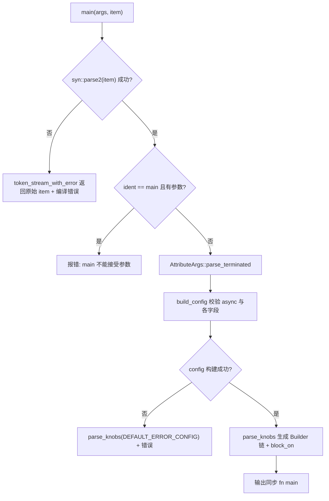
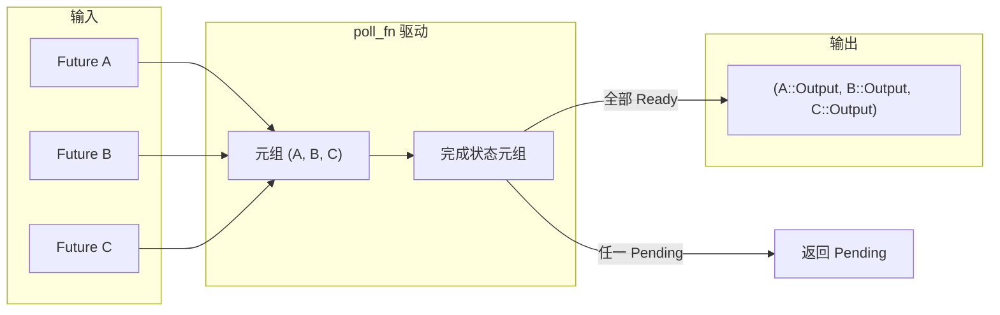

# Capítulo 9: A magia das macros: o código gerado por trás de #[tokio::main], select! e join!

No capítulo anterior vimos`block_on`e como o pool de threads bloqueantes delimita as fronteiras de capacidade do runtime assíncrono, mas os usuários quase nunca escrevem essas fronteiras à mão — eles escrevem`#[tokio::main]`、`select!`、`join!`, deixando a macro expandir esse código boilerplate em tempo de compilação. As macros são a primeira camada de açúcar que o Tokio oferece ao usuário e também o lugar onde o código de runtime é realmente gerado em tempo de compilação. Este capítulo foca no`tokio-macros`crate e em`tokio/src/macros/select.rs`, desmontando os três caminhos de expansão de macros mais usados, com foco em responder a uma pergunta: depois da expansão da macro, como é a cadeia de chamadas real, e por que a semântica de cancel safety de`select!`precisa ser especialmente cautelosa.

# 9.1 #[tokio::main]: reescrevendo async fn como Runtime::block_on

**Modelo intuitivo**：`#[tokio::main]`é como uma "procuração de reforma". Você entrega um apartamento inacabado (`async fn main`), e ela instala a hidráulica e a elétrica para você (construindo o Runtime), coloca portas e janelas (`enable_all`), e por fim move seus móveis originais (o corpo da função) para dentro. Sem ela, cada`main`teria que escrever manualmente`Builder::new_multi_thread().enable_all().build().unwrap().block_on(...)`, e o código boilerplate afogaria a lógica de negócio.

## Estruturas de dados e layout de memória

A macro em si não produz estruturas de dados em runtime, mas a configuração que ela analisa é colocada em duas structs.`Configuration`é um "acumulador mutável em tempo de parsing", com todos os campos sendo`Option`, porque os parâmetros de atributo podem estar ausentes, podem se repetir, podem ser inválidos[FACT:tokio-macros/src/entry.rs:74-84]. Observe que`worker_threads`、`start_paused`、`unhandled_panic`todos carregam`Span`— isso serve para, ao reportar erro, localizar o erro na linha que o usuário escreveu, e não dentro da macro[FACT:tokio-macros/src/entry.rs:74-84]。`FinalConfig`por outro lado, é o "resultado imutável após validação",`flavor`não é mais`Option`, porque`build()`já usou`default_flavor`como fallback[FACT:tokio-macros/src/entry.rs:55-62]。

`RuntimeFlavor`tem apenas três variantes:`CurrentThread`、`Threaded`、`Local` [FACT:tokio-macros/src/entry.rs:10-14]。`from_str`dá intencionalmente mensagens amigáveis para nomes legados:`single_thread`indica que deveria se chamar`current_thread`，`basic_scheduler`indica que foi renomeado,`threaded_scheduler`indica que foi renomeado[FACT:tokio-macros/src/entry.rs:17-27]. Esse é um design típico da macro como "primeira superfície de contato do usuário": a mensagem de erro é a documentação.

## Fluxo de expansão passo a passo

Cenário: o usuário escreve`#[tokio::main(flavor = "multi_thread", worker_threads = 4)] async fn main() { ... }`。

Primeiro passo,`main`a entrada primeiro analisa o item como um`ItemFn` [FACT:tokio-macros/src/entry.rs:577-580]personalizado. Esse`ItemFn`não é`syn::ItemFn`, mas um parser implementado pelo próprio Tokio, e o motivo está nos comentários: ele não quer analisar recursivamente toda a instrução, apenas fazer um parsing leve de "bufferizar por token tree e dividir ao encontrar ponto e vírgula"[FACT:tokio-macros/src/entry.rs:720-764]. Isso evita o custo de construir uma AST completa para o corpo da função dentro da macro.

Segundo passo,`build_config`valida se a palavra-chave`async`existe; se faltar, reporta "the`async` keyword is missing" [FACT:tokio-macros/src/entry.rs:346-349]. Em seguida, percorre os parâmetros de atributo, despachando`worker_threads`、`flavor`、`start_paused`、`crate`、`unhandled_panic`、`name`para o setter correspondente[FACT:tokio-macros/src/entry.rs:369-399]. Observe que`core_threads`é explicitamente rejeitado com a indicação de que foi renomeado[FACT:tokio-macros/src/entry.rs:379-382]。

Terceiro passo,`Configuration::build`faz validação de consistência entre campos. Aqui há três restrições principais:`worker_threads`só permite`multi_thread` [FACT:tokio-macros/src/entry.rs:197-217]；`start_paused`só permite`current_thread`/`local` [FACT:tokio-macros/src/entry.rs:219-229]；`unhandled_panic`também só permite`current_thread`/`local` [FACT:tokio-macros/src/entry.rs:231-241]. Se o usuário escolher`multi_thread`mas a feature`rt-multi-thread`não estiver habilitada, a mensagem de erro varia conforme o flavor tenha sido especificado explicitamente ou não[FACT:tokio-macros/src/entry.rs:209-216]。

Quarto passo,`parse_knobs`gera o código. Primeiro remove`asyncness` [FACT:tokio-macros/src/entry.rs:441], depois escolhe o ponto de partida do builder conforme o flavor:`CurrentThread`/`Local`usa`Builder::new_current_thread()`，`Threaded`usa`Builder::new_multi_thread()` [FACT:tokio-macros/src/entry.rs:468-477]。`Local`A particularidade é que a chamada de build é`build_local(Default::default())`em vez de`build()` [FACT:tokio-macros/src/entry.rs:479-483]. Em seguida, encadeia conforme necessário`.worker_threads(#v)`、`.start_paused(#v)`、`.unhandled_panic(...)`、`.name(#v)` [FACT:tokio-macros/src/entry.rs:485-497]。

Quinto passo, gera o corpo final da função. O núcleo é`last_block`：`return #rt.enable_all().#build.expect("Failed building the Runtime").block_on(body)` [FACT:tokio-macros/src/entry.rs:509-522]. Observe aquele`return`explícito, cujo comentário aponta para tokio-rs/tokio#4636, para corrigir um problema de inferência de tipos[FACT:tokio-macros/src/entry.rs:508]。

Sexto passo, o corpo da função é empacotado como`async #body`e passa por verificação de tipos. No caminho não-test, se o tipo de retorno não for`!`e não contiver`impl Trait`, insere-se`if false { let _: &dyn Future<Output = #output_type> = &body; }`para fazer uma asserção em tempo de compilação[FACT:tokio-macros/src/entry.rs:551-571]. No caminho test, usa-se`pin!`fixar o body na pilha e convertê-lo em`Pin<&mut dyn Future>`, o comentário explica que isso é para reduzir`block_on`o custo de compilação da instanciação genérica[FACT:tokio-macros/src/entry.rs:526-548]。



## Reflexões de design e armadilhas em produção

`main`e`test`compartilham`parse_knobs`, mas o flavor padrão é diferente:`test`padrão`CurrentThread`，`main`padrão`Threaded` [FACT:tokio-macros/src/entry.rs:91-94]. Isso explica por que`#[tokio::test]`é single-thread por padrão — testes geralmente não precisam de múltiplos núcleos, e single-thread é mais fácil de reproduzir.

Uma armadilha fácil de ignorar: após a expansão da macro, cada chamada da função cria um novo Runtime. A documentação alerta explicitamente que, se a função for chamada com frequência, deve-se usar Builder para reutilizar o Runtime[FACT:tokio-macros/src/lib.rs:31-35]. Usar`#[tokio::main]`em uma função comum é legal, mas cada chamada paga o custo de construção do Runtime.

Outra armadilha é`crate`renomeação. Quando o usuário`use tokio as tokio1`, o`tokio::runtime::Builder`gerado por padrão dentro da macro não encontrará o caminho, sendo necessário explicitamente`crate = "tokio1"` [FACT:tokio-macros/src/lib.rs:239-264]。`parse_knobs`em`crate_path`o valor padrão de`Ident::new("tokio", ...)` [FACT:tokio-macros/src/entry.rs:456-462]é

# , e é exatamente essa a raiz do erro no cenário de renomeação.

**9.2 select!: polling multi-branch, bitmask e justiça aleatória**：`select!`Modelo intuitivo`poll_fn`é como um "garçom que observa várias janelas de retirada ao mesmo tempo". A janela que servir primeiro é de onde ele leva o prato, e a fila das outras janelas é descartada. Sem ele, o usuário teria que escrever manualmente

## para colocar vários Futures em uma tupla e fazer poll um por um, além de lidar sozinho com a lógica de "quando um branch fica pronto, os outros devem ser descartados".

`select!`Estrutura de dados e layout de memória`__tokio_select_util`após a expansão gera um módulo local`Out`, dentro do qual há um enum`Mask` [FACT:tokio/src/macros/select.rs:615-619]。`Out`e um alias de tipo`_0`、`_1`os nomes das variantes são`Disabled`……um por branch, mais um[FACT:tokio-macros/src/select.rs:33-39]。`Mask`que representa que todos os branches falharam`u8`o tipo subjacente de`u16`é escolhido dinamicamente pelo número de branches: ≤8 usa`u32`, ≤16 usa`u64`, ≤32 usa[FACT:tokio-macros/src/select.rs:17-31], ≤64 usa`select!`, e acima de 64 entra em panic direto

. Esse bitmask é`futures`o estado central de`IntoFuture::into_future`: o i-ésimo bit sendo 1 significa que o i-ésimo branch foi desabilitado.[FACT:tokio/src/macros/select.rs:654-656]Todos os Futures são armazenados em uma tupla`futures_init`, e cada elemento passa primeiro por`into_future`conversão[FACT:tokio/src/macros/select.rs:641-646]. Observe que aqui primeiro se constrói`let mut futures = &mut futures;`e depois, um a um,`poll_fn`, e o comentário explica que isso é para aproveitar a extensão do tempo de vida de temporários[FACT:tokio/src/macros/select.rs:658-662]。

## . Em seguida,

rebaixa a tupla para uma referência mutável, evitando que a closure`select! { v = stream1.next() => ..., v = stream2.next() => ..., else => break }`。

tome posse`biased;`Fluxo de polling passo a passo`start=0` [FACT:tokio/src/macros/select.rs:801-803]Contextualizando o cenário:`start`Primeiro passo, correspondência da regra de entrada da macro. Se houver`thread_rng_n(BRANCHES)` [FACT:tokio/src/macros/select.rs:805-809]prefixo,[FACT:tokio/src/macros/select.rs:61-65]。

; caso contrário`(skip) pat = fut, if cond => handler,`é uma expressão aleatória`skip`. É daí que vem a justiça mencionada na documentação de "escolher aleatoriamente um branch para verificar primeiro"`_`Segundo passo, normalização. O tt-muncher normaliza cada branch para a forma[FACT:tokio/src/macros/select.rs:770-793]。`skip`,`futures_init.$($skip)*`é uma sequência de`count!`, com comprimento igual ao número de branches anteriores àquele branch

é usado tanto para gerar o acesso ao campo da tupla`if $c`, quanto para`disabled |= 1 << index` [FACT:tokio/src/macros/select.rs:631-636]calcular o índice do branch.`$fut`Terceiro passo, avaliação das pré-condições. Para o[FACT:tokio/src/macros/select.rs:39-41]。

de cada branch, se for false, então`poll_fn`. Atenção: mesmo que o branch esteja desabilitado, sua`ready!(poll_budget_available(cx))`expressão ainda será avaliada, apenas não será feito poll`Pending` [FACT:tokio/src/macros/select.rs:664-667]Quarto passo, entrar na closure`select!`. Primeiro verificar o orçamento de cooperação:

, se o orçamento se esgotar, retorna diretamente`for i in 0..BRANCHES`，`branch = (start + i) % BRANCHES` [FACT:tokio/src/macros/select.rs:680-685]. Isso garante que`disabled & mask == mask`não monopolize o worker.`continue` [FACT:tokio/src/macros/select.rs:694-699]Quinto passo, loop`Pin::new_unchecked`. Para cada branch: primeiro verificar[FACT:tokio/src/macros/select.rs:701-707], se já estiver desabilitado então`Ready(out)`; caso contrário, retirar o Future da tupla e envolvê-lo com`disabled |= mask`(a segurança depende de o Future estar na pilha e não ser movido)[FACT:tokio/src/macros/select.rs:710-730]。

; fazer poll nele,`out`então primeiro`$bind`e depois corresponder ao padrão`Poll::Ready(Out::_i(out))` [FACT:tokio/src/macros/select.rs:727-733]Sexto passo, correspondência de padrão. Se`continue`corresponder a[FACT:tokio/src/macros/select.rs:44-47]。

, retorna`is_pending`; se não corresponder,`Pending`continua o polling dos outros branches — é exatamente isso que o passo 5 da documentação diz: "se o padrão não corresponder, desabilita o branch atual"`Out::Disabled` [FACT:tokio/src/macros/select.rs:740-745]Sétimo passo, fim do loop. Se`match output`for verdadeiro, retorna`Out::_i`, caso contrário todos os branches falharam, retorna`Disabled`. O`else`externo[FACT:tokio/src/macros/select.rs:749-755]。

```mermaid
flowchart TD
    start["poll_fn 闭包被调用"] --> budget{"poll_budget_available(cx)?"}
    budget -->|否| pending_budget["返回 Pending"]
    budget -->|是| init["is_pending = false; start = $start"]
    init --> loop{"i |否| check_pending{"is_pending?"}
    check_pending -->|是| pending["返回 Pending"]
    check_pending -->|否| disabled_out["返回 Out::Disabled"]
    loop -->|是| branch["branch = (start+i) % BRANCHES"]
    branch --> is_disabled{"disabled & mask == mask?"}
    is_disabled -->|是| next_i["i += 1"]
    is_disabled -->|否| poll_fut["Pin::new_unchecked(fut).poll(cx)"]
    poll_fut --> poll_res{"Poll 结果?"}
    poll_res -->|Pending| set_pending["is_pending = true; i += 1"]
    poll_res -->|Ready| disable["disabled |= mask"]
    disable --> pat_match{"out 匹配 $bind?"}
    pat_match -->|否| next_i
    pat_match -->|是| ready_out["返回 Out::_i(out)"]
    next_i --> loop
    set_pending --> loop
```

## para o handler correspondente,

**mapeia para`Vec<bool>`？**expressão`disabled |= mask`Copiar`select!`Reflexões de design e armadilhas em produção

**Por que usar bitmask em vez de**bitmask é um único inteiro na pilha, sem alocação no heap, e`select!`é uma única instrução. Para`Some(v) = stream.next() => ...`no hot path, isso evita acesso ao heap a cada iteração.`stream.next()`Por que desabilitar o branch quando o padrão não corresponde?`None`Essa é a diferença chave entre[FACT:tokio/src/macros/select.rs:198-223]。

**e uma "race simples". Considere**：`select!`, se`read_exact`、`read_to_end`、`write_all`retornar[FACT:tokio/src/macros/select.rs:119-124](fim do stream), o padrão não corresponde, o branch é permanentemente desabilitado, evitando polling infinito em um stream já encerrado. O exemplo da documentação depende exatamente dessa semântica para coletar dois streams até que ambos terminem`Mutex::lock`、`Semaphore::acquire`O verdadeiro significado de cancel safety[FACT:tokio/src/macros/select.rs:126-133]Assim que um branch fica pronto, os Futures dos outros branches são dropados. Se o Future dropado já consumiu dados mas ainda não retornou, os dados são perdidos. A documentação lista explicitamente`.await`como não cancel safe`.await`, enquanto[FACT:tokio/src/macros/select.rs:135-139]。

**`if`, por causa da justiça de fila, o cancelamento perde a posição na fila**. Método de julgamento: procure`if !sleep.is_elapsed()`pontos, se reiniciar a função em`sleep`ainda for correto, então é cancel safe`is_elapsed()`A armadilha de corrida nas pré-condições`while`: a documentação dá um exemplo clássico de erro — usar`select!`guard[FACT:tokio/src/macros/select.rs:336-376]branch, mas`if`pode se tornar true entre a verificação de`sleep`e`break` [FACT:tokio/src/macros/select.rs:378-405]。

**`biased;`, fazendo com que o timeout seja perdido**. A forma correta é remover[FACT:tokio/src/macros/select.rs:67-74], deixar o branch`biased;`sempre participar do polling, e após o timeout[FACT:tokio/src/macros/select.rs:75-81]。

# o custo de

**: o RNG aleatório tem custo de CPU, e alguns cenários precisam de ordem de polling determinística**：`join!`. Mas`select!`deixa a responsabilidade da justiça para o usuário: se um branch estiver sempre pronto, os branches seguintes sofrerão starvation`Ready`9.3 join! e as restrições de engenharia da expansão de macros`poll_fn`Modelo intuitivo

## é como "esperar ao mesmo tempo que todas as entregas cheguem". Diferente de

`join!`A expansão de também é baseada em tuplas que armazenam Futures, mas o estado não é uma máscara de bits, e sim uma tupla de "valores concluídos". Após cada Future ser concluído, seu valor é extraído e armazenado na tupla de resultados, e o slot correspondente é marcado como concluído. Diferente de`select!`,`join!`não faz drop de Futures não concluídos — ele deve esperar que todos os Futures sejam concluídos para retornar.

## Fluxo Passo a Passo

`join!`A lógica de polling de compartilha o esqueleto de "tupla armazena Future +`select!`driver" com`poll_fn`, mas a semântica é oposta:`select!`é "retorna assim que qualquer um estiver pronto",`join!`é "retorna somente quando todos estiverem prontos". A cada rodada de poll, percorre todos os Futures não concluídos; se qualquer um retornar`Pending`, o todo`Pending`; se todos`Ready`, agrega e retorna.



## Reflexões de design e armadilhas em produção

`join!`A semântica de cancelamento seguro de é diferente de`select!`:`join!`Quando é dropado, todos os Futures não concluídos também serão dropados, o que igualmente pode perder dados. Mas como`join!`não cancela ativamente nenhum branch, ele não faz como`select!`que "cancela este branch porque outro branch ficou pronto". O risco real está em`join!`ser cancelado como um todo pelo`select!`externo ou por timeout.

`join!`A diferença entre e`try_join!`merece atenção:`try_join!`retorna imediatamente quando qualquer Future retorna`Err`, cancelando os demais Futures, portanto herda`select!`o risco de cancelamento seguro de .

# Reflexões de design

**A macro como fronteira de um gerador de código em tempo de compilação**。`#[tokio::main]`Coloca a validação de configuração em tempo de compilação; combinações ilegais (como`multi_thread` + `start_paused`) falham diretamente na compilação, em vez de panic em runtime. Essa é a vantagem central da macro em relação ao Builder: erro antecipado.

**Arquitetura híbrida de macro declarativa + macro procedural**。`select!`O corpo de é`macro_rules!`, mas dois pontos-chave da lógica são delegados a macros procedurais:`select_priv_declare_output_enum`gera o enum`Out`e o tipo`Mask`limpa o[FACT:tokio-macros/src/lib.rs:658-660]，`select_priv_clean_pattern`no padrão`ref`/`mut` [FACT:tokio-macros/src/lib.rs:666-668]. Por quê? O comentário explica: macros declarativas têm dificuldade em gerar código que "seleciona dinamicamente o tipo inteiro conforme o número de branches", e também em fazer limpeza em nível de token na posição de padrão[FACT:tokio/src/macros/select.rs:577-579]。

**`clean_pattern`A necessidade de**。`select!`faz`out`corresponder ao padrão na forma`&out`; se o usuário escrever[FACT:tokio/src/macros/select.rs:727], isso se torna`ref v`causando erro de tipo.`&ref v`remove recursivamente`clean_pattern`, bem como o`by_ref`、`mutability`do padrão`Reference`. Este é o compromisso que a macro faz entre a "intuição do usuário" e o "borrow checker".`mutability` [FACT:tokio-macros/src/select.rs:68-73][FACT:tokio-macros/src/select.rs:100-103]A realidade de engenharia do limite de 64 branches

**As três macros escrevem manualmente regras de correspondência de 0 a 64**。`count!`、`count_field!`、`select_variant!`. O comentário diz francamente "I'm not happy about it either"[FACT:tokio/src/macros/select.rs:821-1017][FACT:tokio/src/macros/select.rs:1021-1217][FACT:tokio/src/macros/select.rs:1221-1414]. Este é o preço de macros declarativas não poderem fazer aritmética: só é possível mapear para inteiros codificando pela quantidade de tokens.[FACT:tokio/src/macros/select.rs:816-817]Resumo do capítulo

# Reflexões e autoavaliação do capítulo

# O

Q1: `select!`de`disabled`A máscara de bits é reinicializada para`select!`a cada entrada em`Default::default()` [FACT:tokio/src/macros/select.rs:627]. Se essa linha for movida para dentro do closure`poll_fn`, o que aconteceria no cenário de "chamar select! em loop e algum padrão de branch não corresponder"?

**Análise de referência**：`disabled`Se inicializado dentro do closure, cada poll o reinicializaria, fazendo com que branches desabilitados na rodada anterior por incompatibilidade de padrão voltem a participar do polling. Considere`Some(v) = stream.next() => ...`e`stream`já encerrado (retorna`None`); após a incompatibilidade de padrão, esse branch deveria permanecer permanentemente desabilitado. Se`disabled`for reinicializado, o próximo poll fará poll novamente desse stream já encerrado; se o stream não for fused (ou seja, após encerrar, um novo poll pode causar panic ou comportamento indefinido), haverá problema. Mesmo que o stream seja fused, também desperdiça CPU fazendo poll repetidamente de um stream que sempre retorna`None`. A documentação diz explicitamente "Re-entering select! due to a loop clears the disabled state"[FACT:tokio/src/macros/select.rs:37-38], referindo-se a reentrar na macro`select!`(uma nova rodada do loop), e não a múltiplos polls dentro do mesmo`select!`.`disabled`deve ser inicializado fora do closure para manter o estado entre múltiplos polls da mesma chamada de`select!`.

Q2: `select!`Após poll retornar`Ready(out)`, executa primeiro`disabled |= mask`e depois corresponde ao padrão[FACT:tokio/src/macros/select.rs:720-730]. Se`disabled |= mask`for removido, o que aconteceria no cenário em que o padrão não corresponde e esse Future retorna imediatamente`Ready`a cada poll?

**Análise de referência**: após remover`disabled |= mask`, se`out`não corresponder a`$bind`, o código segue`continue`e continua fazendo polling dos outros branches. Mas na próxima vez que`poll_fn`for chamado (por exemplo, após outro branch retornar`Pending`e houver novo poll), esse branch ainda não estará desabilitado e será pollado novamente. Se esse Future retornar imediatamente`Ready`a cada poll e o valor não corresponder ao padrão, forma-se um livelock de "poll -> Ready -> não corresponde -> continue -> outros branches Pending -> retorna Pending -> novo poll -> novamente Ready -> ...", com CPU em busy-wait.`disabled |= mask`é marcado imediatamente após`Ready`, garantindo que, mesmo se o padrão não corresponder, esse branch não seja pollado novamente. Note que a marcação ocorre antes da correspondência de padrão, então tanto "Ready mas padrão não corresponde" quanto "Ready e padrão corresponde" desabilitam o branch — o primeiro para evitar livelock, o segundo para evitar consumo duplicado.

Q3: `parse_knobs`Insere`if false { let _: &dyn Future<Output = #output_type> = &body; }`no caminho não-test para fazer verificação de tipo[FACT:tokio-macros/src/entry.rs:557-561], mas pula a verificação para tipos que retornam`!`ou contêm`impl Trait`. Por que[FACT:tokio-macros/src/entry.rs:551-556]precisa ser pulado? O que aconteceria se a verificação fosse forçada?`impl Trait`Análise de referência

**Na posição de retorno é um "tipo opaco"; o compilador não permite forçá-lo a**：`impl Trait`, porque`&dyn Future<Output = impl Trait>`exige um tipo concreto, enquanto`dyn` 要求具体类型，而 `impl Trait`O tipo concreto não é visível fora da função. Se forçar a inserção de uma verificação, ocorrerá um erro como "the size for values of type`impl Future`cannot be known at compilation time" ou "cannot be made into an object". O tipo de retorno`!`é análogo:`!`pode ser forçado a converter para qualquer tipo, mas`&dyn Future<Output = !>`o próprio`Output = !`pode acionar problemas de recurso instável do never type. O custo de pular a verificação é: se o usuário escreveu`async fn main() -> impl Trait`mas o tipo de retorno real não corresponde a`impl Trait`, o erro só será exposto em`block_on`, e a mensagem de erro pode não ser tão clara quanto uma verificação explícita. Este é o trade-off entre "integridade da verificação em tempo de compilação" e "limitações do sistema de tipos".

A macro assume do usuário o código boilerplate e a validação em tempo de compilação, mas o que ela gera ainda são Futures comuns e chamadas`poll`. No próximo capítulo, deixaremos o mundo de compilação das macros e entraremos na camada de abstração de I/O em tempo de execução, para ver como`AsyncRead`/`AsyncWrite`divide o fluxo de bytes em frames, e como`Framed`o framework de codec funciona corretamente sob as restrições de cancelamento seguro de`select!`.

`#[tokio::main]`A essência é "análise de configuração + geração de cadeia Builder +`block_on`encapsulamento", a validação de configuração é concluída em tempo de compilação, e o flavor determina o ponto de partida do builder e o método build.`select!`O núcleo é "tupla armazena Future + bitmask registra desabilitados + ponto de partida aleatório garante justiça", se o padrão não corresponder, o branch é desabilitado, e a segurança de cancelamento depende de se o Future descartado pode ser reiniciado em`.await`.`join!`e`select!`compartilham o esqueleto mas têm semânticas opostas: o primeiro espera que todos terminem, o segundo retorna assim que qualquer um estiver pronto. Os três juntos demonstram o trade-off central do design de macros do Tokio: entregar o código boilerplate e a validação em tempo de compilação às macros, e deixar a complexidade da semântica em tempo de execução (especialmente a segurança de cancelamento) para o usuário entender explicitamente. Depois de entender como as macros geram código em tempo de execução, a próxima pergunta natural é: quando esses códigos realmente começam a ler e escrever fluxos de bytes, que abstrações o Tokio oferece? O Capítulo 10 analisará`AsyncRead`/`AsyncWrite`e o framework de codec, para ver como`BufReader`/`BufWriter`reduz chamadas de sistema, como`copy_bidirectional`impulsiona o encaminhamento bidirecional, e como`Framed`divide o fluxo de bytes em frames, respondendo assim "onde está a fronteira da abstração de I/O assíncrono".
