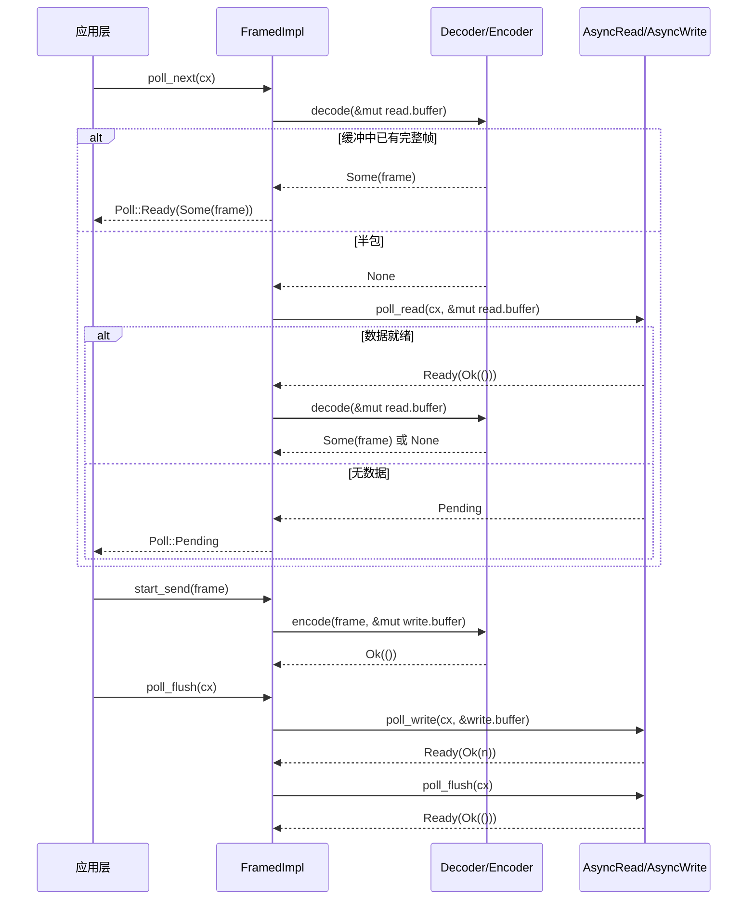

# Capítulo 10: Abstração de I/O em streaming: AsyncRead/AsyncWrite e framework de codec

O capítulo anterior desmontou o processo de expansão do tokio-macros, vimos como #[tokio::main], select!, join! assumem do usuário o código boilerplate e a validação em tempo de compilação. Mas o que as macros geram ainda são Futures comuns e chamadas poll — quando esses Futures realmente começam a ler e escrever bytes, as abstrações de baixo nível fornecidas pelo Tokio são apenas dois traits: AsyncRead e AsyncWrite. O problema deles é serem "baixo nível demais": um poll_read apenas garante "leu alguns bytes", não garante "leu uma mensagem completa". E a grande maioria dos protocolos (HTTP, Redis, gRPC, RPC personalizado) é orientada a "frames" e não a "fluxos de bytes". A pergunta central que este capítulo quer responder é: onde deve ser traçada a fronteira da abstração de I/O assíncrono? A resposta do Tokio tem duas camadas: tokio::io fornece traits e utilitários no nível de fluxo de bytes (BufReader/BufWriter/copy_bidirectional), e o framework codec do tokio-util fornece, sobre isso, adaptação Stream/Sink no nível de frames (Framed/LengthDelimitedCodec). Entender a divisão de trabalho dessas duas camadas é entender "por que quase todas as implementações de protocolo começam com Framed".

# I. AsyncRead/AsyncWrite: por que não é possível reutilizar diretamente std::io::Read

## Modelo intuitivo

`std::io::Read::read`é "retirada bloqueante": você fica na janela e, se a mercadoria não chegou, espera indefinidamente, e a thread é suspensa.`AsyncRead::poll_read`é "retirada com senha de retirada": você pergunta "já está pronto?", se não estiver (`Poll::Pending`) vai fazer outra coisa, e ao mesmo tempo deixa um Waker para o sistema te avisar quando a mercadoria chegar. Sem esse trait, todo I/O assíncrono teria que registrar manualmente`epoll`e mapear Waker — que é exatamente o que o Reactor do Capítulo 5 faz, e`AsyncRead`é a fachada unificada que ele expõe para as camadas superiores.

## Estrutura de dados e layout de memória

`AsyncRead`A definição é extremamente enxuta, com apenas um método:

```rust
pub trait AsyncRead {
    fn poll_read(
        self: Pin,
        cx: &mut Context,
        buf: &mut ReadBuf,
    ) -> Poll>;
}
```

[FACT:tokio/src/io/async_read.rs:44-60]

Os três parâmetros têm suas particularidades.`self: Pin<&mut Self>`em vez de`&mut self`: porque`AsyncRead`frequentemente é mantido por Futures gerados por`async fn`, e um Future, uma vez polled, não pode ser movido (auto-referência),`Pin`é um contrato imposto pelo compilador.`cx: &mut Context<'_>`carrega o Waker, é o canal de transmissão do "retirador de refeição".`buf: &mut ReadBuf<'_>`é o encapsulamento do Tokio para`&mut [u8]`— ele registra simultaneamente "comprimento preenchido" e "capacidade não inicializada", evitando`std::io::Read`Aquele tipo de ambiguidade de "retornar o número de bytes lidos mas o buffer pode estar não inicializado".

A documentação lista explicitamente três semânticas de retorno[FACT:tokio/src/io/async_read.rs:15-32]：`Ready(Ok(()))`indica que os dados foram escritos`buf`, a quantidade lida é determinada pelo incremento do comprimento de`ReadBuf::filled`; se o incremento for 0, ou é EOF, ou é`buf.remaining() == 0`(buffer com capacidade zero);`Pending`indica que atualmente não é legível mas o despertar já foi registrado;`Ready(Err(e))`é um erro de I/O subjacente. Aqui há uma armadilha facilmente ignorada:**"quantidade lida igual a 0" não é equivalente a EOF**— se o chamador passar um buffer de capacidade zero,`poll_read`retornará imediatamente`Ready(Ok(()))`mas nada foi lido. Se a camada superior tratar "0 bytes" como EOF, julgará erroneamente que a conexão foi fechada.

## Walkthrough orientado por cenário: ler um trecho de bytes de`&[u8]`Considere a implementação mais simples — para

o`&[u8]`de`AsyncRead`：

```rust
impl AsyncRead for &[u8] {
    fn poll_read(
        mut self: Pin,
        _cx: &mut Context,
        buf: &mut ReadBuf,
    ) -> Poll> {
        let amt = std::cmp::min(self.len(), buf.remaining());
        let (a, b) = self.split_at(amt);
        buf.put_slice(a);
        *self = b;
        Poll::Ready(Ok(()))
    }
}
```

[FACT:tokio/src/io/async_read.rs:98-108]

Análise passo a passo:`self.len()`é o comprimento restante da slice não lida,`buf.remaining()`é a capacidade restante do buffer de destino, pegue o menor valor entre os dois`amt`。`split_at(amt)`divida a slice em "o`a`a ser copiado nesta vez" e "o`b`」。`buf.put_slice(a)`restante a ser lido"`a`copie`ReadBuf`para`*self = b`e avance seu ponteiro filled.`&[u8]`avance a própria slice para a parte restante — esta é a chave de`self`como "cursor": após cada poll,`Ready(Ok(()))`aponta para a parte não lida. Por fim retorne`Pending`。

, porque a slice de memória está sempre "pronta", nunca`_cx`Observe que`Pending`é ignorado: fontes de dados em memória não precisam de Waker. Isso contrasta com sockets de rede — estes, quando não há dados, retornam

`io::Cursor<T>`e registram interesse de legibilidade.[FACT:tokio/src/io/async_read.rs:113-134]A implementação de`position()`adiciona uma camada extra de verificação de limites`pos > slice.len()`: primeiro obtenha`Ready(Ok(()))`, se[FACT:tokio/src/io/async_read.rs:113-134](posição fora dos limites) retorne diretamente`Cursor`sem panic`set_position`. Este é um design defensivo:

## a position de

`AsyncRead`pode ser definida para qualquer valor por`Box<T>`、`&mut T`、`Pin<P>`externo, e tratar fora dos limites como "já lido até o fim" é mais compatível com a semântica de I/O do que panic.`deref_async_read!`Reflexão de design: propagação de macros deref e Pin[FACT:tokio/src/io/async_read.rs:64-70]fornece`Pin::new(&mut **self).poll_read(cx, buf)`para`Pin<&mut Box<T>>`implementações de encaminhamento. As duas primeiras geram`Pin<&mut T>`através da macro`Pin<P>`, o núcleo é[FACT:tokio/src/io/async_read.rs:87-93]— desreferenciar`crate::util::pin_as_deref_mut(self)`para`Pin<&mut Pin<P>>`e então encaminhar.`Pin<&mut P::Target>`A implementação de`Pin`é mais sutil

> **[Design Inference & Architectural Trade-offs]**
> , projetando`Box<dyn AsyncRead>`、`&mut T`como`poll_read`. Esta camada de projeção é necessária, caso contrário`Pin`aninhados causariam incompatibilidade de tipos.

---

# 〔Inferência de design e trade-offs arquiteturais〕

## A motivação de design aqui é "abstração de custo zero": implementações de encaminhamento permitem que

`copy_bidirectional`e outros tipos wrapper não precisem escrever manualmente`copy`, mantendo ao mesmo tempo`select!`semanticamente correto. O custo é que cada camada de encaminhamento introduz uma chamada indireta, que o compilador geralmente consegue eliminar por inlining.`select!`II. copy_bidirectional: a máquina de estados do encaminhamento bidirecional`copy_bidirectional`Modelo intuitivo

## é um "garçom bidirecional": ele observa simultaneamente as duas direções A→B e B→A, e assim que um lado lê dados, escreve no lado oposto. Sem ele, implementar um proxy TCP exigiria escrever manualmente dois

Futures e combiná-los com

```rust
enum TransferState {
    Running(CopyBuffer),
    ShuttingDown(u64),
    Done(u64),
}
```

[FACT:tokio/src/io/util/copy_bidirectional.rs:10-14]

`Running`(capítulo 9) faria com que dados "lidos pela metade e então cancelados" fossem perdidos.`CopyBuffer`usa uma máquina de estados explícita para preservar os estados intermediários de "ler-escrever-fechar", tornando-se cancel safe.`ShuttingDown(u64)`Estrutura de dados e layout de memória`Done(u64)`O núcleo é um enum de três estados:**cópia**。

`CopyBuffer`contém`copy.rs`(incluindo buffer de 8KB e contadores de leitura/escrita), indicando "transferindo dados".`DEFAULT_BUF_SIZE`carrega o número de bytes já copiados, indicando "o lado de leitura já atingiu EOF, fechando o lado de escrita".[FACT:tokio/src/io/util/copy_bidirectional.rs:76-88]indica "fechamento concluído, registrando o número final de bytes". Este enum é a chave da cancel safety:`CopyBuffer`a qualquer momento em que for dropado, o estado é preservado no enum, e o próximo poll pode continuar do ponto de interrupção

## vem de

`copy_bidirectional_impl`, o tamanho padrão é determinado por`poll_fn`(8KB)

```rust
let mut a_to_b = TransferState::Running(a_to_b_buffer);
let mut b_to_a = TransferState::Running(b_to_a_buffer);
poll_fn(|cx| {
    let a_to_b = transfer_one_direction(cx, &mut a_to_b, a, b)?;
    let b_to_a = transfer_one_direction(cx, &mut b_to_a, b, a)?;
    let a_to_b = ready!(a_to_b);
    let b_to_a = ready!(b_to_a);
    Poll::Ready(Ok((a_to_b, b_to_a)))
})
.await
```

[FACT:tokio/src/io/util/copy_bidirectional.rs:127-151]

independente, portanto o custo de memória é 16KB.`transfer_one_direction`Walkthrough orientado por cenário: o ciclo de vida completo de um encaminhamento bidirecional`Poll`。`ready!`usa`Pending`para combinar as máquinas de estado das duas direções:**cópia**Observe a ordem de chamada de[FACT:tokio/src/io/util/copy_bidirectional.rs:143-144]: primeiro avance a→b, depois avance b→a, ambos retornam`ready!`A macro retorna imediatamente quando qualquer direção não terminou`Done(count)`— mas

`transfer_one_direction`o estado da outra direção já foi avançado`loop`. É exatamente isso que o comentário enfatiza

```rust
loop {
    match state {
        TransferState::Running(buf) => {
            let count = ready!(buf.poll_copy(cx, r.as_mut(), w.as_mut()))?;
            *state = TransferState::ShuttingDown(count);
        }
        TransferState::ShuttingDown(count) => {
            ready!(w.as_mut().poll_shutdown(cx))?;
            *state = TransferState::Done(*count);
        }
        TransferState::Done(count) => return Poll::Ready(Ok(*count)),
    }
}
```

[FACT:tokio/src/io/util/copy_bidirectional.rs:29-42]

`Running`retorne antecipadamente, a outra direção ainda retornará`poll_copy`no próximo poll, sem perder progresso.`ShuttingDown`。`ShuttingDown`Internamente,`poll_shutdown`é um`Done`。`Done`, avançando por estado:

cópia

```mermaid
flowchart TD
    start["transfer_one_direction 进入 loop"] --> match_state{"当前 TransferState?"}
    match_state -->|Running| poll_copy["buf.poll_copy(cx, r, w)"]
    poll_copy --> copy_ready{"poll_copy 结果?"}
    copy_ready -->|Pending| ret_pending["返回 Poll::Pending状态保持 Running"]
    copy_ready -->|Err| ret_err["返回 Poll::Ready(Err)错误向上传播"]
    copy_ready -->|Ok(count)| to_shutdown["state = ShuttingDown(count)"]
    to_shutdown --> match_state
    match_state -->|ShuttingDown| poll_shutdown["w.poll_shutdown(cx)"]
    poll_shutdown --> shutdown_ready{"shutdown 结果?"}
    shutdown_ready -->|Pending| ret_pending2["返回 Poll::Pending状态保持 ShuttingDown"]
    shutdown_ready -->|Err| ret_err
    shutdown_ready -->|Ok| to_done["state = Done(count)"]
    to_done --> match_state
    match_state -->|Done| ret_done["返回 Poll::Ready(Ok(count))"]
```

## chama

> **[Design Inference & Architectural Trade-offs]**
> chama`transfer_one_direction`para fechar o lado de escrita (enviar FIN), e após concluir muda para`async fn`retorna diretamente o contador.`CopyBuffer`O fluxograma abaixo mostra a lógica de avanço e os ramos de erro da máquina de estados unidirecional:`copy_bidirectional`cópia**Reflexão de design: por que usar uma máquina de estados explícita em vez de async fn**〔Inferência de design e trade-offs arquiteturais〕`async fn`Se`select!`fosse escrito como`TransferState`, o compilador geraria um Future cujo estado interno (`poll_fn`, contador já copiado) ficaria oculto na máquina de estados gerada. Isso não é problema no uso unidirecional, mas

precisa, em`poll_copy`um mesmo ciclo de poll`Err`avançar simultaneamente as duas direções — se usar dois`?`mais[FACT:tokio/src/io/util/copy_bidirectional.rs:32], quando uma direção terminar a outra será dropada, e seu buffer interno e contador serão perdidos, violando a cancel safety. Um[FACT:tokio/src/io/util/copy_bidirectional.rs:67-70]explícito expõe o estado na pilha,**e a cada nova entrada o estado ainda está lá, garantindo "recuperação do ponto de interrupção após cancelamento".**No tratamento de erros,`copy_bidirectional`o

`copy_bidirectional_with_sizes`retornado por[FACT:tokio/src/io/util/copy_bidirectional.rs:99-125]será propagado imediatamente para cima através de`poll_copy`Sempre retorna`Ready(Ok(0))`é erroneamente considerado EOF, formando um busy loop.

---

# Três, Framed: dividindo o fluxo de bytes em frames

## Modelo intuitivo

`Framed`é a "máquina de salsichas": a montante é um fluxo contínuo de água (`AsyncRead`/`AsyncWrite`), a jusante são segmentos de salsicha cortados (`Stream<Item = Frame>` / `Sink<Frame>`）。`Decoder`é responsável por "cortar um segmento do fluxo de água",`Encoder`é responsável por "embrulhar um segmento em fluxo de água". Se não houver`Framed`, cada implementação de protocolo teria que escrever manualmente "gerenciamento de buffer + tratamento de meio pacote + divisão de pacotes colados" — exatamente o trabalho repetitivo que o framework codec visa eliminar.

## Estrutura de dados e layout de memória

`Framed`em si é apenas um invólucro fino:

```rust
pub struct Framed {
    #[pin]
    inner: FramedImpl
}
```

[FACT:tokio-util/src/codec/framed.rs:38-41]

O estado real está em`FramedImpl`do`state: RWFrames`, contendo`read: ReadFrame`e`write: WriteFrame`duas partes.`ReadFrame`Os campos de`with_capacity`são visíveis em[FACT:tokio-util/src/codec/framed.rs:107-126]：`eof: bool`(se a extremidade de leitura está em EOF),`is_readable: bool`(se o interesse de leitura já foi registrado),`buffer: BytesMut`(buffer de leitura),`has_errored: bool`(se já ocorreu erro, para evitar leitura repetida).`WriteFrame`Campos[FACT:tokio-util/src/codec/framed.rs:119-122]：`buffer: BytesMut`(buffer de escrita),`backpressure_boundary: usize`(limite de backpressure).

`backpressure_boundary`é a chave do mecanismo de backpressure: quando o buffer de escrita excede esse limite,`poll_ready`retornará`Pending`até que os dados sejam descarregados, aplicando assim backpressure ao`Sink`a montante. Por padrão é igual a`capacity` [FACT:tokio-util/src/codec/framed.rs:121], pode ser ajustado através de`set_backpressure_boundary`ajustar[FACT:tokio-util/src/codec/framed.rs:271-273]。

## Walkthrough orientado a cenários: lendo um frame do socket

`Framed`O`Stream`da implementação apenas encaminha para`FramedImpl::poll_next` [FACT:tokio-util/src/codec/framed.rs:309-311]. A lógica real está em`FramedImpl`(este capítulo não fornece esse arquivo, mas pode-se inferir a cadeia de chamadas a partir da`Framed`interface):

1. `poll_next`Primeiro verifica`read.buffer`se já existe um frame completo (chamando`codec.decode`）；

2. Se`decode`retornar`Some(frame)`, produz diretamente, sem tocar no I/O subjacente;

3. Se retornar`None`(meio pacote), verifica`read.eof`: se já está em EOF e o buffer não está vazio, indica que há dados residuais que não podem ser decodificados, retorna erro ou`None`；

4. Caso contrário, chama o`AsyncRead::poll_read`subjacente para ler mais bytes em`read.buffer`；

5. Os bytes lidos tentam novamente`decode`, em loop até produzir um frame ou`Pending`。

Esta ordem de "primeiro decode depois read" é importante: garante que**um read pode produzir múltiplos frames**(pacotes colados), e**um frame pode abranger múltiplos reads**(meio pacote).`is_readable`O flag evita registrar repetidamente o interesse de leitura — se o poll anterior já registrou e não está pronto, desta vez retorna diretamente`Pending`sem chamar repetidamente o subjacente.

`Sink`Cadeia de chamadas da implementação[FACT:tokio-util/src/codec/framed.rs:315-338]：`start_send`chama`codec.encode(item, &mut write.buffer)`para codificar o frame no buffer de escrita;`poll_flush`descarrega`write.buffer`para o`AsyncWrite`；`poll_ready`subjacente verifica`write.buffer.len() >= backpressure_boundary`, se exceder o limite, faz flush primeiro e depois retorna pronto.

O diagrama de sequência abaixo mostra`Framed`a colaboração entre componentes em uma ida e volta de "ler frame - escrever frame":



## Cancel safety: aviso da documentação do Framed

`Framed`A documentação de[FACT:tokio-util/src/codec/framed.rs:23-30]：`SinkExt::send`lista especificamente a semântica de cancel safety`select!`Se em**for completado primeiro por outro branch,**a mensagem é garantidamente não enviada, mas a mensagem em si é perdida`send`— porque`poll_ready`internamente primeiro`start_send`depois`poll_ready`, se em`item`estágio for dropado,`StreamExt::next`já foi consumido mas não codificado. Enquanto

> **[Design Inference & Architectural Trade-offs]**
> 〔Inferência de design e trade-offs arquiteturais〕`read.buffer`Esta assimetria origina-se da diferença entre os caminhos de leitura e escrita: o estado do caminho de leitura (`Framed`) é mantido dentro de`next`, ser dropado apenas abandona a ação de "obter frame", o buffer não é afetado; o estado do caminho de escrita (`item`pendente de envio) está na`send`pilha de Future, drop significa perda. Em código de produção, se usar`select!`dentro de`send`, deve garantir que a mensagem possa ser reenviada ou aceitar a perda.

## Reflexão de design:`into_parts`e`map_codec`

`Framed`fornecem`into_parts`/`from_parts`para "trocar codec mas manter o buffer"[FACT:tokio-util/src/codec/framed.rs:290-298] [FACT:tokio-util/src/codec/framed.rs:155-166]。`map_codec`é implementado com base neste par de métodos[FACT:tokio-util/src/codec/framed.rs:221-234]: primeiro`into_parts`separa`io`/`codec`/`read_buf`/`write_buf`, depois usa`map`função para converter o codec, finalmente`from_parts`recombina. Este design permite preservar dados já bufferizados durante atualizações de protocolo (como mudar de texto claro para TLS), evitando releitura.

`FramedParts`O`_priv: ()`campo[FACT:tokio-util/src/codec/framed.rs:373-375]é a técnica de "struct não exaustiva": campos privados impedem construção direta externa, forçando o uso de`new`/`from_parts`, permitindo assim adicionar campos no futuro sem quebrar compatibilidade.

---

# Quatro, LengthDelimitedCodec: máquina de estados para codec com prefixo de comprimento

## Modelo intuitivo

`LengthDelimitedCodec`é uma faca especializada para "cortar salsicha por comprimento": assume que cada frame tem um campo de comprimento de bytes fixos antes dele, primeiro lê o comprimento depois lê o payload. Sem ele, implementar um protocolo com prefixo de comprimento exigiria escrever manualmente a máquina de estados "ler 4 bytes → analisar comprimento → ler N bytes → loop" — exatamente o que seu`DecodeState`interno faz.

## Estrutura de dados e layout de memória

```rust
pub struct LengthDelimitedCodec {
    builder: Builder,
    state: DecodeState,
}

enum DecodeState {
    Head,
    Data(usize),
}
```

[FACT:tokio-util/src/codec/length_delimited.rs:451-457]

`DecodeState`é uma máquina de estados explícita:`Head`indica "está lendo o campo de comprimento",`Data(n)`indica "já analisou o comprimento n, está lendo o payload". Este estado persiste entre`decode`chamadas, portanto**em cenários de meio pacote o progresso não é perdido**。

`Builder`mantém toda a configuração[FACT:tokio-util/src/codec/length_delimited.rs:416-435]：`max_frame_len`(padrão 8MB),`length_field_len`(padrão 4 bytes),`length_field_offset`(padrão 0),`length_adjustment`(padrão 0),`num_skip`(padrão`None`, ou seja`offset + len`）、`length_field_is_big_endian`(padrão true).

## Walkthrough orientado a cenários: decodificando um frame com prefixo de comprimento

`decode`é a entrada da máquina de estados:

```rust
fn decode(&mut self, src: &mut BytesMut) -> io::Result> {
    let n = match self.state {
        DecodeState::Head => match self.decode_head(src)? {
            Some(n) => {
                self.state = DecodeState::Data(n);
                n
            }
            None => return Ok(None),
        },
        DecodeState::Data(n) => n,
    };

    match self.decode_data(n, src) {
        Some(data) => {
            self.state = DecodeState::Head;
            src.reserve(self.builder.num_head_bytes().saturating_sub(src.len()));
            Ok(Some(data))
        }
        None => Ok(None),
    }
}
```

[FACT:tokio-util/src/codec/length_delimited.rs:579-603]

`Head`No estado, chama`decode_head`. Se retornar`None`(dados insuficientes), retorna diretamente`Ok(None)`aguardando mais dados; se retornar`Some(n)`, o estado muda para`Data(n)`。`Data`No estado, pega n diretamente. Depois chama`decode_data(n, src)`: se o buffer já tem n bytes,`split_to(n)`corta o frame, o estado volta para`Head`, e reserva espaço para o próximo cabeçalho de frame; caso contrário retorna`None`aguardando.

`decode_head`é a lógica central de análise:

```rust
let head_len = self.builder.num_head_bytes();
let field_len = self.builder.length_field_len;

if src.len()  self.builder.max_frame_len as u64 {
        return Err(io::Error::new(
            io::ErrorKind::InvalidData,
            LengthDelimitedCodecError { _priv: () },
        ));
    }

    let n = n as usize;
    let n = if self.builder.length_adjustment  n,
        None => {
            return Err(io::Error::new(
                io::ErrorKind::InvalidInput,
                "provided length would overflow after adjustment",
            ));
        }
    }
};

src.advance(self.builder.get_num_skip());
src.reserve(n.saturating_sub(src.len()));
Ok(Some(n))
```

[FACT:tokio-util/src/codec/length_delimited.rs:504-562]

Análise passo a passo: primeiro verifica`src.len() >= head_len`, se insuficiente retorna`None` [FACT:tokio-util/src/codec/length_delimited.rs:499-502]. Usa`Cursor`para envolver`src`a fim de`advance`/`get_uint`operar sem consumir o buffer original.`advance(length_field_offset)`Pula o prefixo do cabeçalho[FACT:tokio-util/src/codec/length_delimited.rs:517]. Lê conforme endianness`field_len`o valor de comprimento de bytes[FACT:tokio-util/src/codec/length_delimited.rs:520-524]。

**Defesa crítica**: se`n > max_frame_len`, retorna imediatamente`InvalidData`erro[FACT:tokio-util/src/codec/length_delimited.rs:526-531]. Isso impede que um par malicioso envie um frame com "campo de comprimento de 4GB" causando esgotamento de memória — esta é a superfície de ataque DoS mais clássica de protocolos com prefixo de comprimento.

O ajuste de comprimento usa`checked_sub`/`checked_add`em vez de operação bruta[FACT:tokio-util/src/codec/length_delimited.rs:537-541], retorna em caso de overflow`InvalidInput`erro em vez de panic.`get_num_skip()`Retorna`num_skip`ou o padrão`offset + len` [FACT:tokio-util/src/codec/length_delimited.rs:1070-1073], ignorando o restante do cabeçalho. Por fim,`reserve(n.saturating_sub(src.len()))`reserva espaço para o payload[FACT:tokio-util/src/codec/length_delimited.rs:559]——usa-se`saturating_sub`porque`src`pode já conter parte do payload.

O fluxograma abaixo mostra`decode`o caminho de decisão completo:

```mermaid
flowchart TD
    entry["decode(src)"] --> check_state{"self.state?"}
    check_state -->|Head| head["decode_head(src)"]
    head --> head_result{"结果?"}
    head_result -->|Ok(None)| ret_none1["返回 Ok(None)等待更多数据"]
    head_result -->|Err| ret_err1["返回 Err长度超限或溢出"]
    head_result -->|Ok(Some(n))| set_data["state = Data(n)"]
    set_data --> decode_data
    check_state -->|Data(n)| decode_data["decode_data(n, src)"]
    decode_data --> data_result{"src.len() >= n?"}
    data_result -->|否| ret_none2["返回 Ok(None)等待更多数据"]
    data_result -->|是| split["src.split_to(n)state = Headreserve 下一帧头部"]
    split --> ret_frame["返回 Ok(Some(frame))"]
```

## Reflexão de design: recorte e proteção contra overflow de max_frame_len

`Builder::adjust_max_frame_len`Ao construir o codec,`max_frame_len`é recortado para o valor máximo que o campo de comprimento pode representar[FACT:tokio-util/src/codec/length_delimited.rs:1075-1081]。`max_allowed_frame_len`calcula`max_length_field_value + length_adjustment` [FACT:tokio-util/src/codec/length_delimited.rs:1083-1089], onde`max_length_field_value`usa`checked_shl`para tratar`length_field_len == 8`o overflow de deslocamento em[FACT:tokio-util/src/codec/length_delimited.rs:1091-1096]. Esse recorte impede configurações contraditórias como "campo de comprimento de 2 bytes mas max_frame_len definido como 1MB" — 2 bytes representam no máximo 65535, e após o recorte max_frame_len passa a ser 65535.

Proteção simétrica no caminho de codificação:`encode`verifica`n > max_frame_len`retorna`InvalidInput` [FACT:tokio-util/src/codec/length_delimited.rs:607-607], o ajuste de comprimento também usa`checked_add`/`checked_sub` [FACT:tokio-util/src/codec/length_delimited.rs:620-631]. Note que a direção do ajuste na codificação é oposta à da decodificação: na decodificação é "comprimento lido ± adjustment = comprimento do payload", na codificação é "comprimento do payload ∓ adjustment = campo de comprimento escrito"[FACT:tokio-util/src/codec/length_delimited.rs:620-624]。

> **[Design Inference & Architectural Trade-offs]**
> Esse design simétrico de "somar na decodificação, subtrair na codificação" serve para unificar a semântica de`length_adjustment`: ele representa "a diferença entre o valor do campo de comprimento e o comprimento do payload". Quando o campo de comprimento do protocolo inclui o cabeçalho (como no Example 3),`adjustment = -2`, na decodificação`n - (-2) = n + 2`obtém o comprimento do payload, na codificação`payload - (-2) = payload + 2`escreve de volta no campo de comprimento.

---

# Reflexão de design: os três níveis da fronteira de abstração

Revisando este capítulo, a abstração de I/O do Tokio apresenta uma estrutura clara de três camadas:

**Primeira camada: traits de fluxo de bytes (`AsyncRead`/`AsyncWrite`）**. Promete apenas "ler/escrever alguns bytes", sem garantir fronteiras de frame. Esta é a interface mínima, que qualquer fonte de I/O (socket, arquivo, slice de memória) pode implementar. O custo é que a camada superior precisa lidar sozinha com pacotes parciais/colados.

**Segunda camada: utilitários de fluxo de bytes (`BufReader`/`BufWriter`/`copy_bidirectional`）**. Fornece, sobre os traits, capacidades genéricas como "reduzir chamadas de sistema" e "encaminhamento bidirecional".`copy_bidirectional`A máquina de estados explícita de

**demonstra como a "cancel safety" é implementada na camada de utilitários — o estado é mantido na pilha, não dentro do Future.`Framed`/`Decoder`/`Encoder`）**Terceira camada: adaptação de frames (`Stream<Frame>`/`Sink<Frame>`. Eleva o fluxo de bytes a`LengthDelimitedCodec`, permitindo que a implementação do protocolo se preocupe apenas com "codificação/decodificação de frames" em vez de "gerenciamento de buffer".`DecodeState`é o exemplo padrão desta camada, e sua`max_frame_len`máquina de estados e

> **[Design Inference & Architectural Trade-offs]**
> 〔Inferência de design e trade-offs arquiteturais〕`tokio-util`A divisão nessas três camadas não é acidental: ela corresponde a três gradientes de "vazamento de abstração". Quanto mais baixo o nível, mais genérico mas mais difícil de usar; quanto mais alto, mais fácil de usar mas mais especializado. O Tokio escolheu colocar o "frame" como cidadão de primeira classe em`tokio`em vez do núcleo de`tokio`, porque a definição de frame varia por protocolo——`tokio-util`fornece apenas fluxo de bytes,`Decoder`/`Encoder`。

---

# fornece o framework de frames, e protocolos específicos (HTTP/Redis/gRPC) implementam

- `AsyncRead::poll_read`em seus respectivos crates`Pin<&mut Self>` + `Context` + `ReadBuf`Resumo do capítulo`std::io::Read::read`usa`Ready(Ok(()))`três parâmetros em vez de
- `copy_bidirectional`, transformando "espera bloqueante" em "registrar Waker + retornar Pending".`TransferState`e quando a quantidade lida é 0, é preciso distinguir EOF de buffer de capacidade zero.`Running`/`ShuttingDown`/`Done`usa`select!`enum de três estados (
- `Framed`) para salvar o estado intermediário, permitindo que o encaminhamento bidirecional se recupere mesmo sob cancelamento de`AsyncRead`/`AsyncWrite`. Quando ocorre erro, parte dos dados pode ser perdida.`Stream`/`Sink`，`ReadFrame`/`WriteFrame`adapta`SinkExt::send`para`StreamExt::next`gerenciando separadamente buffers de leitura/escrita e backpressure.
- `LengthDelimitedCodec`não é cancel safe (perda de mensagens),`DecodeState`（`Head`/`Data(n)`é cancel safe.`max_frame_len`usa`checked_add`/`checked_sub`) máquina de estados para lidar com pacotes parciais,

# protege o campo de comprimento contra DoS,

Q1: `copy_bidirectional`protege contra overflow de ajuste.`transfer_one_direction`Reflexões e autoavaliação do capítulo`TransferState::ShuttingDown`No`ready!(w.as_mut().poll_shutdown(cx))?`de`*state = TransferState::Done(*count)`, se o

**do branch**：`poll_shutdown`for alterado para diretamente`Done`(pulando o shutdown), em quais cenários a conexão do par não conseguirá fechar normalmente?`read`Análise de referência`ShuttingDown`A função de[FACT:tokio/src/io/util/copy_bidirectional.rs:35-39]é enviar um pacote FIN ao par, notificando "não tenho mais dados do meu lado". Se pulá-lo e ir direto para`poll_shutdown`, o lado de escrita não será fechado, e o par ficará esperando dados indefinidamente, formando uma "conexão half-open" — o par pode bloquear para sempre em`Pending`até o timeout. Em cenários de proxy TCP, isso causa vazamento de conexões: o cliente já desconectou, mas a conexão do proxy com o backend permanece. No código-fonte, a existência do estado`ready!`serve

Q2: `LengthDelimitedCodec::decode_head`justamente para garantir o fechamento explícito do lado de escrita após EOF. Note que`if n > self.builder.max_frame_len as u64`em si pode retornar[FACT:tokio-util/src/codec/length_delimited.rs:526-531](como buffer de envio cheio), então é preciso usar`0xFFFFFFFF`para aguardar em vez de ignorar.`length_adjustment`Em

**, se a verificação**de`n`for removida`usize`, que consequências um cliente malicioso enviando um cabeçalho de frame com campo de comprimento`decode_data`。`decode_data`(4GB) causaria? Por que essa verificação deve vir antes de`src.len() < n`?`None`Análise de referência`decode_head`: removida a verificação,`src.reserve(n.saturating_sub(src.len()))` [FACT:tokio-util/src/codec/length_delimited.rs:559]seria convertido para`length_adjustment`e passado para`length_adjustment`verifica`-2`retorna`0xFFFFFFFF - 2`, mas o`checked_sub`no final de

Até aqui, esclarecemos as duas camadas de abstração do Tokio entre fluxos de bytes e quadros de mensagem: tokio::io é responsável pelo transporte de bytes, e o framework codec do tokio-util é responsável pela segmentação de quadros e codificação/decodificação. O motivo pelo qual Framed se torna o ponto de partida para implementações de protocolo é justamente porque encapsula a necessidade de alta frequência de "ler uma mensagem completa" em uma adaptação reutilizável de Stream/Sink. Mas quadros são apenas contêineres de dados; quando o protocolo precisa lidar com conjuntos dinâmicos de tarefas, cancelamento estruturado ou composições de streaming mais complexas, apenas Framed não é suficiente. O próximo capítulo entrará nos mecanismos de extensão do tokio-stream e tokio-util, para ver como os combinadores do StreamExt, StreamMap/JoinSet/TaskTracker e CancellationToken reutilizam o Waker subjacente e o mecanismo de agendamento, fornecendo ferramentas de nível superior para iteração assíncrona e gerenciamento de tarefas.
