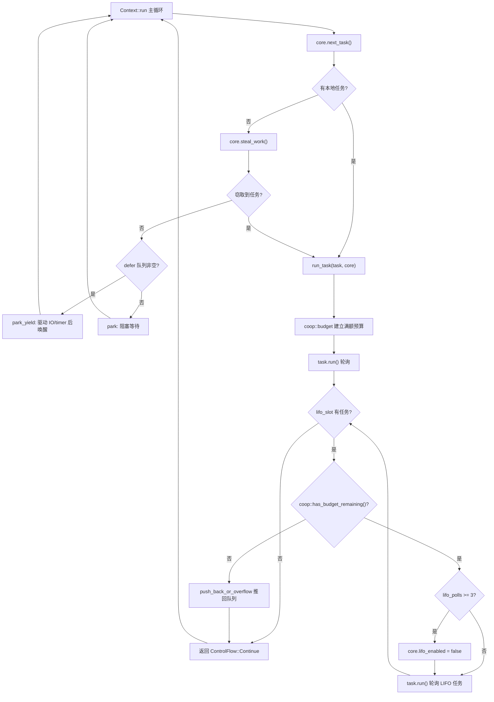

# Capítulo 12: Agendamento cooperativo e orçamento: como o mecanismo coop impede que tarefas matem o agendador

No capítulo anterior, vimos como tokio-stream e tokio-util reutilizam o Waker e o mecanismo de agendamento subjacentes para estender as capacidades centrais. Mas não importa quantos combinadores sejam criados, a contradição central do runtime assíncrono sempre existe: o agendador precisa distribuir o tempo de CPU de forma justa entre várias tarefas, e as tarefas em si não são preemptivas — uma vez que o poll de um Future começa a executar, o agendador não consegue interrompê-lo externamente. Se uma tarefa processa cem mil mensagens em loop dentro de um único poll, ou faz await repetidamente em um Future sempre pronto dentro de um loop, ela monopoliza a worker thread e faz com que outras tarefas na mesma thread nunca tenham chance de serem polladas. Esse é o clássico problema da "tarefa que mata o agendador". A solução do Tokio não é preempção, mas cooperação: cada tarefa recebe um orçamento limitado dentro de um ciclo de agendamento, operações de recursos consomem esse orçamento, e quando ele se esgota a tarefa deve ceder voluntariamente. Este capítulo aprofunda a implementação desse mecanismo coop.

# 12.1 O portador do orçamento: armazenamento local de thread e a estrutura Budget

> **[Design Inference & Architectural Trade-offs]**
> Se compararmos o agendador ao único garçom de um restaurante, e as tarefas a clientes que não param de pedir pratos, então o orçamento coop é a regra de "cada cliente pode pedir no máximo N pratos" — o garçom não precisa interromper o cliente à força, basta dizer "descanse um pouco enquanto atendo o próximo" depois que o cliente atinge N pedidos. Sem essa regra, um cliente tagarela pode paralisar o restaurante inteiro.

O orçamento precisa satisfazer duas restrições: primeiro, ele deve poder ser acessado a partir de uma pilha de chamadas`poll`de qualquer profundidade, sem precisar passar parâmetros camada por camada; segundo, ele deve conseguir distinguir "se atualmente estamos dentro do runtime do Tokio" — fora do runtime, ao chamar`block_on`não deve estar sujeito à restrição de orçamento. O Tokio escolheu usar**armazenamento local de thread (TLS)**para carregar o orçamento, e gerenciá-lo de forma unificada através do módulo`context`.

O tipo central do orçamento é`coop::Budget`. Embora o trecho de código-fonte deste capítulo não forneça diretamente a definição completa de`coop.rs`, a partir dos pontos de uso de`worker.rs`é possível inferir seu contrato de interface:

[FACT:tokio/src/runtime/scheduler/multi_thread/worker.rs:695-795]

```rust
coop::budget(|| {
    // ... 轮询任务 ...
    task.run();
    // ...
    loop {
        // ...
        if !coop::has_budget_remaining() {
            // 预算耗尽，把 LIFO 任务推回队列
            core.run_queue.push_back_or_overflow(task, ...);
            return ControlFlow::Continue(core);
        }
        // ...
    }
})
```

Aqui aparecem três APIs principais:`coop::budget(closure)`estabelece um escopo de orçamento,`coop::has_budget_remaining()`consulta o orçamento restante, e, como veremos adiante,`coop::stop()`e`coop::set()`。`budget`A semântica é: ao entrar no closure, o orçamento da thread atual é redefinido para um valor cheio (padrão 128); durante a execução do closure, todas as operações de recursos compartilham essa cota; ao sair do closure, o orçamento externo é restaurado.

> **[Design Inference & Architectural Trade-offs]**
> O valor de orçamento 128 é um valor empírico: é grande o suficiente para que um loop normal de processamento de mensagens (por exemplo, processar algumas dezenas de mensagens em um poll) não dispare cedências com frequência; e pequeno o suficiente para que um loop descontrolado execute no máximo 128 operações de recursos antes de ser obrigado a ceder, mantendo a latência em uma faixa aceitável.

`Budget`No TLS, normalmente existe na forma de`Cell<Option<Budget>>`.`Option`A semântica externa de`None`é "se a thread atual está no contexto do runtime do Tokio":`block_on`indica que não está dentro do runtime (por exemplo,

# fora do runtime), e nesse caso todas as verificações de orçamento são liberadas diretamente.

12.2 Os pontos de consumo do orçamento: como as operações de recursos o debitam**O orçamento não é consumido do nada; somente**operações de recursos`send`/`recv`o debitam. As chamadas operações de recursos são aquelas APIs que interagem com o mundo externo e podem ser chamadas em loops infinitos — o`yield_now`de channel, leitura e escrita de I/O,`mpsc::Sender::reserve`etc. Tomando

[FACT:tokio/src/sync/mpsc/bounded.rs:1272-1311]

```rust
async fn reserve_inner(&self, n: usize) -> Result> {
    crate::trace::async_trace_leaf().await;

    if n > self.max_capacity() {
        return Err(SendError(()));
    }
    // ... WakeReceiverOnDrop guard ...
    let guard = WakeReceiverOnDrop { chan: &self.chan };
    let result = self.chan.semaphore().semaphore.acquire(n).await;
    // ...
}
```

`reserve_inner`Copiar`crate::trace::async_trace_leaf()`Antes de realmente adquirir a permissão do semáforo,`async_trace_leaf`passa por`coop::poll_proceed`. Essa chamada, que aparentemente serve apenas para tracing, na verdade é um dos pontos de ancoragem do débito de orçamento.`Proceed`Internamente,`Pending`chama uma função do tipo

: se o orçamento for suficiente, debita 1 e retorna**; se o orçamento estiver esgotado, registra uma ação de "ceder" — entrega o Waker da tarefa atual ao agendador, retorna`Pending`**, e faz a tarefa terminar antecipadamente neste poll.`Pending`É aqui que está a sutileza do coop:

`yield_now`o esgotamento do orçamento não lança erro, mas disfarça a "cedência" como um**comum. O Future superior, ao ver**：

[FACT:tokio/src/task/yield_now.rs:38-60]

```rust
pub async fn yield_now() {
    let mut yielded = false;
    poll_fn(|cx| {
        ready!(crate::trace::trace_leaf());

        if yielded {
            return Poll::Ready(());
        }

        yielded = true;

        // Don't wake the task immediately, as that would push it right back
        // onto the run queue and it could be polled again before other tasks
        // or the IO/timer driver get a chance to run. Instead, hand the waker
        // to the scheduler, which wakes deferred tasks only after it has run
        // out of ready tasks and polled the driver. When polled from outside
        // a Tokio runtime, the waker is woken immediately.
        context::defer(cx.waker());

        Poll::Pending
    })
    .await
}
```

é a expressão mais direta do mecanismo de orçamento: ele não consome orçamento, mas`context::defer(cx.waker())`dispara ativamente a cedência`wake`Copiar**Observe a linha**. Ela não chama

diretamente, mas entrega o Waker à`Context`fila defer

[FACT:tokio/src/runtime/scheduler/multi_thread/worker.rs:247-257]

```rust
pub(crate) struct Context {
    worker: Arc,
    core: RefCell>>,
    /// Tasks to wake after resource drivers are polled. This is mostly to
    /// handle yielded tasks.
    pub(crate) defer: Defer,
}
```

`defer`A fila defer é definida no

[FACT:tokio/src/runtime/scheduler/multi_thread/worker.rs:613-621]

```rust
} else {
    // Wait for work
    core = if !self.defer.is_empty() {
        self.park_yield(core)
    } else {
        self.park(core)
    };
    core.stats.start_processing_scheduled_tasks();
}
```

Se a fila de defer não estiver vazia, o worker chama`park_yield`——com timeout 0 para park, o que impulsiona I/O e timer, e então desperta as tarefas em defer. Isso garante que a tarefa que "cedeu" seja reagendada somente após o driver ter executado.

# 12.3 Estabelecimento e restauração do escopo de orçamento: run_task e block_in_place

O escopo de orçamento é estabelecido em`run_task`. Quando cada tarefa é pollada,`coop::budget`envolve todo o processo de poll:

[FACT:tokio/src/runtime/scheduler/multi_thread/worker.rs:691-704]

```rust
// Make the core available to the runtime context
*self.core.borrow_mut() = Some(core);

// Run the task
coop::budget(|| {
    // ...
    task.run();
    // ...
})
```

`coop::budget`Na entrada, define o orçamento no TLS como cheio; na saída, restaura. Isso significa que**cada tarefa recebe um orçamento totalmente novo a cada poll**. Independentemente de quantas`await`operações de recursos a tarefa execute internamente, desde que em um único`poll`o consumo exceda 128, ela será forçada a ceder.

Mas há um problema sutil aqui: tarefas no LIFO slot são polladas**dentro do mesmo`budget`closure**. Veja o loop de`run_task`:

[FACT:tokio/src/runtime/scheduler/multi_thread/worker.rs:709-750]

```rust
let mut lifo_polls = 0;

// As long as there is budget remaining and a task exists in the
// `lifo_slot`, then keep running.
loop {
    let mut core = match self.core.borrow_mut().take() {
        Some(core) => core,
        None => {
            return ControlFlow::Break(());
        }
    };

    let task = match core.lifo_slot.take() {
        Some(task) => task,
        None => {
            self.reset_lifo_enabled(&mut core);
            core.stats.end_poll();
            return ControlFlow::Continue(core);
        }
    };

    if !coop::has_budget_remaining() {
        core.stats.end_poll();
        // Not enough budget left to run the LIFO task, push it to
        // the back of the queue and return.
        core.run_queue.push_back_or_overflow(task, ...);
        debug_assert!(core.lifo_enabled);
        return ControlFlow::Continue(core);
    }
    // ...
}
```

Ponto-chave: tarefas no LIFO slot**compartilham o orçamento da tarefa externa**. O comentário no início de`run_task`já diz: "Tasks from the LIFO slot inherit the "parent"'s limits". Isso é um design intencional — se cada tarefa LIFO resetasse o orçamento, então no cenário ping-pong (tarefa A desperta B, B desperta A), as duas tarefas se agendariam mutuamente infinitamente, o orçamento nunca seria resetado, e o problema de starvation continuaria. Compartilhar o orçamento significa que A e B juntas consomem no máximo 128 operações de recursos, após o que devem ceder.

O próprio LIFO slot também tem um limitador independente`MAX_LIFO_POLLS_PER_TICK`：

[FACT:tokio/src/runtime/scheduler/multi_thread/worker.rs:756-766]

```rust
// Disable the LIFO slot if we reach our limit
//
// In ping-ping style workloads where task A notifies task B,
// which notifies task A again, continuously prioritizing the
// LIFO slot can cause starvation as these two tasks will
// repeatedly schedule the other. To mitigate this, we limit the
// number of times the LIFO slot is prioritized.
if lifo_polls >= MAX_LIFO_POLLS_PER_TICK {
    core.lifo_enabled = false;
    super::counters::inc_lifo_capped();
}
```

`MAX_LIFO_POLLS_PER_TICK`O valor de é 3:

[FACT:tokio/src/runtime/scheduler/multi_thread/worker.rs:263-263]

```rust
/// Value picked out of thin-air. Running the LIFO slot a handful of times
/// seems sufficient to benefit from locality. More than 3 times probably is
/// over-weighting. The value can be tuned in the future with data that shows
/// improvements.
const MAX_LIFO_POLLS_PER_TICK: usize = 3;
```

Esta é**a segunda linha de defesa**: mesmo que o orçamento ainda não tenha se esgotado, o LIFO slot será desabilitado após ser priorizado 3 vezes consecutivas, e as tarefas subsequentes vão para a fila normal. O orçamento controla o "total de operações de recursos", o limitador LIFO controla o "número de vezes que o mesmo par de tarefas se desperta mutuamente", os dois são complementares.

O escopo de orçamento tem uma exceção importante em`block_in_place`.`block_in_place`transfere o worker core para outra thread, e a thread atual entra em estado de bloqueio. Código bloqueante não está sujeito ao orçamento, então é necessário**pausar**o orçamento:

[FACT:tokio/src/runtime/scheduler/multi_thread/worker.rs:406-417]

```rust
if had_entered {
    // Unset the current task's budget. Blocking sections are not
    // constrained by task budgets.
    let _reset = Reset {
        take_core,
        budget: coop::stop(),
    };

    crate::runtime::context::exit_runtime(f)
} else {
    f()
}
```

`coop::stop()`retorna o orçamento atual e o define como`None`(ou seja, "fora do runtime"),`Reset`o`Drop`de restaura após o término do bloqueio:

[FACT:tokio/src/runtime/scheduler/multi_thread/worker.rs:374-397]

```rust
impl Drop for Reset {
    fn drop(&mut self) {
        with_current(|maybe_cx| {
            if let Some(cx) = maybe_cx {
                if self.take_core {
                    let core = cx.worker.core.take();
                    // ...
                    *cx_core = core;
                }

                // Reset the task budget as we are re-entering the
                // runtime.
                coop::set(self.budget);
            }
        });
    }
}
```

`coop::set(self.budget)`restaura o orçamento previamente`stop()`salvo. Assim,`block_in_place`código bloqueante síncrono dentro de não consome orçamento, nem dispara falsamente uma cessão por esgotamento de orçamento; após o término do bloqueio, a tarefa continua a execução com o orçamento restante original.

A figura abaixo mostra o fluxo de controle completo desde o agendamento da tarefa até a cessão por esgotamento de orçamento:



Na figura, podem-se ver dois caminhos de cessão: quando o orçamento se esgota, a tarefa LIFO é empurrada de volta para a fila (`push_back_or_overflow`), e quando o LIFO é priorizado consecutivamente além do limite, o LIFO slot é desabilitado. Ambos retornam ao loop principal, dando ao worker a oportunidade de processar outras tarefas ou o driver.

# 12.4 Reflexões de design, recuperação de erros e armadilhas em produção

**Por que usar TLS em vez de passagem explícita de parâmetros?**Os pontos de verificação de orçamento estão espalhados profundamente em vários módulos como channel, I/O, time, etc. Se passados explicitamente, cada API precisaria de um parâmetro`Budget`adicional, poluindo toda a interface pública. O TLS torna o orçamento completamente transparente para o código de negócio, ao custo de um acesso TLS por verificação. O Tokio usa`#[thread_local]`ou TLS rápido específico da plataforma para reduzir essa sobrecarga.

**Interação entre esgotamento de orçamento e cancel safety.**Quando o esgotamento de orçamento faz com que`reserve_inner`retorne`Pending`, a tarefa pode estar em algum branch de`select!`. Se nesse momento outro branch estiver pronto,`select!`cancela o branch atual —`reserve_inner`o`WakeReceiverOnDrop`guard de verifica no drop se "o semáforo está fechado e ocioso" e desperta o receptor:

[FACT:tokio/src/sync/mpsc/bounded.rs:1286-1299]

```rust
struct WakeReceiverOnDrop {
    chan: &'a chan::Tx,
}

impl Drop for WakeReceiverOnDrop {
    fn drop(&mut self) {
        use chan::Semaphore;

        let semaphore = self.chan.semaphore();
        if semaphore.is_closed() && semaphore.is_idle() {
            self.chan.wake_rx();
        }
    }
}
```

A existência deste guard mostra que: o`Pending`disparado pelo orçamento e o verdadeiro "sem permissão"`Pending`devem se comportar de forma consistente no caminho de cancelamento, caso contrário o receptor pode nunca receber a notificação de "channel fechado".

**Armadilha em produção: latência oculta causada por esgotamento de orçamento.**Um fenômeno comum é: uma tarefa de repente fica mais lenta para processar mensagens, mas o uso de CPU não é alto. Ao investigar, é fácil suspeitar de contenção de lock ou I/O, mas na verdade pode ser que a tarefa tenha processado mais de 128 mensagens em um único poll, disparando cessão de orçamento, e cada cessão passa por um ciclo completo de "empurrar de volta para a fila → reagendar → poll do driver". Se o processamento de mensagens em si é rápido, essa sobrecarga de agendamento pode representar uma proporção alta. A solução é dividir o processamento em lote em múltiplas`spawn`tarefas, ou inserir explicitamente`yield_now`。

**no loop. Fronteira entre orçamento e`block_in_place`.**Vimos anteriormente que`block_in_place`faz`coop::stop()`pausar o orçamento. Mas atenção:`coop::stop()`só é chamado quando`had_entered`é verdadeiro, ou seja, somente pausa quando está de fato na thread do worker do runtime. Se`block_in_place`for chamado fora do runtime,`f()`executa diretamente, e o estado do orçamento não muda. Essa verificação de branch é feita em`maybe_move_runtime`:

[FACT:tokio/src/runtime/scheduler/multi_thread/worker.rs:424-464]

```rust
with_current(|maybe_cx| {
    match (
        crate::runtime::context::current_enter_context(),
        maybe_cx.is_some(),
    ) {
        (context::EnterRuntime::Entered { .. }, true) => {
            had_entered = true;
        }
        (
            context::EnterRuntime::Entered {
                allow_block_in_place,
            },
            false,
        ) => {
            if allow_block_in_place {
                had_entered = true;
                return Ok(());
            } else {
                return Err(
                    "can call blocking only when running on the multi-threaded runtime",
                );
            }
        }
        (context::EnterRuntime::NotEntered, true) => {
            return Ok(());
        }
        (context::EnterRuntime::NotEntered, false) => {
            return Ok(());
        }
    }
    // ...
})
```

As quatro combinações correspondem a: dentro da thread do worker,`block_on`entrada do thread pool de`block_in_place`, aninhado

> **[Design Inference & Architectural Trade-offs]**
> **〔Inferência de design e trade-offs arquiteturais〕**O valor do orçamento não é configurável.`Builder`opção. Isso é intencional: o valor do orçamento afeta o equilíbrio entre justiça de agendamento e throughput; se os usuários pudessem ajustá-lo livremente, seria fácil configurar algo como "orçamento grande demais causando starvation" ou "orçamento pequeno demais causando explosão de overhead de agendamento". O Tokio escolhe tratá-lo como uma invariante interna.

# Resumo do capítulo

O mecanismo coop resolve o problema de justiça do agendador não preemptivo com um design de três camadas:

1. **Portador do orçamento**：`coop::Budget`existe no TLS,`Option`a camada externa distingue dentro e fora do runtime,`coop::budget`estabelece um escopo com cota cheia,`coop::stop`/`coop::set`suporta pausa e retomada (`block_in_place`cenários).

2. **Pontos de consumo**: operações de recursos (envio/recepção em channel, I/O,`yield_now`) através de`coop::poll_proceed`decrementam o orçamento; ao esgotá-lo, disfarçam o "ceder" como`Pending`, de forma transparente para o negócio.

3. **Caminho de cessão**：`yield_now`através de`context::defer`entrega o Waker à fila defer, garantindo que só haja reagendamento após o driver fazer polling; tarefas no LIFO slot compartilham o orçamento da tarefa pai e têm`MAX_LIFO_POLLS_PER_TICK = 3`de limitação independente.

A percepção-chave desse mecanismo é:**justiça não exige preempção, basta fazer com que o "loop infinito" seja interrompido naturalmente após um número finito de passos**. O orçamento é justamente a medida desse "número finito de passos".

# Reflexões e autoavaliação do capítulo

Q1: Se em`run_task`o`coop::budget`loop LIFO dentro do closure fosse alterado para chamar`coop::budget`para redefinir o orçamento antes de cada polling de tarefa LIFO, o que aconteceria no cenário ping-pong (tarefa A acorda B, B acorda A)? Por que o código-fonte escolhe fazer as tarefas LIFO compartilharem o orçamento da tarefa pai?

**Análise de referência**: o código-fonte em`run_task`comenta explicitamente "Tasks from the LIFO slot inherit the "parent"'s limits"[FACT:tokio/src/runtime/scheduler/multi_thread/worker.rs:679-682]. Se cada tarefa LIFO redefinisse o orçamento, então no cenário ping-pong A→B→A→B, cada polling obteria cota cheia de orçamento, e as duas tarefas poderiam se agendar mutuamente indefinidamente, nunca cedendo por esgotamento de orçamento. Embora`MAX_LIFO_POLLS_PER_TICK = 3`a limitação desative o LIFO slot após 3 vezes[FACT:tokio/src/runtime/scheduler/multi_thread/worker.rs:756-766], depois de desativar o LIFO as tarefas passam pela fila normal; se houver apenas A e B na fila, elas ainda serão alternadamente agendadas, apenas sem a prioridade LIFO. O orçamento compartilhado, porém, garante no total de operações de recursos: A e B juntos podem consumir no máximo 128 operações de recursos antes de precisarem ceder, dando oportunidade a outras tarefas e ao driver. As duas linhas de defesa são complementares e ambas indispensáveis.

Q2: `yield_now`usa`context::defer(cx.waker())`em vez de`cx.waker().wake_by_ref()`. Suponha que se altere`defer`para`wake`diretamente; no cenário de worker único com múltiplas tarefas, o que aconteceria se uma tarefa chamasse repetidamente`yield_now`em um loop? Analise em conjunto com o branch`park_yield`do loop principal do worker.

**Análise de referência**：`yield_now`os comentários explicam o motivo: wake direto empurraria a tarefa imediatamente de volta à fila de execução, podendo fazer com que ela fosse pollada novamente antes de o driver de I/O/timer rodar[FACT:tokio/src/task/yield_now.rs:49-54]. No cenário de worker único, se a tarefa repetidamente`yield_now`em um loop e a cada vez fizesse wake direto, o`next_task`do loop principal do worker pegaria imediatamente essa tarefa e faria polling de novo,`park_yield`o branch (responsável por acionar I/O e timer)[FACT:tokio/src/runtime/scheduler/multi_thread/worker.rs:613-621]nunca seria executado, porque a fila defer estaria vazia e a fila local sempre teria tarefas. O resultado é que eventos de I/O e timers nunca seriam processados, e todo o runtime ficaria "falso vivo" — as tarefas rodam, mas eventos do mundo externo não conseguem avançar.`defer`A fila garante que uma tarefa que cedeu só seja acordada depois do polling do driver, dando assim uma janela de execução ao driver.

Q3: `block_in_place`em`coop::stop()`define o orçamento como`None`，`Reset::drop`em`coop::set(self.budget)`restaura. Se dentro do closure`block_in_place`de`f`houver novamente uma chamada a`block_in_place`(aninhada), como ficaria o estado do orçamento?`maybe_move_runtime`Qual branch de

**trata esse caso?**Análise de referência`block_in_place`: aninhamento de`maybe_move_runtime`é tratado pelo`(context::EnterRuntime::NotEntered, true)`branch em[FACT:tokio/src/runtime/scheduler/multi_thread/worker.rs:454-458]. Esse branch diretamente`return Ok(())`, sem definir`had_entered`, portanto o`block_in_place`do`if had_entered`externo é avaliado como falso e não chama novamente`coop::stop()`nem cria um novo`Reset`. O comentário explica "This is a nested call to block_in_place (we already exited). All the necessary setup has already been done." — a camada externa já pausou o orçamento e transferiu o core; a camada interna só precisa executar diretamente`f()`. Se a camada interna chamasse novamente`coop::stop()`, salvaria de novo um orçamento que já é`None`,`Reset::drop`e na restauração poderia restaurar um valor errado (`None`em vez do orçamento original da camada externa), causando perda permanente do orçamento, e todas as operações de recursos subsequentes da tarefa ficariam sem restrição.

O mecanismo coop, por meio da restrição de orçamento, faz as tarefas cederem ativamente durante operações de recursos, mantendo assim a justiça de agendamento sob o modelo não preemptivo. Mas o Pending disparado pelo esgotamento do orçamento deve se comportar de forma consistente com uma espera real no caminho de cancelamento; caso contrário, combinadores como select! quebrarão a consistência de estado. O próximo capítulo entrará em armadilhas de produção e condições de contorno: cancel safety, propagação de panic e ordem de shutdown; veremos mais casos desse tipo, em que "mecanismos aparentemente não relacionados se acoplam nas bordas".
