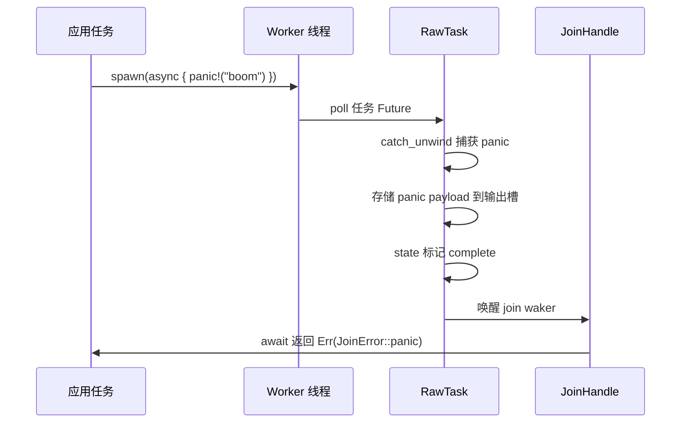
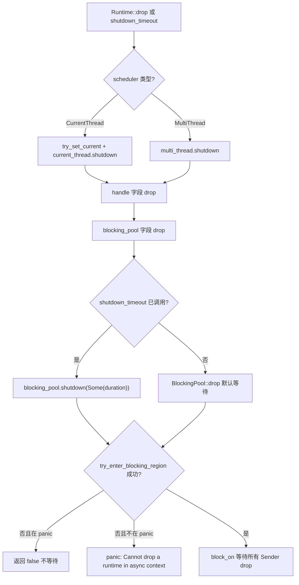
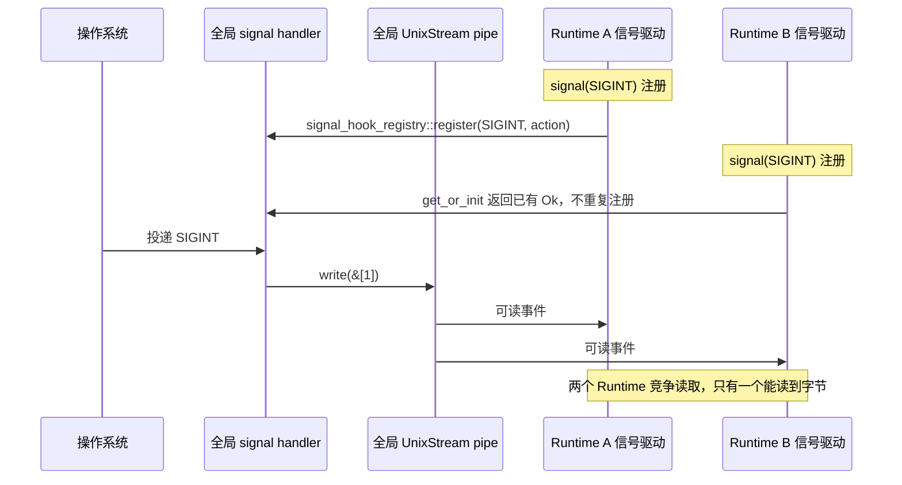

# Capítulo 13: Armadilhas de produção e condições de contorno: cancel safety, propagação de panic e ordem de shutdown

No capítulo anterior, analisamos o orçamento de cooperação do coop: cada tarefa tem apenas um orçamento limitado dentro de um ciclo de agendamento e, quando esgotado, deve ceder, evitando assim que uma única tarefa faça as outras passarem fome. Mas o mecanismo de orçamento resolve apenas o problema de "agendamento justo"; em ambientes de produção reais há também uma categoria mais sutil de armadilhas — segurança de cancelamento, propagação de panic e ordem de encerramento. Quando select! cancela um Future, quando um panic de tarefa é capturado, quando o Runtime começa a encerrar, o comportamento de fronteira do código muitas vezes contradiz a intuição. Este capítulo começa pela segurança de cancelamento e primeiro examina o que exatamente se perde em um Future descartado.

# 13.2 Propagação de panic: como JoinError captura falhas

## Modelo intuitivo

Um panic de tarefa do Tokio não faz o processo inteiro falhar (a menos que panic=abort), mas é capturado, empacotado como`JoinError`e retornado via`JoinHandle::await`É como um acidente em uma estação da linha de montagem de uma fábrica: a rede de segurança segura o trabalhador, mas o produto é descartado — você recebe um "relatório de acidente" em vez do produto.

## Estrutura de dados e estados

`JoinHandle<T>`O`Future::Output`de`super::Result<T>`é`Result<T, JoinError>` [FACT:tokio/src/runtime/task/join.rs:325]。`JoinError`ou seja,

```rust
let join_handle = tokio::spawn(async { panic!("boom"); });
let err = join_handle.await.unwrap_err();
assert!(err.is_panic());
```

[FACT:tokio/src/runtime/task/join.rs:121-127]

Copiar`RawTask`O mecanismo pelo qual o panic é capturado está no caminho de poll de`catch_unwind`quando a tarefa faz poll, ela é envolvida por`JoinHandle::poll`após o panic ocorrer, o payload é armazenado no slot de saída da tarefa, o estado é marcado como complete e então o join waker é acordado.`try_read_output`O que é lido via`Err(JoinError::panic(payload))`。

## é



Copiar`JoinError`Ponto-chave: o payload do panic é preservado integralmente,`std::error::Error`implementa`into_panic()`e é possível recuperar`Box<dyn Any + Send>`via`downcast_ref::<&str>()`e então extrair a mensagem do panic com

## Reflexões de design e armadilhas

**Armadilha 1:`JoinHandle`O`UnwindSafe`de**

```rust
impl UnwindSafe for JoinHandle {}
impl RefUnwindSafe for JoinHandle {}
```

[FACT:tokio/src/runtime/task/join.rs:176-181]

Copiar`T: UnwindSafe`Esta é uma implementação incondicional e não exige`JoinHandle`Motivo:`T`，`T`em si não mantém`catch_unwind`na alocação de tarefa no heap, durante o panic já foi isolado por`T`Portanto, mesmo que`UnwindSafe`，`JoinHandle`não seja

**também é seguro.**Armadilha 2: panic não se propaga automaticamente para a tarefa pai.`JoinHandle`Se a tarefa A fez spawn da tarefa B e B sofreu panic, A não será notificada automaticamente, a menos que A tenha feito await no

**de B. Se A não fez await, o panic de B é silenciosamente engolido. Esta é uma das fontes de bugs mais sutis em ambientes de produção.`spawn_blocking`Armadilha 3:**O panic de`catch_unwind`também é capturado.`Mutex`Os workers do pool de threads bloqueantes também envolvem a tarefa com`std::sync::Mutex`após o panic a thread não morre, mas volta ao pool para continuar pegando trabalho. Porém, se você mantém

**em uma tarefa bloqueante e não o libera durante o panic, isso causa envenenamento de lock — este é o comportamento inerente de**e o Tokio não interfere.`catch_unwind`Armadilha 4: panic durante o drop do Runtime.

# Se uma tarefa sofre panic durante o drop do Runtime,

## ainda tem efeito, mas nesse momento o join waker pode já estar inválido e o payload do panic será descartado. Este é um subconjunto do problema de ordem de encerramento, que será expandido na próxima seção.

13.3 Ordem de encerramento: limpeza de threads bloqueantes e recursos de I/O

## Modelo intuitivo

`Runtime`O encerramento do Runtime é como fechar um restaurante: primeiro a recepção para de aceitar clientes (para de aceitar novas tarefas), depois espera a cozinha terminar os pratos em andamento (tarefas assíncronas executam até o próximo ponto de yield) e, por fim, espera os ajudantes terceirizados terminarem (threads bloqueantes retornam). Se a ordem estiver errada, surgem problemas — por exemplo, se os ajudantes forem dispensados primeiro, os pratos da cozinha nunca ficarão prontos.

```rust
pub struct Runtime {
    scheduler: Scheduler,
    handle: Handle,
    blocking_pool: BlockingPool,
}
```

[FACT:tokio/src/runtime/runtime.rs:97-106]

`Drop`Os três campos de

```rust
impl Drop for Runtime {
    fn drop(&mut self) {
        match &mut self.scheduler {
            Scheduler::CurrentThread(current_thread) => {
                let _guard = context::try_set_current(&self.handle.inner);
                current_thread.shutdown(&self.handle.inner);
            }
            Scheduler::MultiThread(multi_thread) => {
                multi_thread.shutdown(&self.handle.inner);
            }
        }
    }
}
```

[FACT:tokio/src/runtime/runtime.rs:506-521]

Copiar`Drop`Implementação de`scheduler`，**Copiar`blocking_pool`**。`blocking_pool`Observação:`Drop`trata apenas de`Runtime::drop`não trata explicitamente de`scheduler` → `handle` → `blocking_pool`O encerramento de

ocorre em seu próprio`shutdown_timeout`após

```rust
pub fn shutdown_timeout(mut self, duration: Duration) {
    self.handle.inner.shutdown();
    self.blocking_pool.shutdown(Some(duration));
}
```

[FACT:tokio/src/runtime/runtime.rs:457-461]

Portanto, o pool bloqueante é o último a ser encerrado.`handle.inner.shutdown()`Mas`blocking_pool.shutdown(Some(duration))`controla explicitamente a ordem:`duration`。

## Copiar

`blocking/shutdown.rs`Primeiro

```rust
pub(super) struct Sender {
    _tx: Arc>,
}

pub(super) struct Receiver {
    rx: oneshot::Receiver,
}
```

[FACT:tokio/src/runtime/blocking/shutdown.rs:13-19]

espera pelas tarefas bloqueantes, no máximo`Sender`Mecanismo de baixo nível do encerramento do pool bloqueante`Arc<oneshot::Sender>`usa um engenhoso oneshot channel:`Sender`Copiar`Receiver`Cada worker bloqueante mantém um`wait`clone (internamente é

```rust
pub(crate) fn wait(&mut self, timeout: Option) -> bool {
    use crate::runtime::context::try_enter_blocking_region;

    if timeout == Some(Duration::from_nanos(0)) {
        return false;
    }

    let mut e = match try_enter_blocking_region() {
        Some(enter) => enter,
        _ => {
            if std::thread::panicking() {
                return false;
            } else {
                panic!(
                    "Cannot drop a runtime in a context where blocking is not allowed. \
                    This happens when a runtime is dropped from within an asynchronous context."
                );
            }
        }
    };

    if let Some(timeout) = timeout {
        e.block_on_timeout(&mut self.rx, timeout).is_ok()
    } else {
        let _ = e.block_on(&mut self.rx);
        true
    }
}
```

[FACT:tokio/src/runtime/blocking/shutdown.rs:37-70]

são dropados,

1. `timeout == Some(0)`recebe a notificação.`shutdown_background`Método

2. `try_enter_blocking_region()`Copiar`None`。

Análise passo a passo:

retorna false diretamente — este é o caminho de`block_on_timeout`sem esperar.

## tenta entrar na região bloqueante. Se estiver atualmente em um contexto assíncrono (por exemplo, drop do Runtime dentro de uma tarefa async), retorna



## 4. Com timeout, usa

**e retorna false ao expirar; sem timeout, espera indefinidamente.**A mensagem de erro é bem clara: «Cannot drop a runtime in a context where blocking is not allowed»[FACT:tokio/src/runtime/blocking/shutdown.rs:51-54]. A solução é usar`shutdown_background()`, que é equivalente a`shutdown_timeout(Duration::from_nanos(0))` [FACT:tokio/src/runtime/runtime.rs:494-496], sem esperar por tarefas bloqueantes.

**Armadilha 2:`shutdown_background`vai vazar tarefas bloqueantes.**A documentação avisa explicitamente «this may result in a resource leak (in that any blocking tasks are still running until they return)»[FACT:tokio/src/runtime/runtime.rs:470-472]. As tarefas bloqueantes continuarão a correr até retornarem naturalmente, mas o Runtime já foi dropado, e os recursos que elas detêm podem já ter expirado.

**Armadilha 3: Recursos de I/O tornam-se inválidos após o drop do Runtime.**A documentação indica «Once the runtime has been dropped, any outstanding I/O resources bound to it will no longer function»[FACT:tokio/src/runtime/runtime.rs:52-54]。`is_rt_shutdown_err`A função serve precisamente para detetar este tipo de erro[FACT:tokio/src/runtime/runtime.rs:585-593]。

**Armadilha 4:`Drop`espera indefinidamente por defeito.**A documentação refere «The`Drop` implementation waits forever for this」[FACT:tokio/src/runtime/runtime.rs:43-44]. Se uma tarefa bloqueante ficar presa (por exemplo, num ciclo infinito), o drop do Runtime ficará suspenso permanentemente. Em produção, deve usar-se`shutdown_timeout`para definir um limite.

# 13.4 Tratamento de sinais e conflitos entre múltiplos Runtimes

## Modelo intuitivo

Os sinais Unix são ao nível do processo, mas o`Signal`do Tokio está vinculado ao Runtime. É como se todo o edifício partilhasse um único alarme de incêndio, mas cada sala tivesse o seu próprio recetor — a primeira pessoa a instalar um recetor alterou a forma como o alarme está ligado, e as seguintes só podem partilhar essa alteração.

## Estruturas de dados e estado global

`signal_enable`é o ponto de entrada para registar handlers de sinais:

```rust
fn signal_enable(signal: SignalKind, handle: &Handle) -> io::Result {
    let signal = signal.0;
    if signal  slot,
        None => return Err(io::Error::other("signal too large")),
    };

    siginfo
        .init
        .get_or_init(|| {
            unsafe { signal_hook_registry::register(signal, move || action(globals, signal)) }
                .map(|_| ())
                .map_err(|e| e.raw_os_error())
        })
        .map_err(|e| {
            e.map_or_else(
                || Error::other("registering signal handler failed"),
                || Error::from_raw_os_error,
            )
        })
}
```

[FACT:tokio/src/signal/unix.rs:266-296]

Pontos-chave:

1. `signal <= 0 || FORBIDDEN.contains(&signal)`rejeita sinais inválidos.

2. `handle.check_inner()`verifica se o driver de sinais está em execução — se o Runtime já foi encerrado, isto falhará.

3. `siginfo.init.get_or_init(...)`usa`OnceLock`para garantir que cada sinal regista apenas uma vez o handler do SO.`get_or_init`O closure de chama`signal_hook_registry::register`, que é um registo global, ao nível do processo.

4. O handler registado é`action(globals, signal)`, que faz duas coisas:`globals.record_event(signal)`regista o evento e depois escreve um byte no pipe para acordar o driver[FACT:tokio/src/signal/unix.rs:252-259]。

## A raiz dos conflitos entre múltiplos Runtimes

`globals()`O que é retornado é o global ao nível do processo`Globals`，`OsExtraData`O`UnixStream`dentro de também é global:

```rust
pub(crate) struct OsExtraData {
    sender: UnixStream,
    pub(crate) receiver: UnixStream,
}
```

[FACT:tokio/src/signal/unix.rs:61-64]

`Default`A implementação cria um par`UnixStream` [FACT:tokio/src/signal/unix.rs:61-64]. Este pipe é globalmente único, e todos os drivers de sinais dos Runtimes o partilham.

O problema surge:`signal_enable`dentro de`handle.check_inner()`verifica o**Runtime atual**do driver de sinais. Mas o handler registado por`signal_hook_registry::register`é**ao nível do processo**, e escreve no**global**pipe. Se o Runtime A registar SIGINT primeiro, e depois o Runtime B também registar SIGINT,`get_or_init`retornará diretamente o`Ok(())`existente, sem registar novamente. Mas o driver de sinais do Runtime B lerá dados do pipe global — os dois Runtimes competirão pelos bytes do mesmo pipe.

## Walkthrough orientado a cenários: competição de sinais entre múltiplos Runtimes



## Reflexões de design e armadilhas

**Armadilha 1: O handler de sinais nunca é desinstalado.**A documentação avisa explicitamente «Once a signal handler is registered with the process the underlying libc signal handler is never unregistered»[FACT:tokio/src/signal/unix.rs:379-380]. Mesmo que a instância`Signal`seja dropada, os sinais subsequentes continuarão a ser capturados pelo Tokio, e o comportamento padrão não será restaurado[FACT:tokio/src/signal/unix.rs:338-340]。

**Armadilha 2: Os sinais são coalescidos.**A documentação indica «before`poll` is called, all signal notifications are coalesced into one item returned from `poll`」[FACT:tokio/src/signal/unix.rs:312-315]. Se receber 10 SIGINT mas só fizer poll uma vez, verá apenas um evento. Esta é uma característica dos próprios sinais Unix (sinais padrão não são enfileirados), o Tokio não faz coalescência adicional.

**Armadilha 3: Em múltiplos Runtimes, os sinais podem perder-se.**Como o pipe global é lido competitivamente por vários Runtimes, um Runtime pode consumir o byte enquanto outro nunca o recebe. Em produção, deve tratar-se os sinais num único Runtime, ou usar`signal_hook`para gerir manualmente.

**Armadilha 4:`signal`Condições de panic da função.**A documentação indica «This function panics if there is no current reactor set, or if the`rt` feature flag is not enabled」[FACT:tokio/src/signal/unix.rs:398-405]. Chamar`signal()`fora do Runtime causará panic.

**Armadilha 5:`recv()`Cancel safety de**A documentação garante «This method is cancel safe. If you use it as a branch in`tokio::select!` and another branch completes first, then it is guaranteed that no signal is lost」[FACT:tokio/src/signal/unix.rs:423-427]. Isto porque os eventos de sinais residem no global`EventInfo`,`recv()`apenas lê, não consome o estado subjacente.

# Reflexões de design

Os três temas deste capítulo partilham um padrão subjacente:**A propriedade do estado determina a segurança de cancelamento/encerramento/sinais**。

- `JoinHandle`é cancel-safe, porque a saída está no heap e o handle é apenas uma referência.
- A ordem de encerramento do Runtime é sensível, porque o pool de bloqueio e o scheduler partilham`Handle`, a ordem errada causará deadlock ou panic.
- Sinais com múltiplos Runtime entram em conflito, porque o handler e o pipe são estados globais em nível de processo, enquanto`Signal`é uma visão em nível de Runtime.

Depois de entender esse padrão, a lista de armadilhas a evitar pode ser resumida em três princípios:

1. **Cancelamento seguro = estado fora do Future.**Se o Future tiver um buffer interno, o drop perderá dados.`JoinHandle`、`Signal::recv`、`tokio::sync::mpsc::Receiver::recv`Todos satisfazem essa condição.

2. **Ordem de encerramento = ordem inversa da direção de dependência.**Quem depende de quem, encerre primeiro o dependido. O scheduler depende do driver de I/O, então encerre o scheduler primeiro; o pool de bloqueio é independente, encerre por último.

3. **Estado global = conflito entre múltiplas instâncias.**Qualquer recurso em nível de processo (signal handler, pipe, tabela de descritores de arquivo) entrará em conflito sob múltiplos Runtime; ou restrinja a um único Runtime, ou use sincronização externa.

# Resumo do capítulo

# Reflexões e autoavaliação do capítulo

Q1: Se removermos`JoinHandle::poll`de`coop::poll_proceed(cx)`, em quais cenários isso faria outras tarefas passarem fome? Por que`try_read_output`em si não consome orçamento?

**Análise de referência**：`coop::poll_proceed(cx)`consome o orçamento de cooperação em[FACT:tokio/src/runtime/task/join.rs:325-325]. Se for removido, uma tarefa que repetidamente`select!`múltiplos`JoinHandle`em um loop pode fazer polling infinito de todos os handles em um único ciclo de agendamento, nunca retornando`Pending`, fazendo assim outras tarefas no mesmo worker passarem fome.`try_read_output`em si não consome orçamento, porque é apenas uma leitura de memória + possível armazenamento de waker, não envolve I/O nem disputa de lock, e o custo é extremamente baixo. A intenção de design do mecanismo de orçamento é restringir "operações que podem rodar por muito tempo", e não cobrar a cada poll. Observe que`coop.made_progress()`só chama`ret.is_ready()`quando[FACT:tokio/src/runtime/task/join.rs:349-351], ou seja, só devolve o orçamento quando realmente obtém saída — isso é para evitar que operações de "fez polling mas não teve resultado" acumulem consumo de orçamento.

Q2：`blocking/shutdown.rs`No método`wait`de`try_enter_blocking_region()`, se`None`retornar`false`e atualmente estiver em panic, por que escolher retornar

**em vez de continuar esperando? O que aconteceria se fosse alterado para continuar esperando?**：`try_enter_blocking_region()`Análise de referência`None`retornar[FACT:tokio/src/runtime/blocking/shutdown.rs:44-57]indica que atualmente estamos em contexto assíncrono e não é permitido bloquear`false`. Se neste momento estiver em panic, o código escolhe retornar[FACT:tokio/src/runtime/blocking/shutdown.rs:47-49]sem esperar`block_on`. A razão é: um novo panic durante o unwinding de panic faz o processo abortar (double panic). Se fosse alterado para continuar esperando, seria necessário chamar`block_on`, e em contexto assíncrono`false`causaria panic — panic durante o unwinding de panic aborta diretamente o processo, perdendo todas as informações de diagnóstico. Retornar

permite que o drop continue até o fim, preservando as informações de panic. Este é um design de "degradação graciosa": um encerramento incompleto é melhor do que o processo quebrar.`Signal`Q3: Suponha que você criou`Signal`no Runtime A para escutar SIGTERM, e então moveu`signal_enable`para o Runtime B para fazer poll.`handle.check_inner()`Dentro de`Signal`, qual Runtime é verificado? Se o Runtime A for dropado primeiro, o

**no Runtime B ainda poderá receber sinais?**：`signal_enable`Análise de referência`signal()`é executado quando`handle`é chamado; neste momento[FACT:tokio/src/signal/unix.rs:398-405]。`check_inner()`é do Runtime A[FACT:tokio/src/signal/unix.rs:275]。`Signal`O que é verificado é o driver de sinais do Runtime A`RxFuture`Internamente é`watch::Receiver<()>` [FACT:tokio/src/signal/unix.rs:366-368], envolvendo`Globals`, e este receiver é registrado no global`EventInfo`em`record_event`. Se o Runtime A for dropado, seu driver de sinais para de ler dados do pipe global, mas o handler global ainda fará`EventInfo`e escreverá no pipe. Se o driver de sinais do Runtime B também estiver em execução, ele lerá os dados do pipe e disparará`Signal`, acordando assim o waker de`Signal` **. Portanto, o**no Runtime B pode`Signal`ainda receber sinais, mas depende de o Runtime B ter um driver de sinais em execução. Se o Runtime B não tiver driver de sinais (por exemplo, se o feature signal não estiver habilitado ou o driver já estiver fechado), ninguém lerá os dados do pipe,

# e nunca haverá wakeup. Essa é a fragilidade do tratamento de sinais com múltiplos Runtime.

Transição de fim de capítulo`catch_unwind`Cancelamento seguro, propagação de panic, ordem de encerramento, conflito de sinais — a raiz comum desses quatro problemas é a ambiguidade da "propriedade de estado" nas fronteiras assíncronas. O Tokio, ao colocar o estado no heap, gerenciar o ciclo de vida com contagem de referências, isolar panic com`Globals`e compartilhar estado de sinais com

global, oferece respostas utilizáveis em engenharia. Mas todas essas respostas têm condições de contorno, e o ambiente de produção deve tratá-las explicitamente.

Com isso, percorremos as áreas limítrofes mais propensas a erros no ambiente de produção do Tokio: a segurança de cancelamento depende de que a saída seja armazenada no heap e da atomicidade de try_read_output; JoinHandle::drop não cancela a tarefa, apenas abort realmente cancela, mas é ineficaz para spawn_blocking; panic capturado por catch_unwind é empacotado como JoinError e, se não for aguardado com await, é silenciosamente perdido; o encerramento do Runtime segue uma ordem estrita, e fazer drop em contexto async causa panic; signal handler é estado global em nível de processo e, uma vez registrado, nunca é desinstalado. Por trás dessas regras estão as repetidas ponderações do Tokio entre correção e desempenho. No próximo capítulo, sairemos dos mecanismos concretos para revisar, do ponto de vista arquitetural, a origem dessas ponderações e vislumbrar para onde io_uring, a refatoração dos drivers e a interface de executores personalizados levarão o Tokio.
