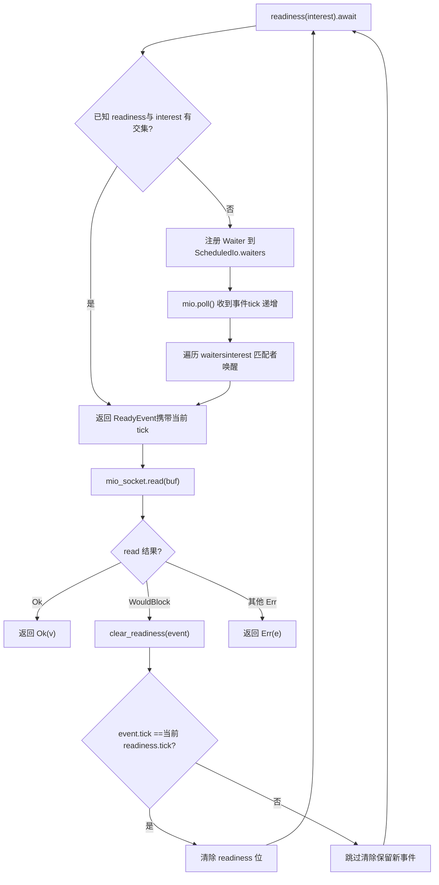
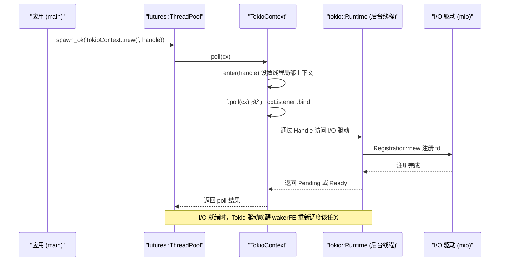

# Capítulo 14: Ponderações arquiteturais e evolução futura: de io_uring a drivers plugáveis

No capítulo anterior, examinamos quatro tipos de armadilhas de produção: segurança de cancelamento, propagação de panic, ordem de encerramento e conflitos de sinais. Embora pareçam dispersas, todas apontam para o mesmo problema arquitetural: como a propriedade de estado é claramente delimitada nas fronteiras assíncronas. E a forma de delimitar a propriedade é determinada precisamente por três decisões arquiteturais no nível mais baixo do runtime — como as tarefas são escalonadas, como os eventos de I/O são distribuídos e como a correção de concorrência é verificada. Este capítulo não mergulha nos detalhes de implementação de uma função específica, mas se posiciona no nível arquitetural para revisar as escolhas do Tokio nessas decisões e, seguindo as pistas de evolução já plantadas na documentação oficial e no código-fonte, ver para onde io_uring, a refatoração dos drivers e a interface de executores personalizados levarão o Tokio. Ao final deste capítulo, você deverá ser capaz de responder a uma questão prática: quando estender o Tokio e quando contorná-lo.

# I. Três ponderações históricas: por que é assim hoje

## Modelo intuitivo

Imagine o Tokio como um restaurante que já funciona há dez anos. A forma de organizar os turnos da cozinha (work-stealing), a estrutura independente dos garçons (separação entre driver de I/O e escalonador) e o sistema de inspeção sanitária da cozinha (verificação de concorrência com loom) não foram projetados no primeiro dia de funcionamento, mas evoluíram gradualmente no processo de "mais clientes, pratos mais complexos". Compreender essas evoluções é o que permite julgar quais designs são planejamento visionário e quais são fardos históricos.

## Ponderação 1: work-stealing em vez de fila global

> **[Design Inference & Architectural Trade-offs]**
> A implementação com fila global é a mais simples: todas as tarefas entram em uma`Mutex<VecDeque>`, e as threads worker disputam o lock para pegar tarefas. Mas a contenção de lock piora com o aumento do número de núcleos, e a localidade de cache é ruim — em qual núcleo uma tarefa é criada e em qual é executada é completamente aleatório.

A escolha do work-stealing é: cada worker mantém uma fila local,`spawn`prioriza entrar na fila local (sem lock, amigável ao cache), e só quando a local está vazia vai roubar do final da fila de outro worker. O custo é que o balanceamento de carga tem latência, e o roubo em si exige operações atômicas e barreiras de memória. O Tokio escolheu o segundo porque servidores modernos facilmente têm dezenas de núcleos, e o custo da contenção de lock é muito maior do que o custo ocasional do roubo.

> **[Design Inference & Architectural Trade-offs]**
> A condição de contorno dessa decisão é:**a granularidade das tarefas não pode ser muito fina**. Se cada tarefa executa apenas alguns microssegundos de trabalho, a proporção do custo de roubo e escalonamento fica fora de controle. É também por isso que o Tokio, além de`spawn_blocking`, exige que tarefas longas façam`yield_now()`ativamente — o escalonamento cooperativo, em essência, serve como rede de segurança para o work-stealing.

## Ponderação 2: driver de I/O independente do escalonador

Este é o ponto mais instigante do material de código-fonte deste capítulo. Veja a estrutura de módulos de`tokio/src/runtime/io/mod.rs`:

[FACT:tokio/src/runtime/io/mod.rs:5-22]

```rust
mod driver;
use driver::{Direction, Tick};
pub(crate) use driver::{Driver, Handle, ReadyEvent};

mod registration;
pub(crate) use registration::Registration;

mod registration_set;
use registration_set::RegistrationSet;

mod scheduled_io;
use scheduled_io::ScheduledIo;

mod metrics;
use metrics::IoDriverMetrics;

use crate::util::ptr_expose::PtrExposeDomain;
static EXPOSE_IO: PtrExposeDomain = PtrExposeDomain::new();
```

Observe que`driver`、`registration`、`scheduled_io`são três módulos independentes, e externamente expõem apenas os tipos`Driver`、`Handle`、`ReadyEvent`、`Registration`.`ScheduledIo`é`pub(crate)`— ele é envolvido por`PtrExposeDomain`, usado para expor ponteiros brutos à verificação de concorrência sob testes com loom.

> **[Design Inference & Architectural Trade-offs]**
> o runtime single-thread também precisa do driver de I/O, mas não precisa do escalonador work-stealing — a separação permite que os dois runtimes reutilizem a mesma implementação de I/O.`block_on` 单线程运行时也需要 I/O 驱动，但不需要 work-stealing 调度器——分离让两种运行时能复用同一套 I/O 实现。

## Ponderação 3: loom para verificação de modelo de concorrência

`tokio/src/loom/mod.rs`tem apenas 14 linhas, mas revela a estratégia de verificação de correção de concorrência do Tokio:

[FACT:tokio/src/loom/mod.rs:1-14]

```rust
//! This module abstracts over `loom` and `std::sync` depending on whether we
//! are running tests or not.

#![allow(unused)]

#[cfg(not(all(test, loom)))]
mod std;
#[cfg(not(all(test, loom)))]
pub(crate) use self::std::*;

#[cfg(all(test, loom))]
mod mocked;
#[cfg(all(test, loom))]
pub(crate) use self::mocked::*;
```

O ponto-chave está na condição`#[cfg(all(test, loom))]`: somente quando ambos os cfg`test`e`loom`estão ativados é que o módulo`mocked`substitui`std`. Isso significa que builds de produção não contêm código do loom, com zero overhead em tempo de execução.

> **[Design Inference & Architectural Trade-offs]**
> O valor do loom está em enumerar exaustivamente "todas as ordens possíveis de intercalação de threads". Como em`ScheduledIo`, a leitura-modificação-escrita de`AtomicUsize`,`Waiters`A inserção e remoção em listas encadeadas podem ser executadas um milhão de vezes em hardware real sem erros, mas o loom consegue construir em segundos uma intercalação que dispara a condição de corrida. O custo é a lentidão na execução dos testes e o alto consumo de memória, por isso só pode ser usado em testes unitários, nunca em produção.

## Reflexões de design

Esses três trade-offs têm uma característica em comum:**Todos escolheram a solução "mais complexa, porém mais escalável", e limitaram a complexidade ao interior**. A complexidade do work-stealing está escondida no escalonador, a complexidade do I/O driver está escondida em`ScheduledIo`, e a complexidade do loom está escondida nas condições de cfg. A API exposta externamente é sempre`spawn`、`TcpStream::read`essas interfaces simples.

> **[Design Inference & Architectural Trade-offs]**
> Este também é o primeiro critério para julgar "quando se deve estender o Tokio":**Se a sua necessidade pode ser expressa pela API existente, não mexa nas estruturas internas**. Assim que você começar a depender dos`pub(crate)`tipos de`tokio_unstable`ou dos cfg de

---

# , significa que você se amarrou à implementação interna do Tokio, e pagará um preço nas atualizações.

## Dois, refatoração do driver: de "um waker, uma direção" para "qualquer conjunto de interesses"

Modelo intuitivo`async fn read(&mut self)`Os primeiros tipos de I/O do Tokio tinham uma limitação rígida:`&mut self`exigia`tokio/docs/reactor-refactor.md`. É como um restaurante com apenas uma janela de retirada, onde só uma pessoa pode estar na fila por vez — porque o waker era armazenado dentro do recurso de I/O, e não no Future correspondente à operação.

## documenta completamente a causa dessa limitação e o plano de refatoração.

As dores da arquitetura antiga

[FACT:tokio/docs/reactor-refactor.md:16-20]

```rust
Currently, I/O types require `&mut self` for `async` functions. The reason for
this is the task's waker is stored in the I/O resource's internal state
(`ScheduledIo`) instead of in the future returned by the `async` function.
Because of this limitation, I/O types limit the number of wakers to one per
direction (a direction is either read-related events or write-related events).
```

> **[Design Inference & Architectural Trade-offs]**
> 〔Inferências de design e trade-offs arquiteturais〕`TcpStream`Armazenar o waker dentro do recurso significa que "uma direção só pode ter um esperante". Se você quiser ler e escrever no mesmo`split()`ao mesmo tempo, terá que dividir`TcpStream::split()`em duas metades, cada uma com seu próprio slot de waker. É por isso que

## existe — não é uma preferência de design de API, mas uma restrição direta da estrutura de dados interna.

Nova arquitetura: mover o waker para dentro do Future

[FACT:tokio/docs/reactor-refactor.md:22-25]

```rust
Moving the waker from the internal I/O resource's state to the operation's
future enables multiple wakers to be registered per operation. The "intrusive
wake list" strategy used by `Notify` applies to this case, though there are some
concerns unique to the I/O driver.
```

Copiar`ScheduledIo`A nova estrutura

[FACT:tokio/docs/reactor-refactor.md:97-134]

```rust
#[derive(Debug)]
pub(crate) struct ScheduledIo {
    /// Resource's known state packed with other state that must be
    /// atomically updated.
    readiness: AtomicUsize,

    /// Tracks tasks waiting on the resource
    waiters: Mutex,
}

#[derive(Debug)]
struct Waiters {
    // List of intrusive waiters.
    list: LinkedList,

    /// Waiter used by `AsyncRead` implementations.
    reader: Option,

    /// Waiter used by `AsyncWrite` implementations.
    writer: Option,
}

// This struct is contained by the **future** returned by `readiness()`.
#[derive(Debug)]
struct Waiter {
    /// Intrusive linked-list pointers
    pointers: linked_list::Pointers,

    /// Waker for task waiting on I/O resource
    waiter: Option,

    /// Readiness events being waited on. This is
    /// the value passed to `readiness()`
    interest: mio::Ready,

    /// Should not be `Unpin`.
    _p: PhantomPinned,
}
```

Copiar

**Aqui há vários pontos de design engenhosos que merecem ser detalhados:`readiness`Primeiro,`AtomicUsize`，`waiters`é`Mutex<Waiters>`。**é`readiness`Por que não usar um lock para proteger ambos? Porque as operações de leitura de`readiness()`são extremamente frequentes (toda chamada de

**precisa verificar), enquanto as operações de escrita só ocorrem ao receber eventos do mio. Usar variáveis atômicas para deixar o caminho de leitura sem lock é uma otimização típica de separação entre leitura e escrita.`Waiter`Segundo,** `pointers: linked_list::Pointers<Waiter>`é um nó de lista intrusiva.`Waiter`faz com que`_p: PhantomPinned`em si se torne parte da lista, sem necessidade de alocar nós extras.`Unpin`marca explicitamente que ele não pode ser

**— porque, uma vez que o endereço do nó de uma lista intrusiva se move, a lista se quebra.`reader`Terceiro,`writer`e`Option<Waker>`dois`AsyncRead`/`AsyncWrite`são para**usar.

[FACT:tokio/docs/reactor-refactor.md:210-213]

```rust
The `AsyncRead` and `AsyncWrite` traits use a "poll" based API. This means that
it is not possible to use an intrusive linked list to track the waker.
Additionally, there is no future associated with the operation which means it is
not possible to cancel interest in the readiness events.
```

> **[Design Inference & Architectural Trade-offs]**
> 〔Inferências de design e trade-offs arquiteturais〕`async fn`Esta é uma coexistência de compromisso entre os dois mecanismos, antigo e novo:`poll`O caminho

## usa lista intrusiva (suporta múltiplos esperantes, cancelável),

o caminho

[FACT:tokio/docs/reactor-refactor.md:175-175]

```rust
If care is not taken, if between `mio_socket.read(buf)` returning and
`clear_readiness(event)` is called, a readiness event arrives, the `read()`
function could deadlock. This happens because the readiness event is received,
`clear_readiness()` unsets the readiness event, and on the next iteration,
`readiness().await` will block forever as a new readiness event is not received.
```

Condições de corrida e o mecanismo de tick`readiness`O problema mais espinhoso da refatoração são as condições de corrida. O documento fornece um cenário concreto de deadlock:`AtomicUsize`Copiar

[FACT:tokio/docs/reactor-refactor.md:199-199]

```
| shutdown | generation |  driver tick | readiness |
|----------+------------+--------------+-----------|
|   1 bit  |   7 bits   +    8 bits    +  16 bits  |
```

> **[Design Inference & Architectural Trade-offs]**
> em múltiplos segmentos de bits:`tick`Copiar`mio::poll()`〔Inferências de design e trade-offs arquiteturais〕`ReadyEvent`Este layout de segmentos de bits é um caso clássico de "trocar espaço por correção".`clear_readiness()`incrementa a cada

,`readiness()`carrega o tick no momento da leitura.`clear_readiness()`só limpa o estado de prontidão quando o tick corresponde — se o tick não corresponde, significa que novos eventos chegaram nesse meio-tempo, e não se pode limpar. Assim, a condição de corrida entre "limpar" e "chegada de novo evento" é dissolvida em uma única leitura-modificação-escrita atômica.



e`tick_match`:`clear_readiness`Copiar`readiness()`O ramo crítico deste diagrama está em

## : se o tick não corresponde,

deve abandonar a limpeza, caso contrário perderá o evento recém-chegado, causando bloqueio permanente no próximo`readiness()`.

[FACT:tokio/docs/reactor-refactor.md:144-148]

```rust
The future returned by `readiness()` uses an intrusive linked list to store the
waker with `ScheduledIo`. Because `readiness()` can be called concurrently, many
wakers may be stored simultaneously in the list. If the `readiness()` future is
dropped early, it is essential that the waker is removed from the list. This
prevents leaking memory.
```

> **[Design Inference & Architectural Trade-offs]**
> for dropado antecipadamente, o nó da lista deve ser removido. O documento alerta explicitamente:`readiness()`Copiar`Drop`〔Inferências de design e trade-offs arquiteturais〕`ScheduledIo`Isto é exatamente o reflexo da "cancel safety" do capítulo anterior na camada de I/O.

## O Future de

**deve se remover da lista na implementação de`Vec<Waker>`, caso contrário o nó permanecerá para sempre em**, vazando memória e ainda sendo erroneamente acordado na próxima chegada de evento.`&Resource`Reflexões de design e armadilhas em produção

[FACT:tokio/docs/reactor-refactor.md:228-233]

```rust
It is only possible to implement `AsyncRead` and `AsyncWrite` for resource types
themselves and not for `&Resource`. Implementing the traits for `&Resource`
would permit concurrent operations to the resource. Because only a single waker
is stored per direction, any concurrent usage would result in deadlocks. An
alternate implementation would call for a `Vec` but this would result in
memory leaks.
```

> **[Design Inference & Architectural Trade-offs]**
> `Vec<Waker>`A documentação, ao discutir a implementação de

**, dá a resposta:**：`TcpStream::by_ref()`Copiar`TcpStreamRef`〔Inferências de design e trade-offs arquiteturais〕`read_waiter`O problema de`write_waiter`é: depois que o Future é dropado, o waker correspondente permanece no Vec sem poder ser localizado e removido, só se descobre "este waker já é inválido" na próxima chegada de evento. A lista intrusiva faz com que o endereço do nó seja o endereço do campo interno do Future, permitindo remoção precisa no drop.

[FACT:tokio/docs/reactor-refactor.md:238-244]

```rust
struct TcpStreamRef {
    stream: &'a TcpStream,

    // `Waiter` is the node in the intrusive waiter linked-list
    read_waiter: Waiter,
    write_waiter: Waiter,
}
```

> **[Design Inference & Architectural Trade-offs]**
> retornado por`TcpStreamRef`mantém`select!`e`by_ref()`dois nós:`TcpStreamRef`Copiar`TcpStream`〔Inferências de design e trade-offs arquiteturais〕`select!`Isto significa que, uma vez que

---

# seja dropado, os dois nós waiter se invalidam simultaneamente. Se você usar

## Modelo intuitivo

Às vezes você não quer usar o escalonador do Tokio, apenas aproveitar seu I/O e timers. É como não querer comer no restaurante, mas apenas usar a janela de delivery.`examples/custom-executor.rs`demonstra esse "modo híbrido": usar`futures::executor::ThreadPool`para escalonamento e Tokio para I/O.

## Mecanismo central: TokioContext

A chave de todo o exemplo está no`TokioContext`tipo wrapper:

[FACT:examples/custom-executor.rs:51-54]

```rust
impl ThreadPool {
    fn spawn(&self, f: impl Future + Send + 'static) {
        let handle = self.rt.handle().clone();
        self.inner.spawn_ok(TokioContext::new(f, handle));
    }
}
```

> **[Design Inference & Architectural Trade-offs]**
> `TokioContext::new(f, handle)`vincula o Future ao`Handle`do Tokio. Quando o executor externo faz poll desse Future wrapper,`TokioContext`primeiro entra no contexto de runtime do Tokio (definindo o`Handle`thread-local), depois faz poll do`f`interno. Assim, quando`f`chama`TcpListener::bind`, consegue encontrar o driver de I/O do Tokio.

Veja a estrutura de todo o exemplo:

[FACT:examples/custom-executor.rs:38-48]

```rust
static EXECUTOR: Lazy = Lazy::new(|| {
    // Spawn tokio runtime on a single background thread
    // enabling IO and timers.
    let rt = tokio::runtime::Builder::new_multi_thread()
        .enable_all()
        .build()
        .unwrap();
    let inner = futures::executor::ThreadPool::builder().create().unwrap();

    ThreadPool { inner, rt }
});
```

> **[Design Inference & Architectural Trade-offs]**
> Aqui o runtime do Tokio é criado mas**não é`block_on`impulsionado**——ele apenas "existe", fornecendo driver de I/O e timers. O escalonamento real de tarefas é feito pelo`futures::executor::ThreadPool`. Nesse modo, as threads worker do Tokio na verdade ficam ociosas (aguardando eventos de I/O), e a execução de tarefas ocorre no pool de threads do futures.

## Fluxo de dados: a jornada跨-executor de um TcpListener::bind



O ponto-chave deste diagrama de sequência é:**o poll da tarefa ocorre no pool de threads do futures, mas a espera por eventos de I/O ocorre nas threads de background do Tokio**. Os dois se conectam através do`Handle`e do waker.

## Reflexão de design: quando contornar o Tokio

> **[Design Inference & Architectural Trade-offs]**
> A própria existência deste exemplo já é um sinal: a arquitetura do Tokio permite "usar apenas o driver de I/O, sem o escalonador". Os critérios de decisão podem ser resumidos em três:

1. **Se você precisa integrar com um ecossistema de executor existente**(por exemplo, alguns frameworks exigem`futures::executor`), usar`TokioContext`é a solução de menor intrusão.

2. **Se você precisa de controle total sobre a estratégia de escalonamento**(por exemplo, sistemas de tempo real exigem escalonamento determinístico), o work-stealing do Tokio não atende, mas seu driver de I/O ainda é utilizável.

3. **Se você só acha a API do Tokio complicada**, então não deveria contorná-la——`TokioContext`a fronteira跨-executor introduzida traz novas dificuldades de depuração, o custo não compensa.

**Armadilhas em produção**：`TokioContext`No modo , o`block_on`do runtime do Tokio nunca é chamado, o que significa que a lógica de limpeza do`Runtime::shutdown`não será acionada automaticamente. Você deve fazer drop explícito do`Runtime`antes de o programa encerrar, caso contrário as threads de background do driver de I/O podem não fechar graciosamente.

## Relação com io_uring

> **[Design Inference & Architectural Trade-offs]**
> `tokio/src/runtime/io/mod.rs`A condição cfg no topo do  revela como o io_uring é integrado:

[FACT:tokio/src/runtime/io/mod.rs:1-4]

```rust
#![cfg_attr(
    not(all(feature = "rt", feature = "net", feature = "io-uring", tokio_unstable)),
    allow(dead_code)
)]
```

Note que`feature = "io-uring"`e`tokio_unstable`aparecem simultaneamente. Isso significa que o suporte a io_uring atualmente é**experimental**, sendo necessário habilitar a feature unstable ao mesmo tempo para compilar.`allow(dead_code)`indica que: quando essas features não estão habilitadas, parte do código no módulo não será usada, e o compilador emitirá avisos——suprimidos com`allow`.

> **[Design Inference & Architectural Trade-offs]**
> A diferença fundamental entre io_uring e epoll é: epoll é "notificação de prontidão", io_uring é "notificação de conclusão". O primeiro exige que a aplicação inicie a chamada de sistema`read`/`write`por conta própria, o segundo tem o kernel concluindo o I/O diretamente e retornando o resultado. Isso é um enorme impacto para o modelo`ScheduledIo`do Tokio——`readiness()`a semântica de  não se aplica mais sob io_uring, sendo necessária uma abstração totalmente nova de "submissão-conclusão". É por isso que o suporte a io_uring permanece unstable por tanto tempo: não é simplesmente adicionar um backend, mas sim refatorar toda a camada de abstração do driver de I/O.

---

# Resumo do capítulo

Este capítulo revisou, do ponto de vista arquitetural, os três trade-offs centrais do Tokio, e vislumbrou três caminhos de evolução:

**Trade-offs históricos**：

- work-stealing troca complexidade de escalonamento por escalabilidade multi-core, com a fronteira de que a granularidade das tarefas não pode ser muito fina;
- o driver de I/O é independente do escalonador, permitindo que`block_on`e o runtime multi-thread reutilizem a mesma implementação de I/O;
- loom desaparece completamente em builds de produção via cfg, exaurindo intercalações de threads apenas em testes.

**Refatoração do driver**（`reactor-refactor.md`）：

- mover o waker de dentro do`ScheduledIo`para o Future de operação, usando lista intrusiva para suportar múltiplos waiters;
- usar o layout de bits do`AtomicUsize`(shutdown/generation/tick/readiness) para eliminar a corrida do`clear_readiness`;
- `AsyncRead`/`AsyncWrite`por ter semântica de poll que não permite lista intrusiva, mantém`reader`/`writer`slots fixos como compromisso.

**Evolução futura**：

- io_uring precisa de uma nova abstração de "submissão-conclusão", atualmente protegida por`tokio_unstable`;
- `TokioContext`permite usar apenas o driver de I/O sem o escalonador, mas exige gerenciamento manual do ciclo de vida do Runtime;
- o critério para decidir "estender ou contornar": se puder ser expresso com a API existente, não toque nas estruturas internas.

# Reflexão e autoavaliação do capítulo

Q1: No`ScheduledIo`do`readiness`layout de bits, se o campo`tick`fosse reduzido de 8 bits para 4 bits, em que cenário ocorreria erro? Analise combinando com a lógica de correspondência de tick do`clear_readiness`.

**Análise de referência**：`tick`incrementa`mio::poll()`a cada[FACT:tokio/docs/reactor-refactor.md:185-185]。`clear_readiness`e só limpa os bits de prontidão quando`event.tick == 当前 readiness.tick`. Se o tick tiver apenas 4 bits, então a cada 16 polls ocorrerá wraparound. Suponha que um certo[FACT:tokio/docs/reactor-refactor.md:199-199]carregue tick=15, e quando ele for`ReadyEvent` 携带 tick=15，在它被 `clear_readiness`Anteriormente, mio fez poll mais 1 vez, e o tick voltou a 0. Neste momento`clear_readiness`descobre que o tick não corresponde (15 != 0), e irá incorretamente saltar a limpeza — mas na realidade pode não ter chegado nenhum evento novo durante o período, apenas o tick deu a volta. Isto fará com que os bits de prontidão sejam preservados permanentemente, e subsequentemente`readiness()`retorna imediatamente mas`read`continua`WouldBlock`, entrando num busy loop. O tick de 8 bits é suficiente sob carga normal (completa um ciclo read-clear dentro de 256 polls), mas sob concorrência extremamente alta ainda existe risco de wrap-around, esta é a limitação inerente do layout de bitfields.

Q2: `examples/custom-executor.rs`, o runtime do Tokio é criado mas nunca`block_on`. Se neste momento chamar`rt.shutdown_timeout()`, o que acontecerá? Porque é que este exemplo escolhe não chamar?

**Análise de referência**：`rt.shutdown_timeout()`irá esperar que todas as tarefas terminem e fechar o driver de I/O. Mas neste exemplo, as tarefas na realidade executam em`futures::executor::ThreadPool`sobre[FACT:examples/custom-executor.rs:51-54], não há tarefas no runtime do Tokio — ele apenas fornece o driver de I/O. Se chamar`shutdown_timeout`, ele retornará imediatamente (porque não há tarefas), mas a thread de background do driver de I/O pode ainda estar em execução. O exemplo escolhe não chamar, porque`EXECUTOR`é`Lazy`variável estática, tratada pelo mecanismo de destruição de estáticos do Rust quando o programa termina. A verdadeira armadilha está em: se`TokioContext`o Future envolvido ainda está em execução, e`Runtime`é dropado, então as operações de I/O dentro do Future irão panic (não encontram contexto de runtime). Em ambiente de produção é obrigatório garantir que todos os`TokioContext`Future terminem antes de dropar o Runtime.

Q3: Suponha que quer adicionar um backend de I/O baseado em io_uring ao Tokio. De acordo com`reactor-refactor.md`em`readiness()`a semântica, que partes podem ser diretamente reutilizadas, e quais devem ser reescritas?

**Análise de referência**: O que pode ser diretamente reutilizado é`Registration`a interface de registo e`ScheduledIo`a`waiters`estrutura de lista ligada — elas gerem "quem está à espera", independentemente de por baixo ser epoll ou io_uring. O que deve ser reescrito é`readiness()`a semântica: sob epoll retorna "fd pronto", sob io_uring não existe o conceito de "pronto", apenas "SQE submetido completou".`clear_readiness`o mecanismo de tick também precisa de ser redesenhado — os eventos de conclusão do io_uring trazem identificação user_data própria, não precisam de tick para distinguir eventos novos de antigos. A alteração mais fundamental é:`readiness()`o Future retornado sob io_uring deve tornar-se "submeter SQE e esperar CQE", isto significa que`Waiter`a estrutura precisa de transportar parâmetros SQE, e não apenas`interest`. Isto também é a razão pela qual o suporte a io_uring está protegido por`tokio_unstable`proteção[FACT:tokio/src/runtime/io/mod.rs:1-4]— não é substituir o backend, mas alterar o contrato de abstração do driver de I/O.

Até aqui, completámos a escalada de armadilhas concretas para compromissos arquiteturais. Revendo todo o livro, desde a avaliação preguiçosa de Future até à justiça do scheduler, desde cancel safety até à ordem de encerramento, e neste capítulo io_uring e drivers plugáveis, todas as discussões giram em torno de um núcleo: dividir claramente a propriedade de estado nas fronteiras assíncronas. A arquitetura do Tokio não é imutável, o I/O zero-copy do io_uring, o desacoplamento da camada de driver, a abertura da interface de executor personalizado, tudo está a impulsioná-lo numa direção mais flexível e eficiente. Quando fechar este livro, espero que o que fique não seja um monte de utilizações de API, mas um conjunto de capacidade de julgamento: saber quando confiar no runtime, quando intervir na camada inferior, e como evitar em ambiente de produção aquelas combinações que mordem. O ecossistema de Rust assíncrono continua a crescer rapidamente, manter o acompanhamento do código-fonte e da documentação oficial é mais importante do que memorizar qualquer conclusão.
