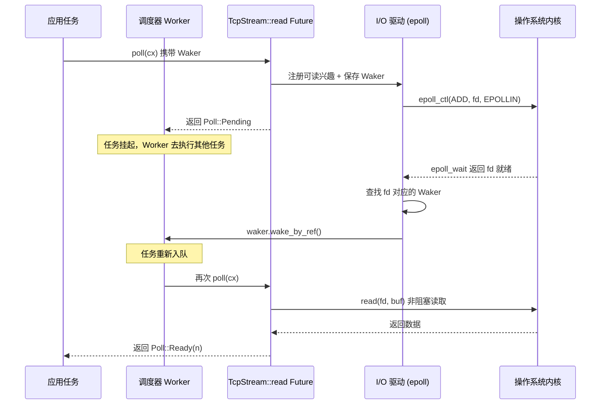

# Глава 1: Ментальная модель асинхронности: триада Future, Waker и исполнителя

Асинхронное программирование в Rust — это не библиотека, а протокол языкового уровня. Tokio стал production-grade рантаймом не потому, что изобрёл Future, а потому, что точно реализовал граничные условия каждого контракта этого протокола. В этой главе мы не будем спешить с погружением в код планировщика Tokio, а сначала досконально разберём «триаду» — Future, Waker, Executor — их границы ответственности и обратный поток управления. Понимание того, как эти три компонента сцепляются, даст опору для последующих глав: сборки Runtime, work-stealing планирования и I/O-драйвера.

# 1.1 От блокировки к опросу: почему Rust выбрал poll, а не колбэки

## Интуитивная модель

Представьте, что вы заказали в ресторане блюдо, которое готовят на месте. Асинхронность на колбэках (как в раннем Node.js) — это когда вы оставляете номер телефона, и повар, приготовив,**сам звонит вам**— контроль у повара, ваш код лишь пассивно реагирует. Асинхронность на опросе (выбор Rust) — это когда вы получаете талон на выдачу блюда и**сами решаете**когда подойти к окну и спросить «готово?»: не готово — идёте заниматься другими делами, готово — забираете.

Это различие кажется незначительным, но оно определяет форму всей системы. В модели колбэков каждая асинхронная операция должна нести замыкание «что делать после завершения», замыкания вкладываются друг в друга, образуя callback hell, а отмена операции крайне затруднена — вы не можете «отозвать» уже зарегистрированный колбэк. В модели опроса Future — это просто конечный автомат,`poll`— это чистое действие запроса, без продвижения не потребляются ресурсы, отмена — это drop, чисто и аккуратно.

## Ключевой контракт модели опроса

Определённый в стандартной библиотеке Rust`Future`trait содержит всего два элемента: метод`poll`и ассоциированный тип`Output`. Tokio не переопределяет этот trait, а напрямую переиспользует реализацию из стандартной библиотеки. Это явно отражено в исходном коде:

```rust
// tokio/src/future/mod.rs
cfg_not_trace! {
    cfg_rt! {
        pub(crate) use std::future::Future;
    }
}
```

[FACT:tokio/src/future/mod.rs:24-28]

Этот код раскрывает важный факт: когда функция`tracing`не включена, внутренний`Future`в Tokio — это`std::future::Future`псевдоним без какой-либо обёртки. Только при включении`tracing`он заменяется на`InstrumentedFuture`:

```rust
cfg_trace! {
    mod trace;
    #[allow(unused_imports)]
    pub(crate) use trace::InstrumentedFuture as Future;
}
```

[FACT:tokio/src/future/mod.rs:18-22]

> **[Design Inference & Architectural Trade-offs]**
> Этот подход «по умолчанию нулевые накладные расходы, инструментирование по требованию» — последовательная философия Tokio: критический путь не вводит никаких дополнительных слоёв абстракции, а наблюдаемость накладывается как опциональная возможность.`InstrumentedFuture`Существование

## показывает, что команда Tokio считает: стоимость инструментирования tracing не должна ложиться на всех пользователей.

`poll`Три неявных ограничения контракта poll`fn poll(self: Pin<&mut Self>, cx: &mut Context<'_>) -> Poll<Self::Output>`Сигнатура метода

**. В этой сигнатуре скрыты три контракта, нарушение любого из которых приводит к неопределённому поведению или логической ошибке:** `Pin<&mut Self>`Контракт первый: Pin гарантирует безопасность самоссылок.

**означает, что после первого poll Future его адрес в памяти не может быть перемещён. Это связано с тем, что async-блок после компиляции порождает конечный автомат, содержащий самоссылки — локальные переменные могут держать ссылки на другие поля того же конечного автомата. Если разрешить перемещение, эти ссылки станут висячими.**Контракт второй: Pending требует уже зарегистрированного пробуждения.`poll`Когда`Poll::Pending`возвращает`cx.waker()`Получен и сохранён Waker, либо Waker уже зарегистрирован в некотором источнике событий. В противном случае исполнитель никогда не узнает, когда этот Future может быть снова опрошен, что приведёт к永久ному зависанию задачи.

**Контракт третий: после Ready повторный poll не должен выполняться.**Как только`poll`возвращает`Poll::Ready`, повторный poll того же Future является логической ошибкой (хотя это не приводит к UB, поведение не определено). Исполнитель обязан после получения Ready больше не планировать эту задачу.

Из этих трёх контрактов второй — наиболее подверженный ошибкам, и именно он является фундаментальной причиной существования Waker.

# 1.2 Waker: носитель обратного потока управления

## Интуитивная модель

Waker — это «вибропейджер» для получения заказа, который выдаёт вам ресторан. Вам не нужно стоять у окна и repeatedly спрашивать «готово ли» — это тратило бы ваше время. Вам достаточно при первом подходе к окну передать пейджер повару (зарегистрировать Waker), а затем спокойно заниматься другими делами. Когда блюдо готово, повар нажимает кнопку, пейджер вибрирует (вызывается`wake`), вы получаете сигнал и идёте к окну забирать заказ (повторный poll).

Без Waker у исполнителя есть только два варианта: либо занято опрашивать все задачи (трата CPU), либо никогда не опрашивать задачи, вернувшие Pending (голодание задач). Waker — единственный механизм, разрывающий этот тупик.

## Структура памяти Waker и дизайн виртуальной таблицы

Waker — тип из стандартной библиотеки, но его дизайн напрямую повлиял на структуру задач Tokio.`Waker`По сути это толстый указатель: структура`RawWaker`, содержащая указатель на данные и указатель на виртуальную таблицу.

```rust
// 标准库中的定义（非 Tokio 源码，此处为背景说明）
pub struct RawWaker {
    data: *const (),
    vtable: &'static RawWakerVTable,
}

pub struct RawWakerVTable {
    clone: unsafe fn(*const ()) -> RawWaker,
    wake: unsafe fn(*const ()),
    wake_by_ref: unsafe fn(*const ()),
    drop: unsafe fn(*const ()),
}
```

> **[Design Inference & Architectural Trade-offs]**
> Изящество этого дизайна в том, что:`Waker`сам по себе не заботится о том, что конкретно означает «пробуждение». Он лишь носитель четырёх указателей на функции. Tokio может предоставить Waker, чья`wake`функция повторно помещает задачу в очередь планирования; а другая среда выполнения (например,`futures`crate`block_on`) может предоставить совершенно иную реализацию Waker. Эта модель «данные + виртуальная таблица» позволяет передавать Waker между разными средами выполнения без потери семантики.

`wake`Различие между`wake_by_ref`и`wake`критически важно:`wake_by_ref`потребляет владение Waker (после вызова Waker уничтожается), а`wake_by_ref`только заимствует. Исполнитель обычно реализует`wake`как «пометить задачу готовой и поставить в очередь», а

## дополнительно обрабатывает уменьшение счётчика ссылок. В структуре задач Tokio указатель на данные Waker указывает на заголовок счётчика ссылок задачи; каждый clone увеличивает счётчик, drop уменьшает, а при обнулении счётчика память задачи освобождается.

Полная временная диаграмма пробуждения



Копировать**Ключевой момент этой диаграммы:**Waker — единственный канал, способный обратно достичь Executor из Reactor

## . Reactor не хранит никакой другой информации о задаче; он знает только «когда этот fd готов, вызвать этот Waker». Такая развязка позволяет реализовать драйвер I/O независимо от планировщика; они взаимодействуют только через узкий интерфейс Waker.

Ложные пробуждения: серая зона контракта

> Normally, tasks are scheduled only if they have been woken by calling `wake` on their waker. However, this is not guaranteed, and Tokio may schedule tasks that have not been woken under some circumstances.

[FACT:tokio/src/runtime/mod.rs:306-309]

> **[Design Inference & Architectural Trade-offs]**
> 〔Проектные предположения и архитектурные компромиссы〕`poll`Это означает, что реализация

# должна допускать ситуацию «повторный poll без пробуждения». Корректный Future после возврата Pending при повторном poll, даже если никаких событий не произошло, должен снова вернуть Pending, а не panic или ошибочный результат. Это ограничение кажется мягким, но фактически предъявляет требования к дизайну конечного автомата: нельзя предполагать, что «между двумя poll обязательно происходит событие».

## 1.3 Executor: инкапсуляция от Future к задаче

Интуитивная модель

Executor — это диспетчер ресторана. У него есть стопка заказов (очередь задач), он решает, какой заказ готовить первым и кто будет готовить. Когда вибропейджер срабатывает, он повторно ставит соответствующий заказ в очередь. Без диспетчера повара не знали бы, какое блюдо готовить и когда переключаться между работами.**Но обязанности Executor далеко не ограничиваются «опросом Future». Он должен решить три ключевые проблемы:**управление жизненным циклом задач**(создание, планирование, завершение, отмена),**гарантия справедливости**(предотвращение голодания одних задач из-за других),**интеграция с драйверами ресурсов

## (как события I/O и таймеров преобразуются в пробуждения).

Структура памяти задачи: от Future к Task`tokio::spawn`При вызове`Task`переданный Future не помещается напрямую в очередь. Он оборачивается в структуру

```rust
/// Boundary value to prevent stack overflow caused by a large-sized
/// Future being placed in the stack.
pub(crate) const BOX_FUTURE_THRESHOLD: usize = if cfg!(debug_assertions)  {
    2048
} else {
    16384
};

pub(crate) struct AutoBox(std::marker::PhantomData);

impl AutoBox {
    /// `true` if a value of type `T` is larger than [`BOX_FUTURE_THRESHOLD`].
    pub(crate) const SHOULD_BOX: bool = std::mem::size_of::() > BOX_FUTURE_THRESHOLD;
}
```

[FACT:tokio/src/runtime/mod.rs:649-673]

Копировать`AutoBox`Этот код решает очень конкретную проблему: если Future слишком велик (более 16 КБ, в debug-режиме 2 КБ), прямое встраивание в структуру Task приведёт к переполнению стека или расточительному расходу памяти.`SHOULD_BOX`Через константу времени компиляции

> **[Design Inference & Architectural Trade-offs]**
> 〔Проектные предположения и архитектурные компромиссы〕`if`» причина: если использовать проверку во время выполнения, компилятор для каждого`T`одновременно инстанцирует код обеих ветвей (одна обрабатывает`T`, другая обрабатывает`Pin<Box<T>>`), что приводит к раздуванию кода. При использовании константных ветвей сборщик мономорфизации вырезает недостижимые ветви и генерирует код только для фактически используемых типов. Это типичная оптимизация «замена проверки во время выполнения системой типов».

## Справедливость планирования: магические числа 31 и 61

В документации планировщика Tokio определено формальное гарантирование справедливости:

> If the total number of tasks does not grow without bound, and no task is blocking the thread, then it is guaranteed that tasks are scheduled fairly.

[FACT:tokio/src/runtime/mod.rs:279-281]

Реализация этой гарантии зависит от двух ключевых параметров. Для runtime с текущим потоком:

> The runtime will prefer to choose the next task to schedule from the local queue, and will only pick a task from the global queue if the local queue is empty, or if it has picked a task from the local queue 31 times in a row.

[FACT:tokio/src/runtime/mod.rs:328-333]

> The runtime will check for new IO or timer events whenever there are no tasks ready to be scheduled, or when it has scheduled 61 tasks in a row.

[FACT:tokio/src/runtime/mod.rs:335-337]

Эти два числа (31 и 61) выбраны не случайно. 31 — это 2 в 5-й степени минус 1, что позволяет быстро проверять с помощью битовых операций; 61 же нужно для того, чтобы гарантировать, что события I/O не будут бесконечно откладываться — даже если очередь задач никогда не пуста, каждые 61 планирование необходимо проверять I/O.

> **[Design Inference & Architectural Trade-offs]**
> Почему 31, а не 32? Потому что счётчик начинается с 0, увеличивается на 1 при каждом планировании, и когда счётчик достигает 31, запускается проверка глобальной очереди. Использование`counter & 31 == 31`для проверки эффективнее, чем`counter % 32 == 0`(хотя современные компиляторы оптимизируют это автоматически). Выбор 61 более тонок: он должен быть достаточно большим, чтобы избежать накладных расходов на частые системные вызовы epoll_wait, и достаточно малым, чтобы гарантировать приемлемую задержку I/O.

## Оптимизация LIFO-слота в многопоточном runtime

Многопоточный runtime добавляет к справедливости ещё одну оптимизацию производительности — LIFO-слот:

> The multi thread runtime uses the lifo slot optimization: Whenever a task wakes up another task, the other task is added to the worker thread's lifo slot instead of being added to a queue.

[FACT:tokio/src/runtime/mod.rs:373-377]

Интуиция этой оптимизации такова: когда одна задача пробуждает другую, пробуждённая задача, скорее всего, имеет зависимость по данным с текущей задачей (например, в шаблоне производитель-потребитель). Помещая её в LIFO-слот, текущая задача после завершения немедленно выполняет её, что позволяет использовать горячие данные в кэше CPU.

Но у LIFO-слота есть механизм защиты от злоупотребления:

> if a worker thread uses the lifo slot three times in a row, it is temporarily disabled until the worker thread has scheduled a task that didn't come from the lifo slot.

[FACT:tokio/src/runtime/mod.rs:380-382]

> **[Design Inference & Architectural Trade-offs]**
> Это правило «отключение после трёх последовательных использований» предназначено для предотвращения livelock, когда две задачи пробуждают друг друга. Если задача A пробуждает задачу B, а B пробуждает A, то без этого ограничения LIFO-слот был бы навсегда занят этими двумя задачами, и другие задачи никогда не получили бы планирование. Ограничение в три раза даёт другим задачам шанс вклиниться.

## Отмена задач: истинная семантика abort

`JoinHandle::abort`Поведение

> Be aware that calls to `JoinHandle::abort` just schedule the task for cancellation, and will return before the cancellation has completed.

[FACT:tokio/src/task/mod.rs:146-148]

часто понимается неправильно. В документации явно указано:`abort`Это означает, что`.await`не является синхронным. Он лишь устанавливает флаг, и задача проверит этот флаг в следующей`.await`точке и завершится самостоятельно. Если задача выполняет участок CPU-интенсивного кода без`abort`, то

не сработает немедленно.

> Note that aborting a task does not guarantee that it fails with a cancelled error, since it may complete normally first.

[FACT:tokio/src/task/mod.rs:134-138]

> **[Design Inference & Architectural Trade-offs]**
> 〔Предположения о дизайне и архитектурные компромиссы〕`spawn_blocking`Мотивация этой семантики: отмена — это операция «по мере возможности». Tokio не принудительно убивает задачи (в Rust нет безопасного механизма принудительного завершения), а кооперативно просит задачу завершиться самостоятельно. Это согласуется с дизайном, согласно которому`.await`задачи не могут быть отменены — у блокирующих задач нет

# точек, они не могут проверить флаг отмены.

## 1.4 Размышления о дизайне: границы и цена триады

Почему Future не содержит Executor`Future`Трейт

в Rust намеренно не содержит информации о том, «как планировать себя». Это тщательно продуманное решение о разделении ответственности. Если бы Future знал свой Executor, то:

1. Один и тот же Future не мог бы выполняться на разных runtime (например, при миграции с Tokio на async-std)`block_on`2. При тестировании нельзя было бы использовать простой

для управления`select!`、`join!`3. Комбинаторы (такие как

) не могли бы работать между runtime

## Наличие Waker как раз и предназначено для того, чтобы, сохраняя это разделение, всё же позволить Future уведомлять Executor. Waker — это «токен способности»: Future знает только «я могу вызвать это, чтобы запросить перепланирование», но не знает, как именно происходит планирование.

Цена кооперативного планирования`.await`Задачи в Tokio кооперативны: задача уступает управление только в

> code that spends a long time without reaching an `.await` will prevent other tasks from running.

[FACT:tokio/src/lib.rs:178-179]

> **[Design Inference & Architectural Trade-offs]**
> 〔Предположения о дизайне и архитектурные компромиссы〕`.await`Это фундаментальная цена кооперативного планирования. Операционная система может вытеснить поток на любой границе инструкции, но Tokio может переключить задачу только в`.await`точке. Если задача выполняет 10-секундный CPU-интенсивный цикл без`spawn_blocking`в середине, то все остальные задачи на том же worker-потоке будут заблокированы на 10 секунд. Стратегия Tokio — предоставить`block_in_place`и

## , чтобы перенести такую работу в специализированный пул потоков. Но это ответственность пользователя, runtime не может обнаружить это автоматически.

Граничные условия гарантии справедливости

- Гарантия справедливости Tokio имеет два предварительных условия: общее количество задач ограничено сверху, и ни одна задача не блокирует поток. Эти два условия часто нарушаются в реальной производственной среде:
- Если задачи постоянно порождают новые задачи и не перерабатываются, общее количество задач не ограничено сверху, и гарантия справедливости перестаёт действовать

> **[Design Inference & Architectural Trade-offs]**
> 〔Предположения о дизайне и архитектурные компромиссы〕

# Именно поэтому документация Tokio неоднократно подчёркивает: «не выполняйте блокирующие операции в асинхронных задачах». Гарантия справедливости — это не жёсткая гарантия runtime, а гарантия «при условии правильного использования». Runtime не обнаруживает нарушения, потому что само обнаружение требует накладных расходов.

1.5 Краткое содержание главы

**Future — это вытягивающий конечный автомат.** `poll`— это чистое действие запроса, возвращающее`Pending`при возврате должен быть уже зарегистрирован waker, возврат`Ready`после этого не должен больше опрашиваться через poll. Tokio напрямую переиспользует`std::future::Future`, не делая дополнительной обёртки (если только не включён tracing).

**Waker — единственный канал обратного управления потоком.**Он через дизайн «указатель на данные + таблица виртуальных методов» обеспечивает независимость от среды выполнения.`wake`потребляет владение,`wake_by_ref`только заимствует. Ложные пробуждения допустимы, Future обязан их терпеть.

**Executor отвечает за жизненный цикл, справедливость и интеграцию ресурсов.**Он оборачивает Future в Task, через`AutoBox`на этапе компиляции решает, упаковывать ли в heap, через два магических числа 31/61 балансирует планирование локальной и глобальной очередей, через LIFO-слот оптимизирует производительность в сценариях с зависимостями данных.

Эти три компонента разделены через узкие интерфейсы: Future знает только`poll`, Waker знает только`wake`, Executor знает только «опрашивать до Pending или Ready». Именно это разделение позволяет Tokio без изменения определения Future реализовывать work-stealing планирование, интеграцию с I/O-драйвером, кооперативные бюджеты и другие продвинутые возможности.

# Вопросы для размышления и самопроверки в этой главе

Q1: Если`AutoBox::SHOULD_BOX`проверку из константы времени компиляции изменить на время выполнения`if size_of::<T>() > THRESHOLD`, какое влияние это окажет на артефакт компиляции? Почему комментарий Tokio особо это подчёркивает?

**Справочный разбор**: Согласно[FACT:tokio/src/runtime/mod.rs:657-667]комментарию, если использовать время выполнения`if`, компилятор для каждого`T`одновременно инстанцирует код обеих ветвей — одну для случая`T`с прямым инлайном, другую для случая`Pin<Box<T>>`. Это означает, что для каждого spawn-типа Future будет сгенерировано две копии кода управления задачей (task harness), что приведёт к удвоению размера бинарника. А при использовании ассоциированной константы`SHOULD_BOX`, поскольку она после определения`T`является константой времени компиляции, сборщик мономорфизации отсечёт недостижимые ветви и сгенерирует код только для фактически используемого пути. Это типичная оптимизация «замены runtime-проверки системой типов», ценой которой является то, что`AutoBox`должен быть обобщённой структурой, а не обычной функцией.

Q2: Предположим, задача в`poll`вернула`Pending`, но забыла зарегистрировать Waker. Что произойдёт с этой задачей в current-thread runtime и multi-thread runtime? Есть ли у Tokio механизм обнаружения такой ситуации?

**Справочный разбор**: Согласно[FACT:tokio/src/runtime/mod.rs:306-309], Tokio допускает ложные пробуждения, что означает, что задача может быть перепланирована без пробуждения. Но это не значит, что забыть зарегистрировать Waker безопасно. В current-thread runtime, если и локальная, и глобальная очереди пусты, runtime переходит в`park`состояние ожидания событий I/O или таймеров. Задача, забывшая зарегистрировать Waker, никогда не будет повторно поставлена в очередь, что приведёт к вечному зависанию. В multi-thread runtime ситуация аналогична, но если другие задачи постоянно пробуждаются, эта задача может случайно быть перепланирована из-за ложного пробуждения — но на это нельзя полагаться. У Tokio нет механизма runtime-обнаружения для выявления случая «возврат Pending без регистрации Waker», так как это потребовало бы проверки использования Waker после каждого poll, что слишком накладно. Это ответственность реализатора Future.

Q3: Правило LIFO-слота «отключать после трёх последовательных использований» предназначено для предотвращения какого конкретного сценария? Если убрать это ограничение, при каком паттерне зависимостей задач другие задачи будут голодать?

**Справочный разбор**: Согласно[FACT:tokio/src/runtime/mod.rs:380-382], LIFO-слот после трёх последовательных использований временно отключается до тех пор, пока не будет запланирована задача из не-LIFO источника. Это правило предотвращает сценарий: две задачи взаимно пробуждают друг друга, образуя плотный цикл. Например, задача A, обработав партию данных, пробуждает задачу B, задача B, обработав, немедленно пробуждает задачу A. Без ограничения в три раза A и B навсегда займут LIFO-слот, worker-поток будет бесконечно переключаться между этими двумя задачами, а другие задачи в локальной и глобальной очередях никогда не получат шанса на выполнение. Ограничение в три раза гарантирует, что после каждых трёх раундов «взаимного пробуждения» будет запланирована хотя бы одна другая задача, разрывая livelock. Выбор этого числа эмпирический: слишком маленькое снизит выгоду от LIFO-оптимизации, слишком большое увеличит задержку других задач.

На этом границы ответственности и механизм взаимодействия Future, Waker и Executor уже ясны: Future определяет вычисление, Waker отвечает за пробуждение, Executor управляет выполнением. Но отдельный компонент не может работать самостоятельно, они должны быть собраны в единую среду выполнения. В следующей главе мы проследим полную цепочку сборки Runtime::new и Builder::build, увидим, как планировщик, I/O-драйвер, драйвер времени и пул блокирующих потоков внедряются в один экземпляр Runtime, и раскроем фундаментальные различия между формами current_thread и multi_thread на этапе сборки.
