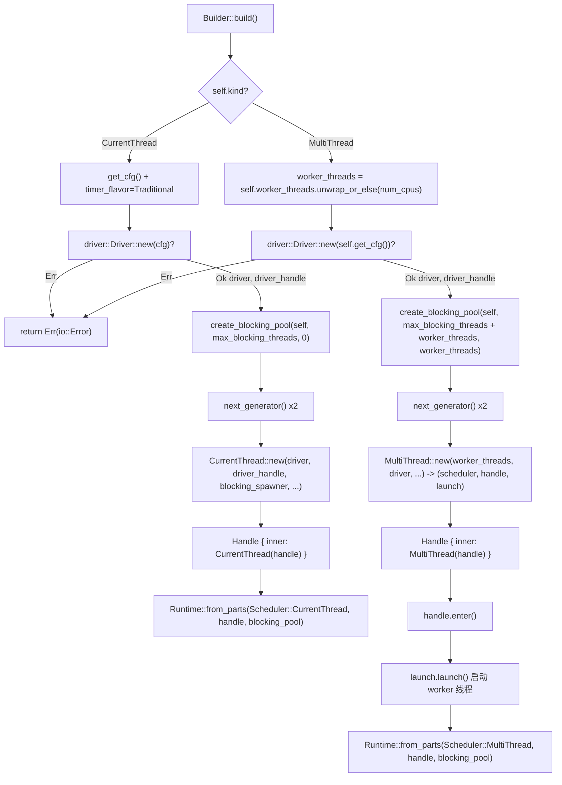

# Глава 2: Сборка Runtime: как Builder собирает драйверы, планировщик и пул потоков

# От`Builder`до`Runtime`: полный путь одной сборки

В предыдущей главе мы ясно объяснили границы ответственности Future, Waker и Executor. Но реально используемый runtime — это далеко не только «один Executor» — ему также нужны цикл событий I/O, таймеры, пул блокирующих потоков, и все эти компоненты должны разделять один и тот же набор дескрипторов и один и тот же жизненный цикл. В этой главе мы прослеживаем полную цепочку сборки`Builder::build`и отвечаем на ключевой вопрос:**Какие компоненты на самом деле находятся внутри`Runtime`, как они собираются вместе и разделяют дескрипторы**。

Точка входа сборки Tokio — это`Builder`. Сам по себе он является чистым контейнером конфигурации, все его поля — это «декларации намерений», он не содержит никаких ресурсов runtime. Реальное создание ресурсов происходит при вызове`build()`.

## Интуитивная модель: Builder — это «чертёж ремонта», Runtime — это «дом после сдачи»

`Builder`подобен чертежу ремонта: вы отмечаете на нём «сколько комнат нужно (worker_threads)», «нужно ли подводить воду (enable_io)», «нужно ли подводить электричество (enable_time)», «лимит наёмных рабочих (max_blocking_threads)». Сам чертёж не создаёт никаких физических объектов. Только при вызове`build()`строительная бригада начинает работать по чертежу, реально возводит «комнаты» — планировщик, драйверы, пул потоков — и сдаёт экземпляр`Runtime`.

Если бы не было слоя`Builder`, пользователю пришлось бы вручную создавать каждый компонент, вручную соединять их, вручную обрабатывать откат при ошибках — любая ошибка в порядке действий привела бы к висячим дескрипторам или утечке ресурсов.`Builder`Ценность**заключается в следующем:**。

## Полное разделение «конфигурации» и «конструирования», что позволяет сосредоточить в процессе конструирования валидацию, очистку при ошибках и совместное использование дескрипторов`Builder`Раскладка памяти:

`Builder`разделение полей**Поля**：`kind`можно разделить по ответственности на четыре группы. Первая группа —`enable_io` / `enable_time`Форма и переключатели

[FACT:tokio/src/runtime/builder.rs:55-68]

```rust
pub struct Builder {
    kind: Kind,
    name: Option,
    enable_io: bool,
    nevents: usize,
    nevents_busy: Option,
    enable_time: bool,
    start_paused: bool,
    // ...
}
```

определяет, создавать ли соответствующий драйвер.**Копировать**：`worker_threads`Вторая группа —`Option<usize>`，`None`Параметры пула потоков`max_blocking_threads`— это

[FACT:tokio/src/runtime/builder.rs:73-79]

```rust
worker_threads: Option,
max_blocking_threads: usize,
```

по умолчанию 512.**Копировать**Третья группа —`Option<Arc<dyn Fn ...>>`Хуки обратного вызова`Arc`, все они являются`Box`. Обратите внимание, что они используют`Config`。

[FACT:tokio/src/runtime/builder.rs:87-97]

```rust
pub(super) after_start: Option,
pub(super) before_stop: Option,
pub(super) before_park: Option,
pub(super) after_unpark: Option,
```

, потому что эти обратные вызовы должны быть клонированы в**каждого рабочего потока**：`global_queue_interval`、`event_interval`、`disable_lifo_slot`、`seed_generator`。

[FACT:tokio/src/runtime/builder.rs:116-134]

```rust
pub(super) global_queue_interval: Option,
pub(super) event_interval: u32,
pub(super) disable_lifo_slot: bool,
pub(super) seed_generator: RngSeedGenerator,
```

Четвёртая группа —`Kind`Эвристика планирования и случайное зерно`Copy`Копировать

[FACT:tokio/src/runtime/builder.rs:261-265]

```rust
#[derive(Clone, Copy)]
pub(crate) enum Kind {
    CurrentThread,
    #[cfg(feature = "rt-multi-thread")]
    MultiThread,
}
```

`MultiThread`— это`rt-multi-thread`небольшой enum, содержащий всего два варианта.`rt`Копировать`Kind`Вариант`build()`управляется feature-флагом`match`. Это означает, что в сборке, где включён только feature**,**。

## имеет только один вариант,

`Builder::new`и`enable_io`из`enable_time`будет оптимизирован компилятором в одну ветку —`false`。

[FACT:tokio/src/runtime/builder.rs:309-318]

```rust
// I/O defaults to "off"
enable_io: false,
nevents: 1024,
nevents_busy: None,

// Time defaults to "off"
enable_time: false,

// The clock starts not-paused
start_paused: false,
```

> **[Design Inference & Architectural Trade-offs]**
> — это общая точка входа для всех конструкций. Он устанавливает`#[tokio::main]`и`enable_all()`。

`enable_all()`в

[FACT:tokio/src/runtime/builder.rs:398-419]

```rust
pub fn enable_all(&mut self) -> &mut Self {
    #[cfg(any(
        feature = "net",
        all(unix, feature = "process"),
        all(unix, feature = "signal")
    ))]
    self.enable_io();

    #[cfg(all(
        tokio_unstable,
        feature = "io-uring",
        // ...
    ))]
    self.enable_io_uring();

    #[cfg(feature = "time")]
    self.enable_time();

    self
}
```

〔Проектные выводы и архитектурные компромиссы〕`enable_io()`Этот выбор значений по умолчанию сделан намеренно: создание I/O-драйвера требует запроса у операционной системы дескрипторов epoll/kqueue, создание time-драйвера требует запуска инфраструктуры таймеров. Если пользователю нужен только планировщик задач для чистых вычислений (например, для запуска CPU-интенсивной async-логики), принудительное создание этих драйверов — чистая трата ресурсов.`net`、`process`Макрос`signal`работает «из коробки», потому что внутри он вызывает`time` feature，`enable_all()`Реализация

## раскрывает, как feature-гейтинг влияет на семантику «всё включено».`build()`Копировать

`build()`Обратите внимание, что`kind`вызывается только при включённом feature

[FACT:tokio/src/runtime/builder.rs:1146-1152]

```rust
pub fn build(&mut self) -> io::Result {
    match &self.kind {
        Kind::CurrentThread => self.build_current_thread_runtime(),
        #[cfg(feature = "rt-multi-thread")]
        Kind::MultiThread => self.build_threaded_runtime(),
    }
}
```

. Если пользователь включил только

### ,

`build_current_thread_runtime`не включит I/O-драйвер — потому что в скомпилированном артефакте вообще нет кода I/O-драйвера.`build_current_thread_runtime_components`Основной путь сборки:`Runtime`。

[FACT:tokio/src/runtime/builder.rs:1725-1736]

```rust
fn build_current_thread_runtime(&mut self) -> io::Result {
    use crate::runtime::runtime::Scheduler;

    let (scheduler, handle, blocking_pool) =
        self.build_current_thread_runtime_components(None)?;

    Ok(Runtime::from_parts(
        Scheduler::CurrentThread(scheduler),
        handle,
        blocking_pool,
    ))
}
```

— это начальная точка сборки, он разветвляется по`build_current_thread_runtime_components`на два совершенно разных пути.

[FACT:tokio/src/runtime/builder.rs:1760-1766]

```rust
let mut cfg = self.get_cfg();
cfg.timer_flavor = TimerFlavor::Traditional;
let (driver, driver_handle) = driver::Driver::new(cfg)?;

// Blocking pool
let blocking_pool = blocking::create_blocking_pool(self, self.max_blocking_threads, 0);
let blocking_spawner = blocking_pool.spawner().clone();
```

Различия между этими двумя путями далеко не ограничиваются «один поток против нескольких потоков». Ниже мы рассмотрим каждый отдельно.`driver`Путь первый: сборка current_thread`(driver, driver_handle)`сам по себе очень тонкий, он делегирует`?`, а затем оборачивает возвращённый кортеж из трёх элементов в`build`Копировать`Err`Настоящая логика сборки находится в

. Порядок её выполнения критически важен:`spawner`Копировать`spawner`Первый шаг создаёт

, возвращая пару

[FACT:tokio/src/runtime/builder.rs:1768-1770]

```rust
let seed_generator_1 = self.seed_generator.next_generator();
let seed_generator_2 = self.seed_generator.next_generator();
```

> **[Design Inference & Architectural Trade-offs]**
> возвращает`seed_generator_1`, и в этот момент blocking pool ещё не создан, очистка не требуется.`Config`Второй шаг создаёт blocking pool и сразу извлекает его клон`select!`. Этот`seed_generator_2`будет внедрён в планировщик, давая планировщику возможность отправлять блокирующие задачи в пул потоков.`CurrentThread::new`Третий шаг генерирует два независимых генератора зерна RNG.`rng_seed`Копировать

〔Проектные выводы и архитектурные компромиссы〕`Config`Почему нужны два?`CurrentThread::new`。

[FACT:tokio/src/runtime/builder.rs:1776-1807]

```rust
let (scheduler, handle) = CurrentThread::new(
    driver,
    driver_handle,
    blocking_spawner,
    seed_generator_2,
    Config {
        before_park: self.before_park.clone(),
        after_unpark: self.after_unpark.clone(),
        // ...
        global_queue_interval: self.global_queue_interval,
        event_interval: self.event_interval,
        // ...
        enable_eager_driver_handoff: false,
        seed_generator: seed_generator_1,
        // ...
    },
    local_tid,
    self.name.clone(),
);
```

для внутреннего использования планировщиком (например,`enable_eager_driver_handoff`случайный порядок ветвления);`false`。

[FACT:tokio/src/runtime/builder.rs:1795-1798]

```rust
// This setting never makes sense for a current thread runtime,
// as it only configures how the I/O driver is stolen across
// workers.
enable_eager_driver_handoff: false,
```

> **[Design Inference & Architectural Trade-offs]**
> Этот комментарий раскрывает суть данной опции: она описывает, «как несколько worker'ов конкурируют за I/O-драйвер», а в current_thread есть только один поток, конкуренции нет, поэтому принудительно отключается. Это типичный пример «семантической привязки элемента конфигурации к его форме» — одно и то же`Builder`поле в разных формах имеет разное значение.

Наконец,`CurrentThread::new`возвращаемый`handle`заворачивается в`scheduler::Handle::CurrentThread`, затем заворачивается в публичный`Handle`。

[FACT:tokio/src/runtime/builder.rs:1816-1822]

```rust
let handle = Handle {
    inner: scheduler::Handle::CurrentThread(handle),
};

Ok((scheduler, handle, blocking_pool))
```

### Путь второй: сборка multi_thread

`build_threaded_runtime`Скелет аналогичен current_thread, но есть три принципиальных различия. Первое — определение числа worker-потоков:

[FACT:tokio/src/runtime/builder.rs:2185]

```rust
let worker_threads = self.worker_threads.unwrap_or_else(num_cpus);
```

`None`Здесь разрешается в`num_cpus()`. Это и есть точка реализации «отложенного автоматического определения» — определение происходит во время build, а не во время`Builder::new`, поскольку привязка к CPU может измениться между ними.

Второе различие — в вычислении ёмкости blocking pool:

[FACT:tokio/src/runtime/builder.rs:2189-2192]

```rust
let blocking_pool =
    blocking::create_blocking_pool(self, self.max_blocking_threads + worker_threads, worker_threads);
let blocking_spawner = blocking_pool.spawner().clone();
```

Обратите внимание`max_blocking_threads + worker_threads`. В отличие от пути current_thread, куда передаются`self.max_blocking_threads`и`0`。

[FACT:tokio/src/runtime/builder.rs:1765]

```rust
let blocking_pool = blocking::create_blocking_pool(self, self.max_blocking_threads, 0);
```

> **[Design Inference & Architectural Trade-offs]**
> Это различие раскрывает семантику ёмкости blocking pool: в multi_thread`max_blocking_threads`— это верхняя граница «дополнительных» блокирующих потоков, а фактическая общая верхняя граница потоков должна включать число worker-потоков. Третий параметр (в current_thread передаётся 0, в multi_thread —`worker_threads`) скорее всего является подсказкой «число зарезервированных потоков» или «начальное число потоков». Такое решение сохраняет семантику`max_blocking_threads`согласованной в обеих формах: она описывает «сколько дополнительных блокирующих потоков можно открыть сверх основных worker'ов».

Третье различие —`MultiThread::new`возвращает тройку, а не пару:

[FACT:tokio/src/runtime/builder.rs:2198-2226]

```rust
let (scheduler, handle, launch) = MultiThread::new(
    worker_threads,
    driver,
    driver_handle,
    blocking_spawner,
    seed_generator_2,
    Config {
        // ...
        enable_eager_driver_handoff: self.enable_eager_driver_handoff,
        // ...
    },
    self.timer_flavor,
    self.name.clone(),
);
```

Лишний`launch`— это «дескриптор запуска».`MultiThread::new`Отвечает только за конструирование структуры планировщика,**но не запускает worker-потоки немедленно**. Настоящий запуск происходит позже:

[FACT:tokio/src/runtime/builder.rs:2228-2234]

```rust
let handle = Handle { inner: scheduler::Handle::MultiThread(handle) };

// Spawn the thread pool workers
let _enter = handle.enter();
launch.launch();

Ok(Runtime::from_parts(Scheduler::MultiThread(scheduler), handle, blocking_pool))
```

`handle.enter()`Входит в контекст времени выполнения, и только затем`launch.launch()`действительно порождает все worker-потоки. Этот двухфазный дизайн «сначала конструирование, потом запуск» крайне важен.

> **[Design Inference & Architectural Trade-offs]**
> Почему нельзя запускать одновременно с конструированием? Потому что worker-потоки, будучи запущенными, немедленно начинают poll'ить задачи, а задачи могут ссылаться на`handle`. Если`handle`ещё не сконструирован до конца, возникает гонка «worker держит полуфабрикат дескриптора». Двухфазный дизайн гарантирует:**к моменту запуска всех worker-потоков полный`Handle`уже готов**。`_enter`, а guard гарантирует, что worker-потоки в момент запуска находятся в правильном контексте времени выполнения.

## Схема сборки

Приведённая ниже схема объединяет порядок сборки обоих путей, ключевые ветвления и пути ошибок. Обратите внимание: при неудаче`driver::Driver::new`происходит немедленный возврат`Err`, при этом blocking pool ещё не создан.



## Совместное использование дескрипторов:`Handle`как

становится «пропуском» между компонентами`Runtime`После завершения сборки`scheduler`、`handle`、`blocking_pool`владеет набором из трёх элементов`handle`. Среди них

[FACT:tokio/src/runtime/scheduler/mod.rs:29-41]

```rust
#[derive(Debug, Clone)]
pub(crate) enum Handle {
    #[cfg(feature = "rt")]
    CurrentThread(Arc),

    #[cfg(feature = "rt-multi-thread")]
    MultiThread(Arc),

    #[cfg(not(feature = "rt"))]
    #[allow(dead_code)]
    Disabled,
}
```

Копировать`Arc`Обратите внимание, что оба варианта обёрнуты в`Handle`. Это означает, что клонирование`Handle`— дешёвое увеличение счётчика ссылок, которое можно свободно распространять на любой поток.`match`предоставляет унифицированный интерфейс доступа, инкапсулируя различия форм внутри`driver()`：

[FACT:tokio/src/runtime/scheduler/mod.rs:53-64]

```rust
pub(crate) fn driver(&self) -> &driver::Handle {
    match *self {
        #[cfg(feature = "rt")]
        Handle::CurrentThread(ref h) => &h.driver,

        #[cfg(feature = "rt-multi-thread")]
        Handle::MultiThread(ref h) => &h.driver,

        #[cfg(not(feature = "rt"))]
        Handle::Disabled => unreachable!(),
    }
}
```

`blocking_spawner()`Копировать`match_flavor!`использует

[FACT:tokio/src/runtime/scheduler/mod.rs:96-98]

```rust
pub(crate) fn blocking_spawner(&self) -> &blocking::Spawner {
    match_flavor!(self, Handle(h) => &h.blocking_spawner)
}
```

Копировать`driver()`После раскрытия этот макрос превращается в такой`match`, как выше`match_flavor!`. Его ценность в том, что при добавлении нового аксессора, требующего диспетчеризации по форме, достаточно одной строки`match`, а не писать вручную две ветви

.`Handle`Публичный`scheduler::Handle`— это тонкая обёртка над внутренним

[FACT:tokio/src/runtime/handle.rs:13-15]

```rust
pub struct Handle {
    pub(crate) inner: scheduler::Handle,
}
```

Копировать`Handle`Полученный пользователем`spawn`можно клонировать между потоками, можно`block_on`。`spawn`, можно`AutoBox`. Реализация

[FACT:tokio/src/runtime/handle.rs:197-208]

```rust
pub fn spawn(&self, future: F) -> JoinHandle
where
    F: Future + Send + 'static,
    F::Output: Send + 'static,
{
    let fut_size = mem::size_of::();
    if AutoBox::::SHOULD_BOX {
        self.spawn_named(Box::pin(future), SpawnMeta::new_unnamed(fut_size))
    } else {
        self.spawn_named(future, SpawnMeta::new_unnamed(fut_size))
    }
}
```

`AutoBox::<F>::SHOULD_BOX`на этапе компиляции:`size_of::<F>()`Копировать

[FACT:tokio/src/runtime/mod.rs:668-673]

```rust
pub(crate) struct AutoBox(std::marker::PhantomData);

impl AutoBox {
    pub(crate) const SHOULD_BOX: bool = std::mem::size_of::() > BOX_FUTURE_THRESHOLD;
}
```

> **[Design Inference & Architectural Trade-offs]**
> Копировать`if`〔Проектные предположения и архитектурные компромиссы〕`spawn_named`В комментарии объясняется, почему используется ассоциированная константа, а не проверка во время выполнения`F`: если бы проверка была во время выполнения,`Pin<Box<F>>`мономорфизировался бы дважды (один раз для

## , один раз для

**), что привело бы к генерации двух копий task harness для каждого spawn'нутого future и удвоению объёма кода. При использовании константного ветвления сборщик мономорфизации сохраняет только фактически достигнутую ветвь.**Проектные размышления: порядок сборки, восстановление после ошибок и подводные камни в продакшене`driver -> blocking_pool -> scheduler`Порядок — это контракт

**. Порядок сборки`local_tid`не случаен. Driver создаётся первым, поскольку это единственный шаг, который может завершиться неудачей из-за нехватки ресурсов ОС и при неудаче не требует очистки других компонентов. blocking_pool идёт после driver, но до scheduler, потому что scheduler нуждается в blocking_spawner. Если создание blocking_pool завершится неудачей (на практике это маловероятно), driver будет автоматически очищен через drop.**。`build_local`Ветвь`build_current_thread_local_runtime`для current_thread

[FACT:tokio/src/runtime/builder.rs:1738-1751]

```rust
fn build_current_thread_local_runtime(&mut self) -> io::Result {
    use crate::runtime::local_runtime::LocalRuntimeScheduler;

    let tid = std::thread::current().id();

    let (scheduler, handle, blocking_pool) =
        self.build_current_thread_runtime_components(Some(tid))?;

    Ok(LocalRuntime::from_parts(
        LocalRuntimeScheduler::CurrentThread(scheduler),
        handle,
        blocking_pool,
    ))
}
```

, передавая туда ID текущего потока:`tid`Копировать`Handle`Этот`can_spawn_local_on_local_runtime`сохраняется в

[FACT:tokio/src/runtime/scheduler/mod.rs:140-147]

```rust
pub(crate) fn can_spawn_local_on_local_runtime(&self) -> bool {
    match self {
        Handle::CurrentThread(h) => h.local_tid.is_some_and(|x| std::thread::current().id() == x),

        #[cfg(feature = "rt-multi-thread")]
        Handle::MultiThread(_) => false,
    }
}
```

> **[Design Inference & Architectural Trade-offs]**
> Копировать`LocalRuntime`〔Проектные предположения и архитектурные компромиссы〕`!Send`Это краеугольный камень безопасности`local_tid`: future из`!Send`может быть poll'нут только в своём owner-потоке, и

**— это точка проверки данного ограничения во время выполнения. Если убрать эту проверку, кросс-поточный spawn_local приведёт к конкурентному доступу к данным`worker_threads(0)`и вызовет UB.**。`worker_threads`Подводный камень в продакшене первый:

[FACT:tokio/src/runtime/builder.rs:582-586]

```rust
pub fn worker_threads(&mut self, val: usize) -> &mut Self {
    assert!(val > 0, "Worker threads cannot be set to 0");
    self.worker_threads = Some(val);
    self
}
```

Это утверждение терпит неудачу на этапе конфигурации, а не при сборке. Преимущество в том, что ошибка локализуется раньше, недостаток — если число потоков берётся из динамического значения в конфигурационном файле, пользователь должен сам проверить его перед вызовом.

**Производственная проблема вторая:`max_blocking_threads`Если задать слишком маленьким, произойдёт зависание**. Документация явно предупреждает:

[FACT:tokio/src/runtime/builder.rs:600-601]

```rust
/// It's recommended to not set this limit too low in order to avoid hanging on operations
/// requiring [`spawn_blocking`].
```

> **[Design Inference & Architectural Trade-offs]**
> Поскольку очередь blocking pool не имеет обратного давления — задачи будут накапливаться до тех пор, пока не появится доступный поток. Если все блокирующие потоки ожидают операцию, «для завершения которой требуется новый блокирующий поток», возникнет взаимоблокировка. Фраза из документации «the queue does not apply any backpressure, it could potentially grow unbounded» как раз является примечанием к этому риску.

**Производственная проблема третья:`UnhandledPanic::ShutdownRuntime`Поддерживается только current_thread**。

[FACT:tokio/src/runtime/builder.rs:1374-1381]

```rust
pub fn unhandled_panic(&mut self, behavior: UnhandledPanic) -> &mut Self {
    if !matches!(self.kind, Kind::CurrentThread) && matches!(behavior, UnhandledPanic::ShutdownRuntime) {
        panic!("UnhandledPanic::ShutdownRuntime is only supported in current thread runtime");
    }

    self.unhandled_panic = behavior;
    self
}
```

> **[Design Inference & Architectural Trade-offs]**
> Причина этого ограничения: в multi_thread «немедленное завершение runtime» требует координации остановки всех worker-потоков, реализация сложна, а семантика размыта (что делать с другими задачами, которые в данный момент выполняются в poll?). В current_thread есть только один поток, и семантика завершения ясна.

## Итоги главы

В этой главе прослежен`Builder::build`полный путь сборки. Ключевые выводы:

1. `Builder`— это чистый контейнер конфигурации,`build()`только создаёт ресурсы. Порядок сборки`driver -> blocking_pool -> scheduler`определяется требованиями восстановления после ошибок.

2. Различия между current_thread и multi_thread не ограничиваются числом потоков: расчёт ёмкости blocking pool различается (`max_blocking_threads` vs `max_blocking_threads + worker_threads`), в multi_thread есть дополнительный`launch`двухфазный запуск,`enable_eager_driver_handoff`в current_thread принудительно отключён.

3. `Handle`— это ядро, разделяемое между компонентами, внутри использует`Arc`для обёртки специфичных для формы дескрипторов, доступ через`match`или`match_flavor!`макрос унифицирован.

4. `AutoBox`с помощью ассоциированных констант определяет на этапе компиляции, нужно ли упаковывать future в Box, избегая удвоения объёма кода.

5. `local_tid`— это`LocalRuntime`контрольная точка безопасности во время выполнения.

В следующей главе мы перейдём к жизненному циклу задачи:`spawn`как превратить Future в планируемую сущность,`JoinHandle`как взаимодействовать с конечным автоматом задачи, и как задача переходит между состояниями`PENDING` / `RUNNING` / `COMPLETE`.

# Вопросы для размышления и самопроверки по этой главе

Q1: Если в`build_threaded_runtime`параметр ёмкости`create_blocking_pool`изменить с`self.max_blocking_threads + worker_threads`на`self.max_blocking_threads`, в каком сценарии это приведёт к голоданию блокирующих задач? Почему в пути current_thread можно передать`self.max_blocking_threads`？

**Справочный разбор**: Согласно[FACT:tokio/src/runtime/builder.rs:2189-2192], в пути multi_thread передаётся`self.max_blocking_threads + worker_threads`, а в пути current_thread[FACT:tokio/src/runtime/builder.rs:1765]передаётся`self.max_blocking_threads`. Корень различия в том, что в multi_thread worker-потоки сами также выполняют блокирующие задачи (например,`block_in_place`временно превращает worker-поток в блокирующий), поэтому общий бюджет блокирующих потоков должен включать число worker-потоков. Если изменить на передачу только`self.max_blocking_threads`, когда`max_blocking_threads`задано малым (например, 1) и уже есть worker-потоки, занимающие бюджет в`block_in_place`, новые`spawn_blocking`задачи не получат доступных потоков, накопятся в очереди без обратного давления, что приведёт к вечному зависанию async-задач, зависящих от этих блокирующих задач. В current_thread есть только один поток и не поддерживается семантика преобразования worker в`block_in_place`, поэтому добавлять число worker-потоков не нужно.

Q2: `MultiThread::new`возвращает`launch`дескриптор, а фактически запускает worker-потоки`launch.launch()`. Если убрать`handle.enter()`эту строку и напрямую вызвать`launch.launch()`, что произойдёт?

**Справочный разбор**: Согласно[FACT:tokio/src/runtime/builder.rs:2230-2232], перед запуском есть`let _enter = handle.enter();`и только затем`launch.launch()`。`handle.enter()`Назначение — установить thread-local контекст, чтобы текущий поток «выглядел» находящимся внутри runtime. Worker-потоки после запуска немедленно начинают poll задач, а код задач может вызывать`Handle::current()`、`tokio::spawn`и другие API, зависящие от контекста. Если убрать`_enter`, установка контекста в момент запуска worker-потока может быть неполной (в зависимости от того, устанавливает ли`launch`его самостоятельно внутри), в худшем случае инициализационный код, выполняемый на worker-потоке, вызовет`Handle::current()`и приведёт к panic (`CONTEXT_MISSING_ERROR`). Даже если`launch`внутри устанавливает контекст для каждого worker,`_enter`гарантирует, что «само действие запуска» происходит в правильном контексте, избегая гонки в процессе запуска.

Q3: `AutoBox::<F>::SHOULD_BOX`использует ассоциированные константы вместо runtime`if size_of::<F>() > THRESHOLD`. Предположим, что заменили на runtime-проверку: помимо удвоения объёма кода, в каких случаях это приведёт к деградации производительности?

**Справочный разбор**: Согласно[FACT:tokio/src/runtime/mod.rs:657-673]комментарию, runtime`if`заставит`spawn_named`мономорфизировать каждый`T`дважды (`T`и`Pin<Box<T>>`по одному разу). Помимо удвоения объёма кода, деградация производительности проявляется в: 1) увеличении давления на кэш инструкций (i-cache), поскольку оба набора кода harness должны находиться в памяти; 2) компилятор не может оптимизировать «фактически выполняется только одна ветвь», предсказание ветвлений во время выполнения обычно точно, но сама ветвь и различия в распределении регистров между двумя наборами кода накапливаются; 3) более скрыто то, что`Pin<Box<T>>`путь принудительно выделяет память в куче, и если runtime-проверка по какой-то причине (например,`size_of`в обобщённом контексте не полностью свёрнута в константу) ошибочно определит, маленькие future тоже будут упакованы в Box, добавляя одно выделение в куче при каждом spawn. Ассоциированные константы позволяют сборщику мономорфизации отсечь невыполняемые ветви уже на этапе компиляции, обеспечивая нулевые накладные расходы во время выполнения.
