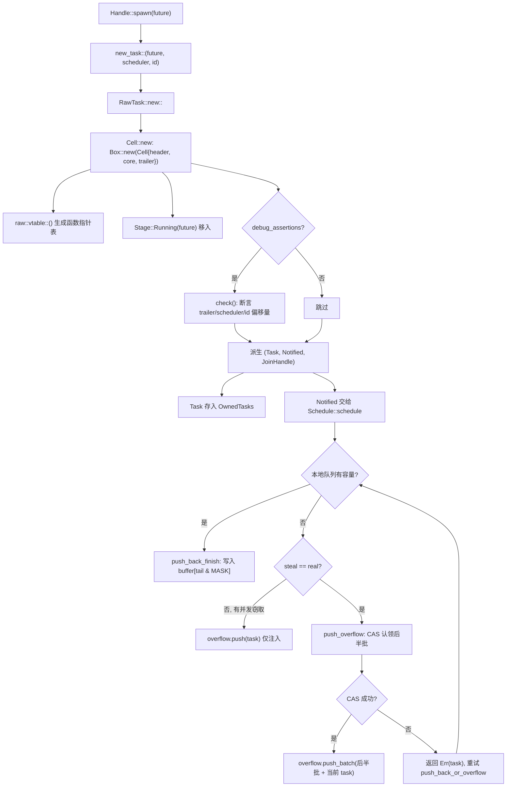
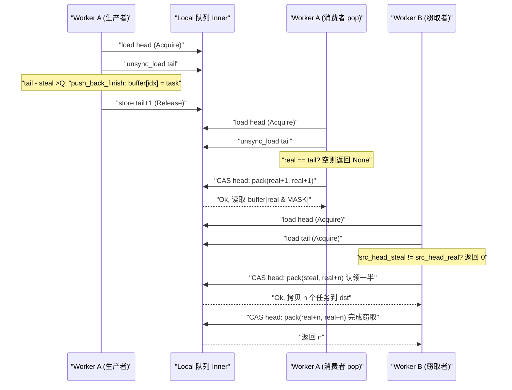

# Глава 3: Жизнь задачи (часть 1): как spawn превращает Future в планируемую сущность

В предыдущей главе мы завершили сборку Runtime: I/O driver, time driver, blocking pool и планировщик были внедрены в один экземпляр`Runtime`,`Handle`становясь общим дескриптором для доступа к этим компонентам из разных потоков. Но собранный runtime пока остаётся пустой оболочкой — у него есть движок для управления задачами, но нет ни одной задачи, которой можно управлять. Вопрос, на который отвечает эта глава: когда вы набираете`tokio::spawn(async { ... })`, что именно происходит с блоком`async`, прежде чем он из обычного кода на Rust превращается в сущность, «которую может подхватить планировщик, можно разбудить и можно join». Это первая половина «жизни задачи», мы сосредоточены на рождении: от`Handle::spawn`, через выделение с подсчётом ссылок`new_task`, до раскладки памяти`Cell<T, S>`, и наконец видим, как задача попадает в локальную очередь какого-либо worker или в глобальную очередь внедрения. Вторая половина (глава 4) войдёт в цикл планирования и замкнутый контур poll/wake.

# 3.1 Future — это не задача: что на самом деле создаёт один spawn

## Интуитивная модель

Представьте`Future`как «рецепт», а задачу — как «блюдо, которое сейчас готовится на кухне». Сам рецепт статичен, копируем и не имеет никакого состояния выполнения; только когда кухня (планировщик) решает «готовим это блюдо сейчас», выделяет ему плиту (worker), номер заказа (TaskId) и окно выдачи (JoinHandle), он становится «блюдом в процессе приготовления». Без этой обёртки планировщик не может знать «на каком шаге блюдо», «кто его ждёт», «кого уведомить, когда готово» — он видит только рецепт и не может управлять.

## Структуры данных и раскладка памяти

Tokio использует`Task<S>`для представления «ссылки на задачу, которой владеет runtime», это прозрачная обёртка над`RawTask`:

```rust
#[repr(transparent)]
pub(crate) struct Task {
    raw: RawTask,
    _p: PhantomData,
}
```

[FACT:tokio/src/runtime/task/mod.rs:233-238]

`#[repr(transparent)]`означает, что`Task<S>`и`RawTask`полностью совпадают в памяти, без дополнительных накладных расходов.`PhantomData<S>`— это только маркер типа времени компиляции, отмечающий, к какому типу планировщика принадлежит задача`S`。

Реально всё состояние задачи несёт`Cell<T, S>`, и его раскладка — это краеугольный камень всего модуля задач:

```rust
#[repr(C)]
pub(super) struct Cell {
    pub(super) header: Header,
    pub(super) core: Core,
    pub(super) trailer: Trailer,
}
```

[FACT:tokio/src/runtime/task/core.rs:126-136]

Три поля упорядочены по принципу «горячее — тёплое — холодное».`Header`— горячие данные (доступ на каждом планировании, каждом переходе состояния),`Core`— тёплые данные (доступ при poll),`Trailer`— холодные данные (доступ только при создании и уничтожении). В комментарии явно сказано:`Header`должен быть первым полем, потому что структура задачи одновременно будет`*mut Cell`и`*mut Header`ссылаться[FACT:tokio/src/runtime/task/core.rs:37-43]。

Что ещё важнее — выравнивание по кэш-линии.`Cell`несёт длинную цепочку`#[cfg_attr(..., repr(align(...)))]`, выбирая число байт выравнивания в зависимости от целевой архитектуры: x86_64/aarch64/powerpc64 используют 128 байт, arm/mips/sparc/hexagon — 32 байта, m68k — 16 байт, s390x — 256 байт, остальные по умолчанию 64 байта[FACT:tokio/src/runtime/task/core.rs:64-125]. В комментарии объясняется, почему x86_64 должен использовать 128, а не 64: начиная с Intel Sandy Bridge, пространственный префетчер за один раз подтягивает**парные**64-байтовые кэш-линии, поэтому нужно выравнивание на 128 байт, чтобы избежать ложного разделения[FACT:tokio/src/runtime/task/core.rs:45-53]。

> **[Design Inference & Architectural Trade-offs]**
> Цена этой стратегии выравнивания — потеря как минимум одной кэш-линии на каждую задачу. Но биты состояния задачи (`state`) часто читаются и записываются несколькими worker-потоками — один поток при poll устанавливает бит RUNNING, другой при пробуждении читает бит NOTIFIED — если биты состояния двух задач попадут в одну кэш-линию, каждый переход состояния будет вызывать перебрасывание кэш-линии между ядрами (cache line ping-pong), и потери производительности намного превысят трату памяти. Tokio выбирает обмен пространства на время.

`Header`сам ограничен размером в 8 указателей:

```rust
#[test]
#[cfg(not(loom))]
fn header_lte_cache_line() {
    assert!(std::mem::size_of::() ());
}
```

[FACT:tokio/src/runtime/task/core.rs:591-593]

Этот тест гарантирует, что`Header`не превысит 64 байта (8 × 8), тем самым на архитектурах с 64-байтовой кэш-линией полностью поместится в одну линию.`Header`включает поля:`state: State`(атомарные биты состояния),`queue_next: UnsafeCell<Option<NonNull<Header>>>`(указатель связного списка очереди внедрения),`vtable: &'static Vtable`(таблица указателей на функции),`owner_id: UnsafeCell<Option<NonZeroU64>>`(ID списка`OwnedTasks`, которому принадлежит),`scheduled_at: UnsafeCell<ScheduleLatencyInstant>`(измерение задержки планирования)[FACT:tokio/src/runtime/task/core.rs:169-198]。

`Core<T, S>`содержит дескриптор планировщика`scheduler: S`, ID задачи`task_id: Id`, и самое главное`stage: CoreStage<T>` [FACT:tokio/src/runtime/task/core.rs:148-165]。`Stage`— это трёхсостоянийное перечисление:

```rust
#[repr(C)]
pub(super) enum Stage {
    Running(T),
    Finished(super::Result),
    Consumed,
}
```

[FACT:tokio/src/runtime/task/core.rs:225-229]

Именно это и есть ключ к «Future и Output используют одну и ту же память»: во время выполнения задача`Stage::Running`содержит future, после завершения на месте заменяется на`Stage::Finished(output)`, после того как его заберёт`JoinHandle`, становится`Stage::Consumed`。`#[repr(C)]`Комментарий указывает на issue Miri, объясняя, что эта раскладка предъявляет жёсткие требования к корректности unsafe-кода[FACT:tokio/src/runtime/task/core.rs:225-229]。

`Trailer`хранит холодные данные:`owned: linked_list::Pointers<Header>`（`OwnedTasks`указатель связного списка),`waker: UnsafeCell<Option<Waker>>`(waker потребителя, ожидающего завершения задачи),`hooks: TaskHarnessScheduleHooks` [FACT:tokio/src/runtime/task/core.rs:205-213]。

## Пошагово: от spawn до постановки в очередь

Возьмём конкретный сценарий: в multi_thread runtime worker-поток A выполняет`tokio::spawn(async { 42 })`。

**Шаг первый: построение трио задачи.** `new_task`— единственная точка входа для рождения задачи:

```rust
fn new_task(
    task: T,
    scheduler: S,
    id: Id,
    spawned_at: SpawnLocation,
) -> (Task, Notified, JoinHandle)
```

[FACT:tokio/src/runtime/task/mod.rs:336-346]

Он вызывает`RawTask::new::<T, S>`для выделения`Cell`, затем из того же указателя`raw`порождает три ссылки:`Task`(owned-ссылка, обычно немедленно помещается в`OwnedTasks`）、`Notified`(ссылка уведомления, передаётся планировщику),`JoinHandle`(дескриптор чтения результата)[FACT:tokio/src/runtime/task/mod.rs:347-363]. Обратите внимание, что все три совместно используют один и тот же`raw`, и каждый хранит собственный счётчик ссылок.

**Шаг второй: выделить`Cell`и записать начальное состояние.** `Cell::new`Выделить всю структуру в куче:

```rust
let result = Box::new(Cell {
    trailer: Trailer::new(scheduler.hooks()),
    header: new_header(state, vtable, ...),
    core: Core {
        scheduler,
        stage: CoreStage {
            stage: UnsafeCell::new(Stage::Running(future)),
        },
        task_id,
        ...
    },
});
```

[FACT:tokio/src/runtime/task/core.rs:261-278]

`vtable`создаётся из`raw::vtable::<T, S>()`, представляет собой таблицу указателей на функции, мономорфизированную для конкретных`T`и`S`. future перемещается непосредственно в[FACT:tokio/src/runtime/task/core.rs:260], без дополнительной упаковки.`Stage::Running`Шаг третий: проверка макета с помощью debug-assert.

**В**,`debug_assertions`вызывает`Cell::new`функцию, используя`check`и другие арифметические операции с указателями на основе смещений vtable, чтобы поочерёдно утверждать, что «адрес поля, полученный через header» совпадает с «фактическим адресом поля»`Header::get_trailer`、`Header::get_scheduler`、`Header::get_id_ptr`. Это самопроверка корректности смещений vtable во время выполнения.[FACT:tokio/src/runtime/task/core.rs:280-321]Шаг четвёртый: отправить планировщику.

**Планировщик, получив**, вызывает`Notified<S>`. В multi_thread это приводит к`Schedule::schedule` [FACT:tokio/src/runtime/task/mod.rs:315], задача помещается в локальную очередь текущего worker'а, а при переполнении очереди перетекает в очередь инъекции.`push_back_or_overflow`Следующая диаграмма описывает поток управления и ветвления от

до постановки в очередь:`new_task`Копировать



), и если он есть, только текущая задача помещается в очередь инъекции, поскольку освобождённое вором пространство скоро станет доступным.`steal != real`Размышление о дизайне: почему три ссылки, а не одна

## возвращает три ссылки, а не одну. Это ядро дизайна подсчёта ссылок:

`new_task`представляет «время выполнения владеет этой задачей»,`Task`представляет «эта задача была уведомлена и ожидает планирования»,`Notified`представляет «кто-то заинтересован в её результате». Все три имеют независимые жизненные циклы —`JoinHandle`может быть drop (задача продолжает выполняться, результат отбрасывается),`JoinHandle`исчезает после poll,`Notified`освобождается после завершения задачи и удаления из`Task`. Если бы была только одна ссылка, нельзя было бы выразить состояние «задача ещё выполняется, но никто не делает join».`OwnedTasks`— ещё одно важное ветвление: он хранит

`UnownedTask`два**счётчика ссылок, используемых для blocking-задач (не сохраняются в**функция через`OwnedTasks`）[FACT:tokio/src/runtime/task/mod.rs:286-295]。`unowned`и`mem::forget(task)`объединяет две ссылки в`mem::forget(notified)`. Мотивация дизайна «двух ссылок» такова: у blocking-задач нет`UnownedTask` [FACT:tokio/src/runtime/task/mod.rs:388-397]списка для хранения owned-ссылки, поэтому нужен дополнительный счётчик ссылок, чтобы гарантировать, что задача не будет освобождена во время выполнения.`OwnedTasks`3.2 Биты состояния: как один usize кодирует весь жизненный цикл задачи

# Интуитивная модель

## Представьте состояние задачи как «бланк медицинского осмотра» с несколькими независимыми флажками: выполняется ли poll, завершена ли, уведомлена ли, отменена ли, есть ли join. Tokio не использует несколько булевых полей, а упаковывает эти флаги в

один**. Так каждое изменение состояния требует лишь одного CAS, а не множества блокировок. Без этого дизайна переходы состояний задачи превратились бы во вложенность нескольких блокировок, а риск взаимоблокировок и накладные расходы резко возросли бы.`AtomicUsize`**Раскладка битовых полей

## Битовые поля

`State`полностью определены в документации модуля[FACT:tokio/src/runtime/task/mod.rs:32-53]：

- `RUNNING`: выполняется ли poll задачи или её отмена.**Этот бит одновременно служит блокировкой задачи** [FACT:tokio/src/runtime/task/mod.rs:37-38]。
- `COMPLETE`: future полностью завершён и удалён. После установки никогда не сбрасывается и никогда не устанавливается одновременно с`RUNNING`[FACT:tokio/src/runtime/task/mod.rs:40-41]。
- `NOTIFIED`: существует ли в данный момент объект`Notified`[FACT:tokio/src/runtime/task/mod.rs:43]。
- `CANCELLED`: задача должна быть отменена как можно скорее[FACT:tokio/src/runtime/task/mod.rs:45-46]。
- `JOIN_INTEREST`: существует`JoinHandle` [FACT:tokio/src/runtime/task/mod.rs:48]。
- `JOIN_WAKER`: управляющий бит доступа как waker для join handle[FACT:tokio/src/runtime/task/mod.rs:50-51]。

Остальные биты используются для счётчика ссылок[FACT:tokio/src/runtime/task/mod.rs:53]。

`RUNNING`Тот факт, что бит служит блокировкой, заслуживает подробного рассмотрения. В разделе Safety документации модуля указано: любой изменяемый доступ к future должен происходить после получения блокировки путём изменения`RUNNING`бита, что гарантирует эксклюзивный доступ[FACT:tokio/src/runtime/task/mod.rs:130-133]. Это означает, что при poll задачи поток сначала CAS устанавливает`RUNNING`, и в случае успеха получает эксклюзивный доступ к future; при неудаче это означает, что другой поток уже выполняет poll, и текущий poll немедленно возвращается. Это объединяет «взаимное исключение poll» и «переход состояния» в одну атомарную операцию, избегая отдельного мьютекса.

## Протокол управления доступом JOIN_WAKER

`JOIN_WAKER`Бит`waker`— самая изящная часть всего конечного автомата. Он решает проблему:`Trailer`поле (в**) может одновременно访问 двумя потоками — среда выполнения при завершении задачи**читает`JoinHandle`его, чтобы разбудить join'ера,**при poll**записывает[FACT:tokio/src/runtime/task/mod.rs:75-120]：

1. `JOIN_WAKER`его для регистрации waker. Документация модуля приводит 7 правил

изначально равен 0.`JoinHandle`2. Когда равен 0,

имеет эксклюзивный (изменяемый) доступ к полю waker.`JoinHandle`3. Когда равен 1,

имеет только разделяемый (только для чтения) доступ.`COMPLETE`4. Когда равен 1 и

5. `JoinHandle`равен 1, среда выполнения имеет разделяемый (только для чтения) доступ к полю waker.`JOIN_WAKER`Чтобы записать waker, необходимо: (i) успешно установить`JOIN_WAKER`в 0 для получения эксклюзивного права, (ii) записать waker, (iii) успешно установить

6. `JoinHandle`в 1.`COMPLETE`может изменять`JOIN_WAKER`только когда`COMPLETE`равен 0; среда выполнения может изменять только когда

равен 1.`JOIN_INTEREST`7. Если`COMPLETE`равен 0 и

равен 1, среда выполнения имеет эксклюзивный доступ к полю waker (для drop waker).`COMPLETE`Правило 6 подразумевает гонку: шаг (i) или (iii) может завершиться неудачей. Если (i) не удался, запись waker отменяется; если (iii) не удался (другой поток за это время установил[FACT:tokio/src/runtime/task/mod.rs:110-120]), то поле waker очищается

## . Суть этого протокола: с помощью одного атомарного бита динамически передавать владение между «писателем» и «читателем», избегая отдельной блокировки для поля waker.

`Task`Два способа уменьшения счётчика ссылок`UnownedTask`drop уменьшается дважды:

```rust
impl Drop for Task {
    fn drop(&mut self) {
        if self.header().state.ref_dec() {
            self.raw.dealloc();
        }
    }
}
```

[FACT:tokio/src/runtime/task/mod.rs:580-586]

```rust
impl Drop for UnownedTask {
    fn drop(&mut self) {
        if self.raw.header().state.ref_dec_twice() {
            self.raw.dealloc();
        }
    }
}
```

[FACT:tokio/src/runtime/task/mod.rs:590-596]

`ref_dec`возвращает`true`указывает, что это последняя ссылка, и только тогда真正 освобождает`Cell`память.`ref_dec_twice`это`UnownedTask`прямое проявление удержания двух счётчиков.

## Размышление о дизайне: почему биты состояния и счётчик ссылок используют один атомарный

> **[Design Inference & Architectural Trade-offs]**
> Размещение битов состояния и счётчика ссылок в одном`AtomicUsize`сделано для того, чтобы две операции — «уменьшение счётчика ссылок» и «установка бита состояния» — могли быть выполнены за**один CAS**. В документации модуля в комментарии к`Schedule::release`явно сказано: «Модуль задач будет пакетно обрабатывать ref-dec и установку других опций»[FACT:tokio/src/runtime/task/mod.rs:302-304]. Если бы биты состояния и счётчик ссылок находились в двух разных атомарных переменных, то между «освобождением последней ссылки» и «отметкой завершения» возникло бы окно, требующее дополнительной синхронизации. После объединения`ref_dec`может атомарно выполнить «уменьшение счётчика + проверку обнуления», избегая проблем класса ABA.

# 3.3 JoinHandle: как результат передаётся через границы задачи

## Интуитивная модель

`JoinHandle`подобен «талону на получение блюда», который выдаёт вам ресторан. Когда задача (кухня) завершается, она кладёт блюдо (output) на раздачу (`Stage::Finished`), а затем активирует ваш пейджер (waker). Вы приходите с талоном, чтобы забрать его; сам талон не содержит блюда, это лишь указатель на раздачу. Если вы потеряете талон (drop`JoinHandle`), блюдо будет сразу выброшено (output будет drop), но кухня из-за этого не остановится.

## Структура данных

`JoinHandle<T>`также является прозрачной обёрткой над`RawTask`:

```rust
pub struct JoinHandle {
    raw: RawTask,
    _p: PhantomData,
}
```

[FACT:tokio/src/runtime/task/join.rs:163-166]

`PhantomData<T>`помечает тип вывода.`JoinHandle<T>`только в`T: Send`является`Send`/`Sync` [FACT:tokio/src/runtime/task/join.rs:169-170], это гарантирует, что non-Send output не будет перемещён между потоками.

## Пошагово: await для JoinHandle

`JoinHandle`реализует`Future`, его`poll`является ядром передачи результата:

```rust
fn poll(self: Pin, cx: &mut Context) -> Poll {
    ready!(crate::trace::trace_leaf());
    let mut ret = Poll::Pending;
    let coop = ready!(crate::task::coop::poll_proceed(cx));
    unsafe {
        self.raw.try_read_output(&mut ret, cx.waker());
    }
    if ret.is_ready() {
        coop.made_progress();
    }
    ret
}
```

[FACT:tokio/src/runtime/task/join.rs:327-354]

Обратите внимание на несколько деталей:`trace_leaf`используется для инструментирования tracing;`coop::poll_proceed`расходует бюджет кооперации (подробно в главе 12);`try_read_output`через vtable стирает обобщения, размещает возвращаемое значение на стеке и с помощью`*mut ()`передаёт в[FACT:tokio/src/runtime/task/join.rs:327-354]. Этот приём «размещения возвращаемого значения на стеке» нужен потому, что функция vtable не может обобщённо возвращать тип`T`, и может только записывать обратно через сырой указатель.

> **[Design Inference & Architectural Trade-offs]**
> `try_read_output`внутренняя логика (в raw.rs, исходный код в этой главе не предоставлен): сначала проверяется бит`COMPLETE`, если он уже установлен, вызывается`take_output`для извлечения результата из`Stage::Finished`; иначе`cx.waker()`регистрируется в поле`Trailer::waker`и возвращается`Pending`. Процесс регистрации как раз следует протоколу`JOIN_WAKER`из раздела 3.2.

## Передача владения результатом

Раздел «Non-Send output» документации модуля точно описывает правила владения результатом[FACT:tokio/src/runtime/task/mod.rs:151-170]：

- При завершении задачи output помещается в`Stage`, затем выполняется переход «установить COMPLETE» и считывается текущее значение`JOIN_INTEREST`.
- Если`JOIN_INTEREST`равно 0 (нет`JoinHandle`), output немедленно drop[FACT:tokio/src/runtime/task/mod.rs:157-158]。
- Если`JOIN_INTEREST`равно 1,`JoinHandle`отвечает за очистку output[FACT:tokio/src/runtime/task/mod.rs:160-161]。

Для non-Send output документация приводит трёхшаговое доказательство: output создаётся в потоке, который выполняет poll future;`JoinHandle<Output>`также не Send, когда Output не Send, поэтому он тоже находится в потоке spawn; следовательно,`JoinHandle`при извлечении или drop output не перемещается между потоками[FACT:tokio/src/runtime/task/mod.rs:164-170]。

## drop для JoinHandle: быстрый и медленный пути

```rust
impl Drop for JoinHandle {
    fn drop(&mut self) {
        if self.raw.state().drop_join_handle_fast().is_ok() {
            return;
        }
        self.raw.drop_join_handle_slow();
    }
}
```

[FACT:tokio/src/runtime/task/join.rs:358-364]

`drop_join_handle_fast`пытается одним CAS выполнить «очистку бита`JOIN_INTEREST`+ уменьшение счётчика ссылок». Если не удаётся (например, задача завершается, бит состояния занят), то идёт по медленному пути`drop_join_handle_slow`. Это типичный шаблон «оптимистичный быстрый путь + пессимистичный медленный путь».

## Размышление о дизайне: почему JoinHandle не хранит output напрямую

> **[Design Inference & Architectural Trade-offs]**
> Если`JoinHandle`напрямую хранит output, то output должен быть перемещён в поток, где находится`JoinHandle`, при завершении задачи. Но`JoinHandle`может быть перемещён в любой поток (при условии`T: Send`), а поток, создающий output, — это поток poll. Прямое хранение привело бы к перемещению между потоками, когда «output создаётся в потоке poll, но должен быть drop в потоке join», что для non-Send output напрямую нарушает систему типов. Tokio выбирает оставить output в`Cell`(`Stage::Finished`），`JoinHandle`хранит только`Cell`, указывающий на`RawTask`, и при получении результата извлекает его на месте через`take_output`. Таким образом, drop output происходит в потоке, где находится`JoinHandle`, но при условии, что этот поток совпадает с потоком poll (выполняется в сценарии non-Send).

# 3.4 Локальная очередь: структура производитель-потребитель для work-stealing

## Интуитивная модель

У каждого worker есть «личный список дел» (локальная очередь) ёмкостью 256. Сам worker берёт задачи с**головы**(LIFO, используя локальность кэша), другие worker'ы**крадут**задачи с хвоста (FIFO, забирая самые старые, наиболее вероятно уже завершённые задачи). Без локальной очереди все задачи толпились бы в глобальной очереди, и при каждом взятии задачи приходилось бы конкурировать за глобальную блокировку, что разрушило бы масштабируемость на многоядерных системах.

## Раскладка памяти: разделение head и tail

```rust
pub(crate) struct Inner {
    head: AtomicUnsignedLong,
    tail: AtomicUnsignedShort,
    buffer: Box>>; LOCAL_QUEUE_CAPACITY]>,
}
```

[FACT:tokio/src/runtime/scheduler/multi_thread/queue.rs:36-57]

`head`это`AtomicUnsignedLong`(64 бита, если платформа поддерживает u64),`tail`это`AtomicUnsignedShort`(32 бита). Комментарий объясняет, почему индексы шире, чем фактически необходимо: для смягчения ABA и различения «полного» и «пустого» буфера[FACT:tokio/src/runtime/scheduler/multi_thread/queue.rs:37-49]。

`head`внутри упаковывает**два** `UnsignedShort`：младшие биты — это «реальная голова» (real head), старшие — «первая позиция, обрабатываемая вором» (steal head). Когда они равны, активных воров нет[FACT:tokio/src/runtime/scheduler/multi_thread/queue.rs:39-49]. Эта двойная упаковка — ключевой приём очереди work-stealing: вор сначала через CAS обновляет значение steal, чтобы «застолбить» партию задач, а завершив, догоняет значение steal до real, обозначая конец кражи.

`LOCAL_QUEUE_CAPACITY`Вне loom это 256, под loom сокращается до 4, чтобы протестировать больше граничных случаев[FACT:tokio/src/runtime/scheduler/multi_thread/queue.rs:62-69]。`MASK = LOCAL_QUEUE_CAPACITY - 1`, используется для индексации кольцевого буфера[FACT:tokio/src/runtime/scheduler/multi_thread/queue.rs:71]。

## Пошагово: полное ветвление push_back_or_overflow

Это самая сложная функция локальной очереди, разберём её по ветвям:

```rust
pub(crate) fn push_back_or_overflow>(
    &mut self,
    mut task: task::Notified,
    overflow: &O,
    stats: &mut Stats,
) {
    let tail = loop {
        let head = self.inner.head.load(Acquire);
        let (steal, real) = unpack(head);
        let tail = unsafe { self.inner.tail.unsync_load() };

        if tail.wrapping_sub(steal)  return,
                Err(v) => { task = v; }
            }
        }
    };
    self.push_back_finish(task, tail);
}
```

[FACT:tokio/src/runtime/scheduler/multi_thread/queue.rs:188-223]

Три ветви:

1. **Есть ёмкость**（`tail - steal < CAPACITY`）：`break tail`, после выхода из цикла вызывается`push_back_finish`запись в буфер.

2. **Нет ёмкости, но есть конкурентные воры**（`steal != real`): воры освободят место, поэтому текущая задача просто помещается в очередь инъекции и сразу возвращается[FACT:tokio/src/runtime/scheduler/multi_thread/queue.rs:204-208]。

3. **Нет ёмкости и нет воров**: вызывается`push_overflow`переполнение второй половины партии задач в очередь инъекции[FACT:tokio/src/runtime/scheduler/multi_thread/queue.rs:209-219]. Если CAS не удался (проиграли конкурентному вору),`push_overflow`возвращает`Err(task)`, цикл повторяется.

`push_back_finish`запись задачи и обновление tail:

```rust
fn push_back_finish(&self, task: task::Notified, tail: UnsignedShort) {
    let idx = tail as usize & MASK;
    self.inner.buffer[idx].with_mut(|ptr| {
        unsafe { ptr::write((*ptr).as_mut_ptr(), task); }
    });
    self.inner.tail.store(tail.wrapping_add(1), Release);
}
```

[FACT:tokio/src/runtime/scheduler/multi_thread/queue.rs:226-244]

`Release`порядок гарантирует видимость записанной задачи для воров.

## push_overflow: почему переполняется вторая половина партии

```rust
const NUM_TASKS_TAKEN: UnsignedShort = (LOCAL_QUEUE_CAPACITY / 2) as UnsignedShort;
```

[FACT:tokio/src/runtime/scheduler/multi_thread/queue.rs:265]

При переполнении забираются 128 задач. Комментарий подробно объясняет, почему берётся**вторая половина**, а не первая[FACT:tokio/src/runtime/scheduler/multi_thread/queue.rs:295-306]: при извлечении задач из очереди инъекции они всегда помещаются в первую половину. Поэтому если задача находится во второй половине, можно быть уверенным, что она не была только что взята из очереди инъекции. Это гарантирует, что «задача, извлечённая из очереди инъекции, не будет немедленно возвращена обратно в очередь инъекции» (по крайней мере, до того, как её хотя бы раз опросят через poll).

CAS-застолбление второй половины партии:

```rust
if self.inner.head.compare_exchange_weak(
    pack(head, head), pack(tail, tail), Release, Relaxed
).is_err() {
    return Err(task);
}
```

[FACT:tokio/src/runtime/scheduler/multi_thread/queue.rs:283-293]

Обновление`head`с`(head, head)`до`(tail, tail)`, то есть одновременное продвижение steal и real до tail, застолбление всех задач. После успеха tail откатывается до`tail + NUM_TASKS_TAKEN`, что означает, что первая половина партии остаётся в локальной очереди[FACT:tokio/src/runtime/scheduler/multi_thread/queue.rs:314-316]。

## pop и steal_into: два пути извлечения задач

`pop`— это извлечение задачи самим worker'ом (с головы, LIFO):

```rust
pub(crate) fn pop(&mut self) -> Option> {
    let mut head = self.inner.head.load(Acquire);
    let idx = loop {
        let (steal, real) = unpack(head);
        let tail = unsafe { self.inner.tail.unsync_load() };
        if real == tail { return None; }
        let next_real = real.wrapping_add(1);
        let next = if steal == real {
            pack(next_real, next_real)
        } else {
            assert_ne!(steal, next_real);
            pack(steal, next_real)
        };
        let res = self.inner.head.compare_exchange_weak(head, next, AcqRel, Acquire);
        match res {
            Ok(_) => break real as usize & MASK,
            Err(actual) => head = actual,
        }
    };
    Some(self.inner.buffer[idx].with(|ptr| unsafe { ptr::read(ptr).assume_init() }))
}
```

[FACT:tokio/src/runtime/scheduler/multi_thread/queue.rs:361-399]

Ключевая ветвь: если`steal == real`(нет воров), продвигаются оба; иначе продвигается только real, steal остаётся неизменным[FACT:tokio/src/runtime/scheduler/multi_thread/queue.rs:377-384]。`assert_ne!(steal, next_real)`гарантирует, что real не будет продвинут до позиции steal, иначе будет нарушено состояние застолбления воров.

`steal_into`— это путь кражи, сначала проверяется, достаточно ли места в целевой очереди:

```rust
if dst_tail.wrapping_sub(steal) > LOCAL_QUEUE_CAPACITY as UnsignedShort / 2 {
    return None;
}
```

[FACT:tokio/src/runtime/scheduler/multi_thread/queue.rs:431-435]

Если целевая очередь заполнена более чем наполовину, кража не выполняется, чтобы избежать немедленного переполнения после кражи.

`steal_into2`— ядро кражи, вычисляется количество для кражи:

```rust
let n = src_tail.wrapping_sub(src_head_real);
let n = n - n / 2;
```

[FACT:tokio/src/runtime/scheduler/multi_thread/queue.rs:487-488]

Крадётся половина (с округлением вверх). Затем через CAS обновляется значение steal в head для застолбления:

```rust
let steal_to = src_head_real.wrapping_add(n);
next_packed = pack(src_head_steal, steal_to);
let res = self.0.head.compare_exchange_weak(prev_packed, next_packed, AcqRel, Acquire);
```

[FACT:tokio/src/runtime/scheduler/multi_thread/queue.rs:496-506]

Обратите внимание, что здесь обновляется только значение real (`pack(src_head_steal, steal_to)`steal остаётся неизменным), real продвигается до`steal_to`. Это означает «эти задачи застолблены, другие воры не могут их трогать». После завершения кражи steal догоняется до real:

```rust
loop {
    let head = unpack(prev_packed).1;
    next_packed = pack(head, head);
    let res = self.0.head.compare_exchange_weak(prev_packed, next_packed, AcqRel, Acquire);
    match res {
        Ok(_) => return n,
        Err(actual) => prev_packed = actual,
    }
}
```

[FACT:tokio/src/runtime/scheduler/multi_thread/queue.rs:548-561]

Приведённая ниже временная диаграмма описывает трёхстороннее конкурентное взаимодействие «производитель push, потребитель pop, вор steal»:



## Размышления о дизайне: почему локальная очередь LIFO, а кража FIFO

> **[Design Inference & Architectural Trade-offs]**
> Worker сам извлекает с головы (LIFO), потому что последняя добавленная задача с наибольшей вероятностью ещё находится в кэше CPU и с наибольшей вероятностью является задачей «только что разбуженной, данные ещё горячие». Воры извлекают с хвоста (FIFO), потому что самая старая задача с наибольшей вероятностью уже выполнила большую часть работы, и её кража быстрее всего снизит нагрузку жертвы. Эта комбинация «LIFO локально + FIFO кража» — классический дизайн work-stealing планирования, сочетающий локальность кэша и балансировку нагрузки.

На этом задача завершила превращение из Future в планируемую сущность: ей назначен счётчик ссылок, она помещена в`Cell`раскладку памяти и успешно доставлена в локальную очередь worker'а или глобальную очередь инъекции. Но помещение задачи в очередь — это только начало; по-настоящему заставляет её работать цикл планирования потока worker'а. В следующей главе мы войдём во вторую половину «жизни задачи», проследим, как worker извлекает задачу из очереди, вызывает`Future::poll`, и при возврате`Pending`через`Waker`регистрирует пробуждение, в конечном итоге запуская`schedule`повторную постановку в очередь — полный путь вызовов замкнутого цикла «пробуждение → постановка в очередь → повторный poll», а также стратегия work-stealing и оптимизация LIFO-слотов будут раскрыты там.
