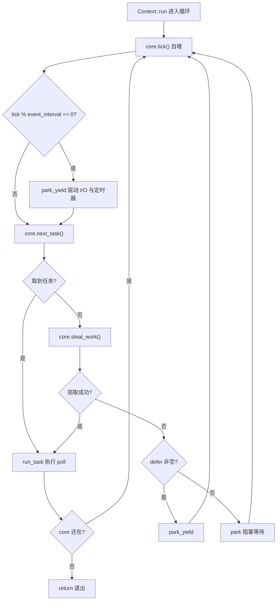
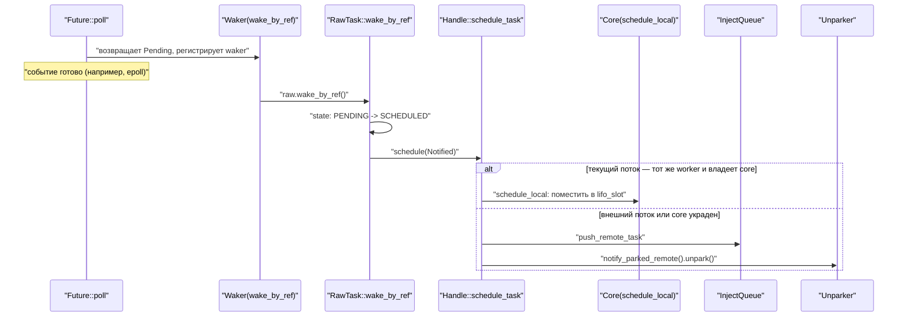
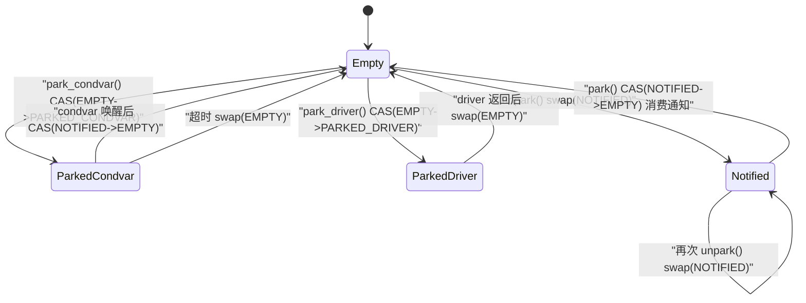

# Глава 4: Жизнь задачи (часть 2): цикл планирования, poll и замкнутый цикл пробуждения

# От очереди к выполнению: скелет главного цикла worker'а

В предыдущей главе мы отправили задачу в`Local`очередь или глобальную очередь инъекции. Но очередь — это лишь «список дел», а по-настоящему заставляет задачи выполняться тот бесконечный цикл в потоке worker'а. В этой главе мы проследим`Context::run`— это сердце всего многопоточного планировщика.

Сначала построим интуицию: поток worker'а подобен повару, перед которым лежит стопка своих заказов (`run_queue`), а рядом ещё есть общая стойка заказов (`inject`). Повар сначала смотрит на ближайший к себе лист (`lifo_slot`), если нет — берёт из своей стопки, если и там нет — хватает горсть с общей полки, а если и это не помогло — крадёт несколько штук из стопки другого повара. Только когда всё пусто, он идёт отдыхать, но даже во время отдыха держит ухо востро — стоит появиться заказу, как он тут же просыпается.

Без этого цикла задача после постановки в очередь навсегда останется лежать в очереди,`Future::poll`никогда не будет вызвана, и всё runtime — просто куча мёртвых данных.

## Структура памяти и поля состояния Core

Всё изменяемое состояние worker хранится в`Core`, оно`Box`выделено в куче и передаётся через`AtomicCell<Core>`между`Worker`и локальным для потока`Context`.

`Core`Ключевые поля[FACT:tokio/src/runtime/scheduler/multi_thread/worker.rs:113-167]：

- `tick: u32`следующие: счётчик, инкрементируемый на каждой итерации цикла, используется для периодического запуска обслуживания (`maintenance`) и проверки глобальной очереди.
- `lifo_slot: Option<Notified>`：**LIFO-слот**, это самое изящное решение в данной главе. Когда worker сам планирует задачу, она не попадает в`run_queue`, а кладётся в этот слот, и при следующем взятии задачи**в первую очередь**берётся оттуда.
- `lifo_enabled: bool`: переключатель LIFO-слота, используется для предотвращения голодания в сценариях ping-pong.
- `run_queue: queue::Local<Arc<Handle>>`: локальная очередь, структура`Local`, разобранная в предыдущей главе.
- `is_searching: bool`: ищет ли worker задачи, которые можно украсть.
- `is_shutdown: bool` / `is_traced: bool`: флаги завершения и трассировки.
- `park: Option<Parker>`: паркер, обёрнутый в`Option`для удобного извлечения/возврата под проверкой заимствования.
- `global_queue_interval: u32`: как часто проверять глобальную очередь.
- `rand: FastRand`: быстрый генератор случайных чисел, используется для случайного выбора начальной точки кражи.

> **[Design Inference & Architectural Trade-offs]**
> Обратите внимание, что`lifo_slot`— это`Option<Notified>`, а не очередь — он хранит**только одну**задачу. Мотивация этого решения ясно описана в комментариях к исходному коду[FACT:tokio/src/runtime/scheduler/multi_thread/worker.rs:117-121]: задачи, запланированные самим worker, сохраняются в этот слот, и worker проверяет его`run_queue` **перед**проверкой

Почему LIFO снижает задержку? Рассмотрим типичный сценарий передачи сообщений: задача A, обработав сообщение, пробуждает задачу B, B, обработав, пробуждает A. Если после пробуждения B со стороны A задача B сразу запускается, данные, нужные B, скорее всего, ещё находятся в кэше CPU (так как A только что к ним обращалась). Если же B помещается в хвост очереди, то пока выполнятся десятки задач перед ней, кэш давно будет вытеснен.

Но у LIFO есть риск голодания. В исходном коде используется`MAX_LIFO_POLLS_PER_TICK = 3`для ограничения[FACT:tokio/src/runtime/scheduler/multi_thread/worker.rs:263-263]: на каждом тике LIFO-слот получает приоритет максимум 3 раза, после чего отключается, давая возможность выполниться другим задачам.

## Разбор основного цикла: один полный цикл планирования

Представим конкретный сценарий: worker 0 только что проснулся из`park`,`run_queue`содержит 5 задач,`lifo_slot`содержит 1 задачу, в глобальной очереди 3 задачи.

Точка входа основного цикла —`Context::run` [FACT:tokio/src/runtime/scheduler/multi_thread/worker.rs:570-642]. Сначала он сбрасывает`lifo_enabled`(так как core мог быть украден через`block_in_place`, состояние нужно вернуть на место)[FACT:tokio/src/runtime/scheduler/multi_thread/worker.rs:571-573], затем входит в цикл`while !core.is_shutdown`.

Каждая итерация цикла делает четыре вещи:

**Шаг первый: tick и обслуживание.** `core.tick()`инкрементирует счётчик[FACT:tokio/src/runtime/scheduler/multi_thread/worker.rs:587]. Затем`self.maintenance(core)`проверяет`tick % event_interval == 0`, и если да, вызывает`park_yield`для управления I/O и таймерами с нулевым таймаутом[FACT:tokio/src/runtime/scheduler/multi_thread/worker.rs:809-826]。

**Шаг второй: получение задачи.** `core.next_task(&self.worker)`— это основная логика получения задачи[FACT:tokio/src/runtime/scheduler/multi_thread/worker.rs:1090-1156]. Она имеет два пути:

- Когда`tick % global_queue_interval == 0`,**в первую очередь**берёт из глобальной очереди, если не удаётся — из локальной[FACT:tokio/src/runtime/scheduler/multi_thread/worker.rs:1091-1098]. Это делается для предотвращения голодания задач в глобальной очереди.
- Иначе**в первую очередь**берёт локальные задачи[FACT:tokio/src/runtime/scheduler/multi_thread/worker.rs:1090-1156]。

Локальное получение задачи выполняется через`next_local_task`[FACT:tokio/src/runtime/scheduler/multi_thread/worker.rs:1158-1160]：

```rust
fn next_local_task(&mut self) -> Option {
    self.lifo_slot.take().or_else(|| self.run_queue.pop())
}
```

сначала берётся LIFO-слот, затем голова очереди (LIFO-извлечение). Это и есть «локальный LIFO», о котором говорилось в предыдущей главе.

Если локальная очередь пуста, но глобальная не пуста, worker**пакетно**забирает задачи из глобальной очереди[FACT:tokio/src/runtime/scheduler/multi_thread/worker.rs:1110-1154]. Размер пакета`n`вычисляется очень продуманно:`min(inject.len() / remotes.len() + 1, cap)`, где`cap`в свою очередь берёт`min(remaining_slots, max_capacity / 2)`. Комментарий в исходном коде объясняет, почему ограничение составляет половину ёмкости очереди[FACT:tokio/src/runtime/scheduler/multi_thread/worker.rs:1120-1131]: чтобы гарантировать, что извлечённые задачи попадут в**первую половину**локальной очереди, и таким образом, даже если впоследствии произойдёт переполнение, эти задачи не будут вытолкнуты обратно в глобальную очередь (переполнение затрагивает только вторую половину).

**Шаг третий: запуск задачи.**Получив задачу, вызывает`run_task` [FACT:tokio/src/runtime/scheduler/multi_thread/worker.rs:647-796]. Это самая сложная функция в данной главе, мы разберём её отдельно в следующем разделе.

**Шаг четвёртый: кража или парковка.**Если`next_task`возвращает`None`, это означает, что ни локально, ни глобально работы нет, вызывается`steal_work` [FACT:tokio/src/runtime/scheduler/multi_thread/worker.rs:1167-1195]. Если кража не удалась, происходит вход в`park`или`park_yield` [FACT:tokio/src/runtime/scheduler/multi_thread/worker.rs:613-621]。

Весь поток управления выглядит так:



## run_task: poll и замкнутый цикл LIFO-слота

`run_task`— это место, где задача действительно`poll`, и одновременно точка замыкания цикла «пробуждение → постановка в очередь → повторный poll».

Первое, что делается после входа в функцию —`assert_owner` [FACT:tokio/src/runtime/scheduler/multi_thread/worker.rs:648], преобразует`Notified`в`Task`, одновременно утверждая (debug-assert), что текущий поток действительно является владельцем этой задачи.

Затем`transition_from_searching` [FACT:tokio/src/runtime/scheduler/multi_thread/worker.rs:652]— если worker ранее находился в состоянии поиска, теперь, когда задача найдена, нужно выйти из состояния поиска и, возможно, разбудить других припаркованных worker'ов.

Далее идёт ключевая обёртка budget[FACT:tokio/src/runtime/scheduler/multi_thread/worker.rs:695-795]：

```rust
coop::budget(|| {
    task.run();
    let mut lifo_polls = 0;
    loop {
        let mut core = match self.core.borrow_mut().take() {
            Some(core) => core,
            None => return ControlFlow::Break(()),
        };
        let task = match core.lifo_slot.take() {
            Some(task) => task,
            None => {
                self.reset_lifo_enabled(&mut core);
                core.stats.end_poll();
                return ControlFlow::Continue(core);
            }
        };
        if !coop::has_budget_remaining() {
            core.run_queue.push_back_or_overflow(task, ...);
            return ControlFlow::Continue(core);
        }
        lifo_polls += 1;
        if lifo_polls >= MAX_LIFO_POLLS_PER_TICK {
            core.lifo_enabled = false;
        }
        let task = self.worker.handle.shared.owned.assert_owner(task);
        *self.core.borrow_mut() = Some(core);
        task.run();
    }
})
```

Этот фрагмент кода раскрывает полный замкнутый цикл LIFO-слота:`task.run()`выполняет`Future::poll`, и если в процессе poll задача пробудила себя или другую задачу,`schedule_local`помещает новую задачу в`lifo_slot` [FACT:tokio/src/runtime/scheduler/multi_thread/worker.rs:1396-1408]. После возврата из poll цикл сразу проверяет`lifo_slot`, и если есть задача, продолжает выполнение —**не возвращаясь в основной цикл**, напрямую выполняя последовательные poll в рамках одного budget.

Это и есть проявление «пробуждение → постановка в очередь → повторный poll» на пути LIFO: при пробуждении задача помещается в`lifo_slot`, после возврата из poll немедленно извлекается и снова poll'ится, образуя плотный замкнутый цикл.

Обратите внимание на ветку`self.core.borrow_mut().take()``None`[FACT:tokio/src/runtime/scheduler/multi_thread/worker.rs:716-724]: если core был украден (например, внутри задачи был вызван`block_in_place`), worker должен вернуть`ControlFlow::Break(())`, чтобы`Context::run`вышел. Это`block_in_place`Точки взаимодействия с циклом планирования.

## Путь пробуждения: как Waker запускает повторную постановку в очередь

Когда`Future::poll`возвращает`Pending`, задача должна зарегистрировать`Waker`, чтобы быть разбуженной при готовности события. Реализация`Waker`в Tokio чрезвычайно лаконична — это просто необработанный указатель на`Header`задачи плюс таблица vtable.

`waker_ref`Создаётся`WakerRef` [FACT:tokio/src/runtime/task/waker.rs:11-34], оборачивается в`ManuallyDrop`, чтобы избежать уменьшения счётчика ссылок при drop. vtable — статическая`Waker`Копирование[FACT:tokio/src/runtime/task/waker.rs:119-119]：

```rust
static WAKER_VTABLE: RawWakerVTable =
    RawWakerVTable::new(clone_waker, wake_by_val, wake_by_ref, drop_waker);
```

, а затем вызывают соответствующий метод`Header`. Например,`RawTask`в конечном итоге вызывает[FACT:tokio/src/runtime/task/waker.rs:70-116]. Семантика такова: перевести состояние задачи из`wake_by_ref`в`raw.wake_by_ref()` [FACT:tokio/src/runtime/task/waker.rs:106-116]。

`wake_by_ref`, и если преобразование успешно (то есть ранее действительно было PENDING), вызвать`PENDING`для повторной постановки задачи в очередь.`SCHEDULED`Для многопоточного планировщика`Schedule::schedule`реализация находится в

Копирование`schedule`Логика разделяется на две ветви:`Handle::schedule_task` [FACT:tokio/src/runtime/scheduler/multi_thread/worker.rs:1353-1376]：

```rust
pub(super) fn schedule_task(&self, task: Notified, is_yield: bool) {
    with_current(|maybe_cx| {
        if let Some(cx) = maybe_cx {
            if self.ptr_eq(&cx.worker.handle) {
                if let Some(core) = cx.core.borrow_mut().as_mut() {
                    self.schedule_local(core, task, is_yield);
                    return;
                }
            }
        }
        self.push_remote_task(task);
        self.notify_parked_remote();
    });
}
```

— помещает в LIFO-слот или локальную очередь.

- Иначе (пробуждение из внешнего потока или core украден), идёт через`schedule_local` [FACT:tokio/src/runtime/scheduler/multi_thread/worker.rs:1385-1417]— помещает в глобальную очередь инъекций и
- будит parked worker`push_remote_task`Внутри снова две ветви`notify_parked_remote`: если это[FACT:tokio/src/runtime/scheduler/multi_thread/worker.rs:1379-1383]。

`schedule_local`или LIFO отключён, помещает в[FACT:tokio/src/runtime/scheduler/multi_thread/worker.rs:1385-1417]хвост; иначе помещает в`yield`, а задачу из исходного слота вытесняет в хвост очереди.`run_queue`Копирование`lifo_slot`park и unpark: атомарность машины состояний и пробуждения



## машины состояний плюс

как запасной вариант.`AtomicUsize`Поля`Condvar`. Констант состояния четыре

`Inner`: не припаркован.[FACT:tokio/src/runtime/scheduler/multi_thread/park.rs:31-43]：`state: AtomicUsize`、`mutex: Mutex<()>`、`condvar: Condvar`、`shared: Arc<Shared>`: припаркован на condvar.[FACT:tokio/src/runtime/scheduler/multi_thread/park.rs:36-45]：

- `EMPTY = 0`: припаркован на I/O driver.
- `PARKED_CONDVAR = 1`: уже разбужен.
- `PARKED_DRIVER = 2`Это явная машина состояний, мы используем её для построения диаграммы состояний (это единственное место в главе, соответствующее критериям
- `NOTIFIED = 3`— в исходном коде действительно есть эти четыре константы состояния):

Копирование`stateDiagram-v2`Реализация



`unpark`, а не CAS; комментарий в исходном коде объясняет причину[FACT:tokio/src/runtime/scheduler/multi_thread/park.rs:277-290]: необходимо выполнить release-операцию, чтобы припаркованный поток увидел записи до unpark, поэтому даже если state уже`swap`, нужно записать ещё раз.[FACT:tokio/src/runtime/scheduler/multi_thread/park.rs:277-290]Сначала пытается потребить уже имеющееся уведомление`NOTIFIED`: если CAS

`park`успешен, значит, ранее уже был разбужен, и сразу возвращается без блокировки. Иначе пытается захватить блокировку driver; если удалось — паркуется на driver, если нет — использует condvar как запасной вариант[FACT:tokio/src/runtime/scheduler/multi_thread/park.rs:132-149]Внутри есть классическая двойная проверка`NOTIFIED -> EMPTY`: сначала CAS[FACT:tokio/src/runtime/scheduler/multi_thread/park.rs:143-148]。

`park_condvar`, если неудачно и это[FACT:tokio/src/runtime/scheduler/multi_thread/park.rs:162-180], значит, был разбужен до установки состояния, и в этот момент необходимо`EMPTY -> PARKED_CONDVAR`для синхронизации записи unpark`NOTIFIED`. Комментарий особо подчёркивает: даже зная, что это`swap(EMPTY)`, нужно прочитать один раз, потому что unpark мог быть вызван ещё раз после нашего чтения[FACT:tokio/src/runtime/scheduler/multi_thread/park.rs:167-177].`NOTIFIED`Комментарий`NOTIFIED`указывает на классическую ловушку condvar: между установкой состояния

`unpark_condvar`припаркованным потоком и фактическим[FACT:tokio/src/runtime/scheduler/multi_thread/park.rs:292-307]есть окно, и если в этот период произойдёт notify, он будет проигнорирован. Решение: припаркованный поток в этот момент удерживает`PARKED`, а поток unpark сначала`wait`захватывает блокировку (тем самым ожидая освобождения припаркованным потоком), затем`mutex`Размышления о дизайне: почему LIFO-слот — одиночный, а не очередь`drop(self.mutex.lock())`〔Проектные выводы и архитектурные компромиссы〕`notify_one`。

# Одиночный слот — намеренный компромисс. Если бы использовалась очередь, каждая побудка требовала бы постановки в очередь, а каждое извлечение задачи — извлечения из очереди, что дороже; к тому же очередь накапливала бы несколько задач, нарушая предположение локальности «последний разбуженный выполняется первым». Семантика одиночного слота — «помнить только последний»; вытесненная задача идёт в обычную очередь — это как раз соответствует закону убывающей отдачи локальности: последняя задача самая горячая, вторая — менее, а начиная с третьей выгода очень мала.

> **[Design Inference & Architectural Trade-offs]**
> также эмпирическое. Комментарий в исходном коде говорит: «несколько прогонов LIFO-слота, похоже, достаточно для выгоды от локальности; более 3 раз может чрезмерно перевешивать». Это предотвращает сценарий ping-pong, когда A будит B, а B будит A, что могло бы заморить другие задачи.

`MAX_LIFO_POLLS_PER_TICK = 3`Ещё один заслуживающий внимания дизайн — стратегия «поиска половины»[FACT:tokio/src/runtime/scheduler/multi_thread/worker.rs:263-263]: новый worker действительно пытается красть только тогда, когда ищет менее половины worker'ов. Это избегает CAS-конкуренции, вызванной тем, что все worker'ы одновременно бешено крадут.

Координируется через`steal_work`Кража начинается со случайной точки[FACT:tokio/src/runtime/scheduler/multi_thread/worker.rs:1158-1160], обходит все remote, пропускает себя`transition_to_searching`, вызывает`idle.transition_worker_to_searching()`для попытки кражи. После полной неудачи откатывается к глобальной очереди[FACT:tokio/src/runtime/scheduler/multi_thread/worker.rs:1197-1203]。

Резюме главы[FACT:tokio/src/runtime/scheduler/multi_thread/worker.rs:1172-1174]Главный цикл worker[FACT:tokio/src/runtime/scheduler/multi_thread/worker.rs:1179-1182]— сердце планировщика: после каждого tick сначала берёт задачу (LIFO-слот → локальная очередь → глобальная очередь), если взял —`steal_into`выполняет poll, если не взял — крадёт, если кража не удалась — park.[FACT:tokio/src/runtime/scheduler/multi_thread/worker.rs:1197-1203]。

# Внутренний LIFO-цикл сжимает «пробуждение → постановка в очередь → повторный poll» в рамках одного budget, образуя замкнутый контур с низкой задержкой.

— это необработанный указатель плюс статическая vtable,`Context::run`через переход состояния запускает`run_task`, в зависимости от того, является ли текущий поток тем же worker, решает идти в локальную очередь или глобальную.`run_task`Использует четырёхсостоянийную атомарную машину плюс condvar как запасной вариант, решая классическую гонку потери пробуждения.`Waker`В следующей главе мы покинем планировщик и войдём в мир I/O: как Reactor переводит события epoll в`wake_by_ref`пробуждение, превращая`schedule`в`park`/`unpark`Вопросы для размышления и самопроверки в этой главе

Q1: Если изменить`Waker`так, чтобы сначала брать`AsyncFd`из`Pending`превращается в`Ready`。

# Вопросы для размышления и самопроверки к этой главе

Q1: Если`next_local_task`изменить на сначала взять`run_queue`Затем берём`lifo_slot`, какие последствия будут в сценариях с интенсивной передачей сообщений?

**Справочный разбор**：`next_local_task`Текущая реализация —`self.lifo_slot.take().or_else(|| self.run_queue.pop())` [FACT:tokio/src/runtime/scheduler/multi_thread/worker.rs:1158-1160], сначала берётся LIFO-слот. Если наоборот сначала брать`run_queue`, то только что разбуженные задачи, данные которых ещё горячие, будут поставлены в очередь на выполнение после других задач. В режиме передачи сообщений A→B→A, после пробуждения B не запустится немедленно, а будет ждать завершения других задач в очереди; к этому моменту данные, записанные A, могут быть вытеснены из кэша CPU, и выгода от локальности теряется. Что ещё серьёзнее,`lifo_slot`задачи внутри будут ждать, пока`run_queue`не опустеет, прежде чем выполняться, и задержка заметно возрастёт. Комментарий в исходном коде[FACT:tokio/src/runtime/scheduler/multi_thread/worker.rs:117-121]явно указывает, что этот порядок нужен для «улучшения локальности, использования преимуществ шаблона передачи сообщений и снижения задержки».

Q2: `park_condvar`, если убрать`Err(NOTIFIED)`в ветке`self.state.swap(EMPTY, SeqCst)`, оставив только`return`, какие будут проблемы?

**Справочный разбор**: исходный код в ветке`Err(NOTIFIED)`выполняет`let old = self.state.swap(EMPTY, SeqCst)` [FACT:tokio/src/runtime/scheduler/multi_thread/park.rs:167-177]. Комментарий объясняет[FACT:tokio/src/runtime/scheduler/multi_thread/park.rs:168-173]: unpark мог быть вызван ещё раз после того, как мы прочитали`NOTIFIED`, и необходимо выполнить операцию acquire, чтобы синхронизироваться с тем unpark и увидеть все записи до него. Если только`return`без swap, state останется в`NOTIFIED`, при следующем park CAS`NOTIFIED -> EMPTY`завершится успешно и немедленно вернётся (потребив уже устаревшее уведомление), но хуже то, что release-запись unpark не будет синхронизирована, и park-поток может не увидеть данные, записанные до unpark, что приведёт к проблеме видимости памяти. Это типичный двойной баг «потерянное пробуждение + порядок памяти».

Q3: `run_task`, когда`self.core.borrow_mut().take()`возвращает`None`, почему возвращается`ControlFlow::Break(())`, а не`Continue`？

**Справочный разбор**：`self.core.borrow_mut().take()`возврат`None`означает, что core уже украден[FACT:tokio/src/runtime/scheduler/multi_thread/worker.rs:716-724]. Единственный способ украсть core — вызов внутри задачи`block_in_place`, который через`maybe_move_runtime`извлекает core из`cx.core`и передаёт новому потоку[FACT:tokio/src/runtime/scheduler/multi_thread/worker.rs:473-497]. В этот момент текущий поток уже не обладает способностью к планированию; если вернуть`Continue`，`Context::run`, он продолжит цикл и вызовет`core.next_task()`и другие методы, требующие core, но core уже нет в`self.core`, что приведёт к panic или несогласованному состоянию. Возврат`Break`заставляет`Context::run`напрямую`return` [FACT:tokio/src/runtime/scheduler/multi_thread/worker.rs:594-597], передавая управление обратно в`run`функцию, которая обработает дальнейшее (например,`cx.defer.wake()` [FACT:tokio/src/runtime/scheduler/multi_thread/worker.rs:564]). Комментарий также поясняет[FACT:tokio/src/runtime/scheduler/multi_thread/worker.rs:719-721]: в этот момент нельзя вызывать`reset_lifo_enabled`, потому что core украден, и похититель обработает это в`Context::run`в начале.
