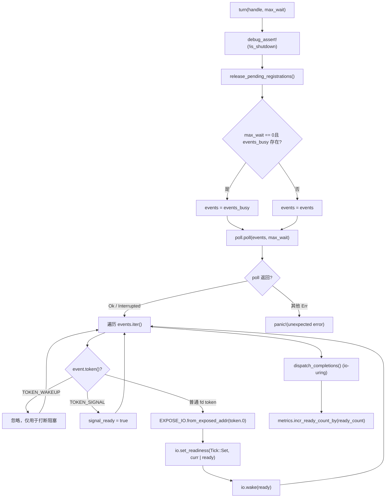
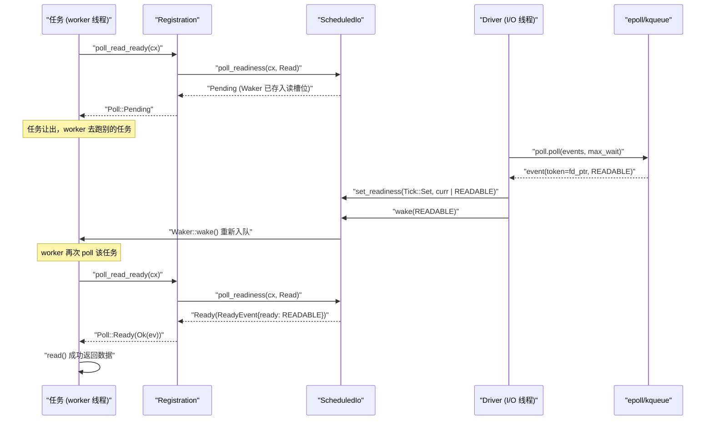

# Глава 5: Уведомление о готовности I/O: как Reactor переводит события epoll в пробуждение Waker

В предыдущей главе мы проследили главный цикл worker-потока: задача poll-ится, при возврате Pending Waker сохраняется куда-то, после готовности события Waker срабатывает, и задача снова ставится в очередь. Но что это за «куда-то»? Как Waker находится при поступлении события epoll? Именно на это должен ответить Reactor. Сначала построим интуитивную модель: представьте весь механизм уведомления о готовности I/O как систему вызова по номеру в ресторане — клиент (задача), сделав заказ, не стоит и не ждёт у окна, а берёт пейджер (Waker) и возвращается на место; кухня (ядро epoll), приготовив блюдо, сообщает стойке (Reactor), которая по номеру заказа (Token) находит соответствующий пейджер и нажимает кнопку. Без этой системы каждой задаче пришлось бы опрашивать socket, и CPU сгорел бы; либо использовались бы блокирующие потоки — один поток на соединение, и масштабирование было бы невозможно. Reactor в Tokio состоит из трёх файлов, образующих трёхуровневую структуру со строгим разделением обязанностей: driver.rs — это сам цикл событий, владеющий mio::Poll, отвечающий за вызов poll() для блокирующего ожидания событий ядра и перевод событий в чтение/запись ScheduledIo; registration.rs — это пользовательский регистрационный дескриптор, который хранится внутри TcpStream и предоставляет API poll_read_ready / poll_write_ready и т. п.; scheduled_io.rs — это слот состояния каждого fd, хранящий биты готовности чтения/записи и список Waker, являясь мостом между событиями и задачами. Связи сборки модулей можно посмотреть в tokio/src/runtime/io/mod.rs:5-16: driver экспортирует Driver, Handle, ReadyEvent, registration экспортирует Registration, scheduled_io экспортирует ScheduledIo. Следующая схема фиксирует полный поток данных, который нужно проследить в этой главе: TcpStream → Registration → ScheduledIo → Handle/Driver → ядро → обратно в ScheduledIo → Waker. Далее мы разберём это слой за слоем.

# Уровень драйвера:`Driver`и`Handle`разделение обязанностей

## Интуитивная модель

`Driver`— это**единственная сущность, владеющая`mio::Poll`, к ней можно обращаться только из одного потока**— это требование эксклюзивности цикла событий. А`&mut`— это`Handle`клонируемая точка входа для регистрации, разделяемая между потоками**可克隆、可跨线程共享的注册入口**, любой поток, желающий зарегистрировать новый fd, делает это через него. Без этого разделения пришлось бы либо`mio::Poll`блокировать, либо возвращать все регистрации в поток driver (что вводит межпоточную очередь сообщений). Tokio выбирает, чтобы`Handle`напрямую владел клоном`mio::Registry`, регистрация может выполняться параллельно, и только фактическое ожидание событий требует эксклюзивного доступа.

## Раскладка памяти и поля

Сначала рассмотрим`Driver`поля[FACT:tokio/src/runtime/io/driver.rs:25-38]：

- `signal_ready: bool`: пришло ли событие Unix-сигнала, используется для signal-драйвера.
- `events: mio::Events`: основной буфер событий, переиспользуется между вызовами`turn`, чтобы избежать выделения памяти каждый раз.
- `events_busy: Option<mio::Events>`：**Специальный буфер для неблокирующего poll**, существует только когда`max_io_events_per_busy_tick`установлен.
- `poll: mio::Poll`: обёртка над очередью событий ядра.

Теперь рассмотрим`Handle` [FACT:tokio/src/runtime/io/driver.rs:41-75]：

- `registry: mio::Registry`：`mio::Poll::registry()`клон, используемый для`register`/`deregister`。
- `registrations: RegistrationSet`: множество всех активных регистраций, отвечает за выделение`Token`и`ScheduledIo`。
- `synced: Mutex<registration_set::Synced>`: защищает синхронизированное состояние`RegistrationSet`.
- `waker: mio::Waker`: используется для пробуждения driver, заблокированного в`turn`, из любого потока.
- `metrics: IoDriverMetrics`: подсчитывает количество fd, количество готовых событий.

Здесь есть ключевое проектное решение:`events_busy`существование[FACT:tokio/src/runtime/io/driver.rs:25-38]предназначено для решения**проблемы, когда неблокирующий poll поглощает события**. Комментарий[FACT:tokio/src/runtime/io/driver.rs:189-190]ясно говорит: если события, извлечённые неблокирующим poll, остаются в основном буфере, следующий poll их не увидит; используя отдельный буфер, необработанные события остаются в очереди ядра, и следующий poll вернёт их снова.

## Пошагово: одно выполнение`turn`

`turn`— это основная функция driver[FACT:tokio/src/runtime/io/driver.rs:184-261]. Предположим, worker-поток обнаружил, что нет задач для выполнения, и вызывает`park` → `turn(handle, None)`для блокирующего ожидания:

**Шаг первый**: утверждается, что не shutdown[FACT:tokio/src/runtime/io/driver.rs:185], и освобождаются регистрации, ожидающие очистки[FACT:tokio/src/runtime/io/driver.rs:187]。`release_pending_registrations`проверяет`needs_release()`, и если есть, вызывает`registrations.release()` [FACT:tokio/src/runtime/io/driver.rs:336-340]。

**Шаг второй**: выбирается буфер событий[FACT:tokio/src/runtime/io/driver.rs:191-194]. Если`max_wait`равен нулю и`events_busy`существует, используется busy-буфер; иначе используется основной буфер.

**Шаг третий**: вызывается`self.poll.poll(events, max_wait)` [FACT:tokio/src/runtime/io/driver.rs:198]. Это место, где происходит реальная блокировка на epoll_wait. Обработка ошибок очень сдержанная:`Interrupted`просто игнорируется (прерывание сигналом — это нормально)[FACT:tokio/src/runtime/io/driver.rs:200], под WASI`InvalidInput`также игнорируется[FACT:tokio/src/runtime/io/driver.rs:201-205], другие ошибки приводят к panic[FACT:tokio/src/runtime/io/driver.rs:206]。

**Шаг четвёртый**: перебираются события[FACT:tokio/src/runtime/io/driver.rs:211-233]. Для каждого`event`：

- если`token == TOKEN_WAKEUP`(значение 0)[FACT:tokio/src/runtime/io/driver.rs:214], ничего не делается — это`unpark`используется для прерывания блокировки.
- Если`token == TOKEN_SIGNAL`(значение 1)[FACT:tokio/src/runtime/io/driver.rs:216], устанавливается`signal_ready = true`。
- иначе это обычное событие I/O[FACT:tokio/src/runtime/io/driver.rs:218-231]: преобразуется`mio::Ready`в Tokio-представление`Ready`, с помощью`EXPOSE_IO.from_exposed_addr(token.0)`token восстанавливается в указатель`*const ScheduledIo`, затем`set_readiness(Tick::Set, |curr| curr | ready)`накапливаются биты готовности, и далее`io.wake(ready)`запускается соответствующее направление`Waker`。

Здесь`EXPOSE_IO`— это`PtrExposeDomain<ScheduledIo>` [FACT:tokio/src/runtime/io/mod.rs:21-22], который «экспонирует» указатель как`usize`в качестве`mio::Token`. Комментарий о безопасности[FACT:tokio/src/runtime/io/driver.rs:222-225]объясняет, почему это unsafe-преобразование безопасно: указатель не освобождается до тех пор, пока не будет отменена регистрация в mio**и**driver больше не выполняет параллельный poll, и driver владеет`Arc<ScheduledIo>`.

**Шаг пятый**: обработка очереди завершений io_uring (только Linux + tokio_unstable)[FACT:tokio/src/runtime/io/driver.rs:235-258], включая цикл flush при переполнении CQ.

**Шаг шестой**: накопление метрик[FACT:tokio/src/runtime/io/driver.rs:265-267]。



## Проектное размышление: почему`Handle`должен владеть`mio::Waker`

`unpark` [FACT:tokio/src/runtime/io/driver.rs:280-283]вызывает`self.waker.wake()`. Этот`mio::Waker`при`Driver::new`регистрируется через`TOKEN_WAKEUP`с помощью[FACT:tokio/src/runtime/io/driver.rs:124]. Когда driver заблокирован в`poll.poll()`, другой поток, вызывая`unpark`, помещает в epoll событие`TOKEN_WAKEUP`,`poll`немедленно возвращается, при переборе видит этот token и просто пропускает его[FACT:tokio/src/runtime/io/driver.rs:214-215]。

> **[Design Inference & Architectural Trade-offs]**
> Этот механизм используется в`deregister_source`при[FACT:tokio/src/runtime/io/driver.rs:315-334]: после отмены регистрации source, если`registrations.deregister`возвращает true (означая, что это последняя ссылка), выполняется`unpark()`. Почему? Потому что driver может быть заблокирован в`poll`в ожидании события для этого fd, а fd уже отменён, и ядро больше не сгенерирует событие; необходимо активно разбудить driver, чтобы он перепроверил набор регистраций и, возможно, вышел из блокировки. Иначе driver будет спать до тайм-аута`max_wait`, задерживая shutdown.

Ещё одна деталь:`deregister_source`сначала вызывается`self.registry.deregister(source)` [FACT:tokio/src/runtime/io/driver.rs:322], затем очищается`registrations` [FACT:tokio/src/runtime/io/driver.rs:315-334]. Комментарий[FACT:tokio/src/runtime/io/driver.rs:320-321]говорит «Cleanup ALWAYS happens» — даже если отмена регистрации на уровне ОС не удалась, внутреннее состояние всё равно очищается, и только потом возвращается ошибка ОС[FACT:tokio/src/runtime/io/driver.rs:336-340]. Это типичный**паттерн, где очистка ресурсов имеет приоритет над распространением ошибки**.

# Слой регистрации:`Registration`как`Waker`сохраняется в`ScheduledIo`

## Интуитивная модель

`Registration`— это**контракт между задачей и fd**. Он содержит две вещи: один`scheduler::Handle`(используется для доступа к runtime при необходимости), один`Arc<ScheduledIo>`(слот состояния fd). Когда задача вызывает`poll_read_ready`,`Registration`передаёт`Waker`на хранение в`ScheduledIo`; когда driver получает событие, он извлекает`ScheduledIo`из`Waker`и пробуждает.

## Раскладка памяти и поля

`Registration`содержит только два поля[FACT:tokio/src/runtime/io/registration.rs:46-54]：

- `handle: scheduler::Handle`: дескриптор runtime, комментарий[FACT:tokio/src/runtime/io/registration.rs:46-54]говорит «TODO: this can probably be moved into ScheduledIo», что указывает на то, что автор считает расположение этого поля возможным для оптимизации.
- `shared: Arc<ScheduledIo>`: разделяемое состояние,`Arc`гарантирует, что и driver, и задача могут получить к нему доступ.

> **[Design Inference & Architectural Trade-offs]**
> Обратите внимание, что`Registration`вручную реализует`Send`и`Sync` [FACT:tokio/src/runtime/io/registration.rs:57-58]. Зачем нужен unsafe impl? Потому что`scheduler::Handle`внутри может содержать поля, не являющиеся`Send`/`Sync`(например,`Rc`), но сценарий использования`Registration`требует, чтобы он мог пересекать потоки. Комментарий к документации[FACT:tokio/src/runtime/io/registration.rs:28-33]задаёт ключевое ограничение:**вызывающий должен гарантировать, что не более двух задач одновременно используют один и тот же`Registration`**, одна на чтение, одна на запись. Нарушение этого ограничения хотя и безопасно с точки зрения памяти, но приводит к потере уведомлений и зависанию задач.

## Step-by-Step：`poll_read_ready`Цепочка вызовов

Предположим, задача в`TcpStream::poll_read`обнаруживается, что в socket нет данных, необходимо зарегистрировать интерес чтения. Цепочка вызовов:`TcpStream::poll_read_priv` → `PollEvented::poll_read` → `Registration::poll_read_io` → `poll_io` → `poll_ready`。

`poll_ready`— это ядро[FACT:tokio/src/runtime/io/registration.rs:155-171]：

**Первый шаг**：`trace_leaf()` [FACT:tokio/src/runtime/io/registration.rs:160], используется для tracing-инструментирования.

**Второй шаг**：`coop::poll_proceed(cx)` [FACT:tokio/src/runtime/io/registration.rs:155-171]. Это механизм кооперативного бюджета, о котором пойдёт речь в главе 12. Если бюджет исчерпан, возвращается`Pending`и регистрируется специальный`Waker`, чтобы задача была перепланирована в следующем раунде.

**Третий шаг**：`self.shared.poll_readiness(cx, direction)` [FACT:tokio/src/runtime/io/registration.rs:155-171]. Это место, где происходит реальное взаимодействие с`ScheduledIo`: проверяется текущий бит готовности, и если уже готово — немедленно возвращается`Ready`; иначе`cx.waker()`сохраняется в`ScheduledIo`в соответствующий слот направления, возвращается`Pending`。

**Четвёртый шаг**: проверяется`ev.is_shutdown` [FACT:tokio/src/runtime/io/registration.rs:155-171]. Если runtime завершается, возвращается`RUNTIME_SHUTTING_DOWN_ERROR`。

**Пятый шаг**：`coop.made_progress()` [FACT:tokio/src/runtime/io/registration.rs:169], отмечается расход бюджета, возвращается событие готовности.

`poll_io`поверх`poll_ready`добавляет слой цикла повторных попыток[FACT:tokio/src/runtime/io/registration.rs:173-192]：

```rust
loop {
    let ev = ready!(self.poll_ready(cx, direction))?;
    match f() {
        Ok(ret) => return Poll::Ready(Ok(ret)),
        Err(ref e) if e.kind() == io::ErrorKind::WouldBlock => {
            self.clear_readiness(ev);
        }
        Err(e) => return Poll::Ready(Err(e)),
    }
}
```

Здесь отражена**readiness — это подсказка, а не гарантия**ключевая идея:`poll_ready`говорит, что доступно для чтения, но при реальном`read()`может вернуться`WouldBlock`(например, другой поток успел забрать данные). В этом случае необходимо`clear_readiness(ev)` [FACT:tokio/src/runtime/io/registration.rs:187]сбросить бит готовности и затем в цикле снова ждать. Если не сбросить, задача попадёт в busy-loop «думает, что можно читать → read fails → снова думает, что можно читать».

## Размышления о дизайне:`try_io`и`async_io`разделение обязанностей

`try_io` [FACT:tokio/src/runtime/io/registration.rs:194-213]— синхронная версия: сначала`ready_event(interest)`проверяется бит готовности, если пусто — сразу возвращается`WouldBlock` [FACT:tokio/src/runtime/io/registration.rs:194-213]; иначе выполняется`f()`, и если`f()`возвращает`WouldBlock`, то сбрасывается бит готовности[FACT:tokio/src/runtime/io/registration.rs:207-210]. Он**не регистрирует Waker**, подходит для`try_read`таких сценариев «попробовал и ушёл».

`async_io` [FACT:tokio/src/runtime/io/registration.rs:225-245]— асинхронная версия:`readiness(interest).await`регистрирует Waker и ждёт, затем при выполнении`f()`，`WouldBlock`сбрасывает бит готовности и зацикливается. Обратите внимание, что в цикле также вызывается`coop::poll_proceed` [FACT:tokio/src/runtime/io/registration.rs:233], чтобы не исчерпать бюджет при множественных`WouldBlock`повторных попытках.

## Производственные подводные камни:`Drop`Очистка Waker в

`Registration::drop` [FACT:tokio/src/runtime/io/registration.rs:253-262]вызывает`self.shared.clear_wakers()`. Комментарий[FACT:tokio/src/runtime/io/registration.rs:253-262]объясняет причину:`ScheduledIo`хранящийся в`Waker`может держать`Arc<driver::Inner>`, а`driver::Inner`в свою очередь держит`ScheduledIo`, образуя циклическую ссылку. Очистка Waker — это способ разорвать цикл. Но комментарий также признаёт, что это «imperfect solution» — если`Registration`сам сохранён в`Waker`, цикл всё равно остаётся. Это проблема, обсуждаемая в tokio-rs/tokio#3481.

> **[Design Inference & Architectural Trade-offs]**
> В production поведение таково: если множество соединений было drop, но runtime не завершился, память не освобождается немедленно до следующего`clear_wakers`или runtime shutdown. Для сервисов с длительными соединениями это обычно не проблема; но для сценариев с короткими соединениями и частым созданием/уничтожением нужно следить за моментом回收`ScheduledIo`.

# От`TcpStream::read`до`Waker`полная цепочка пробуждения

## Интуитивная модель

Теперь свяжем три слоя вместе. Пользователь на`TcpStream`вызывает`.read().await`, фактически выполняется`AsyncRead::poll_read` → `PollEvented::poll_read` → `Registration::poll_read_io`. Когда данных нет,`Waker`сохраняется в`ScheduledIo`; когда epoll сообщает о готовности к чтению, driver извлекает из`ScheduledIo``Waker`и пробуждает, задача перепланируется, и при повторном poll`poll_readiness`обнаруживает, что бит готовности установлен, и сразу возвращает`Ready`，`read()`успешно.

## Step-by-Step: одно полное ожидание чтения

**Этап первый: регистрация интереса**。`TcpStream::new` [FACT:tokio/src/net/tcp/stream.rs:166-169]вызывает`PollEvented::new(connected)`, который внутри вызывает`Registration::new_with_interest_and_handle` [FACT:tokio/src/runtime/io/registration.rs:73-81], а затем`handle.driver().io().add_source(io, interest)` [FACT:tokio/src/runtime/io/registration.rs:73-81]。

`add_source` [FACT:tokio/src/runtime/io/driver.rs:288-312]делает три вещи:

1. `registrations.allocate(&mut synced.lock())`выделяет`ScheduledIo`, получает`token` [FACT:tokio/src/runtime/io/driver.rs:293-294]。

2. `self.registry.register(source, token, interest.to_mio())`регистрирует[FACT:tokio/src/runtime/io/driver.rs:298]в ядре. Если неудача,**необходимо**удалить только что выделенный`ScheduledIo`из множества[FACT:tokio/src/runtime/io/driver.rs:300-303], иначе утечка.

3. `metrics.incr_fd_count()`подсчитывает[FACT:tokio/src/runtime/io/driver.rs:309]。

**Этап второй: ожидание готовности**. Задача poll`TcpStream::poll_read` [FACT:tokio/src/net/tcp/stream.rs:1492-1498] → `poll_read_priv` [FACT:tokio/src/net/tcp/stream.rs:1451-1458] → `PollEvented::poll_read` → `Registration::poll_read_io` [FACT:tokio/src/runtime/io/registration.rs:133-139] → `poll_io` → `poll_ready` → `ScheduledIo::poll_readiness`. Если в этот момент не готово,`Waker`сохраняется в`ScheduledIo`слот чтения, возвращается`Pending`。

**Этап третий: приход события**. driver`turn`из`poll.poll()`получает событие[FACT:tokio/src/runtime/io/driver.rs:198], при обходе для каждого события fd выполняет`io.set_readiness(Tick::Set, |curr| curr | ready)`и`io.wake(ready)` [FACT:tokio/src/runtime/io/driver.rs:228-229]。`wake`внутри извлекает`Waker`соответствующего направления и вызывает`wake()`。

**Этап четвёртый: перепланирование задачи**。`Waker::wake()`повторно ставит задачу в локальную очередь worker (рассказывалось в предыдущей главе). worker снова poll-ит эту задачу,`poll_readiness`обнаруживает, что бит готовности установлен, возвращает`Ready`，`read()`успешно.



## Важное ответвление:`assume_ready`оптимизация

`TcpStream::new_accepted` [FACT:tokio/src/net/tcp/stream.rs:174-181]— заметная оптимизация.`accept`возвращаемый socket естественно доступен для записи и обычно уже содержит первую партию байтов от peer. Если ждать первого события driver, при высокой нагрузке это событие может оказаться позади событий всех установленных соединений, вызывая задержку. Поэтому`new_accepted`напрямую вызывает`assume_ready(Ready::READABLE | Ready::WRITABLE)` [FACT:tokio/src/net/tcp/stream.rs:174-181]。

`assume_ready`, комментарий[FACT:tokio/src/runtime/io/registration.rs:103-105]гласит: «A wrong guess costs one`WouldBlock`, which clears the readiness again.» — цена ошибочной догадки — всего один`WouldBlock`，`poll_io`цикл очистит бит готовности и снова будет ждать. Это дизайн**оптимистичной догадки + быстрого исправления ошибок**.

## Размышления о дизайне: почему I/O-драйвер отделён от планировщика

> **[Design Inference & Architectural Trade-offs]**
> Судя по структуре исходников,`Driver`и worker-потоки разделены:`Driver`размещается в некотором выделенном месте runtime (обычно`block_on`поток или специальный I/O-поток), а worker-потоки держат только`Handle`. Такое разделение даёт несколько преимуществ:

1. **Регистрация без блокировок**：`Handle`держит`mio::Registry`клон, любой worker может параллельно регистрировать новые fd, не возвращаясь в поток driver.

2. **Централизация ожидания событий**: только один поток блокируется на`epoll_wait`, что позволяет избежать проблемы thundering herd при одновременном poll одного и того же epoll fd из нескольких потоков.

3. **Короткий путь пробуждения**: driver, получив событие, напрямую оперирует`ScheduledIo`и вызывает`Waker::wake()`，`wake()`внутри ставит задачу в очередь worker, без межпоточной передачи сообщений.

Цена — необходимость`ScheduledIo`обрабатывать конкурентный доступ (`set_readiness`и`poll_readiness`могут происходить одновременно), что решается атомарными операциями и внутренними блокировками.

## Производственные подводные камни:`is_shutdown`и`RUNTIME_SHUTTING_DOWN_ERROR`

`poll_ready`проверяет`ev.is_shutdown` [FACT:tokio/src/runtime/io/registration.rs:155-171], если истина — возвращает`gone()` [FACT:tokio/src/runtime/io/registration.rs:265-267], то есть`RUNTIME_SHUTTING_DOWN_ERROR`。

> **[Design Inference & Architectural Trade-offs]**
> Смысл этой проверки в том, что: при завершении runtime driver`shutdown` [FACT:tokio/src/runtime/io/driver.rs:174-182]会遍历所有注册并调用`io.shutdown()`，把`is_shutdown`置位并唤醒所有等待者。如果不检查这个标志，任务可能在 runtime 已经停止调度后仍然尝试读 socket，导致未定义行为或挂起。生产环境中，如果你看到`RUNTIME_SHUTTING_DOWN_ERROR`，通常意味着有任务在 runtime drop 之后仍在运行——检查是否有`spawn`的任务没有被正确 join。

另一个坑是`deregister_source`的`unpark` [FACT:tokio/src/runtime/io/driver.rs:328]。如果 driver 正阻塞在`poll`里，且此时最后一个`Registration`被 drop，`unpark`会唤醒 driver。但如果 driver 不在阻塞状态（比如正在处理其他事件），`unpark`只是让下一次`turn`立即返回[FACT:tokio/src/runtime/io/driver.rs:280-283]。这个语义在`Handle::unpark`的文档注释里有说明。

# 设计思考：Reactor 的三个关键权衡

**权衡一：`Token`用指针而非索引**。`EXPOSE_IO.from_exposed_addr(token.0)` [FACT:tokio/src/runtime/io/driver.rs:220]把`mio::Token`直接当作`*const ScheduledIo`的地址。这避免了维护一个`Token → ScheduledIo`的映射表，查找是 O(1) 且无锁。代价是安全性依赖严格的生命周期管理：指针必须在注销且 driver 不再 poll 之后才能释放[FACT:tokio/src/runtime/io/driver.rs:222-225]。

**权衡二：读写双 Waker 槽位**。`Registration`文档[FACT:tokio/src/runtime/io/registration.rs:24-26]说「A registration instance represents two separate readiness streams」——读和写各有一个独立的`Waker`槽位。这允许同一个 socket 的读任务和写任务分别注册，互不干扰。但`poll_read_ready`的注释[FACT:tokio/src/net/tcp/stream.rs:549-552]提醒：多次调用`poll_read_ready`/`poll_read`/`poll_peek`只有最后一次的`Waker`会被保留——读方向只有一个槽位。

**权衡三：`events_busy`的独立缓冲区**。测试[FACT:tokio/src/runtime/io/driver.rs:364-386]验证了这个行为：`Driver::new(16, Some(2))`创建 busy 容量为 2 的 driver，注册 5 个可读 source 后，非阻塞`turn`只取 2 个事件[FACT:tokio/src/runtime/io/driver.rs:375-376]，剩余 3 个留在内核队列，下次阻塞`turn`取到[FACT:tokio/src/runtime/io/driver.rs:379-380]。这防止了非阻塞 poll 一次性吞掉所有事件导致后续 poll 饥饿。

# 本章小结

本章追踪了`TcpStream::read`背后的完整 Reactor 链路：

- **驱动层**：`Driver`独占`mio::Poll`，`turn`阻塞等待事件，用`EXPOSE_IO`把`Token`还原为`ScheduledIo`指针，调用`set_readiness` + `wake`触发`Waker`。`Handle`提供可跨线程的注册入口，`unpark`用于打断阻塞。
- **注册层**：`Registration`持有`Arc<ScheduledIo>`，`poll_ready`检查就绪位或存入`Waker`，`poll_io`用`WouldBlock`重试循环处理假阳性，`try_io`/`async_io`分别服务同步和异步场景。
- **状态层**：`ScheduledIo`是 fd 的状态槽，存储读写就绪位和双`Waker`槽位，是事件与任务之间的唯一桥梁。

# 本章思考与自测

Q1: 如果把`poll_io`里`WouldBlock`分支的`self.clear_readiness(ev)`删掉，在什么场景下会导致任务忙循环（busy-loop）？为什么？

**参考解析**：`poll_io`的循环[FACT:tokio/src/runtime/io/registration.rs:173-192]在`f()`返回`WouldBlock`时调用`clear_readiness(ev)` [FACT:tokio/src/runtime/io/registration.rs:187]。`ev`是`poll_ready`返回的`ReadyEvent`，包含当前就绪位。`clear_readiness`会把这些位从`ScheduledIo`里清掉。

如果不清理，下一次循环调用`poll_ready` → `poll_readiness`时，`ScheduledIo`里仍然保留着旧的「可读」位，`poll_readiness`会立即返回`Ready`（因为就绪位非空），然后`f()`再次执行`read()`，如果 socket 确实没数据，又返回`WouldBlock`，循环继续。由于就绪位从未被清除，这个循环永远不会进入`Pending`，任务会一直占用 CPU 轮询。

触发场景：多个任务共享同一个 socket 的读方向（虽然`Registration`文档[FACT:tokio/src/runtime/io/registration.rs:28-33]说最多两个任务，但读方向只有一个槽位），或者`try_read`和`poll_read`混用。更常见的是：epoll 报告可读后，另一个线程抢先读走了数据，当前任务的`read()`返回`WouldBlock`，此时必须清就绪位，否则会一直重试。

Q2: `add_source`在`registry.register`失败时为什么要调用`registrations.remove`？如果不调用会发生什么？

**参考解析**：`add_source` [FACT:tokio/src/runtime/io/driver.rs:288-312]先`registrations.allocate`分配`ScheduledIo` [FACT:tokio/src/runtime/io/driver.rs:293]，再`registry.register`向内核注册[FACT:tokio/src/runtime/io/driver.rs:298]。如果注册失败，`ScheduledIo`已经分配但没有任何 fd 与之关联，如果不移除，它会永远留在`RegistrationSet`里。

注释[FACT:tokio/src/runtime/io/driver.rs:296-297]明确说：「we should remove the`scheduled_io` from the `registrations` set if registering the `source` with the OS fails. Otherwise it will leak the `scheduled_io`.」——这是一个内存泄漏。

`remove`调用[FACT:tokio/src/runtime/io/driver.rs:300-303]用 unsafe 块包裹，因为`ScheduledIo`是`RegistrationSet`的一部分，移除操作需要保证没有其他引用。泄漏的后果：`RegistrationSet`持续增长，`Token`空间被浪费，最终可能导致`allocate`失败或内存耗尽。在高频创建/销毁连接的场景（如短连接服务器），如果注册失败率较高（比如 fd 耗尽），泄漏会加速资源枯竭。

Q3: `deregister_source`中，为什么`unpark()`只在`registrations.deregister`返回 true 时调用？如果无条件调用会有什么问题？

**参考解析**：`deregister_source` [FACT:tokio/src/runtime/io/driver.rs:315-334]的逻辑是：先`registry.deregister(source)`向内核注销[FACT:tokio/src/runtime/io/driver.rs:322]，然后`registrations.deregister`清理内部状态[FACT:tokio/src/runtime/io/driver.rs:315-334]，若返回 true 则`unpark()` [FACT:tokio/src/runtime/io/driver.rs:328]。

`registrations.deregister`返回 true 意味着这是最后一个引用，`ScheduledIo`被真正移除。此时 driver 可能正阻塞在`poll`里等待这个 fd 的事件，但 fd 已经注销，内核不会再产生事件。`unpark`通过`mio::Waker`往 epoll 塞一个`TOKEN_WAKEUP`事件[FACT:tokio/src/runtime/io/driver.rs:280-283]，让`poll`立即返回，driver 重新检查注册集合并可能退出阻塞。

如果无条件调用`unpark`：每次注销一个非最后的引用都会唤醒 driver，造成不必要的唤醒。在大量连接共享同一个`ScheduledIo`的场景（比如`TcpStream`的`split`后读写两半），每次 drop 一个半都会唤醒 driver，增加 CPU 开销。更严重

本章我们拆解了 Reactor 如何把 epoll 事件翻译成 Waker 唤醒：从 TcpStream 的 poll_read_ready 出发，经过 Registration 的注册与查询，落到 ScheduledIo 的就绪位与 Waker 槽位，再由 Driver 在事件循环中根据 Token 定位并触发唤醒。关键设计包括：Token 即指针实现 O(1) 查找，读写双 Waker 槽位支持并发读写分离，events_busy 独立缓冲区防止事件饥饿，assume_ready 乐观猜测优化 accept 场景。至此，I/O 就绪通知的闭环已经完整。但异步运行时还需要处理另一类「就绪」——时间。下一章我们将剖析 tokio::time::sleep 与 timeout 的实现：定时器如何被插入时间轮、时间轮如何按到期时间分级、driver 如何计算下一次 park 的超时并触发到期任务。你会看到「时间也是一种 I/O 事件」这一统一抽象，以及 start_paused 与 test clock 如何让时间在测试中可控。
