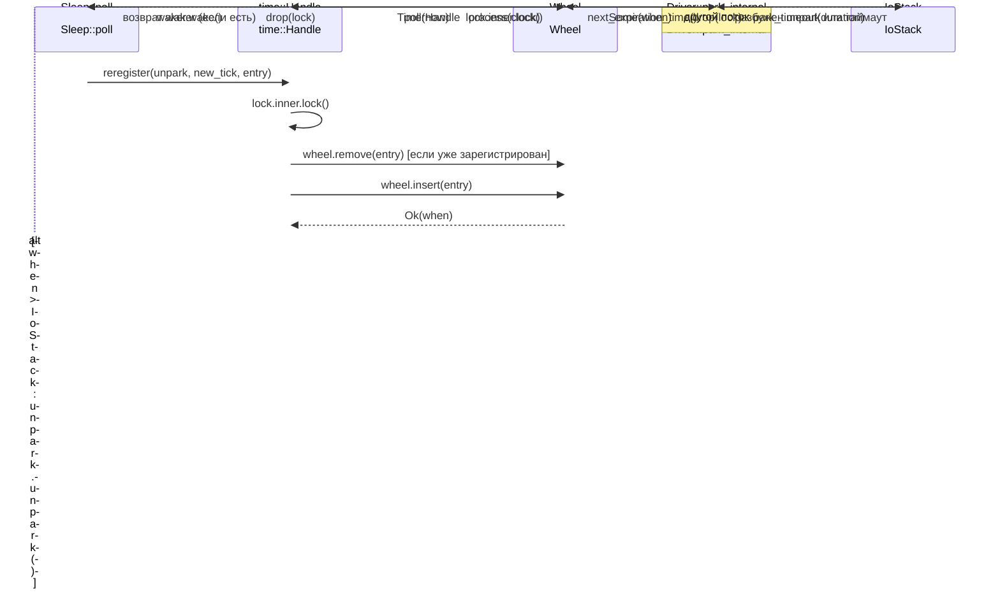

# Глава 6: Драйвер времени: как колесо времени, Sleep и тайм-ауты пробуждают задачи

В предыдущей главе мы проследили полный путь TcpStream::read и увидели, как ScheduledIo преобразует события готовности fd из epoll в пробуждение через Waker. Однако асинхронной среде выполнения необходимо обрабатывать ещё один тип «готовности»: Future от sleep(100ms) должен быть разбужен через 100 мс. Такие события исходят не от файловых дескрипторов ядра, а от «самого времени». Архитектурное решение Tokio заключается в том, чтобы рассматривать время как разновидность событий ввода-вывода: в структуре Driver есть только одно поле park: IoStack, которое переиспользует механизм park/unpark драйвера ввода-вывода. Когда колесо времени вычисляет «момент следующего срабатывания», драйвер вызывает park_timeout, чтобы усыпить поток до этого момента; после пробуждения он извлекает из колеса времени сработавшие записи и активирует их Waker. Таким образом, планировщику достаточно единой точки входа park, чтобы одновременно ожидать события двух типов: «готовность fd» и «истечение таймера». В этой главе мы ответим на три вопроса: как таймеры вставляются в колесо времени? Как колесо времени распределяет таймеры по уровням в зависимости от времени срабатывания? Как драйвер вычисляет тайм-аут следующего park и активирует сработавшие задачи?

# I. Колесо времени: шестиуровневая хеш-структура с 64 слотами на каждом уровне

## Интуитивная модель

Представьте механические часы: секундная стрелка, совершая оборот, движет минутную, а минутная, совершая оборот, движет часовую. Если бы была только одна секундная стрелка, для отображения «через 12 дней» пришлось бы отсчитать миллион делений; но с многоуровневой структурой секундная стрелка отвечает лишь за точность в пределах 64 секунд, минутная — за 64 минуты, часовая — за 64 часа — каждому уровню достаточно всего 64 слотов, чтобы охватить период более 2 лет.

Без многоуровневой структуры вставка отдалённого таймера потребовала бы либо обхода за O(N), либо огромного массива. Колесо времени использует «распределение по уровням в зависимости от времени срабатывания», сводя и вставку, и срабатывание к почти O(1).

## Структура памяти и поля

`Wheel`Основных полей всего три[FACT:tokio/src/runtime/time/wheel/mod.rs:22-40]：

```rust
pub(crate) struct Wheel {
    elapsed: u64,                          // 自 wheel 创建以来经过的毫秒数
    levels: Box,      // 6 层，每层 64 槽
    pending: LinkedList,      // 已到期、待触发的条目
}
```

`NUM_LEVELS = 6`，`BITS_PER_LEVEL = 6`(то есть по 64 слота на каждом уровне)[FACT:tokio/src/runtime/time/wheel/mod.rs:45-47]。`MAX_DURATION = 1 << (6 * 6) = 1 << 36`миллисекунд, примерно 2 года[FACT:tokio/src/runtime/time/wheel/mod.rs:50]。

Гранулярность шести уровней согласно комментариям в документации:[FACT:tokio/src/runtime/time/wheel/mod.rs:22-40]：

| Уровень | Гранулярность слота | Диапазон покрытия |
| --- | --- | --- |
| 0 | 1 ms | 64 ms |
| 1 | 64 ms | ~4 s |
| 2 | ~4 s | ~4 min |
| 3 | ~4 min | ~4 hr |
| 4 | ~4 hr | ~12 day |
| 5 | ~12 day | ~2 yr |

`pending`представляет собой интрузивный связный список (`LinkedList<TimerShared>`), хранящий записи, уже извлечённые из очереди и ожидающие пробуждения Waker. Обратите внимание, что это`LinkedList`, а не`Vec`: сами записи встроены в`TimerShared`, вставка/удаление не требует выделения памяти.

## Сценарий: вставка sleep на 100 мс

Когда`sleep(100ms)`впервые подвергается poll,`Sleep::poll_elapsed`конструирует`Timer::new`и вызывает`init` [FACT:tokio/src/time/sleep.rs:436-440]。`init`в конечном итоге вызывает`Handle::reregister`, что в свою очередь вызывает`Wheel::insert`。

`insert`, первым шагом является проверка, истёк ли срок[FACT:tokio/src/runtime/time/wheel/mod.rs:90-98]：

```rust
let when = unsafe { item.sync_when() };
if when  usize {
    const SLOT_MASK: u64 = (1 = MAX_DURATION {
        return NUM_LEVELS - 1;
    }
    masked.ilog2() as usize / BITS_PER_LEVEL
}
```

Здесь используется`elapsed ^ when`вместо`when - elapsed`, это изящный приём: старший значащий бит XOR отражает «с какого бита два временных штампа начинают различаться», то есть «насколько грубая гранулярность нужна, чтобы их различить».`| SLOT_MASK`Принудительно устанавливаем младшие 6 бит в 1, чтобы избежать`ilog2`вычисления слишком малого уровня при попадании в один и тот же слот.`ilog2() / 6`Отображаем разрядность в номер уровня. Если результат XOR превышает`MAX_DURATION`(то есть превышает 2 года), принудительно помещаем в самый верхний уровень — это и есть «fudge the timer into the top level».

Для sleep длительностью 100ms, предположим,`elapsed`близко к 0,`when ≈ 100`，`elapsed ^ when ≈ 100`，`ilog2(100) = 6`，`6 / 6 = 1`, поэтому он попадает на уровень 1 (гранулярность 64 мс). Это означает, что он будет ждать в одном из слотов уровня 1, пока время не дойдёт до границы этого слота, и только тогда будет опущен на уровень 0.

## Каскадное опускание: process_expiration

Когда`poll(now)`продвигает время,`Wheel::poll`циклически вызывает`next_expiration`и`process_expiration` [FACT:tokio/src/runtime/time/wheel/mod.rs:142-166]：

```rust
pub(crate) fn poll(&mut self, now: u64) -> Option {
    loop {
        if let Some(handle) = self.pending.pop_back() {
            return Some(handle);
        }
        match self.next_expiration() {
            Some(ref expiration) if expiration.deadline  {
                self.process_expiration(expiration);
                self.set_elapsed(expiration.deadline);
            }
            _ => {
                self.set_elapsed(now);
                break;
            }
        }
    }
    self.pending.pop_back()
}
```

`process_expiration`отвечает за «опускание» просроченных записей с одного уровня на следующий, или (на уровне 0) помечает их как pending[FACT:tokio/src/runtime/time/wheel/mod.rs:218-251]：

```rust
let mut entries = self.take_entries(expiration);
while let Some(item) = entries.pop_back() {
    match unsafe { item.mark_pending(expiration.deadline) } {
        Ok(()) => {
            self.pending.push_front(item);   // 真正到期
        }
        Err(expiration_tick) => {
            let level = level_for(expiration.deadline, expiration_tick);
            unsafe { self.levels[level].add_entry(item); }  // 下沉到更低层
        }
    }
}
```

`mark_pending`— ключевая: она проверяет, действительно ли наступил фактический deadline записи. Если наступил, возвращает`Ok(())`, запись попадает в`pending`связный список; если ещё нет (просто наступила граница слота), возвращает`Err(expiration_tick)`, запись перевставляется в более мелкий уровень.

Обратите внимание на момент, подчёркнутый в комментарии[FACT:tokio/src/runtime/time/wheel/mod.rs:219-228]: необходимо сначала извлечь все записи из слота целиком, а затем обрабатывать их, потому что некоторые записи могут быть перевставлены в тот же слот (когда время вставки превышает`MAX_DURATION`, происходит переполнение). Если извлекать и вставлять одновременно, можно попасть в бесконечный цикл.

## Вычисление следующего момента истечения

`next_expiration`сканирует от низкого уровня к высокому и возвращает первую непустую точку истечения[FACT:tokio/src/runtime/time/wheel/mod.rs:169-191]：

```rust
fn next_expiration(&self) -> Option {
    if !self.pending.is_empty() {
        return Some(Expiration { level: 0, slot: 0, deadline: self.elapsed });
    }
    for (level_num, level) in self.levels.iter().enumerate() {
        if let Some(expiration) = level.next_expiration(self.elapsed) {
            debug_assert!(self.no_expirations_before(level_num + 1, expiration.deadline));
            return Some(expiration);
        }
    }
    None
}
```

Если`pending`непуст, значит есть просроченные записи, ожидающие срабатывания, и немедленно возвращается текущий`elapsed`в качестве deadline (так driver выполнит park с нулевым таймаутом и сразу вернётся для обработки). Иначе сканирует уровень за уровнем и возвращает deadline первого непустого слота.`debug_assert`проверяет инвариант: на более высоком уровне не может быть более ранней точки истечения, чем на текущем.

```mermaid
flowchart TD
    start["Wheel::poll(now)"] --> check_pending{"pending не пуст?"}
    check_pending -->|да| pop["pop_back возвращает TimerHandle"]
    check_pending -->|нет| next_exp{"next_expiration() есть точка истечения?"}
    next_exp -->|нет| set_elapsed["set_elapsed(now) затем break"]
    next_exp -->|да| cmp{"expiration.deadline |нет| set_elapsed
    cmp -->|да| proc["process_expiration(expiration)"]
    proc --> take["take_entries извлекает весь слот"]
    take --> mark{"item.mark_pending()"}
    mark -->|Ok истёк| push_pending["pending.push_front(item)"]
    mark -->|Err не истёк| reinsert["level_for затем add_entry с понижением"]
    push_pending --> set_elapsed2["set_elapsed(expiration.deadline)"]
    reinsert --> set_elapsed2
    set_elapsed2 --> check_pending
    set_elapsed --> pop2["pending.pop_back() возврат"]
```

---

# II. Цикл park в Driver: подключение timing wheel к стеку I/O

## Интуитивная модель

Само timing wheel не «идёт» самостоятельно. Ему нужен внешний цикл, который repeatedly спрашивает его: «Когда следующее истечение?» — затем спит до этого момента, просыпается и продвигает время. Этот цикл —`Driver::park_internal`. Он переводит «следующее истечение timing wheel» в длительность`park_timeout`и передаёт её нижележащему стеку I/O для сна.

Без этого цикла таймеры никогда не сработают — timing wheel это лишь статическая структура данных, нужен кто-то, кто будет её «заводить».

## Структуры данных: Driver и InnerState

`Driver`имеет только одно поле`park: IoStack` [FACT:tokio/src/runtime/time/mod.rs:90-93]. Настоящее состояние находится в`Handle`, различается через`Inner`перечисление для традиционной и экспериментальной реализации[FACT:tokio/src/runtime/time/mod.rs:95-127]. Традиционная реализация`InnerState`содержит два поля[FACT:tokio/src/runtime/time/mod.rs:130-136]：

```rust
struct InnerState {
    next_wake: Option,   // 承诺的最早唤醒时刻
    wheel: wheel::Wheel,
}
```

`next_wake`использует`NonZeroU64`вместо`Option<u64>`вложенности, чтобы задействовать niche-оптимизацию —`Option<NonZeroU64>`и`u64`одного размера. Он записывает «до какого tick driver обещает проснуться», используется при`reregister`для определения, нужен ли`unpark`。

`is_shutdown`— независимый`AtomicBool`, в комментарии объясняется, почему его вынесли из Mutex[FACT:tokio/src/runtime/time/mod.rs:90-93]：`Handle`нужно проверять`is_shutdown`без блокировки mutex. Это типичная оптимизация «много чтений, мало записей» — shutdown происходит только один раз, но проверка может быть частой.

## Сценарий: полный процесс одного park

`park_internal`— ядро[FACT:tokio/src/runtime/time/mod.rs:213-256]：

```rust
fn park_internal(&mut self, rt_handle: &driver::Handle, limit: Option) {
    let handle = rt_handle.time();
    let mut lock = handle.inner.lock();
    assert!(!handle.is_shutdown());

    let next_wake = lock.wheel.next_expiration_time();
    lock.next_wake = next_wake.map(|t| NonZeroU64::new(t).unwrap_or_else(|| NonZeroU64::new(1).unwrap()));
    drop(lock);

    match next_wake {
        Some(when) => {
            let now = handle.time_source.now(rt_handle.clock());
            let mut duration = handle.time_source.tick_to_duration(when.saturating_sub(now));
            if duration > Duration::from_millis(0) {
                if let Some(limit) = limit {
                    duration = std::cmp::min(limit, duration);
                }
                self.park_thread_timeout(rt_handle, duration);
            } else {
                self.park.park_timeout(rt_handle, Duration::from_secs(0));
            }
        }
        None => {
            if let Some(duration) = limit {
                self.park_thread_timeout(rt_handle, duration);
            } else {
                self.park.park(rt_handle);
            }
        }
    }

    handle.process(rt_handle.clock());
}
```

Пошаговый разбор:

1. **Взять блокировку, прочитать следующее истечение**：`lock.wheel.next_expiration_time()`возвращает`Option<u64>`, то есть следующий tick истечения. Одновременно записывает его в`lock.next_wake`, для`reregister`чтобы определить, нужен ли unpark.

2. **Освободить блокировку**：`drop(lock)`должен быть до park, иначе во время park другие потоки не смогут вставить таймер.

3. **Вычислить длительность park**：`when.saturating_sub(now)`получает оставшееся число tick,`tick_to_duration`преобразует в`Duration`. В комментарии указано, что здесь фактически округление вверх до 1 мс[FACT:tokio/src/runtime/time/mod.rs:228-230], чтобы микросекундный sleep не был воспринят OS как нулевой длины.

4. **Обработка limit**: если вызывающий передал`limit`(например,`park_timeout`явный таймаут), берётся`min(limit, duration)`, чтобы гарантировать, что не проспит слишком долго.

5. **Особый случай**: если`duration == 0`(уже истёк), используется`park_timeout(0)`для немедленного возврата, без реального сна.

6. **Когда нет таймеров**: если`next_wake`равно`None`, при наличии`limit`выполняется`park_thread_timeout(limit)`, иначе бесконечный`park`。

7. **Обработка после пробуждения**：`handle.process(clock)`продвигает timing wheel и запускает просроченные записи.

## process_at_time: запуск просроченных записей

`process`вызывает`process_at_time` [FACT:tokio/src/runtime/time/mod.rs:296-337]：

```rust
pub(self) fn process_at_time(&self, mut now: u64) {
    let mut waker_list = WakeList::new();
    let mut lock = self.inner.lock();

    if now ) {
    let waker = unsafe {
        let mut lock = self.inner.lock();
        if unsafe { entry.as_ref().might_be_registered() } {
            lock.wheel.remove(entry);
        }
        let entry = entry.as_ref().handle();
        if self.is_shutdown() {
            unsafe { entry.fire(Err(crate::time::error::Error::shutdown())) }
        } else {
            entry.set_expiration(new_tick);
            match unsafe { lock.wheel.insert(entry) } {
                Ok(when) => {
                    if lock.next_wake.is_none_or(|next_wake| when  unsafe {
                    entry.fire(Ok(()))
                },
            }
        }
    };
    if let Some(waker) = waker {
        waker.wake();
    }
}
```

Ключевая логика: после успешной вставки, если новый момент истечения раньше`next_wake`, вызывается`unpark.unpark()`для пробуждения driver. Это потому, что driver может спать до более позднего момента и должен быть разбужен досрочно для пересчёта длительности park.

Обратите внимание:`unpark`вызывается при**удержании блокировки**, а`waker.wake()`вызывается после**освобождения блокировки**. В комментарии объясняется[FACT:tokio/src/runtime/time/mod.rs:441]: необходимо освободить блокировку перед вызовом Waker во избежание дедлока. Но`unpark`отличается — он просто помещает событие в epoll, не вызывает пользовательский код, поэтому вызов с удержанием блокировки безопасен.



---

# III. Sleep и Timeout: видимый пользователю слой API

## Интуитивная модель

`Sleep`— это Future, который пользователь напрямую`.await`,`Timeout`— это адаптер, оборачивающий другой Future. Они сами не управляют колесом времени, а лишь переводят «deadline» в tick и делегируют`Timer`и`Handle`。

## Раскладка памяти Sleep

`Sleep`использует`pin_project!`макрос для определения[FACT:tokio/src/time/sleep.rs:221-227]：

```rust
pub struct Sleep {
    deadline: Instant,
    driver: scheduler::Handle,
    inner: Inner,
    #[pin]
    timer: Option,
}
```

`timer`является`Option<Timer>`и с`#[pin]`: до первого poll —`None`, при первом poll создаётся`Timer`и регистрируется. Эта «ленивая инициализация» избегает обращения к runtime при вызове`sleep()`—`sleep()`можно вызывать вне runtime, если только фактическая регистрация происходит при`.await`.

`PinnedDrop`реализация гарантирует отмену таймера при drop[FACT:tokio/src/time/sleep.rs:230-235]：

```rust
impl PinnedDrop for Sleep {
    fn drop(this: Pin) {
        let this = this.project();
        if let Some(timer) = this.timer.as_pin_mut() {
            timer.cancel(this.driver);
        }
    }
}
```

## Полный поток poll_elapsed

`poll_elapsed`— это`Sleep`ядро[FACT:tokio/src/time/sleep.rs:396-454]：

```rust
fn poll_elapsed(self: Pin, cx: &mut task::Context) -> Poll> {
    ready!(crate::trace::trace_leaf());
    let mut this = self.project();

    // coop 预算
    let coop = ready!(crate::task::coop::poll_proceed(cx));

    let handle = this.driver;
    let timer = match this.timer.as_mut().as_pin_mut() {
        Some(timer) => timer,
        None => {
            let time_source = handle.driver().time().time_source();
            let deadline = time_source.deadline_to_tick(*this.deadline);
            let timer = Timer::new(handle, deadline);
            this.timer.set(Some(timer));
            let mut timer = this.timer.as_pin_mut().unwrap();
            timer.as_mut().init(handle, deadline);
            timer
        }
    };

    let result = timer.poll_elapsed(cx, handle).map(move |r| {
        coop.made_progress();
        r
    });
    result
}
```

Пошагово:

1. **проверка бюджета coop**：`poll_proceed(cx)`расходует одну единицу кооперативного бюджета. Если бюджет исчерпан, возвращается`Pending`и управление уступается. Это механизм Tokio, предотвращающий голодание других задач одной задачей.

2. **Ленивое создание Timer**: если`timer`равно`None`, преобразовать`deadline`в tick, создать`Timer`и вызвать`init`для регистрации в колесе времени.

3. **Делегирование Timer::poll_elapsed**: фактическая проверка истечения выполняется`Timer`.

4. **Отметка прогресса после успеха**：`coop.made_progress()`означает, что данный poll имел реальный прогресс.

## poll Timeout: сначала poll значения, затем poll задержки

`Timeout`порядок poll в[FACT:tokio/src/time/timeout.rs:210-224]：

```rust
fn poll(self: Pin, cx: &mut task::Context) -> Poll {
    let me = self.project();
    let had_budget_before = coop::has_budget_remaining();

    // 先 poll 被包裹的 future
    if let Poll::Ready(v) = me.value.poll(cx) {
        return Poll::Ready(Ok(v));
    }

    match me.delay.as_pin_mut() {
        Some(delay) => poll_delay(had_budget_before, delay, cx).map(Err),
        None => Poll::Pending,
    }
}
```

Комментарий явно указывает[FACT:tokio/src/time/timeout.rs:24-26]: future опрашивается первым, и только затем проверяется таймаут. Поэтому если future завершается без yield, он может вернуть`Ok`даже после превышения timeout. Это проектное решение, а не баг.

`poll_delay`обрабатывает тонкий сценарий[FACT:tokio/src/time/timeout.rs:229-251]：

```rust
fn poll_delay(had_budget_before: bool, delay: Pin, cx: &mut task::Context) -> Poll {
    let delay_poll = || match delay.poll(cx) {
        Poll::Ready(()) => Poll::Ready(Elapsed::new()),
        Poll::Pending => Poll::Pending,
    };

    let has_budget_now = coop::has_budget_remaining();

    if let (true, false) = (had_budget_before, has_budget_now) {
        // 如果预算是被底层 future 耗尽的，用无约束预算 poll delay
        coop::with_unconstrained(delay_poll)
    } else {
        delay_poll()
    }
}
```

Логика: если при входе в`poll`бюджет ещё есть, но после poll value бюджет исчерпан, значит, именно value израсходовал бюджет. В этом случае при poll delay с ограниченным бюджетом delay может немедленно вернуть`Pending`, из-за чего невозможно определить, наступил ли таймаут. Поэтому используется`with_unconstrained`для временного снятия ограничения бюджета. Комментарий называет это «pathological cases»[FACT:tokio/src/time/timeout.rs:243-246]。

## Обработка переполнения deadline в timeout

`timeout`функция использует`checked_add`для обработки переполнения[FACT:tokio/src/time/timeout.rs:86-99]：

```rust
Timeout {
    value: future.into_future(),
    delay: match Instant::now().checked_add(duration) {
        Some(deadline) => Some(Sleep::new_timeout(deadline, trace::caller_location())),
        None => None,
    },
}
```

Если`Instant::now() + duration`переполняется (duration чрезвычайно велик),`delay`становится`None`, и при poll сразу возвращается`Poll::Pending` [FACT:tokio/src/time/timeout.rs:222]. Это эквивалентно «никогда не истекает» и является разумным поведением деградации.

---

# Проектные соображения и подводные камни в production

**Почему для вычисления уровня используется XOR, а не вычитание?** `elapsed ^ when`старший значащий бит напрямую отражает «с какого бита два временных штампа начинают различаться», что и является мерой «насколько грубая гранулярность нужна». Вычитание`when - elapsed`при`elapsed`близком к`when`даёт все старшие биты равными 0,`ilog2`вычислит слишком малый уровень. XOR естественным образом обрабатывает сценарии с переполнением.

**Необходимость защиты от обратного хода времени** [FACT:tokio/src/runtime/time/mod.rs:301-309]: Rust гарантирует монотонность`Instant`, но нижележащая ОС может не гарантировать. В Linux VM на хосте Windows std доверяет аппаратным часам, что приводит к откату`Instant`. Tokio использует`now = lock.wheel.elapsed()`для ограничения, избегая сбоя assert в`set_elapsed`.

**Пакетное пробуждение и взаимоблокировка** [FACT:tokio/src/runtime/time/mod.rs:319]: вызов Waker при удержании блокировки колеса времени опасен — Waker может вызвать повторный poll задачи, который затем вызовет`Sleep::reset`, пытаясь снова захватить блокировку колеса времени, что приводит к взаимоблокировке.`WakeList`пакетный механизм

**`next_wake`временно освобождает блокировку, когда она заполнена, что является стандартным паттерном «callback вне блокировки».** [FACT:tokio/src/runtime/time/mod.rs:130-136]：`Option<NonZeroU64>`niche-оптимизация`u64`того же размера, что и`None`, поскольку 0 используется как niche для`NonZeroU64::new(t).unwrap_or_else(|| NonZeroU64::new(1).unwrap())`. Но tick 0 — допустимое значение, поэтому код использует[FACT:tokio/src/runtime/time/mod.rs:221]для отображения 0 в 1

**`process_expiration`. Это тонкая обработка граничного случая: tick 0 трактуется как tick 1, что приводит максимум к дополнительному пробуждению на 1 мс.** [FACT:tokio/src/runtime/time/wheel/mod.rs:219-228]«сначала извлечь, потом обработать»`MAX_DURATION`: необходимо сначала извлечь все записи слота, а затем обрабатывать, поскольку записи, превышающие

**`Timeout`, заворачиваются и повторно вставляются в тот же слот. Если вставлять во время извлечения, получится бесконечный цикл.** [FACT:tokio/src/time/timeout.rs:24-26]ловушка порядка poll`Ok`: future опрашивается первым, таймаут проверяется после. Если future является CPU-интенсивным и не делает yield, он может вернуть`timeout`даже после превышения timeout. В production не полагайтесь на

---

# для принудительного прерывания некооперативных future.

Резюме главы

1. **В этой главе разобрана трёхуровневая структура драйвера времени Tokio:**（`Wheel`Колесо времени`elapsed ^ when`): шестиуровневая хеш-иерархическая структура из 64 слотов, где разрядность`pending`определяет уровень записи, вставка и срабатывание приблизительно O(1).`process_expiration`связанный список хранит истёкшие записи,

2. **Driver**（`Driver::park_internal`отвечает за пошаговый спуск по уровням.`next_expiration_time`): переводит`park_timeout`колеса времени в длительность`process_at_time`, переиспользуя park/unpark стека I/O.

3. **после пробуждения продвигает колесо времени, пакетно запускает Waker и обрабатывает обратный ход времени и защиту от взаимоблокировок.**（`Sleep` / `Timeout`）：`Sleep`Пользовательский API`Timer`лениво создаёт`Timeout`и регистрирует,`with_unconstrained`сначала poll value, затем poll delay, используя

для обработки сценария исчерпания бюджета.`next_wake`Ключевой дизайн — «время тоже является событием I/O»: у driver только одна точка входа park, которая одновременно ожидает готовности fd и истечения таймера.`reregister`записывает обещанный момент пробуждения,`unpark`при вставке более раннего таймера

пробуждает driver для пересчёта.`Mutex`、`Semaphore`В следующей главе мы перейдём к примитивам синхронизации:

# и как каналы реализуют асинхронное ожидание. Вы увидите, как они переиспользуют механизм Waker из этой главы, а также как «счётчик разрешений» и «очередь ожидания» взаимодействуют.

Вопросы для размышления и самопроверки в этой главе`Wheel::insert`Q1: Если в`if when <= self.elapsed`заменить`if when < self.elapsed`(убрать знак равенства), в каких сценариях таймер никогда не будет срабатывать?

**Справочный разбор**：`when == self.elapsed`означает, что момент истечения таймера точно равен текущему продвинутому времени. Исходный код использует`<=`и считает это`Elapsed`, вызывающая сторона немедленно запускает[FACT:tokio/src/runtime/time/wheel/mod.rs:96-98]. Если изменить на`<`, эта запись будет вставлена в слой, вычисленный`level_for(elapsed, when)`. Поскольку`elapsed ^ when == 0`，`masked = 0 | SLOT_MASK = 63`，`ilog2(63) = 5`，`5 / 6 = 0`, она попадает в слой 0. Но`next_expiration`слоя 0 вернёт слот`deadline >= elapsed`, а условие`Wheel::poll`— это`expiration.deadline <= now`. Если`now == elapsed`, условие выполняется,`process_expiration`извлечёт эту запись,`mark_pending(elapsed)`проверит, достигнут ли фактический deadline — в этот момент`when == elapsed`，`mark_pending`возвращает`Ok`, запись переходит в pending. Так что фактически она всё равно будет запущена, но с лишним кругом. Настоящий риск в том, что если`elapsed`уже продвинулось после`when`(`when < elapsed`), исходный код возвращает`Elapsed`и запускает немедленно, а после изменения запись вставляется в уже прошедший слот,`next_expiration`может вернуть`deadline < elapsed`，`set_elapsed`, assert`elapsed <= when`завершится panic[FACT:tokio/src/runtime/time/wheel/mod.rs:253-264]. Поэтому этот знак равенства — ключевая граница, предотвращающая сбой assert.

Q2: `process_at_time`В`WakeList`после заполнения`drop(lock)`почему нужно`wake_all()`снова`lock`и заново

**? Если убрать этот drop, в каких сценариях конкурентности возникнет дедлок?**：`WakeList`Справочный разбор[FACT:tokio/src/runtime/time/mod.rs:318-325]собирает Waker, после заполнения необходимо разбудить партию, чтобы освободить место`self.inner.lock()`. Если, удерживая`waker.wake()`, вызвать`Sleep::reset`, разбуженная задача может немедленно запуститься в другом потоке (или в планировщике того же потока), вызвать`Sleep::poll_elapsed`или`Handle::reregister`, затем вызвать`reregister`, а первое, что делает`self.inner.lock()` [FACT:tokio/src/runtime/time/mod.rs:405]— это`std::sync::Mutex`. Поскольку`process_at_time`не реентерабелен, тот же поток попадёт в дедлок; даже в другом потоке он будет блокироваться до тех пор, пока`process_at_time`не освободит блокировку, а`wake_all`как раз ждёт возврата[FACT:tokio/src/runtime/time/mod.rs:319], образуя циклическое ожидание. Комментарий явно говорит: «To avoid deadlock, we must do this with the lock temporarily dropped»`while let Some(entry) = lock.wheel.poll(now)`. Когда после drop снова выполняется lock, состояние временного колеса могло быть изменено другим потоком (например, вставлен новый таймер), поэтому

Q3: `Timeout::poll`продолжит брать записи из нового состояния — это безопасно.`had_budget_before`В`has_budget_now`комбинация`(true, false)`и`with_unconstrained`почему используется только когда «при входе бюджет есть, после poll value бюджета нет»`(false, true)`? Что будет, если наоборот

**?**：`had_budget_before`Справочный разбор[FACT:tokio/src/time/timeout.rs:208-208]，`has_budget_now`записывает[FACT:tokio/src/time/timeout.rs:239]。`(true, false)`до poll value,`poll_proceed`записывает`Pending`после poll value.`with_unconstrained`означает, что бюджет был исчерпан во время poll value, то есть value — «потребитель бюджета». В этом случае, если poll delay выполняется с ограниченным бюджетом,[FACT:tokio/src/time/timeout.rs:247]。`(false, true)`немедленно вернёт`with_unconstrained`, delay никогда не будет реально проверен, и определение тайм-аута перестанет работать. Поэтому используется`(false, false)`для временного снятия ограничения`Pending`.`poll_proceed`невозможно — бюджет может только расходоваться, но не восстанавливаться (если только явно не`(true, true)`, но здесь этого нет).

означает, что при входе бюджета уже не было; в этот момент poll value мог уже вернуть
