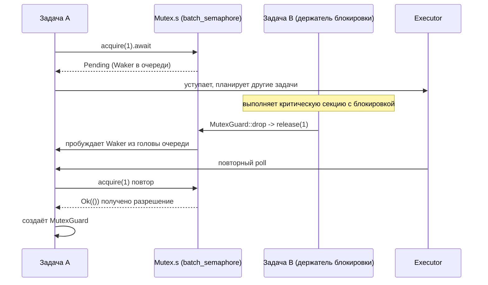

# Глава 7: Примитивы синхронизации: как Mutex, Semaphore и каналы реализуют асинхронное ожидание

Глава 7: Примитивы синхронизации: как Mutex, Semaphore и каналы реализуют асинхронное ожидание

# Проект: tokio-rs/tokio

## Прогресс книги: Глава 7 / 14

`std::sync::Mutex`Статус проверки: строки FACT реально привязаны`lock()`Предыдущая глава показала, как время абстрагируется в событие I/O, позволяя таймерам и готовности fd совместно использовать одну точку ожидания park/unpark. Однако когда несколько задач конкурируют за одну и ту же блокировку или передают сообщения через каналы, объектом ожидания становится уже не fd или часы, а изменение состояния другой задачи. Эта глава входит в семейство tokio::sync и выясняет, куда именно lock().await или recv().await сохраняет Waker при блокировке и как он затем перепланируется при пробуждении.**Почему асинхронный Mutex не может повторно использовать реализацию std**Интуитивная модель: от «занимаю место» к «уступаю место»**В**при занятой блокировке`Pending`блокирует текущий поток

— поток приостанавливается операционной системой до освобождения блокировки. В асинхронном рантайме это катастрофично: один worker-поток может одновременно обслуживать сотни и тысячи задач, и если он блокируется из-за ожидания блокировки, все остальные задачи, которые он несёт, останавливаются. Основное требование асинхронного Mutex: при ожидании блокировки`Mutex`уступить поток**Полностью построен на семафоре**。

## Структура данных и размещение в памяти

`Mutex<T>`Поля минимальны:

[FACT:tokio/src/sync/mutex.rs:133-138]

```rust
pub struct Mutex {
    #[cfg(all(tokio_unstable, feature = "tracing"))]
    resource_span: tracing::Span,
    s: semaphore::Semaphore,
    c: UnsafeCell,
}
```

Три поля выполняют каждая свою роль:`s`— это**семафор с количеством разрешений 1**，`c`— это`UnsafeCell<T>`защищённые данные, обёрнутые в . Обратите внимание, что здесь`semaphore`— это`batch_semaphore`псевдоним для[FACT:tokio/src/sync/mutex.rs:3-3], то есть низкоуровневая реализация, а не`sync::Semaphore`тот публичный слой обёртки.

`MutexGuard<'a, T>`же хранит только ссылку на`Mutex`:

[FACT:tokio/src/sync/mutex.rs:151-157]

```rust
pub struct MutexGuard {
    #[cfg(all(tokio_unstable, feature = "tracing"))]
    resource_span: tracing::Span,
    lock: &'a Mutex,
}
```

Здесь есть ключевое проектное решение:`MutexGuard` **не хранит объект разрешения семафора**, а хранит только`&Mutex`. Действие освобождения блокировки происходит в`Drop`, напрямую вызывая`self.lock.s.release(1)` [FACT:tokio/src/sync/mutex.rs:959-961]. Это отличается от`SemaphorePermit`, который хранит`permits: usize`счётчик и возвращает его при Drop — у Mutex количество разрешений всегда равно 1, счётчик не нужен.

`Send`/`Sync`Границы

[FACT:tokio/src/sync/mutex.rs:258-259]

```rust
unsafe impl Send for Mutex where T: ?Sized + Send {}
unsafe impl Sync for Mutex where T: ?Sized + Send {}
```

`Sync`требует только`T: Send`, а не`T: Sync`— это разумно, поскольку взаимное исключение гарантирует, что только один поток одновременно может касаться`T`, передача владения`T`между потоками (`Send`) достаточна, не требуется, чтобы`T`сам по себе был разделяемым (`Sync`). Именно поэтому`Mutex<T>`может превратить не-`Sync``T`в`Sync`.

## Пошагово: полное путешествие одного`lock().await`

Сценарий: задача A вызывает`mutex.lock().await`, в этот момент блокировка свободна.

Первый шаг,`lock()`конструирует async-блок, внутри сначала`self.acquire().await`, после успеха конструирует`MutexGuard` [FACT:tokio/src/sync/mutex.rs:434-443]。

Второй шаг,`acquire()`напрямую делегирует семафору:

[FACT:tokio/src/sync/mutex.rs:655-663]

```rust
async fn acquire(&self) {
    crate::trace::async_trace_leaf().await;
    self.s.acquire(1).await.unwrap_or_else(|_| {
        unreachable!()
    });
}
```

`unwrap_or_else(|_| unreachable!())`Этот комментарий выражает проектное ограничение: Mutex никогда явно не закрывает семафор и монопольно владеет им, поэтому`acquire`никогда не вернёт`Err`. Это исключает путь ошибки «закрытие семафора» на уровне типов.

Третий шаг, если блокировка занята,`s.acquire(1)`возвращает`Pending`, Waker текущей задачи регистрируется в очереди ожидания семафора.**Где хранится Waker?**Ответ в`batch_semaphore`очереди ожидания (в исходных материалах этой главы этот файл не раскрыт, но его роль такова: каждый ожидающий хранит один Waker, очередь FIFO).

Четвёртый шаг, когда задача B, удерживающая блокировку, освобождает её,`MutexGuard::drop`вызывает`s.release(1)` [FACT:tokio/src/sync/mutex.rs:965-975], семафор передаёт разрешение первому в очереди ожидающему и пробуждает его Waker, задача A перепланируется,`acquire`возвращает`Ok`, конструируется`MutexGuard`。

Весь процесс можно описать следующей диаграммой последовательности:



## Проектное размышление: FIFO-справедливость и безопасность отмены

Документация явно заявляет, что Mutex в Tokio гарантирует FIFO[FACT:tokio/src/sync/mutex.rs:20-22]. Эта справедливость исходит из семантики очереди нижележащего семафора. Цена справедливости: одна`lock`отмена (например, проигрыш в`select!`) заставит вас**потерять место в очереди** [FACT:tokio/src/sync/mutex.rs:415-419]. Это не баг, а неизбежность FIFO-очереди — отмена означает удаление из очереди, повторный`lock`требует повторной постановки в очередь.

Ещё одно контринтуитивное проектное решение —**не отравляет**（no poisoning）。`std::sync::Mutex`помечается как poisoned при panic в потоке, удерживающем блокировку, последующий`lock`возвращает`Err`. Mutex в Tokio так не делает: при panic удерживающего блокировка нормально освобождается[FACT:tokio/src/sync/mutex.rs:122-125]. Документация предупреждает, что если panic перехвачен, защищённые данные могут оказаться в несогласованном состоянии. Это прагматичный компромисс в асинхронном сценарии — panic в асинхронной задаче обычно означает завершение задачи, а механизм отравления лишь добавляет сложность.

`MutexGuard::map`Серия методов`MutexGuard<T>`заслуживает упоминания. Она позволяет понизить весь`MappedMutexGuard<U>`до`data`, защищающего только определённое подполе. В реализации сначала через замыкание вычисляется указатель на подполе`skip_drop`, затем через`MutexGuardInner`исходный guard разбирается на[FACT:tokio/src/sync/mutex.rs:869-883]。`skip_drop`, не вызывающий Drop, и наконец конструируется новый guard`ManuallyDrop` + `ptr::read`с помощью`Drop`переносится владение полем, избегая[FACT:tokio/src/sync/mutex.rs:827-836]двойного вызова

# . Это классический приём в Rust для «передачи владения без вызова деструктора».

## Semaphore: как реализуются счётчик разрешений и очередь ожидания для обратного давления

Интуитивная модель: парковочные места`acquire`Семафор похож на парковку:`release`— это въезд, если есть свободное место — заезжаешь, если нет — стоишь в очереди у входа;`acquire_many(n)`— это выезд, освобождается место — уведомляется первая машина в очереди на въезд. Количество разрешений — это общее число мест,

## — это большая машина, занимающая n мест.

Структура данных и размещение в памяти`Semaphore`Публичный`batch_semaphore::Semaphore`— лишь тонкая обёртка над низкоуровневым

[FACT:tokio/src/sync/semaphore.rs:427-432]

```rust
pub struct Semaphore {
    ll_sem: ll::Semaphore,
    #[cfg(all(tokio_unstable, feature = "tracing"))]
    resource_span: tracing::Span,
}
```

`SemaphorePermit<'a>`Копировать

[FACT:tokio/src/sync/semaphore.rs:442-445]

```rust
pub struct SemaphorePermit {
    sem: &'a Semaphore,
    permits: usize,
}
```

`permits`Копировать`forget`/`merge`/`split`Поле`forget`— ключ к пониманию`permits`.[FACT:tokio/src/sync/semaphore.rs:1193-1195]обнуляет`split`, так что при Drop возвращается 0 разрешений — эквивалентно «постоянному расходованию» этих разрешений.[FACT:tokio/src/sync/semaphore.rs:1260-1271]。`merge`вырезает n из текущих разрешений для нового permit[FACT:tokio/src/sync/semaphore.rs:1230-1240]。

> **[Design Inference & Architectural Trade-offs]**
> `MAX_PERMITS`〔Проектные выводы и архитектурные компромиссы〕`usize::MAX >> 3` [FACT:tokio/src/sync/semaphore.rs:476-479]— это`batch_semaphore`. Почему сдвиг вправо на 3 бита? Низкоуровневому`usize`нужно кодировать флаги состояния (например, флаг закрытия) в старших битах, поэтому количество доступных разрешений ограничивается младшими битами, а старшие оставляются под флаги. Это распространённый приём упаковки «счётчик + состояние» в один

## .

Пошагово: поток разрешений при acquire и release`acquire()`Сценарий: семафор изначально с 2 разрешениями, задача A`acquire_many(2)`。

`acquire()`, задача B`ll_sem.acquire(1)`делегирует`SemaphorePermit { permits: 1 }` [FACT:tokio/src/sync/semaphore.rs:614-631]。`acquire_many(2)`, после успеха конструирует[FACT:tokio/src/sync/semaphore.rs:661-679]。

аналогично, но передаёт 2`ll_sem.acquire(n)`Если разрешений недостаточно,`Pending`возвращает`acquire_many(5)`, Waker ставится в очередь. Здесь есть деталь справедливости: документация указывает, что если во главе очереди стоит`acquire(1)`, а осталось всего 3 разрешения, то даже если позади есть[FACT:tokio/src/sync/semaphore.rs:19-24], которое можно немедленно удовлетворить, оно должно ждать — потому что большая машина во главе занимает очередь

. Это цена строгого FIFO, избегающая голодания.

[FACT:tokio/src/sync/semaphore.rs:1402-1404]

```rust
impl Drop for SemaphorePermit {
    fn drop(&mut self) {
        self.sem.add_permits(self.permits);
    }
}
```

`add_permits`Копировать`ll_sem.release(n)` [FACT:tokio/src/sync/semaphore.rs:568-570]делегирует

, низкоуровневый уровень возвращает разрешение в очередь ожидания и пробуждает ожидающего, которому хватает разрешений.`AcqRel`Что касается порядка памяти, документация даёт сильную гарантию: acquire, release, close — все`AcqRel` [FACT:tokio/src/sync/semaphore.rs:35-42]. Это означает, что запись, выполняемая по принципу «сначала записать данные, затем release разрешения», видна задаче, которая «позже acquire разрешение» — семафор может безопасно передавать данные между задачами.

## Размышления о дизайне: close и обратное давление

`close()`заставляет всех ожидающих получить`AcquireError`, и последующие`try_acquire`возвращают`Closed` [FACT:tokio/src/sync/semaphore.rs:1161-1163]. Это основа элегантного завершения: когда принимающая сторона больше не нуждается в данных, close семафора позволяет всем заблокированным отправителям немедленно завершиться с ошибкой, а не ждать вечно.

Суть обратного давления наиболее ясно проявляется в mpsc. В следующем разделе будет показано, что управление ёмкостью mpsc реализовано с помощью семафора, число разрешений которого равно размеру буфера.

# Семейство каналов: различные компромиссы между очередью ожидающих и пробуждением через Waker

## Интуитивная модель: четыре типа каналов, четыре стратегии ожидания

`oneshot`— это «одноразовый конверт» — можно отправить только одно письмо, отправитель не ждёт (`send`синхронный), получатель`await`ждёт письмо.`mpsc`— это «ограниченная лента конвейера» — отправитель ждёт, когда лента заполнена, получатель ждёт, когда она пуста, ёмкость контролируется семафором.`broadcast`и`watch`— это «громкоговоритель» — один отправитель, несколько получателей, но оба совершенно по-разному обрабатывают «отставание».

Исходные материалы этого раздела сосредоточены на`oneshot`и`mpsc::bounded`, мы разберём их по очереди.

## oneshot: минималистичное рукопожатие, закодированное в битах состояния

`oneshot`структура`Inner`является ядром понимания его дизайна:

[FACT:tokio/src/sync/oneshot.rs:386-409]

```rust
struct Inner {
    state: AtomicUsize,
    value: UnsafeCell>,
    tx_task: Task,
    rx_task: Task,
}
```

`state`— это`AtomicUsize`, использующий битовые флаги для кодирования состояния всего канала. Четыре флага определены в конце файла:

[FACT:tokio/src/sync/oneshot.rs:1488-1505]

```rust
const RX_TASK_SET: usize = 0b00001;
const VALUE_SENT: usize = 0b00010;
const CLOSED: usize = 0b00100;
const TX_TASK_SET: usize = 0b01000;
```

`value`— это`UnsafeCell<Option<T>>`，`tx_task`и`rx_task`— это`Task`типы, внутри`UnsafeCell<MaybeUninit<Waker>>` [FACT:tokio/src/sync/oneshot.rs:411-411]. Обратите внимание, что`MaybeUninit`— Waker может быть неинициализирован, его валидность определяется битом`state`в`RX_TASK_SET`/`TX_TASK_SET`Суть этого дизайна в том, что бит[FACT:tokio/src/sync/oneshot.rs:396-399]。

**не только указывает, что «значение отправлено», но и определяет, кому принадлежит право доступа к**：`VALUE_SENT`. Комментарий написан очень чётко`UnsafeCell`: если[FACT:tokio/src/sync/oneshot.rs:1491-1496]установлен,`VALUE_SENT`доступен только получателю; если не установлен, доступен только отправителю. Таким образом, один атомарный бит реализует бесслодочную передачу владения, избегая дополнительных блокировок.`UnsafeCell`Процесс

`send`:

[FACT:tokio/src/sync/oneshot.rs:622-646]

```rust
pub fn send(mut self, t: T) -> Result {
    let inner = self.inner.take().unwrap();
    inner.value.with_mut(|ptr| unsafe {
        *ptr = Some(t);
    });
    if !inner.complete() {
        unsafe {
            return Err(inner.consume_value().unwrap());
        }
    }
    Ok(())
}
```

Сначала значение записывается в`UnsafeCell`(в этот момент`VALUE_SENT`не установлен, получатель не будет обращаться), затем вызывается`complete()`для попытки установки`VALUE_SENT`。`complete()`— это цикл CAS:

[FACT:tokio/src/sync/oneshot.rs:1516-1549]

```rust
fn set_complete(cell: &AtomicUsize) -> State {
    let mut state = cell.load(Ordering::Relaxed);
    loop {
        if State(state).is_closed() {
            break;
        }
        match cell.compare_exchange_weak(
            state, state | VALUE_SENT, Ordering::AcqRel, Ordering::Acquire,
        ) {
            Ok(_) => break,
            Err(actual) => state = actual,
        }
    }
    State(state)
}
```

Почему используется CAS, а не простой`fetch_or`? Комментарий объясняет это очень ясно[FACT:tokio/src/sync/oneshot.rs:1517-1529]: если канал уже`CLOSED`, то**нельзя**снова устанавливать`VALUE_SENT`. Поскольку после установки получатель будет считать, что может обращаться к`UnsafeCell`, а в это время отправитель готовится забрать значение обратно (`consume_value`), одновременный доступ с обеих сторон приведёт к гонке данных. Поэтому цикл CAS при обнаружении`CLOSED`досрочно прерывается, не устанавливая флаг.

`complete()`После возврата, если установка прошла успешно и`RX_TASK_SET`уже установлен, получатель пробуждается:

[FACT:tokio/src/sync/oneshot.rs:1300-1315]

```rust
fn complete(&self) -> bool {
    let prev = State::set_complete(&self.state);
    if prev.is_closed() {
        return false;
    }
    if prev.is_rx_task_set() {
        unsafe {
            self.rx_task.with_task(Waker::wake_by_ref);
        }
    }
    true
}
```

получателя`poll_recv`является ядром конечного автомата:

[FACT:tokio/src/sync/oneshot.rs:1317-1384]

Сначала он загружает состояние, если`is_complete()`то сразу`consume_value`возвращает; если`is_closed()`возвращает`Err`; иначе переходит в ветку «регистрация Waker». При регистрации сначала проверяется`is_rx_task_set()`, если уже установлен и`will_wake`определяет, что это тот же Waker, повторная установка не производится; если другой, то сначала unset, затем set. Здесь есть тонкая обработка гонки: после unset, если обнаруживается, что`is_complete()`стало истинным, нужно**снова установить флаг обратно** [FACT:tokio/src/sync/oneshot.rs:1342-1344], иначе Waker будет утечён при Drop (поскольку Drop зависит от флага для определения, нужно ли дропать Waker).

Этот паттерн «unset, затем повторный set» также встречается в`poll_closed`[FACT:tokio/src/sync/oneshot.rs:839-848], это стандартный приём oneshot для обработки конкурентных пробуждений.

## mpsc::bounded: обратное давление, управляемое семафором

Управление ёмкостью mpsc полностью передано семафору.`channel`Функция создаёт семафор с числом разрешений, равным размеру буфера:

[FACT:tokio/src/sync/mpsc/bounded.rs:159-171]

```rust
pub fn channel(buffer: usize) -> (Sender, Receiver) {
    assert!(buffer > 0, "mpsc bounded channel requires buffer > 0");
    let semaphore = Semaphore {
        semaphore: semaphore::Semaphore::new(buffer),
        bound: buffer,
    };
    let (tx, rx) = chan::channel(semaphore);
    let tx = Sender::new(tx);
    let rx = Receiver::new(rx);
    (tx, rx)
}
```

`Semaphore`— это внутренняя обёртка mpsc, одновременно содержащая базовый семафор и`bound`(максимальная ёмкость)[FACT:tokio/src/sync/mpsc/bounded.rs:176-179]。`bound`используется для запроса`max_capacity`, а`available_permits`даёт текущую ёмкость[FACT:tokio/src/sync/mpsc/bounded.rs:591-593]。

Путь отправки`send`сначала`reserve`затем`send`：

[FACT:tokio/src/sync/mpsc/bounded.rs:816-824]

```rust
pub async fn send(&self, value: T) -> Result> {
    match self.reserve().await {
        Ok(permit) => {
            permit.send(value);
            Ok(())
        }
        Err(_) => Err(SendError(value)),
    }
}
```

`reserve`внутри вызывает`reserve_inner(1)`, который сначала проверяет`n > max_capacity`и сразу возвращает ошибку, затем`acquire(n)` [FACT:tokio/src/sync/mpsc/bounded.rs:1272-1311]. Здесь есть изящный страж`WakeReceiverOnDrop`:

[FACT:tokio/src/sync/mpsc/bounded.rs:1286-1301]

```rust
struct WakeReceiverOnDrop {
    chan: &'a chan::Tx,
}
impl Drop for WakeReceiverOnDrop {
    fn drop(&mut self) {
        use chan::Semaphore;
        let semaphore = self.chan.semaphore();
        if semaphore.is_closed() && semaphore.is_idle() {
            self.chan.wake_rx();
        }
    }
}
```

Комментарий объясняет мотивацию[FACT:tokio/src/sync/mpsc/bounded.rs:1279-1285]: если`reserve`после получения части разрешений отменяется (например,`select!`проигрывает), базовый`Acquire`при Drop вернёт эти разрешения, но**не**так, как`Permit`, уведомит получателя. Если в этот момент канал уже закрыт и простаивает, получатель может никогда не дождаться уведомления «канал закрыт». Этот страж при Drop восполняет это пробуждение. При успехе используется`mem::forget(guard)`для отмены стража[FACT:tokio/src/sync/mpsc/bounded.rs:1306-1306], поскольку на успешном пути`Permit`берёт на себя ответственность за уведомление.

`Permit`Drop также делает то же самое:

[FACT:tokio/src/sync/mpsc/bounded.rs:1732-1745]

```rust
impl Drop for Permit {
    fn drop(&mut self) {
        use chan::Semaphore;
        let semaphore = self.chan.semaphore();
        semaphore.add_permit();
        if semaphore.is_closed() && semaphore.is_idle() {
            self.chan.wake_rx();
        }
    }
}
```

`Permit::send`использует`mem::forget`для пропуска Drop, избегая возврата разрешений[FACT:tokio/src/sync/mpsc/bounded.rs:1721-1728]。

Путь получения`recv`использует`poll_fn`для обёртки`chan.recv(cx)` [FACT:tokio/src/sync/mpsc/bounded.rs:243-246]。`poll_recv`напрямую делегирует[FACT:tokio/src/sync/mpsc/bounded.rs:650-652]. Настоящая логика очереди ожидания находится в модуле`chan`(в этой главе не раскрывается), но можно предположить: Waker получателя хранится в`chan::Rx`, и пробуждается, когда отправитель`send`.

`try_send`демонстрирует неблокирующий путь:

[FACT:tokio/src/sync/mpsc/bounded.rs:924-934]

```rust
pub fn try_send(&self, message: T) -> Result> {
    match self.chan.semaphore().semaphore.try_acquire(1) {
        Ok(()) => {}
        Err(TryAcquireError::Closed) => return Err(TrySendError::Closed(message)),
        Err(TryAcquireError::NoPermits) => return Err(TrySendError::Full(message)),
    }
    self.chan.send(message);
    Ok(())
}
```

`try_acquire`Две ошибки точно отображаются на`Closed`и`Full`, различая два типа сбоев: «канал закрыт» и «буфер заполнен».

## Размышления о дизайне: безопасность отмены и потеря сообщений

Документация mpsc неоднократно подчёркивает безопасность отмены[FACT:tokio/src/sync/mpsc/bounded.rs:776-784]：`send`при проигрыше в`select!`,**сообщение будет отброшено**. Чтобы избежать потери, необходимо использовать`reserve`получить`Permit`затем`send`— поскольку`Permit`уже зарезервировал ёмкость,`send`синхронный и не может быть прерван.

`recv`же является безопасным от отмены[FACT:tokio/src/sync/mpsc/bounded.rs:199-204]: если`recv`проигрывает в`select!`, гарантируется, что ни одно сообщение не будет потреблено. Это потому, что`recv`возвращает`poll_recv`только при фактическом получении сообщения, а при`Ready`，`Pending`не трогает очередь.

`oneshot`как Future также безопасен от отмены`Receiver`. Но обратите внимание:[FACT:tokio/src/sync/oneshot.rs:246-251]синхронный, поэтому не существует проблемы «send отменён» — либо отправлено, либо`oneshot`возвращает исходное значение.`send`Размышления о дизайне и подводные камни в продакшене`Err`Возвращает исходное значение.

# Проектные соображения и подводные камни в продакшене

**Ошибка первая: использование асинхронного Mutex для защиты чистых данных.**Документация явно рекомендует[FACT:tokio/src/sync/mutex.rs:26-36]: если защищаемые данные являются чистыми (без`.await`требований), использовать`std::sync::Mutex`или`parking_lot`быстрее. Накладные расходы асинхронного Mutex заключаются в атомарных операциях семафора и возможном планировании задач. Только когда необходимо удерживать блокировку во время`.await`(например, при доступе к соединению с базой данных с удержанием блокировки), следует использовать асинхронный Mutex.

**Ошибка вторая: удержание блокировки через`.await`приводит к взаимоблокировке.**Это самая опасная ловушка асинхронного Mutex. Если задача A, удерживая блокировку,`.await`ожидает события, которое должно быть выполнено задачей B, а задача B в свою очередь ждёт эту блокировку, возникает взаимоблокировка.`std::sync::Mutex`guard не является`Send`(в перемещаемых задачах), компилятор предотвратит удержание через`.await`; но guard асинхронного Mutex является`Send` [FACT:tokio/src/sync/mutex.rs:314-314], компилятор не остановит вас, нужно самостоятельно гарантировать отсутствие циклического ожидания.

**Ошибка третья:`reserve`после забытого`send`。** `Permit`Drop вернёт разрешение[FACT:tokio/src/sync/mpsc/bounded.rs:1732-1745], поэтому ёмкость не будет утеряна. Но если канал уже закрыт и простаивает, Drop разбудит получателя — это пробуждение необходимо, иначе получатель может никогда не дождаться уведомления о закрытии.

**Ошибка четвёртая:`oneshot`у`poll`может быть ложным`Pending`。**Документация поясняет[FACT:tokio/src/sync/oneshot.rs:236-242]: даже если сообщение отправлено,`poll`может вернуть`Pending`. Это не баг, а нормальное явление в условиях конкурентной гонки — вызывающий будет разбужен для повторной попытки, сообщение не потеряется, лишь задержится.

**Ошибка пятая:`forget_permits`семантика.** `forget_permits(n)`Пытается уменьшить n разрешений, возвращает фактически уменьшенное количество[FACT:tokio/src/sync/semaphore.rs:576-578]. Он не блокируется и не будит ожидающих — просто «поглощает» разрешения. Используется для динамического сокращения ёмкости семафора.

# Резюме главы

Эта глава раскрывает`tokio::sync`ключевые паттерны:**все асинхронные примитивы ожидания построены на «очереди ожидающих + пробуждении через Waker», а конкретная реализация очереди зависит от сценария**。

- `Mutex`переиспользует семафор с количеством разрешений 1,`MutexGuard`хранит только ссылку, при Drop`release(1)`, FIFO-справедливость без отравления.
- `Semaphore`— это счётчик разрешений + очередь ожидания,`SemaphorePermit`использует`permits`счётчик для поддержки`forget`/`merge`/`split`，`MAX_PERMITS`сдвиг вправо на 3 бита оставляет место для флагов состояния.
- `oneshot`использует один`AtomicUsize`битовый флаг для кодирования состояния,`VALUE_SENT`бит одновременно определяет принадлежность права доступа к`UnsafeCell`, цикл CAS предотвращает установку после`CLOSED`.
- `mpsc::bounded`использует семафор с количеством разрешений, равным buffer, для реализации обратного давления,`WakeReceiverOnDrop`guard обрабатывает компенсацию пробуждения при отмене.

# Вопросы для размышления и самопроверки

В: Если заменить`set_complete`цикл CAS на простой`fetch_or(VALUE_SENT)`, в каких сценариях конкурентности возникнет гонка данных?

**Разбор ответа**：`set_complete`Причина использования цикла CAS вместо`fetch_or`указана в комментарии[FACT:tokio/src/sync/oneshot.rs:1517-1529]: необходимо перед установкой`VALUE_SENT`проверить`CLOSED`. Если заменить на безусловный`fetch_or`, рассмотрим такую последовательность: получатель сначала вызывает`close()`устанавливает`CLOSED` [FACT:tokio/src/sync/oneshot.rs:1569-1574], отправитель затем`send`записывает значение и`fetch_or(VALUE_SENT)`. В этот момент`VALUE_SENT`и`CLOSED`установлены одновременно, получатель в`poll_recv`видит, что`is_complete()`истинно, и вызовет`consume_value`для извлечения значения[FACT:tokio/src/sync/oneshot.rs:1325-1330]; а отправитель после возврата из`complete()`, поскольку`prev.is_closed()`истинно, вызовет`consume_value`для возврата значения обратно[FACT:tokio/src/sync/oneshot.rs:1300-1315]. Обе стороны одновременно обращаются к`UnsafeCell`, гонка данных. Цикл CAS при обнаружении`CLOSED`досрочно прерывается, не устанавливая`VALUE_SENT`, тем самым гарантируя инвариант «после закрытия отправитель обладает эксклюзивным правом доступа».

Q: `reserve_inner`в`WakeReceiverOnDrop`guard на успешном пути использует`mem::forget`для пропуска, что произойдёт, если убрать этот`forget`?

**Разбор ответа**: логика Drop guard — «если семафор закрыт и простаивает, разбудить получателя»[FACT:tokio/src/sync/mpsc/bounded.rs:1290-1298]. На успешном пути`acquire(n)`возвращает`Ok`, вызывающий получает разрешение и создаст`Permit`, за последующие уведомления отвечает`Permit`. Если не убрать guard, guard при возврате функции выполнит Drop и дополнительно проверит «закрыт и простаивает» — но в этот момент разрешение уже удерживается вызывающим`reserve_inner`, семафор не простаивает (`is_idle`ложно), поэтому фактически повторного пробуждения не произойдёт. Но важнее ясность семантики: ответственность за пробуждение на успешном пути должна полностью лежать на`Permit`, guard отвечает только за компенсацию на пути «отмены/ошибки».`mem::forget`явно выражает намерение «этот путь не нуждается в guard». Если убрать`forget`и семафор окажется в граничном состоянии «закрыт и простаивает» (например,`acquire`вернул`Ok`, но разрешение ещё не перехвачено`Permit`), может возникнуть лишнее пробуждение — хотя это не приведёт к ошибке, но потратит одно планирование.

В: Если изменить`MutexGuard`на хранение объекта разрешения семафора (как`SemaphorePermit`), какие проблемы это внесёт?

**Разбор ответа**: Текущий`MutexGuard`хранит только`&Mutex`, при Drop вызывает`self.lock.s.release(1)` [FACT:tokio/src/sync/mutex.rs:959-961]. Если изменить на хранение объекта разрешения, возникнет несколько проблем. Во-первых,`MutexGuard::map`серия методов требует разбора guard на`MappedMutexGuard`, защищая только подполя[FACT:tokio/src/sync/mutex.rs:869-883]. При текущем дизайне`MappedMutexGuard`нужно хранить только`&Semaphore`и указатель на подполе[FACT:tokio/src/sync/mutex.rs:190-199], при Drop`self.s.release(1)` [FACT:tokio/src/sync/mutex.rs:1252-1262]. Если guard хранит объект разрешения, при map придётся передавать владение объектом разрешения, а`MappedMutexGuard`разметка полей станет сложнее. Во-вторых, объект разрешения обычно несёт`permits: usize`счётчик, для Mutex этот счётчик всегда равен 1, что избыточно. В-третьих,`MutexGuard`границы`Send`/`Sync`уже точно контролируются через`unsafe impl`, хранение объекта разрешения внесёт дополнительные ограничения трейтов. Текущий дизайн «только ссылка + ручной release» легче и проще поддерживает[FACT:tokio/src/sync/mutex.rs:260-263]На этом мы увидели`map`。

как`tokio::sync`использует единый паттерн «очередь ожидающих + пробуждение через Waker» для поддержки асинхронного ожидания в Mutex, Semaphore и различных каналах. Но не все блокировки можно сделать асинхронными — некоторые операции (например, вызовы файловой системы, CPU-интенсивные вычисления) по своей природе блокируют поток. В следующей главе мы перейдём к границе между`spawn_blocking`пулом потоков и`block_on`, и посмотрим, как Tokio строит мост между асинхронным рантаймом и синхронными блокировками.

Место хранения Waker зависит от примитива: в Mutex/Semaphore он находится в очереди ожидания базового семафора, в oneshot — в полях tx_task/rx_task структуры Inner, в mpsc — в очередях отправки и получения модуля chan. Но механизм пробуждения единообразен: при изменении состояния извлекается Waker и вызывается wake_by_ref, после чего исполнитель перепланирует задачу. На этом внутренний механизм ожидания и пробуждения в асинхронных примитивах становится полностью ясным. Однако не весь код можно сделать асинхронным — в следующей главе мы рассмотрим, как использовать spawn_blocking для моста к блокирующим операциям и как block_on управляет Future вне асинхронного контекста.
