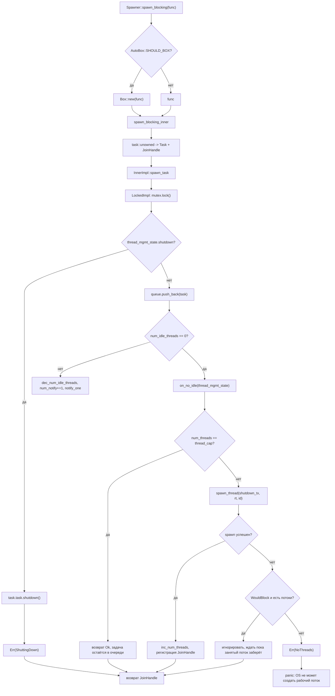
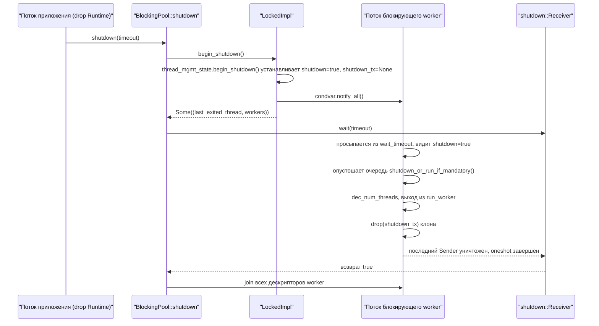

# Глава 8: Блокировки и мосты: пул потоков spawn_blocking и границы block_on

В предыдущей главе мы увидели, что асинхронные Mutex и каналы не занимают поток во время ожидания благодаря тому, что Waker сохраняется в очередь ожидания, а после выполнения условия пробуждающий перепланирует задачу. Но всё это работает только при условии, что задача может добровольно уступить поток в состоянии Pending. Как только код вызывает std::fs::read, libsqlite3 или чистый цикл сжатия на CPU, он монополизирует рабочий поток до возврата, и все остальные задачи на этом потоке голодают. Решение Tokio — вынести такую работу в отдельный пул блокирующих потоков и использовать block_on для управления Future вне асинхронного контекста. В этой главе мы разберём обе эти границы.

# 8.1 Структура памяти пула блокирующих потоков: Inner и очередь с двумя реализациями

**Интуитивная модель**：`spawn_blocking`Пул потоков подобен «пулу внешних подработчиков» в ресторане. Официанты (рабочие потоки) только принимают заказы и разносят блюда; столкнувшись с блюдом, требующим долгого тушения, они пишут наряд и бросают его в окно выдачи на кухне (очередь), а подработчики (блокирующие потоки) берут наряды из окна. Без этого пула официантам пришлось бы самим вставать к плите, и весь ресторан остановился бы.

**Ключевые структуры**. Весь пул удерживается`BlockingPool`Он хранит только две вещи: клонируемый`Spawner`(точка входа для отправки) и`shutdown_rx`(приёмник сигнала завершения)[FACT:tokio/src/runtime/blocking/pool.rs:20-23]。`Spawner`Внутри —`Arc<Inner>`, все отправители разделяют одно состояние[FACT:tokio/src/runtime/blocking/pool.rs:26-28]。

`Inner`— это всё состояние пула, и каждое поле заслуживает отдельного рассмотрения[FACT:tokio/src/runtime/blocking/pool.rs:77-104]：

- `inner_impl: InnerImpl`: реализация топологии «очередь + уведомление + блокировка» представляет собой перечисление с двумя вариантами —`Locked`и`Sharded`[FACT:tokio/src/runtime/blocking/pool.rs:107-110]. Это ключевая абстракция главы — она объединяет две топологии, «очередь с единой блокировкой» и «сегментированная очередь», под одним интерфейсом.
- `thread_cap: usize`: верхняя граница числа потоков, то есть`max_blocking_threads`。
- `scheduler_threads: usize`: число рабочих потоков планировщика, используется для вычитания в метриках, чтобы`num_blocking_threads`учитывал только блокирующие потоки[FACT:tokio/src/runtime/blocking/pool.rs:455-460]。
- `keep_alive: Duration`: время жизни простаивающего потока, по умолчанию`KEEP_ALIVE = 10s` [FACT:tokio/src/runtime/blocking/pool.rs:231]。
- `metrics: SpawnerMetrics`: три атомарных счётчика —`num_threads`、`num_idle_threads`、`queue_depth` [FACT:tokio/src/runtime/blocking/pool.rs:31-35]。

> **[Design Inference & Architectural Trade-offs]**
> **Почему используются атомарные счётчики, а не поля под блокировкой?** `num_idle_threads`читается на горячем пути`spawn_task`(для определения, нужно ли будить простаивающий поток); если бы он находился внутри`Mutex`, при каждой отправке пришлось бы сначала захватывать блокировку, а затем читать. Сделав его`MetricAtomicUsize`, путь отправки может выполнить быструю проверку, не удерживая блокировку очереди. Цена — отсутствие атомарной согласованности между этими счётчиками и состоянием очереди, поэтому в коде используется счётчик`num_notify`для компенсации — см. ниже.

**Состояние управления потоками**。`ThreadManagementState`вынесено отдельно для повторного использования обеими реализациями очереди[FACT:tokio/src/runtime/blocking/pool.rs:135-150]：

- `shutdown: bool`: флаг завершения.
- `shutdown_tx: Option<shutdown::Sender>`: каждый рабочий поток держит клон; после drop всех клонов`shutdown_rx`получает уведомление.
- `last_exiting_thread: Option<JoinHandle<()>>`: дескриптор предыдущего потока, завершившегося по тайм-ауту.
- `worker_threads: HashMap<usize, JoinHandle<()>>`: дескрипторы всех живых рабочих потоков.
- `worker_thread_index: usize`: монотонно возрастающий распределитель ID потоков.

`last_exiting_thread`Мотивация дизайна ясно описана в комментариях: поток, завершившийся по тайм-ауту, выполняет join предыдущего потока, завершившегося по тайм-ауту, чтобы избежать ложных срабатываний Valgrind[FACT:tokio/src/runtime/blocking/pool.rs:135-150]。`worker_timed_out`Именно это и есть реализация цепочки join — он удаляет свой дескриптор и возвращает старый`last_exiting_thread`вызывающему для выполнения join[FACT:tokio/src/runtime/blocking/pool.rs:172-178]。

**Обёртка задачи**. В очереди хранится`Task`, который оборачивает`UnownedTask<BlockingSchedule>`и флаг`Mandatory`[FACT:tokio/src/runtime/blocking/pool.rs:187-191]。`Mandatory`определяет, будет ли задача отброшена или принудительно выполнена при завершении:`shutdown_or_run_if_mandatory`при`NonMandatory`вызывает`shutdown()`, при`Mandatory`вызывает`run()` [FACT:tokio/src/runtime/blocking/pool.rs:223-228]. В этом и заключается разница между`spawn_blocking`(непринудительный) и`spawn_mandatory_blocking`(принудительный, используется для fs)[FACT:tokio/src/runtime/blocking/pool.rs:233-265]。

**Структура памяти реализации с единой блокировкой**。`LockedImpl`— это самая примитивная топология: один`Mutex<LockedInner>`плюс один`Condvar` [FACT:tokio/src/runtime/blocking/pool.rs:113-116]。`LockedInner`содержит`VecDeque<Task>`、`num_notify: u32`и`thread_mgmt_state` [FACT:tokio/src/runtime/blocking/pool.rs:118-124]. Обратите внимание, что`num_notify`и`thread_mgmt_state`находятся под одной блокировкой, а`num_idle_threads`— атомарная величина вне блокировки. Эта гибридная структура, где «часть состояния под блокировкой, часть вне неё», и есть источник всех последующих тонкостей конкурентности.

# 8.2 Путь отправки: от spawn_blocking до пробуждения потока

**Сценарий**: асинхронная задача вызывает`tokio::task::spawn_blocking(move || heavy_compute(data))`, что происходит в этот момент?

**Шаг первый: решение об упаковке и создание задачи**。`Spawner::spawn_blocking`сначала измеряет размер замыкания`fn_size`, затем на основе`AutoBox::<F>::SHOULD_BOX`решает, упаковывать ли замыкание в`Box`[FACT:tokio/src/runtime/blocking/pool.rs:359-389]. Это общая стратегия Tokio «автоматическая упаковка больших Future»: при слишком большом замыкании оно упаковывается, чтобы избежать раздувания структуры задачи.

Войдя в`spawn_blocking_inner`, сначала выделяется ID задачи, затем с помощью`blocking_task`замыкание упаковывается в Future, и наконец с помощью`task::unowned`конструируются`UnownedTask`и`JoinHandle` [FACT:tokio/src/runtime/blocking/pool.rs:440-449]. Обратите внимание, что здесь возвращается`(JoinHandle<R>, Result<(), SpawnError>)`— кортеж из двух элементов: дескриптор и результат отправки возвращаются отдельно.

**Шаг второй: три варианта обработки результата отправки**. Возвращаясь к`spawn_blocking`, выполняется сопоставление`spawn_result`[FACT:tokio/src/runtime/blocking/pool.rs:381-388]：

- `Ok(())`: нормально — возвращается дескриптор.
- `Err(ShuttingDown)`：**не паниковать**, всё равно возвращает дескриптор. Комментарий поясняет, что это сделано для совместимости — дескриптор никогда не будет разрешён, но вызывающая сторона не упадёт из-за того, что runtime завершается.
- `Err(NoThreads(e))`: ОС не может создать поток, и никто в пуле не берёт задачу — прямая паника.

**Шаг третий: постановка в очередь и решение о пробуждении**。`spawn_task`передаёт`on_no_idle`замыкание в`InnerImpl::spawn_task`, а конкретная реализация решает, когда его вызвать[FACT:tokio/src/runtime/blocking/pool.rs:462-506]. Смотрим`LockedImpl::spawn_task`критическую секцию[FACT:tokio/src/runtime/blocking/pool.rs:603-639]：

```rust
let mut locked = self.mutex.lock();

if locked.thread_mgmt_state.shutdown {
    task.task.shutdown();
    return Err(SpawnError::ShuttingDown);
}

locked.queue.push_back(task);
metrics.inc_queue_depth();

if metrics.num_idle_threads() == 0 {
    on_no_idle(&mut locked.thread_mgmt_state)?;
} else {
    metrics.dec_num_idle_threads();
    locked.num_notify += 1;
    self.condvar.notify_one();
}
```

Здесь два ключевых момента. Во-первых, проверка закрытия выполняется до постановки в очередь, и даже если задача`Mandatory`, она сразу`shutdown()`— комментарий объясняет: она была запланирована уже после начала закрытия, поэтому отбрасывание допустимо[FACT:tokio/src/runtime/blocking/pool.rs:614-620]. Во-вторых, решение о пробуждении зависит от`num_idle_threads`вне блокировки: если оно равно 0, вызывается`on_no_idle`для попытки запустить новый поток; иначе уменьшается счётчик простаивающих, увеличивается`num_notify`、`notify_one`。

**`num_notify`Почему оно должно существовать?**Потому что`Condvar`может вызывать ложные пробуждения (spurious wakeup). Если использовать только`notify_one`без счётчика, ложно пробуждённый поток ошибочно решит, что есть задача, которую можно взять, обнаружит, что очередь пуста, и снова заснёт, а действительно разбуженный поток может так и не получить уведомление.`num_notify`Превращает «легитимное пробуждение» в подсчитываемый токен: отправитель`+1`, а пробуждаемая сторона только при`num_notify != 0`считает пробуждение легитимным и`-1` [FACT:tokio/src/runtime/blocking/pool.rs:674-684]。

**Шаг четвёртый: запуск нового потока**。`on_no_idle`Замыкание выполняется при удержании блокировки очереди[FACT:tokio/src/runtime/blocking/pool.rs:462-506]. Сначала оно проверяет`num_threads == thread_cap`, и при достижении лимита просто возвращает`Ok(())`— задача остаётся в очереди и ждёт обработки существующими потоками, это и есть backpressure. Иначе клонируется`shutdown_tx`, вызывается`spawn_thread`для создания потока, после успеха увеличивается`num_threads`, увеличивается`worker_thread_index`, дескриптор вставляется в`worker_threads`。

`spawn_thread`С помощью`thread::Builder`задаются имя потока и размер стека, затем порождается замыкание: вход в контекст runtime`rt.enter()`, вызов`inner.run(id)`, в конце drop`shutdown_tx` [FACT:tokio/src/runtime/blocking/pool.rs:508-528]。

**Отказоустойчивость при ошибке создания потока ОС**。`spawn_thread`может завершиться ошибкой. Код классифицирует ошибки[FACT:tokio/src/runtime/blocking/pool.rs:488-500]: если это`WouldBlock`(временная ошибка, определяемая`is_temporary_os_thread_error`) и в пуле уже есть заблокированные потоки, то[FACT:tokio/src/runtime/blocking/pool.rs:750-752]молча игнорируется**— задача в конечном итоге будет взята каким-нибудь текущим занятым потоком. Иначе возвращается**, что в итоге приводит к панике.`SpawnError::NoThreads`Сводка ветвлений решений на пути доставки в виде графа потока управления:

Копировать



# Интуитивная модель

**: каждый блокирующий поток — это «дежурный помощник». При наличии заказов он непрерывно работает (BUSY), без заказов дремлет (IDLE), а если дремлет дольше**, то уходит с работы (выход по таймауту). Без переработки по таймауту пул навсегда сохранял бы все потоки, созданные на пике, тратя память и накладные расходы планировщика ядра.`keep_alive`Структура главного цикла

**— это цикл**。`LockedImpl::run_worker`, внутри которого попеременно чередуются две фазы: BUSY и IDLE`'main`. Замечание: здесь BUSY/IDLE — это[FACT:tokio/src/runtime/blocking/pool.rs:642-735]фазы**внутри цикла, а не явные состояния перечисления, поэтому ниже они описываются блок-схемой, а не диаграммой состояний.**Фаза BUSY

**: внутренний**непрерывно берёт задачи`while let Some(task) = locked.queue.pop_front()`. После получения уменьшается[FACT:tokio/src/runtime/blocking/pool.rs:655-661]drop блокировки`queue_depth`，**, выполняется**, затем блокировка снова захватывается. Шаг drop блокировки критически важен — блокирующая задача может выполняться очень долго, и её ни в коем случае нельзя выполнять с удержанием блокировки.`task.run()`Фаза IDLE

**: очередь пуста, увеличивается**, устанавливается`num_idle_threads`, затем начинается цикл ожидания`is_counted_idle = true`. В основе лежит[FACT:tokio/src/runtime/blocking/pool.rs:663-696], после возврата проверяются три вещи:`condvar.wait_timeout(locked, keep_alive)`: легитимное пробуждение. Уменьшается

1. `num_notify != 0`, устанавливается`num_notify`(поскольку отправитель уже уменьшил`is_counted_idle = false`), break обратно в BUSY`num_idle_threads`2. Не закрыто и таймаут: вызывается[FACT:tokio/src/runtime/blocking/pool.rs:674-684]。

для получения дескриптора предыдущего завершившегося потока,`worker_timed_out`выход из цикла`break 'main`3. Иначе это ложное пробуждение, продолжаем ждать.[FACT:tokio/src/runtime/blocking/pool.rs:689-693]。

Опустошение очереди при закрытии

**. Если**истинно, входим в логику опустошения`thread_mgmt_state.shutdown`: по одному извлекаются задачи, drop блокировки, вызывается[FACT:tokio/src/runtime/blocking/pool.rs:698-710]— необязательные задачи отбрасываются, обязательные выполняются как обычно. Затем break для выхода из главного цикла.`task.shutdown_or_run_if_mandatory()`Очистка при выходе

**. Перед завершением поток уменьшает**. Если`num_threads` [FACT:tokio/src/runtime/blocking/pool.rs:714]истинно, дополнительно уменьшается`is_counted_idle`, и с помощью`num_idle_threads`утверждается отсутствие underflow`assert_ne!(prev_idle, 0)`. Это утверждение — страховка на время отладки: как только учёт[FACT:tokio/src/runtime/blocking/pool.rs:716-726]окажется неверным, здесь немедленно произойдёт паника, а не тихое распространение ошибки.`num_idle_threads`Наконец, если идёт закрытие и

(последний поток),`num_threads == 0`будит возможного инициатора закрытия, ожидающего`notify_one`. Возвращается[FACT:tokio/src/runtime/blocking/pool.rs:728-730], а`join_on_thread`перед выходом выполняет join`Inner::run`Рукопожатие при закрытии[FACT:tokio/src/runtime/blocking/pool.rs:755-771]。

**сначала вызывает**。`BlockingPool::shutdown`для получения всех дескрипторов worker`begin_shutdown`устанавливает флаг закрытия, drop[FACT:tokio/src/runtime/blocking/pool.rs:310-312]。`LockedImpl::begin_shutdown`будит все ожидающие потоки`shutdown_tx`、`notify_all`. Затем[FACT:tokio/src/runtime/blocking/pool.rs:740-745]блокирующе ожидает`shutdown_rx.wait(timeout)`Реализация[FACT:tokio/src/runtime/blocking/pool.rs:324]。

`shutdown::Receiver::wait`очень продумана[FACT:tokio/src/runtime/blocking/shutdown.rs:37-70]: сначала обрабатывается`timeout == 0`быстрый путь сразу возвращает false; затем вызывается`try_enter_blocking_region()`для входа в блокирующую область, и если это не удаётся и в данный момент происходит паника, возвращается false, иначе возникает паника с подсказкой «нельзя drop runtime в асинхронном контексте»[FACT:tokio/src/runtime/blocking/shutdown.rs:44-57]. Наконец, в зависимости от timeout вызывается`block_on_timeout`или`block_on`для управления тем oneshot.

`shutdown_tx`Механизм`Arc<oneshot::Sender<()>>`таков: каждый поток worker владеет клоном[FACT:tokio/src/runtime/blocking/shutdown.rs:12-14]. После завершения всех потоков все клоны уничтожаются,`Arc`счётчик обнуляется,`oneshot::Sender`уничтожается,`Receiver`получает уведомление. Это классический шаблон «после drop всех Sender пробуждается Receiver».



# 8.4 block_on: управление Future в неасинхронном контексте

**Интуитивная модель**：`block_on`— это «парадный вход» runtime. Он превращает текущий поток во временный исполнитель, многократно опрашивая переданный Future до завершения. Без него`main`функция не смогла бы запустить никакой асинхронный код.

**Точка входа и упаковка**。`Runtime::block_on`также сначала измеряет размер, по`SHOULD_BOX`решает, нужно ли`Box::pin`, затем входит в`block_on_inner` [FACT:tokio/src/runtime/runtime.rs:343-350]。`block_on_inner`Внутри есть два условно компилируемых trace-обёртки (taskdump и tracing), затем`self.enter()`входит в контекст runtime, и наконец по типу планировщика выполняется диспетчеризация[FACT:tokio/src/runtime/runtime.rs:353-383]：

```rust
let _enter = self.enter();

match &self.scheduler {
    Scheduler::CurrentThread(exec) => exec.block_on(&self.handle.inner, future),
    Scheduler::MultiThread(exec) => exec.block_on(&self.handle.inner, future),
}
```

Два типа планировщиков`block_on`Семантика различается, в документации это чётко сказано[FACT:tokio/src/runtime/runtime.rs:302-320]：

- **Многопоточный планировщик**: Future выполняется в контексте драйвера I/O и таймера,`block_on`после возврата уже запущенные задачи продолжают выполняться.
- **Планировщик текущего потока**：`block_on`может вызываться несколькими потоками одновременно, первый вызывающий получает владение драйвером I/O и таймера, остальные потоки «подключаются» к нему. После завершения первого`block_on`остальные потоки могут «украсть» драйвер.`block_on`После возврата уже запущенные задачи приостанавливаются, повторный вызов`block_on`возобновляет их.

**Ключевое ограничение: нельзя вызывать в асинхронном контексте**. Документация явно указывает`block_on`вызов в асинхронном контексте выполнения приведёт к panic[FACT:tokio/src/runtime/runtime.rs:321-324]. Причина очевидна:`block_on`блокирует текущий поток до завершения Future, и если текущий поток сам является worker-потоком, это заблокирует весь исполнитель — именно эту проблему`spawn_blocking`и призван решить, поэтому они взаимоисключающи.

**Путь завершения**。`Runtime::drop`диспетчеризуется по типу планировщика[FACT:tokio/src/runtime/runtime.rs:506-521]: планировщику текущего потока нужно сначала`try_set_current`войти в контекст, затем shutdown (чтобы гарантировать drop задач в контексте выполнения); многопоточный планировщик завершается напрямую (worker-потоки уже находятся в контексте).`shutdown_timeout`Сначала закрыть планировщик, затем пул блокировок[FACT:tokio/src/runtime/runtime.rs:457-461]，`shutdown_background`эквивалентно`shutdown_timeout(Duration::from_nanos(0))` [FACT:tokio/src/runtime/runtime.rs:494-496]。

# Проектные соображения, восстановление после ошибок и подводные камни в production

**Почему`spawn_blocking`из`ShuttingDown`не вызывает panic?** [FACT:tokio/src/runtime/blocking/pool.rs:383-384]В комментарии сказано, что это сделано для совместимости.`spawn_blocking`возвращает`JoinHandle`а не`Result`, если бы при завершении происходил panic, это превратило бы предсказуемое состояние «runtime завершается» в крах. Возврат дескриптора, который никогда не resolve, приведёт к тому, что вызывающая сторона при`await`будет вечно висеть — но в этот момент runtime уже закрыт, весь`block_on`также завершится, так что фактической утечки не будет.

**`max_blocking_threads`Семантика backpressure**. Значение по умолчанию очень велико (512), потому что`spawn_blocking`часто используется для файлового I/O. Но документация предупреждает: при выполнении CPU-интенсивных задач нужно использовать семафор для ограничения параллелизма, иначе будет создано множество потоков[FACT:tokio/src/task/blocking.rs:94-100]. После достижения лимита задачи встают в очередь, формируя backpressure — но обратите внимание, что этот backpressure действует только на пул блокировок и не передаётся обратно в асинхронный планировщик.

**`spawn_blocking`Нельзя отменить**. Документация явно указывает:`abort`не действует на уже запущенные блокирующие задачи, задача продолжит выполняться до конца[FACT:tokio/src/task/blocking.rs:106-120]. Только ещё не начатые задачи могут быть остановлены через abort. При завершении runtime будет ждать все уже начатые блокирующие задачи,`shutdown_timeout`по истечении таймаута эти потоки будут утечены.

**`num_idle_threads`Ловушка учёта**。`is_counted_idle`Наличие флага`num_idle_threads`указывает на то, что этот счётчик легко может дать сбой. Отправитель при пробуждении уменьшает`num_notify != 0`, пробуждаемый, увидев`is_counted_idle = false`, устанавливает[FACT:tokio/src/runtime/blocking/pool.rs:679-682], избегая повторного уменьшения`assert_ne!(prev_idle, 0)`. Если на этом пути есть баг,[FACT:tokio/src/runtime/blocking/pool.rs:722-725]при выходе вызовет panic`num_idle_threads`. Если в production вы видите «

> **[Design Inference & Architectural Trade-offs]**
> **`last_exiting_thread`〔Проектные выводы и архитектурные компромиссы〕**Цена цепочки join[FACT:tokio/src/runtime/blocking/pool.rs:172-178]. Поток, завершившийся по таймауту, присоединяется к предыдущему потоку, завершившемуся по таймауту

**`InnerImpl`. Это образует цепочку join: каждый завершающийся поток должен дождаться реального завершения предыдущего. В сценариях с высокой частотой создания/уничтожения блокирующих потоков эта цепочка может удлиняться, вызывая накопление задержки завершения потоков. Это компромисс, сделанный для избежания ложных срабатываний Valgrind, в обычных production-условиях влияние ограничено, но при нагрузках с частыми таймаутами потоков заслуживает внимания.**Смысл абстракции перечисления`Locked`. В комментарии указано, что поведение варианта`Sharded`полностью совпадает с поведением до рефакторинга, а вариант[FACT:tokio/src/runtime/blocking/pool.rs:537-539]。`spawn_task`、`run_worker`、`begin_shutdown`зарезервировал симметричный слот для будущей конкурентной очереди[FACT:tokio/src/runtime/blocking/pool.rs:548-582]все три метода диспетчеризуются через перечисление

# . Такая архитектура «диспетчеризация через перечисление + собственная критическая секция для каждого варианта» позволяет добавлять новые топологии очередей без изменения вызывающей стороны.

Итоги главы`spawn_blocking`В этой главе разобраны две границы, через которые Tokio вмещает синхронный код.`Inner`доставляет замыкания в отдельный пул блокирующих потоков:`LockedImpl`владеет очередью, лимитом потоков, временем жизни и атомарными метриками;`Condvar`использует одну блокировку +`num_notify`для реализации очереди,`max_blocking_threads`счётчик компенсирует ложные пробуждения; worker циклически переходит между BUSY/IDLE, после таймаута простоя завершается через цепочку join;`block_on`после достижения лимита задачи встают в очередь, формируя backpressure.`shutdown_tx`же управляет Future в неасинхронном контексте, семантика многопоточного и текущего потокового планировщиков различается, и категорически запрещено вызывать его в асинхронном контексте. Путь завершения через`Arc`обнуление счётчика`oneshot`запускает

# , реализуя рукопожатие «пробудить инициатора завершения после выхода всех worker-потоков».

Вопросы для размышления и самопроверки к главе`LockedImpl::spawn_task`Q1: Если в`if metrics.num_idle_threads() == 0`изменить проверку`on_no_idle`на всегда истинную (то есть каждый раз вызывать

**), что произойдёт в сценарии с высокой конкурентностью доставки? Почему?**：`on_no_idle`Эталонный разбор`num_threads == thread_cap`проверяет[FACT:tokio/src/runtime/blocking/pool.rs:471-487], и если лимит не достигнут, создаёт новый поток`thread_cap`. Если проверка всегда истинна, даже при наличии свободных потоков будет предпринята попытка запустить новый поток, что приведёт к быстрому достижению`notify_one`. Что ещё серьёзнее, свободные потоки не будут разбужены через`on_no_idle`(поскольку пойдёт по ветке`else`, а не по ветке`num_notify += 1; notify_one` [FACT:tokio/src/runtime/blocking/pool.rs:627-636]), и задачи в очереди могут остаться без обработки, пока какой-нибудь новый поток не запустится и не обнаружит, что очередь не пуста. Это создаст состояние ложного зависания «потоки переполнены, но задачи всё ещё в очереди». Смысл исходной проверки как раз в том, чтобы при наличии свободных потоков в первую очередь разбудить их, избегая бессмысленного создания потоков.

Q2: `LockedImpl::run_worker`На этапе BUSY перед выполнением`task.run()`происходит`drop(locked)` [FACT:tokio/src/runtime/blocking/pool.rs:657-658]. Если убрать этот`drop`, в каком сценарии возникнет дедлок?

**Эталонный разбор**：`task.run()`выполняет пользовательское замыкание, и внутри замыкания вполне может снова вызваться`spawn_blocking`для доставки новой задачи. Путь доставки`LockedImpl::spawn_task`первым делом делает`self.mutex.lock()` [FACT:tokio/src/runtime/blocking/pool.rs:612]. Если worker удерживает блокировку при выполнении замыкания, доставка внутри замыкания попытается захватить ту же блокировку, и`std::sync::Mutex`Не реентерабельно, приводит к прямой взаимоблокировке. Кроме того, выполнение длительной задачи с удержанием блокировки заблокирует все операции извлечения задач другими отправителями и worker'ами; даже если взаимоблокировки не произойдёт, весь пул станет последовательным.`drop(locked)`Обязательно.

Q3: `shutdown::Receiver::wait`В`try_enter_blocking_region()`возвращает false при неудаче и текущей панике, иначе паникует[FACT:tokio/src/runtime/blocking/shutdown.rs:44-57]. Почему нужна специальная обработка при панике? Если убрать эту ветвь, в каких сценариях возникнут проблемы?

**Справочный разбор**：`try_enter_blocking_region`Неудача означает, что текущий контекст асинхронный и блокировка недопустима. В нормальной ситуации следует паниковать, сообщая пользователю «нельзя выполнять drop runtime в асинхронном контексте». Но если текущий поток уже находится в состоянии паники (`std::thread::panicking()`истинно), повторная паника приведёт к двойной панике, и поведение Rust по умолчанию — немедленный abort процесса. Сценарий: пользователь выполняет drop Runtime внутри асинхронной задачи, а сама задача по другой причине уже паникует; тогда shutdown, вызванный drop, вызовет вторичную панику. Возврат false заставляет shutdown отказаться от ожидания, предотвращая abort процесса и сохраняя пользователю возможность увидеть исходную информацию о панике. Это типичная обработка «panic safety».

Блокирующий пул потоков и block_on определяют границы возможностей асинхронного runtime: первый изолирует работу, которая не может уступить поток, в выделенные потоки, второй позволяет неасинхронным точкам входа управлять Future. Но эти две границы в коде часто не пишутся вручную — в следующей главе мы войдём в мир макросов и посмотрим, как #[tokio::main], select! и join! генерируют этот runtime-код на этапе компиляции.
