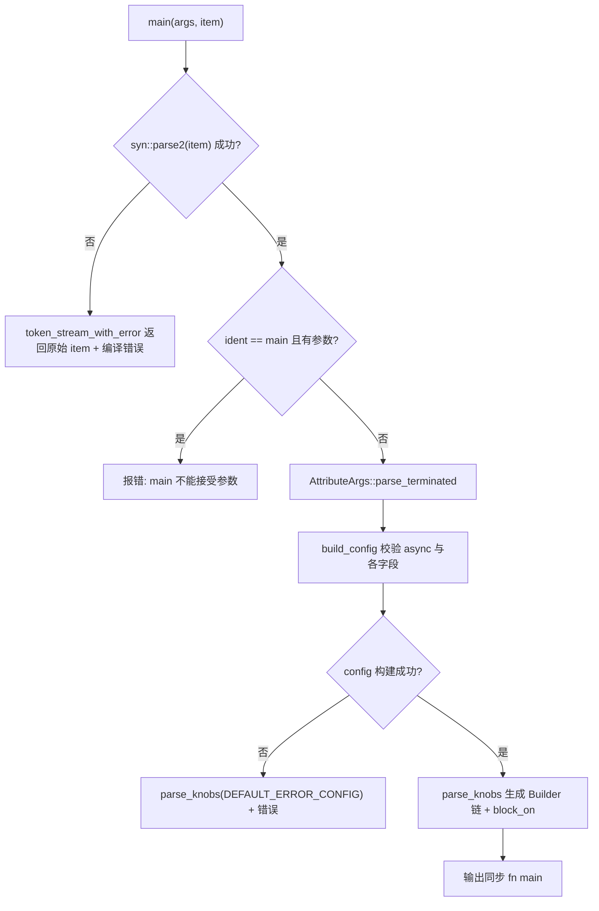
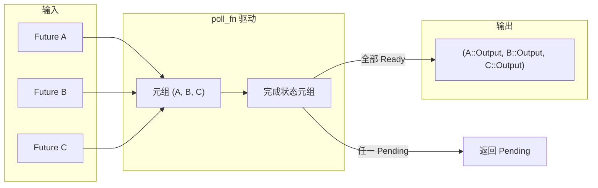

# Глава 9: Магия макросов: генерация кода за #[tokio::main], select! и join!

В предыдущей главе мы увидели,`block_on`и как блокирующий пул потоков определяет границы возможностей асинхронного runtime, причём пользователи почти никогда не пишут эти границы вручную — они пишут`#[tokio::main]`、`select!`、`join!`, позволяя макросу развернуть этот шаблонный код на этапе компиляции. Макросы — первый слой синтаксического сахара, который Tokio даёт пользователю, и именно там на этапе компиляции действительно генерируется runtime-код. Эта глава сосредоточена на`tokio-macros`crate и`tokio/src/macros/select.rs`, разбирает три наиболее часто используемых пути раскрытия макросов и отвечает главным образом на один вопрос: как выглядит реальная цепочка вызовов после раскрытия макроса и почему`select!`семантику cancel safety необходимо отдельно учитывать.

# 9.1 #[tokio::main]: переписывание async fn в Runtime::block_on

**Интуитивная модель**：`#[tokio::main]`Это как «договор на ремонт». Вы сдаёте черновую квартиру (`async fn main`), а он прокладывает вам водопровод и электрику (создаёт Runtime), устанавливает двери и окна (`enable_all`), а затем вносит вашу прежнюю мебель (тело функции). Без него каждый`main`пришлось бы писать вручную`Builder::new_multi_thread().enable_all().build().unwrap().block_on(...)`, и шаблонный код затопил бы бизнес-логику.

## Структуры данных и размещение в памяти

Сам макрос не создаёт runtime-структуры данных, но разобранная им конфигурация помещается в две структуры.`Configuration`— это «изменяемый аккумулятор на этапе разбора», все поля которого имеют тип`Option`, потому что параметры атрибута могут отсутствовать, повторяться или быть недопустимыми[FACT:tokio-macros/src/entry.rs:74-84]. Обратите внимание, что`worker_threads`、`start_paused`、`unhandled_panic`оба имеют`Span`— это сделано для того, чтобы при ошибке указать на строку, написанную пользователем, а не внутри макроса[FACT:tokio-macros/src/entry.rs:74-84]。`FinalConfig`же — это «неизменяемый результат после проверки»,`flavor`больше не`Option`, потому что`build()`уже использует`default_flavor`для подстраховки[FACT:tokio-macros/src/entry.rs:55-62]。

`RuntimeFlavor`имеет только три варианта:`CurrentThread`、`Threaded`、`Local` [FACT:tokio-macros/src/entry.rs:10-14]。`from_str`специально даёт дружелюбные ошибки для исторически унаследованных имён:`single_thread`подсказывает, что следует называть`current_thread`，`basic_scheduler`подсказывает, что имя изменено,`threaded_scheduler`подсказывает, что имя изменено на[FACT:tokio-macros/src/entry.rs:17-27]. Это типичный дизайн макроса как «первой точки контакта с пользователем»: сообщение об ошибке — это документация.

## Пошаговый процесс раскрытия

Подставим сценарий: пользователь пишет`#[tokio::main(flavor = "multi_thread", worker_threads = 4)] async fn main() { ... }`。

Первый шаг,`main`точка входа сначала разбирает item в собственный`ItemFn` [FACT:tokio-macros/src/entry.rs:577-580]. Этот`ItemFn`— не`syn::ItemFn`, а собственный парсер Tokio; причина указана в комментарии: он не хочет рекурсивно разбирать всё выражение, а выполняет «лёгкий разбор с буферизацией по token tree и разбиением по точке с запятой»[FACT:tokio-macros/src/entry.rs:720-764]. Это позволяет избежать накладных расходов на полное построение AST тела функции внутри макроса.

Второй шаг,`build_config`проверяет, присутствует ли ключевое слово`async`, и при отсутствии сообщает "the`async` keyword is missing" [FACT:tokio-macros/src/entry.rs:346-349]. Затем перебирает параметры атрибута, направляя`worker_threads`、`flavor`、`start_paused`、`crate`、`unhandled_panic`、`name`в соответствующий setter[FACT:tokio-macros/src/entry.rs:369-399]. Обратите внимание, что`core_threads`явно отклоняется с подсказкой, что имя изменено на[FACT:tokio-macros/src/entry.rs:379-382]。

Третий шаг,`Configuration::build`выполняет проверку согласованности между полями. Здесь есть три ключевых ограничения:`worker_threads`допускает только`multi_thread` [FACT:tokio-macros/src/entry.rs:197-217]；`start_paused`допускает только`current_thread`/`local` [FACT:tokio-macros/src/entry.rs:219-229]；`unhandled_panic`также допускает только`current_thread`/`local` [FACT:tokio-macros/src/entry.rs:231-241]. Если пользователь выбрал`multi_thread`, но`rt-multi-thread`feature не включён, сообщение об ошибке будет различаться в зависимости от того, указан ли flavor явно[FACT:tokio-macros/src/entry.rs:209-216]。

Четвёртый шаг,`parse_knobs`генерирует код. Сначала он стирает`asyncness` [FACT:tokio-macros/src/entry.rs:441], затем в зависимости от flavor выбирает начальную точку builder:`CurrentThread`/`Local`использует`Builder::new_current_thread()`，`Threaded`использует`Builder::new_multi_thread()` [FACT:tokio-macros/src/entry.rs:468-477]。`Local`особенность в том, что вызов build является`build_local(Default::default())`, а не`build()` [FACT:tokio-macros/src/entry.rs:479-483]. Затем по мере необходимости цепочно добавляет`.worker_threads(#v)`、`.start_paused(#v)`、`.unhandled_panic(...)`、`.name(#v)` [FACT:tokio-macros/src/entry.rs:485-497]。

Пятый шаг — генерация окончательного тела функции. В основе лежит`last_block`：`return #rt.enable_all().#build.expect("Failed building the Runtime").block_on(body)` [FACT:tokio-macros/src/entry.rs:509-522]. Обратите внимание на явный`return`, комментарий указывает на tokio-rs/tokio#4636, это сделано для исправления проблемы вывода типов[FACT:tokio-macros/src/entry.rs:508]。

Шестой шаг — тело функции оборачивается в`async #body`и проходит проверку типов. На не-test пути, если возвращаемый тип не`!`и не содержит`impl Trait`, вставляется`if false { let _: &dyn Future<Output = #output_type> = &body; }`для проверки на этапе компиляции[FACT:tokio-macros/src/entry.rs:551-571]. На test-пути используется`pin!`Закрепить body на стеке и преобразовать в`Pin<&mut dyn Future>`, комментарий объясняет, что это делается для уменьшения`block_on`затрат на компиляцию при мономорфизации обобщений[FACT:tokio-macros/src/entry.rs:526-548]。



## Размышления о дизайне и подводные камни в продакшене

`main`и`test`совместно используют`parse_knobs`, но flavor по умолчанию различается:`test`по умолчанию`CurrentThread`，`main`по умолчанию`Threaded` [FACT:tokio-macros/src/entry.rs:91-94]. Это объясняет, почему`#[tokio::test]`по умолчанию однопоточный — тестам обычно не нужны многоядерные процессоры, и в однопоточном режиме легче воспроизвести проблему.

Легко упускаемый подводный камень: после раскрытия макроса каждый вызов функции создаёт новый Runtime. Документация явно предупреждает, что если функция вызывается часто, следует использовать Builder для переиспользования Runtime[FACT:tokio-macros/src/lib.rs:31-35]. Использование`#[tokio::main]`на обычной функции допустимо, но каждый вызов оплачивает стоимость создания Runtime.

Другой подводный камень —`crate`переименование. Когда пользователь`use tokio as tokio1`, сгенерированный внутри макроса по умолчанию`tokio::runtime::Builder`не сможет найти путь, необходимо явно`crate = "tokio1"` [FACT:tokio-macros/src/lib.rs:239-264]。`parse_knobs`в`crate_path`значение по умолчанию —`Ident::new("tokio", ...)` [FACT:tokio-macros/src/entry.rs:456-462], и именно это является источником ошибок в сценариях переименования.

# 9.2 select!: многовариантный опрос, битовая маска и случайная справедливость

**Интуитивная модель**：`select!`похож на «официанта, который одновременно следит за несколькими окнами выдачи заказов». Из какого окна блюдо появится первым, то он и заберёт, а очереди в остальных окнах аннулируются. Без него пользователю пришлось бы вручную писать`poll_fn`чтобы запихнуть несколько Future в кортеж и опрашивать их по одному, а также самостоятельно обрабатывать логику «после готовности одной ветки остальные ветки должны быть отброшены».

## Структура данных и размещение в памяти

`select!`после раскрытия генерирует локальный модуль`__tokio_select_util`, внутри которого есть перечисление`Out`и псевдоним типа`Mask` [FACT:tokio/src/macros/select.rs:615-619]。`Out`имена вариантов —`_0`、`_1`……по одному на каждую ветку, плюс`Disabled`обозначающий, что все ветки недействительны[FACT:tokio-macros/src/select.rs:33-39]。`Mask`базовый тип динамически выбирается по количеству веток: ≤8 используется`u8`, ≤16 используется`u16`, ≤32 используется`u32`, ≤64 используется`u64`, более 64 — сразу panic[FACT:tokio-macros/src/select.rs:17-31]. Эта битовая маска —`select!`ключевое состояние: если i-й бит равен 1, значит i-я ветка отключена.

Все Future сохраняются в кортеж`futures`, каждый элемент сначала проходит через`IntoFuture::into_future`преобразование[FACT:tokio/src/macros/select.rs:654-656]. Обратите внимание, что здесь сначала конструируется`futures_init`а затем поочерёдно`into_future`, комментарий объясняет, что это делается для использования продления времени жизни временных значений[FACT:tokio/src/macros/select.rs:641-646]. Затем`let mut futures = &mut futures;`понижает кортеж до изменяемой ссылки, чтобы избежать`poll_fn`захвата владения замыканием[FACT:tokio/src/macros/select.rs:658-662]。

## Пошаговый процесс опроса

Подставим сценарий:`select! { v = stream1.next() => ..., v = stream2.next() => ..., else => break }`。

Первый шаг — сопоставление правил входа макроса. Если есть префикс`biased;`,`start=0` [FACT:tokio/src/macros/select.rs:801-803]; иначе`start`— это случайное выражение`thread_rng_n(BRANCHES)` [FACT:tokio/src/macros/select.rs:805-809]. Это и есть источник справедливости, о котором говорит документация: «по умолчанию случайно выбирается ветка для первой проверки»[FACT:tokio/src/macros/select.rs:61-65]。

Второй шаг — нормализация. tt-muncher приводит каждую ветку к форме`(skip) pat = fut, if cond => handler,`,`skip`— это последовательность`_`, длина которой равна количеству branch перед данной веткой[FACT:tokio/src/macros/select.rs:770-793]。`skip`используется как для генерации доступа к полям кортежа`futures_init.$($skip)*`, так и для`count!`вычисления индекса ветки.

Третий шаг — вычисление предусловий. Для каждого`if $c`ветки, если false, то`disabled |= 1 << index` [FACT:tokio/src/macros/select.rs:631-636]. Обратите внимание: даже если ветка отключена, её`$fut`выражение всё равно вычисляется, просто не будет опрошено[FACT:tokio/src/macros/select.rs:39-41]。

Четвёртый шаг — вход в замыкание`poll_fn`. Сначала проверяется бюджет кооперации:`ready!(poll_budget_available(cx))`, при исчерпании бюджета сразу возвращается`Pending` [FACT:tokio/src/macros/select.rs:664-667]. Это гарантирует, что`select!`не монополизирует worker.

Пятый шаг — цикл`for i in 0..BRANCHES`，`branch = (start + i) % BRANCHES` [FACT:tokio/src/macros/select.rs:680-685]. Для каждой branch: сначала проверяется`disabled & mask == mask`, если отключена, то`continue` [FACT:tokio/src/macros/select.rs:694-699]; иначе из кортежа извлекается соответствующий Future и оборачивается в`Pin::new_unchecked`(безопасность зависит от того, что Future хранится на стеке и не перемещается)[FACT:tokio/src/macros/select.rs:701-707]; выполняется poll,`Ready(out)`тогда сначала`disabled |= mask`затем сопоставление с шаблоном[FACT:tokio/src/macros/select.rs:710-730]。

Шестой шаг — сопоставление с шаблоном. Если`out`совпадает с`$bind`, возвращается`Poll::Ready(Out::_i(out))` [FACT:tokio/src/macros/select.rs:727-733]; если не совпадает,`continue`продолжается опрос других веток — именно это документация называет в шаге 5: «при несовпадении шаблона текущая ветка отключается»[FACT:tokio/src/macros/select.rs:44-47]。

Седьмой шаг — завершение цикла. Если`is_pending`истинно, возвращается`Pending`, иначе все ветки недействительны, возвращается`Out::Disabled` [FACT:tokio/src/macros/select.rs:740-745]. Внешний`match output`отображает`Out::_i`на соответствующий handler,`Disabled`отображается на`else`выражение[FACT:tokio/src/macros/select.rs:749-755]。

```mermaid
flowchart TD
    start["poll_fn 闭包被调用"] --> budget{"poll_budget_available(cx)?"}
    budget -->|否| pending_budget["返回 Pending"]
    budget -->|是| init["is_pending = false; start = $start"]
    init --> loop{"i |否| check_pending{"is_pending?"}
    check_pending -->|是| pending["返回 Pending"]
    check_pending -->|否| disabled_out["返回 Out::Disabled"]
    loop -->|是| branch["branch = (start+i) % BRANCHES"]
    branch --> is_disabled{"disabled & mask == mask?"}
    is_disabled -->|是| next_i["i += 1"]
    is_disabled -->|否| poll_fut["Pin::new_unchecked(fut).poll(cx)"]
    poll_fut --> poll_res{"Poll 结果?"}
    poll_res -->|Pending| set_pending["is_pending = true; i += 1"]
    poll_res -->|Ready| disable["disabled |= mask"]
    disable --> pat_match{"out 匹配 $bind?"}
    pat_match -->|否| next_i
    pat_match -->|是| ready_out["返回 Out::_i(out)"]
    next_i --> loop
    set_pending --> loop
```

## Размышления о дизайне и подводные камни в продакшене

**Почему используется битовая маска, а не`Vec<bool>`？**битовая маска — это одно целое число на стеке, без выделения в куче, и`disabled |= mask`— это одна инструкция. Для`select!`на горячем пути это позволяет избежать обращения к куче на каждой итерации.

**Почему при несовпадении шаблона ветка отключается?**Это ключевое отличие`select!`от «простого race». Рассмотрим`Some(v) = stream.next() => ...`, если`stream.next()`возвращает`None`(конец потока), шаблон не совпадает, эта ветка навсегда отключается, что позволяет избежать бесконечного опроса завершённого потока. Пример из документации как раз опирается на эту семантику для сбора двух потоков до их завершения[FACT:tokio/src/macros/select.rs:198-223]。

**Истинное значение cancel safety**：`select!`Как только одна ветка готова, Future остальных веток будут drop. Если drop-аемый Future уже потребил данные, но ещё не вернул результат, данные теряются. Документация явно перечисляет`read_exact`、`read_to_end`、`write_all`как не cancel safe[FACT:tokio/src/macros/select.rs:119-124], а`Mutex::lock`、`Semaphore::acquire`из-за справедливости очереди при отмене теряет позицию в очереди[FACT:tokio/src/macros/select.rs:126-133]. Метод определения: найти`.await`точку, если перезапуск функции в`.await`всё ещё корректен, то cancel safe[FACT:tokio/src/macros/select.rs:135-139]。

**`if`Ловушка гонки в предусловиях**: документация приводит классический пример ошибки — использование`if !sleep.is_elapsed()`для защиты ветки`sleep`, но`is_elapsed()`может стать true между проверкой`while`и`select!`, что приводит к пропуску таймаута[FACT:tokio/src/macros/select.rs:336-376]. Правильный вариант — убрать`if`, позволить ветке`sleep`всегда участвовать в опросе, а после таймаута`break` [FACT:tokio/src/macros/select.rs:378-405]。

**`biased;`стоимость**: случайный RNG имеет затраты CPU, и в некоторых сценариях требуется детерминированный порядок опроса[FACT:tokio/src/macros/select.rs:67-74]. Но`biased;`перекладывает ответственность за справедливость на пользователя: если одна ветка всегда готова, последующие ветки будут голодать[FACT:tokio/src/macros/select.rs:75-81]。

# 9.3 join! и инженерные ограничения раскрытия макросов

**Интуитивная модель**：`join!`похож на «одновременное ожидание прибытия всех посылок». Он, в отличие от`select!`, не отменяет остальные при первой готовности, а агрегирует`Ready`значения всех Future в кортеж. Без него пользователю пришлось бы вручную писать`poll_fn`для поддержания состояния завершения каждого Future.

## Структура данных и размещение в памяти

`join!`раскрытие также основано на хранении Future в кортеже, но состояние — не битовая маска, а кортеж «завершённых значений». После завершения каждого Future его значение извлекается и сохраняется в результирующий кортеж, а соответствующий слот помечается как завершённый. В отличие от`select!`,`join!`не выполняет drop незавершённых Future — он должен дождаться завершения всех Future, прежде чем вернуть результат.

## Пошаговый процесс

`join!`логика опроса разделяет с`select!`каркас «кортеж хранит Future +`poll_fn`управляет», но семантика противоположна:`select!`— «возврат при готовности любого»,`join!`— «возврат только при готовности всех». На каждой итерации poll перебираются все незавершённые Future; если любой возвращает`Pending`, то весь`Pending`; если все`Ready`, то агрегированный возврат.



## Размышления о дизайне и подводные камни в продакшене

`join!`семантика безопасности отмены отличается от`select!`:`join!`при drop все незавершённые Future также будут drop'нуты, что тоже может привести к потере данных. Но поскольку`join!`не отменяет активно ни одну из ветвей, он не ведёт себя как`select!`— «отмена этой ветви из-за готовности другой ветви». Реальный риск заключается в том, что`join!`целиком отменяется внешним`select!`или таймаутом.

`join!`и`try_join!`различие заслуживает внимания:`try_join!`немедленно возвращает управление, когда любой Future возвращает`Err`, отменяя остальные Future, поэтому он наследует`select!`риск безопасности отмены.

# Размышления о дизайне

**Границы макроса как генератора кода на этапе компиляции**。`#[tokio::main]`проверка конфигурации выполняется на этапе компиляции; недопустимые комбинации (например,`multi_thread` + `start_paused`) приводят к ошибке компиляции, а не к panic во время выполнения. Это ключевое преимущество макроса перед Builder: ошибки выявляются раньше.

**Гибридная архитектура: декларативный макрос + процедурный макрос**。`select!`основная часть —`macro_rules!`, но две ключевые логики делегированы процедурным макросам:`select_priv_declare_output_enum`генерирует`Out`перечисление и`Mask`тип[FACT:tokio-macros/src/lib.rs:658-660]，`select_priv_clean_pattern`очистка в шаблоне`ref`/`mut` [FACT:tokio-macros/src/lib.rs:666-668]. Почему? В комментариях объясняется: декларативным макросам сложно генерировать код, «динамически выбирающий целочисленный тип в зависимости от количества ветвей», а также сложно выполнять очистку на уровне токенов в позиции шаблона[FACT:tokio/src/macros/select.rs:577-579]。

**`clean_pattern`необходимость**。`select!`сопоставляет`out`в форме`&out`с шаблоном[FACT:tokio/src/macros/select.rs:727]; если пользователь напишет`ref v`, это превратится в`&ref v`и вызовет ошибку типа.`clean_pattern`рекурсивно удаляет`by_ref`、`mutability`, а также`Reference`шаблона`mutability` [FACT:tokio-macros/src/select.rs:68-73][FACT:tokio-macros/src/select.rs:100-103]. Это компромисс макроса между «интуицией пользователя» и «проверкой заимствований».

**Инженерная реальность ограничения в 64 ветви**。`count!`、`count_field!`、`select_variant!`три макроса вручную прописывают правила сопоставления от 0 до 64[FACT:tokio/src/macros/select.rs:821-1017][FACT:tokio/src/macros/select.rs:1021-1217][FACT:tokio/src/macros/select.rs:1221-1414]. В комментариях прямо сказано «I'm not happy about it either»[FACT:tokio/src/macros/select.rs:816-817]. Это цена того, что декларативные макросы не умеют выполнять арифметику: приходится жёстко кодировать отображение количества токенов в целое число.

# Итоги главы

# Вопросы для размышления и самопроверки к этой главе

Q1: `select!`из`disabled`битовая маска при каждом входе в`select!`повторно инициализируется в`Default::default()` [FACT:tokio/src/macros/select.rs:627]. Что произойдёт, если переместить эту строку внутрь замыкания`poll_fn`в сценарии «циклический вызов select! и несовпадение шаблона одной из ветвей»?

**Эталонный разбор**：`disabled`Если инициализировать внутри замыкания, то при каждом poll состояние будет сбрасываться, что приведёт к повторному участию в опросе ветви, отключённой в предыдущей итерации из-за несовпадения шаблона. Рассмотрим`Some(v) = stream.next() => ...`и`stream`уже завершён (возвращает`None`); после несовпадения шаблона эта ветвь должна быть навсегда отключена. Если`disabled`сбрасывается, следующий poll снова опросит этот завершённый поток; если поток не fused (то есть повторный poll после завершения может вызвать panic или вернуть неопределённое поведение), возникнет проблема. Даже если поток fused, это будет напрасной тратой CPU на повторный poll потока, который всегда возвращает`None`. В документации явно сказано «Re-entering select! due to a loop clears the disabled state»[FACT:tokio/src/macros/select.rs:37-38], что означает повторный вход в`select!`макрос (новый виток цикла), а не многократный poll внутри одного`select!`.`disabled`должен инициализироваться вне замыкания, чтобы сохранять состояние между несколькими poll в рамках одного вызова`select!`.

Q2: `select!`после poll до`Ready(out)`сначала выполняет`disabled |= mask`, а затем сопоставляет с шаблоном[FACT:tokio/src/macros/select.rs:720-730]. Что произойдёт, если убрать`disabled |= mask`, в сценарии, когда шаблон не совпадает и этот Future при каждом poll немедленно возвращает`Ready`?

**Эталонный разбор**: после удаления`disabled |= mask`, если`out`не совпадает с`$bind`, код переходит к`continue`и продолжает опрашивать другие ветви. Но при следующем вызове`poll_fn`(например, после того как другая ветвь вернула`Pending`и произошёл повторный poll) эта ветвь всё ещё не отключена и будет опрошена снова. Если этот Future при каждом poll немедленно возвращает`Ready`и значение не совпадает с шаблоном, возникает livelock: «poll -> Ready -> несовпадение -> continue -> другие ветви Pending -> возврат Pending -> снова poll -> снова Ready -> ...», CPU простаивает вхолостую.`disabled |= mask`устанавливается сразу после`Ready`, гарантируя, что даже при несовпадении шаблона эта ветвь не будет опрошена повторно. Обратите внимание, что установка происходит до сопоставления с шаблоном, поэтому оба случая — «Ready, но шаблон не совпадает» и «Ready и шаблон совпадает» — отключают эту ветвь: первый предотвращает livelock, второй — повторное потребление.

Q3: `parse_knobs`в не-test пути вставляется`if false { let _: &dyn Future<Output = #output_type> = &body; }`для проверки типов[FACT:tokio-macros/src/entry.rs:557-561], но для типов, возвращающих`!`или содержащих`impl Trait`, проверка пропускается[FACT:tokio-macros/src/entry.rs:551-556]. Почему`impl Trait`нужно пропускать? Что произойдёт при принудительной проверке?

**Эталонный разбор**：`impl Trait`в позиции возврата — «непрозрачный тип»; компилятор не позволяет привести его к`&dyn Future<Output = impl Trait>`, поскольку`dyn`требует конкретного типа, а`impl Trait`конкретный тип не виден за пределами функции. Если принудительно вставить проверку, возникнет ошибка «the size for values of type`impl Future`cannot be known at compilation time» или «cannot be made into an object». Возвращаемый`!`тип аналогично:`!`можно привести к любому типу, но`&dyn Future<Output = !>`сам по себе`Output = !`может вызвать проблему с нестабильной особенностью never type. Цена пропуска проверки: если пользователь написал`async fn main() -> impl Trait`но фактический возвращаемый тип не соответствует`impl Trait`ошибка проявится только в`block_on`и сообщение об ошибке может быть менее ясным, чем при явной проверке. Это компромисс между «полнотой проверок на этапе компиляции» и «ограничениями системы типов».

Макрос берёт на себя шаблонный код и проверки на этапе компиляции, но генерирует всё те же обычные Future и вызовы`poll`В следующей главе мы покинем мир макросов на этапе компиляции и перейдём на уровень абстракции I/O времени выполнения, чтобы посмотреть, как`AsyncRead`/`AsyncWrite`разбивает поток байтов на кадры и как`Framed`фреймворк кодеков корректно работает в условиях ограничений безопасности отмены`select!`

`#[tokio::main]`по сути представляет собой «разбор конфигурации + генерацию цепочки Builder +`block_on`обёртку», проверка конфигурации выполняется на этапе компиляции, flavor определяет начальную точку builder и метод build.`select!`В основе лежит «хранение Future в кортеже + битовая маска для отметки отключённых + случайная начальная точка для справедливости»: при несовпадении шаблона ветвь отключается, безопасность отмены зависит от того, можно ли перезапустить отброшенный Future в`.await``join!`и`select!`разделяют общий каркас, но имеют противоположную семантику: первый ждёт завершения всех, второй возвращается при готовности любого. Все три вместе демонстрируют ключевой компромисс в дизайне макросов Tokio: шаблонный код и проверки на этапе компиляции передаются макросу, а сложность семантики времени выполнения (особенно безопасность отмены) остаётся на явное понимание пользователя. Поняв, как макросы генерируют код времени выполнения, естественно задаться вопросом: какие абстракции предоставляет Tokio, когда этот код действительно начинает читать и записывать потоки байтов? В главе 10 мы разберём`AsyncRead`/`AsyncWrite`и фреймворк кодеков, посмотрим, как`BufReader`/`BufWriter`сокращает системные вызовы,`copy_bidirectional`управляет двунаправленной передачей,`Framed`разбивает поток байтов на кадры, и тем самым ответим на вопрос «где проходят границы абстракции асинхронного I/O».
