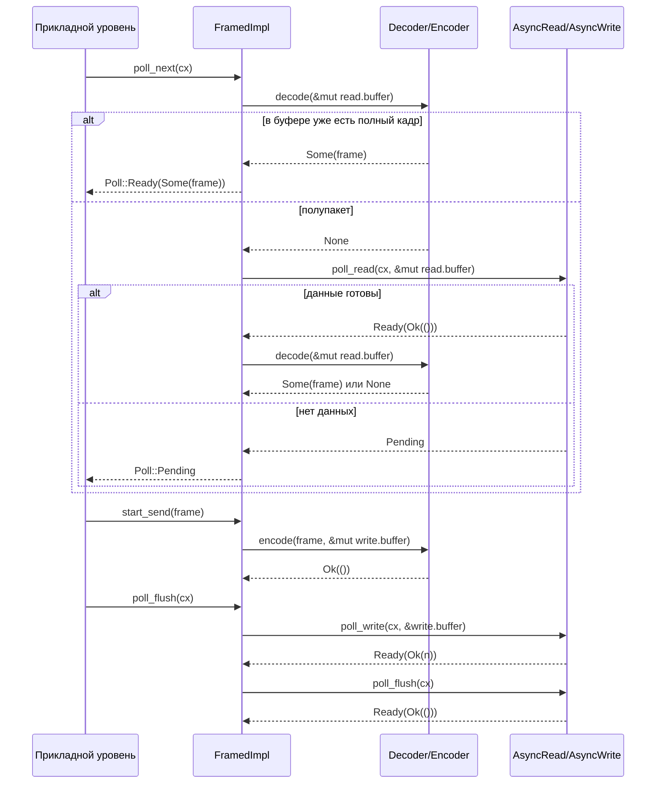

# Глава 10: Абстракции потокового I/O: AsyncRead, AsyncWrite и фреймворк кодеков

В предыдущей главе мы разобрали процесс раскрытия tokio-macros и увидели, как #[tokio::main], select!, join! берут на себя шаблонный код и проверки на этапе компиляции. Но макросы всё равно генерируют обычные Future и вызовы poll — когда эти Future действительно начинают читать и записывать байты, Tokio предоставляет лишь две низкоуровневые абстракции-трейта: AsyncRead и AsyncWrite. Их проблема в том, что они «слишком низкоуровневые»: один poll_read гарантирует лишь «прочитано сколько-то байтов», но не «прочитано целое сообщение». А подавляющее большинство протоколов (HTTP, Redis, gRPC, пользовательские RPC) ориентированы на «кадры», а не на «поток байтов». Ключевой вопрос этой главы: где следует провести границу абстракции асинхронного I/O? Ответ Tokio состоит из двух уровней: tokio::io предоставляет трейты и инструменты уровня потока байтов (BufReader/BufWriter/copy_bidirectional), а фреймворк codec в tokio-util поверх этого предоставляет адаптацию Stream/Sink уровня кадров (Framed/LengthDelimitedCodec). Поняв разделение труда этих двух уровней, вы поймёте, «почему реализации протоколов почти всегда начинаются с Framed».

# I. AsyncRead/AsyncWrite: почему нельзя напрямую переиспользовать std::io::Read

## Интуитивная модель

`std::io::Read::read`— это «блокирующее получение товара»: вы стоите у окна и ждёте, пока товар не прибудет, поток приостанавливается.`AsyncRead::poll_read`— это «получение по талону»: вы спрашиваете «готово?», если нет (`Poll::Pending`), то идёте заниматься другими делами, оставив Waker, чтобы система разбудила вас, когда товар будет готов. Без этого трейта весь асинхронный I/O пришлось бы писать вручную —`epoll`регистрация и отображение Waker — именно это делает Reactor из главы 5, а`AsyncRead`— это унифицированный фасад, который он предоставляет верхним уровням.

## Структуры данных и размещение в памяти

`AsyncRead`Определение предельно лаконично, есть только один метод:

```rust
pub trait AsyncRead {
    fn poll_read(
        self: Pin,
        cx: &mut Context,
        buf: &mut ReadBuf,
    ) -> Poll>;
}
```

[FACT:tokio/src/io/async_read.rs:44-60]

У каждого из трёх параметров есть свои причины.`self: Pin<&mut Self>`а не`&mut self`: потому что`AsyncRead`часто удерживается Future, сгенерированным`async fn`а Future после poll не может перемещаться (самоссылочность),`Pin`— это контракт, навязываемый компилятором.`cx: &mut Context<'_>`несёт Waker — это канал передачи «устройства получения заказа».`buf: &mut ReadBuf<'_>`— это обёртка Tokio над`&mut [u8]`она одновременно хранит «заполненную длину» и «неинициализированную ёмкость», избегая`std::io::Read`Та двусмысленность «возвращает количество прочитанных байт, но буфер может быть неинициализирован».

Документация явно перечисляет три семантики возврата[FACT:tokio/src/io/async_read.rs:15-32]：`Ready(Ok(()))`означает, что данные записаны`buf`, объём чтения определяется приращением длины`ReadBuf::filled`; если приращение равно 0, то это либо EOF, либо`buf.remaining() == 0`(буфер нулевой ёмкости);`Pending`означает, что в данный момент чтение невозможно, но пробуждение зарегистрировано;`Ready(Err(e))`— это ошибка нижележащего I/O. Здесь есть легко упускаемая ловушка:**«объём чтения равен 0» не равно EOF**— если вызывающий передаёт буфер нулевой ёмкости,`poll_read`немедленно вернёт`Ready(Ok(()))`, но ничего не прочитает. Если верхний уровень обработает «0 байт» как EOF, он ошибочно решит, что соединение закрыто.

## Сценарно-ориентированный Walkthrough: чтение фрагмента байтов из`&[u8]`Рассмотрим простейшую реализацию — копию

для`&[u8]`Пошаговый разбор:`AsyncRead`：

```rust
impl AsyncRead for &[u8] {
    fn poll_read(
        mut self: Pin,
        _cx: &mut Context,
        buf: &mut ReadBuf,
    ) -> Poll> {
        let amt = std::cmp::min(self.len(), buf.remaining());
        let (a, b) = self.split_at(amt);
        buf.put_slice(a);
        *self = b;
        Poll::Ready(Ok(()))
    }
}
```

[FACT:tokio/src/io/async_read.rs:98-108]

— остаточная ёмкость целевого буфера, берётся меньшее из двух значений`self.len()`Срез делится на «`buf.remaining()`, который нужно скопировать сейчас» и «оставшийся`amt`。`split_at(amt)`для чтения»`a`Копируем`b`」。`buf.put_slice(a)`в`a`и продвигаем его указатель filled.`ReadBuf`Продвигаем сам срез к оставшейся части — это ключ к тому, что`*self = b`работает как «курсор»: после каждого poll`&[u8]`указывает на непрочитанную часть. В конце возвращается`self`, потому что срез в памяти всегда «готов», не будет`Ready(Ok(()))`Обратите внимание, что`Pending`。

игнорируется: источнику данных в памяти Waker не нужен. Это контрастирует с сетевым сокетом — последний при отсутствии данных вернёт`_cx`и зарегистрирует интерес к чтению.`Pending`В реализации

`io::Cursor<T>`есть дополнительный слой проверки границ[FACT:tokio/src/io/async_read.rs:113-134]: сначала берётся`position()`, если`pos > slice.len()`(позиция за пределами) сразу возвращается`Ready(Ok(()))`без panic[FACT:tokio/src/io/async_read.rs:113-134]. Это защитный дизайн:`Cursor`position у`set_position`может быть установлен внешним

## в произвольное значение; при выходе за границы трактовка как «уже прочитано» больше соответствует семантике I/O, чем panic.

`AsyncRead`Размышления о дизайне: макрос deref и распространение Pin`Box<T>`、`&mut T`、`Pin<P>`предоставляет реализации пересылки для`deref_async_read!`. Первые две генерируют[FACT:tokio/src/io/async_read.rs:64-70]через макрос`Pin::new(&mut **self).poll_read(cx, buf)`, суть в`Pin<&mut Box<T>>`— разыменовать`Pin<&mut T>`в`Pin<P>`и затем переслать.[FACT:tokio/src/io/async_read.rs:87-93]Реализация`crate::util::pin_as_deref_mut(self)`более тонкая`Pin<&mut Pin<P>>`: она вызывает`Pin<&mut P::Target>`, проецируя`Pin`в

> **[Design Inference & Architectural Trade-offs]**
> приведёт к несовпадению типов.`Box<dyn AsyncRead>`、`&mut T`〔Проектные выводы и архитектурные компромиссы〕`poll_read`Мотивация дизайна здесь — «абстракция с нулевой стоимостью»: реализации пересылки позволяют таким типам-обёрткам, как`Pin`, не писать вручную

---

# , сохраняя при этом корректную семантику

## . Цена — каждый слой пересылки вносит один косвенный вызов, который компилятор обычно устраняет через инлайнинг.

`copy_bidirectional`II. copy_bidirectional: машина состояний двунаправленной пересылки`copy`Интуитивная модель`select!`— это «двусторонний официант»: он одновременно следит за направлениями A→B и B→A, и как только с одной стороны читаются данные, записывает их на противоположную. Без него для реализации TCP-прокси пришлось бы вручную писать два`select!`Future и комбинировать их через`copy_bidirectional`— а ограничение безопасности отмены у

## (глава 9) привело бы к потере данных, «прочитанных наполовину и отменённых».

использует явную машину состояний, чтобы сохранить промежуточные состояния «чтение-запись-закрытие», тем самым обеспечивая безопасность отмены.

```rust
enum TransferState {
    Running(CopyBuffer),
    ShuttingDown(u64),
    Done(u64),
}
```

[FACT:tokio/src/io/util/copy_bidirectional.rs:10-14]

`Running`В основе — трёхсостоянийный enum:`CopyBuffer`Копирование`ShuttingDown(u64)`содержит`Done(u64)`(внутри 8KB буфер и счётчики чтения-записи), означает «идёт перенос данных».**несёт число скопированных байт, означает «читающая сторона достигла EOF, идёт закрытие пишущей стороны».**。

`CopyBuffer`означает «закрытие завершено, зафиксировано итоговое число байт». Этот enum — ключ к безопасности отмены:`copy.rs`при drop в любой момент состояние сохраняется в enum, и следующий poll может продолжить с точки останова`DEFAULT_BUF_SIZE`происходит из[FACT:tokio/src/io/util/copy_bidirectional.rs:76-88], размер по умолчанию определяется`CopyBuffer`(8KB)

## . Каждое направление держит независимый

`copy_bidirectional_impl`, поэтому накладные расходы памяти — 16KB.`poll_fn`Сценарно-ориентированный Walkthrough: полный жизненный цикл одной двунаправленной пересылки

```rust
let mut a_to_b = TransferState::Running(a_to_b_buffer);
let mut b_to_a = TransferState::Running(b_to_a_buffer);
poll_fn(|cx| {
    let a_to_b = transfer_one_direction(cx, &mut a_to_b, a, b)?;
    let b_to_a = transfer_one_direction(cx, &mut b_to_a, b, a)?;
    let a_to_b = ready!(a_to_b);
    let b_to_a = ready!(b_to_a);
    Poll::Ready(Ok((a_to_b, b_to_a)))
})
.await
```

[FACT:tokio/src/io/util/copy_bidirectional.rs:127-151]

для объединения машин состояний двух направлений:`transfer_one_direction`Копирование`Poll`。`ready!`Обратите внимание на порядок вызовов`Pending`: сначала продвигается a→b, затем b→a, оба возвращают**Макрос при незавершённости любого направления немедленно возвращает**— но[FACT:tokio/src/io/util/copy_bidirectional.rs:143-144]состояние другого направления уже продвинуто`ready!`. Именно это подчёркивает комментарий`Done(count)`: даже если

`transfer_one_direction`вернётся досрочно, другое направление при следующем poll всё равно вернёт`loop`, прогресс не потеряется.

```rust
loop {
    match state {
        TransferState::Running(buf) => {
            let count = ready!(buf.poll_copy(cx, r.as_mut(), w.as_mut()))?;
            *state = TransferState::ShuttingDown(count);
        }
        TransferState::ShuttingDown(count) => {
            ready!(w.as_mut().poll_shutdown(cx))?;
            *state = TransferState::Done(*count);
        }
        TransferState::Done(count) => return Poll::Ready(Ok(*count)),
    }
}
```

[FACT:tokio/src/io/util/copy_bidirectional.rs:29-42]

`Running`— это`poll_copy`, продвигается по состояниям:`ShuttingDown`。`ShuttingDown`Копирование`poll_shutdown`В состоянии`Done`。`Done`вызывается

, который внутри циклически «читает блок, пишет блок», пока читающая сторона не достигнет EOF или пишущая сторона не заблокируется. При EOF возвращается общее число скопированных байт, состояние переходит в

```mermaid
flowchart TD
    start["transfer_one_direction входит в loop"] --> match_state{"текущий TransferState?"}
    match_state -->|Running| poll_copy["buf.poll_copy(cx, r, w)"]
    poll_copy --> copy_ready{"результат poll_copy?"}
    copy_ready -->|Pending| ret_pending["возврат Poll::Pendingсостояние остаётся Running"]
    copy_ready -->|Err| ret_err["возврат Poll::Ready(Err)ошибка распространяется вверх"]
    copy_ready -->|Ok(count)| to_shutdown["state = ShuttingDown(count)"]
    to_shutdown --> match_state
    match_state -->|ShuttingDown| poll_shutdown["w.poll_shutdown(cx)"]
    poll_shutdown --> shutdown_ready{"результат shutdown?"}
    shutdown_ready -->|Pending| ret_pending2["возврат Poll::Pendingсостояние остаётся ShuttingDown"]
    shutdown_ready -->|Err| ret_err
    shutdown_ready -->|Ok| to_done["state = Done(count)"]
    to_done --> match_state
    match_state -->|Done| ret_done["возврат Poll::Ready(Ok(count))"]
```

## для закрытия пишущей стороны (отправка FIN), после завершения переход в

> **[Design Inference & Architectural Trade-offs]**
> Приведённая ниже блок-схема показывает логику продвижения однонаправленной машины состояний и ветви ошибок:`transfer_one_direction`Копирование`async fn`Размышления о дизайне: почему явная машина состояний, а не async fn`CopyBuffer`〔Проектные выводы и архитектурные компромиссы〕`copy_bidirectional`Если**написать как**, компилятор сгенерирует Future, внутреннее состояние которого (`async fn`, счётчик скопированного) скрыто в сгенерированной машине состояний. При однонаправленном использовании это нормально, но`select!`нужно в`TransferState`одном и том же цикле poll`poll_fn`одновременно продвигать оба направления — если использовать два

плюс`poll_copy`, при завершении одного направления другой будет drop, его внутренний буфер и счётчик потеряются, что нарушает безопасность отмены. Явный`Err`выставляет состояние на стеке,`?`при каждом повторном входе состояние всё ещё на месте, что гарантирует «восстановление с точки останова после отмены».[FACT:tokio/src/io/util/copy_bidirectional.rs:32]В обработке ошибок[FACT:tokio/src/io/util/copy_bidirectional.rs:67-70]возвращаемый**немедленно распространяется вверх через**. Документация явно указывает`copy_bidirectional`: прерванные чтения-записи будут повторены, другие ошибки возвращаются немедленно, и

`copy_bidirectional_with_sizes`часть уже прочитанных данных может быть потеряна[FACT:tokio/src/io/util/copy_bidirectional.rs:99-125](не записана на противоположную сторону). Это момент, требующий внимания в продакшене:`poll_copy`всегда возвращает`Ready(Ok(0))`ошибочно определяется как EOF, образуя busy loop.

---

# III. Framed: нарезка байтового потока на кадры

## Интуитивная модель

`Framed`— это «колбасная машина»: выше по потоку — непрерывный поток воды (`AsyncRead`/`AsyncWrite`), ниже — нарезанные куски колбасы (`Stream<Item = Frame>` / `Sink<Frame>`）。`Decoder`отвечает за «вырезание одного сегмента из потока»,`Encoder`отвечает за «упаковку сегмента в поток». Без`Framed`каждая реализация протокола должна была бы вручную писать «управление буфером + обработка полупакетов + разделение склеенных пакетов» — именно эту повторяющуюся работу и призван устранить фреймворк codec.

## Структуры данных и размещение в памяти

`Framed`сам по себе — лишь тонкая обёртка:

```rust
pub struct Framed {
    #[pin]
    inner: FramedImpl
}
```

[FACT:tokio-util/src/codec/framed.rs:38-41]

Настоящее состояние находится в`FramedImpl`из`state: RWFrames`, включая`read: ReadFrame`и`write: WriteFrame`две части.`ReadFrame`Поля`with_capacity`видны в[FACT:tokio-util/src/codec/framed.rs:107-126]：`eof: bool`(достигнут ли EOF на стороне чтения),`is_readable: bool`(зарегистрирован ли интерес к чтению),`buffer: BytesMut`(буфер чтения),`has_errored: bool`(была ли ошибка, чтобы предотвратить повторное чтение).`WriteFrame`Поля[FACT:tokio-util/src/codec/framed.rs:119-122]：`buffer: BytesMut`(буфер записи),`backpressure_boundary: usize`(порог backpressure).

`backpressure_boundary`является ключом к механизму backpressure: когда буфер записи превышает этот порог,`poll_ready`вернёт`Pending`до тех пор, пока данные не будут сброшены, тем самым оказывая backpressure на вышестоящий`Sink`. По умолчанию равен`capacity` [FACT:tokio-util/src/codec/framed.rs:121], можно настроить через`set_backpressure_boundary`изменить[FACT:tokio-util/src/codec/framed.rs:271-273]。

## Сценарий-ориентированный Walkthrough: чтение одного кадра из socket

`Framed`из`Stream`реализация просто перенаправляет в`FramedImpl::poll_next` [FACT:tokio-util/src/codec/framed.rs:309-311]. Настоящая логика находится в`FramedImpl`(этот файл не предоставлен в данной главе, но цепочку вызовов можно вывести из интерфейса`Framed`):

1. `poll_next`сначала проверяет`read.buffer`, есть ли уже полный кадр (вызов`codec.decode`）；

2. Если`decode`возвращает`Some(frame)`, сразу выдаёт, не трогая нижележащий I/O;

3. Если возвращает`None`(полупакет), проверяет`read.eof`: если уже EOF и буфер не пуст, значит есть остаточные данные, которые невозможно декодировать, возвращает ошибку или`None`；

4. Иначе вызывает нижележащий`AsyncRead::poll_read`читает больше байтов в`read.buffer`；

5. Прочитанные байты снова пытается`decode`, цикл до тех пор, пока не будет выдан кадр или`Pending`。

Этот порядок «сначала decode, потом read» важен: он гарантирует, что**одно read может выдать несколько кадров**(склеенные пакеты), и**один кадр может охватывать несколько read**(полупакет).`is_readable`флаг предотвращает повторную регистрацию интереса к чтению — если предыдущий poll уже зарегистрирован и не готов, в этот раз сразу возвращает`Pending`без повторного вызова нижележащего.

`Sink`цепочка вызовов реализации[FACT:tokio-util/src/codec/framed.rs:315-338]：`start_send`вызывает`codec.encode(item, &mut write.buffer)`кодирует кадр в буфер записи;`poll_flush`сбрасывает`write.buffer`в нижележащий`AsyncWrite`；`poll_ready`проверяет`write.buffer.len() >= backpressure_boundary`, при превышении порога сначала flush, затем возвращает готовность.

Следующая диаграмма последовательности показывает`Framed`взаимодействие между компонентами в одном цикле «чтение кадра — запись кадра»:



## Безопасность отмены: предупреждение в документации Framed

`Framed`документация специально перечисляет семантику безопасности отмены[FACT:tokio-util/src/codec/framed.rs:23-30]：`SinkExt::send`Если в`select!`будет вытеснен другой веткой,**сообщение гарантированно не отправлено, но само сообщение теряется**— потому что`send`внутри сначала`poll_ready`затем`start_send`, если на этапе`poll_ready`будет drop,`item`уже потреблён, но не закодирован. А`StreamExt::next`безопасен для отмены: он лишь держит ссылку на нижележащий stream, drop не потеряет уже декодированные кадры.

> **[Design Inference & Architectural Trade-offs]**
> Эта асимметрия проистекает из различий путей чтения и записи: состояние пути чтения (`read.buffer`) хранится внутри`Framed`,`next`при drop лишь отказывается от действия «взять кадр», буфер не затрагивается; состояние пути записи (ожидающий отправки`item`) находится в стеке Future`send`, drop означает потерю. В production-коде, если в`select!`использовать`send`, необходимо обеспечить возможность повторной отправки сообщения или принять его потерю.

## Размышления о дизайне:`into_parts`и`map_codec`

`Framed`предоставляют`into_parts`/`from_parts`для «смены codec с сохранением буфера»[FACT:tokio-util/src/codec/framed.rs:290-298] [FACT:tokio-util/src/codec/framed.rs:155-166]。`map_codec`реализован на основе этой пары методов[FACT:tokio-util/src/codec/framed.rs:221-234]: сначала`into_parts`извлекает`io`/`codec`/`read_buf`/`write_buf`, затем`map`функция преобразует codec, наконец`from_parts`пересобирает. Этот дизайн позволяет при обновлении протокола (например, переход с открытого текста на TLS) сохранить уже буферизованные данные, избегая повторного чтения.

`FramedParts`поле`_priv: ()`из[FACT:tokio-util/src/codec/framed.rs:373-375]— это приём «неисчерпывающей структуры»: приватные поля препятствуют прямому конструированию извне, принуждая использовать`new`/`from_parts`, что позволяет в будущем добавлять поля без нарушения совместимости.

---

# IV. LengthDelimitedCodec: конечный автомат кодирования/декодирования с префиксом длины

## Интуитивная модель

`LengthDelimitedCodec`— это специализированный нож для «нарезки колбасы по длине»: он предполагает, что перед каждым кадром есть поле длины фиксированного числа байтов, сначала читается длина, затем payload. Без него реализация протокола с префиксом длины требовала бы вручную писать конечный автомат «прочитать 4 байта → разобрать длину → прочитать N байтов → цикл» — именно это внутри`DecodeState`и делает.

## Структуры данных и размещение в памяти

```rust
pub struct LengthDelimitedCodec {
    builder: Builder,
    state: DecodeState,
}

enum DecodeState {
    Head,
    Data(usize),
}
```

[FACT:tokio-util/src/codec/length_delimited.rs:451-457]

`DecodeState`— это явный конечный автомат:`Head`означает «читается поле длины»,`Data(n)`означает «длина n разобрана, читается payload». Это состояние сохраняется между вызовами`decode`, поэтому**в сценарии полупакета прогресс не теряется**。

`Builder`содержит всю конфигурацию[FACT:tokio-util/src/codec/length_delimited.rs:416-435]：`max_frame_len`(по умолчанию 8MB),`length_field_len`(по умолчанию 4 байта),`length_field_offset`(по умолчанию 0),`length_adjustment`(по умолчанию 0),`num_skip`(по умолчанию`None`, то есть`offset + len`）、`length_field_is_big_endian`(по умолчанию true).

## Сценарий-ориентированный Walkthrough: декодирование кадра с префиксом длины

`decode`— точка входа конечного автомата:

```rust
fn decode(&mut self, src: &mut BytesMut) -> io::Result> {
    let n = match self.state {
        DecodeState::Head => match self.decode_head(src)? {
            Some(n) => {
                self.state = DecodeState::Data(n);
                n
            }
            None => return Ok(None),
        },
        DecodeState::Data(n) => n,
    };

    match self.decode_data(n, src) {
        Some(data) => {
            self.state = DecodeState::Head;
            src.reserve(self.builder.num_head_bytes().saturating_sub(src.len()));
            Ok(Some(data))
        }
        None => Ok(None),
    }
}
```

[FACT:tokio-util/src/codec/length_delimited.rs:579-603]

`Head`в состоянии`decode_head`вызывает`None`. Если возвращает`Ok(None)`(недостаточно данных), сразу возвращает`Some(n)`ожидая больше данных; если возвращает`Data(n)`。`Data`, состояние переходит в`decode_data(n, src)`в состоянии`split_to(n)`напрямую берёт n. Затем вызывает`Head`: если в буфере уже есть n байтов,`None`вырезает кадр, состояние возвращается в

`decode_head`, и резервируется место для заголовка следующего кадра; иначе возвращает

```rust
let head_len = self.builder.num_head_bytes();
let field_len = self.builder.length_field_len;

if src.len()  self.builder.max_frame_len as u64 {
        return Err(io::Error::new(
            io::ErrorKind::InvalidData,
            LengthDelimitedCodecError { _priv: () },
        ));
    }

    let n = n as usize;
    let n = if self.builder.length_adjustment  n,
        None => {
            return Err(io::Error::new(
                io::ErrorKind::InvalidInput,
                "provided length would overflow after adjustment",
            ));
        }
    }
};

src.advance(self.builder.get_num_skip());
src.reserve(n.saturating_sub(src.len()));
Ok(Some(n))
```

[FACT:tokio-util/src/codec/length_delimited.rs:504-562]

— основная логика разбора:`src.len() >= head_len`Копировать`None` [FACT:tokio-util/src/codec/length_delimited.rs:499-502]Пошаговый разбор: сначала проверяет`Cursor`, если недостаточно, возвращает`src`. Использует`advance`/`get_uint`для обёртки`advance(length_field_offset)`, чтобы[FACT:tokio-util/src/codec/length_delimited.rs:517]операция не потребляла исходный буфер.`field_len`пропускает префикс заголовка[FACT:tokio-util/src/codec/length_delimited.rs:520-524]。

**. Читает в порядке байтов**значение длины`n > max_frame_len`Ключевая защита`InvalidData`: если[FACT:tokio-util/src/codec/length_delimited.rs:526-531], немедленно возвращает

ошибку`checked_sub`/`checked_add`. Это предотвращает отправку злонамеренным пиром кадра с «полем длины 4GB», вызывающего исчерпание памяти — это самая классическая поверхность DoS-атаки для протоколов с префиксом длины.[FACT:tokio-util/src/codec/length_delimited.rs:537-541]Корректировка длины использует`InvalidInput`ошибка, а не panic.`get_num_skip()`возвращает`num_skip`или значение по умолчанию`offset + len` [FACT:tokio-util/src/codec/length_delimited.rs:1070-1073], пропуская оставшуюся часть заголовка. В конце`reserve(n.saturating_sub(src.len()))`резервирует место для payload[FACT:tokio-util/src/codec/length_delimited.rs:559]— используется`saturating_sub`, потому что`src`может уже содержать часть payload.

Приведённая ниже блок-схема показывает`decode`полный путь принятия решений:

```mermaid
flowchart TD
    entry["decode(src)"] --> check_state{"self.state?"}
    check_state -->|Head| head["decode_head(src)"]
    head --> head_result{"результат?"}
    head_result -->|Ok(None)| ret_none1["возврат Ok(None)ожидание дополнительных данных"]
    head_result -->|Err| ret_err1["возврат Errпревышение длины или переполнение"]
    head_result -->|Ok(Some(n))| set_data["state = Data(n)"]
    set_data --> decode_data
    check_state -->|Data(n)| decode_data["decode_data(n, src)"]
    decode_data --> data_result{"src.len() >= n?"}
    data_result -->|нет| ret_none2["возврат Ok(None)ожидание дополнительных данных"]
    data_result -->|да| split["src.split_to(n)state = Headreserve заголовка следующего кадра"]
    split --> ret_frame["возврат Ok(Some(frame))"]
```

## Проектное размышление: обрезка max_frame_len и защита от переполнения

`Builder::adjust_max_frame_len`при создании codec обрезает`max_frame_len`до максимального значения, которое может представить поле длины[FACT:tokio-util/src/codec/length_delimited.rs:1075-1081]。`max_allowed_frame_len`вычисляет`max_length_field_value + length_adjustment` [FACT:tokio-util/src/codec/length_delimited.rs:1083-1089], где`max_length_field_value`использует`checked_shl`для обработки`length_field_len == 8`переполнения сдвига[FACT:tokio-util/src/codec/length_delimited.rs:1091-1096]. Эта обрезка предотвращает противоречивую конфигурацию, когда пользователь задаёт «поле длины 2 байта, но max_frame_len = 1MB» — 2 байта могут представить максимум 65535, после обрезки max_frame_len становится 65535.

Симметричная защита на пути кодирования:`encode`проверяет`n > max_frame_len`возвращает`InvalidInput` [FACT:tokio-util/src/codec/length_delimited.rs:607-607], корректировка длины также использует`checked_add`/`checked_sub` [FACT:tokio-util/src/codec/length_delimited.rs:620-631]. Обратите внимание, что направление корректировки при кодировании противоположно декодированию: при декодировании «прочитанная длина ± adjustment = длина payload», при кодировании «длина payload ∓ adjustment = записываемое поле длины»[FACT:tokio-util/src/codec/length_delimited.rs:620-624]。

> **[Design Inference & Architectural Trade-offs]**
> Такая симметричная схема «при декодировании прибавляем, при кодировании вычитаем» нужна для того, чтобы`length_adjustment`имел единую семантику: он представляет «разность между значением поля длины и длиной payload». Когда поле длины протокола включает заголовок (как в Example 3),`adjustment = -2`, при декодировании`n - (-2) = n + 2`получаем длину payload, при кодировании`payload - (-2) = payload + 2`записываем обратно в поле длины.

---

# Проектное размышление: три уровня абстрактной границы

Оглядываясь на эту главу, абстракция I/O в Tokio демонстрирует чёткую трёхуровневую структуру:

**Первый уровень: trait байтового потока (`AsyncRead`/`AsyncWrite`）**. Обещает только «прочитать/записать некоторые байты», не гарантирует границы кадров. Это минимальный интерфейс, который может реализовать любой источник I/O (сокет, файл, срез памяти). Цена — верхний уровень должен сам обрабатывать частичные/склеенные пакеты.

**Второй уровень: утилиты байтового потока (`BufReader`/`BufWriter`/`copy_bidirectional`）**. Предоставляет поверх trait такие общие возможности, как «уменьшение системных вызовов» и «двунаправленная пересылка».`copy_bidirectional`явный конечный автомат демонстрирует, как «безопасность отмены» реализуется на уровне утилит — состояние хранится в стеке, а не внутри Future.

**Третий уровень: адаптация кадров (`Framed`/`Decoder`/`Encoder`）**. Поднимает байтовый поток до`Stream<Frame>`/`Sink<Frame>`, позволяя реализации протокола заботиться только о «кодировании/декодировании кадров», а не об «управлении буферами».`LengthDelimitedCodec`— эталонный пример этого уровня, его`DecodeState`конечный автомат и`max_frame_len`защита — это шаблон, который должны переиспользовать все протоколы с префиксом длины.

> **[Design Inference & Architectural Trade-offs]**
> Разделение на эти три уровня не случайно: оно соответствует трём градиентам «утечки абстракции». Чем ниже уровень, тем универсальнее, но сложнее в использовании; чем выше, тем удобнее, но специализированнее. Tokio решил сделать «кадр» полноценным гражданином в`tokio-util`, а не в`tokio`ядре, потому что определение кадра зависит от протокола —`tokio`предоставляет только байтовый поток,`tokio-util`предоставляет каркас кадров, а конкретные протоколы (HTTP/Redis/gRPC) реализуют`Decoder`/`Encoder`。

---

# в своих crate

- `AsyncRead::poll_read`Итоги главы`Pin<&mut Self>` + `Context` + `ReadBuf`использует`std::io::Read::read`три параметра вместо`Ready(Ok(()))`, превращая «блокирующее ожидание» в «регистрацию Waker + возврат Pending».
- `copy_bidirectional`и при нулевом объёме чтения нужно различать EOF и буфер нулевой ёмкости.`TransferState`использует`Running`/`ShuttingDown`/`Done`трёхсостоянийное перечисление (`select!`) для сохранения промежуточного состояния, чтобы двунаправленная пересылка могла восстановиться при
- `Framed`отмене. При возникновении ошибки часть данных может быть потеряна.`AsyncRead`/`AsyncWrite`адаптирует`Stream`/`Sink`，`ReadFrame`/`WriteFrame`к`SinkExt::send`, раздельно управляя буферами чтения/записи и обратным давлением.`StreamExt::next`не безопасен при отмене (потеря сообщений),
- `LengthDelimitedCodec`безопасен при отмене.`DecodeState`（`Head`/`Data(n)`использует`max_frame_len`) конечный автомат для обработки частичных пакетов,`checked_add`/`checked_sub`защищает поле длины от DoS,

# защищает от переполнения при корректировке.

Q1: `copy_bidirectional`Вопросы для размышления и самопроверки по главе`transfer_one_direction`в`TransferState::ShuttingDown`, если заменить`ready!(w.as_mut().poll_shutdown(cx))?`ветки`*state = TransferState::Done(*count)`на прямой

**(пропуск shutdown), в каких сценариях это приведёт к невозможности корректного закрытия соединения на противоположной стороне?**：`poll_shutdown`Справочный разбор`Done`служит для отправки противоположной стороне пакета FIN, уведомляющего «у меня больше нет данных». Если пропустить его и сразу перейти к`read`, записывающая сторона не закроется, противоположная сторона будет бесконечно ждать данных, образуя «полуоткрытое соединение» — противоположная сторона может навсегда заблокироваться на`ShuttingDown`до тайм-аута. В сценарии TCP-прокси это приведёт к утечке соединений: клиент уже отключился, но соединение прокси с бэкендом всё ещё поддерживается. Наличие состояния[FACT:tokio/src/io/util/copy_bidirectional.rs:35-39]в исходном коде`poll_shutdown`как раз для того, чтобы гарантировать явное закрытие записывающей стороны после EOF. Обратите внимание, что`Pending`сам может вернуть`ready!`(например, при заполненном буфере отправки), поэтому нужно использовать

Q2: `LengthDelimitedCodec::decode_head`для ожидания, а не игнорировать.`if n > self.builder.max_frame_len as u64`в[FACT:tokio-util/src/codec/length_delimited.rs:526-531], если убрать проверку`0xFFFFFFFF`, какие последствия вызовет отправка злонамеренным клиентом заголовка кадра с полем длины`length_adjustment`(4GB)? Почему эта проверка должна быть до

**?**Справочный разбор`n`: после удаления проверки`usize`будет преобразовано в`decode_data`。`decode_data`и передано в`src.len() < n`при проверке`None`возвращает`decode_head`, но`src.reserve(n.saturating_sub(src.len()))` [FACT:tokio-util/src/codec/length_delimited.rs:559]в конце`length_adjustment`попытается зарезервировать 4GB памяти, что приведёт к OOM или panic при неудачном выделении. Проверка должна быть до`length_adjustment`, потому что`-2`может быть отрицательным (например,`0xFFFFFFFF - 2`), если сначала скорректировать, а потом проверять,`checked_sub`всё ещё близко к 4GB, проверка становится фиктивной; к тому же отрицательная корректировка может заставить

Итак, мы разобрались с двумя уровнями абстракции Tokio между байтовыми потоками и кадрами сообщений: tokio::io отвечает за перемещение байтов, а фреймворк codec из tokio-util — за разбиение на кадры и кодирование/декодирование. Framed стал отправной точкой для реализации протоколов именно потому, что он инкапсулирует часто встречающуюся потребность «прочитать одно полное сообщение» в переиспользуемую адаптацию Stream/Sink. Но кадр — это лишь контейнер данных; когда протоколу требуется работать с динамическим набором задач, структурированной отменой или более сложными потоковыми композициями, одного Framed недостаточно. В следующей главе мы перейдём к механизмам расширения tokio-stream и tokio-util и посмотрим, как комбинаторы StreamExt, StreamMap/JoinSet/TaskTracker и CancellationToken переиспользуют нижележащие Waker и механизмы планирования, предоставляя более высокоуровневые инструменты для асинхронной итерации и управления задачами.
