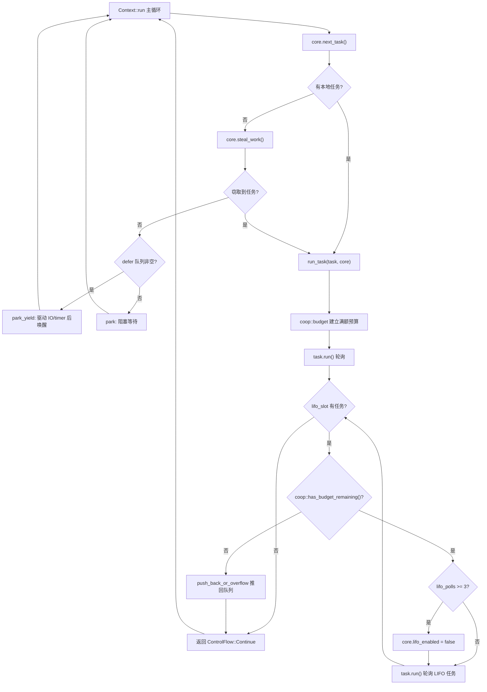

# Глава 12: Кооперативное планирование и бюджет: как механизм coop предотвращает голодание планировщика задачами

В предыдущей главе мы увидели, как tokio-stream и tokio-util повторно используют низкоуровневые Waker и механизм планирования для расширения базовых возможностей. Но сколько бы комбинаторов ни было создано, основное противоречие асинхронного рантайма остаётся: планировщик должен справедливо распределять процессорное время между задачами, а сами задачи не являются вытесняемыми — как только poll некоторого Future начинает выполняться, планировщик не может прервать его извне. Если задача в одном poll обрабатывает в цикле сто тысяч сообщений или в цикле многократно ожидает Future, который всегда готов, она монополизирует рабочий поток, и другие задачи на том же потоке никогда не получат возможности быть опрошенными. Это и есть классическая проблема «голодания планировщика задачами». Решение Tokio — не вытеснение, а кооперация: каждой задаче на один цикл планирования выделяется ограниченный бюджет, ресурсные операции расходуют бюджет, и после его исчерпания задача обязана добровольно уступить. В этой главе мы глубоко разберём реализацию этого механизма coop.

# 12.1 Носитель бюджета: локальное хранилище потока и структура Budget

> **[Design Inference & Architectural Trade-offs]**
> Если представить планировщик единственным официантом в ресторане, а задачи — постоянно заказывающими блюда посетителями, то бюджет coop — это правило «каждый посетитель может заказать не более N блюд»: официанту не нужно силой прерывать посетителя, достаточно после N блюд сказать «отдохните немного, я обслужу следующего». Без этого правила один болтливый посетитель парализует весь ресторан.

Бюджет должен удовлетворять двум ограничениям: во-первых, он должен быть доступен из стека вызовов`poll`любой глубины без передачи параметров через все уровни; во-вторых, он должен различать «находимся ли мы сейчас внутри рантайма Tokio» — вызов вне рантайма`block_on`не должен ограничиваться бюджетом. Tokio выбрал для хранения бюджета**локальное хранилище потока (TLS)**и управляет им через модуль`context`.

Основной тип бюджета —`coop::Budget`. Хотя фрагмент исходного кода в этой главе не приводит полное определение`coop.rs`, из точек использования`worker.rs`можно восстановить его интерфейсный контракт:

[FACT:tokio/src/runtime/scheduler/multi_thread/worker.rs:695-795]

```rust
coop::budget(|| {
    // ... 轮询任务 ...
    task.run();
    // ...
    loop {
        // ...
        if !coop::has_budget_remaining() {
            // 预算耗尽，把 LIFO 任务推回队列
            core.run_queue.push_back_or_overflow(task, ...);
            return ControlFlow::Continue(core);
        }
        // ...
    }
})
```

Здесь появляются три ключевых API:`coop::budget(closure)`создаёт область действия бюджета,`coop::has_budget_remaining()`запрашивает оставшийся бюджет, а также упомянутые далее`coop::stop()`и`coop::set()`。`budget`Семантика такова: при входе в замыкание бюджет текущего потока сбрасывается до полного значения (по умолчанию 128), во время выполнения замыкания все ресурсные операции совместно используют этот лимит, а при выходе из замыкания восстанавливается внешний бюджет.

> **[Design Inference & Architectural Trade-offs]**
> Значение бюджета 128 — эмпирическое: оно достаточно велико, чтобы нормальный цикл обработки сообщений (например, обработка нескольких десятков сообщений за один poll) не вызывал частых уступок; и достаточно мало, чтобы вышедший из-под контроля цикл мог выполнить не более 128 ресурсных операций, после чего обязан уступить, удерживая задержку в приемлемых пределах.

`Budget`В TLS обычно существует в форме`Cell<Option<Budget>>`.`Option`Внешняя семантика`None`означает «находится ли текущий поток в контексте рантайма Tokio»:`block_on`означает, что мы не внутри рантайма (например, вызов вне рантайма

# ), и тогда все проверки бюджета пропускаются. 12.2 Точки расходования бюджета: как ресурсные операции его вычитают

Бюджет не расходуется сам по себе, только**ресурсные операции**его уменьшают. Под ресурсными операциями понимаются API, которые могут вызываться в бесконечном цикле и взаимодействуют с внешним миром —`send`/`recv`у channel, чтение/запись I/O,`yield_now`и т. д. Возьмём`mpsc::Sender::reserve`— это общая точка входа для всех путей отправки:

[FACT:tokio/src/sync/mpsc/bounded.rs:1272-1311]

```rust
async fn reserve_inner(&self, n: usize) -> Result> {
    crate::trace::async_trace_leaf().await;

    if n > self.max_capacity() {
        return Err(SendError(()));
    }
    // ... WakeReceiverOnDrop guard ...
    let guard = WakeReceiverOnDrop { chan: &self.chan };
    let result = self.chan.semaphore().semaphore.acquire(n).await;
    // ...
}
```

`reserve_inner`Перед фактическим получением разрешения семафора`crate::trace::async_trace_leaf()`проходит через`async_trace_leaf`. Этот вызов, выглядящий как обычная трассировка, на самом деле является одной из точек привязки вычитания бюджета.`coop::poll_proceed`Внутри вызывается функция вроде`Proceed`: если бюджета достаточно, вычитается 1 и возвращается`Pending`; если бюджет исчерпан, регистрируется действие «уступки» — Waker текущей задачи передаётся планировщику и возвращается

, что заставляет задачу досрочно завершить этот poll.**В этом и заключается изящество coop:`Pending`**исчерпание бюджета — не ошибка, а маскировка «уступки» под обычный`Pending`. Верхний Future, увидев

`yield_now`, естественно возвращается, планировщик ставит задачу обратно в очередь, и при следующем планировании бюджет уже сброшен, а задача продолжает с места прерывания. Весь процесс полностью прозрачен для бизнес-кода.**— самое прямое воплощение механизма бюджета: он не расходует бюджет, а**：

[FACT:tokio/src/task/yield_now.rs:38-60]

```rust
pub async fn yield_now() {
    let mut yielded = false;
    poll_fn(|cx| {
        ready!(crate::trace::trace_leaf());

        if yielded {
            return Poll::Ready(());
        }

        yielded = true;

        // Don't wake the task immediately, as that would push it right back
        // onto the run queue and it could be polled again before other tasks
        // or the IO/timer driver get a chance to run. Instead, hand the waker
        // to the scheduler, which wakes deferred tasks only after it has run
        // out of ready tasks and polled the driver. When polled from outside
        // a Tokio runtime, the waker is woken immediately.
        context::defer(cx.waker());

        Poll::Pending
    })
    .await
}
```

Копировать`context::defer(cx.waker())`Обратите внимание на строку`wake`. Здесь нет прямого**, вместо этого Waker передаётся в**очередь defer

планировщика. Почему? Комментарий в исходном коде объясняет ясно: при немедленном пробуждении задача сразу вернётся в очередь выполнения и может быть опрошена снова до того, как отработают драйверы I/O/timer, что лишает уступку смысла. Семантика очереди defer — «разбудить эти задачи после того, как текущий worker выполнит все готовые задачи и опросит драйверы».`Context`Очередь defer определена в

[FACT:tokio/src/runtime/scheduler/multi_thread/worker.rs:247-257]

```rust
pub(crate) struct Context {
    worker: Arc,
    core: RefCell>>,
    /// Tasks to wake after resource drivers are polled. This is mostly to
    /// handle yielded tasks.
    pub(crate) defer: Defer,
}
```

`defer`Копировать

[FACT:tokio/src/runtime/scheduler/multi_thread/worker.rs:613-621]

```rust
} else {
    // Wait for work
    core = if !self.defer.is_empty() {
        self.park_yield(core)
    } else {
        self.park(core)
    };
    core.stats.start_processing_scheduled_tasks();
}
```

Если очередь defer не пуста, worker вызывает`park_yield`— park с нулевым таймаутом, что запускает I/O и таймеры, а затем пробуждает задачи в defer. Это гарантирует, что «уступленная» задача будет перепланирована только после того, как драйвер отработает.

# 12.3 Создание и восстановление области бюджета: run_task и block_in_place

Область бюджета создаётся в`run_task`. При опросе каждой задачи`coop::budget`оборачивает весь процесс опроса:

[FACT:tokio/src/runtime/scheduler/multi_thread/worker.rs:691-704]

```rust
// Make the core available to the runtime context
*self.core.borrow_mut() = Some(core);

// Run the task
coop::budget(|| {
    // ...
    task.run();
    // ...
})
```

`coop::budget`При входе устанавливает бюджет в TLS на полный, при выходе восстанавливает. Это означает, что**каждая задача при каждом опросе получает совершенно новый бюджет**. Внутри задачи, независимо от того, сколько раз`await`выполнялись операции с ресурсами, если за один`poll`потребление превысило 128, задача будет принудительно уступлена.

Но здесь есть тонкая проблема: задачи в LIFO slot опрашиваются внутри**того же самого`budget`замыкания**. Посмотрим на цикл`run_task`:

[FACT:tokio/src/runtime/scheduler/multi_thread/worker.rs:709-750]

```rust
let mut lifo_polls = 0;

// As long as there is budget remaining and a task exists in the
// `lifo_slot`, then keep running.
loop {
    let mut core = match self.core.borrow_mut().take() {
        Some(core) => core,
        None => {
            return ControlFlow::Break(());
        }
    };

    let task = match core.lifo_slot.take() {
        Some(task) => task,
        None => {
            self.reset_lifo_enabled(&mut core);
            core.stats.end_poll();
            return ControlFlow::Continue(core);
        }
    };

    if !coop::has_budget_remaining() {
        core.stats.end_poll();
        // Not enough budget left to run the LIFO task, push it to
        // the back of the queue and return.
        core.run_queue.push_back_or_overflow(task, ...);
        debug_assert!(core.lifo_enabled);
        return ControlFlow::Continue(core);
    }
    // ...
}
```

Ключевой момент: задачи в LIFO slot**разделяют бюджет внешней задачи**. Комментарий в начале`run_task`гласит: «Tasks from the LIFO slot inherit the "parent"'s limits». Это намеренное решение — если бы каждая LIFO-задача сбрасывала бюджет, то в сценарии ping-pong (задача A пробуждает B, B пробуждает A) две задачи бесконечно планировали бы друг друга, бюджет никогда бы не сбрасывался, и проблема голодания сохранялась бы. Общий бюджет означает, что A и B вместе могут потребить максимум 128 операций с ресурсами, после чего обязаны уступить.

У самого LIFO slot также есть независимый ограничитель`MAX_LIFO_POLLS_PER_TICK`：

[FACT:tokio/src/runtime/scheduler/multi_thread/worker.rs:756-766]

```rust
// Disable the LIFO slot if we reach our limit
//
// In ping-ping style workloads where task A notifies task B,
// which notifies task A again, continuously prioritizing the
// LIFO slot can cause starvation as these two tasks will
// repeatedly schedule the other. To mitigate this, we limit the
// number of times the LIFO slot is prioritized.
if lifo_polls >= MAX_LIFO_POLLS_PER_TICK {
    core.lifo_enabled = false;
    super::counters::inc_lifo_capped();
}
```

`MAX_LIFO_POLLS_PER_TICK`Значение

[FACT:tokio/src/runtime/scheduler/multi_thread/worker.rs:263-263]

```rust
/// Value picked out of thin-air. Running the LIFO slot a handful of times
/// seems sufficient to benefit from locality. More than 3 times probably is
/// over-weighting. The value can be tuned in the future with data that shows
/// improvements.
const MAX_LIFO_POLLS_PER_TICK: usize = 3;
```

равно 3:**Это**вторая линия защиты

: даже если бюджет ещё не исчерпан, LIFO slot после 3 последовательных приоритетных использований будет отключён, и последующие задачи пойдут в обычную очередь. Бюджет управляет «общим объёмом операций с ресурсами», ограничитель LIFO управляет «количеством взаимных пробуждений одной и той же пары задач» — они дополняют друг друга.`block_in_place`У области бюджета в`block_in_place`есть одно важное исключение.**передаёт worker core другому потоку, текущий поток переходит в блокированное состояние. Блокирующий код не подчиняется бюджету, поэтому необходимо**приостановить

[FACT:tokio/src/runtime/scheduler/multi_thread/worker.rs:406-417]

```rust
if had_entered {
    // Unset the current task's budget. Blocking sections are not
    // constrained by task budgets.
    let _reset = Reset {
        take_core,
        budget: coop::stop(),
    };

    crate::runtime::context::exit_runtime(f)
} else {
    f()
}
```

`coop::stop()`Копировать`None`возвращает текущий бюджет и устанавливает его в`Reset`(то есть «вне runtime»),`Drop`а

[FACT:tokio/src/runtime/scheduler/multi_thread/worker.rs:374-397]

```rust
impl Drop for Reset {
    fn drop(&mut self) {
        with_current(|maybe_cx| {
            if let Some(cx) = maybe_cx {
                if self.take_core {
                    let core = cx.worker.core.take();
                    // ...
                    *cx_core = core;
                }

                // Reset the task budget as we are re-entering the
                // runtime.
                coop::set(self.budget);
            }
        });
    }
}
```

`coop::set(self.budget)`Копировать`stop()`восстанавливает ранее сохранённый`block_in_place`бюджет. Таким образом, синхронный блокирующий код внутри

не потребляет бюджет и не вызывает ложное уступление из-за исчерпания бюджета; после завершения блокировки задача продолжает выполнение с прежним остатком бюджета.



Копировать`push_back_or_overflow`На диаграмме видны два пути уступки: при исчерпании бюджета LIFO-задача возвращается в очередь (

# ), и при превышении лимита последовательных приоритетов LIFO отключается LIFO slot. Оба возвращаются в главный цикл, давая worker возможность обработать другие задачи или драйвер.

**12.4 Размышления о дизайне, восстановление после ошибок и подводные камни в продакшене**Почему используется TLS, а не явная передача параметров?`Budget`Точки проверки бюджета разбросаны в глубине различных модулей — channel, I/O, time и т.д. При явной передаче параметров каждый API должен был бы иметь дополнительный`#[thread_local]`параметр, что загрязнило бы весь публичный интерфейс. TLS делает бюджет полностью прозрачным для бизнес-кода, ценой одного обращения к TLS при каждой проверке. Tokio использует

**или платформенно-специфичный быстрый TLS, чтобы снизить эти накладные расходы.**Взаимодействие исчерпания бюджета с безопасностью отмены.`reserve_inner`Когда исчерпание бюджета приводит к тому, что`Pending`возвращает`select!`, задача может находиться в одной из ветвей`select!`. Если в этот момент другая ветвь готова,`reserve_inner`отменит текущую ветвь —`WakeReceiverOnDrop`guard в

[FACT:tokio/src/sync/mpsc/bounded.rs:1286-1299]

```rust
struct WakeReceiverOnDrop {
    chan: &'a chan::Tx,
}

impl Drop for WakeReceiverOnDrop {
    fn drop(&mut self) {
        use chan::Semaphore;

        let semaphore = self.chan.semaphore();
        if semaphore.is_closed() && semaphore.is_idle() {
            self.chan.wake_rx();
        }
    }
}
```

Копировать`Pending`Наличие этого guard показывает: вызванный бюджетом`Pending`и настоящий «нет разрешения»

**на пути отмены должны вести себя одинаково, иначе принимающая сторона может никогда не получить уведомление «channel закрыт».**Подводные камни в продакшене: скрытые задержки из-за исчерпания бюджета.`spawn`Частое явление: некоторая задача внезапно начинает обрабатывать сообщения медленнее, но загрузка CPU невысока. При диагностике легко заподозрить конкуренцию за блокировки или I/O, но на самом деле задача могла обработать более 128 сообщений за один poll, вызвав уступку по бюджету, и каждая уступка требует полного цикла «возврат в очередь → перепланирование → опрос драйвера». Если обработка сообщений сама по себе быстрая, эти накладные расходы на планирование могут занимать большую долю. Решение — разбить массовую обработку на несколько`yield_now`。

**задач или явно вставить в цикл`block_in_place`Граница между бюджетом и**.`block_in_place`Ранее мы видели, что`coop::stop()`приостанавливает бюджет. Но обратите внимание:`coop::stop()`вызывается только когда`had_entered`истинно, то есть только когда действительно находимся на worker-потоке runtime. Если`block_in_place`вызывается вне runtime,`f()`выполняется напрямую, состояние бюджета не меняется. Эта проверка ветвления выполняется в`maybe_move_runtime`:

[FACT:tokio/src/runtime/scheduler/multi_thread/worker.rs:424-464]

```rust
with_current(|maybe_cx| {
    match (
        crate::runtime::context::current_enter_context(),
        maybe_cx.is_some(),
    ) {
        (context::EnterRuntime::Entered { .. }, true) => {
            had_entered = true;
        }
        (
            context::EnterRuntime::Entered {
                allow_block_in_place,
            },
            false,
        ) => {
            if allow_block_in_place {
                had_entered = true;
                return Ok(());
            } else {
                return Err(
                    "can call blocking only when running on the multi-threaded runtime",
                );
            }
        }
        (context::EnterRuntime::NotEntered, true) => {
            return Ok(());
        }
        (context::EnterRuntime::NotEntered, false) => {
            return Ok(());
        }
    }
    // ...
})
```

Четыре комбинации соответствуют: внутри worker-потока,`block_on`вход в пул потоков`block_in_place`, вложенный

> **[Design Inference & Architectural Trade-offs]**
> **〔Проектные предположения и архитектурные компромиссы〕**Значение бюджета не конфигурируемо.`Builder`вариант. Это сделано намеренно: значение бюджета влияет на компромисс между справедливостью планирования и пропускной способностью. Если позволить пользователям произвольно его настраивать, легко получить конфигурацию, где «слишком большой бюджет приводит к голоданию» или «слишком маленький бюджет приводит к взрывным накладным расходам на планирование». Tokio решил сделать его внутренним инвариантом.

# Резюме главы

Механизм coop решает проблему справедливости невытесняющего планировщика с помощью трёхуровневого дизайна:

1. **Носитель бюджета**：`coop::Budget`хранится в TLS,`Option`внешний уровень различает нахождение внутри и вне runtime,`coop::budget`создаёт область с полным бюджетом,`coop::stop`/`coop::set`поддерживает приостановку и возобновление (`block_in_place`сценарий).

2. **Точки потребления**: ресурсные операции (отправка/получение через channel, I/O,`yield_now`) через`coop::poll_proceed`уменьшают бюджет, а при исчерпании маскируют «уступку» под`Pending`, прозрачно для бизнес-логики.

3. **Путь уступки**：`yield_now`через`context::defer`передаёт Waker в очередь defer, гарантируя, что перепланирование произойдёт только после опроса драйвера; задачи в LIFO slot разделяют бюджет родительской задачи и имеют независимое ограничение`MAX_LIFO_POLLS_PER_TICK = 3`.

Ключевое озарение этого механизма:**справедливость не требует вытеснения, достаточно лишь естественного прерывания «бесконечного цикла» после конечного числа шагов**. Бюджет — это мера такого «конечного числа шагов».

# Вопросы для размышления и самопроверки в этой главе

Q1: Если в`run_task`внутри замыкания`coop::budget`изменить цикл LIFO так, чтобы перед каждым опросом LIFO-задачи вызывался`coop::budget`для сброса бюджета, что произойдёт в сценарии ping-pong (задача A пробуждает B, B пробуждает A)? Почему исходный код выбирает разделение бюджета родительской задачи для LIFO-задач?

**Разбор ответа**: В комментариях к`run_task`явно сказано: «Tasks from the LIFO slot inherit the "parent"'s limits»[FACT:tokio/src/runtime/scheduler/multi_thread/worker.rs:679-682]. Если бы каждая LIFO-задача сбрасывала бюджет, то в сценарии ping-pong A→B→A→B каждый опрос получал бы полный бюджет, и две задачи могли бы бесконечно перепланировать друг друга, никогда не уступая из-за исчерпания бюджета. Хотя ограничение`MAX_LIFO_POLLS_PER_TICK = 3`отключит LIFO slot после 3 раз[FACT:tokio/src/runtime/scheduler/multi_thread/worker.rs:756-766], после отключения LIFO задачи пойдут в обычную очередь, и если в очереди только A и B, они всё равно будут поочерёдно планироваться, просто без приоритета LIFO. Разделяемый бюджет же ограничивает общий объём ресурсных операций: A и B вместе могут выполнить не более 128 ресурсных операций, после чего обязаны уступить, давая возможность другим задачам и драйверу. Две линии защиты дополняют друг друга, и ни одну нельзя убрать.

Q2: `yield_now`использует`context::defer(cx.waker())`вместо`cx.waker().wake_by_ref()`. Предположим,`defer`заменён на прямой`wake`, в сценарии с одним worker и множеством задач: каковы будут последствия, если задача в цикле многократно вызывает`yield_now`? Проанализируйте с учётом ветки`park_yield`главного цикла worker.

**Разбор ответа**：`yield_now`: Комментарии к[FACT:tokio/src/task/yield_now.rs:49-54]объясняют причину: прямой wake немедленно возвращает задачу в очередь выполнения, и она может быть опрошена снова до запуска драйвера I/O/timer`yield_now`. В сценарии с одним worker, если задача в цикле многократно`next_task`и каждый раз напрямую wake, главный цикл worker`park_yield`немедленно возьмёт эту задачу и опросит её снова,[FACT:tokio/src/runtime/scheduler/multi_thread/worker.rs:613-621]ветка (отвечающая за драйвер I/O и timer)`defer`никогда не будет выполнена, потому что очередь defer пуста, а в локальной очереди всегда есть задачи. В результате события I/O и timer никогда не обрабатываются, и весь runtime «имитирует жизнь» — задачи выполняются, но события внешнего мира не могут продвинуться.

Q3: `block_in_place`Очередь`coop::stop()`гарантирует, что уступившая задача будет пробуждена только после опроса драйвера, тем самым давая драйверу окно для выполнения.`None`，`Reset::drop`В`coop::set(self.budget)`устанавливает бюджет в`block_in_place`восстанавливает в`f`. Если внутри замыкания`block_in_place`снова вызвать`maybe_move_runtime`(вложенный вызов), что произойдёт с состоянием бюджета?

**Какая ветка**обрабатывает эту ситуацию?`block_in_place`Разбор ответа`maybe_move_runtime`: Вложенный`(context::EnterRuntime::NotEntered, true)`обрабатывается веткой[FACT:tokio/src/runtime/scheduler/multi_thread/worker.rs:454-458]в`return Ok(())`. Эта ветка напрямую`had_entered`, не устанавливает`block_in_place`, поэтому внешняя проверка`if had_entered`в`coop::stop()`даёт ложь, и повторный вызов`Reset`или создание нового`f()`не происходит. Комментарий поясняет: «This is a nested call to block_in_place (we already exited). All the necessary setup has already been done.» — внешний уровень уже приостановил бюджет и передал core, внутреннему остаётся лишь напрямую выполнить`coop::stop()`. Если бы внутренний уровень снова`None`, он сохранил бы бюджет, который уже является`Reset::drop`, и при восстановлении`None`мог бы восстановиться в неверное значение (

вместо исходного бюджета внешнего уровня), что привело бы к безвозвратной потере бюджета, и все последующие ресурсные операции задачи оказались бы неограниченными.
