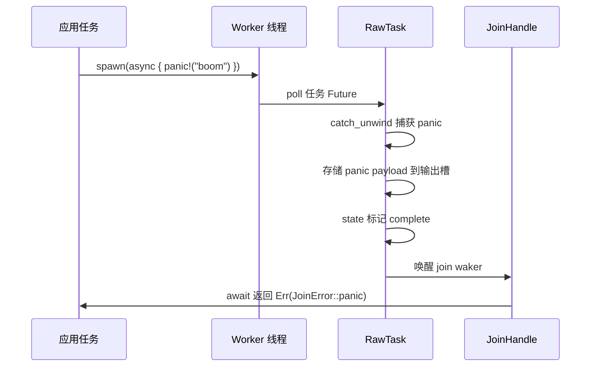
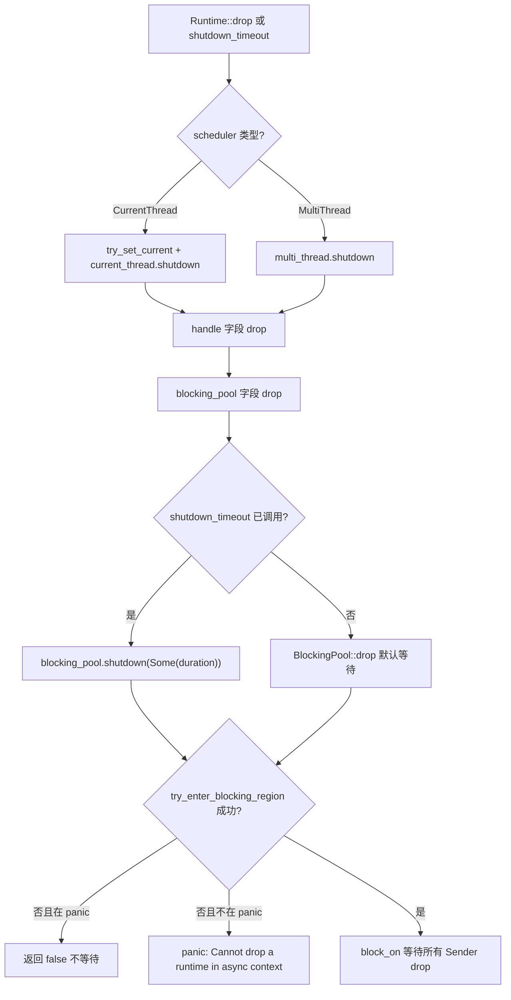
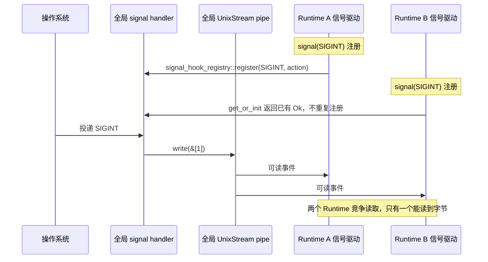

# Следующая глава: Глава 13 →

В предыдущей главе мы разобрали бюджет кооперации coop: каждая задача в течение одного цикла планирования имеет ограниченный бюджет, исчерпав который она обязана уступить, что предотвращает голодание других задач из-за одной задачи. Однако механизм бюджета решает лишь проблему «справедливого планирования». В реальной производственной среде существует ещё один класс более скрытых ловушек — безопасность отмены, распространение panic и порядок завершения. Когда select! отменяет Future, когда panic задачи перехватывается, когда Runtime начинает завершение, граничное поведение кода часто противоречит интуиции. В этой главе мы начнём с безопасности отмены и сначала посмотрим, что именно теряется у Future, подвергнутого drop.

# 13.2 Распространение panic: как JoinError перехватывает сбои

## Интуитивная модель

Panic в задаче Tokio не приводит к падению всего процесса (если только panic=abort), а перехватывается, упаковывается в`JoinError`, возвращается через`JoinHandle::await`. Это как авария на одном из рабочих мест сборочной линии: страховочная сеть ловит рабочего, но продукт утилизируется — вы получаете «отчёт об аварии», а не продукт.

## Структура данных и состояния

`JoinHandle<T>`У`Future::Output`— это`super::Result<T>`, то есть`Result<T, JoinError>` [FACT:tokio/src/runtime/task/join.rs:325]。`JoinError`имеет две формы: panic и cancelled. Пример из документации демонстрирует сценарий panic:

```rust
let join_handle = tokio::spawn(async { panic!("boom"); });
let err = join_handle.await.unwrap_err();
assert!(err.is_panic());
```

[FACT:tokio/src/runtime/task/join.rs:121-127]

Механизм перехвата panic находится в пути poll`RawTask`: при poll задачи используется`catch_unwind`для обёртки; после возникновения panic payload сохраняется в выходной слот задачи, состояние помечается как complete, затем пробуждается join waker.`JoinHandle::poll`Через`try_read_output`читается`Err(JoinError::panic(payload))`。

## Пошаговый разбор на основе сценария: цепочка распространения panic



Ключевой момент: payload panic сохраняется полностью,`JoinError`реализует`std::error::Error`, можно через`into_panic()`извлечь`Box<dyn Any + Send>`, а затем с помощью`downcast_ref::<&str>()`извлечь сообщение panic.

## Проектные соображения и подводные камни

**Камень 1:`JoinHandle`у`UnwindSafe`реализован вручную.**

```rust
impl UnwindSafe for JoinHandle {}
impl RefUnwindSafe for JoinHandle {}
```

[FACT:tokio/src/runtime/task/join.rs:176-181]

Это безусловная реализация, не требующая`T: UnwindSafe`. Причина:`JoinHandle`сам по себе не содержит`T`，`T`В размещении задачи в куче при panic уже был изолирован`catch_unwind`. Поэтому даже если`T`не является`UnwindSafe`，`JoinHandle`, это безопасно.

**Камень 2: panic не распространяется на родительскую задачу автоматически.**Если задача A породила задачу B, и B запаниковала, A не получит уведомления автоматически, если только A не ожидала`JoinHandle`B. Если A не ожидала, panic B молча проглатывается. Это один из самых скрытых источников багов в производственной среде.

**Камень 3:`spawn_blocking`panic также перехватывается.**Рабочий поток пула блокирующих потоков также оборачивает задачу в`catch_unwind`; после panic поток не умирает, а возвращается в пул и продолжает брать работу. Но если вы удерживаете`Mutex`в блокирующей задаче и не освобождаете её при panic, это приведёт к отравлению блокировки — это`std::sync::Mutex`внутреннее поведение, Tokio не вмешивается.

**Камень 4: panic при drop Runtime.**Если задача паникует во время drop Runtime,`catch_unwind`всё ещё срабатывает, но в этот момент join waker может быть уже недействителен, и payload panic будет отброшен. Это подмножество проблемы порядка завершения, рассматривается в следующем разделе.

# 13.3 Порядок завершения: очистка блокирующих потоков и ресурсов I/O

## Интуитивная модель

Завершение Runtime похоже на закрытие ресторана: сначала зал прекращает принимать гостей (прекращается приём новых задач), затем кухня доделывает текущие блюда (асинхронные задачи доходят до следующей точки yield), и наконец внешние помощники заканчивают работу (блокирующие потоки возвращаются). Неправильный порядок приведёт к проблемам — например, если сначала прогнать помощников, блюда на кухне никогда не будут доделаны.

## Структура данных и путь завершения

`Runtime`Три поля

```rust
pub struct Runtime {
    scheduler: Scheduler,
    handle: Handle,
    blocking_pool: BlockingPool,
}
```

[FACT:tokio/src/runtime/runtime.rs:97-106]

`Drop`Копировать

```rust
impl Drop for Runtime {
    fn drop(&mut self) {
        match &mut self.scheduler {
            Scheduler::CurrentThread(current_thread) => {
                let _guard = context::try_set_current(&self.handle.inner);
                current_thread.shutdown(&self.handle.inner);
            }
            Scheduler::MultiThread(multi_thread) => {
                multi_thread.shutdown(&self.handle.inner);
            }
        }
    }
}
```

[FACT:tokio/src/runtime/runtime.rs:506-521]

Копировать`Drop`Примечание:`scheduler`，**обрабатывает только`blocking_pool`**。`blocking_pool`явно не обрабатывает`Drop`завершение происходит в его собственном`Runtime::drop`, после возврата`scheduler` → `handle` → `blocking_pool`запускается порядком drop полей. Порядок drop полей — это порядок объявления:

. Поэтому блокирующий пул завершается последним.`shutdown_timeout`Но

```rust
pub fn shutdown_timeout(mut self, duration: Duration) {
    self.handle.inner.shutdown();
    self.blocking_pool.shutdown(Some(duration));
}
```

[FACT:tokio/src/runtime/runtime.rs:457-461]

Копировать`handle.inner.shutdown()`Сначала`blocking_pool.shutdown(Some(duration))`уведомляет планировщик и драйвер I/O об остановке, затем`duration`。

## ожидает блокирующие задачи, максимум

`blocking/shutdown.rs`Механизм завершения блокирующего пула

```rust
pub(super) struct Sender {
    _tx: Arc>,
}

pub(super) struct Receiver {
    rx: oneshot::Receiver,
}
```

[FACT:tokio/src/runtime/blocking/shutdown.rs:13-19]

Копировать`Sender`Каждый блокирующий worker держит клон`Arc<oneshot::Sender>`(внутри`Sender`). Когда все worker'ы завершаются и все`Receiver`подвергаются drop,`wait`получает уведомление.

```rust
pub(crate) fn wait(&mut self, timeout: Option) -> bool {
    use crate::runtime::context::try_enter_blocking_region;

    if timeout == Some(Duration::from_nanos(0)) {
        return false;
    }

    let mut e = match try_enter_blocking_region() {
        Some(enter) => enter,
        _ => {
            if std::thread::panicking() {
                return false;
            } else {
                panic!(
                    "Cannot drop a runtime in a context where blocking is not allowed. \
                    This happens when a runtime is dropped from within an asynchronous context."
                );
            }
        }
    };

    if let Some(timeout) = timeout {
        e.block_on_timeout(&mut self.rx, timeout).is_ok()
    } else {
        let _ = e.block_on(&mut self.rx);
        true
    }
}
```

[FACT:tokio/src/runtime/blocking/shutdown.rs:37-70]

Копировать

1. `timeout == Some(0)`Пошаговый разбор:`shutdown_background`сразу возвращает false — это путь

2. `try_enter_blocking_region()`, без ожидания.`None`。

пытается войти в блокирующую область. Если текущий контекст асинхронный (например, drop Runtime внутри async-задачи), возвращает

3. При неудачном входе, если происходит panic, возвращает false (не паниковать во время panic); иначе паникует с чётким сообщением об ошибке.`block_on_timeout`4. При наличии timeout используется

## , при тайм-ауте возвращает false; без timeout ожидает бесконечно.



## Копировать

**Проектные соображения и подводные камни**Сообщение об ошибке очень чёткое: «Cannot drop a runtime in a context where blocking is not allowed»[FACT:tokio/src/runtime/blocking/shutdown.rs:51-54]. Решение — использовать`shutdown_background()`, что эквивалентно`shutdown_timeout(Duration::from_nanos(0))` [FACT:tokio/src/runtime/runtime.rs:494-496], без ожидания блокирующих задач.

**Ловушка 2:`shutdown_background`приводит к утечке блокирующих задач.**Документация явно предупреждает: «this may result in a resource leak (in that any blocking tasks are still running until they return)»[FACT:tokio/src/runtime/runtime.rs:470-472]. Блокирующие задачи продолжат выполняться до естественного возврата, но Runtime уже уничтожен, и ресурсы, которые они удерживают, могут стать недействительными.

**Ловушка 3: ресурсы ввода-вывода становятся недействительными после уничтожения Runtime.**Документация поясняет: «Once the runtime has been dropped, any outstanding I/O resources bound to it will no longer function»[FACT:tokio/src/runtime/runtime.rs:52-54]。`is_rt_shutdown_err`Функция предназначена для обнаружения таких ошибок[FACT:tokio/src/runtime/runtime.rs:585-593]。

**Ловушка 4:`Drop`по умолчанию ожидает бесконечно.**Документация указывает: «The`Drop` implementation waits forever for this」[FACT:tokio/src/runtime/runtime.rs:43-44]. Если блокирующая задача зависнет (например, бесконечный цикл), уничтожение Runtime приведёт к вечному зависанию. В production следует использовать`shutdown_timeout`с установкой лимита.

# 13.4 Обработка сигналов и конфликты между несколькими Runtime

## Интуитивная модель

Unix-сигналы являются процессными, но Tokio`Signal`привязан к Runtime. Это как если бы в здании был один общий пожарный звонок, но в каждой комнате стоял отдельный приёмник — первый, кто установил приёмник, изменил схему подключения звонка, и все остальные вынуждены пользоваться этим изменением.

## Структуры данных и глобальное состояние

`signal_enable`— это точка входа для регистрации обработчика сигналов:

```rust
fn signal_enable(signal: SignalKind, handle: &Handle) -> io::Result {
    let signal = signal.0;
    if signal  slot,
        None => return Err(io::Error::other("signal too large")),
    };

    siginfo
        .init
        .get_or_init(|| {
            unsafe { signal_hook_registry::register(signal, move || action(globals, signal)) }
                .map(|_| ())
                .map_err(|e| e.raw_os_error())
        })
        .map_err(|e| {
            e.map_or_else(
                || Error::other("registering signal handler failed"),
                || Error::from_raw_os_error,
            )
        })
}
```

[FACT:tokio/src/signal/unix.rs:266-296]

Ключевые моменты:

1. `signal <= 0 || FORBIDDEN.contains(&signal)`отклоняет недопустимые сигналы.

2. `handle.check_inner()`проверяет, запущен ли драйвер сигналов — если Runtime уже закрыт, здесь произойдёт ошибка.

3. `siginfo.init.get_or_init(...)`Использует`OnceLock`чтобы гарантировать, что для каждого сигнала OS handler регистрируется только один раз.`get_or_init`Замыкание вызывает`signal_hook_registry::register`— это глобальная регистрация на уровне процесса.

4. Зарегистрированный handler — это`action(globals, signal)`, он делает две вещи:`globals.record_event(signal)`записывает событие, затем пишет один байт в pipe для пробуждения драйвера[FACT:tokio/src/signal/unix.rs:252-259]。

## Корень конфликтов между несколькими Runtime

`globals()`возвращает глобальный на уровне процесса`Globals`，`OsExtraData`внутри`UnixStream`пара также является глобальной:

```rust
pub(crate) struct OsExtraData {
    sender: UnixStream,
    pub(crate) receiver: UnixStream,
}
```

[FACT:tokio/src/signal/unix.rs:61-64]

`Default`реализация создаёт пару`UnixStream` [FACT:tokio/src/signal/unix.rs:61-64]. Этот pipe глобально уникален, и все драйверы сигналов всех Runtime используют его совместно.

Возникает проблема:`signal_enable`внутри`handle.check_inner()`проверяется**текущего Runtime**драйвер сигналов. Но`signal_hook_registry::register`зарегистрированный handler является**процессным**, и он пишет в**глобальный**pipe. Если Runtime A первым зарегистрировал SIGINT, а затем Runtime B тоже регистрирует SIGINT,`get_or_init`просто вернёт существующий`Ok(())`, не выполняя повторную регистрацию. Но драйвер сигналов Runtime B будет читать данные из глобального pipe — два Runtime будут конкурировать за байты одного и того же pipe.

## Сценарный Walkthrough: конкуренция сигналов между несколькими Runtime



## Размышления о дизайне и подводные камни

**Ловушка 1: обработчик сигналов никогда не выгружается.**Документация явно предупреждает: «Once a signal handler is registered with the process the underlying libc signal handler is never unregistered»[FACT:tokio/src/signal/unix.rs:379-380]. Даже если экземпляр`Signal`уничтожен, последующие сигналы всё равно будут перехватываться Tokio, и поведение по умолчанию не восстановится[FACT:tokio/src/signal/unix.rs:338-340]。

**Ловушка 2: сигналы объединяются.**Документация поясняет: «before`poll` is called, all signal notifications are coalesced into one item returned from `poll`」[FACT:tokio/src/signal/unix.rs:312-315]. Если вы получили 10 SIGINT, но выполнили poll только один раз, вы увидите только одно событие. Это свойство самих Unix-сигналов (стандартные сигналы не ставятся в очередь), Tokio не выполняет дополнительного объединения.

**Ловушка 3: при нескольких Runtime сигналы могут теряться.**Поскольку глобальный pipe читается несколькими Runtime конкурентно, один Runtime может забрать байты, а другой никогда их не дождётся. В production следует обрабатывать сигналы только в одном Runtime или использовать`signal_hook`для самостоятельного управления.

**Ловушка 4:`signal`условия panic функции.**Документация поясняет: «This function panics if there is no current reactor set, or if the`rt` feature flag is not enabled」[FACT:tokio/src/signal/unix.rs:398-405]. Вызов`signal()`вне Runtime приведёт к panic.

**Ловушка 5:`recv()`безопасность отмены.**Документация гарантирует: «This method is cancel safe. If you use it as a branch in`tokio::select!` and another branch completes first, then it is guaranteed that no signal is lost」[FACT:tokio/src/signal/unix.rs:423-427]. Это потому, что события сигналов хранятся в глобальном`EventInfo`,`recv()`только читает, не потребляя нижележащее состояние.

# Размышления о дизайне

Три темы этой главы разделяют один базовый паттерн:**Владение состоянием определяет безопасность отмены/закрытия/сигналов**。

- `JoinHandle`безопасен для отмены, потому что вывод находится в куче, а handle — лишь ссылка.
- Порядок закрытия Runtime критичен, потому что пул блокирующих задач и планировщик совместно используют`Handle`, неправильный порядок приведёт к взаимной блокировке или панике.
- Сигналы конфликтуют между несколькими Runtime, потому что handler и pipe — это глобальное состояние уровня процесса, а`Signal`— это представление уровня Runtime.

Поняв этот паттерн, список подводных камней можно свести к трём принципам:

1. **Безопасность отмены = состояние находится вне Future.**Если внутри Future есть буфер, drop приведёт к потере данных.`JoinHandle`、`Signal::recv`、`tokio::sync::mpsc::Receiver::recv`все удовлетворяют этому условию.

2. **Порядок закрытия = обратный порядок зависимостей.**Кто зависит от кого, тот, от кого зависят, закрывается первым. Планировщик зависит от драйвера I/O, поэтому планировщик закрывается первым; пул блокирующих операций независим, он закрывается последним.

3. **Глобальное состояние = конфликт между несколькими экземплярами.**Любой ресурс уровня процесса (обработчик сигналов, pipe, таблица файловых дескрипторов) при нескольких Runtime будет конфликтовать; либо ограничьтесь одним Runtime, либо используйте внешнюю синхронизацию.

# Краткое содержание главы

# Вопросы для размышления и самопроверки к этой главе

Q1: Если из`JoinHandle::poll`убрать`coop::poll_proceed(cx)`, в каких сценариях это приведёт к голоданию других задач? Почему`try_read_output`сам по себе не расходует бюджет?

**Разбор ответа**：`coop::poll_proceed(cx)`расходует бюджет кооперации в[FACT:tokio/src/runtime/task/join.rs:325-325]. Если его убрать, задача, которая в цикле многократно`select!`несколько`JoinHandle`, сможет за один цикл планирования бесконечно опрашивать все handle, никогда не возвращая`Pending`, тем самым доводя до голодания другие задачи на том же worker.`try_read_output`сам по себе не расходует бюджет, потому что это всего лишь одно чтение из памяти + возможное сохранение waker, без I/O и борьбы за блокировки, накладные расходы крайне малы. Механизм бюджета задуман для ограничения «операций, которые могут выполняться долго», а не для взимания платы за каждый poll. Обратите внимание, что`coop.made_progress()`вызывается`ret.is_ready()`только при[FACT:tokio/src/runtime/task/join.rs:349-351], то есть бюджет возвращается только тогда, когда действительно получен результат — это делается для того, чтобы операции «опросили, но результата нет» не накапливали расход бюджета.

Q2：`blocking/shutdown.rs`В методе`wait`, если`try_enter_blocking_region()`возвращает`None`и в данный момент происходит panic, почему выбирается возврат`false`вместо продолжения ожидания? Что произойдёт, если изменить на продолжение ожидания?

**Разбор ответа**：`try_enter_blocking_region()`возврат`None`означает, что мы находимся в асинхронном контексте, где блокировка[FACT:tokio/src/runtime/blocking/shutdown.rs:44-57]недопустима. Если в этот момент происходит panic, код выбирает возврат`false`без ожидания[FACT:tokio/src/runtime/blocking/shutdown.rs:47-49]. Причина: повторная паника во время разворачивания panic приводит к abort процесса (double panic). Если изменить на продолжение ожидания, потребуется вызвать`block_on`, а в асинхронном контексте`block_on`вызовет panic — а panic во время разворачивания panic приведёт к немедленному abort процесса с потерей всей диагностической информации. Возврат`false`позволяет drop завершиться, и информация о panic сохраняется. Это дизайн «изящной деградации»: неполное закрытие лучше, чем крах процесса.

Q3: Предположим, вы создали в Runtime A`Signal`для прослушивания SIGTERM, а затем переместили`Signal`в Runtime B для poll.`signal_enable`внутри`handle.check_inner()`какой Runtime проверяет? Если Runtime A будет drop-нут первым, сможет ли`Signal`в Runtime B всё ещё получать сигналы?

**Разбор ответа**：`signal_enable`выполняется при вызове`signal()`, в этот момент`handle`принадлежит Runtime A.[FACT:tokio/src/signal/unix.rs:398-405]。`check_inner()`проверяет драйвер сигналов Runtime A.[FACT:tokio/src/signal/unix.rs:275]。`Signal`внутри — это`RxFuture`, обёртывающий`watch::Receiver<()>` [FACT:tokio/src/signal/unix.rs:366-368]; этот receiver зарегистрирован на глобальном`Globals`в`EventInfo`. Если Runtime A будет drop-нут, его драйвер сигналов перестанет читать данные из глобального pipe, но глобальный handler по-прежнему будет`record_event`и писать в pipe. Если драйвер сигналов Runtime B тоже работает, он прочитает данные из pipe и вызовет`EventInfo`, тем самым разбудив waker`Signal`. Поэтому`Signal` **в Runtime B, возможно,**всё ещё сможет получать сигналы, но это зависит от того, работает ли в Runtime B драйвер сигналов. Если в Runtime B нет драйвера сигналов (например, не включена signal feature или драйвер уже закрыт), данные из pipe никто не читает,`Signal`никогда не дождётся пробуждения. В этом и заключается хрупкость обработки сигналов при нескольких Runtime.

# Переход к концу главы

Безопасность отмены, распространение panic, порядок закрытия, конфликты сигналов — общий корень этих четырёх проблем в размытости «владения состоянием» на асинхронных границах. Tokio, размещая состояние в куче, управляя временем жизни через подсчёт ссылок, изолируя panic с помощью`catch_unwind`и разделяя состояние сигналов через глобальный`Globals`, даёт инженерно пригодные ответы. Но у всех этих ответов есть граничные условия, и в production их необходимо обрабатывать явно.

Следующая глава перейдёт к архитектурным компромиссам и будущей эволюции: от io_uring к подключаемым драйверам. Мы увидим, как Tokio, сохраняя стабильность API, резервирует пространство для расширения под I/O-интерфейсы нового поколения, а также какие архитектурные решения являются историческим багажом, а какие — заделом на будущее.

На этом мы завершили обзор самых коварных пограничных случаев в production-среде Tokio: зависимость cancel safety от размещения выходных данных в куче и атомарность try_read_output; JoinHandle::drop не отменяет задачу, abort действительно отменяет, но не работает для spawn_blocking; panic перехватывается catch_unwind и упаковывается в JoinError, а без await молча теряется; завершение Runtime имеет строгий порядок, и drop в async-контексте вызовет panic; обработчик сигналов — это глобальное состояние уровня процесса, которое после регистрации никогда не выгружается. За этими правилами стоит постоянный компромисс Tokio между корректностью и производительностью. В следующей главе мы выйдем за рамки конкретных механизмов, посмотрим на эти компромиссы с высоты архитектуры и рассмотрим, куда io_uring, рефакторинг драйверов и интерфейс пользовательских executor'ов приведут Tokio.
