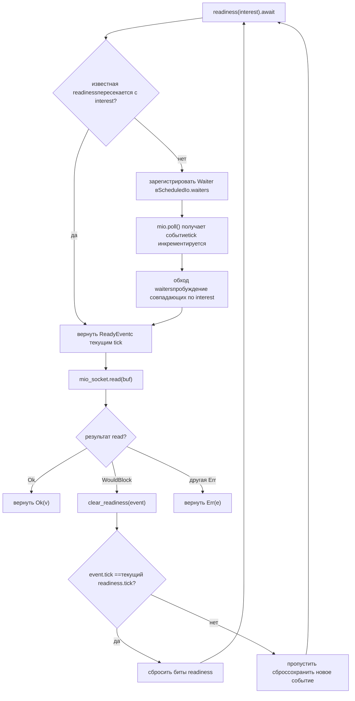
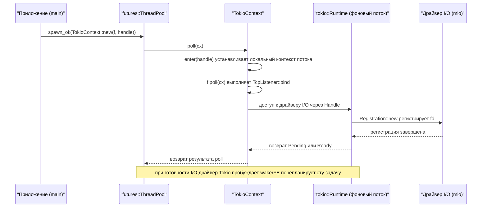

# Глава 14: Архитектурные компромиссы и будущая эволюция: от io_uring к подключаемым драйверам

В предыдущей главе мы разобрали четыре категории production-ловушек: cancel safety, распространение panic, порядок завершения и конфликты сигналов. На первый взгляд они разрознены, но на самом деле все указывают на одну архитектурную проблему: как чётко разделить владение состоянием на асинхронных границах. А способ разделения владения как раз определяется тремя самыми глубинными архитектурными решениями рантайма — как планируются задачи, как распространяются события I/O и как проверяется корректность конкурентности. В этой главе мы не будем углубляться в детали реализации конкретной функции, а поднимемся на уровень архитектуры, вспомним компромиссы Tokio в этих решениях и, следуя уже заложенным в официальной документации и исходном коде эволюционным подсказкам, посмотрим, куда io_uring, рефакторинг драйверов и интерфейс пользовательских executor'ов приведут Tokio. Прочитав эту главу, вы должны уметь ответить на практический вопрос: когда стоит расширять Tokio, а когда — обходить его.

# I. Три исторических компромисса: почему всё именно так

## Интуитивная модель

Представьте Tokio как ресторан, который работает уже десять лет. Способ составления расписания на кухне (work-stealing), отдельный штат официантов (разделение I/O-драйвера и планировщика) и система санитарного контроля на кухне (проверка конкурентности через loom) — всё это не было продумано в первый день открытия, а постепенно эволюционировало в процессе «гостей становится больше, блюда — сложнее». Понимание этой эволюции позволяет судить, какие решения были дальновидной закладкой, а какие — историческим багажом.

## Компромисс первый: work-stealing вместо глобальной очереди

> **[Design Inference & Architectural Trade-offs]**
> Глобальная очередь реализуется проще всего: все задачи попадают в одну`Mutex<VecDeque>`, worker-потоки захватывают блокировку и берут задачи. Но конкуренция за блокировку ухудшается с ростом числа ядер, а локальность кэша плохая — на каком ядре задача создана и на каком выполнена, полностью случайно.

Компромисс work-stealing таков: каждый worker держит локальную очередь,`spawn`при этом сначала кладёт в локальную очередь (без блокировок, дружественно к кэшу), и только когда локальная пуста, идёт воровать из хвоста чужой очереди. Цена — задержка в балансировке нагрузки, а само воровство требует атомарных операций и барьеров памяти. Tokio выбрал второе, потому что современные серверы легко имеют десятки ядер, и стоимость конкуренции за блокировку намного выше эпизодических затрат на воровство.

> **[Design Inference & Architectural Trade-offs]**
> Граничное условие этого решения:**гранулярность задач не должна быть слишком мелкой**. Если каждая задача выполняет работу всего на несколько микросекунд, доля накладных расходов на воровство и планирование становится неконтролируемой. Именно поэтому Tokio помимо`spawn_blocking`требует, чтобы длительные задачи самостоятельно`yield_now()`— кооперативное планирование по сути подстраховывает work-stealing.

## Компромисс второй: I/O-драйвер независим от планировщика

Это самое интересное место в исходных материалах этой главы. Посмотрите на структуру модулей`tokio/src/runtime/io/mod.rs`:

[FACT:tokio/src/runtime/io/mod.rs:5-22]

```rust
mod driver;
use driver::{Direction, Tick};
pub(crate) use driver::{Driver, Handle, ReadyEvent};

mod registration;
pub(crate) use registration::Registration;

mod registration_set;
use registration_set::RegistrationSet;

mod scheduled_io;
use scheduled_io::ScheduledIo;

mod metrics;
use metrics::IoDriverMetrics;

use crate::util::ptr_expose::PtrExposeDomain;
static EXPOSE_IO: PtrExposeDomain = PtrExposeDomain::new();
```

Обратите внимание, что`driver`、`registration`、`scheduled_io`— это три независимых модуля, и наружу экспонируются только`Driver`、`Handle`、`ReadyEvent`、`Registration`эти несколько типов.`ScheduledIo`является`pub(crate)`— он обёрнут в`PtrExposeDomain`для того, чтобы в loom-тестах предоставлять сырые указатели проверке конкурентности.

> **[Design Inference & Architectural Trade-offs]**
> Почему I/O-драйвер не встроен напрямую в планировщик? Потому что у них разные жизненные циклы и модели конкурентности. Планировщик заботится о том, «какая задача должна выполняться», I/O-драйвер — о том, «какой fd готов». Если их связать, то каждое изменение стратегии планирования потребует правок в I/O-пути, и наоборот. Что ещё важнее,`block_on`однопоточному рантайму тоже нужен I/O-драйвер, но не нужен work-stealing планировщик — разделение позволяет обоим рантаймам переиспользовать одну и ту же реализацию I/O.

## Компромисс третий: loom для проверки модели конкурентности

`tokio/src/loom/mod.rs`занимает всего 14 строк, но раскрывает стратегию проверки корректности конкурентности в Tokio:

[FACT:tokio/src/loom/mod.rs:1-14]

```rust
//! This module abstracts over `loom` and `std::sync` depending on whether we
//! are running tests or not.

#![allow(unused)]

#[cfg(not(all(test, loom)))]
mod std;
#[cfg(not(all(test, loom)))]
pub(crate) use self::std::*;

#[cfg(all(test, loom))]
mod mocked;
#[cfg(all(test, loom))]
pub(crate) use self::mocked::*;
```

Ключевое — условие`#[cfg(all(test, loom))]`: только когда одновременно включены два cfg —`test`и`loom`— модуль`mocked`подменяется на`std`. Это означает, что в production-сборке кода loom вообще нет, нулевые накладные расходы во время выполнения.

> **[Design Inference & Architectural Trade-offs]**
> Ценность loom в том, что он позволяет исчерпывающе перебрать «все возможные порядки чередования потоков». Такие вещи, как`ScheduledIo`в`AtomicUsize`чтение-модификация-запись,`Waiters`Вставка и удаление в связном списке на реальном оборудовании могут выполняться миллион раз без ошибок, но loom способен за несколько секунд построить чередование, вызывающее гонку. Цена — медленный запуск тестов и высокое потребление памяти, поэтому это применимо только для модульных тестов, но не в production.

## Размышления о дизайне

У этих трёх компромиссов есть общая черта:**Все они выбрали «более сложное, но более масштабируемое» решение и ограничили сложность внутри**. Сложность work-stealing спрятана в планировщике, сложность I/O-драйвера спрятана в`ScheduledIo`, сложность loom спрятана в условиях cfg. Наружу всегда выставляются`spawn`、`TcpStream::read`эти простые интерфейсы.

> **[Design Inference & Architectural Trade-offs]**
> Это также первый критерий для определения «когда следует расширять Tokio»:**Если вашу потребность можно выразить через существующий API, не трогайте внутренние структуры**. Как только вы начинаете зависеть от`pub(crate)`типов или`tokio_unstable`cfg, это означает, что вы привязали себя к внутренней реализации Tokio и заплатите за это при обновлении.

---

# II. Рефакторинг драйвера: от «один waker — одно направление» к «произвольному набору интересов»

## Интуитивная модель

У ранних типов I/O в Tokio было жёсткое ограничение:`async fn read(&mut self)`требует`&mut self`. Это как в ресторане с единственным окном выдачи: одновременно может стоять в очереди только один человек — потому что waker хранится внутри I/O-ресурса, а не в Future, соответствующем операции.`tokio/docs/reactor-refactor.md`Полностью описывает причины этого ограничения и план рефакторинга.

## Болевые точки старой архитектуры

Документ с самого начала указывает на проблему:

[FACT:tokio/docs/reactor-refactor.md:16-20]

```rust
Currently, I/O types require `&mut self` for `async` functions. The reason for
this is the task's waker is stored in the I/O resource's internal state
(`ScheduledIo`) instead of in the future returned by the `async` function.
Because of this limitation, I/O types limit the number of wakers to one per
direction (a direction is either read-related events or write-related events).
```

> **[Design Inference & Architectural Trade-offs]**
> Хранение waker внутри ресурса означает, что «у одного направления может быть только один ожидающий». Если вы одновременно хотите читать и писать в один и тот же`TcpStream`, придётся`split()`на две половины, каждая со своим независимым слотом waker. Именно поэтому`TcpStream::split()`существует — это не предпочтение в дизайне API, а прямое ограничение внутренней структуры данных.

## Новая архитектура: перенос waker в Future

Ключевая идея рефакторинга — «перенести waker из состояния ресурса в Future операции», чтобы поддерживать регистрацию нескольких waker для каждой операции:

[FACT:tokio/docs/reactor-refactor.md:22-25]

```rust
Moving the waker from the internal I/O resource's state to the operation's
future enables multiple wakers to be registered per operation. The "intrusive
wake list" strategy used by `Notify` applies to this case, though there are some
concerns unique to the I/O driver.
```

Новая`ScheduledIo`структура выглядит так:

[FACT:tokio/docs/reactor-refactor.md:97-134]

```rust
#[derive(Debug)]
pub(crate) struct ScheduledIo {
    /// Resource's known state packed with other state that must be
    /// atomically updated.
    readiness: AtomicUsize,

    /// Tracks tasks waiting on the resource
    waiters: Mutex,
}

#[derive(Debug)]
struct Waiters {
    // List of intrusive waiters.
    list: LinkedList,

    /// Waiter used by `AsyncRead` implementations.
    reader: Option,

    /// Waiter used by `AsyncWrite` implementations.
    writer: Option,
}

// This struct is contained by the **future** returned by `readiness()`.
#[derive(Debug)]
struct Waiter {
    /// Intrusive linked-list pointers
    pointers: linked_list::Pointers,

    /// Waker for task waiting on I/O resource
    waiter: Option,

    /// Readiness events being waited on. This is
    /// the value passed to `readiness()`
    interest: mio::Ready,

    /// Should not be `Unpin`.
    _p: PhantomPinned,
}
```

Здесь есть несколько изящных моментов, которые стоит разобрать:

**Во-первых,`readiness`это`AtomicUsize`，`waiters`это`Mutex<Waiters>`。**Почему бы не защитить оба одним мьютексом? Потому что чтение`readiness`происходит чрезвычайно часто (проверяется при каждом вызове`readiness()`), а запись происходит только при получении события mio. Использование атомарных переменных для безблокировочного пути чтения — типичная оптимизация разделения чтения и записи.

**Во-вторых,`Waiter`это узел интрузивного связного списка.** `pointers: linked_list::Pointers<Waiter>`позволяет`Waiter`самому быть частью списка, без дополнительного выделения узла.`_p: PhantomPinned`явно помечает его как не`Unpin`— потому что как только адрес узла интрузивного списка перемещается, список рвётся.

**В-третьих,`reader`и`writer`два`Option<Waker>`предназначены для`AsyncRead`/`AsyncWrite`.**Документ объясняет причину:

[FACT:tokio/docs/reactor-refactor.md:210-213]

```rust
The `AsyncRead` and `AsyncWrite` traits use a "poll" based API. This means that
it is not possible to use an intrusive linked list to track the waker.
Additionally, there is no future associated with the operation which means it is
not possible to cancel interest in the readiness events.
```

> **[Design Inference & Architectural Trade-offs]**
> Это компромиссное сосуществование двух механизмов — старого и нового:`async fn`путь использует интрузивный связный список (поддерживает несколько ожидающих, отменяемый),`poll`путь использует фиксированные слоты (не поддерживает отмену, но совместим с trait). Такое «сосуществование двух механизмов» — типичная цена постепенного рефакторинга.

## Состояния гонки и механизм tick

Самая сложная проблема при рефакторинге — гонки. Документ приводит конкретный сценарий дедлока:

[FACT:tokio/docs/reactor-refactor.md:175-175]

```rust
If care is not taken, if between `mio_socket.read(buf)` returning and
`clear_readiness(event)` is called, a readiness event arrives, the `read()`
function could deadlock. This happens because the readiness event is received,
`clear_readiness()` unsets the readiness event, and on the next iteration,
`readiness().await` will block forever as a new readiness event is not received.
```

Решение — ввести механизм tick, разбив`readiness`этот`AtomicUsize`на несколько битовых сегментов:

[FACT:tokio/docs/reactor-refactor.md:199-199]

```
| shutdown | generation |  driver tick | readiness |
|----------+------------+--------------+-----------|
|   1 bit  |   7 bits   +    8 bits    +  16 bits  |
```

> **[Design Inference & Architectural Trade-offs]**
> Эта раскладка битов — классический пример «обмена пространства на корректность».`tick`инкрементируется при каждом`mio::poll()`,`ReadyEvent`несёт tick, прочитанный в момент чтения.`clear_readiness()`очищает состояние готовности только при совпадении tick — если tick не совпадает, значит за это время пришло новое событие, и очищать нельзя. Так гонка между «очисткой» и «приходом нового события» устраняется в одной атомарной операции чтения-изменения-записи.

Приведённая ниже блок-схема описывает путь принятия решений между`readiness()`и`clear_readiness()`:



Ключевое ветвление на этой схеме —`tick_match`: если tick не совпадает,`clear_readiness`должен отказаться от очистки, иначе потеряет только что пришедшее событие, что приведёт к вечной блокировке следующего`readiness()`.

## Отмена интереса и утечка памяти

Интрузивный связный список порождает новую проблему: если`readiness()`возвращённый Future будет досрочно drop, узел списка должен быть удалён. Документ явно предупреждает:

[FACT:tokio/docs/reactor-refactor.md:144-148]

```rust
The future returned by `readiness()` uses an intrusive linked list to store the
waker with `ScheduledIo`. Because `readiness()` can be called concurrently, many
wakers may be stored simultaneously in the list. If the `readiness()` future is
dropped early, it is essential that the waker is removed from the list. This
prevents leaking memory.
```

> **[Design Inference & Architectural Trade-offs]**
> Это именно проявление «безопасности отмены» из предыдущей главы на уровне I/O.`readiness()`Future`Drop`должен в реализации`ScheduledIo`удалить себя из списка, иначе узел навсегда останется в

## , что приведёт и к утечке памяти, и к ошибочному пробуждению при следующем событии.

**Размышления о дизайне и подводные камни в production`Vec<Waker>`Почему не**, а интрузивный связный список?`&Resource`Документ даёт ответ при обсуждении реализации

[FACT:tokio/docs/reactor-refactor.md:228-233]

```rust
It is only possible to implement `AsyncRead` and `AsyncWrite` for resource types
themselves and not for `&Resource`. Implementing the traits for `&Resource`
would permit concurrent operations to the resource. Because only a single waker
is stored per direction, any concurrent usage would result in deadlocks. An
alternate implementation would call for a `Vec` but this would result in
memory leaks.
```

> **[Design Inference & Architectural Trade-offs]**
> `Vec<Waker>`〔Выводы о дизайне и архитектурные компромиссы〕

**Проблема**：`TcpStream::by_ref()`в том, что после drop Future соответствующий waker остаётся в Vec и его невозможно найти и удалить, приходится ждать следующего события, чтобы обнаружить «этот waker уже недействителен». Интрузивный связный список делает адрес узла адресом поля внутри Future, что позволяет точно удалить его при drop.`TcpStreamRef`Подводные камни в production`read_waiter`возвращаемый`write_waiter`содержит два узла:

[FACT:tokio/docs/reactor-refactor.md:238-244]

```rust
struct TcpStreamRef {
    stream: &'a TcpStream,

    // `Waiter` is the node in the intrusive waiter linked-list
    read_waiter: Waiter,
    write_waiter: Waiter,
}
```

> **[Design Inference & Architectural Trade-offs]**
> 〔Выводы о дизайне и архитектурные компромиссы〕`TcpStreamRef`Это означает, что как только`select!`будет drop, оба узла waiter одновременно станут недействительными. Если вы в`by_ref()`используете ссылку на`TcpStreamRef`для совместного использования между ветвями, будьте осторожны с временем жизни —`TcpStream`не может жить дольше`select!`, и не может одновременно заимствоваться между несколькими ветвями

---

# .

## Интуитивная модель

Иногда вы не хотите использовать планировщик Tokio, а хотите воспользоваться только его I/O и таймерами. Это как если вы не хотите есть в ресторане, а хотите воспользоваться только окном доставки.`examples/custom-executor.rs`демонстрирует такой «гибридный режим»: используя`futures::executor::ThreadPool`для планирования, а Tokio для I/O.

## Ключевой механизм: TokioContext

Весь пример держится на`TokioContext`этом типе-обёртке:

[FACT:examples/custom-executor.rs:51-54]

```rust
impl ThreadPool {
    fn spawn(&self, f: impl Future + Send + 'static) {
        let handle = self.rt.handle().clone();
        self.inner.spawn_ok(TokioContext::new(f, handle));
    }
}
```

> **[Design Inference & Architectural Trade-offs]**
> `TokioContext::new(f, handle)`связывает Future с`Handle`Tokio. Когда внешний исполнитель poll-ит эту обёртку Future,`TokioContext`сначала входит в контекст runtime Tokio (устанавливая thread-local`Handle`), затем poll-ит внутренний`f`. Таким образом,`f`при вызове`TcpListener::bind`сможет найти I/O-драйвер Tokio.

Посмотрим на структуру всего примера:

[FACT:examples/custom-executor.rs:38-48]

```rust
static EXECUTOR: Lazy = Lazy::new(|| {
    // Spawn tokio runtime on a single background thread
    // enabling IO and timers.
    let rt = tokio::runtime::Builder::new_multi_thread()
        .enable_all()
        .build()
        .unwrap();
    let inner = futures::executor::ThreadPool::builder().create().unwrap();

    ThreadPool { inner, rt }
});
```

> **[Design Inference & Architectural Trade-offs]**
> Здесь runtime Tokio создаётся, но**не`block_on`управляется**— он просто «существует», предоставляя I/O-драйвер и таймеры. Реальное планирование задач выполняет`futures::executor::ThreadPool`. В этом режиме worker-потоки Tokio фактически простаивают (ожидая событий I/O), а выполнение задач происходит в пуле потоков futures.

## Поток данных: путешествие TcpListener::bind между исполнителями



Ключевой момент этой диаграммы последовательности:**poll задачи происходит в пуле потоков futures, но ожидание событий I/O происходит в фоновом потоке Tokio**. Оба соединяются через`Handle`и waker.

## Проектные размышления: когда стоит обходить Tokio

> **[Design Inference & Architectural Trade-offs]**
> Само существование этого примера — сигнал: архитектура Tokio допускает «использовать только I/O-драйвер, без планировщика». Критерии можно свести к трём:

1. **Если вам нужно интегрироваться с существующей экосистемой исполнителей**(например, некоторые фреймворки требуют`futures::executor`), использование`TokioContext`— минимально инвазивное решение.

2. **Если вам нужен полный контроль над стратегией планирования**(например, системы реального времени требуют детерминированного планирования), work-stealing Tokio не подходит, но его I/O-драйвер всё ещё доступен.

3. **Если вам просто кажется, что API Tokio слишком сложный**, то обходить не стоит —`TokioContext`введённая граница между исполнителями принесёт новые сложности отладки, что не оправдает себя.

**Подводные камни в продакшене**：`TokioContext`В режиме`block_on`никогда не вызывается, что означает, что логика очистки`Runtime::shutdown`не сработает автоматически. Вы должны явно drop`Runtime`перед завершением программы, иначе фоновый поток I/O-драйвера может не завершиться корректно.

## Связь с io_uring

> **[Design Inference & Architectural Trade-offs]**
> `tokio/src/runtime/io/mod.rs`Условие cfg в начале раскрывает способ подключения io_uring:

[FACT:tokio/src/runtime/io/mod.rs:1-4]

```rust
#![cfg_attr(
    not(all(feature = "rt", feature = "net", feature = "io-uring", tokio_unstable)),
    allow(dead_code)
)]
```

Обратите внимание, что`feature = "io-uring"`и`tokio_unstable`появляются одновременно. Это означает, что поддержка io_uring сейчас**экспериментальная**, и для компиляции необходимо одновременно включить unstable-функции.`allow(dead_code)`же означает: когда эти функции не включены, часть кода в модуле не используется, и компилятор выдаст предупреждение — подавляемое с помощью`allow`.

> **[Design Inference & Architectural Trade-offs]**
> Принципиальное различие между io_uring и epoll: epoll — это «уведомление о готовности», io_uring — «уведомление о завершении». Первый требует, чтобы приложение само инициировало системный вызов`read`/`write`, второй — ядро само выполняет I/O и возвращает результат. Это огромный удар по модели`ScheduledIo`Tokio —`readiness()`семантика

---

# больше не применима в io_uring, нужна совершенно новая абстракция «отправка-завершение». Именно поэтому поддержка io_uring так долго остаётся в unstable: это не просто добавление бэкенда, а рефакторинг всего абстрактного слоя I/O-драйвера.

Итоги главы

**Исторические компромиссы**：

- work-stealing обменивает сложность планирования на масштабируемость по ядрам, граница — гранулярность задач не должна быть слишком мелкой;
- I/O-драйвер независим от планировщика, что позволяет`block_on`и многопоточному runtime использовать одну и ту же реализацию I/O;
- loom полностью исчезает из продакшен-сборки через cfg-условия, перебирая чередования потоков только при тестировании.

**Рефакторинг драйвера**（`reactor-refactor.md`）：

- перенос waker из внутренностей`ScheduledIo`в Future операции, использование интрузивного связного списка для поддержки множества ожидающих;
- использование битовой раскладки`AtomicUsize`(shutdown/generation/tick/readiness) для устранения гонки`clear_readiness`;
- `AsyncRead`/`AsyncWrite`из-за семантики poll невозможно использовать интрузивный связный список, сохраняется`reader`/`writer`с фиксированными слотами как компромисс.

**Будущая эволюция**：

- io_uring требует новой абстракции «отправка-завершение», сейчас защищено`tokio_unstable`;
- `TokioContext`позволяет использовать только I/O-драйвер без планировщика, но требует ручного управления жизненным циклом Runtime;
- критерий «расширять или обходить»: если можно выразить через существующий API — не трогать внутренние структуры.

# Вопросы для размышления и самопроверки

Q1: В`ScheduledIo`битовой раскладке`readiness`, если сократить поле`tick`с 8 бит до 4 бит, в каких сценариях возникнет ошибка? Проанализируйте с учётом логики сопоставления tick в`clear_readiness`.

**Справочный разбор**：`tick`увеличивается при каждом`mio::poll()`,[FACT:tokio/docs/reactor-refactor.md:185-185]。`clear_readiness`сбрасывает биты готовности только при`event.tick == 当前 readiness.tick`.[FACT:tokio/docs/reactor-refactor.md:199-199]Если tick занимает всего 4 бита, то каждые 16 poll-ов произойдёт переполнение. Предположим, некоторый`ReadyEvent`несёт tick=15, и когда он будет`clear_readiness`Ранее mio снова выполнил poll 1 раз, tick вернулся к 0. В этот момент`clear_readiness`обнаруживается несовпадение tick (15 != 0), и очистка ошибочно пропускается — но на самом деле за это время новых событий могло и не поступить, просто tick завернулся. Это приводит к тому, что бит готовности сохраняется навсегда, и последующие`readiness()`немедленно возвращаются, но`read`по-прежнему`WouldBlock`, что приводит к busy loop. 8-битного tick достаточно при нормальной нагрузке (цикл read-clear завершается за 256 poll), но при экстремально высокой конкурентности всё ещё есть риск переполнения — это неотъемлемое ограничение битовой компоновки.

Q2: `examples/custom-executor.rs`, среда выполнения Tokio создаётся, но никогда не`block_on`. Что произойдёт, если в этот момент вызвать`rt.shutdown_timeout()`? Почему в этом примере решено не вызывать?

**Справочный разбор**：`rt.shutdown_timeout()`будет ждать завершения всех задач и закроет драйвер I/O. Но в этом примере задачи фактически выполняются на`futures::executor::ThreadPool`на[FACT:examples/custom-executor.rs:51-54], в среде выполнения Tokio нет задач — она предоставляет только драйвер I/O. Если вызвать`shutdown_timeout`, он немедленно вернётся (поскольку задач нет), но фоновый поток драйвера I/O может всё ещё работать. В примере решено не вызывать, потому что`EXECUTOR`— это`Lazy`статическая переменная, и при завершении программы она обрабатывается механизмом статического разрушения Rust. Настоящая ловушка в том, что если`TokioContext`обёрнутый Future всё ещё выполняется, а`Runtime`будет drop, то операции I/O внутри Future вызовут panic (контекст среды выполнения не найден). В production необходимо убедиться, что все`TokioContext`Future завершены, прежде чем drop Runtime.

Q3: Предположим, вы хотите добавить в Tokio бэкенд I/O на основе io_uring. Согласно`reactor-refactor.md`в`readiness()`семантике

**, какие части можно напрямую переиспользовать, а какие необходимо переписать?**Справочный разбор`Registration`: можно напрямую переиспользовать`ScheduledIo`интерфейс регистрации и`waiters`структуру связного списка`readiness()`— они управляют тем, «кто ждёт», и не зависят от того, лежит ли в основе epoll или io_uring. Необходимо переписать семантику`clear_readiness`: под epoll он возвращает «fd готов», под io_uring понятия «готовности» нет, есть только «отправленный SQE завершён».`readiness()`Механизм tick также требует переработки — события завершения io_uring несут собственный идентификатор user_data, и tick не нужен для различения новых и старых событий. Самое фундаментальное изменение:`Waiter`возвращаемый Future под io_uring должен стать «отправить SQE и ждать CQE», что означает, что структуре`interest`нужно нести параметры SQE, а не только`tokio_unstable`. Именно поэтому поддержка io_uring защищена[FACT:tokio/src/runtime/io/mod.rs:1-4]— это не замена бэкенда, а изменение абстрактного контракта драйвера I/O.

На этом мы завершили восхождение от конкретных ловушек к архитектурным компромиссам. Оглядываясь на всю книгу — от ленивого вычисления Future до справедливости планировщика, от безопасности отмены до порядка завершения, и до io_uring и подключаемых драйверов в этой главе — все обсуждения вращаются вокруг одного ядра: чёткое разделение владения состоянием на асинхронных границах. Архитектура Tokio не является неизменной: zero-copy I/O в io_uring, развязка уровня драйверов, открытость интерфейса пользовательских исполнителей — всё это движет её к более гибкой и эффективной эволюции. Когда вы закроете эту книгу, пусть останется не набор способов использования API, а набор суждений: знать, когда следует доверять среде выполнения, когда вмешиваться в нижний уровень и как избегать в production тех комбинаций, которые кусаются. Экосистема асинхронного Rust всё ещё быстро растёт, и отслеживание исходного кода и официальной документации важнее, чем запоминание любых выводов.
