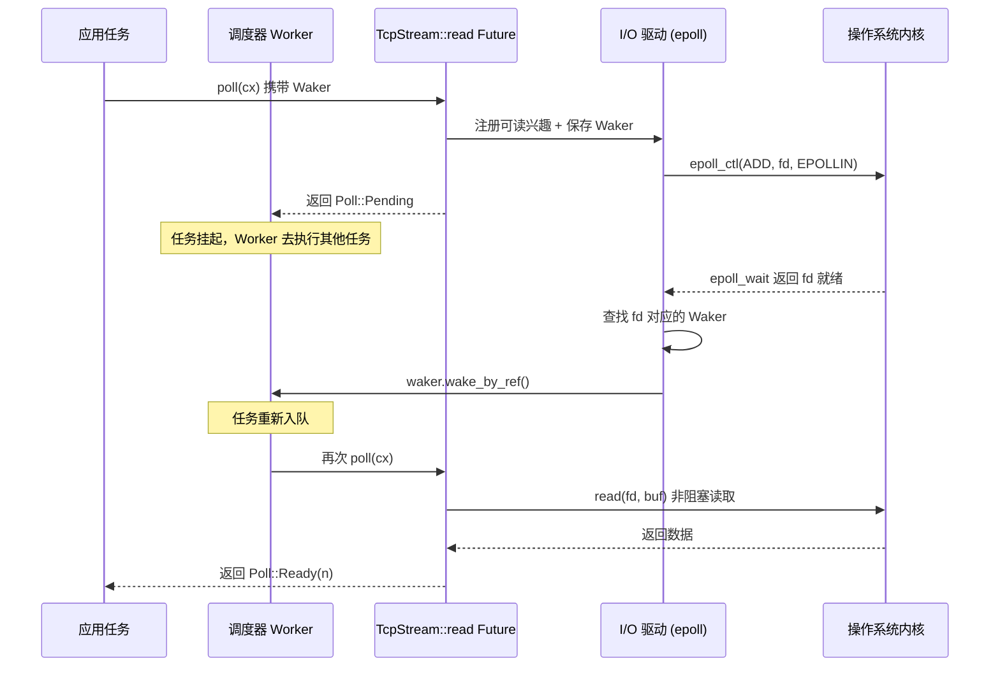

# 第 1 章：非同步的心智模型：Future、Waker 與執行器三件套

非同步程式設計在 Rust 中不是一個函式庫，而是一套語言級別的協定。Tokio 之所以能成為生產級執行時，不是因為它發明了 Future，而是因為它精確地實現了這套協定中每一個契約的邊界條件。本章不急於跳進 Tokio 的調度器程式碼，而是先把「三件套」——Future、Waker、Executor——的職責邊界和反向控制流講透。理解了這三者如何咬合，後續章節中 Runtime 的組裝、work-stealing 調度、I/O 驅動才有落腳點。

# 1.1 從阻塞到拉取：為什麼 Rust 選擇 poll 而非回呼

## 直覺模型

想像你在餐廳點了一份需要現做的菜。回呼式非同步（如 Node.js 早期風格）相當於你留下手機號，廚師做好後**主動打給你**——控制權在廚師手裡，你的程式碼只是被動回應。拉取式非同步（Rust 的選擇）相當於你拿到一張取餐憑證，你**自己決定**什麼時候去窗口問「好了嗎」：沒好就去做別的事，好了就取走。

這個區別看似微小，卻決定了整個系統的形態。回呼式模型中，每個非同步操作都必須攜帶一個「完成後做什麼」的閉包，閉包層層嵌套形成回呼地獄，且取消操作極其困難——你無法「撤回」一個已經註冊的回呼。拉取式模型中，Future 只是一個狀態機，`poll`是純粹的查詢動作，不推進就不消耗資源，取消就是 drop，乾淨俐落。

## 拉取式模型的核心契約

Rust 標準庫定義的`Future`trait 只有兩個要素：一個`poll`方法，一個`Output`關聯型別。Tokio 並沒有重新定義這個 trait，而是直接複用標準庫的實現。這一點在原始碼中有明確體現：

```rust
// tokio/src/future/mod.rs
cfg_not_trace! {
    cfg_rt! {
        pub(crate) use std::future::Future;
    }
}
```

[FACT:tokio/src/future/mod.rs:24-28]

這段程式碼揭示了一個重要事實：在未啟用`tracing`特性時，Tokio 內部的`Future`就是`std::future::Future`的別名，沒有任何包裝。只有在啟用`tracing`時，才會用`InstrumentedFuture`替換：

```rust
cfg_trace! {
    mod trace;
    #[allow(unused_imports)]
    pub(crate) use trace::InstrumentedFuture as Future;
}
```

[FACT:tokio/src/future/mod.rs:18-22]

> **[Design Inference & Architectural Trade-offs]**
> 這種「預設零開銷、按需插樁」的設計是 Tokio 的一貫哲學：核心路徑不引入任何額外抽象層，可觀測性作為可選特性疊加。`InstrumentedFuture`的存在說明 Tokio 團隊認為 tracing 的插樁成本不應由所有使用者承擔。

## poll 契約的三個隱含約束

`poll`方法的簽名是`fn poll(self: Pin<&mut Self>, cx: &mut Context<'_>) -> Poll<Self::Output>`。這個簽名裡藏著三條契約，違反任何一條都會導致未定義行為或邏輯錯誤：

**契約一：Pin 保證自引用安全。** `Pin<&mut Self>`意味著 Future 一旦被 poll，其記憶體位址就不能再移動。這是因為 async 塊編譯後會生成包含自引用的狀態機——區域變數可能持有指向同一狀態機內其他欄位的引用。如果允許移動，這些引用就會懸空。

**契約二：Pending 必須已註冊喚醒。**當`poll`返回`Poll::Pending`時，Future 必須已經透過`cx.waker()`取得並儲存了 Waker，或者已經將 Waker 註冊到了某個事件源。否則執行器將永遠不知道該 Future 何時可以再次被 poll，導致任務永久掛起。

**契約三：Ready 之後不應再 poll。**一旦`poll`回傳`Poll::Ready`，再次 poll 同一個 Future 是邏輯錯誤（雖然不會導致 UB，但行為未定義）。執行器有責任在收到 Ready 後不再排程該任務。

這三條契約中，契約二是最容易出錯的地方，也是 Waker 存在的根本原因。

# 1.2 Waker：反向控制流的載體

## 直覺模型

Waker 是餐廳給你的「震動取餐器」。你不需要站在窗口反覆問「好了嗎」——那會浪費你的時間。你只需要在第一次去窗口時把取餐器交給廚師（註冊 Waker），然後安心做別的事。菜好了，廚師按下按鈕，取餐器震動（呼叫`wake`），你收到信號後再去窗口取餐（重新 poll）。

如果沒有 Waker，執行器只有兩種選擇：要麼忙輪詢所有任務（浪費 CPU），要麼永遠不 poll 已回傳 Pending 的任務（任務餓死）。Waker 是打破這個僵局的唯一機制。

## Waker 的記憶體佈局與虛表設計

Waker 是標準庫型別，但它的設計直接影響了 Tokio 的任務結構。`Waker`本質上是一個胖指標：一個`RawWaker`結構體，包含一個資料指標和一個虛表指標。

```rust
// 标准库中的定义（非 Tokio 源码，此处为背景说明）
pub struct RawWaker {
    data: *const (),
    vtable: &'static RawWakerVTable,
}

pub struct RawWakerVTable {
    clone: unsafe fn(*const ()) -> RawWaker,
    wake: unsafe fn(*const ()),
    wake_by_ref: unsafe fn(*const ()),
    drop: unsafe fn(*const ()),
}
```

> **[Design Inference & Architectural Trade-offs]**
> 這個設計的精妙之處在於：`Waker`本身不關心「喚醒」具體意味著什麼。它只是四個函式指標的載體。Tokio 可以提供一個 Waker，其`wake`函式把任務重新推入排程佇列；而另一個執行時（比如`futures`crate 的`block_on`）可以提供完全不同的 Waker 實作。這種「資料 + 虛表」的模式使得 Waker 可以在不同執行時之間傳遞而不遺失語意。

`wake`和`wake_by_ref`的區別至關重要：`wake`消耗 Waker 的所有權（呼叫後 Waker 被 drop），而`wake_by_ref`只借用。執行器通常實作`wake_by_ref`為「將任務標記為就緒並入列」，而`wake`則在此基礎上額外處理引用計數的遞減。Tokio 的任務結構中，Waker 的資料指標指向任務的引用計數頭，每次 clone 增加計數，drop 減少計數，計數歸零時釋放任務記憶體。

## 喚醒的完整時序

下面這張時序圖展示了一個 TCP 讀取操作從發起到被喚醒的完整鏈路。注意 Waker 是如何從任務上下文一路傳遞到 I/O 驅動的：



這張圖的關鍵在於：**Waker 是唯一能從 Reactor 反向觸達 Executor 的通道**。Reactor 不持有任務的任何其他資訊，它只知道「當這個 fd 就緒時，呼叫這個 Waker」。這種解耦使得 I/O 驅動可以獨立於排程器實作，兩者只透過 Waker 這個窄介面通訊。

## 虛假喚醒：契約的灰色地帶

Tokio 的文件明確承認虛假喚醒的存在：

> Normally, tasks are scheduled only if they have been woken by calling `wake` on their waker. However, this is not guaranteed, and Tokio may schedule tasks that have not been woken under some circumstances.

[FACT:tokio/src/runtime/mod.rs:306-309]

> **[Design Inference & Architectural Trade-offs]**
> 這意味著`poll`的實作必須能夠容忍「沒有被喚醒就被再次 poll」的情況。一個正確的 Future 在回傳 Pending 後，即使沒有任何事件發生，再次被 poll 時也應該回傳 Pending 而不是 panic 或產生錯誤結果。這個約束看似寬鬆，實際上對狀態機的設計提出了要求：不能假設「兩次 poll 之間一定有事件發生」。

# 1.3 Executor：從 Future 到任務的封裝

## 直覺模型

Executor 是餐廳的調度員。他手裡有一疊訂單（任務佇列），決定哪個訂單先做、誰來做。當取餐器震動時，他把對應訂單重新排進佇列。沒有調度員，廚師們就不知道該做哪道菜，也不知道該在什麼時候切換工作。

但 Executor 的職責遠不止「輪詢 Future」。它必須解決三個核心問題：**任務的生命週期管理**（建立、排程、完成、取消）、**公平性保證**（防止某個任務餓死其他任務）、**資源驅動整合**（I/O 和定時器事件如何轉化為喚醒）。

## 任務的記憶體佈局：從 Future 到 Task

當呼叫`tokio::spawn`時，傳入的 Future 並不會被直接放入佇列。它會被包裝成一個`Task`結構，包含引用計數頭、排程中介資料和 Future 本身。這個包裝過程有一個關鍵的最佳化決策：

```rust
/// Boundary value to prevent stack overflow caused by a large-sized
/// Future being placed in the stack.
pub(crate) const BOX_FUTURE_THRESHOLD: usize = if cfg!(debug_assertions)  {
    2048
} else {
    16384
};

pub(crate) struct AutoBox(std::marker::PhantomData);

impl AutoBox {
    /// `true` if a value of type `T` is larger than [`BOX_FUTURE_THRESHOLD`].
    pub(crate) const SHOULD_BOX: bool = std::mem::size_of::() > BOX_FUTURE_THRESHOLD;
}
```

[FACT:tokio/src/runtime/mod.rs:649-673]

這段程式碼解決了一個非常具體的問題：如果 Future 太大（超過 16KB，debug 模式下 2KB），直接內聯到 Task 結構中會導致堆疊溢位或記憶體浪費。`AutoBox`透過編譯期常數`SHOULD_BOX`來決定是否將 Future 裝箱。

> **[Design Inference & Architectural Trade-offs]**
> 註解中特別強調了「用關聯常數而非執行時`if`」的原因：如果用執行時判斷，編譯器會為每個`T`同時實例化兩條分支的程式碼（一條處理`T`，一條處理`Pin<Box<T>>`），導致程式碼膨脹。而用常量分支，單態化收集器會剪掉不可達的分支，只為實際使用的型別生成程式碼。這是一個典型的「用型別系統替代執行時判斷」的最佳化。

## 調度公平性：31 與 61 的魔法數字

Tokio 的調度器文件中定義了一個形式化的公平性保證：

> If the total number of tasks does not grow without bound, and no task is blocking the thread, then it is guaranteed that tasks are scheduled fairly.

[FACT:tokio/src/runtime/mod.rs:279-281]

這個保證的實現依賴於兩個關鍵參數。對於 current-thread 執行時：

> The runtime will prefer to choose the next task to schedule from the local queue, and will only pick a task from the global queue if the local queue is empty, or if it has picked a task from the local queue 31 times in a row.

[FACT:tokio/src/runtime/mod.rs:328-333]

> The runtime will check for new IO or timer events whenever there are no tasks ready to be scheduled, or when it has scheduled 61 tasks in a row.

[FACT:tokio/src/runtime/mod.rs:335-337]

這兩個數字（31 和 61）不是隨意選擇的。31 是 2 的 5 次方減 1，可以用位元運算快速判斷；61 則是為了確保 I/O 事件不會被無限延遲——即使任務佇列永遠非空，每 61 次調度後也必須檢查一次 I/O。

> **[Design Inference & Architectural Trade-offs]**
> 為什麼是 31 而不是 32？因為計數器從 0 開始，每調度一次加 1，當計數器達到 31 時觸發全域佇列檢查。用`counter & 31 == 31`判斷比`counter % 32 == 0`更高效（雖然現代編譯器會自動最佳化）。61 的選擇則更微妙：它需要足夠大以避免頻繁的 epoll_wait 系統呼叫開銷，又需要足夠小以保證 I/O 延遲在可接受範圍內。

## 多執行緒執行時的 LIFO 槽最佳化

多執行緒執行時在公平性之上還增加了一個效能最佳化——LIFO 槽：

> The multi thread runtime uses the lifo slot optimization: Whenever a task wakes up another task, the other task is added to the worker thread's lifo slot instead of being added to a queue.

[FACT:tokio/src/runtime/mod.rs:373-377]

這個最佳化的直覺是：當一個任務喚醒另一個任務時，被喚醒的任務很可能與當前任務有資料依賴（比如生產者-消費者模式）。把它放在 LIFO 槽中，當前任務完成後立即執行它，可以利用 CPU 快取的熱資料。

但 LIFO 槽有一個防濫用機制：

> if a worker thread uses the lifo slot three times in a row, it is temporarily disabled until the worker thread has scheduled a task that didn't come from the lifo slot.

[FACT:tokio/src/runtime/mod.rs:380-382]

> **[Design Inference & Architectural Trade-offs]**
> 這個「三次連續使用後禁用」的規則是為了防止兩個任務互相喚醒形成活鎖。如果任務 A 喚醒任務 B，B 又喚醒 A，沒有這個限制的話，LIFO 槽會被這兩個任務永久佔用，其他任務永遠得不到調度。三次的限制給了其他任務一個插入的機會。

## 任務取消：abort 的真實語義

`JoinHandle::abort`的行為經常被誤解。文件明確指出：

> Be aware that calls to `JoinHandle::abort` just schedule the task for cancellation, and will return before the cancellation has completed.

[FACT:tokio/src/task/mod.rs:146-148]

這意味著`abort`不是同步的。它只是設定一個標誌位，任務會在下一個`.await`點檢查這個標誌並自行終止。如果任務正在執行一段沒有`.await`的 CPU 密集程式碼，`abort`不會立即生效。

更微妙的是：

> Note that aborting a task does not guarantee that it fails with a cancelled error, since it may complete normally first.

[FACT:tokio/src/task/mod.rs:134-138]

> **[Design Inference & Architectural Trade-offs]**
> 這個語義的設計動機是：取消是一個「盡力而為」的操作。Tokio 不強制殺死任務（Rust 沒有安全的強制終止機制），而是協作式地請求任務自行退出。這與`spawn_blocking`任務不可取消的設計是一致的——阻塞任務沒有`.await`點，無法檢查取消標誌。

# 1.4 設計思考：三件套的邊界與代價

## 為什麼 Future 不包含 Executor

Rust 的`Future`trait 刻意不包含「如何調度自己」的資訊。這是一個深思熟慮的解耦決策。如果 Future 知道自己的 Executor，那麼：

1. 同一個 Future 無法在不同執行時上執行（比如從 Tokio 遷移到 async-std）

2. 測試時無法用簡單的`block_on`驅動

3. 組合器（如`select!`、`join!`）無法跨執行時工作

Waker 的存在正是為了在保持這種解耦的同時，仍然允許 Future 通知 Executor。Waker 是一個「能力令牌」——Future 只知道「我可以呼叫這個來請求重新調度」，但不知道調度具體如何發生。

## 協作式調度的代價

Tokio 的任務是協作式的：任務只有在`.await`點才會讓出執行權。這意味著：

> code that spends a long time without reaching an `.await` will prevent other tasks from running.

[FACT:tokio/src/lib.rs:178-179]

> **[Design Inference & Architectural Trade-offs]**
> 這是協作式調度的根本代價。作業系統可以在任意指令邊界搶佔執行緒，但 Tokio 只能在`.await`點切換任務。如果一個任務執行了一個 10 秒的 CPU 密集迴圈且中間沒有`.await`，那麼同一個 worker 執行緒上的其他所有任務都會被阻塞 10 秒。Tokio 的應對策略是提供`spawn_blocking`和`block_in_place`，把這類工作轉移到專用執行緒池。但這是使用者的責任，執行時無法自動偵測。

## 公平性保證的邊界條件

Tokio 的公平性保證有兩個前提條件：任務總數有上界，且沒有任務阻塞執行緒。這兩個條件在實際生產環境中經常被違反：

- 如果任務不斷 spawn 新任務且不回收，任務總數無上界，公平性保證失效
- 如果某個任務執行了阻塞系統呼叫（比如同步檔案 I/O），它阻塞了整個 worker 執行緒

> **[Design Inference & Architectural Trade-offs]**
> 這就是為什麼 Tokio 文件反覆強調「不要在非同步任務中執行阻塞操作」。公平性保證不是執行時的硬性保證，而是「在正確使用的前提下」的保證。執行時不偵測違規行為，因為偵測本身需要開銷。

# 1.5 本章小結

本章建立了理解 Tokio 的三個基石：

**Future 是拉取式的狀態機。** `poll`是純粹的查詢動作，返回`Pending`時必須已註冊喚醒，返回`Ready`後不應再被 poll。Tokio 直接複用`std::future::Future`，不做額外包裝（除非啟用 tracing）。

**Waker 是反向控制流的唯一通道。**它透過「資料指標 + 虛表」的設計實現了執行時無關性。`wake`消耗所有權，`wake_by_ref`只借用。虛假喚醒是允許的，Future 必須容忍。

**Executor 負責生命週期、公平性和資源整合。**它把 Future 包裝成 Task，透過`AutoBox`在編譯期決定是否裝箱，透過 31/61 這兩個魔法數字平衡本地佇列和全域佇列的調度，透過 LIFO 槽優化資料依賴場景的效能。

這三個組件透過窄介面解耦：Future 只知道`poll`，Waker 只知道`wake`，Executor 只知道「輪詢直到 Pending 或 Ready」。正是這種解耦使得 Tokio 可以在不修改 Future 定義的前提下，實現 work-stealing 調度、I/O 驅動整合、協作式預算等高級特性。

# 本章思考與自測

Q1: 如果將`AutoBox::SHOULD_BOX`的判斷從編譯期常量改為執行時`if size_of::<T>() > THRESHOLD`，會對編譯產物產生什麼影響？為什麼 Tokio 的註釋特別強調這一點？

**參考解析**：根據[FACT:tokio/src/runtime/mod.rs:657-667]的註釋，如果用執行時`if`，編譯器會為每個`T`同時實例化兩條分支的程式碼——一條處理`T`直接內聯的情況，一條處理`Pin<Box<T>>`的情況。這意味著每個 spawn 的 Future 類型都會生成兩份任務驅動程式碼（task harness），導致二進位體積翻倍。而用關聯常量`SHOULD_BOX`，由於它在`T`確定後就是編譯期常量，單態化收集器會剪掉不可達的分支，只為實際使用的路徑生成程式碼。這是一個「用類型系統替代執行時判斷」的典型優化，代價是`AutoBox`必須是一個泛型結構體而非普通函式。

Q2: 假設一個任務在`poll`中返回了`Pending`，但忘記註冊 Waker。在 current-thread 執行時和 multi-thread 執行時下，這個任務分別會發生什麼？Tokio 有沒有機制檢測這種情況？

**參考解析**：根據[FACT:tokio/src/runtime/mod.rs:306-309]，Tokio 允許虛假喚醒，這意味著任務可能在被喚醒的情況下被重新調度。但這不意味著忘記註冊 Waker 是安全的。在 current-thread 執行時下，如果本地佇列和全域佇列都為空，執行時會進入`park`狀態等待 I/O 或定時器事件。忘記註冊 Waker 的任務永遠不會被重新入隊，導致永久掛起。在 multi-thread 執行時下，情況類似，但如果有其他任務持續喚醒，該任務可能因為虛假喚醒而被偶然重新調度——但這不可依賴。Tokio 沒有執行時檢測機制來發現「返回 Pending 但未註冊 Waker」的情況，因為這需要在每次 poll 後檢查 Waker 是否被使用，開銷太大。這是 Future 實現者的責任。

Q3: LIFO 槽的「三次連續使用後禁用」規則是為了防止什麼具體場景？如果去掉這個限制，在什麼樣的任務依賴模式下會導致其他任務餓死？

**參考解析**：根據[FACT:tokio/src/runtime/mod.rs:380-382]，LIFO 槽在連續使用三次後會被臨時禁用，直到調度了一個非 LIFO 來源的任務。這個規則防止的場景是：兩個任務互相喚醒形成緊密循環。例如任務 A 處理完一批資料後喚醒任務 B，任務 B 處理完後立即喚醒任務 A。如果沒有三次限制，A 和 B 會永遠佔據 LIFO 槽，worker 執行緒會在這兩個任務之間無限切換，本地佇列和全域佇列中的其他任務永遠得不到執行機會。三次的限制確保了每處理三輪「互相喚醒」後，至少有一個其他任務被調度，打破了活鎖。這個數字的選擇是經驗性的：太小會降低 LIFO 優化的收益，太大會增加其他任務的延遲。

至此，Future、Waker 與 Executor 三者的職責邊界與協作機制已經清晰：Future 定義計算，Waker 負責喚醒，Executor 驅動執行。但單個組件無法獨立工作，它們必須被組裝進一個統一的執行時環境。下一章，我們將追蹤 Runtime::new 與 Builder::build 的完整裝配鏈路，看調度器、I/O 驅動、時間驅動和阻塞執行緒池如何被注入同一個 Runtime 實例，並揭示 current_thread 與 multi_thread 兩種形態在裝配階段的根本差異。
