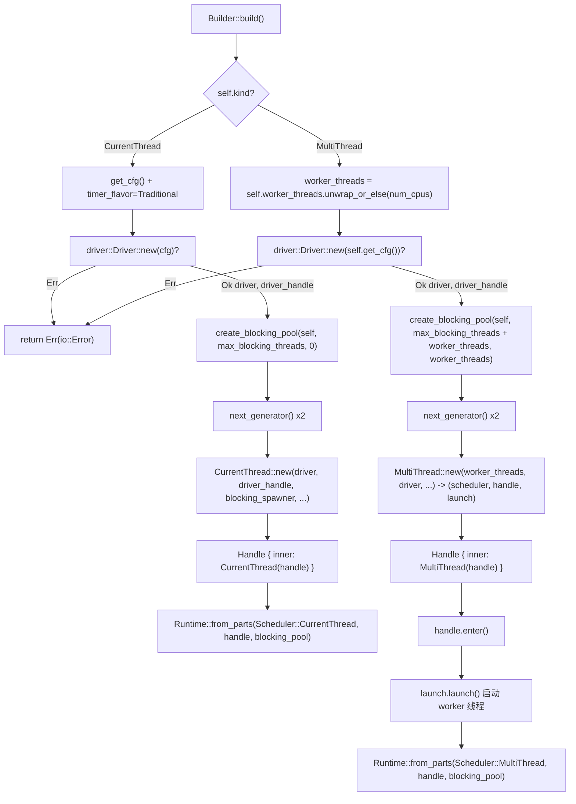

# 第 2 章：Runtime 的組裝：Builder 如何把驅動、調度器與執行緒池拼裝起來

# 從`Builder`到`Runtime`：一次裝配的完整旅程

上一章我們把 Future、Waker、Executor 三者的職責邊界講清楚了。但一個真實可用的執行時遠不止「一個 Executor」——它還需要 I/O 事件迴圈、定時器、阻塞執行緒池，並且這些元件必須共享同一套句柄、同一份生命週期。本章追蹤`Builder::build`的完整裝配鏈路，回答一個核心問題：**一個`Runtime`內部到底有哪些元件，它們如何被拼裝並共享句柄**。

Tokio 的裝配入口是`Builder`。它本身是一個純配置容器，所有欄位都是「意圖宣告」，不持有任何執行時資源。真正的資源建立發生在`build()`呼叫時。

## 直覺模型：Builder 是「裝修圖紙」，Runtime 是「交房後的房子」

`Builder`就像一張裝修圖紙：你在上面標註「要幾個房間（worker_threads）」「要不要通水（enable_io）」「要不要通電（enable_time）」「外包幫工上限（max_blocking_threads）」。圖紙本身不產生任何實體。直到呼叫`build()`，施工隊才按圖施工，把排程器、驅動、執行緒池這些「房間」真正建起來，並交付一個`Runtime`實例。

若沒有`Builder`這一層，使用者就必須手動 new 出每個元件、手動接線、手動處理失敗回滾——任何一處順序錯誤都會導致句柄懸空或資源洩漏。`Builder`的價值在於：**把「配置」與「建構」徹底分離，讓建構過程可以集中做校驗、失敗清理和句柄共享**。

## 記憶體佈局：`Builder`的欄位分區

`Builder`的欄位可以按職責分成四組。第一組是**形態與開關**：`kind`決定排程器形態，`enable_io` / `enable_time`決定是否建立對應驅動。

[FACT:tokio/src/runtime/builder.rs:55-68]

```rust
pub struct Builder {
    kind: Kind,
    name: Option,
    enable_io: bool,
    nevents: usize,
    nevents_busy: Option,
    enable_time: bool,
    start_paused: bool,
    // ...
}
```

第二組是**執行緒池參數**：`worker_threads`是`Option<usize>`，`None`表示「延遲到 build 時按 CPU 核數自動探測」；`max_blocking_threads`預設 512。

[FACT:tokio/src/runtime/builder.rs:73-79]

```rust
worker_threads: Option,
max_blocking_threads: usize,
```

第三組是**回呼鉤子**，全部是`Option<Arc<dyn Fn ...>>`。注意它們用`Arc`而非`Box`，因為這些回呼要被複製進每個 worker 執行緒的`Config`。

[FACT:tokio/src/runtime/builder.rs:87-97]

```rust
pub(super) after_start: Option,
pub(super) before_stop: Option,
pub(super) before_park: Option,
pub(super) after_unpark: Option,
```

第四組是**調度啟發式與隨機種子**：`global_queue_interval`、`event_interval`、`disable_lifo_slot`、`seed_generator`。

[FACT:tokio/src/runtime/builder.rs:116-134]

```rust
pub(super) global_queue_interval: Option,
pub(super) event_interval: u32,
pub(super) disable_lifo_slot: bool,
pub(super) seed_generator: RngSeedGenerator,
```

這裡有一個值得注意的設計：`Kind`是一個`Copy`的小列舉，只有兩個變體。

[FACT:tokio/src/runtime/builder.rs:261-265]

```rust
#[derive(Clone, Copy)]
pub(crate) enum Kind {
    CurrentThread,
    #[cfg(feature = "rt-multi-thread")]
    MultiThread,
}
```

`MultiThread`變體被`rt-multi-thread`feature 門控。這意味著在只啟用`rt`feature 的建構裡，`Kind`只有一個變體，`build()`的`match`會被編譯器最佳化成單分支——**用型別系統而非執行時判斷來消除多執行緒排程器的程式碼體積**。

## 預設值的哲學：為什麼 I/O 和 time 預設關閉

`Builder::new`是所有建構的公共入口。它把`enable_io`和`enable_time`都設為`false`。

[FACT:tokio/src/runtime/builder.rs:309-318]

```rust
// I/O defaults to "off"
enable_io: false,
nevents: 1024,
nevents_busy: None,

// Time defaults to "off"
enable_time: false,

// The clock starts not-paused
start_paused: false,
```

> **[Design Inference & Architectural Trade-offs]**
> 這個預設值選擇是刻意的：建立 I/O 驅動需要向作業系統申請 epoll/kqueue 句柄，建立 time 驅動需要啟動定時器基礎設施。如果使用者只是想要一個純計算的任務排程器（比如跑 CPU 密集的 async 邏輯），強制建立這些驅動就是純粹的浪費。`#[tokio::main]`巨集之所以「開箱即用」，是因為它內部呼叫了`enable_all()`。

`enable_all()`的實作揭示了 feature 門控如何影響「全開」的語義。

[FACT:tokio/src/runtime/builder.rs:398-419]

```rust
pub fn enable_all(&mut self) -> &mut Self {
    #[cfg(any(
        feature = "net",
        all(unix, feature = "process"),
        all(unix, feature = "signal")
    ))]
    self.enable_io();

    #[cfg(all(
        tokio_unstable,
        feature = "io-uring",
        // ...
    ))]
    self.enable_io_uring();

    #[cfg(feature = "time")]
    self.enable_time();

    self
}
```

注意`enable_io()`只在啟用了`net`、`process`或`signal`feature 時才被呼叫。如果使用者只啟用了`time` feature，`enable_all()`不會打開 I/O 驅動——因為編譯產物裡根本沒有 I/O 驅動程式碼。

## 裝配主路徑：`build()`的分流

`build()`是裝配的起點，它按`kind`分流到兩條完全不同的路徑。

[FACT:tokio/src/runtime/builder.rs:1146-1152]

```rust
pub fn build(&mut self) -> io::Result {
    match &self.kind {
        Kind::CurrentThread => self.build_current_thread_runtime(),
        #[cfg(feature = "rt-multi-thread")]
        Kind::MultiThread => self.build_threaded_runtime(),
    }
}
```

這兩條路徑的差異遠不止「一個執行緒 vs 多個執行緒」。下面分別展開。

### 路徑一：current_thread 的裝配

`build_current_thread_runtime`本身很薄，它委託給`build_current_thread_runtime_components`，然後把返回的三元組包進`Runtime`。

[FACT:tokio/src/runtime/builder.rs:1725-1736]

```rust
fn build_current_thread_runtime(&mut self) -> io::Result {
    use crate::runtime::runtime::Scheduler;

    let (scheduler, handle, blocking_pool) =
        self.build_current_thread_runtime_components(None)?;

    Ok(Runtime::from_parts(
        Scheduler::CurrentThread(scheduler),
        handle,
        blocking_pool,
    ))
}
```

真正的裝配邏輯在`build_current_thread_runtime_components`。它的執行順序至關重要：

[FACT:tokio/src/runtime/builder.rs:1760-1766]

```rust
let mut cfg = self.get_cfg();
cfg.timer_flavor = TimerFlavor::Traditional;
let (driver, driver_handle) = driver::Driver::new(cfg)?;

// Blocking pool
let blocking_pool = blocking::create_blocking_pool(self, self.max_blocking_threads, 0);
let blocking_spawner = blocking_pool.spawner().clone();
```

第一步建立`driver`，返回一對`(driver, driver_handle)`。注意這裡`?`直接向上傳播錯誤——如果 I/O 驅動初始化失敗（比如 epoll 建立失敗），整個`build`返回`Err`，此時 blocking pool 還沒建立，無需清理。

第二步建立 blocking pool，並立刻取出它的`spawner`複製。這個`spawner`會被注入排程器，讓排程器有能力把阻塞任務投遞到執行緒池。

第三步生成兩個獨立的 RNG 種子生成器。

[FACT:tokio/src/runtime/builder.rs:1768-1770]

```rust
let seed_generator_1 = self.seed_generator.next_generator();
let seed_generator_2 = self.seed_generator.next_generator();
```

> **[Design Inference & Architectural Trade-offs]**
> 為什麼需要兩個？`seed_generator_1`被放進`Config`，供排程器內部使用（比如`select!`的隨機分支順序）；`seed_generator_2`傳給`CurrentThread::new`，供任務側使用。分離兩個生成器可以避免排程器內部消費隨機數影響使用者可見的隨機序列，從而保證`rng_seed`的可重現性。

第四步是核心：把 driver、driver_handle、blocking_spawner、種子和`Config`一起交給`CurrentThread::new`。

[FACT:tokio/src/runtime/builder.rs:1776-1807]

```rust
let (scheduler, handle) = CurrentThread::new(
    driver,
    driver_handle,
    blocking_spawner,
    seed_generator_2,
    Config {
        before_park: self.before_park.clone(),
        after_unpark: self.after_unpark.clone(),
        // ...
        global_queue_interval: self.global_queue_interval,
        event_interval: self.event_interval,
        // ...
        enable_eager_driver_handoff: false,
        seed_generator: seed_generator_1,
        // ...
    },
    local_tid,
    self.name.clone(),
);
```

這裡有一個關鍵細節：`enable_eager_driver_handoff`被硬編碼為`false`。

[FACT:tokio/src/runtime/builder.rs:1795-1798]

```rust
// This setting never makes sense for a current thread runtime,
// as it only configures how the I/O driver is stolen across
// workers.
enable_eager_driver_handoff: false,
```

> **[Design Inference & Architectural Trade-offs]**
> 這個註解點明了該選項的本質：它描述的是「多個 worker 之間如何搶佔 I/O 驅動」，而 current_thread 只有一個執行緒，不存在搶佔，所以強制關閉。這是「配置項語意與形態強相關」的典型例子——同一個`Builder`欄位在不同形態下含義不同。

最後，`CurrentThread::new`回傳的`handle`被包進`scheduler::Handle::CurrentThread`，再包進公開的`Handle`。

[FACT:tokio/src/runtime/builder.rs:1816-1822]

```rust
let handle = Handle {
    inner: scheduler::Handle::CurrentThread(handle),
};

Ok((scheduler, handle, blocking_pool))
```

### 路徑二：multi_thread 的裝配

`build_threaded_runtime`的骨架與 current_thread 類似，但有三處本質差異。第一處是 worker 執行緒數的確定：

[FACT:tokio/src/runtime/builder.rs:2185]

```rust
let worker_threads = self.worker_threads.unwrap_or_else(num_cpus);
```

`None`在這裡被解析為`num_cpus()`。這就是「延遲自動探測」的落地點——探測發生在 build 時而非`Builder::new`時，因為 CPU 親和性可能在兩者之間變化。

第二處差異在 blocking pool 的容量計算：

[FACT:tokio/src/runtime/builder.rs:2189-2192]

```rust
let blocking_pool =
    blocking::create_blocking_pool(self, self.max_blocking_threads + worker_threads, worker_threads);
let blocking_spawner = blocking_pool.spawner().clone();
```

注意`max_blocking_threads + worker_threads`。對比 current_thread 路徑傳入的是`self.max_blocking_threads`和`0`。

[FACT:tokio/src/runtime/builder.rs:1765]

```rust
let blocking_pool = blocking::create_blocking_pool(self, self.max_blocking_threads, 0);
```

> **[Design Inference & Architectural Trade-offs]**
> 這個差異揭示了 blocking pool 容量語意：multi_thread 下，`max_blocking_threads`是「額外的」阻塞執行緒上限，實際總執行緒上限要加上 worker 執行緒數。第三個參數（current_thread 傳 0，multi_thread 傳`worker_threads`）很可能是「預留執行緒數」或「初始執行緒數」的提示。這個設計讓`max_blocking_threads`的語意在兩種形態下保持一致：它描述的是「超出核心 worker 之外還能額外開多少阻塞執行緒」。

第三處差異是`MultiThread::new`回傳三元組而非二元組：

[FACT:tokio/src/runtime/builder.rs:2198-2226]

```rust
let (scheduler, handle, launch) = MultiThread::new(
    worker_threads,
    driver,
    driver_handle,
    blocking_spawner,
    seed_generator_2,
    Config {
        // ...
        enable_eager_driver_handoff: self.enable_eager_driver_handoff,
        // ...
    },
    self.timer_flavor,
    self.name.clone(),
);
```

多出來的`launch`是一個「啟動句柄」。`MultiThread::new`只負責建構排程器結構，**並不立即啟動 worker 執行緒**。真正的啟動發生在後面：

[FACT:tokio/src/runtime/builder.rs:2228-2234]

```rust
let handle = Handle { inner: scheduler::Handle::MultiThread(handle) };

// Spawn the thread pool workers
let _enter = handle.enter();
launch.launch();

Ok(Runtime::from_parts(Scheduler::MultiThread(scheduler), handle, blocking_pool))
```

`handle.enter()`進入執行時上下文，然後`launch.launch()`才真正 spawn 出所有 worker 執行緒。這個「先建構、後啟動」的兩階段設計非常關鍵。

> **[Design Inference & Architectural Trade-offs]**
> 為什麼不能邊建構邊啟動？因為 worker 執行緒一旦啟動就會立刻開始 poll 任務，而任務可能引用`handle`。如果`handle`還沒建構完，就會出現「worker 拿著半成品句柄」的競態。兩階段設計保證了：**所有 worker 執行緒啟動時，完整的`Handle`已經就緒**。`_enter`守衛確保 worker 執行緒在啟動瞬間就處於正確的執行時上下文中。

## 裝配流程圖

下面這張圖把兩條路徑的裝配順序、關鍵分支和錯誤路徑畫在一起。注意`driver::Driver::new`失敗時直接回傳`Err`，此時 blocking pool 尚未建立。



## 句柄共享：`Handle`如何成為跨組件的「通行證」

裝配完成後，`Runtime`持有`scheduler`、`handle`、`blocking_pool`三件套。其中`handle`是共享的核心。它的內部是一個列舉：

[FACT:tokio/src/runtime/scheduler/mod.rs:29-41]

```rust
#[derive(Debug, Clone)]
pub(crate) enum Handle {
    #[cfg(feature = "rt")]
    CurrentThread(Arc),

    #[cfg(feature = "rt-multi-thread")]
    MultiThread(Arc),

    #[cfg(not(feature = "rt"))]
    #[allow(dead_code)]
    Disabled,
}
```

注意兩個變體都包著`Arc`。這意味著`Handle`的複製是廉價的引用計數遞增，可以被自由地分發到任意執行緒。`Handle`提供了統一的存取介面，把形態差異封裝在`match`內部。例如`driver()`：

[FACT:tokio/src/runtime/scheduler/mod.rs:53-64]

```rust
pub(crate) fn driver(&self) -> &driver::Handle {
    match *self {
        #[cfg(feature = "rt")]
        Handle::CurrentThread(ref h) => &h.driver,

        #[cfg(feature = "rt-multi-thread")]
        Handle::MultiThread(ref h) => &h.driver,

        #[cfg(not(feature = "rt"))]
        Handle::Disabled => unreachable!(),
    }
}
```

`blocking_spawner()`用了`match_flavor!`巨集來消除重複：

[FACT:tokio/src/runtime/scheduler/mod.rs:96-98]

```rust
pub(crate) fn blocking_spawner(&self) -> &blocking::Spawner {
    match_flavor!(self, Handle(h) => &h.blocking_spawner)
}
```

這個巨集展開後就是上面`driver()`那樣的`match`。它的價值在於：當新增一個需要按形態分發的存取器時，只需一行`match_flavor!`，而不必手寫兩遍`match`分支。

公開的`Handle`是內部`scheduler::Handle`的薄包裝：

[FACT:tokio/src/runtime/handle.rs:13-15]

```rust
pub struct Handle {
    pub(crate) inner: scheduler::Handle,
}
```

使用者拿到的`Handle`可以跨執行緒複製、可以`spawn`、可以`block_on`。`spawn`的實作展示了`AutoBox`的編譯期分支：

[FACT:tokio/src/runtime/handle.rs:197-208]

```rust
pub fn spawn(&self, future: F) -> JoinHandle
where
    F: Future + Send + 'static,
    F::Output: Send + 'static,
{
    let fut_size = mem::size_of::();
    if AutoBox::::SHOULD_BOX {
        self.spawn_named(Box::pin(future), SpawnMeta::new_unnamed(fut_size))
    } else {
        self.spawn_named(future, SpawnMeta::new_unnamed(fut_size))
    }
}
```

`AutoBox::<F>::SHOULD_BOX`是一個關聯常數，由`size_of::<F>()`與閾值比較得出。

[FACT:tokio/src/runtime/mod.rs:668-673]

```rust
pub(crate) struct AutoBox(std::marker::PhantomData);

impl AutoBox {
    pub(crate) const SHOULD_BOX: bool = std::mem::size_of::() > BOX_FUTURE_THRESHOLD;
}
```

> **[Design Inference & Architectural Trade-offs]**
> 註解裡解釋了為什麼用關聯常數而非執行時`if`：如果用執行時判斷，`spawn_named`會被單態化兩次（一次針對`F`，一次針對`Pin<Box<F>>`），導致每個 spawn 的 future 都生成兩份任務 harness，程式碼體積翻倍。用常數分支後，單態化收集器只保留實際走到的那个分支。

## 設計思考：裝配順序、錯誤恢復與生產踩坑

**順序即契約**。裝配順序`driver -> blocking_pool -> scheduler`不是隨意的。driver 最先建立，因為它是唯一可能因 OS 資源不足而失敗、且失敗後無需清理其他組件的步驟。blocking_pool 在 driver 之後、scheduler 之前，因為 scheduler 需要 blocking_spawner。如果 blocking_pool 建立失敗（實際上它不太會失敗），driver 會被 drop 自動清理。

**current_thread 的`local_tid`分支**。`build_local`走的是`build_current_thread_local_runtime`，它把當前執行緒 ID 傳進去：

[FACT:tokio/src/runtime/builder.rs:1738-1751]

```rust
fn build_current_thread_local_runtime(&mut self) -> io::Result {
    use crate::runtime::local_runtime::LocalRuntimeScheduler;

    let tid = std::thread::current().id();

    let (scheduler, handle, blocking_pool) =
        self.build_current_thread_runtime_components(Some(tid))?;

    Ok(LocalRuntime::from_parts(
        LocalRuntimeScheduler::CurrentThread(scheduler),
        handle,
        blocking_pool,
    ))
}
```

這個`tid`被存進`Handle`，後續`can_spawn_local_on_local_runtime`用它校驗「spawn_local 是否在 owner 執行緒上呼叫」：

[FACT:tokio/src/runtime/scheduler/mod.rs:140-147]

```rust
pub(crate) fn can_spawn_local_on_local_runtime(&self) -> bool {
    match self {
        Handle::CurrentThread(h) => h.local_tid.is_some_and(|x| std::thread::current().id() == x),

        #[cfg(feature = "rt-multi-thread")]
        Handle::MultiThread(_) => false,
    }
}
```

> **[Design Inference & Architectural Trade-offs]**
> 這是`LocalRuntime`安全性的基石：`!Send`的 future 只能在其 owner 執行緒上被 poll，而`local_tid`就是這個約束的執行時檢查點。如果去掉這個檢查，跨執行緒 spawn_local 會導致`!Send`資料被並發存取，引發 UB。

**生產踩坑一：`worker_threads(0)`會 panic**。`worker_threads`方法有斷言：

[FACT:tokio/src/runtime/builder.rs:582-586]

```rust
pub fn worker_threads(&mut self, val: usize) -> &mut Self {
    assert!(val > 0, "Worker threads cannot be set to 0");
    self.worker_threads = Some(val);
    self
}
```

這個斷言在配置階段就失敗，而不是等到 build。好處是錯誤定位更早，壞處是如果執行緒數來自設定檔的動態值，使用者必須在呼叫前自己校驗。

**生產踩坑二：`max_blocking_threads`設太小會掛起**。文件明確警告：

[FACT:tokio/src/runtime/builder.rs:600-601]

```rust
/// It's recommended to not set this limit too low in order to avoid hanging on operations
/// requiring [`spawn_blocking`].
```

> **[Design Inference & Architectural Trade-offs]**
> 因為 blocking pool 的佇列沒有背壓——任務會一直堆積直到有執行緒可用。如果所有阻塞執行緒都在等待某個「需要新阻塞執行緒才能完成」的操作，就會死鎖。文件裡「the queue does not apply any backpressure, it could potentially grow unbounded」正是這個風險的註腳。

**生產踩坑三：`UnhandledPanic::ShutdownRuntime`只支援 current_thread**。

[FACT:tokio/src/runtime/builder.rs:1374-1381]

```rust
pub fn unhandled_panic(&mut self, behavior: UnhandledPanic) -> &mut Self {
    if !matches!(self.kind, Kind::CurrentThread) && matches!(behavior, UnhandledPanic::ShutdownRuntime) {
        panic!("UnhandledPanic::ShutdownRuntime is only supported in current thread runtime");
    }

    self.unhandled_panic = behavior;
    self
}
```

> **[Design Inference & Architectural Trade-offs]**
> 這個限制的原因是：multi_thread 下「立即關閉執行時」需要協調所有 worker 執行緒的停止，實現複雜度高且語意模糊（正在 poll 的其他任務怎麼辦？）。current_thread 只有一個執行緒，關閉語意清晰。

## 本章小結

本章追蹤了`Builder::build`的完整裝配鏈路。核心結論：

1. `Builder`是純配置容器，`build()`才建立資源。裝配順序`driver -> blocking_pool -> scheduler`由錯誤恢復需求決定。

2. current_thread 與 multi_thread 的差異不止執行緒數：blocking pool 容量計算不同（`max_blocking_threads` vs `max_blocking_threads + worker_threads`），multi_thread 多一個`launch`兩階段啟動，`enable_eager_driver_handoff`在 current_thread 下被強制關閉。

3. `Handle`是跨元件共享的核心，內部用`Arc`包裹形態特定的句柄，透過`match`或`match_flavor!`巨集統一存取。

4. `AutoBox`用關聯常量在編譯期決定是否裝箱 future，避免程式碼體積翻倍。

5. `local_tid`是`LocalRuntime`安全性的執行時檢查點。

下一章，我們將進入任務的生命週期：`spawn`如何把一個 Future 變成可排程實體，`JoinHandle`如何與任務狀態機互動，以及任務在`PENDING` / `RUNNING` / `COMPLETE`之間的狀態遷移。

# 本章思考與自測

Q1: 如果把`build_threaded_runtime`中`create_blocking_pool`的容量參數從`self.max_blocking_threads + worker_threads`改成`self.max_blocking_threads`，在什麼場景下會導致阻塞任務餓死？為什麼 current_thread 路徑可以傳`self.max_blocking_threads`？

**參考解析**：根據[FACT:tokio/src/runtime/builder.rs:2189-2192]，multi_thread 路徑傳入`self.max_blocking_threads + worker_threads`，而 current_thread 路徑[FACT:tokio/src/runtime/builder.rs:1765]傳入`self.max_blocking_threads`。差異的根源在於：multi_thread 下，worker 執行緒本身也會執行阻塞任務（例如`block_in_place`會把 worker 執行緒臨時轉成阻塞執行緒），所以阻塞執行緒的總預算必須包含 worker 執行緒數。如果改成只傳`self.max_blocking_threads`，當`max_blocking_threads`設得較小（比如 1）且已有 worker 執行緒在`block_in_place`中佔用預算時，新的`spawn_blocking`任務將無執行緒可用，堆積在無背壓佇列中，導致依賴這些阻塞任務的 async 任務永久掛起。current_thread 只有一個執行緒且不支援`block_in_place`的 worker 轉換語意，所以不需要加上 worker 數。

Q2: `MultiThread::new`回傳`launch`句柄，真正啟動 worker 執行緒的是`launch.launch()`。如果去掉`handle.enter()`這一行直接呼叫`launch.launch()`，會發生什麼？

**參考解析**：根據[FACT:tokio/src/runtime/builder.rs:2230-2232]，啟動前有`let _enter = handle.enter();`然後才`launch.launch()`。`handle.enter()`的作用是設定執行緒本地上下文（thread-local），讓當前執行緒「看起來」處於執行時內部。worker 執行緒啟動後會立即開始 poll 任務，而任務程式碼可能呼叫`Handle::current()`、`tokio::spawn`等依賴上下文的 API。如果去掉`_enter`，worker 執行緒在啟動瞬間的上下文設定可能不完整（取決於`launch`內部是否自行設定），最壞情況下 worker 執行緒上執行的初始化程式碼呼叫`Handle::current()`會 panic（`CONTEXT_MISSING_ERROR`）。即使`launch`內部為每個 worker 設定了上下文，`_enter`也保證了「啟動動作本身」發生在正確的上下文中，避免啟動過程中的競態。

Q3: `AutoBox::<F>::SHOULD_BOX`用關聯常量而非執行時`if size_of::<F>() > THRESHOLD`。假設改成執行時判斷，除了程式碼體積翻倍，還會在什麼情況下導致效能退化？

**參考解析**：根據[FACT:tokio/src/runtime/mod.rs:657-673]的註釋，執行時`if`會讓`spawn_named`對每個`T`單態化兩次（`T`和`Pin<Box<T>>`各一次）。除了程式碼體積翻倍，效能退化體現在：1) 指令快取（i-cache）壓力增大，因為兩套 harness 程式碼都要駐留；2) 編譯器無法對「實際只走一個分支」做最佳化，執行時分支預測雖然通常準確，但分支本身和兩套程式碼的暫存器分配差異會累積；3) 更隱蔽的是，`Pin<Box<T>>`路徑會強制堆積分配，如果執行時判斷因為某種原因（比如`size_of`在泛型上下文中未完全常量摺疊）誤判，小 future 也會被裝箱，每次 spawn 多一次堆積分配。關聯常量讓單態化收集器在編譯期就剪掉未走的分支，零執行時開銷。
