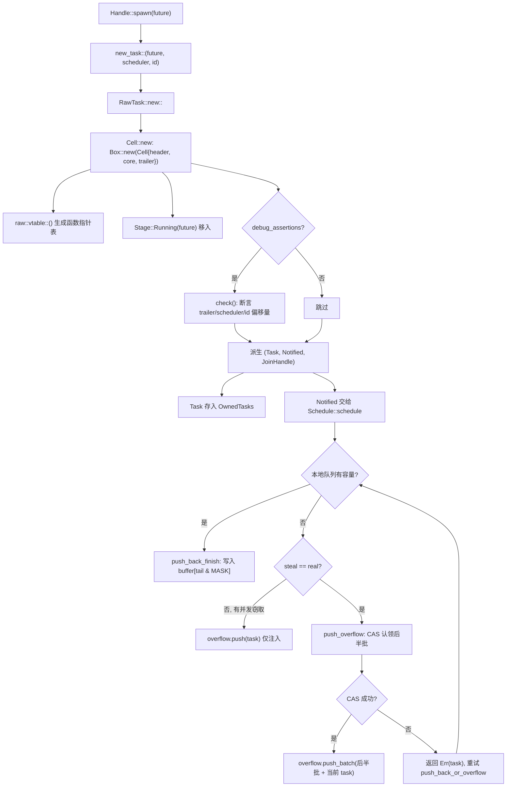
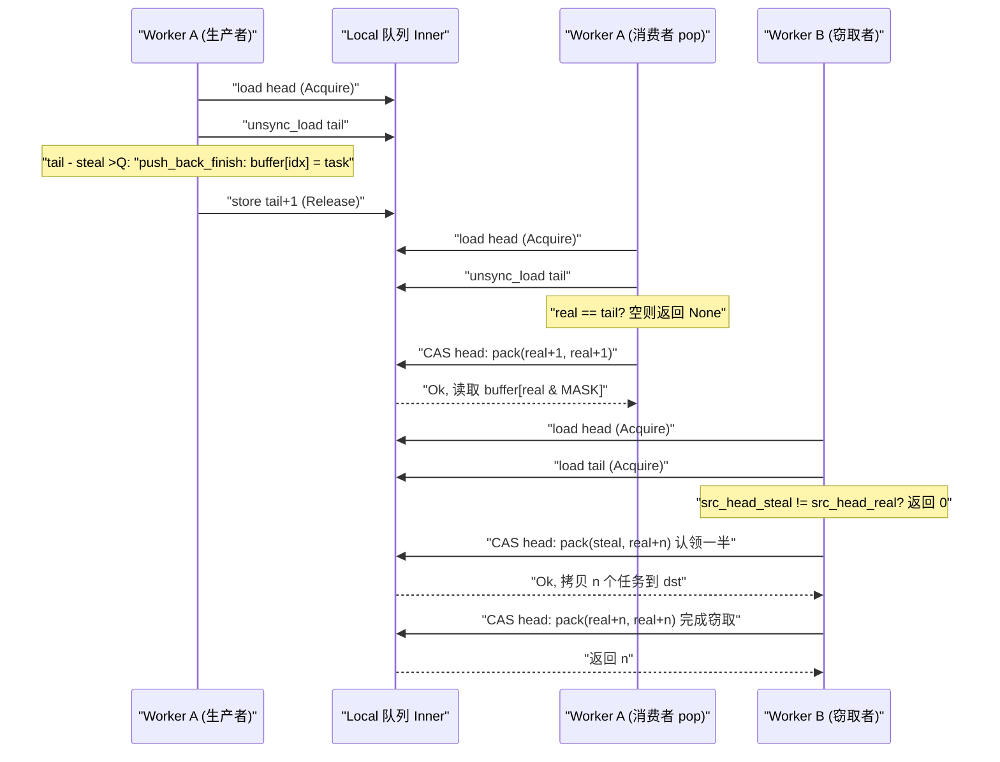

# 第 3 章：任務的一生（上）：spawn 如何把一個 Future 變成可排程實體

上一章我們完成了 Runtime 的裝配：I/O driver、time driver、blocking pool 與排程器被注入同一個`Runtime`實例，`Handle`成為跨執行緒存取這些元件的共享句柄。但裝配好的執行時此時還只是一個空殼——它擁有驅動任務的引擎，卻沒有任何任務可驅動。本章要回答的問題正是：當你敲下`tokio::spawn(async { ... })`的那一刻，那個`async`塊究竟經歷了什麼，才從一段普通的 Rust 程式碼變成一個「可被排程器接管、可被喚醒、可被 join」的實體。這是「任務的一生」的上半場，我們聚焦於誕生：從`Handle::spawn`出發，穿過`new_task`的引用計數分配，落到`Cell<T, S>`的記憶體佈局，最終看清任務如何被投遞到某個 worker 的本地佇列或全域注入佇列。下半場（第 4 章）才會進入排程迴圈與 poll/wake 閉環。

# 3.1 Future 不是任務：一次 spawn 到底創造了什麼

## 直覺模型

把`Future`想像成一張「菜譜」，把任務想像成「廚房裡正在被烹飪的一道菜」。菜譜本身是靜態的、可複製的、沒有任何執行狀態；只有當廚房（排程器）決定「現在做這道菜」，給它分配一個灶台（worker）、一個訂單號（TaskId）、一個出餐口（JoinHandle），它才成為一道「在製菜品」。若沒有這層包裝，排程器就無從知道「這道菜做到哪一步了」「誰在等它」「做好了通知誰」——它只能看到一張菜譜，無法管理。

## 資料結構與記憶體佈局

Tokio 用`Task<S>`表示「被執行時擁有的任務引用」，它是對`RawTask`的透明包裝：

```rust
#[repr(transparent)]
pub(crate) struct Task {
    raw: RawTask,
    _p: PhantomData,
}
```

[FACT:tokio/src/runtime/task/mod.rs:233-238]

`#[repr(transparent)]`意味著`Task<S>`與`RawTask`在記憶體上完全一致，沒有額外開銷。`PhantomData<S>`只是編譯期的型別標記，標記這個任務屬於哪個排程器型別`S`。

真正承載任務全部狀態的是`Cell<T, S>`，它的佈局是整個任務模組的基石：

```rust
#[repr(C)]
pub(super) struct Cell {
    pub(super) header: Header,
    pub(super) core: Core,
    pub(super) trailer: Trailer,
}
```

[FACT:tokio/src/runtime/task/core.rs:126-136]

三個欄位按「熱-溫-冷」排列。`Header`是熱資料（每次排程、每次狀態轉換都要存取），`Core`是溫資料（poll 時存取），`Trailer`是冷資料（僅在建立與銷毀時存取）。註解明確寫道：`Header`必須是第一個欄位，因為任務結構體會同時被`*mut Cell`和`*mut Header`引用[FACT:tokio/src/runtime/task/core.rs:37-43]。

更關鍵的是快取行對齊。`Cell`上掛著一長串`#[cfg_attr(..., repr(align(...)))]`，按目標架構選擇對齊位元組數：x86_64/aarch64/powerpc64 用 128 位元組，arm/mips/sparc/hexagon 用 32 位元組，m68k 用 16 位元組，s390x 用 256 位元組，其餘預設 64 位元組[FACT:tokio/src/runtime/task/core.rs:64-125]。註解解釋了為什麼 x86_64 要用 128 而非 64：從 Intel Sandy Bridge 起，空間預取器會一次拉取**成對**的 64 位元組快取行，所以必須對齊到 128 位元組才能避免偽共享[FACT:tokio/src/runtime/task/core.rs:45-53]。

> **[Design Inference & Architectural Trade-offs]**
> 這個對齊策略的代價是每個任務至少浪費一個快取行的空間。但任務狀態位（`state`）會被多個 worker 執行緒高頻讀寫——一個執行緒在 poll 時設定 RUNNING 位，另一個執行緒在喚醒時讀 NOTIFIED 位——若兩個任務的狀態位落在同一快取行，每次狀態轉換都會觸發快取行在核心間來回彈跳（cache line ping-pong），效能損失遠超記憶體浪費。Tokio 選擇用空間換時間。

`Header`本身被約束在 8 個指標大小以內：

```rust
#[test]
#[cfg(not(loom))]
fn header_lte_cache_line() {
    assert!(std::mem::size_of::() ());
}
```

[FACT:tokio/src/runtime/task/core.rs:591-593]

這個測試確保`Header`不會超過 64 位元組（8 × 8），從而在 64 位元組快取行的架構上能完整落入一行。`Header`的欄位包括：`state: State`（原子狀態位）、`queue_next: UnsafeCell<Option<NonNull<Header>>>`（注入佇列的鏈結串列指標）、`vtable: &'static Vtable`（函式指標表）、`owner_id: UnsafeCell<Option<NonZeroU64>>`（所屬`OwnedTasks`列表的 ID）、`scheduled_at: UnsafeCell<ScheduleLatencyInstant>`（排程延遲測量）[FACT:tokio/src/runtime/task/core.rs:169-198]。

`Core<T, S>`持有排程器句柄`scheduler: S`、任務 ID`task_id: Id`，以及最核心的`stage: CoreStage<T>` [FACT:tokio/src/runtime/task/core.rs:148-165]。`Stage`是一個三態列舉：

```rust
#[repr(C)]
pub(super) enum Stage {
    Running(T),
    Finished(super::Result),
    Consumed,
}
```

[FACT:tokio/src/runtime/task/core.rs:225-229]

這正是「Future 與 Output 復用同一塊記憶體」的關鍵：任務執行期間`Stage::Running`持有 future，完成後原地替換為`Stage::Finished(output)`，被`JoinHandle`取走後變為`Stage::Consumed`。`#[repr(C)]`註解指向一個 Miri issue，說明這個佈局對 unsafe 程式碼的正確性有硬性要求[FACT:tokio/src/runtime/task/core.rs:225-229]。

`Trailer`存放冷資料：`owned: linked_list::Pointers<Header>`（`OwnedTasks`鏈結串列指標）、`waker: UnsafeCell<Option<Waker>>`（等待任務完成的消費者 waker）、`hooks: TaskHarnessScheduleHooks` [FACT:tokio/src/runtime/task/core.rs:205-213]。

## Step-by-Step：從 spawn 到入隊

我們代入一個具體場景：在 multi_thread 執行時中，worker 執行緒 A 執行`tokio::spawn(async { 42 })`。

**第一步：建構任務三件套。** `new_task`是任務誕生的唯一入口：

```rust
fn new_task(
    task: T,
    scheduler: S,
    id: Id,
    spawned_at: SpawnLocation,
) -> (Task, Notified, JoinHandle)
```

[FACT:tokio/src/runtime/task/mod.rs:336-346]

它呼叫`RawTask::new::<T, S>`分配`Cell`，然後從同一個`raw`指標派生出三個引用：`Task`（owned 引用，通常立即放入`OwnedTasks`）、`Notified`（通知引用，交給排程器）、`JoinHandle`（結果讀取句柄）[FACT:tokio/src/runtime/task/mod.rs:347-363]。注意三者共享同一個`raw`，各自持有一個引用計數。

**第二步：分配`Cell`並寫入初始狀態。** `Cell::new`在堆上分配整個結構：

```rust
let result = Box::new(Cell {
    trailer: Trailer::new(scheduler.hooks()),
    header: new_header(state, vtable, ...),
    core: Core {
        scheduler,
        stage: CoreStage {
            stage: UnsafeCell::new(Stage::Running(future)),
        },
        task_id,
        ...
    },
});
```

[FACT:tokio/src/runtime/task/core.rs:261-278]

`vtable`由`raw::vtable::<T, S>()`生成，是一張針對具體`T`和`S`單態化的函式指標表[FACT:tokio/src/runtime/task/core.rs:260]。future 被直接移入`Stage::Running`，沒有額外裝箱。

**第三步：debug 斷言驗證佈局。**在`debug_assertions`下，`Cell::new`會呼叫`check`函式，用`Header::get_trailer`、`Header::get_scheduler`、`Header::get_id_ptr`等基於 vtable 偏移量的指標運算，逐一斷言「透過 header 反查到的欄位位址」與「實際欄位位址」一致[FACT:tokio/src/runtime/task/core.rs:280-321]。這是對 vtable 偏移量正確性的執行期自檢。

**第四步：投遞到排程器。**排程器拿到`Notified<S>`後，呼叫`Schedule::schedule` [FACT:tokio/src/runtime/task/mod.rs:315]。在 multi_thread 下，這會走`push_back_or_overflow`，把任務推入當前 worker 的本地佇列，佇列滿時溢出到注入佇列。

下面這張圖刻畫了從`new_task`到入隊的控制流與分支：



這張圖揭示了幾個關鍵分支：debug 斷言只在除錯建置生效；本地佇列滿時並非直接溢出，而是先判斷是否有並行竊取者（`steal != real`），若有則只把當前任務推入注入佇列，因為竊取者騰出的空間很快可用。

## 設計思考：為什麼是三個引用而不是一個

`new_task`返回三個引用，而非一個。這是引用計數設計的核心：`Task`代表「執行期擁有這個任務」，`Notified`代表「這個任務已被通知、待排程」，`JoinHandle`代表「有人關心它的結果」。三者生命週期獨立——`JoinHandle`可以被 drop（任務繼續執行，結果丟棄），`Notified`在 poll 後消失，`Task`在任務完成並從`OwnedTasks`移除後釋放。若只有一個引用，就無法表達「任務還在跑但沒人 join」這種狀態。

`UnownedTask`是另一個重要分支：它持有**兩個**引用計數，用於 blocking 任務（不存入`OwnedTasks`）[FACT:tokio/src/runtime/task/mod.rs:286-295]。`unowned`函式透過`mem::forget(task)`和`mem::forget(notified)`把兩個引用合併進`UnownedTask` [FACT:tokio/src/runtime/task/mod.rs:388-397]。這個「兩個引用」的設計動機是：blocking 任務沒有`OwnedTasks`列表來持有 owned 引用，所以需要額外一個引用計數來保證任務在執行期間不被釋放。

# 3.2 狀態位：一個 usize 如何編碼任務的全部生命週期

## 直覺模型

把任務狀態想像成一張「體檢報告單」，上面有若干獨立的勾選框：是否正在被 poll、是否已完成、是否被通知、是否被取消、是否有人 join。Tokio 沒有用多個布林欄位，而是把這些勾選位壓進**一個`AtomicUsize`**。這樣每次狀態轉換只需一次 CAS，而非多次加鎖。若沒有這個設計，任務狀態轉換會變成多把鎖的嵌套，死鎖風險與開銷都會飆升。

## 位域佈局

`State`的位域在模組文件中有完整定義[FACT:tokio/src/runtime/task/mod.rs:32-53]：

- `RUNNING`：任務是否正在被 poll 或取消。**這一位同時充當任務的鎖** [FACT:tokio/src/runtime/task/mod.rs:37-38]。
- `COMPLETE`：future 已完全完成並被 drop。一旦置位永不清除，且永不與`RUNNING`同時置位[FACT:tokio/src/runtime/task/mod.rs:40-41]。
- `NOTIFIED`：當前是否存在一個`Notified`物件[FACT:tokio/src/runtime/task/mod.rs:43]。
- `CANCELLED`：任務應盡快被取消[FACT:tokio/src/runtime/task/mod.rs:45-46]。
- `JOIN_INTEREST`：存在`JoinHandle` [FACT:tokio/src/runtime/task/mod.rs:48]。
- `JOIN_WAKER`：作為 join handle waker 的存取控制位[FACT:tokio/src/runtime/task/mod.rs:50-51]。

剩餘位用於引用計數[FACT:tokio/src/runtime/task/mod.rs:53]。

`RUNNING`位充當鎖這一點值得展開。模組文件的 Safety 章節指出：對 future 的任何可變存取都必須在修改`RUNNING`位獲得鎖之後進行，從而保證獨佔存取[FACT:tokio/src/runtime/task/mod.rs:130-133]。這意味著 poll 一個任務時，執行緒先 CAS 設定`RUNNING`，成功後獨佔 future；若失敗說明別的執行緒正在 poll，本次 poll 直接返回。這把「poll 的互斥」與「狀態轉換」合併成一次原子操作，避免了單獨的互斥鎖。

## JOIN_WAKER 的存取控制協定

`JOIN_WAKER`位是整個狀態機中最精妙的部分。它解決的問題是：`waker`欄位（在`Trailer`中）會被兩個執行緒並行存取——執行期在任務完成時**讀**它來喚醒 join 者，`JoinHandle`在 poll 時**寫**它來註冊 waker。模組文件給出了 7 條規則[FACT:tokio/src/runtime/task/mod.rs:75-120]：

1. `JOIN_WAKER`初始為 0。

2. 為 0 時，`JoinHandle`對 waker 欄位有獨佔（可變）存取權。

3. 為 1 時，`JoinHandle`只有共享（唯讀）存取權。

4. 為 1 且`COMPLETE`為 1 時，執行期對 waker 欄位有共享（唯讀）存取權。

5. `JoinHandle`要寫 waker，必須：(i) 成功把`JOIN_WAKER`置 0 以獲得獨佔權，(ii) 寫入 waker，(iii) 成功把`JOIN_WAKER`置 1。

6. `JoinHandle`只能在`COMPLETE`為 0 時改`JOIN_WAKER`；執行期只能在`COMPLETE`為 1 時改。

7. 若`JOIN_INTEREST`為 0 且`COMPLETE`為 1，執行期對 waker 欄位有獨佔存取權（用於 drop waker）。

規則 6 隱含了競態：步驟 (i) 或 (iii) 可能失敗。若 (i) 失敗，放棄寫 waker；若 (iii) 失敗（另一執行緒在此期間置了`COMPLETE`），則清空 waker 欄位[FACT:tokio/src/runtime/task/mod.rs:110-120]。這套協定的本質是：用一個原子位在「寫者」和「讀者」之間動態轉移所有權，避免為 waker 欄位單獨加鎖。

## 引用計數的兩種遞減

`Task`的 drop 遞減一次引用計數，`UnownedTask`的 drop 遞減兩次：

```rust
impl Drop for Task {
    fn drop(&mut self) {
        if self.header().state.ref_dec() {
            self.raw.dealloc();
        }
    }
}
```

[FACT:tokio/src/runtime/task/mod.rs:580-586]

```rust
impl Drop for UnownedTask {
    fn drop(&mut self) {
        if self.raw.header().state.ref_dec_twice() {
            self.raw.dealloc();
        }
    }
}
```

[FACT:tokio/src/runtime/task/mod.rs:590-596]

`ref_dec`回傳`true`表示這是最後一個引用，此時才真正釋放`Cell`記憶體。`ref_dec_twice`是`UnownedTask`持有兩個計數的直接體現。

## 設計思考：為什麼狀態位與引用計數共用一個原子

> **[Design Inference & Architectural Trade-offs]**
> 把狀態位和引用計數放在同一個`AtomicUsize`裡，是為了讓「遞減引用計數」與「設置狀態位」這兩個動作能在**一次 CAS**中完成。模組文件在`Schedule::release`的註解中明確提到：「任務模組會批次處理 ref-dec 與其他選項的設置」[FACT:tokio/src/runtime/task/mod.rs:302-304]。如果狀態位和引用計數分屬兩個原子變數，那麼「釋放最後一個引用」與「標記完成」之間就會出現窗口，需要額外的同步。合併後，`ref_dec`可以原子地完成「減計數 + 檢查是否歸零」，避免了 ABA 類問題。

# 3.3 JoinHandle：結果如何跨越任務邊界回傳

## 直覺模型

`JoinHandle`就像餐廳給你的「取餐憑證」。任務（廚房）完成時，把菜品（output）放到出餐口（`Stage::Finished`），然後按響你的取餐器（waker）。你拿著憑證來取，憑證本身不持有菜品，只是指向出餐口的指針。若你把憑證丟了（drop`JoinHandle`），菜品會被直接倒掉（output 被 drop），但廚房不會因此停工。

## 資料結構

`JoinHandle<T>`同樣是對`RawTask`的透明包裝：

```rust
pub struct JoinHandle {
    raw: RawTask,
    _p: PhantomData,
}
```

[FACT:tokio/src/runtime/task/join.rs:163-166]

`PhantomData<T>`標記輸出類型。`JoinHandle<T>`在`T: Send`時才是`Send`/`Sync` [FACT:tokio/src/runtime/task/join.rs:169-170]，這保證了非 Send 輸出不會被跨執行緒移動。

## Step-by-Step：await 一個 JoinHandle

`JoinHandle`實作了`Future`，其`poll`是結果回傳的核心：

```rust
fn poll(self: Pin, cx: &mut Context) -> Poll {
    ready!(crate::trace::trace_leaf());
    let mut ret = Poll::Pending;
    let coop = ready!(crate::task::coop::poll_proceed(cx));
    unsafe {
        self.raw.try_read_output(&mut ret, cx.waker());
    }
    if ret.is_ready() {
        coop.made_progress();
    }
    ret
}
```

[FACT:tokio/src/runtime/task/join.rs:327-354]

注意幾個細節：`trace_leaf`用於 tracing 插樁；`coop::poll_proceed`消耗協作預算（第 12 章詳述）；`try_read_output`透過 vtable 擦除泛型，把返回值放在堆疊上、用`*mut ()`傳入[FACT:tokio/src/runtime/task/join.rs:327-354]。這個「返回值放堆疊上」的技巧是因為 vtable 函數無法泛型化返回類型`T`，只能透過裸指標回寫。

> **[Design Inference & Architectural Trade-offs]**
> `try_read_output`內部邏輯（在 raw.rs 中，本章未提供原始碼）：先檢查`COMPLETE`位，若已置位則呼叫`take_output`取走`Stage::Finished`中的結果；否則把`cx.waker()`註冊到`Trailer::waker`欄位，回傳`Pending`。註冊過程正是走 3.2 節的`JOIN_WAKER`協議。

## 結果的所有權轉移

模組文件的「Non-Send output」章節精確描述了結果的所有權規則[FACT:tokio/src/runtime/task/mod.rs:151-170]：

- 任務完成時，output 被放入`Stage`，然後執行「設置 COMPLETE」的轉換，並讀取此刻的`JOIN_INTEREST`值。
- 若`JOIN_INTEREST`為 0（無`JoinHandle`），output 立即被 drop[FACT:tokio/src/runtime/task/mod.rs:157-158]。
- 若`JOIN_INTEREST`為 1，`JoinHandle`負責清理 output[FACT:tokio/src/runtime/task/mod.rs:160-161]。

對非 Send output，文件給出了三步論證：output 在 poll future 的執行緒上建立；`JoinHandle<Output>`在 Output 非 Send 時也非 Send，所以它也在 spawn 執行緒上；因此`JoinHandle`取走或 drop output 時不會跨執行緒移動[FACT:tokio/src/runtime/task/mod.rs:164-170]。

## JoinHandle 的 drop：快慢兩條路徑

```rust
impl Drop for JoinHandle {
    fn drop(&mut self) {
        if self.raw.state().drop_join_handle_fast().is_ok() {
            return;
        }
        self.raw.drop_join_handle_slow();
    }
}
```

[FACT:tokio/src/runtime/task/join.rs:358-364]

`drop_join_handle_fast`嘗試用一次 CAS 完成「清除`JOIN_INTEREST`位 + 遞減引用計數」。若失敗（例如任務正在完成，狀態位被佔用），則走`drop_join_handle_slow`的慢路徑。這是典型的「樂觀快路徑 + 悲觀慢路徑」模式。

## 設計思考：為什麼 JoinHandle 不直接持有 output

> **[Design Inference & Architectural Trade-offs]**
> 若`JoinHandle`直接持有 output，那麼 output 必須在任務完成時被移動到`JoinHandle`所在執行緒。但`JoinHandle`可能被移動到任意執行緒（只要`T: Send`），而 output 的產生執行緒是 poll 執行緒。直接持有會導致「output 在 poll 執行緒產生，卻要在 join 執行緒 drop」的跨執行緒移動，對非 Send output 直接違反類型系統。Tokio 選擇讓 output 留在`Cell`中（`Stage::Finished`），`JoinHandle`只持有指向`Cell`的`RawTask`，取結果時透過`take_output`原地取走。這樣 output 的 drop 發生在`JoinHandle`所在執行緒，但前提是該執行緒與 poll 執行緒相同（非 Send 場景下成立）。

# 3.4 本地佇列：work-stealing 的生產者-消費者結構

## 直覺模型

每個 worker 有一個「私人待辦清單」（本地佇列），容量 256。worker 自己從**頭部**取任務（LIFO，利用快取局部性），其他 worker 從**尾部**竊取任務（FIFO，取走最老的、最可能已完成的任務）。若沒有本地佇列，所有任務都擠在全局佇列，每次取任務都要競爭全局鎖，多核擴展性會崩潰。

## 記憶體佈局：head 與 tail 的分離

```rust
pub(crate) struct Inner {
    head: AtomicUnsignedLong,
    tail: AtomicUnsignedShort,
    buffer: Box>>; LOCAL_QUEUE_CAPACITY]>,
}
```

[FACT:tokio/src/runtime/scheduler/multi_thread/queue.rs:36-57]

`head`是`AtomicUnsignedLong`（64 位，若平台支援 u64），`tail`是`AtomicUnsignedShort`（32 位）。註解解釋了為什麼索引比實際需要更寬：為了 ABA 緩解，以及區分「滿」和「空」緩衝區[FACT:tokio/src/runtime/scheduler/multi_thread/queue.rs:37-49]。

`head`內部打包了**兩個** `UnsignedShort`：低位是「真實頭部」（real head），高位是「竊取者正在處理的第一個位置」（steal head）。當兩者相等時，沒有活躍的竊取者[FACT:tokio/src/runtime/scheduler/multi_thread/queue.rs:39-49]。這個雙值打包是 work-stealing 佇列的核心技巧：竊取者先 CAS 更新 steal 值來「認領」一批任務，完成後把 steal 值追上 real 值，表示竊取結束。

`LOCAL_QUEUE_CAPACITY`在非 loom 下是 256，loom 下縮到 4 以便測試更多邊界[FACT:tokio/src/runtime/scheduler/multi_thread/queue.rs:62-69]。`MASK = LOCAL_QUEUE_CAPACITY - 1`，用於環形緩衝區索引[FACT:tokio/src/runtime/scheduler/multi_thread/queue.rs:71]。

## Step-by-Step：push_back_or_overflow 的完整分支

這是本地佇列最複雜的函式，我們逐分支解析：

```rust
pub(crate) fn push_back_or_overflow>(
    &mut self,
    mut task: task::Notified,
    overflow: &O,
    stats: &mut Stats,
) {
    let tail = loop {
        let head = self.inner.head.load(Acquire);
        let (steal, real) = unpack(head);
        let tail = unsafe { self.inner.tail.unsync_load() };

        if tail.wrapping_sub(steal)  return,
                Err(v) => { task = v; }
            }
        }
    };
    self.push_back_finish(task, tail);
}
```

[FACT:tokio/src/runtime/scheduler/multi_thread/queue.rs:188-223]

三條分支：

1. **有容量**（`tail - steal < CAPACITY`）：`break tail`，跳出迴圈後呼叫`push_back_finish`寫入緩衝區。

2. **無容量但有並行竊取者**（`steal != real`）：竊取者會騰出空間，所以只把當前任務推入注入佇列，立即返回[FACT:tokio/src/runtime/scheduler/multi_thread/queue.rs:204-208]。

3. **無容量且無竊取者**：呼叫`push_overflow`把後半批任務溢出到注入佇列[FACT:tokio/src/runtime/scheduler/multi_thread/queue.rs:209-219]。若 CAS 失敗（輸給並行竊取者），`push_overflow`返回`Err(task)`，迴圈重試。

`push_back_finish`寫入任務並更新 tail：

```rust
fn push_back_finish(&self, task: task::Notified, tail: UnsignedShort) {
    let idx = tail as usize & MASK;
    self.inner.buffer[idx].with_mut(|ptr| {
        unsafe { ptr::write((*ptr).as_mut_ptr(), task); }
    });
    self.inner.tail.store(tail.wrapping_add(1), Release);
}
```

[FACT:tokio/src/runtime/scheduler/multi_thread/queue.rs:226-244]

`Release`序保證寫入的任務對竊取者可見。

## push_overflow：為什麼溢出後半批

```rust
const NUM_TASKS_TAKEN: UnsignedShort = (LOCAL_QUEUE_CAPACITY / 2) as UnsignedShort;
```

[FACT:tokio/src/runtime/scheduler/multi_thread/queue.rs:265]

溢出時取走 128 個任務。註解詳細解釋了為什麼取**後半批**而非前半批[FACT:tokio/src/runtime/scheduler/multi_thread/queue.rs:295-306]：從注入佇列取任務時，總是放在前半部分。所以若一個任務在後半部分，就能確定它不是剛從注入佇列取來的。這保證了「從注入佇列取出的任務不會被立刻放回注入佇列」（至少在被 poll 一次之前）。

CAS 認領後半批：

```rust
if self.inner.head.compare_exchange_weak(
    pack(head, head), pack(tail, tail), Release, Relaxed
).is_err() {
    return Err(task);
}
```

[FACT:tokio/src/runtime/scheduler/multi_thread/queue.rs:283-293]

把`head`從`(head, head)`更新到`(tail, tail)`，即同時推進 steal 和 real 到 tail，認領全部任務。成功後把 tail 回退到`tail + NUM_TASKS_TAKEN`，表示前半批仍留在本地佇列[FACT:tokio/src/runtime/scheduler/multi_thread/queue.rs:314-316]。

## pop 與 steal_into：取任務的兩條路徑

`pop`是 worker 自己取任務（從頭部，LIFO）：

```rust
pub(crate) fn pop(&mut self) -> Option> {
    let mut head = self.inner.head.load(Acquire);
    let idx = loop {
        let (steal, real) = unpack(head);
        let tail = unsafe { self.inner.tail.unsync_load() };
        if real == tail { return None; }
        let next_real = real.wrapping_add(1);
        let next = if steal == real {
            pack(next_real, next_real)
        } else {
            assert_ne!(steal, next_real);
            pack(steal, next_real)
        };
        let res = self.inner.head.compare_exchange_weak(head, next, AcqRel, Acquire);
        match res {
            Ok(_) => break real as usize & MASK,
            Err(actual) => head = actual,
        }
    };
    Some(self.inner.buffer[idx].with(|ptr| unsafe { ptr::read(ptr).assume_init() }))
}
```

[FACT:tokio/src/runtime/scheduler/multi_thread/queue.rs:361-399]

關鍵分支：若`steal == real`（無竊取者），同時推進兩者；否則只推進 real，保留 steal 不動[FACT:tokio/src/runtime/scheduler/multi_thread/queue.rs:377-384]。`assert_ne!(steal, next_real)`確保不會把 real 推進到 steal 的位置，否則會破壞竊取者的認領狀態。

`steal_into`是竊取路徑，先檢查目標佇列是否有足夠空間：

```rust
if dst_tail.wrapping_sub(steal) > LOCAL_QUEUE_CAPACITY as UnsignedShort / 2 {
    return None;
}
```

[FACT:tokio/src/runtime/scheduler/multi_thread/queue.rs:431-435]

目標佇列超過半滿就不竊取，避免竊取後立刻又溢出。

`steal_into2`是竊取的核心，計算竊取數量：

```rust
let n = src_tail.wrapping_sub(src_head_real);
let n = n - n / 2;
```

[FACT:tokio/src/runtime/scheduler/multi_thread/queue.rs:487-488]

竊取一半（向上取整）。然後 CAS 更新 head 的 steal 值來認領：

```rust
let steal_to = src_head_real.wrapping_add(n);
next_packed = pack(src_head_steal, steal_to);
let res = self.0.head.compare_exchange_weak(prev_packed, next_packed, AcqRel, Acquire);
```

[FACT:tokio/src/runtime/scheduler/multi_thread/queue.rs:496-506]

注意這裡只更新了 real 值（`pack(src_head_steal, steal_to)`中 steal 保持不變），把 real 推進到`steal_to`。這表示「這些任務已被認領，其他竊取者不能再碰」。竊取完成後，再把 steal 追上 real：

```rust
loop {
    let head = unpack(prev_packed).1;
    next_packed = pack(head, head);
    let res = self.0.head.compare_exchange_weak(prev_packed, next_packed, AcqRel, Acquire);
    match res {
        Ok(_) => return n,
        Err(actual) => prev_packed = actual,
    }
}
```

[FACT:tokio/src/runtime/scheduler/multi_thread/queue.rs:548-561]

下面這張時序圖刻畫了「生產者 push、消費者 pop、竊取者 steal」三方並行互動：



## 設計思考：為什麼本地佇列是 LIFO 而竊取是 FIFO

> **[Design Inference & Architectural Trade-offs]**
> worker 自己從頭部取（LIFO），因為最近推入的任務最可能還在 CPU 快取中，且最可能是「剛被喚醒、資料還熱」的任務。竊取者從尾部取（FIFO），因為最老的任務最可能已經完成大部分工作，竊取它能最快減輕受害者負載。這種「LIFO 本地 + FIFO 竊取」的組合是 work-stealing 排程的經典設計，兼顧了快取局部性與負載均衡。

至此，任務已經完成了從 Future 到可排程實體的蛻變：它被分配了引用計數、放進了`Cell`的記憶體佈局，並成功投遞到 worker 的本地佇列或全域注入佇列。但任務被放入佇列只是開始，真正讓它運轉起來的是 worker 執行緒的排程迴圈。下一章我們將進入「任務的一生」下半場，追蹤 worker 如何從佇列中取出任務、呼叫`Future::poll`，並在返回`Pending`時透過`Waker`註冊喚醒，最終觸發`schedule`重新入隊——「喚醒 → 入隊 → 再 poll」這一閉環的完整呼叫路徑，以及 work-stealing 策略與 LIFO 槽位優化，都將在那裡揭曉。
