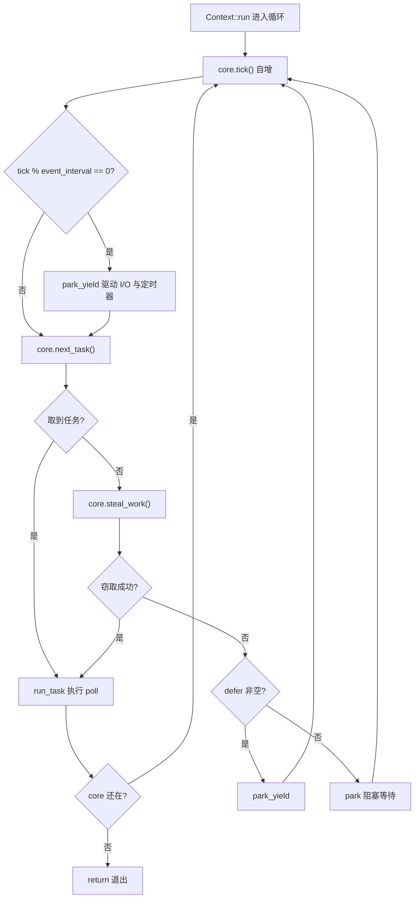
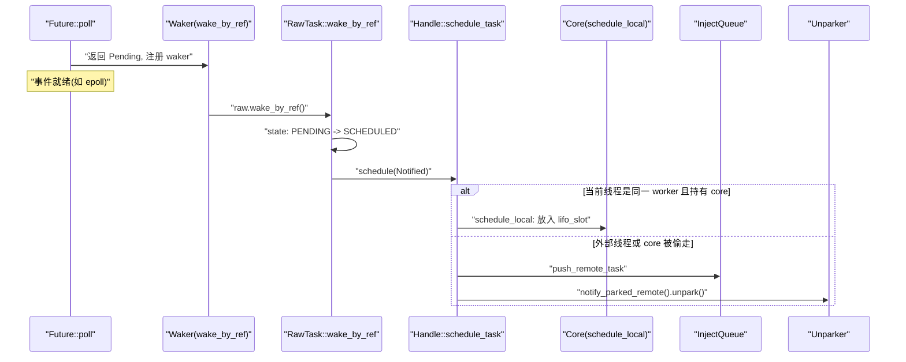
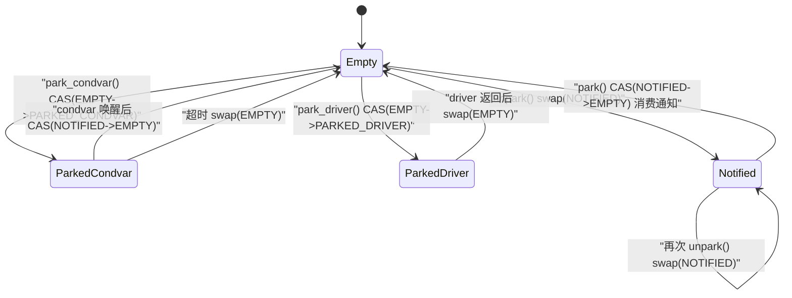

# 第 4 章：任務的一生（下）：排程迴圈、poll 與喚醒的閉環

# 從佇列到執行：worker 主迴圈的骨架

上一章我們把任務送進了`Local`佇列或全域注入佇列。但佇列只是「待辦清單」，真正讓任務跑起來的，是 worker 執行緒裡那個永不停止的迴圈。這一章我們追蹤`Context::run`——它是整個多執行緒排程器的心臟。

先建立直覺：worker 執行緒就像一個廚師，面前有一疊自己的訂單（`run_queue`），旁邊還有一個公共訂單架（`inject`）。廚師先看自己手邊最近的一張（`lifo_slot`），沒有就從自己那疊拿，再沒有就去公共架抓一把，還不行就去別的廚師那疊裡偷幾張。全都空了他才去休息，但休息時耳朵還豎著——一有訂單進來就立刻醒來。

若沒有這個迴圈，任務被入隊後就永遠躺在佇列裡，`Future::poll`永遠不會被呼叫，整個執行時就是一堆死資料。

## Core 的記憶體佈局與狀態欄位

worker 的可變狀態全部裝在`Core`裡，它被`Box`分配在堆上，透過`AtomicCell<Core>`在`Worker`與執行緒本地`Context`之間傳遞。

`Core`的關鍵欄位如下[FACT:tokio/src/runtime/scheduler/multi_thread/worker.rs:113-167]：

- `tick: u32`：每次迴圈自增，用於週期性觸發維護（`maintenance`）和全域佇列檢查。
- `lifo_slot: Option<Notified>`：**LIFO 槽位**，這是本章最精妙的設計。當 worker 自己排程一個任務時，它不進`run_queue`，而是放進這個槽位，下次取任務時**優先**從這裡拿。
- `lifo_enabled: bool`：LIFO 槽位的開關，用於防止 ping-pong 場景下的飢餓。
- `run_queue: queue::Local<Arc<Handle>>`：本地佇列，上一章剖析過的`Local`結構。
- `is_searching: bool`：worker 是否正在搜尋可竊取的任務。
- `is_shutdown: bool` / `is_traced: bool`：關閉與追蹤標誌。
- `park: Option<Parker>`：park 器，用`Option`包裹是為了在借用檢查器下方便地取出/放回。
- `global_queue_interval: u32`：多久檢查一次全域佇列。
- `rand: FastRand`：快速隨機數生成器，用於隨機選擇竊取起點。

> **[Design Inference & Architectural Trade-offs]**
> 注意`lifo_slot`是`Option<Notified>`而非佇列——它只存**一個**任務。這個設計動機在原始碼註解裡說得很清楚[FACT:tokio/src/runtime/scheduler/multi_thread/worker.rs:117-121]：worker 自己排程的任務存進這個槽位，worker 會在檢查`run_queue` **之前**先檢查它，效果是「最後被排程的任務下一個執行」（LIFO）。這是為了改善局部性，對訊息傳遞模式特別有效，能降低延遲。

為什麼 LIFO 能降低延遲？考慮一個典型的訊息傳遞場景：任務 A 處理完訊息後喚醒任務 B，B 處理完又喚醒 A。如果 A 喚醒 B 後 B 立刻執行，B 需要的資料很可能還在 CPU 快取裡（因為 A 剛碰過）。如果 B 被塞到佇列尾部，等前面幾十個任務跑完，快取早被沖掉了。

但 LIFO 有飢餓風險。原始碼用`MAX_LIFO_POLLS_PER_TICK = 3`來限制[FACT:tokio/src/runtime/scheduler/multi_thread/worker.rs:263-263]：每個 tick 最多優先 LIFO 槽位 3 次，超過就停用，讓其他任務有機會執行。

## 主迴圈 walkthrough：一次完整的排程週期

我們代入一個具體場景：worker 0 剛從`park`中醒來，`run_queue`裡有 5 個任務，`lifo_slot`裡有 1 個任務，全域佇列有 3 個任務。

主迴圈入口是`Context::run` [FACT:tokio/src/runtime/scheduler/multi_thread/worker.rs:570-642]。它先重置`lifo_enabled`（因為 core 可能被`block_in_place`偷走過，狀態需要歸位）[FACT:tokio/src/runtime/scheduler/multi_thread/worker.rs:571-573]，然後進入`while !core.is_shutdown`迴圈。

每輪迴圈做四件事：

**第一步：tick 與維護。** `core.tick()`自增計數器[FACT:tokio/src/runtime/scheduler/multi_thread/worker.rs:587]。接著`self.maintenance(core)`檢查`tick % event_interval == 0`，若是則呼叫`park_yield`以 0 逾時驅動 I/O 和定時器[FACT:tokio/src/runtime/scheduler/multi_thread/worker.rs:809-826]。

**第二步：取任務。** `core.next_task(&self.worker)`是核心取任務邏輯[FACT:tokio/src/runtime/scheduler/multi_thread/worker.rs:1090-1156]。它分兩條路徑：

- 當`tick % global_queue_interval == 0`時，**優先**從全域佇列取，取不到再取本地[FACT:tokio/src/runtime/scheduler/multi_thread/worker.rs:1091-1098]。這是為了防止全域佇列裡的任務被餓死。
- 否則**優先**取本地任務[FACT:tokio/src/runtime/scheduler/multi_thread/worker.rs:1090-1156]。

本地取任務由`next_local_task`完成[FACT:tokio/src/runtime/scheduler/multi_thread/worker.rs:1158-1160]：

```rust
fn next_local_task(&mut self) -> Option {
    self.lifo_slot.take().or_else(|| self.run_queue.pop())
}
```

先取 LIFO 槽位，再取佇列頭部（LIFO 彈出）。這就是上一章說的「本地 LIFO」。

如果本地為空但全域佇列非空，worker 會**批次**從全域佇列拉取任務[FACT:tokio/src/runtime/scheduler/multi_thread/worker.rs:1110-1154]。批次大小`n`的計算很講究：`min(inject.len() / remotes.len() + 1, cap)`，其中`cap`又取`min(remaining_slots, max_capacity / 2)`。原始碼註解解釋了為什麼限制在佇列容量的一半[FACT:tokio/src/runtime/scheduler/multi_thread/worker.rs:1120-1131]：確保拉取的任務落在本地佇列的**前半部分**，這樣即使後續發生溢出，這些任務也不會被推回全域佇列（溢出只影響後半部分）。

**第三步：執行任務。**拿到任務後呼叫`run_task` [FACT:tokio/src/runtime/scheduler/multi_thread/worker.rs:647-796]。這是本章最複雜的函式，我們下一節專門展開。

**第四步：竊取或 park。**如果`next_task`返回`None`，說明本地和全域都沒活了，呼叫`steal_work` [FACT:tokio/src/runtime/scheduler/multi_thread/worker.rs:1167-1195]。竊取失敗則進入`park`或`park_yield` [FACT:tokio/src/runtime/scheduler/multi_thread/worker.rs:613-621]。

整個控制流如下：



## run_task：poll 與 LIFO 槽位的閉環

`run_task`是任務真正被`poll`的地方，也是「喚醒 → 入隊 → 再 poll」閉環的收口點。

進入函式後第一件事是`assert_owner` [FACT:tokio/src/runtime/scheduler/multi_thread/worker.rs:648]，把`Notified`轉換成`Task`，同時斷言當前執行緒確實是這個任務的 owner（debug 斷言）。

接著`transition_from_searching` [FACT:tokio/src/runtime/scheduler/multi_thread/worker.rs:652]——如果 worker 之前在搜尋狀態，現在找到任務了，要退出搜尋狀態，並可能喚醒其他 parked worker。

然後是關鍵的 budget 包裹[FACT:tokio/src/runtime/scheduler/multi_thread/worker.rs:695-795]：

```rust
coop::budget(|| {
    task.run();
    let mut lifo_polls = 0;
    loop {
        let mut core = match self.core.borrow_mut().take() {
            Some(core) => core,
            None => return ControlFlow::Break(()),
        };
        let task = match core.lifo_slot.take() {
            Some(task) => task,
            None => {
                self.reset_lifo_enabled(&mut core);
                core.stats.end_poll();
                return ControlFlow::Continue(core);
            }
        };
        if !coop::has_budget_remaining() {
            core.run_queue.push_back_or_overflow(task, ...);
            return ControlFlow::Continue(core);
        }
        lifo_polls += 1;
        if lifo_polls >= MAX_LIFO_POLLS_PER_TICK {
            core.lifo_enabled = false;
        }
        let task = self.worker.handle.shared.owned.assert_owner(task);
        *self.core.borrow_mut() = Some(core);
        task.run();
    }
})
```

這段程式碼揭示了 LIFO 槽位的完整閉環：`task.run()`執行`Future::poll`，poll 過程中如果任務喚醒了自己或別的任務，`schedule_local`會把新任務放進`lifo_slot` [FACT:tokio/src/runtime/scheduler/multi_thread/worker.rs:1396-1408]。poll 返回後，迴圈立刻檢查`lifo_slot`，如果有任務就繼續跑——**不回到主迴圈**，直接在同一個 budget 內連續 poll。

這就是「喚醒 → 入隊 → 再 poll」在 LIFO 路徑上的體現：喚醒時任務被放進`lifo_slot`，poll 返回後立即被取出再 poll，形成緊密的閉環。

注意`self.core.borrow_mut().take()`的`None`分支[FACT:tokio/src/runtime/scheduler/multi_thread/worker.rs:716-724]：如果 core 被偷走了（比如任務裡呼叫了`block_in_place`），worker 必須返回`ControlFlow::Break(())`，讓`Context::run`退出。這是`block_in_place`與調度循環的交互點。

## 喚醒路徑：Waker 如何觸發重新入隊

當`Future::poll`返回`Pending`時，任務需要註冊一個`Waker`，等事件就緒時被喚醒。Tokio 的`Waker`實現極其精簡——它就是一個指向任務`Header`的裸指標加一張 vtable。

`waker_ref`構造`WakerRef` [FACT:tokio/src/runtime/task/waker.rs:11-34]，用`ManuallyDrop`包裹`Waker`避免 drop 時減引用計數。vtable 是靜態的[FACT:tokio/src/runtime/task/waker.rs:119-119]：

```rust
static WAKER_VTABLE: RawWakerVTable =
    RawWakerVTable::new(clone_waker, wake_by_val, wake_by_ref, drop_waker);
```

四個函數都只是把裸指標還原成`Header`，然後調用`RawTask`的對應方法[FACT:tokio/src/runtime/task/waker.rs:70-116]。比如`wake_by_ref`最終調用`raw.wake_by_ref()` [FACT:tokio/src/runtime/task/waker.rs:106-116]。

`wake_by_ref`的語義是：把任務狀態從`PENDING`轉為`SCHEDULED`，如果轉換成功（即之前確實是 PENDING），就調用`Schedule::schedule`把任務重新入隊。

對於多線程調度器，`schedule`的實現在`Handle::schedule_task` [FACT:tokio/src/runtime/scheduler/multi_thread/worker.rs:1353-1376]：

```rust
pub(super) fn schedule_task(&self, task: Notified, is_yield: bool) {
    with_current(|maybe_cx| {
        if let Some(cx) = maybe_cx {
            if self.ptr_eq(&cx.worker.handle) {
                if let Some(core) = cx.core.borrow_mut().as_mut() {
                    self.schedule_local(core, task, is_yield);
                    return;
                }
            }
        }
        self.push_remote_task(task);
        self.notify_parked_remote();
    });
}
```

邏輯分兩支：

- 如果當前線程就是這個調度器的 worker，且持有 core，走`schedule_local` [FACT:tokio/src/runtime/scheduler/multi_thread/worker.rs:1385-1417]——放進 LIFO 槽位或本地隊列。
- 否則（從外部線程喚醒，或 core 被偷走），走`push_remote_task`推入全局注入隊列，並`notify_parked_remote`喚醒一個 parked worker[FACT:tokio/src/runtime/scheduler/multi_thread/worker.rs:1379-1383]。

`schedule_local`內部又分兩支[FACT:tokio/src/runtime/scheduler/multi_thread/worker.rs:1385-1417]：如果是`yield`或 LIFO 已禁用，推入`run_queue`尾部；否則放進`lifo_slot`，並把原來槽位裡的任務擠到隊列尾部。



## park 與 unpark：狀態機與喚醒的原子性

worker 沒活幹時要 park，但 park/unpark 是最容易出競態的地方。Tokio 用`AtomicUsize`狀態機加`Condvar`兜底來解決。

`Inner`的字段[FACT:tokio/src/runtime/scheduler/multi_thread/park.rs:31-43]：`state: AtomicUsize`、`mutex: Mutex<()>`、`condvar: Condvar`、`shared: Arc<Shared>`。狀態常量有四個[FACT:tokio/src/runtime/scheduler/multi_thread/park.rs:36-45]：

- `EMPTY = 0`：未 park。
- `PARKED_CONDVAR = 1`：在 condvar 上 park。
- `PARKED_DRIVER = 2`：在 I/O driver 上 park。
- `NOTIFIED = 3`：已被喚醒。

這是一個顯式狀態機，我們用它畫狀態圖（這是本章唯一符合`stateDiagram-v2`准入條件的地方——源碼裡確實有這四個狀態常量）：



`unpark`的實現[FACT:tokio/src/runtime/scheduler/multi_thread/park.rs:277-290]用`swap`而非 CAS，源碼註釋解釋了原因[FACT:tokio/src/runtime/scheduler/multi_thread/park.rs:277-290]：必須執行 release 操作讓 park 線程觀察到 unpark 之前的寫入，所以即使 state 已經是`NOTIFIED`也要寫一次。

`park`先嘗試消費已有的通知[FACT:tokio/src/runtime/scheduler/multi_thread/park.rs:132-149]：如果 CAS`NOTIFIED -> EMPTY`成功，說明之前已被喚醒，直接返回不阻塞。否則嘗試拿 driver 鎖，拿到就在 driver 上 park，拿不到就用 condvar 兜底[FACT:tokio/src/runtime/scheduler/multi_thread/park.rs:143-148]。

`park_condvar`裡有個經典的雙重檢查[FACT:tokio/src/runtime/scheduler/multi_thread/park.rs:162-180]：先 CAS`EMPTY -> PARKED_CONDVAR`，如果失敗且是`NOTIFIED`，說明在設置狀態前就被喚醒了，此時必須`swap(EMPTY)`來同步 unpark 的寫入[FACT:tokio/src/runtime/scheduler/multi_thread/park.rs:167-177]。註釋特別強調：即使知道是`NOTIFIED`也必須讀一次，因為 unpark 可能在我們讀`NOTIFIED`之後又被調用了一次。

`unpark_condvar`的註釋[FACT:tokio/src/runtime/scheduler/multi_thread/park.rs:292-307]點出了 condvar 的經典陷阱：parked 線程設置`PARKED`狀態和真正`wait`之間有窗口期，如果在這期間 notify 會被忽略。解決方案是 park 線程此時持有`mutex`，unpark 線程先`drop(self.mutex.lock())`獲取鎖（從而等待 park 線程釋放），再`notify_one`。

# 設計思考：為什麼 LIFO 槽位是單槽而非隊列

> **[Design Inference & Architectural Trade-offs]**
> 單槽設計是刻意的權衡。如果用隊列，每次喚醒都要入隊、每次取任務都要出隊，開銷更大；而且隊列會積累多個任務，破壞「最近喚醒的最先跑」這個局部性假設。單槽的語義是「只記住最近一個」，被擠出的任務進普通隊列——這恰好符合局部性收益遞減的規律：最近一個任務最熱，第二個次之，第三個往後收益就很小了。

`MAX_LIFO_POLLS_PER_TICK = 3`這個魔數[FACT:tokio/src/runtime/scheduler/multi_thread/worker.rs:263-263]也是經驗值。源碼註釋說「跑幾次 LIFO 槽位似乎足以受益於局部性，超過 3 次可能過度加權」。這防止了 A 喚醒 B、B 喚醒 A 的 ping-pong 場景把其他任務餓死。

另一個值得注意的設計是`steal_work`的「半數搜索」策略[FACT:tokio/src/runtime/scheduler/multi_thread/worker.rs:1158-1160]：只有當不到一半的 worker 在搜索時，新 worker 才真正嘗試竊取。這避免了所有 worker 同時瘋狂竊取導致的 CAS 爭用。`transition_to_searching`通過`idle.transition_worker_to_searching()`來協調[FACT:tokio/src/runtime/scheduler/multi_thread/worker.rs:1197-1203]。

竊取從隨機起點開始[FACT:tokio/src/runtime/scheduler/multi_thread/worker.rs:1172-1174]，遍歷所有 remote，跳過自己[FACT:tokio/src/runtime/scheduler/multi_thread/worker.rs:1179-1182]，調用`steal_into`嘗試竊取。全部失敗後回退到全局隊列[FACT:tokio/src/runtime/scheduler/multi_thread/worker.rs:1197-1203]。

# 本章小結

worker 主循環`Context::run`是調度器的心臟：每輪 tick 後先取任務（LIFO 槽位 → 本地隊列 → 全局隊列），取到就`run_task`執行 poll，取不到就竊取，竊取失敗就 park。`run_task`內部的 LIFO 循環把「喚醒 → 入隊 → 再 poll」壓縮在同一個 budget 內，形成低延遲閉環。`Waker`是裸指標加靜態 vtable，`wake_by_ref`通過狀態轉換觸發`schedule`，根據當前線程是否是同一 worker 決定走本地隊列還是全局隊列。`park`/`unpark`用四狀態原子機加 condvar 兜底，解決了喚醒丟失的經典競態。

下一章我們將離開調度器，進入 I/O 世界：Reactor 如何把 epoll 事件翻譯成`Waker`喚醒，讓`AsyncFd`的`Pending`變成`Ready`。

# 本章思考與自測

Q1: 如果把`next_local_task`改成先取`run_queue`再取`lifo_slot`，在訊息傳遞密集的場景下會有什麼後果？

**參考解析**：`next_local_task`當前實作是`self.lifo_slot.take().or_else(|| self.run_queue.pop())` [FACT:tokio/src/runtime/scheduler/multi_thread/worker.rs:1158-1160]，先取 LIFO 槽位。如果反過來先取`run_queue`，那麼剛被喚醒、資料還熱的任務會被排到佇列裡其他任務之後執行。在 A→B→A 的訊息傳遞模式下，B 被喚醒後不會立即執行，而是等佇列裡其他任務跑完，此時 A 寫入的資料可能已被擠出 CPU 快取，局部性收益喪失。更嚴重的是，`lifo_slot`裡的任務會一直等到`run_queue`清空才被執行，延遲顯著上升。原始碼註解[FACT:tokio/src/runtime/scheduler/multi_thread/worker.rs:117-121]明確指出這個順序是為了「改善局部性，受益於訊息傳遞模式並降低延遲」。

Q2: `park_condvar`中，如果去掉`Err(NOTIFIED)`分支裡的`self.state.swap(EMPTY, SeqCst)`，只保留`return`，會有什麼問題？

**參考解析**：原始碼在`Err(NOTIFIED)`分支裡執行`let old = self.state.swap(EMPTY, SeqCst)` [FACT:tokio/src/runtime/scheduler/multi_thread/park.rs:167-177]。註解解釋[FACT:tokio/src/runtime/scheduler/multi_thread/park.rs:168-173]：unpark 可能在我們讀到`NOTIFIED`之後又被呼叫了一次，必須執行一次 acquire 操作與那個 unpark 同步，才能觀察到它之前的所有寫入。如果只`return`不 swap，state 會停留在`NOTIFIED`，下一次 park 時 CAS`NOTIFIED -> EMPTY`會成功並立即返回（消費了一個已經過期的通知），但更糟的是 unpark 的 release 寫入沒有被同步，park 執行緒可能看不到 unpark 之前寫入的資料，導致記憶體可見性問題。這是典型的「丟失喚醒 + 記憶體序」雙重 bug。

Q3: `run_task`中，當`self.core.borrow_mut().take()`返回`None`時為什麼返回`ControlFlow::Break(())`而不是`Continue`？

**參考解析**：`self.core.borrow_mut().take()`返回`None`意味著 core 已經被偷走[FACT:tokio/src/runtime/scheduler/multi_thread/worker.rs:716-724]。core 被偷走的唯一途徑是任務內部呼叫了`block_in_place`，它會透過`maybe_move_runtime`把 core 從`cx.core`取出並交給新執行緒[FACT:tokio/src/runtime/scheduler/multi_thread/worker.rs:473-497]。此時當前執行緒已經不再持有排程能力，如果返回`Continue`，`Context::run`會繼續迴圈並呼叫`core.next_task()`等需要 core 的方法，但 core 已經不在`self.core`裡了，會導致 panic 或狀態不一致。返回`Break`讓`Context::run`直接`return` [FACT:tokio/src/runtime/scheduler/multi_thread/worker.rs:594-597]，把控制權交還給`run`函式，由它處理後續（比如`cx.defer.wake()` [FACT:tokio/src/runtime/scheduler/multi_thread/worker.rs:564]）。註解也說明[FACT:tokio/src/runtime/scheduler/multi_thread/worker.rs:719-721]：此時不能呼叫`reset_lifo_enabled`，因為 core 被偷走了，偷走者會在`Context::run`頂部處理。
