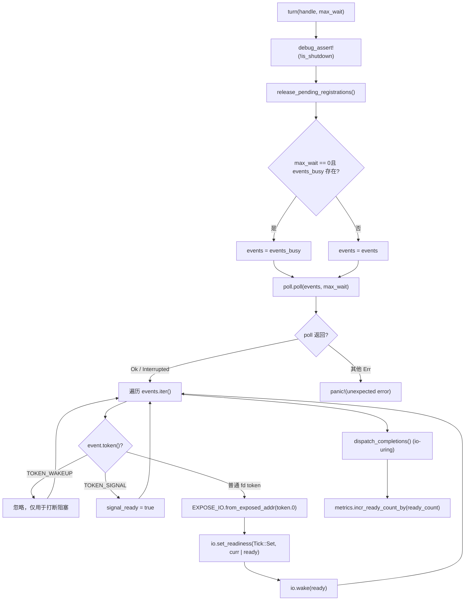
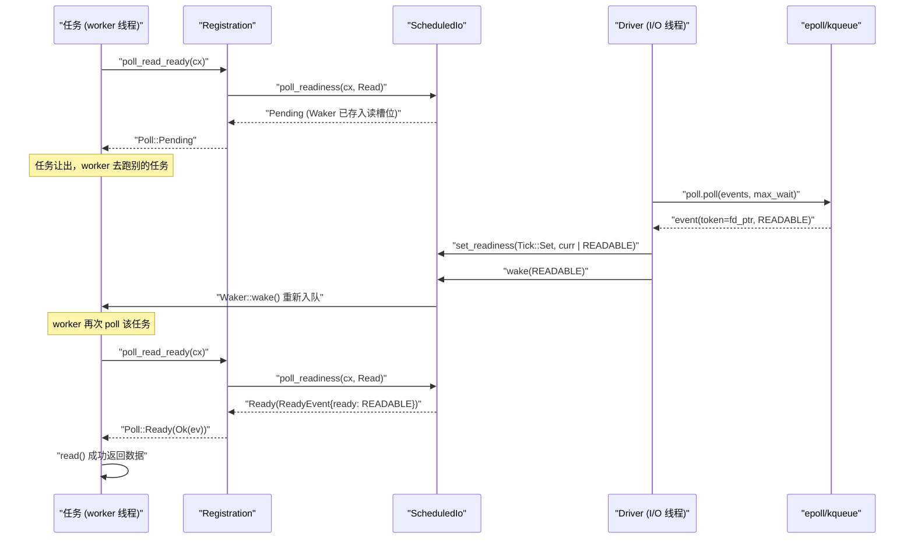

# 第 5 章：I/O 就緒通知：Reactor 如何把 epoll 事件翻譯成 Waker 喚醒

上一章我們追蹤了 worker 執行緒的主迴圈：任務被 poll，返回 Pending 時把 Waker 存進某個地方，事件就緒後 Waker 被觸發，任務重新入佇列。但「某個地方」到底是哪裡？Waker 怎麼在 epoll 事件到來時被找回來？這正是 Reactor 要回答的問題。先建立直覺模型：把整個 I/O 就緒通知機制想像成一家餐廳的取餐叫號系統——顧客（任務）點完餐後不會站在窗口死等，而是拿一個震動器（Waker）回座位；後廚（核心 epoll）做好餐後，前台（Reactor）根據訂單號（Token）找到對應的震動器並按下按鈕。若沒有這套系統，每個任務只能輪詢 socket，CPU 會被燒光；或者用阻塞執行緒等待，一個連線一個執行緒，規模上不去。Tokio 的 Reactor 由三個檔案構成三層結構，職責嚴格分離：driver.rs 是事件迴圈本體，持有 mio::Poll，負責呼叫 poll() 阻塞等待核心事件，並把事件翻譯成對 ScheduledIo 的讀寫；registration.rs 是面向使用者的註冊句柄，TcpStream 內部持有的就是它，提供 poll_read_ready / poll_write_ready 等 API；scheduled_io.rs 是每個 fd 的狀態槽，儲存讀寫就緒位與 Waker 列表，是事件與任務之間的橋樑。模組組裝關係可參考 tokio/src/runtime/io/mod.rs:5-16：driver 匯出 Driver、Handle、ReadyEvent，registration 匯出 Registration，scheduled_io 匯出 ScheduledIo。下圖錨定了本章要追蹤的完整資料流：TcpStream → Registration → ScheduledIo → Handle/Driver → 核心 → 回到 ScheduledIo → Waker。接下來我們逐層拆解。

# 驅動層：`Driver`與`Handle`的職責切分

## 直覺模型

`Driver`是**唯一擁有`mio::Poll`的實體**，它只能在單個執行緒裡被`&mut`存取——這是事件迴圈的獨佔性要求。而`Handle`是**可複製、可跨執行緒共享的註冊入口**，任何執行緒想註冊新 fd 都透過它。若沒有這個切分，要麼把`mio::Poll`加鎖（每次註冊都競爭），要麼讓所有註冊都回到 driver 執行緒（引入跨執行緒訊息佇列）。Tokio 選擇讓`Handle`直接持有`mio::Registry`的複製，註冊操作可以並行進行，只有真正的事件等待才需要獨佔。

## 記憶體佈局與欄位

先看`Driver`的欄位[FACT:tokio/src/runtime/io/driver.rs:25-38]：

- `signal_ready: bool`：Unix 訊號事件是否到達，用於 signal 驅動。
- `events: mio::Events`：主事件緩衝區，跨`turn`呼叫複用，避免每次分配。
- `events_busy: Option<mio::Events>`：**非阻塞 poll 專用緩衝區**，僅當`max_io_events_per_busy_tick`被設定時存在。
- `poll: mio::Poll`：核心事件佇列的封裝。

再看`Handle` [FACT:tokio/src/runtime/io/driver.rs:41-75]：

- `registry: mio::Registry`：`mio::Poll::registry()`的複製，用於`register`/`deregister`。
- `registrations: RegistrationSet`：所有活躍註冊的集合，負責分配`Token`與`ScheduledIo`。
- `synced: Mutex<registration_set::Synced>`：保護`RegistrationSet`的同步狀態。
- `waker: mio::Waker`：用於從任意執行緒喚醒阻塞在`turn`裡的 driver。
- `metrics: IoDriverMetrics`：統計 fd 數量、就緒事件數。

這裡有個關鍵設計：`events_busy`的存在[FACT:tokio/src/runtime/io/driver.rs:25-38]是為了解決**非阻塞 poll 會吞掉事件**的問題。註解[FACT:tokio/src/runtime/io/driver.rs:189-190]說得很清楚：非阻塞 poll 取走的事件如果留在主緩衝區裡，下次 poll 就看不到了；用獨立緩衝區，未處理的事件仍留在核心佇列，下次 poll 會重新返回。

## Step-by-Step：一次`turn`的執行

`turn`是 driver 的核心函式[FACT:tokio/src/runtime/io/driver.rs:184-261]。假設 worker 執行緒發現沒有任務可跑，呼叫`park` → `turn(handle, None)`阻塞等待：

**第一步**：斷言未 shutdown[FACT:tokio/src/runtime/io/driver.rs:185]，並釋放待清理的註冊[FACT:tokio/src/runtime/io/driver.rs:187]。`release_pending_registrations`檢查`needs_release()`，若有則呼叫`registrations.release()` [FACT:tokio/src/runtime/io/driver.rs:336-340]。

**第二步**：選擇事件緩衝區[FACT:tokio/src/runtime/io/driver.rs:191-194]。若`max_wait`是零且`events_busy`存在，用 busy 緩衝區；否則用主緩衝區。

**第三步**：呼叫`self.poll.poll(events, max_wait)` [FACT:tokio/src/runtime/io/driver.rs:198]。這是真正阻塞在 epoll_wait 的地方。錯誤處理很克制：`Interrupted`直接忽略（訊號打斷是正常的）[FACT:tokio/src/runtime/io/driver.rs:200]，WASI 下的`InvalidInput`也忽略[FACT:tokio/src/runtime/io/driver.rs:201-205]，其他錯誤直接 panic[FACT:tokio/src/runtime/io/driver.rs:206]。

**第四步**：遍歷事件[FACT:tokio/src/runtime/io/driver.rs:211-233]。對每個`event`：

- 若`token == TOKEN_WAKEUP`（值為 0）[FACT:tokio/src/runtime/io/driver.rs:214]，什麼都不做——這是`unpark`用來打斷阻塞的。
- 若`token == TOKEN_SIGNAL`（值為 1）[FACT:tokio/src/runtime/io/driver.rs:216]，置`signal_ready = true`。
- 否則是一般 I/O 事件[FACT:tokio/src/runtime/io/driver.rs:218-231]：把`mio::Ready`轉成 Tokio 的`Ready`，用`EXPOSE_IO.from_exposed_addr(token.0)`把 token 還原成`*const ScheduledIo`指標，然後`set_readiness(Tick::Set, |curr| curr | ready)`累積就緒位，再`io.wake(ready)`觸發對應方向的`Waker`。

這裡`EXPOSE_IO`是一個`PtrExposeDomain<ScheduledIo>` [FACT:tokio/src/runtime/io/mod.rs:21-22]，它把指標「暴露」成一個`usize`作為`mio::Token`。安全性註解[FACT:tokio/src/runtime/io/driver.rs:222-225]說明了為什麼這個 unsafe 轉換是安全的：指標在從 mio 註銷**且**driver 不再並行 poll 之前不會被釋放，且 driver 持有`Arc<ScheduledIo>`的所有權。

**第五步**：處理 io_uring 完成佇列（僅 Linux + tokio_unstable）[FACT:tokio/src/runtime/io/driver.rs:235-258]，包括 CQ 溢出時的 flush 迴圈。

**第六步**：累加 metrics[FACT:tokio/src/runtime/io/driver.rs:265-267]。



## 設計思考：為什麼`Handle`要持有`mio::Waker`

`unpark` [FACT:tokio/src/runtime/io/driver.rs:280-283]呼叫`self.waker.wake()`。這個`mio::Waker`在`Driver::new`時用`TOKEN_WAKEUP`註冊[FACT:tokio/src/runtime/io/driver.rs:124]。當 driver 阻塞在`poll.poll()`裡時，另一個執行緒呼叫`unpark`會往 epoll 裡塞一個`TOKEN_WAKEUP`事件，`poll`立即返回，遍歷時看到這個 token 直接跳過[FACT:tokio/src/runtime/io/driver.rs:214-215]。

> **[Design Inference & Architectural Trade-offs]**
> 這個機制在`deregister_source`裡被用到[FACT:tokio/src/runtime/io/driver.rs:315-334]：註銷一個 source 後，如果`registrations.deregister`返回 true（表示這是最後一個引用），就`unpark()`。為什麼？ 因為 driver 可能正阻塞在`poll`裡等待這個 fd 的事件，而 fd 已經被註銷，核心不會再產生事件；必須主動喚醒 driver，讓它重新檢查註冊集合併可能退出阻塞。否則 driver 會一直睡到`max_wait`逾時，延遲 shutdown。

另一個細節：`deregister_source`先呼叫`self.registry.deregister(source)` [FACT:tokio/src/runtime/io/driver.rs:322]，再清理`registrations` [FACT:tokio/src/runtime/io/driver.rs:315-334]。註解[FACT:tokio/src/runtime/io/driver.rs:320-321]說「Cleanup ALWAYS happens」——即使 OS 層 deregister 失敗，也要清理內部狀態，最後才返回 OS 錯誤[FACT:tokio/src/runtime/io/driver.rs:336-340]。這是典型的**資源清理優先於錯誤傳播**模式。

# 註冊層：`Registration`如何把`Waker`存進`ScheduledIo`

## 直覺模型

`Registration`是**任務與 fd 之間的契約**。它持有兩個東西：一個`scheduler::Handle`（用於在需要時存取 runtime），一個`Arc<ScheduledIo>`（fd 的狀態槽）。當任務呼叫`poll_read_ready`時，`Registration`把`Waker`交給`ScheduledIo`保管；當 driver 收到事件時，從`ScheduledIo`裡取出`Waker`喚醒。

## 記憶體佈局與欄位

`Registration`只有兩個欄位[FACT:tokio/src/runtime/io/registration.rs:46-54]：

- `handle: scheduler::Handle`：runtime 句柄，註解[FACT:tokio/src/runtime/io/registration.rs:46-54]說「TODO: this can probably be moved into ScheduledIo」，說明作者認為這個欄位位置可以最佳化。
- `shared: Arc<ScheduledIo>`：共享狀態，`Arc`保證 driver 和任務都能存取。

> **[Design Inference & Architectural Trade-offs]**
> 注意`Registration`手動實作了`Send`和`Sync` [FACT:tokio/src/runtime/io/registration.rs:57-58]。為什麼需要 unsafe impl？ 因為`scheduler::Handle`內部可能包含非`Send`/`Sync`的欄位（比如`Rc`），但`Registration`的使用場景要求它能跨執行緒。文件註解[FACT:tokio/src/runtime/io/registration.rs:28-33]給出了關鍵約束：**呼叫者必須保證最多兩個任務並行使用同一個`Registration`**，一個讀、一個寫。違反這個約束雖然記憶體安全，但會導致通知遺失和任務掛起。

## Step-by-Step：`poll_read_ready`的呼叫鏈

假設任務在`TcpStream::poll_read`裡發現 socket 沒資料，需要註冊讀興趣。呼叫鏈是`TcpStream::poll_read_priv` → `PollEvented::poll_read` → `Registration::poll_read_io` → `poll_io` → `poll_ready`。

`poll_ready`是核心[FACT:tokio/src/runtime/io/registration.rs:155-171]：

**第一步**：`trace_leaf()` [FACT:tokio/src/runtime/io/registration.rs:160]，用於 tracing 埋點。

**第二步**：`coop::poll_proceed(cx)` [FACT:tokio/src/runtime/io/registration.rs:155-171]。這是第 12 章要講的協作式預算機制。如果預算耗盡，返回`Pending`並註冊一個特殊的`Waker`，讓任務在下一輪被重新調度。

**第三步**：`self.shared.poll_readiness(cx, direction)` [FACT:tokio/src/runtime/io/registration.rs:155-171]。這是真正與`ScheduledIo`互動的地方：檢查當前就緒位，若已就緒立即返回`Ready`；否則把`cx.waker()`存進`ScheduledIo`的對應方向槽位，返回`Pending`。

**第四步**：檢查`ev.is_shutdown` [FACT:tokio/src/runtime/io/registration.rs:155-171]。若 runtime 正在關閉，返回`RUNTIME_SHUTTING_DOWN_ERROR`。

**第五步**：`coop.made_progress()` [FACT:tokio/src/runtime/io/registration.rs:169]，標記預算消耗，返回就緒事件。

`poll_io`在`poll_ready`之上加了一層重試迴圈[FACT:tokio/src/runtime/io/registration.rs:173-192]：

```rust
loop {
    let ev = ready!(self.poll_ready(cx, direction))?;
    match f() {
        Ok(ret) => return Poll::Ready(Ok(ret)),
        Err(ref e) if e.kind() == io::ErrorKind::WouldBlock => {
            self.clear_readiness(ev);
        }
        Err(e) => return Poll::Ready(Err(e)),
    }
}
```

這裡體現了**readiness 是提示而非保證**的核心思想：`poll_ready`說可讀，但真正`read()`時可能返回`WouldBlock`（比如另一個執行緒搶先讀走了資料）。此時必須`clear_readiness(ev)` [FACT:tokio/src/runtime/io/registration.rs:187]清掉就緒位，然後迴圈重新等待。若不清，任務會陷入「以為可讀 → read 失敗 → 又以為可讀」的忙迴圈。

## 設計思考：`try_io`與`async_io`的分工

`try_io` [FACT:tokio/src/runtime/io/registration.rs:194-213]是同步版本：先`ready_event(interest)`檢查就緒位，若為空直接返回`WouldBlock` [FACT:tokio/src/runtime/io/registration.rs:194-213]；否則執行`f()`，若`f()`返回`WouldBlock`則清就緒位[FACT:tokio/src/runtime/io/registration.rs:207-210]。它**不註冊 Waker**，適合`try_read`這類「試一下就走」的場景。

`async_io` [FACT:tokio/src/runtime/io/registration.rs:225-245]是異步版本：`readiness(interest).await`會註冊 Waker 並等待，然後執行`f()`，`WouldBlock`時清就緒位並迴圈。注意它在迴圈裡還呼叫了`coop::poll_proceed` [FACT:tokio/src/runtime/io/registration.rs:233]，防止在大量`WouldBlock`重試中耗盡預算。

## 生產踩坑：`Drop`裡的 Waker 清理

`Registration::drop` [FACT:tokio/src/runtime/io/registration.rs:253-262]呼叫`self.shared.clear_wakers()`。註釋[FACT:tokio/src/runtime/io/registration.rs:253-262]解釋了原因：`ScheduledIo`裡存的`Waker`可能持有`Arc<driver::Inner>`，而`driver::Inner`又持有`ScheduledIo`，形成循環引用。清理 Waker 是打破循環的手段。但註釋也承認這是「imperfect solution」——如果`Registration`本身被存進了`Waker`，循環仍然存在。這是 tokio-rs/tokio#3481 討論的問題。

> **[Design Inference & Architectural Trade-offs]**
> 生產環境中的表現是：如果大量連線被 drop 但 runtime 未退出，記憶體不會立即回收，直到下一次`clear_wakers`或 runtime shutdown。對於長連線服務，這通常不是問題；但對於短連線高頻建立/銷毀的場景，需要關注`ScheduledIo`的回收時機。

# 從`TcpStream::read`到`Waker`喚醒的完整鏈路

## 直覺模型

現在把三層串起來。使用者在`TcpStream`上呼叫`.read().await`，實際執行的是`AsyncRead::poll_read` → `PollEvented::poll_read` → `Registration::poll_read_io`。當資料沒到時，`Waker`被存進`ScheduledIo`；當 epoll 報告可讀時，driver 從`ScheduledIo`取出`Waker`並喚醒，任務被重新調度，再次 poll 時`poll_readiness`發現就緒位已置，直接返回`Ready`，`read()`成功。

## Step-by-Step：一次完整的讀等待

**階段一：註冊興趣**。`TcpStream::new` [FACT:tokio/src/net/tcp/stream.rs:166-169]呼叫`PollEvented::new(connected)`，後者內部呼叫`Registration::new_with_interest_and_handle` [FACT:tokio/src/runtime/io/registration.rs:73-81]，進而`handle.driver().io().add_source(io, interest)` [FACT:tokio/src/runtime/io/registration.rs:73-81]。

`add_source` [FACT:tokio/src/runtime/io/driver.rs:288-312]做三件事：

1. `registrations.allocate(&mut synced.lock())`分配一個`ScheduledIo`，拿到`token` [FACT:tokio/src/runtime/io/driver.rs:293-294]。

2. `self.registry.register(source, token, interest.to_mio())`向核心註冊[FACT:tokio/src/runtime/io/driver.rs:298]。若失敗，**必須**把剛分配的`ScheduledIo`從集合裡移除[FACT:tokio/src/runtime/io/driver.rs:300-303]，否則洩漏。

3. `metrics.incr_fd_count()`計數[FACT:tokio/src/runtime/io/driver.rs:309]。

**階段二：等待就緒**。任務 poll`TcpStream::poll_read` [FACT:tokio/src/net/tcp/stream.rs:1492-1498] → `poll_read_priv` [FACT:tokio/src/net/tcp/stream.rs:1451-1458] → `PollEvented::poll_read` → `Registration::poll_read_io` [FACT:tokio/src/runtime/io/registration.rs:133-139] → `poll_io` → `poll_ready` → `ScheduledIo::poll_readiness`。此時若未就緒，`Waker`存入`ScheduledIo`的讀槽位，返回`Pending`。

**階段三：事件到達**。driver 的`turn`從`poll.poll()`拿到事件[FACT:tokio/src/runtime/io/driver.rs:198]，遍歷時對每個 fd 事件執行`io.set_readiness(Tick::Set, |curr| curr | ready)`和`io.wake(ready)` [FACT:tokio/src/runtime/io/driver.rs:228-229]。`wake`內部取出對應方向的`Waker`並呼叫`wake()`。

**階段四：任務重調度**。`Waker::wake()`把任務重新入隊到 worker 的本地佇列（上一章講過）。worker 再次 poll 該任務，`poll_readiness`發現就緒位已置，返回`Ready`，`read()`成功。



## 重要分支：`assume_ready`優化

`TcpStream::new_accepted` [FACT:tokio/src/net/tcp/stream.rs:174-181]是一個值得注意的優化。`accept`返回的 socket 天然可寫，且通常已經持有對端的第一批位元組。如果等 driver 的第一個事件，在高負載下這個事件可能排在所有已建立連線的事件後面，造成延遲。所以`new_accepted`直接呼叫`assume_ready(Ready::READABLE | Ready::WRITABLE)` [FACT:tokio/src/net/tcp/stream.rs:174-181]。

`assume_ready`的註釋[FACT:tokio/src/runtime/io/registration.rs:103-105]說：「A wrong guess costs one`WouldBlock`, which clears the readiness again.」——猜錯了代價只是一次`WouldBlock`，`poll_io`的迴圈會清掉就緒位並重新等待。這是一個**樂觀猜測 + 快速糾錯**的設計。

## 設計思考：為什麼 I/O 驅動與調度器解耦

> **[Design Inference & Architectural Trade-offs]**
> 從原始碼結構看，`Driver`和 worker 執行緒是分離的：`Driver`被放在 runtime 的某個專用位置（通常是`block_on`執行緒或專門的 I/O 執行緒），而 worker 執行緒只持有`Handle`。這種解耦帶來幾個好處：

1. **註冊無鎖化**：`Handle`持有`mio::Registry`克隆，任何 worker 都能並發註冊新 fd，不需要回到 driver 執行緒。

2. **事件等待集中化**：只有一個執行緒阻塞在`epoll_wait`，避免多執行緒同時 poll 同一個 epoll fd 的驚群問題。

3. **喚醒路徑短**：driver 收到事件後直接操作`ScheduledIo`並呼叫`Waker::wake()`，`wake()`內部把任務推入 worker 佇列，不需要跨執行緒訊息傳遞。

代價是`ScheduledIo`需要處理並發存取（`set_readiness`和`poll_readiness`可能同時發生），這透過原子操作和內部鎖解決。

## 生產踩坑：`is_shutdown`與`RUNTIME_SHUTTING_DOWN_ERROR`

`poll_ready`檢查`ev.is_shutdown` [FACT:tokio/src/runtime/io/registration.rs:155-171]，若為真返回`gone()` [FACT:tokio/src/runtime/io/registration.rs:265-267]，即`RUNTIME_SHUTTING_DOWN_ERROR`。

> **[Design Inference & Architectural Trade-offs]**
> 這個檢查的意義在於：runtime 關閉時，driver 的`shutdown` [FACT:tokio/src/runtime/io/driver.rs:174-182]會遍歷所有註冊並呼叫`io.shutdown()`，把`is_shutdown`置位並喚醒所有等待者。如果不檢查這個標誌，任務可能在 runtime 已經停止調度後仍然嘗試讀 socket，導致未定義行為或掛起。生產環境中，如果你看到`RUNTIME_SHUTTING_DOWN_ERROR`，通常意味著有任務在 runtime drop 之後仍在運行——檢查是否有`spawn`的任務沒有被正確 join。

另一個坑是`deregister_source`的`unpark` [FACT:tokio/src/runtime/io/driver.rs:328]。如果 driver 正阻塞在`poll`裡，且此時最後一個`Registration`被 drop，`unpark`會喚醒 driver。但如果 driver 不在阻塞狀態（比如正在處理其他事件），`unpark`只是讓下一次`turn`立即返回[FACT:tokio/src/runtime/io/driver.rs:280-283]。這個語意在`Handle::unpark`的文件註釋裡有說明。

# 設計思考：Reactor 的三個關鍵權衡

**權衡一：`Token`用指標而非索引**。`EXPOSE_IO.from_exposed_addr(token.0)` [FACT:tokio/src/runtime/io/driver.rs:220]把`mio::Token`直接當作`*const ScheduledIo`的地址。這避免了維護一個`Token → ScheduledIo`的映射表，查找是 O(1) 且無鎖。代價是安全性依賴嚴格的生命週期管理：指標必須在註銷且 driver 不再 poll 之後才能釋放[FACT:tokio/src/runtime/io/driver.rs:222-225]。

**權衡二：讀寫雙 Waker 槽位**。`Registration`文件[FACT:tokio/src/runtime/io/registration.rs:24-26]說「A registration instance represents two separate readiness streams」——讀和寫各有一個獨立的`Waker`槽位。這允許同一個 socket 的讀任務和寫任務分別註冊，互不干擾。但`poll_read_ready`的註釋[FACT:tokio/src/net/tcp/stream.rs:549-552]提醒：多次呼叫`poll_read_ready`/`poll_read`/`poll_peek`只有最後一次的`Waker`會被保留——讀方向只有一個槽位。

**權衡三：`events_busy`的獨立緩衝區**。測試[FACT:tokio/src/runtime/io/driver.rs:364-386]驗證了這個行為：`Driver::new(16, Some(2))`建立 busy 容量為 2 的 driver，註冊 5 個可讀 source 後，非阻塞`turn`只取 2 個事件[FACT:tokio/src/runtime/io/driver.rs:375-376]，剩餘 3 個留在核心佇列，下次阻塞`turn`取到[FACT:tokio/src/runtime/io/driver.rs:379-380]。這防止了非阻塞 poll 一次性吞掉所有事件導致後續 poll 飢餓。

# 本章小結

本章追蹤了`TcpStream::read`背後的完整 Reactor 鏈路：

- **驅動層**：`Driver`獨佔`mio::Poll`，`turn`阻塞等待事件，用`EXPOSE_IO`把`Token`還原為`ScheduledIo`指標，呼叫`set_readiness` + `wake`觸發`Waker`。`Handle`提供可跨執行緒的註冊入口，`unpark`用於打斷阻塞。
- **註冊層**：`Registration`持有`Arc<ScheduledIo>`，`poll_ready`檢查就緒位或存入`Waker`，`poll_io`用`WouldBlock`重試迴圈處理假陽性，`try_io`/`async_io`分別服務同步和非同步場景。
- **狀態層**：`ScheduledIo`是 fd 的狀態槽，儲存讀寫就緒位和雙`Waker`槽位，是事件與任務之間唯一的橋樑。

# 本章思考與自測

Q1: 如果把`poll_io`裡`WouldBlock`分支的`self.clear_readiness(ev)`刪掉，在什麼場景下會導致任務忙迴圈（busy-loop）？為什麼？

**參考解析**：`poll_io`的迴圈[FACT:tokio/src/runtime/io/registration.rs:173-192]在`f()`返回`WouldBlock`時呼叫`clear_readiness(ev)` [FACT:tokio/src/runtime/io/registration.rs:187]。`ev`是`poll_ready`返回的`ReadyEvent`，包含當前就緒位。`clear_readiness`會把這些位從`ScheduledIo`裡清掉。

如果不清理，下一次迴圈呼叫`poll_ready` → `poll_readiness`時，`ScheduledIo`裡仍然保留著舊的「可讀」位，`poll_readiness`會立即返回`Ready`（因為就緒位非空），然後`f()`再次執行`read()`，如果 socket 確實沒資料，又返回`WouldBlock`，迴圈繼續。由於就緒位從未被清除，這個迴圈永遠不會進入`Pending`，任務會一直佔用 CPU 輪詢。

觸發場景：多個任務共享同一個 socket 的讀方向（雖然`Registration`文件[FACT:tokio/src/runtime/io/registration.rs:28-33]說最多兩個任務，但讀方向只有一個槽位），或者`try_read`和`poll_read`混用。更常見的是：epoll 報告可讀後，另一個執行緒搶先讀走了資料，當前任務的`read()`返回`WouldBlock`，此時必須清就緒位，否則會一直重試。

Q2: `add_source`在`registry.register`失敗時為什麼要呼叫`registrations.remove`？如果不呼叫會發生什麼？

**參考解析**：`add_source` [FACT:tokio/src/runtime/io/driver.rs:288-312]先`registrations.allocate`分配`ScheduledIo` [FACT:tokio/src/runtime/io/driver.rs:293]，再`registry.register`向核心註冊[FACT:tokio/src/runtime/io/driver.rs:298]。如果註冊失敗，`ScheduledIo`已經分配但沒有任何 fd 與之關聯，如果不移除，它會永遠留在`RegistrationSet`裡。

註釋[FACT:tokio/src/runtime/io/driver.rs:296-297]明確說：「we should remove the`scheduled_io` from the `registrations` set if registering the `source` with the OS fails. Otherwise it will leak the `scheduled_io`.」——這是一個記憶體洩漏。

`remove`呼叫[FACT:tokio/src/runtime/io/driver.rs:300-303]用 unsafe 塊包裹，因為`ScheduledIo`是`RegistrationSet`的一部分，移除操作需要保證沒有其他引用。洩漏的後果：`RegistrationSet`持續增長，`Token`空間被浪費，最終可能導致`allocate`失敗或記憶體耗盡。在高頻建立/銷毀連線的場景（如短連線伺服器），如果註冊失敗率較高（比如 fd 耗盡），洩漏會加速資源枯竭。

Q3: `deregister_source`中，為什麼`unpark()`只在`registrations.deregister`返回 true 時呼叫？如果無條件呼叫會有什麼問題？

**參考解析**：`deregister_source` [FACT:tokio/src/runtime/io/driver.rs:315-334]的邏輯是：先`registry.deregister(source)`向核心註銷[FACT:tokio/src/runtime/io/driver.rs:322]，然後`registrations.deregister`清理內部狀態[FACT:tokio/src/runtime/io/driver.rs:315-334]，若返回 true 則`unpark()` [FACT:tokio/src/runtime/io/driver.rs:328]。

`registrations.deregister`返回 true 意味著這是最後一個引用，`ScheduledIo`被真正移除。此時 driver 可能正阻塞在`poll`裡等待這個 fd 的事件，但 fd 已經註銷，核心不會再產生事件。`unpark`透過`mio::Waker`往 epoll 塞一個`TOKEN_WAKEUP`事件[FACT:tokio/src/runtime/io/driver.rs:280-283]，讓`poll`立即返回，driver 重新檢查註冊集合併可能退出阻塞。

如果無條件呼叫`unpark`：每次註銷一個非最後的引用都會喚醒 driver，造成不必要的喚醒。在大量連線共享同一個`ScheduledIo`的場景（比如`TcpStream`的`split`後讀寫兩半），每次 drop 一個半都會喚醒 driver，增加 CPU 開銷。更嚴重

本章我們拆解了 Reactor 如何把 epoll 事件翻譯成 Waker 喚醒：從 TcpStream 的 poll_read_ready 出發，經過 Registration 的註冊與查詢，落到 ScheduledIo 的就緒位與 Waker 槽位，再由 Driver 在事件迴圈中根據 Token 定位並觸發喚醒。關鍵設計包括：Token 即指標實現 O(1) 查找，讀寫雙 Waker 槽位支援並發讀寫分離，events_busy 獨立緩衝區防止事件飢餓，assume_ready 樂觀猜測優化 accept 場景。至此，I/O 就緒通知的閉環已經完整。但非同步執行時還需要處理另一類「就緒」——時間。下一章我們將剖析 tokio::time::sleep 與 timeout 的實現：定時器如何被插入時間輪、時間輪如何按到期時間分級、driver 如何計算下一次 park 的超時並觸發到期任務。你會看到「時間也是一種 I/O 事件」這一統一抽象，以及 start_paused 與 test clock 如何讓時間在測試中可控。
