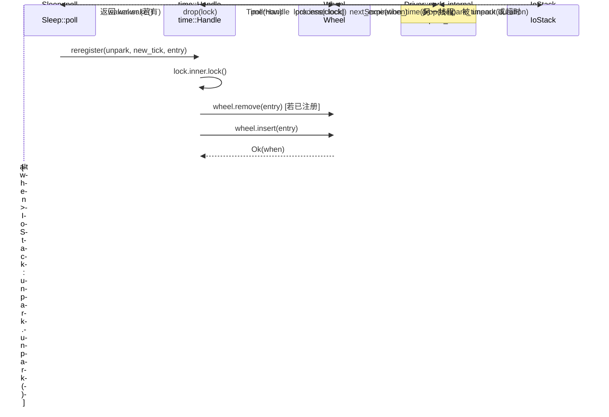

# 第 6 章：時間驅動：時間輪、Sleep 與超時如何被喚醒

上一章我們追蹤了 TcpStream::read 的完整鏈路，看到 ScheduledIo 如何把 epoll 的 fd 就緒事件翻譯成 Waker 喚醒。但非同步執行時還需要處理另一類「就緒」：一個 sleep(100ms) 的 Future，在 100ms 後必須被喚醒。這類事件不來自核心 fd，而來自「時間本身」。Tokio 的設計選擇是把時間也當作一種 I/O 事件：Driver 結構體裡只有一個欄位 park: IoStack，它複用了 I/O driver 的 park/unpark 機制。當時間輪算出「下一次到期時刻」時，driver 就呼叫 park_timeout 讓執行緒睡到那個時刻；被喚醒後再從時間輪裡取出到期條目、觸發它們的 Waker。這樣，排程器只需要一個統一的 park 入口，就能同時等待「fd 就緒」和「定時器到期」兩類事件。本章要回答三個問題：定時器如何被插入時間輪？時間輪如何按到期時間分級？driver 如何計算下一次 park 的超時並觸發到期任務？

# 一、時間輪：六層 64 槽的雜湊分級結構

## 直覺模型

想像一個機械鐘錶：秒針轉一圈帶動分針，分針轉一圈帶動時針。如果只有一根秒針，要表示「12 天後」就得數 100 萬格；而分層之後，秒針只管 64 秒內的精度，分針管 64 分鐘，時針管 64 小時——每一層只需 64 個槽位，就能覆蓋到 2 年之後。

若沒有分層，插入一個遠期定時器要麼需要 O(N) 遍歷，要麼需要巨大的陣列。時間輪用「按到期時間分級」把插入和觸發都壓到近似 O(1)。

## 記憶體佈局與欄位

`Wheel`的核心欄位只有三個[FACT:tokio/src/runtime/time/wheel/mod.rs:22-40]：

```rust
pub(crate) struct Wheel {
    elapsed: u64,                          // 自 wheel 创建以来经过的毫秒数
    levels: Box,      // 6 层，每层 64 槽
    pending: LinkedList,      // 已到期、待触发的条目
}
```

`NUM_LEVELS = 6`，`BITS_PER_LEVEL = 6`（即每層 64 槽）[FACT:tokio/src/runtime/time/wheel/mod.rs:45-47]。`MAX_DURATION = 1 << (6 * 6) = 1 << 36`毫秒，約 2 年[FACT:tokio/src/runtime/time/wheel/mod.rs:50]。

六層的粒度按文件註解是[FACT:tokio/src/runtime/time/wheel/mod.rs:22-40]：

| 層 | 槽粒度 | 覆蓋範圍 |
| --- | --- | --- |
| 0 | 1 ms | 64 ms |
| 1 | 64 ms | ~4 s |
| 2 | ~4 s | ~4 min |
| 3 | ~4 min | ~4 hr |
| 4 | ~4 hr | ~12 day |
| 5 | ~12 day | ~2 yr |

`pending`是一個侵入式鏈結串列（`LinkedList<TimerShared>`），存放已經從輪中取出、等待觸發 Waker 的條目。注意它是`LinkedList`而非`Vec`：條目本身內嵌在`TimerShared`裡，插入/移除不需要分配。

## 場景驅動：插入一個 100ms 的 sleep

當`sleep(100ms)`首次被 poll 時，`Sleep::poll_elapsed`會建構`Timer::new`並呼叫`init` [FACT:tokio/src/time/sleep.rs:436-440]。`init`最終呼叫`Handle::reregister`，進而呼叫`Wheel::insert`。

`insert`的第一步是檢查是否已過期[FACT:tokio/src/runtime/time/wheel/mod.rs:90-98]：

```rust
let when = unsafe { item.sync_when() };
if when  usize {
    const SLOT_MASK: u64 = (1 = MAX_DURATION {
        return NUM_LEVELS - 1;
    }
    masked.ilog2() as usize / BITS_PER_LEVEL
}
```

這裡用`elapsed ^ when`而非`when - elapsed`，是一個精妙的技巧：XOR 的最高有效位反映了「兩個時間戳從哪一位開始不同」，也就是「需要多粗的粒度才能區分它們」。`| SLOT_MASK`把低 6 位強制置 1，避免`ilog2`落在同一槽內時算出過小的層。`ilog2() / 6`把位寬映射到層號。如果 XOR 結果超過`MAX_DURATION`（即超過 2 年），就強制塞進最高層——這就是「fudge the timer into the top level」。

對於 100ms 的 sleep，假設`elapsed`接近 0，`when ≈ 100`，`elapsed ^ when ≈ 100`，`ilog2(100) = 6`，`6 / 6 = 1`，所以落在第 1 層（64ms 粒度）。這意味著它會在第 1 層的某個槽裡等待，直到時間推進到該槽的邊界時才會被下沉到第 0 層。

## 分級下沉：process_expiration

當`poll(now)`推進時間時，`Wheel::poll`會迴圈呼叫`next_expiration`和`process_expiration` [FACT:tokio/src/runtime/time/wheel/mod.rs:142-166]：

```rust
pub(crate) fn poll(&mut self, now: u64) -> Option {
    loop {
        if let Some(handle) = self.pending.pop_back() {
            return Some(handle);
        }
        match self.next_expiration() {
            Some(ref expiration) if expiration.deadline  {
                self.process_expiration(expiration);
                self.set_elapsed(expiration.deadline);
            }
            _ => {
                self.set_elapsed(now);
                break;
            }
        }
    }
    self.pending.pop_back()
}
```

`process_expiration`負責把某一層的到期條目「下沉」到下一層，或者（在第 0 層）標記為 pending[FACT:tokio/src/runtime/time/wheel/mod.rs:218-251]：

```rust
let mut entries = self.take_entries(expiration);
while let Some(item) = entries.pop_back() {
    match unsafe { item.mark_pending(expiration.deadline) } {
        Ok(()) => {
            self.pending.push_front(item);   // 真正到期
        }
        Err(expiration_tick) => {
            let level = level_for(expiration.deadline, expiration_tick);
            unsafe { self.levels[level].add_entry(item); }  // 下沉到更低层
        }
    }
}
```

`mark_pending`是關鍵：它檢查條目的實際 deadline 是否已經到達。如果到達，返回`Ok(())`，條目進入`pending`鏈結串列；如果還沒到（只是所在槽的邊界到了），返回`Err(expiration_tick)`，條目被重新插入到更細的層。

注意註解裡強調的一點[FACT:tokio/src/runtime/time/wheel/mod.rs:219-228]：必須先把整個槽的條目全部取出再處理，因為某些條目可能被重新插入到同一個槽（當插入時間超過`MAX_DURATION`時會發生環繞）。如果邊取邊插，可能陷入無限迴圈。

## 下一到期時刻的計算

`next_expiration`從低層到高層掃描，返回第一個非空的到期點[FACT:tokio/src/runtime/time/wheel/mod.rs:169-191]：

```rust
fn next_expiration(&self) -> Option {
    if !self.pending.is_empty() {
        return Some(Expiration { level: 0, slot: 0, deadline: self.elapsed });
    }
    for (level_num, level) in self.levels.iter().enumerate() {
        if let Some(expiration) = level.next_expiration(self.elapsed) {
            debug_assert!(self.no_expirations_before(level_num + 1, expiration.deadline));
            return Some(expiration);
        }
    }
    None
}
```

如果`pending`非空，說明有已到期條目待觸發，立即返回當前`elapsed`作為 deadline（這樣 driver 會以 0 超時 park，馬上回來處理）。否則逐層掃描，返回第一個有內容的槽的 deadline。`debug_assert`驗證了一個不變量：更高層不可能有比當前層更早的到期點。

```mermaid
flowchart TD
    start["Wheel::poll(now)"] --> check_pending{"pending 非空?"}
    check_pending -->|是| pop["pop_back 返回 TimerHandle"]
    check_pending -->|否| next_exp{"next_expiration() 有到期点?"}
    next_exp -->|无| set_elapsed["set_elapsed(now) 后 break"]
    next_exp -->|有| cmp{"expiration.deadline |否| set_elapsed
    cmp -->|是| proc["process_expiration(expiration)"]
    proc --> take["take_entries 取出整槽"]
    take --> mark{"item.mark_pending()"}
    mark -->|Ok 已到期| push_pending["pending.push_front(item)"]
    mark -->|Err 未到期| reinsert["level_for 后 add_entry 下沉"]
    push_pending --> set_elapsed2["set_elapsed(expiration.deadline)"]
    reinsert --> set_elapsed2
    set_elapsed2 --> check_pending
    set_elapsed --> pop2["pending.pop_back() 返回"]
```

---

# 二、Driver 的 park 迴圈：把時間輪接到 I/O 堆疊上

## 直覺模型

時間輪本身不會「自己走」。它需要一個外部迴圈反覆問它：「下一次到期是什麼時候？」然後睡到那個時刻，醒來後再推進時間。這個迴圈就是`Driver::park_internal`。它把「時間輪的下一次到期」翻譯成一個`park_timeout`的時長，交給底層的 I/O 堆疊去睡。

若沒有這個迴圈，定時器永遠不會被觸發——時間輪只是靜態資料結構，需要有人「撥動」它。

## 資料結構：Driver 與 InnerState

`Driver`只有一個欄位`park: IoStack` [FACT:tokio/src/runtime/time/mod.rs:90-93]。真正的狀態在`Handle`裡，透過`Inner`列舉區分傳統實作和實驗性實作[FACT:tokio/src/runtime/time/mod.rs:95-127]。傳統實作的`InnerState`包含兩個欄位[FACT:tokio/src/runtime/time/mod.rs:130-136]：

```rust
struct InnerState {
    next_wake: Option,   // 承诺的最早唤醒时刻
    wheel: wheel::Wheel,
}
```

`next_wake`用`NonZeroU64`而非`Option<u64>`的嵌套，是為了利用 niche 優化——`Option<NonZeroU64>`和`u64`同大小。它記錄「driver 承諾在哪個 tick 之前會醒來」，用於`reregister`時判斷是否需要`unpark`。

`is_shutdown`是獨立的`AtomicBool`，註解解釋了為什麼把它從 Mutex 裡拆出來[FACT:tokio/src/runtime/time/mod.rs:90-93]：`Handle`需要在不鎖 mutex 的情況下檢查`is_shutdown`。這是一個典型的「讀多寫少」優化——shutdown 只發生一次，但檢查可能頻繁。

## 場景驅動：一次 park 的完整流程

`park_internal`是核心[FACT:tokio/src/runtime/time/mod.rs:213-256]：

```rust
fn park_internal(&mut self, rt_handle: &driver::Handle, limit: Option) {
    let handle = rt_handle.time();
    let mut lock = handle.inner.lock();
    assert!(!handle.is_shutdown());

    let next_wake = lock.wheel.next_expiration_time();
    lock.next_wake = next_wake.map(|t| NonZeroU64::new(t).unwrap_or_else(|| NonZeroU64::new(1).unwrap()));
    drop(lock);

    match next_wake {
        Some(when) => {
            let now = handle.time_source.now(rt_handle.clock());
            let mut duration = handle.time_source.tick_to_duration(when.saturating_sub(now));
            if duration > Duration::from_millis(0) {
                if let Some(limit) = limit {
                    duration = std::cmp::min(limit, duration);
                }
                self.park_thread_timeout(rt_handle, duration);
            } else {
                self.park.park_timeout(rt_handle, Duration::from_secs(0));
            }
        }
        None => {
            if let Some(duration) = limit {
                self.park_thread_timeout(rt_handle, duration);
            } else {
                self.park.park(rt_handle);
            }
        }
    }

    handle.process(rt_handle.clock());
}
```

分步解析：

1. **取鎖、讀下一次到期**：`lock.wheel.next_expiration_time()`返回`Option<u64>`，即下一個到期 tick。同時把它寫入`lock.next_wake`，供`reregister`判斷是否需要 unpark。

2. **釋放鎖**：`drop(lock)`必須在 park 之前，否則 park 期間其他執行緒無法插入定時器。

3. **計算 park 時長**：`when.saturating_sub(now)`得到剩餘 tick 數，`tick_to_duration`轉成`Duration`。註解指出這裡實際上向上取整到 1ms[FACT:tokio/src/runtime/time/mod.rs:228-230]，避免微秒級 sleep 被 OS 當作零長度。

4. **處理 limit**：如果呼叫方傳了`limit`（比如`park_timeout`的顯式超時），取`min(limit, duration)`，保證不會睡過頭。

5. **特殊情況**：如果`duration == 0`（已到期），用`park_timeout(0)`立即返回，不真正睡。

6. **無定時器時**：如果`next_wake`為`None`，有`limit`就`park_thread_timeout(limit)`，否則無限`park`。

7. **喚醒後處理**：`handle.process(clock)`推進時間輪並觸發到期條目。

## process_at_time：觸發到期條目

`process`呼叫`process_at_time` [FACT:tokio/src/runtime/time/mod.rs:296-337]：

```rust
pub(self) fn process_at_time(&self, mut now: u64) {
    let mut waker_list = WakeList::new();
    let mut lock = self.inner.lock();

    if now ) {
    let waker = unsafe {
        let mut lock = self.inner.lock();
        if unsafe { entry.as_ref().might_be_registered() } {
            lock.wheel.remove(entry);
        }
        let entry = entry.as_ref().handle();
        if self.is_shutdown() {
            unsafe { entry.fire(Err(crate::time::error::Error::shutdown())) }
        } else {
            entry.set_expiration(new_tick);
            match unsafe { lock.wheel.insert(entry) } {
                Ok(when) => {
                    if lock.next_wake.is_none_or(|next_wake| when  unsafe {
                    entry.fire(Ok(()))
                },
            }
        }
    };
    if let Some(waker) = waker {
        waker.wake();
    }
}
```

關鍵邏輯：插入成功後，如果新到期時刻比`next_wake`更早，就呼叫`unpark.unpark()`喚醒 driver。這是因為 driver 可能正睡在一個更晚的時刻，需要被提前叫醒以重新計算 park 時長。

注意`unpark`是在**持有鎖時**呼叫的，而`waker.wake()`是在**釋放鎖後**呼叫的。註解解釋[FACT:tokio/src/runtime/time/mod.rs:441]：必須在呼叫 Waker 前釋放鎖以避免死鎖。但`unpark`不同——它只是往 epoll 塞一個事件，不會回呼使用者程式碼，所以持鎖呼叫是安全的。



---

# 三、Sleep 與 Timeout：使用者可見的 API 層

## 直覺模型

`Sleep`是使用者直接`.await`的 Future，`Timeout`是包裹另一個 Future 的適配器。它們本身不管理時間輪，只是把「deadline」翻譯成 tick，委託給`Timer`和`Handle`。

## Sleep 的記憶體佈局

`Sleep`用`pin_project!`巨集定義[FACT:tokio/src/time/sleep.rs:221-227]：

```rust
pub struct Sleep {
    deadline: Instant,
    driver: scheduler::Handle,
    inner: Inner,
    #[pin]
    timer: Option,
}
```

`timer`是`Option<Timer>`且帶`#[pin]`：首次 poll 前是`None`，首次 poll 時才建立`Timer`並註冊。這種「惰性初始化」避免了在`sleep()`呼叫時就存取執行時——`sleep()`可以在執行時外呼叫，只要在`.await`時才真正註冊。

`PinnedDrop`實作確保 drop 時取消定時器[FACT:tokio/src/time/sleep.rs:230-235]：

```rust
impl PinnedDrop for Sleep {
    fn drop(this: Pin) {
        let this = this.project();
        if let Some(timer) = this.timer.as_pin_mut() {
            timer.cancel(this.driver);
        }
    }
}
```

## poll_elapsed 的完整流程

`poll_elapsed`是`Sleep`的核心[FACT:tokio/src/time/sleep.rs:396-454]：

```rust
fn poll_elapsed(self: Pin, cx: &mut task::Context) -> Poll> {
    ready!(crate::trace::trace_leaf());
    let mut this = self.project();

    // coop 预算
    let coop = ready!(crate::task::coop::poll_proceed(cx));

    let handle = this.driver;
    let timer = match this.timer.as_mut().as_pin_mut() {
        Some(timer) => timer,
        None => {
            let time_source = handle.driver().time().time_source();
            let deadline = time_source.deadline_to_tick(*this.deadline);
            let timer = Timer::new(handle, deadline);
            this.timer.set(Some(timer));
            let mut timer = this.timer.as_pin_mut().unwrap();
            timer.as_mut().init(handle, deadline);
            timer
        }
    };

    let result = timer.poll_elapsed(cx, handle).map(move |r| {
        coop.made_progress();
        r
    });
    result
}
```

分步：

1. **coop 預算檢查**：`poll_proceed(cx)`消耗一次協作預算。如果預算耗盡，返回`Pending`並讓出執行權。這是 Tokio 防止單個任務餓死其他任務的機制。

2. **惰性建立 Timer**：如果`timer`是`None`，把`deadline`轉成 tick，建立`Timer`並呼叫`init`註冊到時間輪。

3. **委託給 Timer::poll_elapsed**：實際的到期檢查由`Timer`完成。

4. **成功後標記進度**：`coop.made_progress()`表示這次 poll 有實際進展。

## Timeout 的 poll：先 poll 值，再 poll 延遲

`Timeout`的 poll 順序很關鍵[FACT:tokio/src/time/timeout.rs:210-224]：

```rust
fn poll(self: Pin, cx: &mut task::Context) -> Poll {
    let me = self.project();
    let had_budget_before = coop::has_budget_remaining();

    // 先 poll 被包裹的 future
    if let Poll::Ready(v) = me.value.poll(cx) {
        return Poll::Ready(Ok(v));
    }

    match me.delay.as_pin_mut() {
        Some(delay) => poll_delay(had_budget_before, delay, cx).map(Err),
        None => Poll::Pending,
    }
}
```

註解明確指出[FACT:tokio/src/time/timeout.rs:24-26]：future 先被 poll，然後才檢查超時。所以如果 future 不 yield 就完成，它可能在超過 timeout 後仍返回`Ok`。這是設計選擇，不是 bug。

`poll_delay`處理一個微妙的場景[FACT:tokio/src/time/timeout.rs:229-251]：

```rust
fn poll_delay(had_budget_before: bool, delay: Pin, cx: &mut task::Context) -> Poll {
    let delay_poll = || match delay.poll(cx) {
        Poll::Ready(()) => Poll::Ready(Elapsed::new()),
        Poll::Pending => Poll::Pending,
    };

    let has_budget_now = coop::has_budget_remaining();

    if let (true, false) = (had_budget_before, has_budget_now) {
        // 如果预算是被底层 future 耗尽的，用无约束预算 poll delay
        coop::with_unconstrained(delay_poll)
    } else {
        delay_poll()
    }
}
```

邏輯：如果進入`poll`時還有預算，但 poll 完 value 後預算耗盡了，說明是 value 消耗了預算。此時如果用受限預算 poll delay，delay 可能立即返回`Pending`，導致永遠無法判斷超時是否到達。所以用`with_unconstrained`臨時解除預算限制。註解稱之為「pathological cases」[FACT:tokio/src/time/timeout.rs:243-246]。

## timeout 的 deadline 溢出處理

`timeout`函式用`checked_add`處理溢出[FACT:tokio/src/time/timeout.rs:86-99]：

```rust
Timeout {
    value: future.into_future(),
    delay: match Instant::now().checked_add(duration) {
        Some(deadline) => Some(Sleep::new_timeout(deadline, trace::caller_location())),
        None => None,
    },
}
```

如果`Instant::now() + duration`溢出（duration 極大），`delay`為`None`，poll 時直接返回`Poll::Pending` [FACT:tokio/src/time/timeout.rs:222]。這相當於「永不超時」，是合理的降級行為。

---

# 設計思考與生產踩坑

**為什麼用 XOR 而非減法計算層級？** `elapsed ^ when`的最高有效位直接反映「兩個時間戳從哪一位開始不同」，這正是「需要多粗的粒度」的度量。減法`when - elapsed`在`elapsed`接近`when`時高位全為 0，`ilog2`會算出過小的層。XOR 天然處理了環繞場景。

**時間倒流保護的必要性** [FACT:tokio/src/runtime/time/mod.rs:301-309]：Rust 保證`Instant`單調，但底層 OS 可能不保證。在 Windows 宿主上的 Linux VM 裡，std 信任硬體時鐘導致`Instant`倒退。Tokio 用`now = lock.wheel.elapsed()`鉗制，避免`set_elapsed`的 assert 失敗。

**批量喚醒與死鎖** [FACT:tokio/src/runtime/time/mod.rs:319]：持有時間輪鎖時呼叫 Waker 是危險的——Waker 可能觸發任務重新 poll，進而呼叫`Sleep::reset`，試圖再次獲取時間輪鎖，造成死鎖。`WakeList`的批量機制在鎖滿時臨時釋放鎖，是標準的「鎖外回調」模式。

**`next_wake`的 niche 優化** [FACT:tokio/src/runtime/time/mod.rs:130-136]：`Option<NonZeroU64>`與`u64`同大小，因為 0 被用作`None`的 niche。但 tick 0 是合法值，所以程式碼用`NonZeroU64::new(t).unwrap_or_else(|| NonZeroU64::new(1).unwrap())`把 0 映射到 1[FACT:tokio/src/runtime/time/mod.rs:221]。這是一個微妙的邊界處理：tick 0 被當作 tick 1，最多導致 1ms 的額外喚醒。

**`process_expiration`的「先取後處理」** [FACT:tokio/src/runtime/time/wheel/mod.rs:219-228]：必須先把整槽條目取出再處理，因為超過`MAX_DURATION`的條目會環繞並重新插入同一槽。如果邊取邊插，會無限迴圈。

**`Timeout`的 poll 順序陷阱** [FACT:tokio/src/time/timeout.rs:24-26]：future 先 poll，超時後檢查。如果 future 是 CPU 密集且不 yield，它可能超過 timeout 仍返回`Ok`。生產環境中不要依賴`timeout`來強制中斷不合作的 future。

---

# 本章小結

本章拆解了 Tokio 時間驅動的三層結構：

1. **時間輪**（`Wheel`）：六層 64 槽的雜湊分級結構，用`elapsed ^ when`的位寬決定條目層級，插入和觸發近似 O(1)。`pending`鏈結串列存放已到期條目，`process_expiration`負責逐層下沉。

2. **Driver**（`Driver::park_internal`）：把時間輪的`next_expiration_time`翻譯成`park_timeout`時長，複用 I/O 堆疊的 park/unpark。`process_at_time`在喚醒後推進時間輪、批量觸發 Waker，並處理時間倒流和死鎖防護。

3. **使用者 API**（`Sleep` / `Timeout`）：`Sleep`惰性建立`Timer`並註冊，`Timeout`先 poll value 再 poll delay，用`with_unconstrained`處理預算耗盡場景。

核心設計是「時間也是一種 I/O 事件」：driver 只有一個 park 入口，同時等待 fd 就緒和定時器到期。`next_wake`記錄承諾的喚醒時刻，`reregister`在插入更早的定時器時`unpark`喚醒 driver 重新計算。

下一章我們將進入同步原語：`Mutex`、`Semaphore`與通道如何實作非同步等待。你會看到它們如何複用本章的 Waker 機制，以及「許可計數」與「等待佇列」如何協作。

# 本章思考與自測

Q1: 如果把`Wheel::insert`中的`if when <= self.elapsed`改成`if when < self.elapsed`（去掉等號），在什麼場景下會導致定時器永遠不被觸發？

**參考解析**：`when == self.elapsed`表示定時器的到期時刻恰好等於當前已推進的時間。原始碼用`<=`把它判為`Elapsed`，呼叫方立即觸發[FACT:tokio/src/runtime/time/wheel/mod.rs:96-98]。如果改成`<`，這個條目會被插入到`level_for(elapsed, when)`算出的層。由於`elapsed ^ when == 0`，`masked = 0 | SLOT_MASK = 63`，`ilog2(63) = 5`，`5 / 6 = 0`，落在第 0 層。但第 0 層的`next_expiration`會返回一個`deadline >= elapsed`的槽，而`Wheel::poll`的條件是`expiration.deadline <= now`。如果`now == elapsed`，條件成立，`process_expiration`會取出該條目，`mark_pending(elapsed)`檢查實際 deadline 是否到達——此時`when == elapsed`，`mark_pending`返回`Ok`，條目進入 pending。所以實際上仍會被觸發，但多繞了一圈。真正的風險在於：如果`elapsed`已經推進到`when`之後（`when < elapsed`），原始碼返回`Elapsed`立即觸發，改後則插入到一個已經過去的槽，`next_expiration`可能返回`deadline < elapsed`，`set_elapsed`的 assert`elapsed <= when`會失敗 panic[FACT:tokio/src/runtime/time/wheel/mod.rs:253-264]。所以這個等號是防止 assert 失敗的關鍵邊界。

Q2: `process_at_time`中`WakeList`滿了之後為什麼要`drop(lock)`再`wake_all()`再重新`lock`？如果去掉這個 drop，在什麼併發場景下會死鎖？

**參考解析**：`WakeList`收集 Waker，滿了之後必須喚醒一批以騰出空間[FACT:tokio/src/runtime/time/mod.rs:318-325]。如果持有`self.inner.lock()`時呼叫`waker.wake()`，被喚醒的任務可能立即在另一個執行緒（或同一執行緒的排程器）上執行，呼叫`Sleep::reset`或`Sleep::poll_elapsed`，進而呼叫`Handle::reregister`，而`reregister`的第一件事就是`self.inner.lock()` [FACT:tokio/src/runtime/time/mod.rs:405]。由於`std::sync::Mutex`不可重入，同一執行緒會死鎖；即使在不同執行緒，也會阻塞直到`process_at_time`釋放鎖，而`process_at_time`正等著`wake_all`返回，形成循環等待。註解明確說「To avoid deadlock, we must do this with the lock temporarily dropped」[FACT:tokio/src/runtime/time/mod.rs:319]。drop 後重新 lock 時，時間輪狀態可能已被其他執行緒修改（比如新定時器插入），所以`while let Some(entry) = lock.wheel.poll(now)`會繼續從新狀態取條目，這是安全的。

Q3: `Timeout::poll`中`had_budget_before`和`has_budget_now`的組合判斷`(true, false)`為什麼只在「進入時有預算、poll 完 value 後沒預算」時才用`with_unconstrained`？如果反過來`(false, true)`會怎樣？

**參考解析**：`had_budget_before`在 poll value 之前記錄[FACT:tokio/src/time/timeout.rs:208-208]，`has_budget_now`在 poll value 之後記錄[FACT:tokio/src/time/timeout.rs:239]。`(true, false)`意味著預算是在 poll value 期間耗盡的，說明 value 是「預算消耗者」。此時如果用受限預算 poll delay，`poll_proceed`會立即返回`Pending`，delay 永遠不會被真正檢查，逾時判斷失效。所以用`with_unconstrained`臨時解除限制[FACT:tokio/src/time/timeout.rs:247]。`(false, true)`不可能發生——預算只能被消耗，不能被恢復（除非顯式`with_unconstrained`，但這裡沒有）。`(false, false)`意味著進入時就沒預算，此時 poll value 可能已經返回`Pending`（因為`poll_proceed`失敗），delay 也用受限預算 poll，兩者都 pending，符合預期。`(true, true)`是正常情況，預算充足，直接 poll delay。

至此，我們已經看清時間驅動如何復用 I/O driver 的 park/unpark 機制，讓定時器與 fd 就緒共享同一個等待入口。時間輪的分級、到期計算與 Waker 觸發，構成了非同步執行時處理「時間就緒」的完整閉環。但非同步等待不止於 I/O 與時間——當多個任務競爭同一把鎖、或透過通道傳遞訊息時，Waker 又該被存放到哪裡？下一章我們將進入 tokio::sync 家族，看看 Mutex、Semaphore 與各類通道如何在「等待者佇列 + Waker 喚醒」上做出不同取捨。
