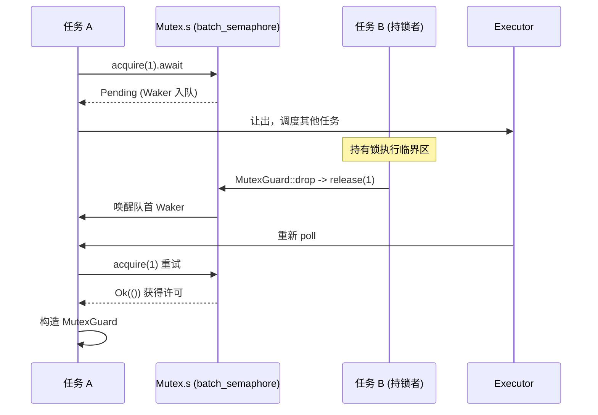

# 第 7 章：同步原語：Mutex、Semaphore 與通道如何實現非同步等待

上一章揭示了時間如何被抽象為一種 I/O 事件，讓定時器與 fd 就緒共享同一個 park/unpark 等待入口。然而，當多個任務競爭同一把鎖或透過通道傳遞訊息時，等待的物件不再是 fd 或時鐘，而是另一個任務的狀態變化。本章進入 tokio::sync 家族，探明一次 lock().await 或 recv().await 在阻塞時究竟把 Waker 存到了哪裡，被喚醒時又如何被重新排程。

# 為什麼非同步 Mutex 不能復用 std 的實現

## 直覺模型：從「佔著茅坑」到「讓出座位」

`std::sync::Mutex`的`lock()`在鎖被佔用時會**阻塞當前執行緒**——執行緒被作業系統掛起，直到鎖釋放。這在非同步執行時裡是災難性的：一個 worker 執行緒可能同時驅動成百上千個任務，如果它因為等一把鎖而阻塞，它承載的所有其他任務全部停擺。非同步 Mutex 的核心訴求是：等鎖時**讓出執行緒**，把「我在等這把鎖」這件事登記到一個佇列裡，然後返回`Pending`，讓執行器去跑別的任務。

Tokio 的`Mutex`沒有自己實現等待佇列，而是**完全建立在號誌量之上**。

## 資料結構與記憶體佈局

`Mutex<T>`的欄位極簡：

[FACT:tokio/src/sync/mutex.rs:133-138]

```rust
pub struct Mutex {
    #[cfg(all(tokio_unstable, feature = "tracing"))]
    resource_span: tracing::Span,
    s: semaphore::Semaphore,
    c: UnsafeCell,
}
```

三個欄位各司其職：`s`是一個**許可數為 1 的號誌量**，`c`是`UnsafeCell<T>`包裹的受保護資料。注意這裡的`semaphore`是`batch_semaphore`的別名[FACT:tokio/src/sync/mutex.rs:3-3]，也就是底層實作，而非`sync::Semaphore`那層公開封裝。

`MutexGuard<'a, T>`則只持有一個對`Mutex`的參考：

[FACT:tokio/src/sync/mutex.rs:151-157]

```rust
pub struct MutexGuard {
    #[cfg(all(tokio_unstable, feature = "tracing"))]
    resource_span: tracing::Span,
    lock: &'a Mutex,
}
```

這裡有個關鍵設計：`MutexGuard` **不持有號誌量許可物件**，只持有`&Mutex`。釋放鎖的動作發生在`Drop`裡，直接呼叫`self.lock.s.release(1)` [FACT:tokio/src/sync/mutex.rs:959-961]。這與`SemaphorePermit`持有`permits: usize`計數、在 Drop 時歸還不同——Mutex 的許可數恆為 1，不需要計數。

`Send`/`Sync`的邊界值得單獨看：

[FACT:tokio/src/sync/mutex.rs:258-259]

```rust
unsafe impl Send for Mutex where T: ?Sized + Send {}
unsafe impl Sync for Mutex where T: ?Sized + Send {}
```

`Sync`只要求`T: Send`而非`T: Sync`——這是合理的，因為互斥存取保證了同一時刻只有一個執行緒能觸碰`T`，跨執行緒傳遞`T`的所有權（`Send`）就夠了，不需要`T`本身可被共享（`Sync`）。這正是`Mutex<T>`能把非`Sync`的`T`變成`Sync`的原因。

## Step-by-Step：一次`lock().await`的完整旅程

代入場景：任務 A 呼叫`mutex.lock().await`，此時鎖空閒。

第一步，`lock()`建構一個 async 區塊，內部先`self.acquire().await`，成功後建構`MutexGuard` [FACT:tokio/src/sync/mutex.rs:434-443]。

第二步，`acquire()`直接委託給號誌量：

[FACT:tokio/src/sync/mutex.rs:655-663]

```rust
async fn acquire(&self) {
    crate::trace::async_trace_leaf().await;
    self.s.acquire(1).await.unwrap_or_else(|_| {
        unreachable!()
    });
}
```

`unwrap_or_else(|_| unreachable!())`這行註解道出了設計約束：Mutex 從不顯式 close 號誌量，且獨佔持有它，所以`acquire`永遠不會回傳`Err`。這是把「號誌量關閉」這一錯誤路徑在型別層面排除掉。

第三步，若鎖被佔用，`s.acquire(1)`回傳`Pending`，當前任務的 Waker 被登記進號誌量的等待佇列。**Waker 存在哪裡？**答案在`batch_semaphore`的等待佇列裡（本章原始碼材料未展開該檔案，但其角色是：每個等待者持有一個 Waker，按 FIFO 排隊）。

第四步，持有鎖的任務 B 釋放鎖時，`MutexGuard::drop`呼叫`s.release(1)` [FACT:tokio/src/sync/mutex.rs:965-975]，號誌量把許可交給隊首等待者並喚醒其 Waker，任務 A 被重新排程，`acquire`回傳`Ok`，建構出`MutexGuard`。

整個流程可以用下面的時序圖刻畫：



## 設計思考：FIFO 公平性與取消安全

文件明確聲明 Tokio 的 Mutex 保證 FIFO[FACT:tokio/src/sync/mutex.rs:20-22]。這一公平性來自底層號誌量的排隊語義。公平的代價是：一次`lock`被取消（比如在`select!`中落敗）會讓你**失去佇列中的位置** [FACT:tokio/src/sync/mutex.rs:415-419]。這不是 bug，而是 FIFO 佇列的必然——取消意味著從佇列中移除，重新`lock`就得重新排隊。

另一個反直覺的設計是**不投毒**（no poisoning）。`std::sync::Mutex`在持鎖執行緒 panic 時會標記為 poisoned，後續`lock`回傳`Err`。Tokio 的 Mutex 不這麼做：持鎖者 panic 時鎖會被正常釋放[FACT:tokio/src/sync/mutex.rs:122-125]。文件警告，如果 panic 被捕獲，受保護資料可能處於不一致狀態。這是非同步場景下的務實取捨——panic 在非同步任務裡通常意味著任務終止，投毒機制反而增加複雜度。

`MutexGuard::map`系列方法值得一提。它允許把整個`MutexGuard<T>`降級為只保護某個子欄位的`MappedMutexGuard<U>`。實作上，它先用閉包算出子欄位指標`data`，再透過`skip_drop`把原 guard 拆解成不觸發 Drop 的`MutexGuardInner`，最後建構新的 guard[FACT:tokio/src/sync/mutex.rs:869-883]。`skip_drop`用`ManuallyDrop` + `ptr::read`轉移欄位所有權，避免`Drop`被呼叫兩次[FACT:tokio/src/sync/mutex.rs:827-836]。這是 Rust 裡「轉移所有權但不觸發解構」的經典手法。

# Semaphore：許可計數與等待佇列如何實作背壓

## 直覺模型：停車場的車位

號誌量就像停車場：`acquire`是開車進場，有空位就進，沒空位就在門口排隊；`release`是開車離場，空出一個位子就通知隊首的車進場。許可數就是車位總數，`acquire_many(n)`就是一輛佔 n 個車位的大車。

## 資料結構與記憶體佈局

公開的`Semaphore`只是底層`batch_semaphore::Semaphore`的薄封裝：

[FACT:tokio/src/sync/semaphore.rs:427-432]

```rust
pub struct Semaphore {
    ll_sem: ll::Semaphore,
    #[cfg(all(tokio_unstable, feature = "tracing"))]
    resource_span: tracing::Span,
}
```

`SemaphorePermit<'a>`持有號誌量參考和許可計數：

[FACT:tokio/src/sync/semaphore.rs:442-445]

```rust
pub struct SemaphorePermit {
    sem: &'a Semaphore,
    permits: usize,
}
```

`permits`欄位是理解`forget`/`merge`/`split`的關鍵。`forget`把`permits`置零[FACT:tokio/src/sync/semaphore.rs:1193-1195]，這樣 Drop 時歸還 0 個許可——等價於「永久消耗」這些許可。`split`從當前許可裡切出 n 個給新 permit[FACT:tokio/src/sync/semaphore.rs:1260-1271]。`merge`把另一個 permit 的計數合併進來，並斷言兩者來自同一號誌量[FACT:tokio/src/sync/semaphore.rs:1230-1240]。

> **[Design Inference & Architectural Trade-offs]**
> `MAX_PERMITS`是`usize::MAX >> 3` [FACT:tokio/src/sync/semaphore.rs:476-479]。為什麼右移 3 位？ 底層`batch_semaphore`需要在高位位元裡編碼狀態標誌（如關閉標誌），所以把可用許可數限制在低位，留出高位做標誌位。這是把「計數 + 狀態」壓進單個`usize`的常見技巧。

## Step-by-Step：acquire 與 release 的許可流轉

場景：號誌量初始 2 個許可，任務 A`acquire()`，任務 B`acquire_many(2)`。

`acquire()`委託給`ll_sem.acquire(1)`，成功後建構`SemaphorePermit { permits: 1 }` [FACT:tokio/src/sync/semaphore.rs:614-631]。`acquire_many(2)`類似，但傳 2[FACT:tokio/src/sync/semaphore.rs:661-679]。

若許可不足，`ll_sem.acquire(n)`回傳`Pending`，Waker 入隊。這裡有個公平性細節：文件指出，如果隊首是一個`acquire_many(5)`而當前只剩 3 個許可，即使後面有個`acquire(1)`能立刻滿足，它也必須等——因為隊首的大車佔著隊[FACT:tokio/src/sync/semaphore.rs:19-24]。這是嚴格 FIFO 的代價，避免了飢餓。

釋放路徑在 Drop：

[FACT:tokio/src/sync/semaphore.rs:1402-1404]

```rust
impl Drop for SemaphorePermit {
    fn drop(&mut self) {
        self.sem.add_permits(self.permits);
    }
}
```

`add_permits`委託給`ll_sem.release(n)` [FACT:tokio/src/sync/semaphore.rs:568-570]，底層把許可還給等待佇列，喚醒能湊夠許可的等待者。

記憶體序方面，文件給出了強保證：acquire、release、close 都是`AcqRel`操作，彼此全序，等價於單個原子變數上的`AcqRel` [FACT:tokio/src/sync/semaphore.rs:35-42]。這意味著「先寫資料再 release 許可」的寫入，對「後 acquire 許可」的任務可見——號誌可以安全地在任務間傳遞資料。

## 設計思考：close 與背壓

`close()`讓所有等待者收到`AcquireError`，且後續`try_acquire`返回`Closed` [FACT:tokio/src/sync/semaphore.rs:1161-1163]。這是優雅關閉的基礎：當接收端不再需要資料時，close 號誌能讓所有阻塞的發送者立刻失敗返回，而不是永遠等待。

背壓的本質在 mpsc 裡體現得最清楚。下一節會看到，mpsc 的容量控制就是用一個許可數等於 buffer 大小的號誌實現的。

# 通道家族：等待者佇列與 Waker 喚醒的不同取捨

## 直覺模型：四種通道，四種等待策略

`oneshot`是「一次性信封」——只能送一封信，發送方不等待（`send`是同步的），接收方`await`等信。`mpsc`是「有界傳送帶」——發送方在傳送帶滿時等待，接收方在空時等待，容量由號誌控制。`broadcast`和`watch`是「廣播喇叭」——一個發送方，多個接收方，但兩者對「落後」的處理截然不同。

本節原始碼材料聚焦`oneshot`和`mpsc::bounded`，我們逐一拆解。

## oneshot：用狀態位編碼的極簡握手

`oneshot`的`Inner`結構是理解其設計的核心：

[FACT:tokio/src/sync/oneshot.rs:386-409]

```rust
struct Inner {
    state: AtomicUsize,
    value: UnsafeCell>,
    tx_task: Task,
    rx_task: Task,
}
```

`state`是一個`AtomicUsize`，用位標誌編碼整個通道的狀態。四個標誌位定義在檔案末尾：

[FACT:tokio/src/sync/oneshot.rs:1488-1505]

```rust
const RX_TASK_SET: usize = 0b00001;
const VALUE_SENT: usize = 0b00010;
const CLOSED: usize = 0b00100;
const TX_TASK_SET: usize = 0b01000;
```

`value`是`UnsafeCell<Option<T>>`，`tx_task`和`rx_task`是`Task`類型，內部是`UnsafeCell<MaybeUninit<Waker>>` [FACT:tokio/src/sync/oneshot.rs:411-411]。注意`MaybeUninit`——Waker 可能未初始化，是否有效由`state`裡的`RX_TASK_SET`/`TX_TASK_SET`位決定[FACT:tokio/src/sync/oneshot.rs:396-399]。

**這個設計的精髓**：`VALUE_SENT`位不僅表示「值已發送」，還決定了`UnsafeCell`的存取權歸屬。註解寫得非常明確[FACT:tokio/src/sync/oneshot.rs:1491-1496]：若`VALUE_SENT`置位，`UnsafeCell`只能被接收方存取；若未置位，只能被發送方存取。這樣就用一個原子位實現了無鎖的所有權轉移，避免了額外的鎖。

`send`的流程：

[FACT:tokio/src/sync/oneshot.rs:622-646]

```rust
pub fn send(mut self, t: T) -> Result {
    let inner = self.inner.take().unwrap();
    inner.value.with_mut(|ptr| unsafe {
        *ptr = Some(t);
    });
    if !inner.complete() {
        unsafe {
            return Err(inner.consume_value().unwrap());
        }
    }
    Ok(())
}
```

先把值寫入`UnsafeCell`（此時`VALUE_SENT`未置位，接收方不會存取），再呼叫`complete()`嘗試置位`VALUE_SENT`。`complete()`是一個 CAS 迴圈：

[FACT:tokio/src/sync/oneshot.rs:1516-1549]

```rust
fn set_complete(cell: &AtomicUsize) -> State {
    let mut state = cell.load(Ordering::Relaxed);
    loop {
        if State(state).is_closed() {
            break;
        }
        match cell.compare_exchange_weak(
            state, state | VALUE_SENT, Ordering::AcqRel, Ordering::Acquire,
        ) {
            Ok(_) => break,
            Err(actual) => state = actual,
        }
    }
    State(state)
}
```

為什麼用 CAS 而非簡單的`fetch_or`？註解解釋得很清楚[FACT:tokio/src/sync/oneshot.rs:1517-1529]：如果通道已`CLOSED`，就**不能**再置`VALUE_SENT`。因為一旦置位，接收方會認為可以存取`UnsafeCell`，而此時發送方正準備把值取回去（`consume_value`），兩邊同時存取就會資料競爭。所以 CAS 迴圈在發現`CLOSED`時提前 break，不置位。

`complete()`返回後，如果成功置位且`RX_TASK_SET`已置位，就喚醒接收方：

[FACT:tokio/src/sync/oneshot.rs:1300-1315]

```rust
fn complete(&self) -> bool {
    let prev = State::set_complete(&self.state);
    if prev.is_closed() {
        return false;
    }
    if prev.is_rx_task_set() {
        unsafe {
            self.rx_task.with_task(Waker::wake_by_ref);
        }
    }
    true
}
```

接收方的`poll_recv`是狀態機的核心：

[FACT:tokio/src/sync/oneshot.rs:1317-1384]

它先載入狀態，若`is_complete()`則直接`consume_value`返回；若`is_closed()`返回`Err`；否則進入「登記 Waker」分支。登記時先檢查`is_rx_task_set()`，若已設定且`will_wake`判斷是同一個 Waker 就不重複設定；若不同則先 unset 再 set。這裡有個微妙的競態處理：unset 之後如果發現`is_complete()`變真了，要把標誌位**重新 set 回去** [FACT:tokio/src/sync/oneshot.rs:1342-1344]，否則 Waker 會在 Drop 時洩漏（因為 Drop 依賴標誌位判斷是否要 drop Waker）。

這個「unset 後重新 set」的模式在`poll_closed`裡也出現[FACT:tokio/src/sync/oneshot.rs:839-848]，是 oneshot 處理並發喚醒的標準手法。

## mpsc::bounded：號誌驅動的背壓

mpsc 的容量控制完全交給號誌。`channel`函式建立一個許可數等於 buffer 的號誌：

[FACT:tokio/src/sync/mpsc/bounded.rs:159-171]

```rust
pub fn channel(buffer: usize) -> (Sender, Receiver) {
    assert!(buffer > 0, "mpsc bounded channel requires buffer > 0");
    let semaphore = Semaphore {
        semaphore: semaphore::Semaphore::new(buffer),
        bound: buffer,
    };
    let (tx, rx) = chan::channel(semaphore);
    let tx = Sender::new(tx);
    let rx = Receiver::new(rx);
    (tx, rx)
}
```

`Semaphore`是 mpsc 內部的包裝，同時持有底層號誌和`bound`（最大容量）[FACT:tokio/src/sync/mpsc/bounded.rs:176-179]。`bound`用於`max_capacity`查詢，而`available_permits`給出當前容量[FACT:tokio/src/sync/mpsc/bounded.rs:591-593]。

發送路徑`send`先`reserve`再`send`：

[FACT:tokio/src/sync/mpsc/bounded.rs:816-824]

```rust
pub async fn send(&self, value: T) -> Result> {
    match self.reserve().await {
        Ok(permit) => {
            permit.send(value);
            Ok(())
        }
        Err(_) => Err(SendError(value)),
    }
}
```

`reserve`內部呼叫`reserve_inner(1)`，後者先檢查`n > max_capacity`直接返回錯誤，再`acquire(n)` [FACT:tokio/src/sync/mpsc/bounded.rs:1272-1311]。這裡有個精妙的`WakeReceiverOnDrop`守衛：

[FACT:tokio/src/sync/mpsc/bounded.rs:1286-1301]

```rust
struct WakeReceiverOnDrop {
    chan: &'a chan::Tx,
}
impl Drop for WakeReceiverOnDrop {
    fn drop(&mut self) {
        use chan::Semaphore;
        let semaphore = self.chan.semaphore();
        if semaphore.is_closed() && semaphore.is_idle() {
            self.chan.wake_rx();
        }
    }
}
```

註解解釋了動機[FACT:tokio/src/sync/mpsc/bounded.rs:1279-1285]：如果`reserve`在拿到部分許可後被取消（比如`select!`落敗），底層`Acquire`會在 Drop 時歸還這些許可，但**不會**像`Permit`那樣通知接收方。如果此時通道已關閉且空閒，接收方可能永遠等不到「通道已關閉」的通知。這個守衛在 Drop 時補上這個喚醒。成功時用`mem::forget(guard)`取消守衛[FACT:tokio/src/sync/mpsc/bounded.rs:1306-1306]，因為成功路徑由`Permit`接管通知職責。

`Permit`的 Drop 也做同樣的事：

[FACT:tokio/src/sync/mpsc/bounded.rs:1732-1745]

```rust
impl Drop for Permit {
    fn drop(&mut self) {
        use chan::Semaphore;
        let semaphore = self.chan.semaphore();
        semaphore.add_permit();
        if semaphore.is_closed() && semaphore.is_idle() {
            self.chan.wake_rx();
        }
    }
}
```

`Permit::send`則用`mem::forget`跳過 Drop，避免歸還許可[FACT:tokio/src/sync/mpsc/bounded.rs:1721-1728]。

接收路徑`recv`用`poll_fn`包裝`chan.recv(cx)` [FACT:tokio/src/sync/mpsc/bounded.rs:243-246]。`poll_recv`直接委託[FACT:tokio/src/sync/mpsc/bounded.rs:650-652]。真正的等待佇列邏輯在`chan`模組（本章未展開），但可以推斷：接收方 Waker 存在`chan::Rx`裡，當發送方`send`時喚醒。

`try_send`展示了非阻塞路徑：

[FACT:tokio/src/sync/mpsc/bounded.rs:924-934]

```rust
pub fn try_send(&self, message: T) -> Result> {
    match self.chan.semaphore().semaphore.try_acquire(1) {
        Ok(()) => {}
        Err(TryAcquireError::Closed) => return Err(TrySendError::Closed(message)),
        Err(TryAcquireError::NoPermits) => return Err(TrySendError::Full(message)),
    }
    self.chan.send(message);
    Ok(())
}
```

`try_acquire`的兩種錯誤精確映射到`Closed`和`Full`，區分了「通道關閉」和「緩衝區滿」兩種失敗。

## 設計思考：取消安全與訊息遺失

mpsc 文件反覆強調取消安全[FACT:tokio/src/sync/mpsc/bounded.rs:776-784]：`send`在`select!`中落敗時，**訊息會被丟棄**。要避免遺失，必須用`reserve`拿到`Permit`再`send`——因為`Permit`已經預留了容量，`send`是同步的、不會被打斷。

`recv`則是取消安全的[FACT:tokio/src/sync/mpsc/bounded.rs:199-204]：若`recv`在`select!`中落敗，保證沒有訊息被消費。這是因為`recv`的`poll_recv`只在真正取到訊息時才返回`Ready`，`Pending`時不動佇列。

`oneshot`的`Receiver`作為 Future 也是取消安全的[FACT:tokio/src/sync/oneshot.rs:246-251]。但要注意：`oneshot`的`send`是同步的，所以不存在「send 被取消」的問題——要麼發出去，要麼`Err`返回原值。

# 設計思考與生產踩坑

**坑一：用異步 Mutex 保護純資料。**文件明確建議[FACT:tokio/src/sync/mutex.rs:26-36]：如果受保護的是純資料（無`.await`需求），用`std::sync::Mutex`或`parking_lot`更快。異步 Mutex 的開銷在於信號量的原子操作和可能的任務調度。只有當需要在持鎖期間`.await`（比如持鎖訪問資料庫連接）時，才用異步 Mutex。

**坑二：持鎖跨`.await`導致死鎖。**這是異步 Mutex 最危險的陷阱。如果任務 A 持鎖後`.await`一個需要任務 B 完成的事件，而任務 B 又在等這把鎖，就死鎖了。`std::sync::Mutex`的 guard 不是`Send`（在可移動任務中），編譯器會阻止跨`.await`持有；但異步 Mutex 的 guard 是`Send` [FACT:tokio/src/sync/mutex.rs:314-314]，編譯器不攔你，需要自己保證不形成循環等待。

**坑三：`reserve`後忘記`send`。** `Permit`的 Drop 會歸還許可[FACT:tokio/src/sync/mpsc/bounded.rs:1732-1745]，所以不會洩漏容量。但如果通道已關閉且空閒，Drop 會喚醒接收方——這個喚醒是必要的，否則接收方可能永遠等不到關閉通知。

**坑四：`oneshot`的`poll`可能虛假`Pending`。**文件說明[FACT:tokio/src/sync/oneshot.rs:236-242]：即使訊息已發送，`poll`也可能返回`Pending`。這不是 bug，而是並發競態下的正常現象——調用者會被喚醒重試，訊息不會丟失，只是延遲。

**坑五：`forget_permits`的語義。** `forget_permits(n)`嘗試減少 n 個許可，返回實際減少的數量[FACT:tokio/src/sync/semaphore.rs:576-578]。它不會阻塞，也不會喚醒等待者——只是單純地「吞掉」許可。用於動態收縮信號量容量。

# 本章小結

本章揭示了`tokio::sync`的核心模式：**所有異步等待原語都建立在「等待者隊列 + Waker 喚醒」之上，而隊列的具體實現因場景而異**。

- `Mutex`復用許可數為 1 的信號量，`MutexGuard`只持引用，Drop 時`release(1)`，FIFO 公平但不投毒。
- `Semaphore`是許可計數 + 等待隊列，`SemaphorePermit`用`permits`計數支持`forget`/`merge`/`split`，`MAX_PERMITS`右移 3 位為狀態標誌留位。
- `oneshot`用單個`AtomicUsize`的位標誌編碼狀態，`VALUE_SENT`位同時決定`UnsafeCell`的訪問權歸屬，CAS 循環防止在`CLOSED`後置位。
- `mpsc::bounded`用許可數等於 buffer 的信號量實現背壓，`WakeReceiverOnDrop`守衛處理取消時的喚醒補償。

# 本章思考與自測

Q: 如果把`set_complete`的 CAS 循環改成簡單的`fetch_or(VALUE_SENT)`，在什麼並發場景下會觸發資料競爭？

**參考解析**：`set_complete`用 CAS 循環而非`fetch_or`的原因在註釋裡寫明[FACT:tokio/src/sync/oneshot.rs:1517-1529]：必須在置`VALUE_SENT`前檢查`CLOSED`。如果改成無條件`fetch_or`，考慮這個時序：接收方先調用`close()`置`CLOSED` [FACT:tokio/src/sync/oneshot.rs:1569-1574]，發送方隨後`send`寫入值並`fetch_or(VALUE_SENT)`。此時`VALUE_SENT`和`CLOSED`同時置位，接收方的`poll_recv`看到`is_complete()`為真，會調用`consume_value`取走值[FACT:tokio/src/sync/oneshot.rs:1325-1330]；而發送方的`complete()`返回後，因為`prev.is_closed()`為真，會調用`consume_value`把值取回[FACT:tokio/src/sync/oneshot.rs:1300-1315]。兩邊同時訪問`UnsafeCell`，資料競爭。CAS 循環在發現`CLOSED`時提前 break，不置`VALUE_SENT`，從而保證「關閉後發送方獨佔訪問權」這一不變量。

Q: `reserve_inner`裡的`WakeReceiverOnDrop`守衛在成功路徑上用`mem::forget`跳過，如果去掉這個`forget`會發生什麼？

**參考解析**：守衛的 Drop 邏輯是「若信號量已關閉且空閒則喚醒接收方」[FACT:tokio/src/sync/mpsc/bounded.rs:1290-1298]。成功路徑上，`acquire(n)`返回`Ok`，調用者拿到許可並會構造`Permit`，由`Permit`負責後續的通知職責。如果不去掉守衛，守衛在函數返回時 Drop，會額外檢查一次「已關閉且空閒」——但此時許可已被`reserve_inner`的調用者持有，信號量並非空閒（`is_idle`為假），所以實際上不會重複喚醒。但更關鍵的是語義清晰：成功路徑的喚醒職責應完全由`Permit`承擔，守衛只負責「取消/失敗」路徑的補償。`mem::forget`明確表達了「這條路徑不需要守衛」的意圖。如果去掉`forget`且恰好信號量處於「已關閉且空閒」的邊界狀態（比如`acquire`返回`Ok`但許可尚未被`Permit`接管），可能產生一次多餘的喚醒——雖然不會導致錯誤，但會浪費一次調度。

Q: 若把`MutexGuard`改成持有信號量許可對象（像`SemaphorePermit`那樣），會引入什麼問題？

**參考解析**：當前`MutexGuard`只持有`&Mutex`，Drop 時調用`self.lock.s.release(1)` [FACT:tokio/src/sync/mutex.rs:959-961]。如果改成持有許可對象，會引入幾個問題。其一，`MutexGuard::map`系列方法需要把 guard 拆解成`MappedMutexGuard`，只保護子欄位[FACT:tokio/src/sync/mutex.rs:869-883]。當前設計下，`MappedMutexGuard`只需持有`&Semaphore`和子欄位指針[FACT:tokio/src/sync/mutex.rs:190-199]，Drop 時`self.s.release(1)` [FACT:tokio/src/sync/mutex.rs:1252-1262]。如果 guard 持有許可對象，map 時就得轉移許可對象的所有權，而`MappedMutexGuard`的欄位佈局會更複雜。其二，許可對象通常帶`permits: usize`計數，對 Mutex 而言這個計數恆為 1，是冗餘的。其三，`MutexGuard`的`Send`/`Sync`邊界已經通過`unsafe impl`精確控制[FACT:tokio/src/sync/mutex.rs:260-263]，持有許可對象會引入額外的 trait 約束。當前「只持引用 + 手動 release」的設計更輕量，也更容易支持`map`。

至此，我們已經看清`tokio::sync`如何用「等待者隊列 + Waker 喚醒」這一統一模式，支撐起 Mutex、Semaphore 與各類通道的異步等待。但並非所有阻塞都能被異步化——有些操作（如檔案系統調用、CPU 密集計算）本質上會阻塞執行緒。下一章我們將進入`spawn_blocking`執行緒池與`block_on`的邊界，看看 Tokio 如何在異步運行時與同步阻塞之間架起橋樑。

Waker 的存放位置因原語而異：Mutex/Semaphore 存在底層信號量的等待佇列，oneshot 存在 Inner 的 tx_task/rx_task 欄位，mpsc 存在 chan 模組的收發佇列。但喚醒機制統一：狀態變更時取出 Waker 呼叫 wake_by_ref，執行器重新排程任務。至此，非同步原語內部的等待與喚醒已清晰可見。然而，並非所有程式碼都能非同步化——下一章將探討如何用 spawn_blocking 橋接阻塞操作，以及 block_on 如何在非非同步上下文中驅動 Future。
