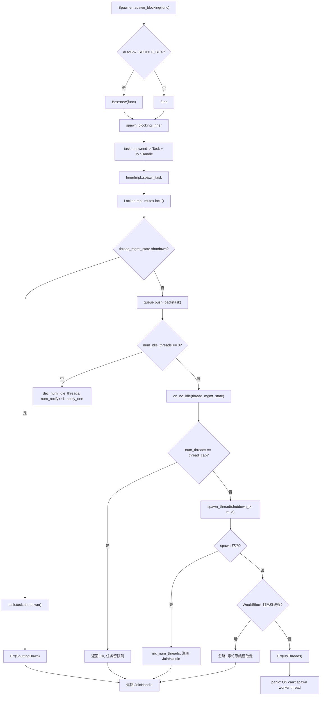
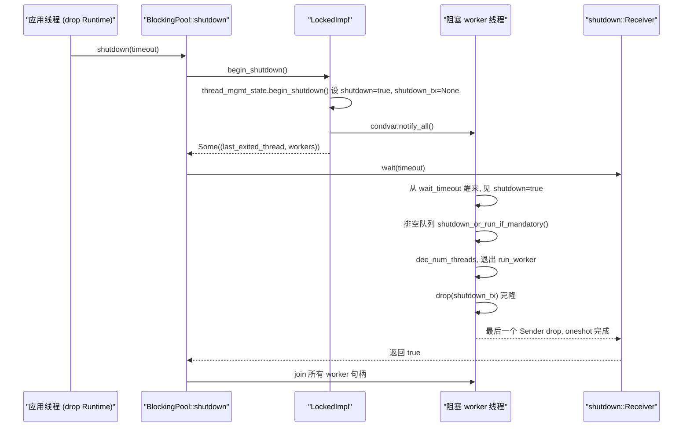

# 第 8 章：阻塞與橋接：spawn_blocking 執行緒池與 block_on 的邊界

上一章我們看到，非同步 Mutex 和通道之所以能在等待時不佔用執行緒，關鍵在於把 Waker 存進等待佇列，等條件滿足後再由喚醒者重新排程任務。但這一切的前提是任務能在 Pending 時主動讓出執行緒。一旦程式碼呼叫 std::fs::read、libsqlite3 或純 CPU 壓縮迴圈，它就會霸佔 worker 執行緒直到返回，期間該執行緒上的其他任務全部餓死。Tokio 的解法是把這類工作外包給獨立的阻塞執行緒池，並用 block_on 在非非同步上下文裡驅動 Future。本章拆解這兩條邊界。

# 8.1 阻塞執行緒池的記憶體佈局：Inner 與雙實現佇列

**直覺模型**：`spawn_blocking`執行緒池就像餐廳的「外包幫工池」。前台服務員（worker 執行緒）只負責點單和傳菜，遇到需要慢燉的菜就寫一張工單丟進後廚的傳菜窗口（佇列），幫工（阻塞執行緒）從窗口取單。若沒有這個池子，服務員就得親自下廚，整個餐廳停擺。

**核心結構**。整個池子由`BlockingPool`持有，它只存兩樣東西：一個可複製的`Spawner`（投遞入口）和一個`shutdown_rx`（關閉信號接收端）[FACT:tokio/src/runtime/blocking/pool.rs:20-23]。`Spawner`內部是`Arc<Inner>`，所有投遞者共享同一份狀態[FACT:tokio/src/runtime/blocking/pool.rs:26-28]。

`Inner`是池子的全部狀態，欄位值得逐個看[FACT:tokio/src/runtime/blocking/pool.rs:77-104]：

- `inner_impl: InnerImpl`：佇列 + 通知 + 鎖拓撲的實現，是一個列舉，有`Locked`和`Sharded`兩個變體[FACT:tokio/src/runtime/blocking/pool.rs:107-110]。這是本章最關鍵的抽象——它把「單鎖佇列」和「分片佇列」兩種拓撲統一在一個介面下。
- `thread_cap: usize`：執行緒數上限，即`max_blocking_threads`。
- `scheduler_threads: usize`：排程器 worker 執行緒數，用於在指標裡扣除，使`num_blocking_threads`只統計阻塞執行緒[FACT:tokio/src/runtime/blocking/pool.rs:455-460]。
- `keep_alive: Duration`：閒置執行緒存活時長，預設`KEEP_ALIVE = 10s` [FACT:tokio/src/runtime/blocking/pool.rs:231]。
- `metrics: SpawnerMetrics`：三個原子計數器——`num_threads`、`num_idle_threads`、`queue_depth` [FACT:tokio/src/runtime/blocking/pool.rs:31-35]。

> **[Design Inference & Architectural Trade-offs]**
> **為什麼用原子計數器而不是鎖內欄位？** `num_idle_threads`在`spawn_task`的熱路徑上被讀取（判斷是否需要喚醒閒置執行緒），如果它藏在`Mutex`裡，每次投遞都要先拿鎖再讀。把它做成`MetricAtomicUsize`後，投遞路徑可以在不持有佇列鎖的情況下先做一次快速判斷。代價是這些計數與佇列狀態之間沒有原子性保證，因此程式碼裡用`num_notify`計數器來補償——見下文。

**執行緒管理狀態**。`ThreadManagementState`被單獨抽出來，供兩種佇列實現複用[FACT:tokio/src/runtime/blocking/pool.rs:135-150]：

- `shutdown: bool`：關閉標誌。
- `shutdown_tx: Option<shutdown::Sender>`：每個 worker 執行緒持有一份複製，全部 drop 後`shutdown_rx`收到通知。
- `last_exiting_thread: Option<JoinHandle<()>>`：上一個超時退出的執行緒句柄。
- `worker_threads: HashMap<usize, JoinHandle<()>>`：所有存活 worker 的句柄。
- `worker_thread_index: usize`：單調遞增的執行緒 ID 分配器。

`last_exiting_thread`的設計動機在註解裡寫得很清楚：超時退出的執行緒會 join 上一個超時退出的執行緒，避免 Valgrind 誤報[FACT:tokio/src/runtime/blocking/pool.rs:135-150]。`worker_timed_out`正是這個鏈式 join 的實現——它移除自己的句柄，把舊的`last_exiting_thread`換出來返回給呼叫者去 join[FACT:tokio/src/runtime/blocking/pool.rs:172-178]。

**任務封裝**。佇列裡存的是`Task`，它包了一個`UnownedTask<BlockingSchedule>`和一個`Mandatory`標誌[FACT:tokio/src/runtime/blocking/pool.rs:187-191]。`Mandatory`決定關閉時這個任務是被丟棄還是強制執行：`shutdown_or_run_if_mandatory`在`NonMandatory`時調`shutdown()`，在`Mandatory`時調`run()` [FACT:tokio/src/runtime/blocking/pool.rs:223-228]。這就是`spawn_blocking`（非強制）與`spawn_mandatory_blocking`（強制，供 fs 使用）的區別[FACT:tokio/src/runtime/blocking/pool.rs:233-265]。

**單鎖實現的記憶體佈局**。`LockedImpl`是最原始的拓撲：一個`Mutex<LockedInner>`加一個`Condvar` [FACT:tokio/src/runtime/blocking/pool.rs:113-116]。`LockedInner`裡是`VecDeque<Task>`、`num_notify: u32`和`thread_mgmt_state` [FACT:tokio/src/runtime/blocking/pool.rs:118-124]。注意`num_notify`與`thread_mgmt_state`在同一個鎖下，而`num_idle_threads`是鎖外的原子量——這種「部分狀態在鎖內、部分在鎖外」的混合佈局，正是後面所有並發微妙性的根源。

# 8.2 投遞路徑：從 spawn_blocking 到執行緒喚醒

**場景**：非同步任務裡呼叫`tokio::task::spawn_blocking(move || heavy_compute(data))`，此刻發生了什麼？

**第一步：裝箱決策與任務構造**。`Spawner::spawn_blocking`先測量閉包大小`fn_size`，然後根據`AutoBox::<F>::SHOULD_BOX`決定是否把閉包`Box`起來[FACT:tokio/src/runtime/blocking/pool.rs:359-389]。這是 Tokio 通用的「大 Future 自動裝箱」策略：閉包過大時裝箱，避免任務結構體膨脹。

進入`spawn_blocking_inner`，先分配任務 ID，再用`blocking_task`把閉包包成一個 Future，最後用`task::unowned`構造出`UnownedTask`和`JoinHandle` [FACT:tokio/src/runtime/blocking/pool.rs:440-449]。注意這裡返回的是`(JoinHandle<R>, Result<(), SpawnError>)`二元組——句柄和投遞結果分開返回。

**第二步：投遞結果的三種處理**。回到`spawn_blocking`，對`spawn_result`做匹配[FACT:tokio/src/runtime/blocking/pool.rs:381-388]：

- `Ok(())`：正常，返回句柄。
- `Err(ShuttingDown)`：**不 panic**，仍然返回句柄。註解說明這是相容性考量——句柄永遠不會 resolve，但呼叫方不會因為執行時正在關閉而崩潰。
- `Err(NoThreads(e))`：OS 無法建立執行緒且池中無人接手，直接 panic。

**第三步：入隊與喚醒決策**。`spawn_task`把`on_no_idle`閉包傳給`InnerImpl::spawn_task`，由具體實作決定何時呼叫它[FACT:tokio/src/runtime/blocking/pool.rs:462-506]。看`LockedImpl::spawn_task`的臨界區[FACT:tokio/src/runtime/blocking/pool.rs:603-639]：

```rust
let mut locked = self.mutex.lock();

if locked.thread_mgmt_state.shutdown {
    task.task.shutdown();
    return Err(SpawnError::ShuttingDown);
}

locked.queue.push_back(task);
metrics.inc_queue_depth();

if metrics.num_idle_threads() == 0 {
    on_no_idle(&mut locked.thread_mgmt_state)?;
} else {
    metrics.dec_num_idle_threads();
    locked.num_notify += 1;
    self.condvar.notify_one();
}
```

這裡有兩個關鍵點。其一，關閉檢查在入隊之前，且即使任務是`Mandatory`也直接`shutdown()`——註解解釋：它在關閉開始之後才被排程，所以丟棄是合法的[FACT:tokio/src/runtime/blocking/pool.rs:614-620]。其二，喚醒決策依賴鎖外的`num_idle_threads`：若為 0，調`on_no_idle`嘗試起新執行緒；否則遞減空閒計數、遞增`num_notify`、`notify_one`。

**`num_notify`為什麼必須存在？**因為`Condvar`可能產生虛假喚醒（spurious wakeup）。如果只用`notify_one`而不計數，一個虛假喚醒的執行緒會誤以為有任務可取，結果發現佇列為空又睡回去，而真正被喚醒的執行緒可能永遠收不到通知。`num_notify`把「合法喚醒」變成可計數的令牌：投遞方`+1`，被喚醒方在`num_notify != 0`時才認為喚醒合法並`-1` [FACT:tokio/src/runtime/blocking/pool.rs:674-684]。

**第四步：起新執行緒**。`on_no_idle`閉包在持有佇列鎖的情況下執行[FACT:tokio/src/runtime/blocking/pool.rs:462-506]。它先檢查`num_threads == thread_cap`，達到上限就直接返回`Ok(())`——任務留在佇列裡等現有執行緒處理，這就是背壓。否則複製`shutdown_tx`，調`spawn_thread`建立執行緒，成功後遞增`num_threads`、遞增`worker_thread_index`、把句柄插入`worker_threads`。

`spawn_thread`用`thread::Builder`設定執行緒名和堆疊大小，然後 spawn 一個閉包：進入執行時上下文`rt.enter()`，呼叫`inner.run(id)`，最後 drop`shutdown_tx` [FACT:tokio/src/runtime/blocking/pool.rs:508-528]。

**OS 執行緒建立失敗的容錯**。`spawn_thread`可能失敗。程式碼對錯誤做了分類[FACT:tokio/src/runtime/blocking/pool.rs:488-500]：若是`WouldBlock`（臨時性錯誤，由`is_temporary_os_thread_error`判定[FACT:tokio/src/runtime/blocking/pool.rs:750-752]）且池中已有阻塞執行緒，則**靜默忽略**——任務會被某個當前忙碌的執行緒最終取走。否則返回`SpawnError::NoThreads`，最終導致 panic。

用一張控制流圖總結投遞路徑的決策分支：



# 8.3 worker 主迴圈：BUSY/IDLE 狀態機與逾時回收

**直覺模型**：每個阻塞執行緒就是一個「待命幫工」。有單時連續幹活（BUSY），沒單時打盹（IDLE），打盹超過`keep_alive`就下班（逾時退出）。若沒有逾時回收，池子會永久保留峰值時建立的所有執行緒，浪費記憶體與核心排程開銷。

**主迴圈結構**。`LockedImpl::run_worker`是一個`'main`迴圈，內部交替處於 BUSY 和 IDLE 兩個階段[FACT:tokio/src/runtime/blocking/pool.rs:642-735]。注意：這裡的 BUSY/IDLE 是迴圈內的**階段**，不是顯式列舉狀態，所以下面用流程圖而非狀態圖描述。

**BUSY 階段**：內層`while let Some(task) = locked.queue.pop_front()`不斷取任務[FACT:tokio/src/runtime/blocking/pool.rs:655-661]。取到後遞減`queue_depth`，**drop 鎖**，執行`task.run()`，再重新拿鎖。drop 鎖這一步至關重要——阻塞任務可能跑很久，絕不能持鎖執行。

**IDLE 階段**：佇列空了，遞增`num_idle_threads`，設`is_counted_idle = true`，然後進入等待迴圈[FACT:tokio/src/runtime/blocking/pool.rs:663-696]。核心是`condvar.wait_timeout(locked, keep_alive)`，返回後檢查三件事：

1. `num_notify != 0`：合法喚醒。遞減`num_notify`，設`is_counted_idle = false`（因為投遞方已經遞減過`num_idle_threads`了），break 回 BUSY[FACT:tokio/src/runtime/blocking/pool.rs:674-684]。

2. 未關閉且逾時：調`worker_timed_out`拿到上一個退出執行緒的句柄，`break 'main`退出迴圈[FACT:tokio/src/runtime/blocking/pool.rs:689-693]。

3. 否則為虛假喚醒，繼續等待。

**關閉時的佇列排空**。若`thread_mgmt_state.shutdown`為真，進入排空邏輯[FACT:tokio/src/runtime/blocking/pool.rs:698-710]：逐個彈出任務，drop 鎖，調`task.shutdown_or_run_if_mandatory()`——非強制任務被丟棄，強制任務照常執行。然後 break 退出主迴圈。

**退出清理**。執行緒退出前遞減`num_threads` [FACT:tokio/src/runtime/blocking/pool.rs:714]。若`is_counted_idle`為真，還要遞減`num_idle_threads`，並用`assert_ne!(prev_idle, 0)`斷言沒有下溢[FACT:tokio/src/runtime/blocking/pool.rs:716-726]。這個斷言是除錯期的護欄：一旦`num_idle_threads`記帳出錯，這裡會立刻 panic 而不是讓錯誤靜默傳播。

最後，若正在關閉且`num_threads == 0`（最後一個執行緒），`notify_one`喚醒可能在等待的關閉發起者[FACT:tokio/src/runtime/blocking/pool.rs:728-730]。返回`join_on_thread`，由`Inner::run`在退出前 join[FACT:tokio/src/runtime/blocking/pool.rs:755-771]。

**關閉握手**。`BlockingPool::shutdown`先調`begin_shutdown`拿到所有 worker 句柄[FACT:tokio/src/runtime/blocking/pool.rs:310-312]。`LockedImpl::begin_shutdown`設定關閉標誌、drop`shutdown_tx`、`notify_all`喚醒所有等待執行緒[FACT:tokio/src/runtime/blocking/pool.rs:740-745]。然後`shutdown_rx.wait(timeout)`阻塞等待[FACT:tokio/src/runtime/blocking/pool.rs:324]。

`shutdown::Receiver::wait`的實作很講究[FACT:tokio/src/runtime/blocking/shutdown.rs:37-70]：先處理`timeout == 0`的快速路徑直接返回 false；再調`try_enter_blocking_region()`進入阻塞區域，若失敗且當前正在 panic 則返回 false，否則 panic 並給出「不能在非同步上下文中 drop runtime」的提示[FACT:tokio/src/runtime/blocking/shutdown.rs:44-57]。最後根據 timeout 調`block_on_timeout`或`block_on`驅動那個 oneshot。

`shutdown_tx`的機制是：每個 worker 執行緒持有一份`Arc<oneshot::Sender<()>>`的複製[FACT:tokio/src/runtime/blocking/shutdown.rs:12-14]。所有執行緒退出後，所有複製被 drop，`Arc`計數歸零，`oneshot::Sender`被 drop，`Receiver`收到通知。這就是「所有 Sender drop 後 Receiver 被喚醒」的經典模式。



# 8.4 block_on：在非非同步上下文驅動 Future

**直覺模型**：`block_on`是執行時的「正門」。它把當前執行緒變成臨時的執行器，反覆 poll 傳入的 Future 直到完成。若沒有它，`main`函式就無法啟動任何非同步程式碼。

**入口與裝箱**。`Runtime::block_on`同樣先測大小、按`SHOULD_BOX`決定是否`Box::pin`，然後進`block_on_inner` [FACT:tokio/src/runtime/runtime.rs:343-350]。`block_on_inner`裡有兩段條件編譯的 trace 包裝（taskdump 和 tracing），然後`self.enter()`進入執行時上下文，最後按排程器類型分派[FACT:tokio/src/runtime/runtime.rs:353-383]：

```rust
let _enter = self.enter();

match &self.scheduler {
    Scheduler::CurrentThread(exec) => exec.block_on(&self.handle.inner, future),
    Scheduler::MultiThread(exec) => exec.block_on(&self.handle.inner, future),
}
```

兩種排程器的`block_on`語意不同，文件裡說得很清楚[FACT:tokio/src/runtime/runtime.rs:302-320]：

- **多執行緒排程器**：Future 在 I/O 驅動和定時器上下文中運行，`block_on`返回後已 spawn 的任務繼續運行。
- **當前執行緒排程器**：`block_on`可以被多個執行緒並發調用，第一個調用者取得 I/O 和定時器驅動的所有權，其他執行緒「鉤入」它。第一個`block_on`完成後，其他執行緒可以「偷走」驅動。`block_on`返回後已 spawn 的任務被掛起，再次調用`block_on`會恢復它們。

**關鍵限制：不能在非同步上下文中調用**。文件明確`block_on`在非同步執行上下文中調用會 panic[FACT:tokio/src/runtime/runtime.rs:321-324]。原因很直接：`block_on`會阻塞當前執行緒直到 Future 完成，若當前執行緒本身是某個 worker 執行緒，就會阻塞整個執行器——這正是`spawn_blocking`要解決的問題，所以兩者互斥。

**關閉路徑**。`Runtime::drop`按排程器類型分派[FACT:tokio/src/runtime/runtime.rs:506-521]：當前執行緒排程器需要先`try_set_current`進入上下文再 shutdown（保證任務在運行時上下文中被 drop）；多執行緒排程器直接 shutdown（worker 執行緒本身已在上下文中）。`shutdown_timeout`先關排程器再關阻塞池[FACT:tokio/src/runtime/runtime.rs:457-461]，`shutdown_background`等價於`shutdown_timeout(Duration::from_nanos(0))` [FACT:tokio/src/runtime/runtime.rs:494-496]。

# 設計思考、錯誤恢復與生產踩坑

**為什麼`spawn_blocking`的`ShuttingDown`不 panic？** [FACT:tokio/src/runtime/blocking/pool.rs:383-384]註釋說是兼容性考慮。`spawn_blocking`返回`JoinHandle`而非`Result`，若在關閉時 panic，會讓「運行時正在關閉」這個可預期狀態變成崩潰。返回一個永不 resolve 的句柄，調用方`await`時會一直掛起——但此時運行時已關閉，整個`block_on`也會退出，所以實際不會永久洩漏。

**`max_blocking_threads`的背壓語意**。預設值很大（512），因為`spawn_blocking`常用於檔案 I/O。但文件警告：跑 CPU 密集任務時要用信號量限制並發，否則會創建大量執行緒[FACT:tokio/src/task/blocking.rs:94-100]。達到上限後任務在佇列裡排隊，形成背壓——但注意這個背壓只作用於阻塞池，不會反壓到非同步排程器。

**`spawn_blocking`不可取消**。文件明確：`abort`對已開始運行的阻塞任務無效，任務會繼續跑完[FACT:tokio/src/task/blocking.rs:106-120]。只有尚未開始的任務可能被 abort 阻止。關閉時運行時會等待所有已開始的阻塞任務，`shutdown_timeout`超時後會洩漏這些執行緒。

**`num_idle_threads`的記帳陷阱**。`is_counted_idle`標誌的存在說明這個計數很容易出錯。投遞方在喚醒時遞減`num_idle_threads`，被喚醒方看到`num_notify != 0`後設`is_counted_idle = false`，避免重複遞減[FACT:tokio/src/runtime/blocking/pool.rs:679-682]。若這條路徑有 bug，`assert_ne!(prev_idle, 0)`會在退出時 panic[FACT:tokio/src/runtime/blocking/pool.rs:722-725]。生產環境若見到「`num_idle_threads`underflowed on thread exit」，說明池子的記帳邏輯被破壞。

> **[Design Inference & Architectural Trade-offs]**
> **`last_exiting_thread`鏈式 join 的代價**。超時退出的執行緒會 join 上一個超時退出的執行緒[FACT:tokio/src/runtime/blocking/pool.rs:172-178]。這形成一個 join 鏈：每個退出的執行緒都要等前一個真正結束。在高頻創建/銷毀阻塞執行緒的場景下，這條鏈可能變長，導致執行緒退出延遲累積。 這是為了避免 Valgrind 誤報而做的權衡，正常生產環境影響有限，但在執行緒頻繁超時的負載下值得關注。

**`InnerImpl`枚舉抽象的意義**。註釋說明`Locked`變體的行為與重構前完全一致，而`Sharded`變體為未來的並發佇列預留了對稱的槽位[FACT:tokio/src/runtime/blocking/pool.rs:537-539]。`spawn_task`、`run_worker`、`begin_shutdown`三個方法都通過枚舉分派[FACT:tokio/src/runtime/blocking/pool.rs:548-582]。這種「枚舉分派 + 每變體自持臨界區」的設計，使得新增佇列拓撲時不需要改動調用方。

# 本章小結

本章拆解了 Tokio 容納同步代碼的兩條邊界。`spawn_blocking`把閉包投遞到獨立的阻塞執行緒池：`Inner`持有佇列、執行緒上限、存活時長與原子指標；`LockedImpl`用單鎖 +`Condvar`實現佇列，`num_notify`計數器補償虛假喚醒；worker 在 BUSY/IDLE 間循環，空閒超時後鏈式 join 退出；`max_blocking_threads`達到上限後任務排隊形成背壓。`block_on`則在非非同步上下文驅動 Future，多執行緒與當前執行緒排程器語意不同，且嚴禁在非同步上下文中調用。關閉路徑通過`shutdown_tx`的`Arc`計數歸零觸發`oneshot`，實現「所有 worker 退出後喚醒關閉發起者」的握手。

# 本章思考與自測

Q1: 若把`LockedImpl::spawn_task`中`if metrics.num_idle_threads() == 0`的判斷改成恆為真（即每次都調`on_no_idle`），在高並發投遞場景下會發生什麼？為什麼？

**參考解析**：`on_no_idle`會檢查`num_threads == thread_cap`，未達上限就創建新執行緒[FACT:tokio/src/runtime/blocking/pool.rs:471-487]。若判斷恆為真，即使有空閒執行緒也會嘗試起新執行緒，導致執行緒數迅速衝到`thread_cap`。更嚴重的是，空閒執行緒不會被`notify_one`喚醒（因為走了`on_no_idle`分支而非`else`分支的`num_notify += 1; notify_one` [FACT:tokio/src/runtime/blocking/pool.rs:627-636]），佇列裡的任務可能無人處理，直到某個新執行緒啟動後才發現佇列非空。這會造成「執行緒爆滿但任務仍排隊」的假死狀態。原判斷的意義正是：有空閒執行緒時優先喚醒它們，避免無謂的執行緒創建。

Q2: `LockedImpl::run_worker`在 BUSY 階段執行`task.run()`前會`drop(locked)` [FACT:tokio/src/runtime/blocking/pool.rs:657-658]。如果去掉這個`drop`，在什麼場景下會觸發死鎖？

**參考解析**：`task.run()`執行的是用戶閉包，閉包內部完全可能再次調用`spawn_blocking`投遞新任務。投遞路徑`LockedImpl::spawn_task`第一件事就是`self.mutex.lock()` [FACT:tokio/src/runtime/blocking/pool.rs:612]。若 worker 持鎖執行閉包，閉包內的投遞就會嘗試獲取同一把鎖，而`std::sync::Mutex`不可重入，直接死鎖。此外，持鎖執行長任務會阻塞所有其他投遞者和 worker 的取任務操作，即使不死鎖也會讓整個池子串行化。`drop(locked)`是必須的。

Q3: `shutdown::Receiver::wait`在`try_enter_blocking_region()`失敗且當前正在 panic 時返回 false，否則 panic[FACT:tokio/src/runtime/blocking/shutdown.rs:44-57]。為什麼要在 panic 時特殊處理？如果去掉這個分支，在什麼場景下會出問題？

**參考解析**：`try_enter_blocking_region`失敗意味著當前處於異步上下文，不允許阻塞。正常情況下應 panic 提示用戶「不能在異步上下文中 drop runtime」。但如果當前線程已經在 panic（`std::thread::panicking()`為真），再 panic 會導致雙重 panic，Rust 默認行為是直接 abort 進程。場景：用戶在異步任務裡 drop 一個 Runtime，而該任務本身因為其他原因正在 panic，此時 drop 觸發的 shutdown 會二次 panic。返回 false 讓 shutdown 放棄等待，避免進程 abort，給用戶保留看到原始 panic 信息的機會。這是「panic 安全」的典型處理。

阻塞線程池與 block_on 劃定了異步運行時的能力邊界：前者把無法讓出線程的工作隔離到專用線程，後者讓非異步入口也能驅動 Future。但這兩條邊界在代碼裡往往不是手寫的——下一章我們將進入宏的世界，看看 #[tokio::main]、select! 和 join! 如何在編譯期生成這些運行時代碼。
