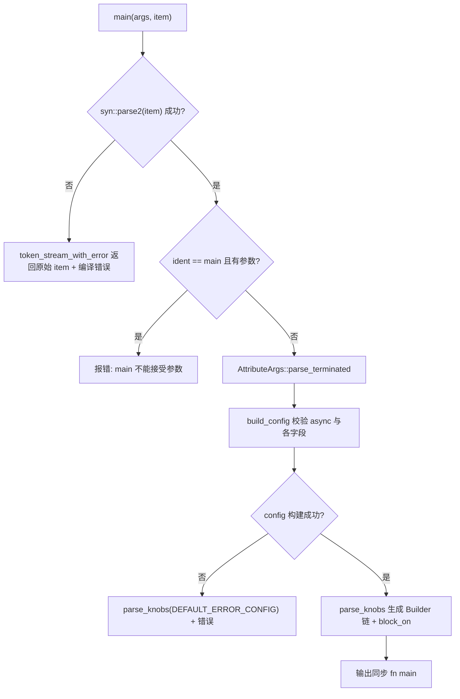
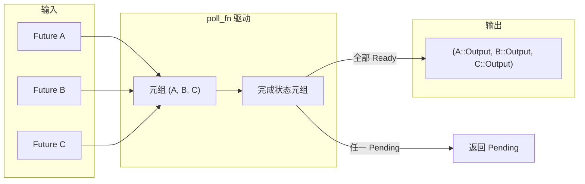

# 第 9 章：宏的魔法：#[tokio::main]、select! 與 join! 背後的代碼生成

上一章我們看到`block_on`與阻塞線程池如何劃定異步運行時的能力邊界，而用戶幾乎從不手寫這些邊界——他們寫`#[tokio::main]`、`select!`、`join!`，讓宏在編譯期把這些樣板代碼鋪開。宏是 Tokio 給用戶的第一層糖衣，也是編譯期真正生成運行時代碼的地方。本章聚焦`tokio-macros`crate 與`tokio/src/macros/select.rs`，拆解三條最常用的宏展開路徑，重點回答一個問題：宏展開後，真實的調用鏈長什麼樣，以及為什麼`select!`的取消安全語義必須單獨警惕。

# 9.1 #[tokio::main]：把 async fn 改寫成 Runtime::block_on

**直覺模型**：`#[tokio::main]`就像一張「裝修委託書」。你交出一間毛坯房（`async fn main`），它替你鋪好水電（構建 Runtime）、裝好門窗（`enable_all`），最後把你原本的家具（函數體）搬進去。若沒有它，每個`main`都得手寫`Builder::new_multi_thread().enable_all().build().unwrap().block_on(...)`，樣板代碼會淹沒業務邏輯。

## 數據結構與內存佈局

宏本身不產生運行時數據結構，但它解析出的配置被裝進兩個結構體。`Configuration`是「解析期的可變累加器」，字段全是`Option`，因為屬性參數可能缺省、可能重複、可能非法[FACT:tokio-macros/src/entry.rs:74-84]。注意`worker_threads`、`start_paused`、`unhandled_panic`都帶`Span`——這是為了在報錯時把錯誤定位到用戶寫的那一行，而不是宏內部[FACT:tokio-macros/src/entry.rs:74-84]。`FinalConfig`則是「校驗後的不可變結果」，`flavor`不再是`Option`，因為`build()`已經用`default_flavor`兜底[FACT:tokio-macros/src/entry.rs:55-62]。

`RuntimeFlavor`只有三個變體：`CurrentThread`、`Threaded`、`Local` [FACT:tokio-macros/src/entry.rs:10-14]。`from_str`裡特意為歷史遺留名字給出友好報錯：`single_thread`提示應叫`current_thread`，`basic_scheduler`提示已改名，`threaded_scheduler`提示已改名[FACT:tokio-macros/src/entry.rs:17-27]。這是宏作為「用戶第一接觸面」的典型設計：錯誤信息即文檔。

## Step-by-Step 展開流程

代入場景：用戶寫下`#[tokio::main(flavor = "multi_thread", worker_threads = 4)] async fn main() { ... }`。

第一步，`main`入口先解析 item 為自定義的`ItemFn` [FACT:tokio-macros/src/entry.rs:577-580]。這個`ItemFn`不是`syn::ItemFn`，而是 Tokio 自己實現的解析器，原因寫在註釋裡：它不想遞歸解析整條語句，只做「按 token tree 緩衝、遇到分號切分」的輕量解析[FACT:tokio-macros/src/entry.rs:720-764]。這避免了在宏裡對函數體做完整 AST 構建的開銷。

第二步，`build_config`校驗`async`關鍵字是否存在，缺失則報 "the`async` keyword is missing" [FACT:tokio-macros/src/entry.rs:346-349]。隨後遍歷屬性參數，把`worker_threads`、`flavor`、`start_paused`、`crate`、`unhandled_panic`、`name`分派到對應 setter[FACT:tokio-macros/src/entry.rs:369-399]。注意`core_threads`被顯式拒絕並提示已改名[FACT:tokio-macros/src/entry.rs:379-382]。

第三步，`Configuration::build`做跨字段一致性校驗。這裡有三條關鍵約束：`worker_threads`只允許`multi_thread` [FACT:tokio-macros/src/entry.rs:197-217]；`start_paused`只允許`current_thread`/`local` [FACT:tokio-macros/src/entry.rs:219-229]；`unhandled_panic`同樣只允許`current_thread`/`local` [FACT:tokio-macros/src/entry.rs:231-241]。若用戶選了`multi_thread`但`rt-multi-thread`feature 未開，報錯信息會根據是否顯式指定 flavor 而不同[FACT:tokio-macros/src/entry.rs:209-216]。

第四步，`parse_knobs`生成代碼。它先抹掉`asyncness` [FACT:tokio-macros/src/entry.rs:441]，然後根據 flavor 選擇 builder 起點：`CurrentThread`/`Local`用`Builder::new_current_thread()`，`Threaded`用`Builder::new_multi_thread()` [FACT:tokio-macros/src/entry.rs:468-477]。`Local`特殊之處在於 build 調用是`build_local(Default::default())`而非`build()` [FACT:tokio-macros/src/entry.rs:479-483]。隨後按需鏈式追加`.worker_threads(#v)`、`.start_paused(#v)`、`.unhandled_panic(...)`、`.name(#v)` [FACT:tokio-macros/src/entry.rs:485-497]。

第五步，生成最終函數體。核心是`last_block`：`return #rt.enable_all().#build.expect("Failed building the Runtime").block_on(body)` [FACT:tokio-macros/src/entry.rs:509-522]。注意那個顯式`return`，註釋指向 tokio-rs/tokio#4636，是為了修復類型推斷問題[FACT:tokio-macros/src/entry.rs:508]。

第六步，函數體被包成`async #body`並做類型檢查。非 test 路徑下，若返回類型不是`!`且不含`impl Trait`，會插入`if false { let _: &dyn Future<Output = #output_type> = &body; }`做編譯期斷言[FACT:tokio-macros/src/entry.rs:551-571]。test 路徑則用`pin!`把 body 釘在棧上並轉成`Pin<&mut dyn Future>`，註解解釋這是為了減少`block_on`泛型實例化的編譯開銷[FACT:tokio-macros/src/entry.rs:526-548]。



## 設計思考與生產踩坑

`main`與`test`共享`parse_knobs`，但預設 flavor 不同：`test`預設`CurrentThread`，`main`預設`Threaded` [FACT:tokio-macros/src/entry.rs:91-94]。這解釋了為什麼`#[tokio::test]`預設單執行緒——測試通常不需要多核，且單執行緒更容易復現。

一個容易被忽略的坑：巨集展開後每次呼叫函式都會新建 Runtime。文件明確警告，若函式被頻繁呼叫，應改用 Builder 復用 Runtime[FACT:tokio-macros/src/lib.rs:31-35]。把`#[tokio::main]`用在普通函式上是合法的，但每次呼叫都付一次 Runtime 建構成本。

另一個坑是`crate`重命名。當使用者`use tokio as tokio1`時，巨集內部預設生成的`tokio::runtime::Builder`會找不到路徑，必須顯式`crate = "tokio1"` [FACT:tokio-macros/src/lib.rs:239-264]。`parse_knobs`裡`crate_path`的預設值是`Ident::new("tokio", ...)` [FACT:tokio-macros/src/entry.rs:456-462]，這正是重命名場景報錯的根源。

# 9.2 select!：多分支輪詢、位元遮罩與隨機公平性

**直覺模型**：`select!`像一位「同時盯多個取餐窗口的服務員」。哪個窗口先出餐，他就端走哪份，其餘窗口的排隊作廢。若沒有它，使用者得手寫`poll_fn`把多個 Future 塞進一個元組逐個 poll，還要自己處理「某個分支就緒後其餘分支該丟棄」的邏輯。

## 資料結構與記憶體佈局

`select!`展開後生成一個局部模組`__tokio_select_util`，裡面有一個列舉`Out`和一個型別別名`Mask` [FACT:tokio/src/macros/select.rs:615-619]。`Out`的變體名是`_0`、`_1`……每個分支一個，外加一個`Disabled`表示所有分支都失效[FACT:tokio-macros/src/select.rs:33-39]。`Mask`的底層型別按分支數動態選擇：≤8 用`u8`，≤16 用`u16`，≤32 用`u32`，≤64 用`u64`，超過 64 直接 panic[FACT:tokio-macros/src/select.rs:17-31]。這個位元遮罩是`select!`的核心狀態：第 i 位為 1 表示第 i 個分支已被禁用。

所有 Future 被存進一個元組`futures`，每個元素先經`IntoFuture::into_future`轉換[FACT:tokio/src/macros/select.rs:654-656]。注意這裡先建構`futures_init`再逐個`into_future`，註解解釋這是為了利用臨時生命週期延長[FACT:tokio/src/macros/select.rs:641-646]。隨後`let mut futures = &mut futures;`把元組降級為可變引用，避免`poll_fn`閉包奪取所有權[FACT:tokio/src/macros/select.rs:658-662]。

## Step-by-Step 輪詢流程

代入場景：`select! { v = stream1.next() => ..., v = stream2.next() => ..., else => break }`。

第一步，巨集入口規則匹配。若有`biased;`前綴，`start=0` [FACT:tokio/src/macros/select.rs:801-803]；否則`start`是一個隨機表達式`thread_rng_n(BRANCHES)` [FACT:tokio/src/macros/select.rs:805-809]。這就是文件所說的「預設隨機挑選分支先檢查」的公平性來源[FACT:tokio/src/macros/select.rs:61-65]。

第二步，正規化。tt-muncher 把每個分支規整成`(skip) pat = fut, if cond => handler,`形式，`skip`是一串`_`，長度等於該分支之前的 branch 數[FACT:tokio/src/macros/select.rs:770-793]。`skip`既用於生成元組欄位存取`futures_init.$($skip)*`，也用於`count!`算出分支索引。

第三步，前置條件求值。對每個分支的`if $c`，若為 false，則`disabled |= 1 << index` [FACT:tokio/src/macros/select.rs:631-636]。注意：即使分支被禁用，其`$fut`表達式仍會被求值，只是不會被 poll[FACT:tokio/src/macros/select.rs:39-41]。

第四步，進入`poll_fn`閉包。先檢查協作預算：`ready!(poll_budget_available(cx))`，預算耗盡直接返回`Pending` [FACT:tokio/src/macros/select.rs:664-667]。這保證`select!`不會霸佔 worker。

第五步，迴圈`for i in 0..BRANCHES`，`branch = (start + i) % BRANCHES` [FACT:tokio/src/macros/select.rs:680-685]。對每個 branch：先查`disabled & mask == mask`，已禁用則`continue` [FACT:tokio/src/macros/select.rs:694-699]；否則從元組取出該 Future，用`Pin::new_unchecked`包一層（安全性依賴 Future 存於棧上且不被移動）[FACT:tokio/src/macros/select.rs:701-707]；poll 之，`Ready(out)`則先`disabled |= mask`再匹配模式[FACT:tokio/src/macros/select.rs:710-730]。

第六步，模式匹配。若`out`匹配`$bind`，返回`Poll::Ready(Out::_i(out))` [FACT:tokio/src/macros/select.rs:727-733]；若不匹配，`continue`繼續輪詢其他分支——這正是文件步驟 5 所說的「模式不匹配則禁用當前分支」[FACT:tokio/src/macros/select.rs:44-47]。

第七步，迴圈結束。若`is_pending`為真返回`Pending`，否則所有分支都失效，返回`Out::Disabled` [FACT:tokio/src/macros/select.rs:740-745]。外層`match output`把`Out::_i`映射到對應 handler，`Disabled`映射到`else`表達式[FACT:tokio/src/macros/select.rs:749-755]。

```mermaid
flowchart TD
    start["poll_fn 闭包被调用"] --> budget{"poll_budget_available(cx)?"}
    budget -->|否| pending_budget["返回 Pending"]
    budget -->|是| init["is_pending = false; start = $start"]
    init --> loop{"i |否| check_pending{"is_pending?"}
    check_pending -->|是| pending["返回 Pending"]
    check_pending -->|否| disabled_out["返回 Out::Disabled"]
    loop -->|是| branch["branch = (start+i) % BRANCHES"]
    branch --> is_disabled{"disabled & mask == mask?"}
    is_disabled -->|是| next_i["i += 1"]
    is_disabled -->|否| poll_fut["Pin::new_unchecked(fut).poll(cx)"]
    poll_fut --> poll_res{"Poll 结果?"}
    poll_res -->|Pending| set_pending["is_pending = true; i += 1"]
    poll_res -->|Ready| disable["disabled |= mask"]
    disable --> pat_match{"out 匹配 $bind?"}
    pat_match -->|否| next_i
    pat_match -->|是| ready_out["返回 Out::_i(out)"]
    next_i --> loop
    set_pending --> loop
```

## 設計思考與生產踩坑

**為什麼用位元遮罩而不是`Vec<bool>`？**位元遮罩是棧上單個整數，無堆積分配，且`disabled |= mask`是單條指令。對於熱路徑上的`select!`，這避免了每次迭代的堆積存取。

**為什麼模式不匹配要禁用分支？**這是`select!`與「簡單 race」的關鍵區別。考慮`Some(v) = stream.next() => ...`，若`stream.next()`返回`None`（串流結束），模式不匹配，該分支被永久禁用，避免無限輪詢一個已結束的串流。文件範例正是靠這個語義收集兩個串流直到都結束[FACT:tokio/src/macros/select.rs:198-223]。

**取消安全的真正含義**：`select!`一旦某分支就緒，其餘分支的 Future 會被 drop。若被 drop 的 Future 已經消費了資料但尚未返回，資料就丟了。文件明確列出`read_exact`、`read_to_end`、`write_all`不取消安全[FACT:tokio/src/macros/select.rs:119-124]，而`Mutex::lock`、`Semaphore::acquire`因為排隊公平性，取消會丟失佇列位置[FACT:tokio/src/macros/select.rs:126-133]。判定方法：找`.await`點，若在`.await`處重啟函式仍正確，則取消安全[FACT:tokio/src/macros/select.rs:135-139]。

**`if`前置條件的競態陷阱**：文件給了一個經典錯誤範例——用`if !sleep.is_elapsed()`守衛`sleep`分支，但`is_elapsed()`可能在`while`檢查與`select!`之間變為 true，導致超時被漏掉[FACT:tokio/src/macros/select.rs:336-376]。正確寫法是去掉`if`，讓`sleep`分支始終參與輪詢，超時後`break` [FACT:tokio/src/macros/select.rs:378-405]。

**`biased;`的代價**：隨機 RNG 有 CPU 成本，且某些場景需要確定的輪詢順序[FACT:tokio/src/macros/select.rs:67-74]。但`biased;`把公平性責任交給使用者：若一個分支永遠就緒，後面的分支會餓死[FACT:tokio/src/macros/select.rs:75-81]。

# 9.3 join! 與巨集展開的工程約束

**直覺模型**：`join!`像「同時等所有快遞都到齊」。它不像`select!`那樣誰先到就取消其餘，而是把所有 Future 的`Ready`值聚合成一個元組。若沒有它，使用者得手寫`poll_fn`維護每個 Future 的完成狀態。

## 資料結構與記憶體佈局

`join!`的展開同樣基於元組存 Future，但狀態不是位元遮罩，而是一個「已完成值」的元組。每個 Future 完成後，其值被取出存入結果元組，對應槽位標記為已完成。與`select!`不同，`join!`不會 drop 未完成的 Future——它必須等所有 Future 都完成才返回。

## Step-by-Step 流程

`join!`的輪詢邏輯與`select!`共享「元組存 Future +`poll_fn`驅動」的骨架，但語意相反：`select!`是「任一就緒即返回」，`join!`是「全部就緒才返回」。每輪 poll 遍歷所有未完成的 Future，任一返回`Pending`則整體`Pending`，全部`Ready`則聚合返回。



## 設計思考與生產踩坑

`join!`的取消安全語意與`select!`不同：`join!`被 drop 時，所有未完成的 Future 都會被 drop，同樣可能遺失資料。但由於`join!`不主動取消任何分支，它不會像`select!`那樣「因為另一個分支就緒而取消本分支」。真正的風險在於`join!`整體被外層`select!`或逾時取消。

`join!`與`try_join!`的區別值得注意：`try_join!`在任一 Future 返回`Err`時立即返回，取消其餘 Future，因此它繼承了`select!`的取消安全風險。

# 設計思考

**巨集作為編譯期程式碼生成器的邊界**。`#[tokio::main]`把配置校驗放在編譯期，非法組合（如`multi_thread` + `start_paused`）直接編譯失敗，而不是執行期 panic。這是巨集相對 Builder 的核心優勢：錯誤提前。

**宣告式巨集 + 程序巨集的混合架構**。`select!`的主體是`macro_rules!`，但兩處關鍵邏輯委託給程序巨集：`select_priv_declare_output_enum`生成`Out`列舉和`Mask`類型[FACT:tokio-macros/src/lib.rs:658-660]，`select_priv_clean_pattern`清除模式中的`ref`/`mut` [FACT:tokio-macros/src/lib.rs:666-668]。為什麼？註解解釋：宣告式巨集難以生成「按分支數動態選擇整數類型」的程式碼，也難以在模式位置做 token 級清洗[FACT:tokio/src/macros/select.rs:577-579]。

**`clean_pattern`的必要性**。`select!`把`out`以`&out`形式匹配模式[FACT:tokio/src/macros/select.rs:727]，若使用者寫`ref v`，會變成`&ref v`導致類型錯誤。`clean_pattern`遞迴刪除`by_ref`、`mutability`，以及`Reference`模式的`mutability` [FACT:tokio-macros/src/select.rs:68-73][FACT:tokio-macros/src/select.rs:100-103]。這是巨集在「使用者直覺」與「借用檢查器」之間做的妥協。

**64 分支上限的工程現實**。`count!`、`count_field!`、`select_variant!`三個巨集各自手寫了 0 到 64 的匹配規則[FACT:tokio/src/macros/select.rs:821-1017][FACT:tokio/src/macros/select.rs:1021-1217][FACT:tokio/src/macros/select.rs:1221-1414]。註解直言「I'm not happy about it either」[FACT:tokio/src/macros/select.rs:816-817]。這是宣告式巨集無法做算術的代價：只能用 token 數量硬編碼映射到整數。

# 本章小結

# 本章思考與自測

Q1: `select!`的`disabled`位元遮罩在每次進入`select!`時都重新初始化為`Default::default()` [FACT:tokio/src/macros/select.rs:627]。如果把這一行移到`poll_fn`閉包內部，在「迴圈呼叫 select! 且某分支模式不匹配」的場景下會發生什麼？

**參考解析**：`disabled`若在閉包內初始化，每次 poll 都會重置，導致上一輪因模式不匹配被禁用的分支重新參與輪詢。考慮`Some(v) = stream.next() => ...`且`stream`已結束（返回`None`），模式不匹配後該分支本應永久禁用。若`disabled`被重置，下一輪 poll 會再次 poll 這個已結束的流，若流不是 fused（即結束後再次 poll 可能 panic 或返回未定義行為），就會出問題。即便流是 fused，也會浪費 CPU 反覆 poll 一個永遠返回`None`的流。文件明確說「Re-entering select! due to a loop clears the disabled state」[FACT:tokio/src/macros/select.rs:37-38]，指的是重新進入`select!`巨集（新一輪迴圈），而非同一`select!`內的多輪 poll。`disabled`必須在閉包外初始化，才能在同一`select!`呼叫的多輪 poll 間保持狀態。

Q2: `select!`在 poll 到`Ready(out)`後先執行`disabled |= mask`再匹配模式[FACT:tokio/src/macros/select.rs:720-730]。如果去掉`disabled |= mask`，在模式不匹配且該 Future 每次 poll 都立即返回`Ready`的場景下會發生什麼？

**參考解析**：去掉`disabled |= mask`後，若`out`不匹配`$bind`，程式碼走`continue`繼續輪詢其他分支。但下一輪`poll_fn`被呼叫時（例如其他分支返回`Pending`後再次 poll），這個分支仍未被禁用，會再次被 poll。若該 Future 每次 poll 都立即返回`Ready`且值不匹配模式，就會形成「poll -> Ready -> 不匹配 -> continue -> 其他分支 Pending -> 返回 Pending -> 再次 poll -> 再次 Ready -> ...」的活鎖，CPU 空轉。`disabled |= mask`在`Ready`後立即置位，確保即使模式不匹配，該分支也不會被再次 poll。注意置位發生在模式匹配之前，所以「Ready 但模式不匹配」和「Ready 且模式匹配」兩種情況都會禁用該分支——前者是防止活鎖，後者是防止重複消費。

Q3: `parse_knobs`在非 test 路徑下插入`if false { let _: &dyn Future<Output = #output_type> = &body; }`做類型檢查[FACT:tokio-macros/src/entry.rs:557-561]，但對返回`!`或含`impl Trait`的類型跳過檢查[FACT:tokio-macros/src/entry.rs:551-556]。為什麼`impl Trait`需要跳過？如果強行檢查會怎樣？

**參考解析**：`impl Trait`在返回位置是「不透明類型」，編譯器不允許把它強制轉換為`&dyn Future<Output = impl Trait>`，因為`dyn`要求具體類型，而`impl Trait`的具體類型在函式外部不可見。若強行插入檢查，會報「the size for values of type`impl Future`cannot be known at compilation time」或「cannot be made into an object」之類的錯誤。回傳`!`的類型同理：`!`可以強制轉換為任何類型，但`&dyn Future<Output = !>`的`Output = !`本身可能觸發 never type 的不穩定特性問題。跳過檢查的代價是：若使用者寫了`async fn main() -> impl Trait`但實際回傳類型與`impl Trait`不符，錯誤會在`block_on`處才暴露，錯誤訊息可能不如顯式檢查清晰。這是「編譯期檢查完整性」與「類型系統限制」之間的權衡。

巨集把樣板程式碼與編譯期校驗從使用者手裡接了過去，但它生成的仍是普通的 Future 與`poll`呼叫。下一章我們將離開巨集的編譯期世界，進入執行時的 I/O 抽象層，看看`AsyncRead`/`AsyncWrite`如何把位元組流切成幀，以及`Framed`編解碼框架如何在`select!`的取消安全約束下正確工作。

`#[tokio::main]`的本質是「配置解析 + Builder 鏈生成 +`block_on`包裹」，配置校驗在編譯期完成，flavor 決定 builder 起點與 build 方法。`select!`的核心是「元組存 Future + 位元遮罩記禁用 + 隨機起點保公平」，模式不匹配即禁用分支，取消安全取決於被 drop 的 Future 是否在`.await`處可重啟。`join!`與`select!`共享骨架但語意相反，前者等全部完成，後者任一就緒即回傳。三者共同展示了 Tokio 巨集設計的核心權衡：把樣板程式碼與編譯期校驗交給巨集，把執行時語意的複雜性（尤其是取消安全）留給使用者顯式理解。理解了巨集如何生成執行時程式碼之後，下一個自然的問題是：當這些程式碼真正開始讀寫位元組流時，Tokio 提供了怎樣的抽象？第 10 章將剖析`AsyncRead`/`AsyncWrite`與編解碼框架，看`BufReader`/`BufWriter`如何減少系統呼叫、`copy_bidirectional`如何驅動雙向轉發、`Framed`如何把位元組流切分為幀，從而回答「非同步 I/O 的抽象邊界在哪裡」。
