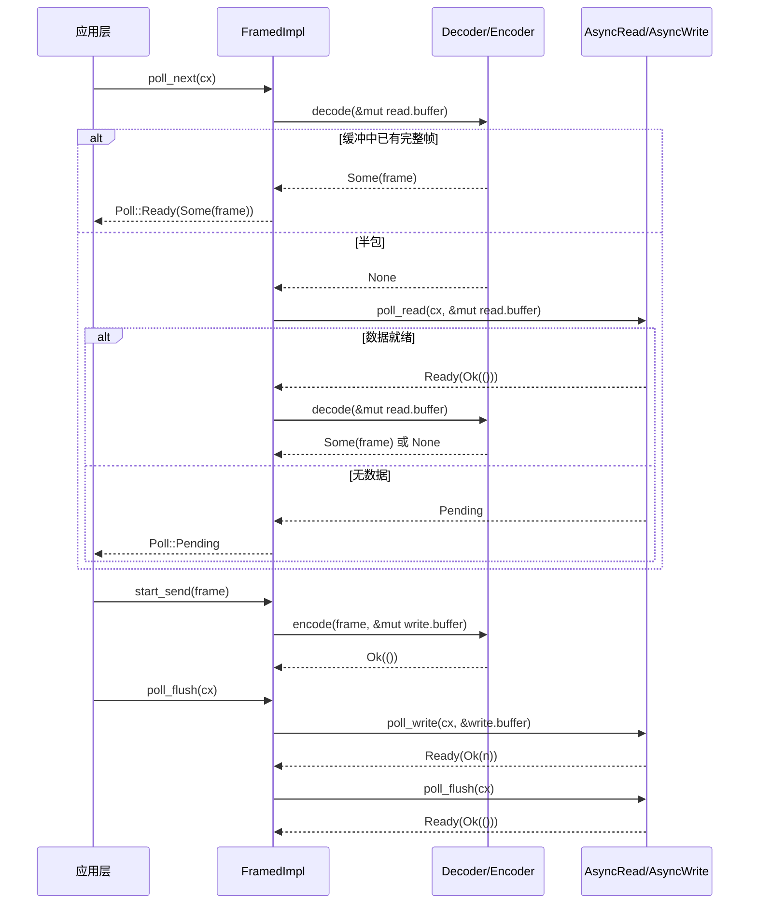

# 第 10 章：串流 I/O 抽象：AsyncRead/AsyncWrite 與編解碼框架

上一章拆解了 tokio-macros 的展開過程，我們看到 #[tokio::main]、select!、join! 如何把樣板程式碼與編譯期校驗從使用者手裡接過去。但巨集生成的仍是普通的 Future 與 poll 呼叫——當這些 Future 真正開始讀寫位元組時，Tokio 提供的底層抽象只有兩個 trait：AsyncRead 與 AsyncWrite。它們的問題在於「太底層」：一次 poll_read 只保證「讀了一些位元組」，不保證「讀到一個完整訊息」。而絕大多數協定（HTTP、Redis、gRPC、自訂 RPC）都是面向「幀」而非「位元組流」的。本章要回答的核心問題是：非同步 I/O 的抽象邊界應該劃在哪裡？Tokio 的答案分兩層：tokio::io 提供位元組流級別的 trait 與工具（BufReader/BufWriter/copy_bidirectional），tokio-util 的 codec 框架在此之上提供幀級別的 Stream/Sink 適配（Framed/LengthDelimitedCodec）。理解這兩層的分工，就理解了「為什麼協定實作幾乎都從 Framed 開始」。

# 一、AsyncRead/AsyncWrite：為什麼不能直接複用 std::io::Read

## 直覺模型

`std::io::Read::read`是「阻塞式取貨」：你站在窗口前，貨沒到就一直等，執行緒被掛起。`AsyncRead::poll_read`是「取餐憑證式取貨」：你問一句「好了嗎」，沒好（`Poll::Pending`）就先去做別的事，同時留下一個 Waker 讓系統在貨到時叫你。若沒有這個 trait，所有非同步 I/O 都得手寫`epoll`註冊與 Waker 映射——這正是第 5 章 Reactor 做的事，而`AsyncRead`是它暴露給上層的統一門面。

## 資料結構與記憶體佈局

`AsyncRead`的定義極其精簡，只有一個方法：

```rust
pub trait AsyncRead {
    fn poll_read(
        self: Pin,
        cx: &mut Context,
        buf: &mut ReadBuf,
    ) -> Poll>;
}
```

[FACT:tokio/src/io/async_read.rs:44-60]

三個參數各有講究。`self: Pin<&mut Self>`而非`&mut self`：因為`AsyncRead`常常被`async fn`生成的 Future 持有，而 Future 一旦被 poll 就不可移動（自引用），`Pin`是編譯器強制的契約。`cx: &mut Context<'_>`攜帶 Waker，是「取餐器」的傳遞通道。`buf: &mut ReadBuf<'_>`是 Tokio 對`&mut [u8]`的封裝——它同時記錄「已填充長度」與「未初始化容量」，避免`std::io::Read`那種「返回讀取位元組數但緩衝區可能未初始化」的歧義。

文件明確列出三種返回語意[FACT:tokio/src/io/async_read.rs:15-32]：`Ready(Ok(()))`表示資料已寫入`buf`，讀取量由`ReadBuf::filled`的長度增量決定；若增量為 0，要麼是 EOF，要麼是`buf.remaining() == 0`（緩衝區零容量）；`Pending`表示當前不可讀但已註冊喚醒；`Ready(Err(e))`是底層 I/O 錯誤。這裡有一個容易被忽略的陷阱：**「讀取量為 0」並不等于 EOF**——如果呼叫者傳入一個零容量緩衝區，`poll_read`會立即返回`Ready(Ok(()))`但什麼都沒讀。上層若把「0 位元組」當 EOF 處理，就會誤判連線關閉。

## 場景驅動 Walkthrough：從`&[u8]`讀一段位元組

考慮最簡單的實作——對`&[u8]`的`AsyncRead`：

```rust
impl AsyncRead for &[u8] {
    fn poll_read(
        mut self: Pin,
        _cx: &mut Context,
        buf: &mut ReadBuf,
    ) -> Poll> {
        let amt = std::cmp::min(self.len(), buf.remaining());
        let (a, b) = self.split_at(amt);
        buf.put_slice(a);
        *self = b;
        Poll::Ready(Ok(()))
    }
}
```

[FACT:tokio/src/io/async_read.rs:98-108]

逐步解析：`self.len()`是剩餘未讀切片長度，`buf.remaining()`是目標緩衝區剩餘容量，取二者較小值`amt`。`split_at(amt)`把切片切成「本次要拷貝的`a`」與「剩餘待讀的`b`」。`buf.put_slice(a)`把`a`拷入`ReadBuf`並推進其 filled 指標。`*self = b`把切片自身推進到剩餘部分——這是`&[u8]`作為「游標」的關鍵：每次 poll 後`self`指向未讀部分。最後返回`Ready(Ok(()))`，因為記憶體切片永遠「就緒」，不會`Pending`。

注意`_cx`被忽略：記憶體資料源不需要 Waker。這與網路 socket 形成對比——後者在無資料時會返回`Pending`並註冊可讀興趣。

`io::Cursor<T>`的實作多了一層邊界檢查[FACT:tokio/src/io/async_read.rs:113-134]：先取`position()`，若`pos > slice.len()`（位置越界）直接返回`Ready(Ok(()))`而不 panic[FACT:tokio/src/io/async_read.rs:113-134]。這是防禦性設計：`Cursor`的 position 可以被外部`set_position`設定到任意值，越界時按「已讀完」處理比 panic 更符合 I/O 語意。

## 設計思考：deref 巨集與 Pin 的傳播

`AsyncRead`為`Box<T>`、`&mut T`、`Pin<P>`提供了轉發實作。前兩者透過`deref_async_read!`巨集生成[FACT:tokio/src/io/async_read.rs:64-70]，核心是`Pin::new(&mut **self).poll_read(cx, buf)`——把`Pin<&mut Box<T>>`解引用為`Pin<&mut T>`再轉發。`Pin<P>`的實作更微妙[FACT:tokio/src/io/async_read.rs:87-93]：它呼叫`crate::util::pin_as_deref_mut(self)`，把`Pin<&mut Pin<P>>`投影為`Pin<&mut P::Target>`。這一層投影是必要的，否則嵌套`Pin`會導致型別不匹配。

> **[Design Inference & Architectural Trade-offs]**
> 這裡的設計動機是「零成本抽象」：轉發實作讓`Box<dyn AsyncRead>`、`&mut T`等包裝型別無需手寫`poll_read`，同時保持`Pin`語意正確。代價是每個轉發層都會引入一次間接呼叫，編譯器通常能內聯消除。

---

# 二、copy_bidirectional：雙向轉發的狀態機

## 直覺模型

`copy_bidirectional`是「雙向傳菜員」：它同時盯著 A→B 和 B→A 兩個方向，任何一邊讀到資料就寫到對面。若沒有它，實作一個 TCP 代理就得手寫兩個`copy`Future 並用`select!`組合——而`select!`的取消安全約束（第 9 章）會讓「讀到一半被取消」的資料遺失。`copy_bidirectional`用一個顯式狀態機把「讀-寫-關閉」的中間狀態保存下來，從而做到取消安全。

## 資料結構與記憶體佈局

核心是一個三態列舉：

```rust
enum TransferState {
    Running(CopyBuffer),
    ShuttingDown(u64),
    Done(u64),
}
```

[FACT:tokio/src/io/util/copy_bidirectional.rs:10-14]

`Running`持有`CopyBuffer`（內含 8KB 緩衝區與讀寫計數），表示「正在搬運資料」。`ShuttingDown(u64)`攜帶已拷貝位元組數，表示「讀端已 EOF，正在關閉寫端」。`Done(u64)`表示「關閉完成，記錄最終位元組數」。這個列舉是取消安全的關鍵：**任何時刻被 drop，狀態都保存在列舉裡，下次 poll 可從斷點繼續**。

`CopyBuffer`來自`copy.rs`，預設大小由`DEFAULT_BUF_SIZE`決定（8KB）[FACT:tokio/src/io/util/copy_bidirectional.rs:76-88]。兩個方向各持有一個獨立的`CopyBuffer`，因此記憶體開銷是 16KB。

## 場景驅動 Walkthrough：一次雙向轉發的完整生命週期

`copy_bidirectional_impl`用`poll_fn`把兩個方向的狀態機組合起來：

```rust
let mut a_to_b = TransferState::Running(a_to_b_buffer);
let mut b_to_a = TransferState::Running(b_to_a_buffer);
poll_fn(|cx| {
    let a_to_b = transfer_one_direction(cx, &mut a_to_b, a, b)?;
    let b_to_a = transfer_one_direction(cx, &mut b_to_a, b, a)?;
    let a_to_b = ready!(a_to_b);
    let b_to_a = ready!(b_to_a);
    Poll::Ready(Ok((a_to_b, b_to_a)))
})
.await
```

[FACT:tokio/src/io/util/copy_bidirectional.rs:127-151]

注意`transfer_one_direction`的呼叫順序：先推進 a→b，再推進 b→a，兩者都返回`Poll`。`ready!`巨集在任一方向未完成時立即返回`Pending`——但**另一個方向的狀態已經被推進了**。這正是註解強調的[FACT:tokio/src/io/util/copy_bidirectional.rs:143-144]：即使`ready!`提前返回，另一方向下次 poll 時仍會返回`Done(count)`，不會遺失進度。

`transfer_one_direction`內部是一個`loop`，按狀態推進：

```rust
loop {
    match state {
        TransferState::Running(buf) => {
            let count = ready!(buf.poll_copy(cx, r.as_mut(), w.as_mut()))?;
            *state = TransferState::ShuttingDown(count);
        }
        TransferState::ShuttingDown(count) => {
            ready!(w.as_mut().poll_shutdown(cx))?;
            *state = TransferState::Done(*count);
        }
        TransferState::Done(count) => return Poll::Ready(Ok(*count)),
    }
}
```

[FACT:tokio/src/io/util/copy_bidirectional.rs:29-42]

`Running`狀態下呼叫`poll_copy`，它內部迴圈「讀一塊、寫一塊」直到讀端 EOF 或寫端阻塞。EOF 時返回已拷貝總數，狀態轉為`ShuttingDown`。`ShuttingDown`呼叫`poll_shutdown`關閉寫端（發送 FIN），完成後轉`Done`。`Done`直接返回計數。

下面的流程圖展示了單方向狀態機的推進邏輯與錯誤分支：

```mermaid
flowchart TD
    start["transfer_one_direction 进入 loop"] --> match_state{"当前 TransferState?"}
    match_state -->|Running| poll_copy["buf.poll_copy(cx, r, w)"]
    poll_copy --> copy_ready{"poll_copy 结果?"}
    copy_ready -->|Pending| ret_pending["返回 Poll::Pending状态保持 Running"]
    copy_ready -->|Err| ret_err["返回 Poll::Ready(Err)错误向上传播"]
    copy_ready -->|Ok(count)| to_shutdown["state = ShuttingDown(count)"]
    to_shutdown --> match_state
    match_state -->|ShuttingDown| poll_shutdown["w.poll_shutdown(cx)"]
    poll_shutdown --> shutdown_ready{"shutdown 结果?"}
    shutdown_ready -->|Pending| ret_pending2["返回 Poll::Pending状态保持 ShuttingDown"]
    shutdown_ready -->|Err| ret_err
    shutdown_ready -->|Ok| to_done["state = Done(count)"]
    to_done --> match_state
    match_state -->|Done| ret_done["返回 Poll::Ready(Ok(count))"]
```

## 設計思考：為什麼用顯式狀態機而非 async fn

> **[Design Inference & Architectural Trade-offs]**
> 如果`transfer_one_direction`寫成`async fn`，編譯器會生成一個 Future，其內部狀態（`CopyBuffer`、已拷貝計數）被隱藏在生成的狀態機裡。這在單方向使用時沒問題，但`copy_bidirectional`需要在**同一個 poll 週期內**同時推進兩個方向——若用兩個`async fn`加`select!`，任一方向完成時另一個會被 drop，其內部緩衝區與計數遺失，違反取消安全。顯式`TransferState`把狀態暴露在堆疊上，`poll_fn`每次重新進入時狀態仍在，從而保證「被取消後可從斷點恢復」。

錯誤處理上，`poll_copy`返回的`Err`會透過`?`立即向上傳播[FACT:tokio/src/io/util/copy_bidirectional.rs:32]。文件明確說明[FACT:tokio/src/io/util/copy_bidirectional.rs:67-70]：中斷的讀寫會被重試，其他錯誤立即返回，且**部分已讀資料可能遺失**（未寫入對面）。這是生產環境需要注意的點：`copy_bidirectional`不保證「要麼全成功要麼全失敗」，錯誤發生時可能已有一半資料在途。

`copy_bidirectional_with_sizes`額外做了零大小斷言[FACT:tokio/src/io/util/copy_bidirectional.rs:99-125]，因為零容量緩衝區會導致`poll_copy`永遠返回`Ready(Ok(0))`被誤判為 EOF，形成忙循環。

---

# 三、Framed：把位元組流切成幀

## 直覺模型

`Framed`是「香腸機」：上游是連續的水流（`AsyncRead`/`AsyncWrite`），下游是切好的香腸段（`Stream<Item = Frame>` / `Sink<Frame>`）。`Decoder`負責「從水流中切出一段」，`Encoder`負責「把一段包成水流」。若沒有`Framed`，每個協議實作都要手寫「緩衝區管理 + 半包處理 + 黏包拆分」——這正是 codec 框架要消除的重複勞動。

## 資料結構與記憶體佈局

`Framed`本身只是一個薄包裝：

```rust
pub struct Framed {
    #[pin]
    inner: FramedImpl
}
```

[FACT:tokio-util/src/codec/framed.rs:38-41]

真正的狀態在`FramedImpl`的`state: RWFrames`裡，包含`read: ReadFrame`與`write: WriteFrame`兩部分。`ReadFrame`的欄位在`with_capacity`中可見[FACT:tokio-util/src/codec/framed.rs:107-126]：`eof: bool`（讀端是否 EOF）、`is_readable: bool`（是否已註冊可讀興趣）、`buffer: BytesMut`（讀緩衝）、`has_errored: bool`（是否已出錯，防止重複讀）。`WriteFrame`欄位[FACT:tokio-util/src/codec/framed.rs:119-122]：`buffer: BytesMut`（寫緩衝）、`backpressure_boundary: usize`（背壓閾值）。

`backpressure_boundary`是背壓機制的關鍵：當寫緩衝超過該閾值時，`poll_ready`會返回`Pending`直到資料被刷出，從而對上游`Sink`施加背壓。預設等於`capacity` [FACT:tokio-util/src/codec/framed.rs:121]，可透過`set_backpressure_boundary`調整[FACT:tokio-util/src/codec/framed.rs:271-273]。

## 場景驅動 Walkthrough：從 socket 讀一個幀

`Framed`的`Stream`實作只是轉發給`FramedImpl::poll_next` [FACT:tokio-util/src/codec/framed.rs:309-311]。真正的邏輯在`FramedImpl`裡（本章未提供該檔案，但可從`Framed`的介面推斷呼叫鏈）：

1. `poll_next`先檢查`read.buffer`中是否已有完整幀（呼叫`codec.decode`）；

2. 若`decode`返回`Some(frame)`，直接產出，不觸碰底層 I/O；

3. 若返回`None`（半包），檢查`read.eof`：若已 EOF 且緩衝非空，說明有殘留資料無法解碼，返回錯誤或`None`；

4. 否則呼叫底層`AsyncRead::poll_read`讀更多位元組到`read.buffer`；

5. 讀到的位元組再次嘗試`decode`，循環直到產出幀或`Pending`。

這個「先 decode 再 read」的順序很重要：它保證**一次 read 可能產出多個幀**（黏包），且**一個幀可能跨多次 read**（半包）。`is_readable`標誌避免重複註冊可讀興趣——若上次 poll 已註冊且未就緒，本次直接返回`Pending`而不重複呼叫底層。

`Sink`實作的呼叫鏈[FACT:tokio-util/src/codec/framed.rs:315-338]：`start_send`呼叫`codec.encode(item, &mut write.buffer)`把幀編碼進寫緩衝；`poll_flush`把`write.buffer`刷到底層`AsyncWrite`；`poll_ready`檢查`write.buffer.len() >= backpressure_boundary`，超閾值則先 flush 再返回就緒。

下面的時序圖展示了`Framed`在一次「讀幀-寫幀」往返中的跨組件協作：



## 取消安全：Framed 的文件警告

`Framed`的文件專門列出取消安全語意[FACT:tokio-util/src/codec/framed.rs:23-30]：`SinkExt::send`若在`select!`中被其他分支搶先完成，**訊息保證未發送，但訊息本身遺失**——因為`send`內部先`poll_ready`再`start_send`，若在`poll_ready`階段被 drop，`item`已被消費但未編碼。而`StreamExt::next`是取消安全的：它只持有對底層 stream 的引用，drop 不會遺失已解碼的幀。

> **[Design Inference & Architectural Trade-offs]**
> 這個不對稱性源於讀寫路徑的差異：讀路徑的狀態（`read.buffer`）保存在`Framed`內部，`next`被 drop 只是放棄「取幀」這個動作，緩衝區不受影響；寫路徑的狀態（待發送的`item`）在`send`的 Future 堆疊上，drop 即遺失。生產程式碼中若在`select!`裡用`send`，必須確保訊息可重發或接受遺失。

## 設計思考：`into_parts`與`map_codec`

`Framed`提供了`into_parts`/`from_parts`用於「換 codec 但保留緩衝區」[FACT:tokio-util/src/codec/framed.rs:290-298] [FACT:tokio-util/src/codec/framed.rs:155-166]。`map_codec`就是基於這對方法實作的[FACT:tokio-util/src/codec/framed.rs:221-234]：先`into_parts`拆出`io`/`codec`/`read_buf`/`write_buf`，再用`map`函式轉換 codec，最後`from_parts`重組。這個設計允許在協議升級（如從明文切換到 TLS）時保留已緩衝的資料，避免重新讀取。

`FramedParts`的`_priv: ()`欄位[FACT:tokio-util/src/codec/framed.rs:373-375]是「非窮盡結構體」技巧：私有欄位阻止外部直接建構，強制走`new`/`from_parts`，從而允許未來新增欄位而不破壞相容性。

---

# 四、LengthDelimitedCodec：長度前綴編解碼的狀態機

## 直覺模型

`LengthDelimitedCodec`是「按長度切香腸」的專用刀具：它假設每個幀前面有一個固定位元組數的長度欄位，先讀長度再讀 payload。若沒有它，實作一個長度前綴協議就得手寫「讀 4 位元組 → 解析長度 → 讀 N 位元組 → 循環」的狀態機——這正是它內部`DecodeState`做的事。

## 資料結構與記憶體佈局

```rust
pub struct LengthDelimitedCodec {
    builder: Builder,
    state: DecodeState,
}

enum DecodeState {
    Head,
    Data(usize),
}
```

[FACT:tokio-util/src/codec/length_delimited.rs:451-457]

`DecodeState`是顯式狀態機：`Head`表示「正在讀長度欄位」，`Data(n)`表示「已解析出長度 n，正在讀 payload」。這個狀態跨`decode`呼叫保持，因此**半包場景下不會遺失進度**。

`Builder`持有全部配置[FACT:tokio-util/src/codec/length_delimited.rs:416-435]：`max_frame_len`（預設 8MB）、`length_field_len`（預設 4 位元組）、`length_field_offset`（預設 0）、`length_adjustment`（預設 0）、`num_skip`（預設`None`，即`offset + len`）、`length_field_is_big_endian`（預設 true）。

## 場景驅動 Walkthrough：解碼一個長度前綴幀

`decode`是狀態機入口：

```rust
fn decode(&mut self, src: &mut BytesMut) -> io::Result> {
    let n = match self.state {
        DecodeState::Head => match self.decode_head(src)? {
            Some(n) => {
                self.state = DecodeState::Data(n);
                n
            }
            None => return Ok(None),
        },
        DecodeState::Data(n) => n,
    };

    match self.decode_data(n, src) {
        Some(data) => {
            self.state = DecodeState::Head;
            src.reserve(self.builder.num_head_bytes().saturating_sub(src.len()));
            Ok(Some(data))
        }
        None => Ok(None),
    }
}
```

[FACT:tokio-util/src/codec/length_delimited.rs:579-603]

`Head`狀態下呼叫`decode_head`。若返回`None`（資料不足），直接返回`Ok(None)`等待更多資料；若返回`Some(n)`，狀態轉為`Data(n)`。`Data`狀態下直接取 n。然後呼叫`decode_data(n, src)`：若緩衝中已有 n 位元組，`split_to(n)`切出幀，狀態回到`Head`，並預留下一幀頭部的空間；否則返回`None`等待。

`decode_head`是核心解析邏輯：

```rust
let head_len = self.builder.num_head_bytes();
let field_len = self.builder.length_field_len;

if src.len()  self.builder.max_frame_len as u64 {
        return Err(io::Error::new(
            io::ErrorKind::InvalidData,
            LengthDelimitedCodecError { _priv: () },
        ));
    }

    let n = n as usize;
    let n = if self.builder.length_adjustment  n,
        None => {
            return Err(io::Error::new(
                io::ErrorKind::InvalidInput,
                "provided length would overflow after adjustment",
            ));
        }
    }
};

src.advance(self.builder.get_num_skip());
src.reserve(n.saturating_sub(src.len()));
Ok(Some(n))
```

[FACT:tokio-util/src/codec/length_delimited.rs:504-562]

逐步解析：先檢查`src.len() >= head_len`，不足則返回`None` [FACT:tokio-util/src/codec/length_delimited.rs:499-502]。用`Cursor`包裝`src`以便`advance`/`get_uint`操作而不消耗原緩衝。`advance(length_field_offset)`跳過頭部前綴[FACT:tokio-util/src/codec/length_delimited.rs:517]。按端序讀取`field_len`位元組的長度值[FACT:tokio-util/src/codec/length_delimited.rs:520-524]。

**關鍵防禦**：若`n > max_frame_len`，立即返回`InvalidData`錯誤[FACT:tokio-util/src/codec/length_delimited.rs:526-531]。這防止惡意對端發送「長度欄位為 4GB」的幀導致記憶體耗盡——這是長度前綴協議最經典的 DoS 攻擊面。

長度調整用`checked_sub`/`checked_add`而非裸運算[FACT:tokio-util/src/codec/length_delimited.rs:537-541]，溢出時返回`InvalidInput`錯誤而非 panic。`get_num_skip()`返回`num_skip`或預設的`offset + len` [FACT:tokio-util/src/codec/length_delimited.rs:1070-1073]，跳過頭部剩餘部分。最後`reserve(n.saturating_sub(src.len()))`預留 payload 空間[FACT:tokio-util/src/codec/length_delimited.rs:559]——用`saturating_sub`是因為`src`可能已包含部分 payload。

下面的流程圖展示了`decode`的完整決策路徑：

```mermaid
flowchart TD
    entry["decode(src)"] --> check_state{"self.state?"}
    check_state -->|Head| head["decode_head(src)"]
    head --> head_result{"结果?"}
    head_result -->|Ok(None)| ret_none1["返回 Ok(None)等待更多数据"]
    head_result -->|Err| ret_err1["返回 Err长度超限或溢出"]
    head_result -->|Ok(Some(n))| set_data["state = Data(n)"]
    set_data --> decode_data
    check_state -->|Data(n)| decode_data["decode_data(n, src)"]
    decode_data --> data_result{"src.len() >= n?"}
    data_result -->|否| ret_none2["返回 Ok(None)等待更多数据"]
    data_result -->|是| split["src.split_to(n)state = Headreserve 下一帧头部"]
    split --> ret_frame["返回 Ok(Some(frame))"]
```

## 設計思考：max_frame_len 的裁剪與溢出防護

`Builder::adjust_max_frame_len`在構造 codec 時把`max_frame_len`裁剪到長度欄位能表示的最大值[FACT:tokio-util/src/codec/length_delimited.rs:1075-1081]。`max_allowed_frame_len`計算`max_length_field_value + length_adjustment` [FACT:tokio-util/src/codec/length_delimited.rs:1083-1089]，其中`max_length_field_value`用`checked_shl`處理`length_field_len == 8`時的移位溢出[FACT:tokio-util/src/codec/length_delimited.rs:1091-1096]。這個裁剪防止使用者設定「長度欄位 2 位元組但 max_frame_len 設為 1MB」這種矛盾配置——2 位元組最多表示 65535，裁剪後 max_frame_len 變為 65535。

編碼路徑的對稱防護：`encode`檢查`n > max_frame_len`返回`InvalidInput` [FACT:tokio-util/src/codec/length_delimited.rs:607-607]，長度調整同樣用`checked_add`/`checked_sub` [FACT:tokio-util/src/codec/length_delimited.rs:620-631]。注意編碼時的調整方向與解碼相反：解碼是「讀到的長度 ± adjustment = payload 長度」，編碼是「payload 長度 ∓ adjustment = 寫入的長度欄位」[FACT:tokio-util/src/codec/length_delimited.rs:620-624]。

> **[Design Inference & Architectural Trade-offs]**
> 這種「解碼加、編碼減」的對稱設計是為了讓`length_adjustment`語義統一：它表示「長度欄位值與 payload 長度之差」。當協議的長度欄位包含頭部時（如 Example 3），`adjustment = -2`，解碼時`n - (-2) = n + 2`得到 payload 長度，編碼時`payload - (-2) = payload + 2`寫回長度欄位。

---

# 設計思考：抽象邊界的三個層次

回顧本章，Tokio 的 I/O 抽象呈現清晰的三層結構：

**第一層：位元組流 trait（`AsyncRead`/`AsyncWrite`）**。只承諾「讀/寫一些位元組」，不承諾幀邊界。這是最小介面，任何 I/O 源（socket、檔案、記憶體切片）都能實現。代價是上層必須自己處理半包/黏包。

**第二層：位元組流工具（`BufReader`/`BufWriter`/`copy_bidirectional`）**。在 trait 之上提供「減少系統呼叫」「雙向轉發」等通用能力。`copy_bidirectional`的顯式狀態機展示了「取消安全」如何在工具層實現——狀態保存在堆疊上而非 Future 內部。

**第三層：幀適配（`Framed`/`Decoder`/`Encoder`）**。把位元組流提升為`Stream<Frame>`/`Sink<Frame>`，讓協議實現只需關心「幀的編解碼」而非「緩衝管理」。`LengthDelimitedCodec`是這一層的標準範例，其`DecodeState`狀態機與`max_frame_len`防護是所有長度前綴協議都應複用的模式。

> **[Design Inference & Architectural Trade-offs]**
> 這三層的劃分不是偶然的：它對應「抽象洩漏」的三個梯度。越底層越通用但越難用，越上層越好用但越專用。Tokio 選擇把「幀」作為一等公民放在`tokio-util`而非`tokio`核心，是因為幀的定義因協議而異——`tokio`只提供位元組流，`tokio-util`提供幀框架，具體協議（HTTP/Redis/gRPC）在各自 crate 裡實現`Decoder`/`Encoder`。

---

# 本章小結

- `AsyncRead::poll_read`用`Pin<&mut Self>` + `Context` + `ReadBuf`三參數替代`std::io::Read::read`，把「阻塞等待」變為「註冊 Waker + 返回 Pending」。`Ready(Ok(()))`且讀取量為 0 時需區分 EOF 與零容量緩衝區。
- `copy_bidirectional`用`TransferState`三態列舉（`Running`/`ShuttingDown`/`Done`）保存中間狀態，使雙向轉發在`select!`取消下仍能恢復。錯誤發生時部分資料可能遺失。
- `Framed`把`AsyncRead`/`AsyncWrite`適配為`Stream`/`Sink`，`ReadFrame`/`WriteFrame`分別管理讀寫緩衝與背壓。`SinkExt::send`非取消安全（訊息遺失），`StreamExt::next`取消安全。
- `LengthDelimitedCodec`用`DecodeState`（`Head`/`Data(n)`）狀態機處理半包，`max_frame_len`防護長度欄位 DoS，`checked_add`/`checked_sub`防護調整溢出。

# 本章思考與自測

Q1: `copy_bidirectional`的`transfer_one_direction`中，若把`TransferState::ShuttingDown`分支的`ready!(w.as_mut().poll_shutdown(cx))?`改為直接`*state = TransferState::Done(*count)`（跳過 shutdown），在什麼場景下會導致對端連線無法正常關閉？

**參考解析**：`poll_shutdown`的作用是向對端發送 FIN 包，通知「我這邊沒有更多資料了」。若跳過它直接轉`Done`，寫端不會關閉，對端會一直等待資料，形成「半開連線」——對端可能永遠阻塞在`read`上，直到逾時。在 TCP 代理場景中，這會導致連線洩漏：客戶端已斷開，但代理到後端的連線仍保持。原始碼中`ShuttingDown`狀態的存在[FACT:tokio/src/io/util/copy_bidirectional.rs:35-39]正是為了確保 EOF 後顯式關閉寫端。注意`poll_shutdown`本身可能返回`Pending`（如發送緩衝區滿），所以必須用`ready!`等待而非忽略。

Q2: `LengthDelimitedCodec::decode_head`中，若去掉`if n > self.builder.max_frame_len as u64`的檢查[FACT:tokio-util/src/codec/length_delimited.rs:526-531]，惡意客戶端發送長度欄位為`0xFFFFFFFF`（4GB）的幀頭會觸發什麼後果？為什麼這個檢查必須在`length_adjustment`之前？

**參考解析**：去掉檢查後，`n`會被轉為`usize`並傳給`decode_data`。`decode_data`檢查`src.len() < n`時返回`None`，但`decode_head`末尾的`src.reserve(n.saturating_sub(src.len()))` [FACT:tokio-util/src/codec/length_delimited.rs:559]會嘗試預留 4GB 記憶體，導致 OOM 或分配失敗 panic。檢查必須在`length_adjustment`之前，因為`length_adjustment`可能為負數（如`-2`），若先調整再檢查，`0xFFFFFFFF - 2`仍接近 4GB，檢查形同虛設；且負調整可能讓`checked_sub`先失敗，錯誤訊息會誤導為「溢出」而非「幀過大」。原始碼順序 [FACT:tokio-util/src/codec/length_delimited.rs:526-

至此，我們理清了 Tokio 在位元組流與訊息幀之間的兩層抽象：tokio::io 負責位元組搬運，tokio-util 的 codec 框架負責幀切分與編解碼。Framed 之所以成為協定實作的起點，正是因為它把「讀到一個完整訊息」這一高頻需求封裝成了可複用的 Stream/Sink 適配。但幀只是資料的容器，當協定需要處理動態任務集合、結構化取消或更複雜的串流組合時，僅靠 Framed 還不夠。下一章將進入 tokio-stream 與 tokio-util 的擴展機制，看看 StreamExt 組合子、StreamMap/JoinSet/TaskTracker 以及 CancellationToken 如何複用底層 Waker 與排程機制，為非同步迭代與任務管理提供更上層的工具。
