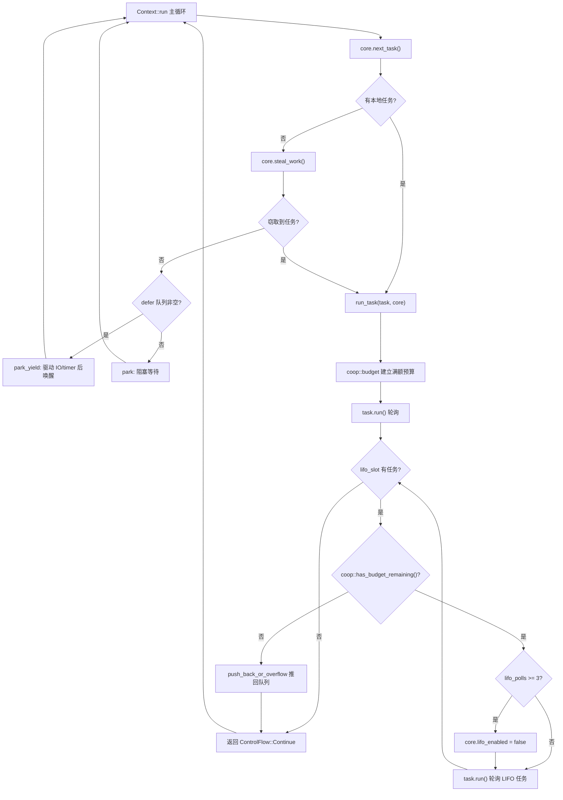

# 第 12 章：協作式排程與預算：coop 機制如何防止任務餓死排程器

上一章我們看到，tokio-stream 與 tokio-util 如何複用底層的 Waker 與排程機制來擴展核心能力。但無論擴展出多少組合子，非同步執行時的核心矛盾始終存在：排程器必須公平地在多個任務之間分配 CPU 時間，而任務本身是非搶佔的——一旦某個 Future 的 poll 開始執行，排程器就無法從外部打斷它。如果一個任務在單次 poll 裡迴圈處理了十萬條訊息，或者在一個 loop 裡反覆 await 一個永遠就緒的 Future，它就會霸佔 worker 執行緒，讓同執行緒上的其他任務永遠得不到輪詢機會。這就是經典的「任務餓死排程器」問題。Tokio 的解法不是搶佔，而是協作：給每個任務一次排程週期內分配有限的預算，資源操作會消耗預算，預算耗盡後任務必須主動讓出。本章深入這套 coop 機制的實現。

# 12.1 預算的載體：執行緒本地儲存與 Budget 結構

> **[Design Inference & Architectural Trade-offs]**
> 如果把排程器比作餐廳裡唯一的服務員，任務就是不斷加菜的顧客，那麼 coop 預算就是「每位顧客最多點 N 道菜」的規則——服務員不需要強行打斷顧客，只需在顧客點滿 N 道後說「您先歇會兒，我服務下一位」。沒有這條規則，一個話癆顧客就能讓整個餐廳癱瘓。

預算必須滿足兩個約束：第一，它要能被任意深度的`poll`呼叫棧存取，而不必層層傳參；第二，它要能區分「當前是否在 Tokio 執行時內」——在執行時外呼叫`block_on`時不應受預算約束。Tokio 選擇用**執行緒本地儲存（TLS）**承載預算，並透過`context`模組統一管理。

預算的核心類型是`coop::Budget`。雖然本章原始碼切片未直接給出`coop.rs`的完整定義，但從`worker.rs`的使用點可以反推出它的介面契約：

[FACT:tokio/src/runtime/scheduler/multi_thread/worker.rs:695-795]

```rust
coop::budget(|| {
    // ... 轮询任务 ...
    task.run();
    // ...
    loop {
        // ...
        if !coop::has_budget_remaining() {
            // 预算耗尽，把 LIFO 任务推回队列
            core.run_queue.push_back_or_overflow(task, ...);
            return ControlFlow::Continue(core);
        }
        // ...
    }
})
```

這裡出現了三個關鍵 API：`coop::budget(closure)`建立一個預算作用域，`coop::has_budget_remaining()`查詢剩餘預算，以及後文會看到的`coop::stop()`與`coop::set()`。`budget`的語義是：進入閉包時把當前執行緒的預算重置為一個滿額值（預設 128），閉包執行期間所有資源操作共享這個額度，閉包退出時恢復外層預算。

> **[Design Inference & Architectural Trade-offs]**
> 預算值 128 是一個經驗值：它足夠大，讓正常的訊息處理迴圈（比如一次 poll 處理幾十條訊息）不會頻繁觸發讓出；又足夠小，讓一個失控的迴圈最多跑 128 次資源操作就必須讓出，把延遲控制在可接受範圍。

`Budget`在 TLS 中通常以`Cell<Option<Budget>>`形式存在。`Option`的外層語義是「當前執行緒是否處於 Tokio 執行時上下文」：`None`表示不在執行時內（例如執行時外的`block_on`），此時所有預算檢查都直接放行。

# 12.2 預算的消耗點：資源操作如何扣減

預算不會憑空消耗，只有**資源操作**才會扣減它。所謂資源操作，是指那些可能被無限迴圈呼叫的、與外部世界互動的 API——channel 的`send`/`recv`、I/O 的讀寫、`yield_now`等。以`mpsc::Sender::reserve`為例，它是所有發送路徑的公共入口：

[FACT:tokio/src/sync/mpsc/bounded.rs:1272-1311]

```rust
async fn reserve_inner(&self, n: usize) -> Result> {
    crate::trace::async_trace_leaf().await;

    if n > self.max_capacity() {
        return Err(SendError(()));
    }
    // ... WakeReceiverOnDrop guard ...
    let guard = WakeReceiverOnDrop { chan: &self.chan };
    let result = self.chan.semaphore().semaphore.acquire(n).await;
    // ...
}
```

`reserve_inner`在真正獲取信號量許可之前，會經過`crate::trace::async_trace_leaf()`。這個看似只是 tracing 的呼叫，實際上是預算扣減的掛載點之一。`async_trace_leaf`內部會呼叫`coop::poll_proceed`一類的函式：如果預算充足，扣減 1 並返回`Proceed`；如果預算耗盡，則註冊一個「讓出」動作——把當前任務的 Waker 交給排程器，返回`Pending`，讓任務在這次 poll 中提前結束。

這就是 coop 的精妙之處：**預算耗盡不是拋錯，而是把「讓出」偽裝成一次普通的`Pending`**。上層 Future 看到`Pending`會自然地返回，排程器把任務重新入隊，等下次被排程時預算已重置，任務從上次中斷處繼續。整個過程對業務程式碼完全透明。

`yield_now`是預算機制最直白的體現，它不消耗預算，而是**主動觸發讓出**：

[FACT:tokio/src/task/yield_now.rs:38-60]

```rust
pub async fn yield_now() {
    let mut yielded = false;
    poll_fn(|cx| {
        ready!(crate::trace::trace_leaf());

        if yielded {
            return Poll::Ready(());
        }

        yielded = true;

        // Don't wake the task immediately, as that would push it right back
        // onto the run queue and it could be polled again before other tasks
        // or the IO/timer driver get a chance to run. Instead, hand the waker
        // to the scheduler, which wakes deferred tasks only after it has run
        // out of ready tasks and polled the driver. When polled from outside
        // a Tokio runtime, the waker is woken immediately.
        context::defer(cx.waker());

        Poll::Pending
    })
    .await
}
```

注意`context::defer(cx.waker())`這一行。它沒有直接`wake`，而是把 Waker 交給排程器的**defer 佇列**。為什麼？原始碼註解說得很清楚：如果立即喚醒，任務會被立刻推回執行佇列，可能在 I/O/timer 驅動執行之前就被再次輪詢，讓出就失去了意義。defer 佇列的語義是「等當前 worker 把就緒任務跑完、並且輪詢過驅動之後，再喚醒這些任務」。

defer 佇列定義在 worker 的`Context`中：

[FACT:tokio/src/runtime/scheduler/multi_thread/worker.rs:247-257]

```rust
pub(crate) struct Context {
    worker: Arc,
    core: RefCell>>,
    /// Tasks to wake after resource drivers are polled. This is mostly to
    /// handle yielded tasks.
    pub(crate) defer: Defer,
}
```

`defer`欄位的註解直接點明它的用途：「mostly to handle yielded tasks」。在 worker 主迴圈中，當本地佇列和竊取都無活可幹時，會檢查 defer 佇列：

[FACT:tokio/src/runtime/scheduler/multi_thread/worker.rs:613-621]

```rust
} else {
    // Wait for work
    core = if !self.defer.is_empty() {
        self.park_yield(core)
    } else {
        self.park(core)
    };
    core.stats.start_processing_scheduled_tasks();
}
```

如果 defer 佇列非空，worker 呼叫`park_yield`——以 0 逾時 park，這會驅動 I/O 和 timer，然後喚醒 defer 中的任務。這就保證了「讓出」的任務一定是在驅動跑過之後才被重新排程。

# 12.3 預算作用域的建立與恢復：run_task 與 block_in_place

預算作用域在`run_task`中建立。每個任務被輪詢時，`coop::budget`包裹整個輪詢過程：

[FACT:tokio/src/runtime/scheduler/multi_thread/worker.rs:691-704]

```rust
// Make the core available to the runtime context
*self.core.borrow_mut() = Some(core);

// Run the task
coop::budget(|| {
    // ...
    task.run();
    // ...
})
```

`coop::budget`進入時把 TLS 中的預算設為滿額，退出時恢復。這意味著**每個任務每次被輪詢都獲得一份全新的預算**。任務內部無論`await`了多少次資源操作，只要單次`poll`內消耗超過 128，就會被強制讓出。

但這裡有一個微妙的問題：LIFO slot 中的任務是在**同一個`budget`閉包內**被輪詢的。看`run_task`的迴圈：

[FACT:tokio/src/runtime/scheduler/multi_thread/worker.rs:709-750]

```rust
let mut lifo_polls = 0;

// As long as there is budget remaining and a task exists in the
// `lifo_slot`, then keep running.
loop {
    let mut core = match self.core.borrow_mut().take() {
        Some(core) => core,
        None => {
            return ControlFlow::Break(());
        }
    };

    let task = match core.lifo_slot.take() {
        Some(task) => task,
        None => {
            self.reset_lifo_enabled(&mut core);
            core.stats.end_poll();
            return ControlFlow::Continue(core);
        }
    };

    if !coop::has_budget_remaining() {
        core.stats.end_poll();
        // Not enough budget left to run the LIFO task, push it to
        // the back of the queue and return.
        core.run_queue.push_back_or_overflow(task, ...);
        debug_assert!(core.lifo_enabled);
        return ControlFlow::Continue(core);
    }
    // ...
}
```

關鍵點：LIFO slot 中的任務**共享外層任務的預算**。註解在`run_task`開頭就說：「Tasks from the LIFO slot inherit the "parent"'s limits」。這是有意的設計——如果每個 LIFO 任務都重置預算，那麼在 ping-pong 場景（任務 A 喚醒 B，B 又喚醒 A）下，兩個任務會無限互相排程，預算永遠重置，餓死問題依舊。共享預算意味著 A 和 B 加起來最多消耗 128 次資源操作，之後必須讓出。

LIFO slot 本身還有一個獨立的限流器`MAX_LIFO_POLLS_PER_TICK`：

[FACT:tokio/src/runtime/scheduler/multi_thread/worker.rs:756-766]

```rust
// Disable the LIFO slot if we reach our limit
//
// In ping-ping style workloads where task A notifies task B,
// which notifies task A again, continuously prioritizing the
// LIFO slot can cause starvation as these two tasks will
// repeatedly schedule the other. To mitigate this, we limit the
// number of times the LIFO slot is prioritized.
if lifo_polls >= MAX_LIFO_POLLS_PER_TICK {
    core.lifo_enabled = false;
    super::counters::inc_lifo_capped();
}
```

`MAX_LIFO_POLLS_PER_TICK`的值是 3：

[FACT:tokio/src/runtime/scheduler/multi_thread/worker.rs:263-263]

```rust
/// Value picked out of thin-air. Running the LIFO slot a handful of times
/// seems sufficient to benefit from locality. More than 3 times probably is
/// over-weighting. The value can be tuned in the future with data that shows
/// improvements.
const MAX_LIFO_POLLS_PER_TICK: usize = 3;
```

這是**第二道防線**：即使預算還沒耗盡，LIFO slot 連續被優先 3 次後也會被停用，後續任務走普通佇列。預算管的是「資源操作總量」，LIFO 限流管的是「同一對任務互相喚醒的次數」，兩者互補。

預算作用域在`block_in_place`中有一個重要的例外。`block_in_place`會把 worker core 移交給另一個執行緒，當前執行緒進入阻塞狀態。阻塞程式碼不受預算約束，所以必須**暫停**預算：

[FACT:tokio/src/runtime/scheduler/multi_thread/worker.rs:406-417]

```rust
if had_entered {
    // Unset the current task's budget. Blocking sections are not
    // constrained by task budgets.
    let _reset = Reset {
        take_core,
        budget: coop::stop(),
    };

    crate::runtime::context::exit_runtime(f)
} else {
    f()
}
```

`coop::stop()`回傳當前預算並把它設為`None`（即「不在執行時內」），`Reset`的`Drop`在阻塞結束後恢復：

[FACT:tokio/src/runtime/scheduler/multi_thread/worker.rs:374-397]

```rust
impl Drop for Reset {
    fn drop(&mut self) {
        with_current(|maybe_cx| {
            if let Some(cx) = maybe_cx {
                if self.take_core {
                    let core = cx.worker.core.take();
                    // ...
                    *cx_core = core;
                }

                // Reset the task budget as we are re-entering the
                // runtime.
                coop::set(self.budget);
            }
        });
    }
}
```

`coop::set(self.budget)`把之前`stop()`保存的預算恢復回去。這樣，`block_in_place`內的同步阻塞程式碼不會消耗預算，也不會因為預算耗盡而誤觸發讓出；阻塞結束後，任務帶著原來的剩餘預算繼續執行。

下面這張圖展示了從任務被排程到預算耗盡讓出的完整控制流：



圖中可以看到兩條讓出路徑：預算耗盡時把 LIFO 任務推回佇列（`push_back_or_overflow`），以及 LIFO 連續優先超限時停用 LIFO slot。兩者都回到主迴圈，讓 worker 有機會處理其他任務或驅動。

# 12.4 設計思考、錯誤恢復與生產踩坑

**為什麼用 TLS 而不是顯式傳參？**預算檢查點散佈在 channel、I/O、time 等各個模組的深處，如果顯式傳參，每個 API 都要多一個`Budget`參數，污染整個公共介面。TLS 讓預算對業務程式碼完全透明，代價是每次檢查有一次 TLS 存取開銷。Tokio 用`#[thread_local]`或平台特定的快速 TLS 來壓低這個開銷。

**預算耗盡與取消安全的互動。**當預算耗盡導致`reserve_inner`回傳`Pending`時，任務可能正處於`select!`的某個分支中。如果此時另一個分支就緒，`select!`會取消當前分支——`reserve_inner`的`WakeReceiverOnDrop`guard 會在 drop 時檢查「信號量已關閉且空閒」並喚醒接收端：

[FACT:tokio/src/sync/mpsc/bounded.rs:1286-1299]

```rust
struct WakeReceiverOnDrop {
    chan: &'a chan::Tx,
}

impl Drop for WakeReceiverOnDrop {
    fn drop(&mut self) {
        use chan::Semaphore;

        let semaphore = self.chan.semaphore();
        if semaphore.is_closed() && semaphore.is_idle() {
            self.chan.wake_rx();
        }
    }
}
```

這個 guard 的存在說明：預算觸發的`Pending`與真正的「無許可」`Pending`在取消路徑上必須表現一致，否則接收端可能永遠等不到「channel 已關閉」的通知。

**生產踩坑：預算耗盡導致的隱蔽延遲。**一個常見現象是：某個任務處理訊息的速度突然變慢，但 CPU 佔用不高。排查時容易懷疑鎖競爭或 I/O，實際可能是任務在單次 poll 內處理了超過 128 條訊息，觸發了預算讓出，每次讓出都要經過一次完整的「推回佇列 → 重新排程 → 驅動輪詢」週期。如果訊息處理本身很快，這個排程開銷可能佔比很高。解決辦法是把大批量處理拆成多個`spawn`的任務，或者顯式在迴圈中插入`yield_now`。

**預算與`block_in_place`的邊界。**前面看到`block_in_place`會`coop::stop()`暫停預算。但要注意：`coop::stop()`只在`had_entered`為真時呼叫，也就是確實正在執行時 worker 執行緒上時才暫停。如果`block_in_place`是在執行時外呼叫的，`f()`直接執行，預算狀態不變。這個分支判斷在`maybe_move_runtime`中完成：

[FACT:tokio/src/runtime/scheduler/multi_thread/worker.rs:424-464]

```rust
with_current(|maybe_cx| {
    match (
        crate::runtime::context::current_enter_context(),
        maybe_cx.is_some(),
    ) {
        (context::EnterRuntime::Entered { .. }, true) => {
            had_entered = true;
        }
        (
            context::EnterRuntime::Entered {
                allow_block_in_place,
            },
            false,
        ) => {
            if allow_block_in_place {
                had_entered = true;
                return Ok(());
            } else {
                return Err(
                    "can call blocking only when running on the multi-threaded runtime",
                );
            }
        }
        (context::EnterRuntime::NotEntered, true) => {
            return Ok(());
        }
        (context::EnterRuntime::NotEntered, false) => {
            return Ok(());
        }
    }
    // ...
})
```

四種組合分別對應：worker 執行緒內、`block_on`的執行緒池入口、嵌套`block_in_place`、執行時外。只有前兩種需要暫停預算並移交 core。

> **[Design Inference & Architectural Trade-offs]**
> **預算值不可配置。**從原始碼看，預算滿額值是硬編碼的常數（128），沒有暴露為`Builder`選項。這是有意的：預算值影響的是調度公平性與吞吐的權衡，如果允許使用者隨意調整，很容易調出一個「預算過大導致餓死」或「預算過小導致調度開銷爆炸」的配置。Tokio 選擇把它作為內部不變量。

# 本章小結

coop 機制用三層設計解決了非搶佔調度器的公平性問題：

1. **預算載體**：`coop::Budget`存在 TLS 中，`Option`外層區分執行時內外，`coop::budget`建立滿額作用域，`coop::stop`/`coop::set`支援暫停與恢復（`block_in_place`場景）。

2. **消耗點**：資源操作（channel 收發、I/O、`yield_now`）透過`coop::poll_proceed`扣減預算，耗盡時把「讓出」偽裝成`Pending`，對業務透明。

3. **讓出路徑**：`yield_now`透過`context::defer`把 Waker 交給 defer 佇列，確保在驅動輪詢後才重新調度；LIFO slot 任務共享父任務預算，並有`MAX_LIFO_POLLS_PER_TICK = 3`的獨立限流。

這套機制的關鍵洞察是：**公平性不需要搶佔，只需要讓「無限迴圈」在有限步後自然中斷**。預算就是這個「有限步」的度量。

# 本章思考與自測

Q1: 如果把`run_task`中`coop::budget`閉包內的 LIFO 迴圈改成每次輪詢 LIFO 任務前都呼叫`coop::budget`重置預算，在 ping-pong 場景（任務 A 喚醒 B，B 喚醒 A）下會發生什麼？為什麼原始碼選擇讓 LIFO 任務共享父任務預算？

**參考解析**：原始碼在`run_task`的註解中明確說明「Tasks from the LIFO slot inherit the "parent"'s limits」[FACT:tokio/src/runtime/scheduler/multi_thread/worker.rs:679-682]。如果每個 LIFO 任務都重置預算，那麼在 A→B→A→B 的 ping-pong 場景中，每次輪詢都獲得滿額預算，兩個任務可以無限互相調度，永遠不會因為預算耗盡而讓出。雖然`MAX_LIFO_POLLS_PER_TICK = 3`的限流會在 3 次後停用 LIFO slot[FACT:tokio/src/runtime/scheduler/multi_thread/worker.rs:756-766]，但停用 LIFO 後任務走普通佇列，如果佇列裡只有 A 和 B，它們仍會交替被調度，只是不再享有 LIFO 優先級。共享預算則從資源操作總量上兜底：A 和 B 加起來最多消耗 128 次資源操作就必須讓出，給其他任務和驅動留出機會。兩道防線互補，缺一不可。

Q2: `yield_now`使用`context::defer(cx.waker())`而不是`cx.waker().wake_by_ref()`。假設把`defer`改成直接`wake`，在單 worker 多任務的場景下，一個任務在迴圈中反覆呼叫`yield_now`會有什麼後果？結合 worker 主迴圈的`park_yield`分支分析。

**參考解析**：`yield_now`的註解解釋了原因：直接 wake 會把任務立刻推回執行佇列，可能在 I/O/timer 驅動執行之前就被再次輪詢[FACT:tokio/src/task/yield_now.rs:49-54]。在單 worker 場景下，如果任務在迴圈中反覆`yield_now`且每次直接 wake，worker 主迴圈的`next_task`會立刻取到這個任務並再次輪詢，`park_yield`分支（負責驅動 I/O 和 timer）[FACT:tokio/src/runtime/scheduler/multi_thread/worker.rs:613-621]永遠不會被執行，因為 defer 佇列為空且本地佇列總有任務。結果就是 I/O 事件和 timer 永遠得不到處理，整個執行時「假活」——任務在跑，但外部世界的事件無法推進。`defer`佇列保證了讓出的任務必須等到驅動輪詢之後才被喚醒，從而給驅動留出執行窗口。

Q3: `block_in_place`中`coop::stop()`把預算設為`None`，`Reset::drop`中`coop::set(self.budget)`恢復。如果在`block_in_place`的閉包`f`內部又呼叫了`block_in_place`（嵌套），預算狀態會怎樣？`maybe_move_runtime`的哪個分支處理了這種情況？

**參考解析**：嵌套`block_in_place`由`maybe_move_runtime`中的`(context::EnterRuntime::NotEntered, true)`分支處理[FACT:tokio/src/runtime/scheduler/multi_thread/worker.rs:454-458]。該分支直接`return Ok(())`，不設定`had_entered`，因此外層`block_in_place`的`if had_entered`判斷為假，不會再次呼叫`coop::stop()`或建立新的`Reset`。註解說明「This is a nested call to block_in_place (we already exited). All the necessary setup has already been done.」——外層已經暫停了預算並移交了 core，內層只需直接執行`f()`。如果內層再次`coop::stop()`，會把已經是`None`的預算再保存一次，`Reset::drop`恢復時可能恢復成錯誤的值（`None`而非外層的原始預算），導致預算永久遺失，任務後續所有資源操作都不受約束。

coop 機制透過預算約束讓任務在資源操作中主動讓出，從而在非搶佔模型下維持了調度公平。但預算耗盡觸發的 Pending 必須與真正的等待在取消路徑上表現一致，否則 select! 等組合子會破壞狀態一致性。下一章將進入生產踩坑與邊界條件：取消安全、panic 傳播與關閉順序，我們會看到更多這類「看似無關的機制在邊界處耦合」的案例。
