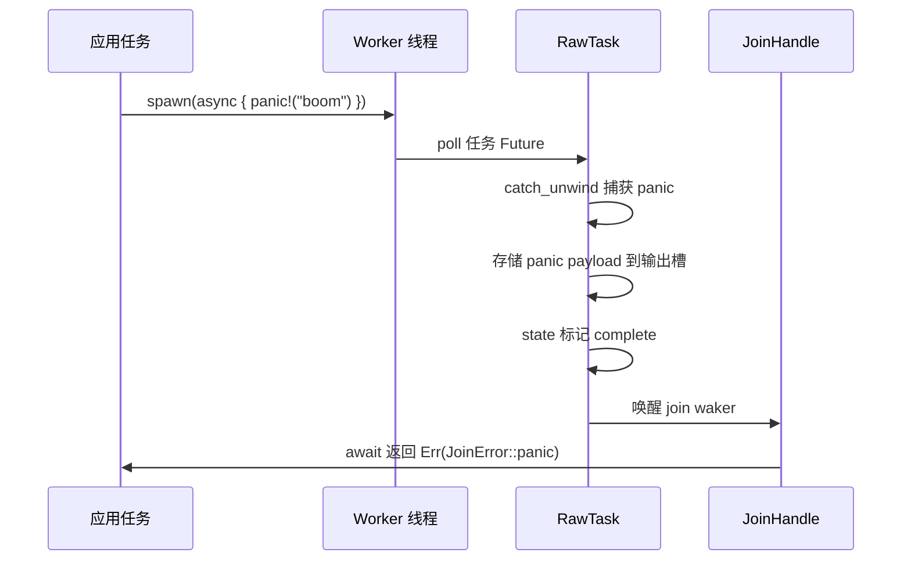
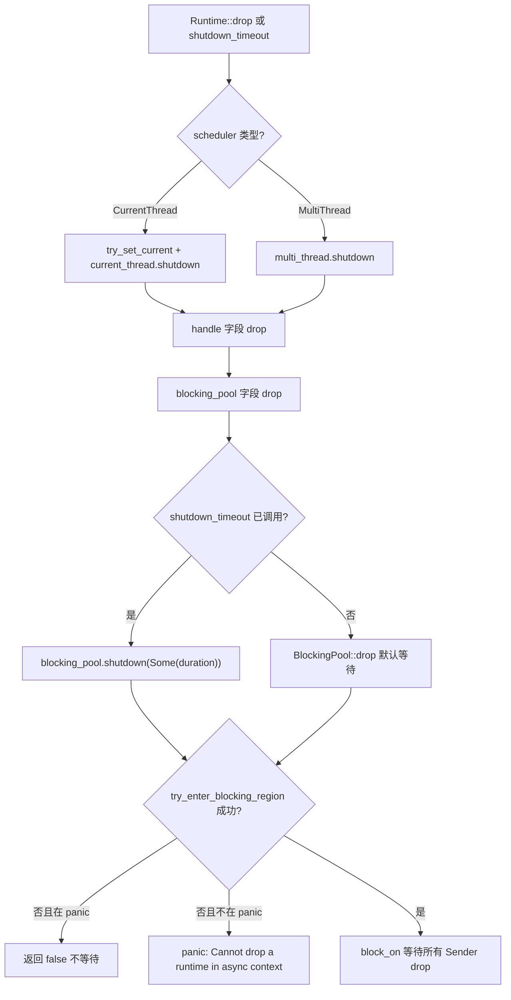
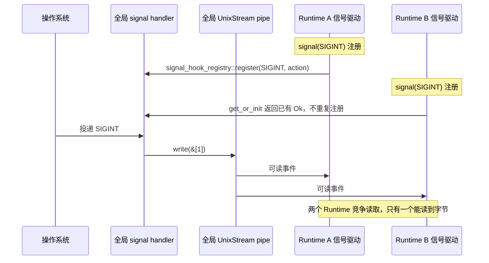

# 第 13 章：生產踩坑與邊界條件：取消安全、panic 傳播與關閉順序

上一章我們拆解了 coop 協作預算：每個任務在一次調度週期內只有有限預算，耗盡後必須讓出，從而避免單個任務餓死其他任務。但預算機制只解決了「公平調度」問題，真實生產環境還有一類更隱蔽的陷阱——取消安全、panic 傳播與關閉順序。當 select! 取消一個 Future、當任務 panic 被捕獲、當 Runtime 開始關閉，代碼的邊界行為往往與直覺相悖。本章就從取消安全切入，先看一個被 drop 的 Future 到底丟了什麼。

# 13.2 panic 傳播：JoinError 如何捕獲崩潰

## 直覺模型

Tokio 任務 panic 不會讓整個進程崩潰（除非 panic=abort），而是被捕獲、打包成`JoinError`，通過`JoinHandle::await`返回。這就像工廠流水線上某個工位出了事故，安全網接住了工人，但產品報廢——你拿到的是「事故報告」而非產品。

## 數據結構與狀態

`JoinHandle<T>`的`Future::Output`是`super::Result<T>`，即`Result<T, JoinError>` [FACT:tokio/src/runtime/task/join.rs:325]。`JoinError`有兩種形態：panic 和 cancelled。文檔示例展示了 panic 場景：

```rust
let join_handle = tokio::spawn(async { panic!("boom"); });
let err = join_handle.await.unwrap_err();
assert!(err.is_panic());
```

[FACT:tokio/src/runtime/task/join.rs:121-127]

panic 被捕獲的機制在`RawTask`的 poll 路徑裡：任務 poll 時用`catch_unwind`包裹，panic 發生後把 payload 存進任務的輸出槽位，標記狀態為 complete，然後喚醒 join waker。`JoinHandle::poll`通過`try_read_output`讀到的是`Err(JoinError::panic(payload))`。

## 場景驅動的 Walkthrough：panic 傳播鏈



關鍵點：panic 的 payload 被完整保留，`JoinError`實現了`std::error::Error`，可以通過`into_panic()`取回`Box<dyn Any + Send>`，再用`downcast_ref::<&str>()`提取 panic 消息。

## 設計思考與踩坑

**坑 1：`JoinHandle`的`UnwindSafe`是手動實現的。**

```rust
impl UnwindSafe for JoinHandle {}
impl RefUnwindSafe for JoinHandle {}
```

[FACT:tokio/src/runtime/task/join.rs:176-181]

這是無條件實現，不要求`T: UnwindSafe`。原因：`JoinHandle`本身不持有`T`，`T`在堆上的任務分配裡，panic 時已經被`catch_unwind`隔離。所以即使`T`不是`UnwindSafe`，`JoinHandle`也是安全的。

**坑 2：panic 不會自動傳播到父任務。**如果任務 A spawn 了任務 B，B panic 了，A 不會自動收到通知，除非 A await 了 B 的`JoinHandle`。如果 A 沒 await，B 的 panic 就被靜默吞掉了。這是生產環境中最隱蔽的 bug 來源之一。

**坑 3：`spawn_blocking`的 panic 同樣被捕獲。**阻塞線程池的 worker 也用`catch_unwind`包裹任務，panic 後線程不會死，而是回到池裡繼續接活。但如果你在阻塞任務裡持有`Mutex`並在 panic 時沒釋放，會導致鎖中毒——這是`std::sync::Mutex`的固有行為，Tokio 不介入。

**坑 4：Runtime drop 時的 panic。**如果任務在 Runtime drop 過程中 panic，`catch_unwind`仍然生效，但此時 join waker 可能已經失效，panic payload 會被丟棄。這是關閉順序問題的子集，下一節展開。

# 13.3 關閉順序：阻塞線程與 I/O 資源的清理

## 直覺模型

Runtime 關閉像餐廳打烊：先讓前台停止接客（停止接受新任務），再等廚房做完手頭的菜（異步任務跑到下一個 yield 點），最後等外包幫工收工（阻塞線程返回）。順序錯了就會出問題——比如先趕走幫工，廚房的菜就永遠做不完。

## 數據結構與關閉路徑

`Runtime`的三個字段決定了關閉順序：

```rust
pub struct Runtime {
    scheduler: Scheduler,
    handle: Handle,
    blocking_pool: BlockingPool,
}
```

[FACT:tokio/src/runtime/runtime.rs:97-106]

`Drop`實現：

```rust
impl Drop for Runtime {
    fn drop(&mut self) {
        match &mut self.scheduler {
            Scheduler::CurrentThread(current_thread) => {
                let _guard = context::try_set_current(&self.handle.inner);
                current_thread.shutdown(&self.handle.inner);
            }
            Scheduler::MultiThread(multi_thread) => {
                multi_thread.shutdown(&self.handle.inner);
            }
        }
    }
}
```

[FACT:tokio/src/runtime/runtime.rs:506-521]

注意：`Drop`只處理`scheduler`，**沒有顯式處理`blocking_pool`**。`blocking_pool`的關閉發生在它自己的`Drop`裡，在`Runtime::drop`返回後由字段 drop 順序觸發。字段 drop 順序是聲明順序：`scheduler` → `handle` → `blocking_pool`。所以阻塞池是最後關閉的。

但`shutdown_timeout`是顯式控制順序的：

```rust
pub fn shutdown_timeout(mut self, duration: Duration) {
    self.handle.inner.shutdown();
    self.blocking_pool.shutdown(Some(duration));
}
```

[FACT:tokio/src/runtime/runtime.rs:457-461]

先`handle.inner.shutdown()`通知調度器和 I/O 驅動停止，再`blocking_pool.shutdown(Some(duration))`等待阻塞任務，最多等`duration`。

## 阻塞池關閉的底層機制

`blocking/shutdown.rs`用了一個精巧的 oneshot channel：

```rust
pub(super) struct Sender {
    _tx: Arc>,
}

pub(super) struct Receiver {
    rx: oneshot::Receiver,
}
```

[FACT:tokio/src/runtime/blocking/shutdown.rs:13-19]

每個阻塞 worker 持有一個`Sender`克隆（內部是`Arc<oneshot::Sender>`）。當所有 worker 退出、所有`Sender`被 drop 後，`Receiver`收到通知。`wait`方法：

```rust
pub(crate) fn wait(&mut self, timeout: Option) -> bool {
    use crate::runtime::context::try_enter_blocking_region;

    if timeout == Some(Duration::from_nanos(0)) {
        return false;
    }

    let mut e = match try_enter_blocking_region() {
        Some(enter) => enter,
        _ => {
            if std::thread::panicking() {
                return false;
            } else {
                panic!(
                    "Cannot drop a runtime in a context where blocking is not allowed. \
                    This happens when a runtime is dropped from within an asynchronous context."
                );
            }
        }
    };

    if let Some(timeout) = timeout {
        e.block_on_timeout(&mut self.rx, timeout).is_ok()
    } else {
        let _ = e.block_on(&mut self.rx);
        true
    }
}
```

[FACT:tokio/src/runtime/blocking/shutdown.rs:37-70]

逐步解析：

1. `timeout == Some(0)`直接返回 false——這是`shutdown_background`的路徑，不等待。

2. `try_enter_blocking_region()`嘗試進入阻塞區域。如果當前在異步上下文裡（比如在 async 任務裡 drop Runtime），返回`None`。

3. 進入失敗時，如果正在 panic，返回 false（不在 panic 中再 panic）；否則 panic 並給出明確錯誤信息。

4. 有 timeout 時用`block_on_timeout`，超時返回 false；無 timeout 時無限等待。

## 關閉順序的完整流程



## 設計思考與踩坑

**坑 1：在 async 上下文裡 drop Runtime 會 panic。**錯誤訊息很明確：「Cannot drop a runtime in a context where blocking is not allowed」[FACT:tokio/src/runtime/blocking/shutdown.rs:51-54]。解決方案是用`shutdown_background()`，它等價於`shutdown_timeout(Duration::from_nanos(0))` [FACT:tokio/src/runtime/runtime.rs:494-496]，不等待阻塞任務。

**坑 2：`shutdown_background`會洩漏阻塞任務。**文件明確警告「this may result in a resource leak (in that any blocking tasks are still running until they return)」[FACT:tokio/src/runtime/runtime.rs:470-472]。阻塞任務會繼續跑直到自然返回，但 Runtime 已經 drop，它們持有的資源可能已經失效。

**坑 3：I/O 資源在 Runtime drop 後失效。**文件說明「Once the runtime has been dropped, any outstanding I/O resources bound to it will no longer function」[FACT:tokio/src/runtime/runtime.rs:52-54]。`is_rt_shutdown_err`函式就是用來檢測這種錯誤的[FACT:tokio/src/runtime/runtime.rs:585-593]。

**坑 4：`Drop`預設無限等待。**文件指出「The`Drop` implementation waits forever for this」[FACT:tokio/src/runtime/runtime.rs:43-44]。如果阻塞任務卡死（比如死迴圈），drop Runtime 會永久掛起。生產環境應該用`shutdown_timeout`設上限。

# 13.4 訊號處理與多 Runtime 衝突

## 直覺模型

Unix 訊號是行程級的，但 Tokio 的`Signal`是綁定到 Runtime 的。這就像全棟樓共用一個火警鈴，但每個房間都裝了獨立的接收器——第一個裝接收器的人改了鈴的接線方式，後面的人只能共享這個改動。

## 資料結構與全域狀態

`signal_enable`是註冊訊號處理器的入口：

```rust
fn signal_enable(signal: SignalKind, handle: &Handle) -> io::Result {
    let signal = signal.0;
    if signal  slot,
        None => return Err(io::Error::other("signal too large")),
    };

    siginfo
        .init
        .get_or_init(|| {
            unsafe { signal_hook_registry::register(signal, move || action(globals, signal)) }
                .map(|_| ())
                .map_err(|e| e.raw_os_error())
        })
        .map_err(|e| {
            e.map_or_else(
                || Error::other("registering signal handler failed"),
                || Error::from_raw_os_error,
            )
        })
}
```

[FACT:tokio/src/signal/unix.rs:266-296]

關鍵點：

1. `signal <= 0 || FORBIDDEN.contains(&signal)`拒絕非法訊號。

2. `handle.check_inner()`檢查訊號驅動是否在運行——如果 Runtime 已關閉，這裡會失敗。

3. `siginfo.init.get_or_init(...)`用`OnceLock`保證每個訊號只註冊一次 OS handler。`get_or_init`的閉包呼叫`signal_hook_registry::register`，這是全域的、行程級的註冊。

4. 註冊的 handler 是`action(globals, signal)`，它做兩件事：`globals.record_event(signal)`記錄事件，然後往 pipe 寫一個位元組喚醒驅動[FACT:tokio/src/signal/unix.rs:252-259]。

## 多 Runtime 衝突的根源

`globals()`返回的是行程級的全域`Globals`，`OsExtraData`裡的`UnixStream`對也是全域的：

```rust
pub(crate) struct OsExtraData {
    sender: UnixStream,
    pub(crate) receiver: UnixStream,
}
```

[FACT:tokio/src/signal/unix.rs:61-64]

`Default`實作建立一對`UnixStream` [FACT:tokio/src/signal/unix.rs:61-64]。這個 pipe 是全域唯一的，所有 Runtime 的訊號驅動共享它。

問題來了：`signal_enable`裡`handle.check_inner()`檢查的是**當前 Runtime**的訊號驅動。但`signal_hook_registry::register`註冊的 handler 是**行程級**的，它寫入的是**全域**pipe。如果 Runtime A 先註冊了 SIGINT，然後 Runtime B 也註冊 SIGINT，`get_or_init`會直接返回已有的`Ok(())`，不會重複註冊。但 Runtime B 的訊號驅動會從全域 pipe 讀資料——兩個 Runtime 會競爭同一個 pipe 的位元組。

## 場景驅動的 Walkthrough：多 Runtime 訊號競爭



## 設計思考與踩坑

**坑 1：訊號處理器永不卸載。**文件明確警告「Once a signal handler is registered with the process the underlying libc signal handler is never unregistered」[FACT:tokio/src/signal/unix.rs:379-380]。即使`Signal`實例被 drop，後續訊號仍會被 Tokio 捕獲，預設行為不會恢復[FACT:tokio/src/signal/unix.rs:338-340]。

**坑 2：訊號會被合併。**文件說明「before`poll` is called, all signal notifications are coalesced into one item returned from `poll`」[FACT:tokio/src/signal/unix.rs:312-315]。如果你收到 10 個 SIGINT 但只 poll 了一次，只會看到一個事件。這是 Unix 訊號本身的特性（標準訊號不排隊），Tokio 沒有額外合併。

**坑 3：多 Runtime 下訊號可能遺失。**由於全域 pipe 被多個 Runtime 競爭讀取，一個 Runtime 可能讀走位元組而另一個永遠等不到。生產環境應該只在一個 Runtime 裡處理訊號，或者用`signal_hook`自己管理。

**坑 4：`signal`函式 panic 條件。**文件說明「This function panics if there is no current reactor set, or if the`rt` feature flag is not enabled」[FACT:tokio/src/signal/unix.rs:398-405]。在 Runtime 外呼叫`signal()`會 panic。

**坑 5：`recv()`的取消安全。**文件保證「This method is cancel safe. If you use it as a branch in`tokio::select!` and another branch completes first, then it is guaranteed that no signal is lost」[FACT:tokio/src/signal/unix.rs:423-427]。這是因為訊號事件存在全域的`EventInfo`裡，`recv()`只是讀取，不消費底層狀態。

# 設計思考

本章三個主題共享一個底層模式：**狀態的所有權決定了取消/關閉/訊號的安全性**。

- `JoinHandle`取消安全，因為輸出在堆上，handle 只是引用。
- Runtime 關閉順序敏感，因為阻塞池和排程器共享`Handle`，順序錯了會死鎖或 panic。
- 信號多 Runtime 衝突，因為 handler 和 pipe 是進程級全局狀態，而`Signal`是 Runtime 級視圖。

理解這個模式後，避坑清單可以歸納為三條原則：

1. **取消安全 = 狀態在 Future 外部。**如果 Future 內部有緩衝區，drop 就會丟數據。`JoinHandle`、`Signal::recv`、`tokio::sync::mpsc::Receiver::recv`都滿足這個條件。

2. **關閉順序 = 依賴方向的反序。**誰依賴誰，就先關被依賴者。調度器依賴 I/O 驅動，所以先關調度器；阻塞池獨立，最後關。

3. **全局狀態 = 多實例衝突。**任何進程級資源（信號 handler、pipe、文件描述符表）在多 Runtime 下都會衝突，要麼限制單 Runtime，要麼用外部同步。

# 本章小結

# 本章思考與自測

Q1：如果把`JoinHandle::poll`中的`coop::poll_proceed(cx)`去掉，在什麼場景下會導致其他任務餓死？為什麼`try_read_output`本身不消耗預算？

**參考解析**：`coop::poll_proceed(cx)`在[FACT:tokio/src/runtime/task/join.rs:325-325]處消耗協作預算。如果去掉，一個在循環裡反覆`select!`多個`JoinHandle`的任務可以在一次調度週期內無限輪詢所有 handle，永不返回`Pending`，從而餓死同 worker 上的其他任務。`try_read_output`本身不消耗預算，因為它只是一次內存讀取 + 可能的 waker 存儲，不涉及 I/O 或鎖競爭，開銷極小。預算機制的設計意圖是約束「可能長時間運行的操作」，而不是每次 poll 都收費。注意`coop.made_progress()`只在`ret.is_ready()`時調用[FACT:tokio/src/runtime/task/join.rs:349-351]，即只有真正拿到輸出才歸還預算——這是為了防止「輪詢了但沒結果」的操作累積消耗預算。

Q2：`blocking/shutdown.rs`的`wait`方法中，如果`try_enter_blocking_region()`返回`None`且當前正在 panic，為什麼選擇返回`false`而不是繼續等待？如果改成繼續等待會發生什麼？

**參考解析**：`try_enter_blocking_region()`返回`None`表示當前在異步上下文裡，不允許阻塞[FACT:tokio/src/runtime/blocking/shutdown.rs:44-57]。如果此時正在 panic，代碼選擇返回`false`不等待[FACT:tokio/src/runtime/blocking/shutdown.rs:47-49]。原因是：panic 展開過程中再次 panic 會導致進程 abort（double panic）。如果改成繼續等待，就需要調用`block_on`，而在異步上下文裡`block_on`會 panic——在 panic 展開中 panic 會直接 abort 進程，丟失所有診斷信息。返回`false`讓 drop 繼續完成，panic 信息得以保留。這是一個「優雅降級」的設計：關閉不完整總比進程崩潰好。

Q3：假設你在 Runtime A 裡創建了`Signal`監聽 SIGTERM，然後把`Signal`移到 Runtime B 裡 poll。`signal_enable`裡的`handle.check_inner()`檢查的是哪個 Runtime？如果 Runtime A 先 drop 了，Runtime B 裡的`Signal`還能收到信號嗎？

**參考解析**：`signal_enable`在`signal()`調用時執行，此時`handle`是 Runtime A 的[FACT:tokio/src/signal/unix.rs:398-405]。`check_inner()`檢查的是 Runtime A 的信號驅動[FACT:tokio/src/signal/unix.rs:275]。`Signal`內部是`RxFuture`，包裝的是`watch::Receiver<()>` [FACT:tokio/src/signal/unix.rs:366-368]，這個 receiver 註冊在全局`Globals`的`EventInfo`上。如果 Runtime A drop 了，它的信號驅動停止從全局 pipe 讀數據，但全局 handler 仍然會`record_event`並寫 pipe。Runtime B 的信號驅動如果也在運行，會讀到 pipe 數據並觸發`EventInfo`，從而喚醒`Signal`的 waker。所以 Runtime B 裡的`Signal` **可能**還能收到信號，但取決於 Runtime B 是否有信號驅動在運行。如果 Runtime B 沒有信號驅動（比如沒啟用 signal feature 或驅動已關閉），pipe 數據無人讀取，`Signal`永遠等不到喚醒。這就是多 Runtime 信號處理的脆弱性。

# 章末過渡

取消安全、panic 傳播、關閉順序、信號衝突——這四個問題的共同根源是「狀態所有權」在異步邊界上的模糊。Tokio 通過把狀態放在堆上、用引用計數管理生命週期、用`catch_unwind`隔離 panic、用全局`Globals`共享信號狀態，給出了工程上可用的答案。但這些答案都有邊界條件，生產環境必須顯式處理。

下一章將進入架構權衡與未來演進：從 io_uring 到可插拔驅動。我們會看到 Tokio 如何在保持 API 穩定的前提下，為新一代 I/O 接口預留擴展空間，以及當前架構中哪些設計決策是歷史包袱、哪些是前瞻佈局。

至此，我們走完了 Tokio 生產環境中最容易踩坑的邊界地帶：取消安全依賴輸出存儲在堆上、try_read_output 的原子性；JoinHandle::drop 不取消任務，abort 才真正取消但對 spawn_blocking 無效；panic 被 catch_unwind 捕獲後打包成 JoinError，不 await 就靜默丟失；Runtime 關閉有嚴格順序，在 async 上下文 drop 會 panic；信號 handler 是進程級全局狀態，註冊後永不卸載。這些規則背後是 Tokio 在正確性與性能之間的反复權衡。下一章我們將跳出具體機制，站在架構高度回顧這些權衡的由來，並展望 io_uring、驅動重構與自定義執行器接口將把 Tokio 帶向何方。
