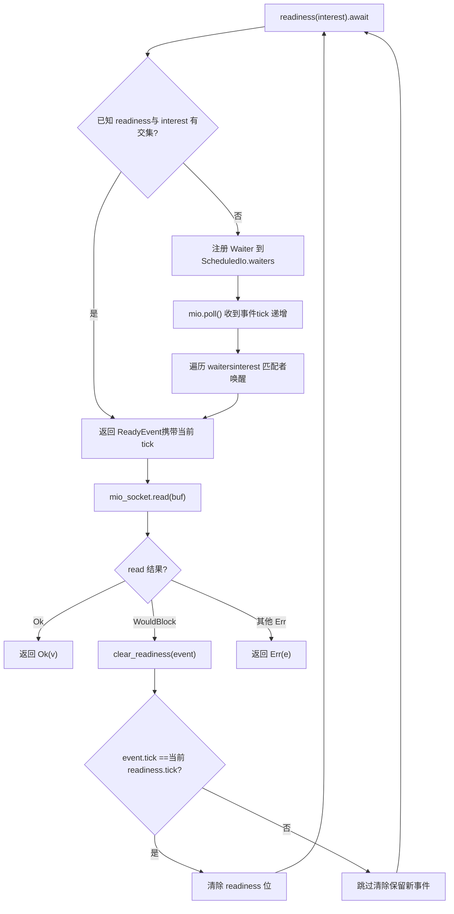
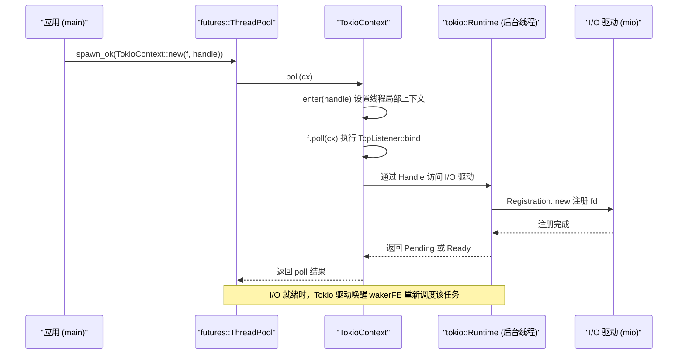

# 第 14 章：架構權衡與未來演進：從 io_uring 到可插拔驅動

上一章我們梳理了取消安全、panic 傳播、關閉順序與信號衝突這四類生產陷阱，它們看似分散，實則都指向同一個架構問題：狀態所有權在異步邊界上如何被清晰地劃分。而劃分所有權的方式，恰恰由運行時最底層的三個架構決策決定——任務如何被調度、I/O 事件如何被分發、並發正確性如何被驗證。本章不再鑽進某個具體函數的實現細節，而是站到架構高度，回顧 Tokio 在這些決策上的取捨，並沿著官方文檔與源碼中已經埋下的演進線索，看看 io_uring、驅動重構與自定義執行器接口會把 Tokio 帶向何方。讀完本章，你應該能回答一個實踐問題：什麼時候該擴展 Tokio，什麼時候該繞開它。

# 一、三個歷史權衡：為什麼是現在這個樣子

## 直覺模型

把 Tokio 想像成一家已經開了十年的餐廳。廚房的排班方式（work-stealing）、傳菜員的獨立編制（I/O 驅動與調度器分離）、以及後廚的衛生檢查制度（loom 並發驗證），都不是開業第一天就設計好的，而是在「客人變多、菜品變複雜」的過程中逐步演化出來的。理解這些演化，才能判斷哪些設計是前瞻佈局、哪些是歷史包袱。

## 權衡一：work-stealing 而非全局隊列

> **[Design Inference & Architectural Trade-offs]**
> 全局隊列的實現最簡單：所有任務進一個`Mutex<VecDeque>`，worker 線程搶鎖取任務。但鎖競爭會隨核數增加而惡化，且緩存局部性差——任務在哪個核上被創建、在哪個核上被執行完全隨機。

work-stealing 的取捨是：每個 worker 持有本地隊列，`spawn`時優先入本地隊列（無鎖、緩存友好），本地空了才去別的 worker 隊列尾部竊取。代價是負載均衡有延遲，且竊取本身需要原子操作與內存屏障。Tokio 選擇後者，是因為現代服務器動輒幾十核，鎖競爭的成本遠高於偶發的竊取開銷。

> **[Design Inference & Architectural Trade-offs]**
> 這個決策的邊界條件是：**任務粒度不能太細**。如果每個任務只做幾微秒的工作，竊取與調度的開銷佔比就會失控。這也是為什麼 Tokio 在`spawn_blocking`之外，還要求長任務主動`yield_now()`——協作式調度本質上是在替 work-stealing 兜底。

## 權衡二：I/O 驅動獨立於調度器

這是本章源碼材料裡最值得玩味的一處。看`tokio/src/runtime/io/mod.rs`的模塊結構：

[FACT:tokio/src/runtime/io/mod.rs:5-22]

```rust
mod driver;
use driver::{Direction, Tick};
pub(crate) use driver::{Driver, Handle, ReadyEvent};

mod registration;
pub(crate) use registration::Registration;

mod registration_set;
use registration_set::RegistrationSet;

mod scheduled_io;
use scheduled_io::ScheduledIo;

mod metrics;
use metrics::IoDriverMetrics;

use crate::util::ptr_expose::PtrExposeDomain;
static EXPOSE_IO: PtrExposeDomain = PtrExposeDomain::new();
```

注意`driver`、`registration`、`scheduled_io`是三個獨立模塊，且對外只暴露`Driver`、`Handle`、`ReadyEvent`、`Registration`這幾個類型。`ScheduledIo`是`pub(crate)`的——它被`PtrExposeDomain`包裹，用於在 loom 測試下把裸指針暴露給並發檢查。

> **[Design Inference & Architectural Trade-offs]**
> 為什麼 I/O 驅動不直接嵌進調度器？因為兩者的生命週期與並發模型不同。調度器關心的是「哪個任務該跑」，I/O 驅動關心的是「哪個 fd 就緒了」。如果耦合，那麼每次調度策略調整都要動 I/O 路徑，反之亦然。更重要的是，`block_on`單線程運行時也需要 I/O 驅動，但不需要 work-stealing 調度器——分離讓兩種運行時能復用同一套 I/O 實現。

## 權衡三：loom 做並發模型檢驗

`tokio/src/loom/mod.rs`只有 14 行，卻揭示了 Tokio 並發正確性的驗證策略：

[FACT:tokio/src/loom/mod.rs:1-14]

```rust
//! This module abstracts over `loom` and `std::sync` depending on whether we
//! are running tests or not.

#![allow(unused)]

#[cfg(not(all(test, loom)))]
mod std;
#[cfg(not(all(test, loom)))]
pub(crate) use self::std::*;

#[cfg(all(test, loom))]
mod mocked;
#[cfg(all(test, loom))]
pub(crate) use self::mocked::*;
```

關鍵在`#[cfg(all(test, loom))]`這個條件：只有同時開啟`test`和`loom`兩個 cfg 時，才會用`mocked`模塊替換`std`。這意味著生產構建裡根本沒有 loom 的代碼，零運行時開銷。

> **[Design Inference & Architectural Trade-offs]**
> loom 的價值在於它能把「線程交錯的所有可能順序」窮舉出來。像`ScheduledIo`裡`AtomicUsize`的讀改寫、`Waiters`鏈結串列的插入刪除，這些在真實硬體上可能跑一百萬次都不出錯，但 loom 能在幾秒內構造出觸發競態的交錯。代價是測試執行慢、記憶體佔用高，所以只能用於單元測試，不能進生產。

## 設計思考

這三個權衡有一個共同特徵：**它們都選擇了「更複雜但更可擴展」的方案，並把複雜度限制在內部**。work-stealing 的複雜度藏在排程器裡，I/O 驅動的複雜度藏在`ScheduledIo`裡，loom 的複雜度藏在 cfg 條件裡。對外暴露的 API 始終是`spawn`、`TcpStream::read`這些簡單介面。

> **[Design Inference & Architectural Trade-offs]**
> 這也是判斷「何時該擴展 Tokio」的第一條準則：**如果你的需求能被現有 API 表達，就不要碰內部結構**。一旦你開始依賴`pub(crate)`的類型或`tokio_unstable`的 cfg，就意味著你把自己綁在了 Tokio 的內部實作上，升級時會付出代價。

---

# 二、驅動重構：從「一個 waker 一個方向」到「任意興趣集」

## 直覺模型

早期的 Tokio I/O 類型有個硬性限制：`async fn read(&mut self)`需要`&mut self`。這就像餐廳只有一個取餐窗口，同一時間只能有一個人排隊——因為 waker 被存在 I/O 資源內部，而不是存在操作對應的 Future 裡。`tokio/docs/reactor-refactor.md`完整記錄了這個限制的成因與重構方案。

## 舊架構的痛點

文件開篇就點明了問題：

[FACT:tokio/docs/reactor-refactor.md:16-20]

```rust
Currently, I/O types require `&mut self` for `async` functions. The reason for
this is the task's waker is stored in the I/O resource's internal state
(`ScheduledIo`) instead of in the future returned by the `async` function.
Because of this limitation, I/O types limit the number of wakers to one per
direction (a direction is either read-related events or write-related events).
```

> **[Design Inference & Architectural Trade-offs]**
> 把 waker 存在資源內部，意味著「一個方向只能有一個等待者」。如果你同時想讀和寫同一個`TcpStream`，就必須`split()`成兩半，各自持有獨立的 waker 槽。這就是`TcpStream::split()`存在的原因——它不是 API 設計偏好，而是內部資料結構的直接約束。

## 新架構：把 waker 移到 Future 裡

重構的核心思路是「把 waker 從資源狀態移到操作 Future 裡」，從而支援每個操作註冊多個 waker：

[FACT:tokio/docs/reactor-refactor.md:22-25]

```rust
Moving the waker from the internal I/O resource's state to the operation's
future enables multiple wakers to be registered per operation. The "intrusive
wake list" strategy used by `Notify` applies to this case, though there are some
concerns unique to the I/O driver.
```

新的`ScheduledIo`結構如下：

[FACT:tokio/docs/reactor-refactor.md:97-134]

```rust
#[derive(Debug)]
pub(crate) struct ScheduledIo {
    /// Resource's known state packed with other state that must be
    /// atomically updated.
    readiness: AtomicUsize,

    /// Tracks tasks waiting on the resource
    waiters: Mutex,
}

#[derive(Debug)]
struct Waiters {
    // List of intrusive waiters.
    list: LinkedList,

    /// Waiter used by `AsyncRead` implementations.
    reader: Option,

    /// Waiter used by `AsyncWrite` implementations.
    writer: Option,
}

// This struct is contained by the **future** returned by `readiness()`.
#[derive(Debug)]
struct Waiter {
    /// Intrusive linked-list pointers
    pointers: linked_list::Pointers,

    /// Waker for task waiting on I/O resource
    waiter: Option,

    /// Readiness events being waited on. This is
    /// the value passed to `readiness()`
    interest: mio::Ready,

    /// Should not be `Unpin`.
    _p: PhantomPinned,
}
```

這裡有幾個精妙的設計點值得展開：

**第一，`readiness`是`AtomicUsize`，`waiters`是`Mutex<Waiters>`。**為什麼不用一把鎖保護兩者？因為`readiness`的讀取操作極其頻繁（每次`readiness()`呼叫都要檢查），而寫操作只在收到 mio 事件時發生。用原子變數讓讀取路徑無鎖，是典型的讀寫分離最佳化。

**第二，`Waiter`是侵入式鏈結串列節點。** `pointers: linked_list::Pointers<Waiter>`讓`Waiter`本身成為鏈結串列的一部分，不需要額外分配節點。`_p: PhantomPinned`明確標記它不可`Unpin`——因為侵入式鏈結串列的節點位址一旦移動，鏈結串列就斷了。

**第三，`reader`和`writer`兩個`Option<Waker>`是給`AsyncRead`/`AsyncWrite`用的。**文件解釋了原因：

[FACT:tokio/docs/reactor-refactor.md:210-213]

```rust
The `AsyncRead` and `AsyncWrite` traits use a "poll" based API. This means that
it is not possible to use an intrusive linked list to track the waker.
Additionally, there is no future associated with the operation which means it is
not possible to cancel interest in the readiness events.
```

> **[Design Inference & Architectural Trade-offs]**
> 這是新舊兩套機制的妥協共存：`async fn`路徑用侵入式鏈結串列（支援多等待者、可取消），`poll`路徑用固定槽位（不支援取消、但相容 trait）。這種「兩套機制並存」是漸進式重構的典型代價。

## 競態條件與 tick 機制

重構中最棘手的問題是競態。文件給了一個具體的死鎖場景：

[FACT:tokio/docs/reactor-refactor.md:175-175]

```rust
If care is not taken, if between `mio_socket.read(buf)` returning and
`clear_readiness(event)` is called, a readiness event arrives, the `read()`
function could deadlock. This happens because the readiness event is received,
`clear_readiness()` unsets the readiness event, and on the next iteration,
`readiness().await` will block forever as a new readiness event is not received.
```

解決方案是引入 tick 機制，把`readiness`這個`AtomicUsize`拆成多個位段：

[FACT:tokio/docs/reactor-refactor.md:199-199]

```
| shutdown | generation |  driver tick | readiness |
|----------+------------+--------------+-----------|
|   1 bit  |   7 bits   +    8 bits    +  16 bits  |
```

> **[Design Inference & Architectural Trade-offs]**
> 這個位段佈局是「用空間換正確性」的經典案例。`tick`每次`mio::poll()`遞增，`ReadyEvent`攜帶讀取時的 tick。`clear_readiness()`只在 tick 匹配時才清除就緒狀態——如果 tick 不匹配，說明期間有新事件到達，不能清除。這樣就把「清除」和「新事件到達」的競態消解在了一個原子讀改寫裡。

下面這張流程圖刻畫了`readiness()`與`clear_readiness()`之間的決策路徑：



這張圖的關鍵分支在`tick_match`：如果 tick 不匹配，`clear_readiness`必須放棄清除，否則會丟掉剛到達的事件，導致下一輪`readiness()`永久阻塞。

## 取消興趣與記憶體洩漏

侵入式鏈結串列帶來一個新問題：如果`readiness()`返回的 Future 被提前 drop，鏈結串列節點必須被摘除。文件明確警告：

[FACT:tokio/docs/reactor-refactor.md:144-148]

```rust
The future returned by `readiness()` uses an intrusive linked list to store the
waker with `ScheduledIo`. Because `readiness()` can be called concurrently, many
wakers may be stored simultaneously in the list. If the `readiness()` future is
dropped early, it is essential that the waker is removed from the list. This
prevents leaking memory.
```

> **[Design Inference & Architectural Trade-offs]**
> 這正是上一章「取消安全」在 I/O 層的體現。`readiness()`的 Future 必須在`Drop`實作裡把自己從鏈結串列摘除，否則節點會永久留在`ScheduledIo`裡，既洩漏記憶體，又會在下次事件到達時被錯誤喚醒。

## 設計思考與生產踩坑

**為什麼不用`Vec<Waker>`而用侵入式鏈結串列？**文件在討論`&Resource`實作時給出了答案：

[FACT:tokio/docs/reactor-refactor.md:228-233]

```rust
It is only possible to implement `AsyncRead` and `AsyncWrite` for resource types
themselves and not for `&Resource`. Implementing the traits for `&Resource`
would permit concurrent operations to the resource. Because only a single waker
is stored per direction, any concurrent usage would result in deadlocks. An
alternate implementation would call for a `Vec` but this would result in
memory leaks.
```

> **[Design Inference & Architectural Trade-offs]**
> `Vec<Waker>`的問題是：Future 被 drop 後，對應的 waker 留在 Vec 裡無法定位刪除，只能等下次事件到達時才發現「這個 waker 已經失效」。侵入式鏈結串列讓節點位址就是 Future 內部欄位的位址，drop 時能精確摘除。

**生產踩坑點**：`TcpStream::by_ref()`返回的`TcpStreamRef`持有`read_waiter`和`write_waiter`兩個節點：

[FACT:tokio/docs/reactor-refactor.md:238-244]

```rust
struct TcpStreamRef {
    stream: &'a TcpStream,

    // `Waiter` is the node in the intrusive waiter linked-list
    read_waiter: Waiter,
    write_waiter: Waiter,
}
```

> **[Design Inference & Architectural Trade-offs]**
> 這意味著`TcpStreamRef`一旦被 drop，兩個 waiter 節點同時失效。如果你在`select!`裡用`by_ref()`的參照跨分支共享，要小心生命週期——`TcpStreamRef`不能活得比`TcpStream`長，也不能在多個`select!`分支間被同時借用。

---

# 三、自訂執行器：TokioContext 與「繞開 Tokio」的邊界

## 直覺模型

有時你不想用 Tokio 的排程器，只想借它的 I/O 和定時器。這就像你不想在餐廳內用，只想用它的外帶窗口。`examples/custom-executor.rs`展示了這種「混合模式」：用`futures::executor::ThreadPool`做排程，用 Tokio 做 I/O。

## 核心機制：TokioContext

整個例子的關鍵在`TokioContext`這個包裝型別：

[FACT:examples/custom-executor.rs:51-54]

```rust
impl ThreadPool {
    fn spawn(&self, f: impl Future + Send + 'static) {
        let handle = self.rt.handle().clone();
        self.inner.spawn_ok(TokioContext::new(f, handle));
    }
}
```

> **[Design Inference & Architectural Trade-offs]**
> `TokioContext::new(f, handle)`把 Future 和 Tokio 的`Handle`綁在一起。當外部執行器 poll 這個包裝 Future 時，`TokioContext`會先進入 Tokio 的執行時上下文（設定執行緒局部的`Handle`），再 poll 內部的`f`。這樣`f`裡呼叫`TcpListener::bind`時，就能找到 Tokio 的 I/O 驅動。

看整個例子的結構：

[FACT:examples/custom-executor.rs:38-48]

```rust
static EXECUTOR: Lazy = Lazy::new(|| {
    // Spawn tokio runtime on a single background thread
    // enabling IO and timers.
    let rt = tokio::runtime::Builder::new_multi_thread()
        .enable_all()
        .build()
        .unwrap();
    let inner = futures::executor::ThreadPool::builder().create().unwrap();

    ThreadPool { inner, rt }
});
```

> **[Design Inference & Architectural Trade-offs]**
> 這裡 Tokio 執行時被建立但**沒有被`block_on`驅動**——它只是「存在」，提供 I/O 驅動和定時器。真正的任務排程由`futures::executor::ThreadPool`負責。這種模式下，Tokio 的 worker 執行緒實際上在空轉（等待 I/O 事件），任務執行發生在 futures 的執行緒池裡。

## 資料流：一次 TcpListener::bind 的跨執行器旅程



這張時序圖的關鍵在於：**任務的 poll 發生在 futures 執行緒池，但 I/O 事件的等待發生在 Tokio 後台執行緒**。兩者透過`Handle`和 waker 連接。

## 設計思考：何時該繞開 Tokio

> **[Design Inference & Architectural Trade-offs]**
> 這個例子的存在本身就是一個信號：Tokio 的架構允許「只用 I/O 驅動，不用排程器」。判斷標準可以歸納為三條：

1. **如果你需要與已有的執行器生態整合**（比如某些框架強制要求`futures::executor`），用`TokioContext`是最小侵入的方案。

2. **如果你需要完全控制排程策略**（比如即時系統要求確定性排程），Tokio 的 work-stealing 不滿足需求，但它的 I/O 驅動仍然可用。

3. **如果你只是嫌 Tokio 的 API 複雜**，那不該繞開——`TokioContext`引入的跨執行器邊界會帶來新的除錯難度，得不償失。

**生產踩坑點**：`TokioContext`模式下，Tokio 執行時的`block_on`從未被呼叫，意味著`Runtime::shutdown`的清理邏輯不會自動觸發。你必須在程式退出前顯式 drop`Runtime`，否則 I/O 驅動的後台執行緒可能不會優雅關閉。

## 與 io_uring 的關係

> **[Design Inference & Architectural Trade-offs]**
> `tokio/src/runtime/io/mod.rs`頂部的 cfg 條件透露了 io_uring 的接入方式：

[FACT:tokio/src/runtime/io/mod.rs:1-4]

```rust
#![cfg_attr(
    not(all(feature = "rt", feature = "net", feature = "io-uring", tokio_unstable)),
    allow(dead_code)
)]
```

注意`feature = "io-uring"`和`tokio_unstable`同時出現。這意味著 io_uring 支援目前是**實驗性的**，必須同時開啟 unstable 特性才能編譯。`allow(dead_code)`則說明：當這些特性未開啟時，模組裡的部分程式碼不會被使用，編譯器會警告——用`allow`壓掉。

> **[Design Inference & Architectural Trade-offs]**
> io_uring 與 epoll 的根本區別在於：epoll 是「就緒通知」，io_uring 是「完成通知」。前者需要應用自己發起`read`/`write`系統呼叫，後者由核心直接完成 I/O 並返回結果。這對 Tokio 的`ScheduledIo`模型是巨大衝擊——`readiness()`的語意在 io_uring 下不再適用，需要一套全新的「提交-完成」抽象。這也是為什麼 io_uring 支援遲遲停留在 unstable：它不是加一個後端那麼簡單，而是要重構整個 I/O 驅動的抽象層。

---

# 本章小結

本章從架構高度回顧了 Tokio 的三個核心權衡，並展望了三條演進路徑：

**歷史權衡**：

- work-stealing 用排程複雜度換取多核擴展性，邊界是任務粒度不能太細；
- I/O 驅動獨立於排程器，讓`block_on`與多執行緒執行時復用同一套 I/O 實作；
- loom 透過 cfg 條件在生產建置中完全消失，只在測試時窮舉執行緒交錯。

**驅動重構**（`reactor-refactor.md`）：

- 把 waker 從`ScheduledIo`內部移到操作 Future 裡，用侵入式鏈結串列支援多等待者；
- 用`AtomicUsize`的位段佈局（shutdown/generation/tick/readiness）消解`clear_readiness`的競態；
- `AsyncRead`/`AsyncWrite`因 poll 語意無法用侵入式鏈結串列，保留`reader`/`writer`固定槽位作為妥協。

**未來演進**：

- io_uring 需要「提交-完成」新抽象，目前受`tokio_unstable`保護；
- `TokioContext`允許只用 I/O 驅動、不用排程器，但需手動管理 Runtime 生命週期；
- 判斷「擴展還是繞開」的準則：能用現有 API 表達就不碰內部結構。

# 本章思考與自測

Q1: 在`ScheduledIo`的`readiness`位段佈局中，如果把`tick`欄位從 8 位縮減到 4 位，在什麼場景下會觸發錯誤？請結合`clear_readiness`的 tick 匹配邏輯分析。

**參考解析**：`tick`在每次`mio::poll()`時遞增[FACT:tokio/docs/reactor-refactor.md:185-185]。`clear_readiness`只在`event.tick == 当前 readiness.tick`時才清除就緒位[FACT:tokio/docs/reactor-refactor.md:199-199]。如果 tick 只有 4 位，那麼每 16 次 poll 就會回繞。假設某個`ReadyEvent`攜帶 tick=15，在它被`clear_readiness`之前，mio 又 poll 了 1 次，tick 回繞到 0。此時`clear_readiness`發現 tick 不匹配（15 != 0），會錯誤地跳過清除——但實際上期間可能沒有新事件到達，只是 tick 回繞了。這會導致就緒位被永久保留，後續`readiness()`立即返回但`read`仍然`WouldBlock`，陷入忙循環。8 位 tick 在正常負載下足夠（256 次 poll 內完成一次 read-clear 循環），但極端高併發下仍有回繞風險，這是位段佈局的固有邊界。

Q2: `examples/custom-executor.rs`中，Tokio 運行時被創建但從未`block_on`。如果此時調用`rt.shutdown_timeout()`，會發生什麼？為什麼這個例子選擇不調用？

**參考解析**：`rt.shutdown_timeout()`會等待所有任務完成並關閉 I/O 驅動。但在這個例子裡，任務實際運行在`futures::executor::ThreadPool`上[FACT:examples/custom-executor.rs:51-54]，Tokio 運行時裡沒有任務——它只提供 I/O 驅動。如果調用`shutdown_timeout`，它會立即返回（因為沒有任務），但 I/O 驅動的後台線程可能仍在運行。例子選擇不調用，是因為`EXECUTOR`是`Lazy`靜態變量，程序退出時由 Rust 的靜態析構機制處理。真正的坑在於：如果`TokioContext`包裝的 Future 還在運行，而`Runtime`被 drop，那麼 Future 裡的 I/O 操作會 panic（找不到運行時上下文）。生產環境必須確保所有`TokioContext`Future 完成後才 drop Runtime。

Q3: 假設你要為 Tokio 添加一個基於 io_uring 的 I/O 後端。根據`reactor-refactor.md`中`readiness()`的語義，哪些部分可以直接復用，哪些必須重寫？

**參考解析**：可以直接復用的是`Registration`的註冊接口和`ScheduledIo`的`waiters`鏈表結構——它們管理的是「誰在等」，與底層是 epoll 還是 io_uring 無關。必須重寫的是`readiness()`的語義：epoll 下它返回「fd 就緒」，io_uring 下沒有「就緒」概念，只有「提交的 SQE 完成」。`clear_readiness`的 tick 機制也需要重新設計——io_uring 的完成事件自帶 user_data 標識，不需要 tick 來區分新舊事件。最根本的改動是：`readiness()`返回的 Future 在 io_uring 下應該變成「提交 SQE 並等待 CQE」，這意味著`Waiter`結構需要攜帶 SQE 參數，而不僅僅是`interest`。這也是為什麼 io_uring 支持受`tokio_unstable`保護[FACT:tokio/src/runtime/io/mod.rs:1-4]——它不是替換後端，而是改變 I/O 驅動的抽象契約。

至此，我們完成了從具體陷阱到架構權衡的爬升。回顧全書，從 Future 的惰性求值到調度器的公平性，從取消安全到關閉順序，再到本章的 io_uring 與可插拔驅動，所有討論都圍繞一個核心：在異步邊界上清晰地劃分狀態所有權。Tokio 的架構並非一成不變，io_uring 的零拷貝 I/O、驅動層的解耦、自定義執行器接口的開放，都在推動它向更靈活、更高效的方向演進。當你合上這本書，希望留下的不是一堆 API 用法，而是一套判斷力：知道何時該信任運行時，何時該介入底層，以及如何在生產環境中避開那些會咬人的組合。異步 Rust 的生態仍在快速生長，保持對源碼與官方文檔的追蹤，比記住任何結論都更重要。
