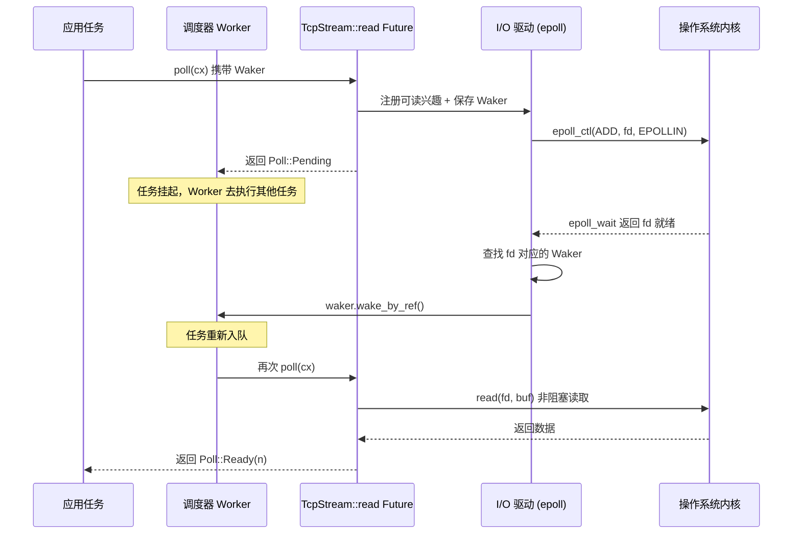

# 第 1 章：异步哲学与核心模型：Future、Waker 与协作式调度

异步编程在 Rust 中不是一个库，而是一套语言级的协议。Tokio 之所以能成为生产级运行时，不是因为它发明了 Future，而是因为它精确地实现了这套协议中每一个契约的边界条件。本章不急于跳进 Tokio 的调度器代码，而是先把「三件套」——Future、Waker、Executor——的职责边界和反向控制流讲透。理解了这三者如何咬合，后续章节中 Runtime 的组装、work-stealing 调度、I/O 驱动才有落脚点。

# 1.1 从阻塞到拉取：为什么 Rust 选择 poll 而非回调

## 直觉模型

想象你在餐厅点了一份需要现做的菜。回调式异步（如 Node.js 早期风格）相当于你留下手机号，厨师做好后**主动打给你**——控制权在厨师手里，你的代码只是被动响应。拉取式异步（Rust 的选择）相当于你拿到一张取餐凭证，你**自己决定**什么时候去窗口问「好了吗」：没好就去做别的事，好了就取走。

这个区别看似微小，却决定了整个系统的形态。回调式模型中，每个异步操作都必须携带一个「完成后做什么」的闭包，闭包层层嵌套形成回调地狱，且取消操作极其困难——你无法「撤回」一个已经注册的回调。拉取式模型中，Future 只是一个状态机，`poll` 是纯粹的查询动作，不推进就不消耗资源，取消就是 drop，干净利落。

## 拉取式模型的核心契约

Rust 标准库定义的 `Future` trait 只有两个要素：一个 `poll` 方法，一个 `Output` 关联类型。Tokio 并没有重新定义这个 trait，而是直接复用标准库的实现。这一点在源码中有明确体现：

```rust
// tokio/src/future/mod.rs
cfg_not_trace! {
    cfg_rt! {
        pub(crate) use std::future::Future;
    }
}
```

[FACT:tokio/src/future/mod.rs:24-28]

这段代码揭示了一个重要事实：在未启用 `tracing` 特性时，Tokio 内部的 `Future` 就是 `std::future::Future` 的别名，没有任何包装。只有在启用 `tracing` 时，才会用 `InstrumentedFuture` 替换：

```rust
cfg_trace! {
    mod trace;
    #[allow(unused_imports)]
    pub(crate) use trace::InstrumentedFuture as Future;
}
```

[FACT:tokio/src/future/mod.rs:18-22]

> **〔设计推断与架构权衡〕**
> 这种「默认零开销、按需插桩」的设计是 Tokio 的一贯哲学：核心路径不引入任何额外抽象层，可观测性作为可选特性叠加。`InstrumentedFuture` 的存在说明 Tokio 团队认为 tracing 的插桩成本不应由所有用户承担。

## poll 契约的三个隐含约束

`poll` 方法的签名是 `fn poll(self: Pin<&mut Self>, cx: &mut Context<'_>) -> Poll<Self::Output>`。这个签名里藏着三条契约，违反任何一条都会导致未定义行为或逻辑错误：

**契约一：Pin 保证自引用安全。** `Pin<&mut Self>` 意味着 Future 一旦被 poll，其内存地址就不能再移动。这是因为 async 块编译后会生成包含自引用的状态机——局部变量可能持有指向同一状态机内其他字段的引用。如果允许移动，这些引用就会悬空。

**契约二：Pending 必须已注册唤醒。** 当 `poll` 返回 `Poll::Pending` 时，Future 必须已经通过 `cx.waker()` 获取并保存了 Waker，或者已经将 Waker 注册到了某个事件源。否则执行器将永远不知道该 Future 何时可以再次被 poll，导致任务永久挂起。

**契约三：Ready 之后不应再 poll。** 一旦 `poll` 返回 `Poll::Ready`，再次 poll 同一个 Future 是逻辑错误（虽然不会导致 UB，但行为未定义）。执行器有责任在收到 Ready 后不再调度该任务。

这三条契约中，契约二是最容易出错的地方，也是 Waker 存在的根本原因。

# 1.2 Waker：反向控制流的载体

## 直觉模型

Waker 是餐厅给你的「震动取餐器」。你不需要站在窗口反复问「好了吗」——那会浪费你的时间。你只需要在第一次去窗口时把取餐器交给厨师（注册 Waker），然后安心做别的事。菜好了，厨师按下按钮，取餐器震动（调用 `wake`），你收到信号后再去窗口取餐（重新 poll）。

如果没有 Waker，执行器只有两种选择：要么忙轮询所有任务（浪费 CPU），要么永远不 poll 已返回 Pending 的任务（任务饿死）。Waker 是打破这个僵局的唯一机制。

## Waker 的内存布局与虚表设计

Waker 是标准库类型，但它的设计直接影响了 Tokio 的任务结构。`Waker` 本质上是一个胖指针：一个 `RawWaker` 结构体，包含一个数据指针和一个虚表指针。

```rust
// 标准库中的定义（非 Tokio 源码，此处为背景说明）
pub struct RawWaker {
    data: *const (),
    vtable: &'static RawWakerVTable,
}

pub struct RawWakerVTable {
    clone: unsafe fn(*const ()) -> RawWaker,
    wake: unsafe fn(*const ()),
    wake_by_ref: unsafe fn(*const ()),
    drop: unsafe fn(*const ()),
}
```

> **〔设计推断与架构权衡〕**
> 这个设计的精妙之处在于：`Waker` 本身不关心「唤醒」具体意味着什么。它只是四个函数指针的载体。Tokio 可以提供一个 Waker，其 `wake` 函数把任务重新推入调度队列；而另一个运行时（比如 `futures` crate 的 `block_on`）可以提供完全不同的 Waker 实现。这种「数据 + 虚表」的模式使得 Waker 可以在不同运行时之间传递而不丢失语义。

`wake` 和 `wake_by_ref` 的区别至关重要：`wake` 消耗 Waker 的所有权（调用后 Waker 被 drop），而 `wake_by_ref` 只借用。执行器通常实现 `wake_by_ref` 为「将任务标记为就绪并入队」，而 `wake` 则在此基础上额外处理引用计数的递减。Tokio 的任务结构中，Waker 的数据指针指向任务的引用计数头，每次 clone 增加计数，drop 减少计数，计数归零时释放任务内存。

## 唤醒的完整时序

下面这张时序图展示了一个 TCP 读取操作从发起到被唤醒的完整链路。注意 Waker 是如何从任务上下文一路传递到 I/O 驱动的：



这张图的关键在于：**Waker 是唯一能从 Reactor 反向触达 Executor 的通道**。Reactor 不持有任务的任何其他信息，它只知道「当这个 fd 就绪时，调用这个 Waker」。这种解耦使得 I/O 驱动可以独立于调度器实现，两者只通过 Waker 这个窄接口通信。

## 虚假唤醒：契约的灰色地带

Tokio 的文档明确承认虚假唤醒的存在：

> Normally, tasks are scheduled only if they have been woken by calling `wake` on their waker. However, this is not guaranteed, and Tokio may schedule tasks that have not been woken under some circumstances.

[FACT:tokio/src/runtime/mod.rs:306-309]

> **〔设计推断与架构权衡〕**
> 这意味着 `poll` 的实现必须能够容忍「没有被唤醒就被再次 poll」的情况。一个正确的 Future 在返回 Pending 后，即使没有任何事件发生，再次被 poll 时也应该返回 Pending 而不是 panic 或产生错误结果。这个约束看似宽松，实际上对状态机的设计提出了要求：不能假设「两次 poll 之间一定有事件发生」。

# 1.3 Executor：从 Future 到任务的封装

## 直觉模型

Executor 是餐厅的调度员。他手里有一摞订单（任务队列），决定哪个订单先做、谁来做。当取餐器震动时，他把对应订单重新排进队列。没有调度员，厨师们就不知道该做哪道菜，也不知道该在什么时候切换工作。

但 Executor 的职责远不止「轮询 Future」。它必须解决三个核心问题：**任务的生命周期管理**（创建、调度、完成、取消）、**公平性保证**（防止某个任务饿死其他任务）、**资源驱动集成**（I/O 和定时器事件如何转化为唤醒）。

## 任务的内存布局：从 Future 到 Task

当调用 `tokio::spawn` 时，传入的 Future 并不会被直接放入队列。它会被包装成一个 `Task` 结构，包含引用计数头、调度元数据和 Future 本身。这个包装过程有一个关键的优化决策：

```rust
/// Boundary value to prevent stack overflow caused by a large-sized
/// Future being placed in the stack.
pub(crate) const BOX_FUTURE_THRESHOLD: usize = if cfg!(debug_assertions)  {
    2048
} else {
    16384
};

pub(crate) struct AutoBox(std::marker::PhantomData);

impl AutoBox {
    /// `true` if a value of type `T` is larger than [`BOX_FUTURE_THRESHOLD`].
    pub(crate) const SHOULD_BOX: bool = std::mem::size_of::() > BOX_FUTURE_THRESHOLD;
}
```

[FACT:tokio/src/runtime/mod.rs:649-673]

这段代码解决了一个非常具体的问题：如果 Future 太大（超过 16KB，debug 模式下 2KB），直接内联到 Task 结构中会导致栈溢出或内存浪费。`AutoBox` 通过编译期常量 `SHOULD_BOX` 来决定是否将 Future 装箱。

> **〔设计推断与架构权衡〕**
> 注释中特别强调了「用关联常量而非运行时 `if`」的原因：如果用运行时判断，编译器会为每个 `T` 同时实例化两条分支的代码（一条处理 `T`，一条处理 `Pin<Box<T>>`），导致代码膨胀。而用常量分支，单态化收集器会剪掉不可达的分支，只为实际使用的类型生成代码。这是一个典型的「用类型系统替代运行时判断」的优化。

## 调度公平性：31 与 61 的魔法数字

Tokio 的调度器文档中定义了一个形式化的公平性保证：

> If the total number of tasks does not grow without bound, and no task is blocking the thread, then it is guaranteed that tasks are scheduled fairly.

[FACT:tokio/src/runtime/mod.rs:279-281]

这个保证的实现依赖于两个关键参数。对于 current-thread 运行时：

> The runtime will prefer to choose the next task to schedule from the local queue, and will only pick a task from the global queue if the local queue is empty, or if it has picked a task from the local queue 31 times in a row.

[FACT:tokio/src/runtime/mod.rs:328-333]

> The runtime will check for new IO or timer events whenever there are no tasks ready to be scheduled, or when it has scheduled 61 tasks in a row.

[FACT:tokio/src/runtime/mod.rs:335-337]

这两个数字（31 和 61）不是随意选择的。31 是 2 的 5 次方减 1，可以用位运算快速判断；61 则是为了确保 I/O 事件不会被无限延迟——即使任务队列永远非空，每 61 次调度后也必须检查一次 I/O。

> **〔设计推断与架构权衡〕**
> 为什么是 31 而不是 32？因为计数器从 0 开始，每调度一次加 1，当计数器达到 31 时触发全局队列检查。用 `counter & 31 == 31` 判断比 `counter % 32 == 0` 更高效（虽然现代编译器会自动优化）。61 的选择则更微妙：它需要足够大以避免频繁的 epoll_wait 系统调用开销，又需要足够小以保证 I/O 延迟在可接受范围内。

## 多线程运行时的 LIFO 槽优化

多线程运行时在公平性之上还增加了一个性能优化——LIFO 槽：

> The multi thread runtime uses the lifo slot optimization: Whenever a task wakes up another task, the other task is added to the worker thread's lifo slot instead of being added to a queue.

[FACT:tokio/src/runtime/mod.rs:373-377]

这个优化的直觉是：当一个任务唤醒另一个任务时，被唤醒的任务很可能与当前任务有数据依赖（比如生产者-消费者模式）。把它放在 LIFO 槽中，当前任务完成后立即执行它，可以利用 CPU 缓存的热数据。

但 LIFO 槽有一个防滥用机制：

> if a worker thread uses the lifo slot three times in a row, it is temporarily disabled until the worker thread has scheduled a task that didn't come from the lifo slot.

[FACT:tokio/src/runtime/mod.rs:380-382]

> **〔设计推断与架构权衡〕**
> 这个「三次连续使用后禁用」的规则是为了防止两个任务互相唤醒形成活锁。如果任务 A 唤醒任务 B，B 又唤醒 A，没有这个限制的话，LIFO 槽会被这两个任务永久占用，其他任务永远得不到调度。三次的限制给了其他任务一个插入的机会。

## 任务取消：abort 的真实语义

`JoinHandle::abort` 的行为经常被误解。文档明确指出：

> Be aware that calls to `JoinHandle::abort` just schedule the task for cancellation, and will return before the cancellation has completed.

[FACT:tokio/src/task/mod.rs:146-148]

这意味着 `abort` 不是同步的。它只是设置一个标志位，任务会在下一个 `.await` 点检查这个标志并自行终止。如果任务正在执行一段没有 `.await` 的 CPU 密集代码，`abort` 不会立即生效。

更微妙的是：

> Note that aborting a task does not guarantee that it fails with a cancelled error, since it may complete normally first.

[FACT:tokio/src/task/mod.rs:134-138]

> **〔设计推断与架构权衡〕**
> 这个语义的设计动机是：取消是一个「尽力而为」的操作。Tokio 不强制杀死任务（Rust 没有安全的强制终止机制），而是协作式地请求任务自行退出。这与 `spawn_blocking` 任务不可取消的设计是一致的——阻塞任务没有 `.await` 点，无法检查取消标志。

# 1.4 设计思考：三件套的边界与代价

## 为什么 Future 不包含 Executor

Rust 的 `Future` trait 刻意不包含「如何调度自己」的信息。这是一个深思熟虑的解耦决策。如果 Future 知道自己的 Executor，那么：

1. 同一个 Future 无法在不同运行时上执行（比如从 Tokio 迁移到 async-std）

2. 测试时无法用简单的 `block_on` 驱动

3. 组合器（如 `select!`、`join!`）无法跨运行时工作

Waker 的存在正是为了在保持这种解耦的同时，仍然允许 Future 通知 Executor。Waker 是一个「能力令牌」——Future 只知道「我可以调用这个来请求重新调度」，但不知道调度具体如何发生。

## 协作式调度的代价

Tokio 的任务是协作式的：任务只有在 `.await` 点才会让出执行权。这意味着：

> code that spends a long time without reaching an `.await` will prevent other tasks from running.

[FACT:tokio/src/lib.rs:178-179]

> **〔设计推断与架构权衡〕**
> 这是协作式调度的根本代价。操作系统可以在任意指令边界抢占线程，但 Tokio 只能在 `.await` 点切换任务。如果一个任务执行了一个 10 秒的 CPU 密集循环且中间没有 `.await`，那么同一个 worker 线程上的其他所有任务都会被阻塞 10 秒。Tokio 的应对策略是提供 `spawn_blocking` 和 `block_in_place`，把这类工作转移到专用线程池。但这是用户的责任，运行时无法自动检测。

## 公平性保证的边界条件

Tokio 的公平性保证有两个前提条件：任务总数有上界，且没有任务阻塞线程。这两个条件在实际生产环境中经常被违反：

- 如果任务不断 spawn 新任务且不回收，任务总数无上界，公平性保证失效
- 如果某个任务执行了阻塞系统调用（比如同步文件 I/O），它阻塞了整个 worker 线程

> **〔设计推断与架构权衡〕**
> 这就是为什么 Tokio 文档反复强调「不要在异步任务中执行阻塞操作」。公平性保证不是运行时的硬性保证，而是「在正确使用的前提下」的保证。运行时不检测违规行为，因为检测本身需要开销。

# 1.5 本章小结

本章建立了理解 Tokio 的三个基石：

**Future 是拉取式的状态机。** `poll` 是纯粹的查询动作，返回 `Pending` 时必须已注册唤醒，返回 `Ready` 后不应再被 poll。Tokio 直接复用 `std::future::Future`，不做额外包装（除非启用 tracing）。

**Waker 是反向控制流的唯一通道。** 它通过「数据指针 + 虚表」的设计实现了运行时无关性。`wake` 消耗所有权，`wake_by_ref` 只借用。虚假唤醒是允许的，Future 必须容忍。

**Executor 负责生命周期、公平性和资源集成。** 它把 Future 包装成 Task，通过 `AutoBox` 在编译期决定是否装箱，通过 31/61 这两个魔法数字平衡本地队列和全局队列的调度，通过 LIFO 槽优化数据依赖场景的性能。

这三个组件通过窄接口解耦：Future 只知道 `poll`，Waker 只知道 `wake`，Executor 只知道「轮询直到 Pending 或 Ready」。正是这种解耦使得 Tokio 可以在不修改 Future 定义的前提下，实现 work-stealing 调度、I/O 驱动集成、协作式预算等高级特性。

# 本章思考与自测

Q1: 如果将 `AutoBox::SHOULD_BOX` 的判断从编译期常量改为运行时 `if size_of::<T>() > THRESHOLD`，会对编译产物产生什么影响？为什么 Tokio 的注释特别强调这一点？

**参考解析**：根据 [FACT:tokio/src/runtime/mod.rs:657-667] 的注释，如果用运行时 `if`，编译器会为每个 `T` 同时实例化两条分支的代码——一条处理 `T` 直接内联的情况，一条处理 `Pin<Box<T>>` 的情况。这意味着每个 spawn 的 Future 类型都会生成两份任务驱动代码（task harness），导致二进制体积翻倍。而用关联常量 `SHOULD_BOX`，由于它在 `T` 确定后就是编译期常量，单态化收集器会剪掉不可达的分支，只为实际使用的路径生成代码。这是一个「用类型系统替代运行时判断」的典型优化，代价是 `AutoBox` 必须是一个泛型结构体而非普通函数。

Q2: 假设一个任务在 `poll` 中返回了 `Pending`，但忘记注册 Waker。在 current-thread 运行时和 multi-thread 运行时下，这个任务分别会发生什么？Tokio 有没有机制检测这种情况？

**参考解析**：根据 [FACT:tokio/src/runtime/mod.rs:306-309]，Tokio 允许虚假唤醒，这意味着任务可能在没有被唤醒的情况下被重新调度。但这不意味着忘记注册 Waker 是安全的。在 current-thread 运行时下，如果本地队列和全局队列都为空，运行时会进入 `park` 状态等待 I/O 或定时器事件。忘记注册 Waker 的任务永远不会被重新入队，导致永久挂起。在 multi-thread 运行时下，情况类似，但如果有其他任务持续唤醒，该任务可能因为虚假唤醒而被偶然重新调度——但这不可依赖。Tokio 没有运行时检测机制来发现「返回 Pending 但未注册 Waker」的情况，因为这需要在每次 poll 后检查 Waker 是否被使用，开销太大。这是 Future 实现者的责任。

Q3: LIFO 槽的「三次连续使用后禁用」规则是为了防止什么具体场景？如果去掉这个限制，在什么样的任务依赖模式下会导致其他任务饿死？

**参考解析**：根据 [FACT:tokio/src/runtime/mod.rs:380-382]，LIFO 槽在连续使用三次后会被临时禁用，直到调度了一个非 LIFO 来源的任务。这个规则防止的场景是：两个任务互相唤醒形成紧密循环。例如任务 A 处理完一批数据后唤醒任务 B，任务 B 处理完后立即唤醒任务 A。如果没有三次限制，A 和 B 会永远占据 LIFO 槽，worker 线程会在这两个任务之间无限切换，本地队列和全局队列中的其他任务永远得不到执行机会。三次的限制确保了每处理三轮「互相唤醒」后，至少有一个其他任务被调度，打破了活锁。这个数字的选择是经验性的：太小会降低 LIFO 优化的收益，太大会增加其他任务的延迟。

至此，Future、Waker 与 Executor 三者的职责边界与协作机制已经清晰：Future 定义计算，Waker 负责唤醒，Executor 驱动执行。但单个组件无法独立工作，它们必须被组装进一个统一的运行时环境。下一章，我们将追踪 Runtime::new 与 Builder::build 的完整装配链路，看调度器、I/O 驱动、时间驱动和阻塞线程池如何被注入同一个 Runtime 实例，并揭示 current_thread 与 multi_thread 两种形态在装配阶段的根本差异。
