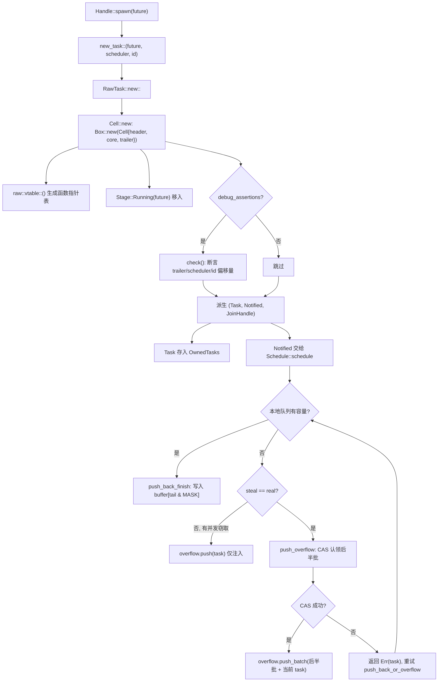
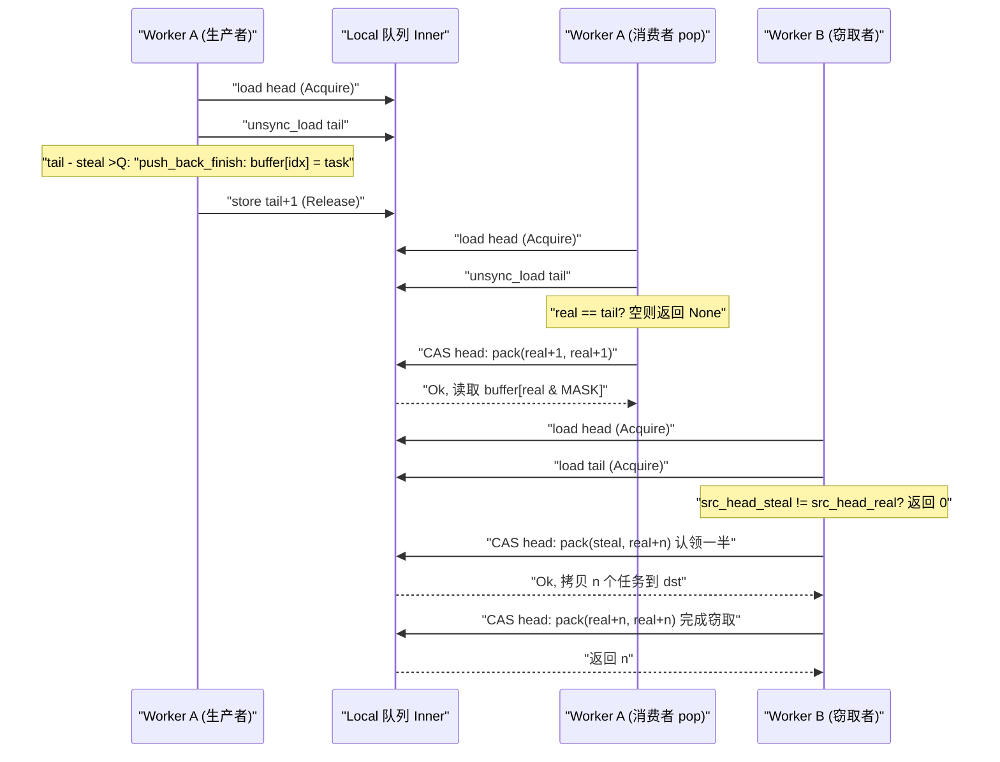

# 第 3 章：一粒任务的诞生：spawn 如何把一个 Future 变成可调度实体

上一章我们完成了 Runtime 的装配：I/O driver、time driver、blocking pool 与调度器被注入同一个 `Runtime` 实例，`Handle` 成为跨线程访问这些组件的共享句柄。但装配好的运行时此时还只是一个空壳——它拥有驱动任务的引擎，却没有任何任务可驱动。本章要回答的问题正是：当你敲下 `tokio::spawn(async { ... })` 的那一刻，那个 `async` 块究竟经历了什么，才从一段普通的 Rust 代码变成一个「可被调度器接管、可被唤醒、可被 join」的实体。这是「任务的一生」的上半场，我们聚焦于诞生：从 `Handle::spawn` 出发，穿过 `new_task` 的引用计数分配，落到 `Cell<T, S>` 的内存布局，最终看清任务如何被投递到某个 worker 的本地队列或全局注入队列。下半场（第 4 章）才会进入调度循环与 poll/wake 闭环。

# 3.1 Future 不是任务：一次 spawn 到底创造了什么

## 直觉模型

把 `Future` 想象成一张「菜谱」，把任务想象成「厨房里正在被烹饪的一道菜」。菜谱本身是静态的、可复制的、没有任何执行状态；只有当厨房（调度器）决定「现在做这道菜」，给它分配一个灶台（worker）、一个订单号（TaskId）、一个出餐口（JoinHandle），它才成为一道「在制菜品」。若没有这层包装，调度器就无从知道「这道菜做到哪一步了」「谁在等它」「做好了通知谁」——它只能看到一张菜谱，无法管理。

## 数据结构与内存布局

Tokio 用 `Task<S>` 表示「被运行时拥有的任务引用」，它是对 `RawTask` 的透明包装：

```rust
#[repr(transparent)]
pub(crate) struct Task {
    raw: RawTask,
    _p: PhantomData,
}
```

[FACT:tokio/src/runtime/task/mod.rs:233-238](https://github.com/tokio-rs/tokio/blob/e800714ad714f1d996ddd56265b550d879349c0a/tokio/src/runtime/task/mod.rs#L233-L238)

`#[repr(transparent)]` 意味着 `Task<S>` 与 `RawTask` 在内存上完全一致，没有额外开销。`PhantomData<S>` 只是编译期的类型标记，标记这个任务属于哪个调度器类型 `S`。

真正承载任务全部状态的是 `Cell<T, S>`，它的布局是整个任务模块的基石：

```rust
#[repr(C)]
pub(super) struct Cell {
    pub(super) header: Header,
    pub(super) core: Core,
    pub(super) trailer: Trailer,
}
```

[FACT:tokio/src/runtime/task/core.rs:126-136](https://github.com/tokio-rs/tokio/blob/e800714ad714f1d996ddd56265b550d879349c0a/tokio/src/runtime/task/core.rs#L126-L136)

三个字段按「热-温-冷」排列。`Header` 是热数据（每次调度、每次状态转换都要访问），`Core` 是温数据（poll 时访问），`Trailer` 是冷数据（仅在创建与销毁时访问）。注释明确写道：`Header` 必须是第一个字段，因为任务结构体会同时被 `*mut Cell` 和 `*mut Header` 引用 [FACT:tokio/src/runtime/task/core.rs:37-43](https://github.com/tokio-rs/tokio/blob/e800714ad714f1d996ddd56265b550d879349c0a/tokio/src/runtime/task/core.rs#L37-L43)。

更关键的是缓存行对齐。`Cell` 上挂着一长串 `#[cfg_attr(..., repr(align(...)))]`，按目标架构选择对齐字节数：x86_64/aarch64/powerpc64 用 128 字节，arm/mips/sparc/hexagon 用 32 字节，m68k 用 16 字节，s390x 用 256 字节，其余默认 64 字节 [FACT:tokio/src/runtime/task/core.rs:64-125](https://github.com/tokio-rs/tokio/blob/e800714ad714f1d996ddd56265b550d879349c0a/tokio/src/runtime/task/core.rs#L64-L125)。注释解释了为什么 x86_64 要用 128 而非 64：从 Intel Sandy Bridge 起，空间预取器会一次拉取**成对**的 64 字节缓存行，所以必须对齐到 128 字节才能避免伪共享 [FACT:tokio/src/runtime/task/core.rs:45-53](https://github.com/tokio-rs/tokio/blob/e800714ad714f1d996ddd56265b550d879349c0a/tokio/src/runtime/task/core.rs#L45-L53)。

> **〔设计推断与架构权衡〕**
> 这个对齐策略的代价是每个任务至少浪费一个缓存行的空间。但任务状态位（`state`）会被多个 worker 线程高频读写——一个线程在 poll 时设置 RUNNING 位，另一个线程在唤醒时读 NOTIFIED 位——若两个任务的状态位落在同一缓存行，每次状态转换都会触发缓存行在核心间来回弹跳（cache line ping-pong），性能损失远超内存浪费。Tokio 选择用空间换时间。

`Header` 本身被约束在 8 个指针大小以内：

```rust
#[test]
#[cfg(not(loom))]
fn header_lte_cache_line() {
    assert!(std::mem::size_of::() ());
}
```

[FACT:tokio/src/runtime/task/core.rs:591-593](https://github.com/tokio-rs/tokio/blob/e800714ad714f1d996ddd56265b550d879349c0a/tokio/src/runtime/task/core.rs#L591-L593)

这个测试确保 `Header` 不会超过 64 字节（8 × 8），从而在 64 字节缓存行的架构上能完整落入一行。`Header` 的字段包括：`state: State`（原子状态位）、`queue_next: UnsafeCell<Option<NonNull<Header>>>`（注入队列的链表指针）、`vtable: &'static Vtable`（函数指针表）、`owner_id: UnsafeCell<Option<NonZeroU64>>`（所属 `OwnedTasks` 列表的 ID）、`scheduled_at: UnsafeCell<ScheduleLatencyInstant>`（调度延迟测量）[FACT:tokio/src/runtime/task/core.rs:169-198](https://github.com/tokio-rs/tokio/blob/e800714ad714f1d996ddd56265b550d879349c0a/tokio/src/runtime/task/core.rs#L169-L198)。

`Core<T, S>` 持有调度器句柄 `scheduler: S`、任务 ID `task_id: Id`，以及最核心的 `stage: CoreStage<T>` [FACT:tokio/src/runtime/task/core.rs:148-165](https://github.com/tokio-rs/tokio/blob/e800714ad714f1d996ddd56265b550d879349c0a/tokio/src/runtime/task/core.rs#L148-L165)。`Stage` 是一个三态枚举：

```rust
#[repr(C)]
pub(super) enum Stage {
    Running(T),
    Finished(super::Result),
    Consumed,
}
```

[FACT:tokio/src/runtime/task/core.rs:225-229](https://github.com/tokio-rs/tokio/blob/e800714ad714f1d996ddd56265b550d879349c0a/tokio/src/runtime/task/core.rs#L225-L229)

这正是「Future 与 Output 复用同一块内存」的关键：任务运行期间 `Stage::Running` 持有 future，完成后原地替换为 `Stage::Finished(output)`，被 `JoinHandle` 取走后变为 `Stage::Consumed`。`#[repr(C)]` 注释指向一个 Miri issue，说明这个布局对 unsafe 代码的正确性有硬性要求 [FACT:tokio/src/runtime/task/core.rs:225-229](https://github.com/tokio-rs/tokio/blob/e800714ad714f1d996ddd56265b550d879349c0a/tokio/src/runtime/task/core.rs#L225-L229)。

`Trailer` 存放冷数据：`owned: linked_list::Pointers<Header>`（`OwnedTasks` 链表指针）、`waker: UnsafeCell<Option<Waker>>`（等待任务完成的消费者 waker）、`hooks: TaskHarnessScheduleHooks` [FACT:tokio/src/runtime/task/core.rs:205-213](https://github.com/tokio-rs/tokio/blob/e800714ad714f1d996ddd56265b550d879349c0a/tokio/src/runtime/task/core.rs#L205-L213)。

## Step-by-Step：从 spawn 到入队

我们代入一个具体场景：在 multi_thread 运行时中，worker 线程 A 执行 `tokio::spawn(async { 42 })`。

**第一步：构造任务三件套。** `new_task` 是任务诞生的唯一入口：

```rust
fn new_task(
    task: T,
    scheduler: S,
    id: Id,
    spawned_at: SpawnLocation,
) -> (Task, Notified, JoinHandle)
```

[FACT:tokio/src/runtime/task/mod.rs:336-346](https://github.com/tokio-rs/tokio/blob/e800714ad714f1d996ddd56265b550d879349c0a/tokio/src/runtime/task/mod.rs#L336-L346)

它调用 `RawTask::new::<T, S>` 分配 `Cell`，然后从同一个 `raw` 指针派生出三个引用：`Task`（owned 引用，通常立即放入 `OwnedTasks`）、`Notified`（通知引用，交给调度器）、`JoinHandle`（结果读取句柄）[FACT:tokio/src/runtime/task/mod.rs:347-363](https://github.com/tokio-rs/tokio/blob/e800714ad714f1d996ddd56265b550d879349c0a/tokio/src/runtime/task/mod.rs#L347-L363)。注意三者共享同一个 `raw`，各自持有一个引用计数。

**第二步：分配 `Cell` 并写入初始状态。** `Cell::new` 在堆上分配整个结构：

```rust
let result = Box::new(Cell {
    trailer: Trailer::new(scheduler.hooks()),
    header: new_header(state, vtable, ...),
    core: Core {
        scheduler,
        stage: CoreStage {
            stage: UnsafeCell::new(Stage::Running(future)),
        },
        task_id,
        ...
    },
});
```

[FACT:tokio/src/runtime/task/core.rs:261-278](https://github.com/tokio-rs/tokio/blob/e800714ad714f1d996ddd56265b550d879349c0a/tokio/src/runtime/task/core.rs#L261-L278)

`vtable` 由 `raw::vtable::<T, S>()` 生成，是一张针对具体 `T` 和 `S` 单态化的函数指针表 [FACT:tokio/src/runtime/task/core.rs:260](https://github.com/tokio-rs/tokio/blob/e800714ad714f1d996ddd56265b550d879349c0a/tokio/src/runtime/task/core.rs#L260)。future 被直接移入 `Stage::Running`，没有额外装箱。

**第三步：debug 断言验证布局。** 在 `debug_assertions` 下，`Cell::new` 会调用 `check` 函数，用 `Header::get_trailer`、`Header::get_scheduler`、`Header::get_id_ptr` 等基于 vtable 偏移量的指针运算，逐一断言「通过 header 反查到的字段地址」与「实际字段地址」一致 [FACT:tokio/src/runtime/task/core.rs:280-321](https://github.com/tokio-rs/tokio/blob/e800714ad714f1d996ddd56265b550d879349c0a/tokio/src/runtime/task/core.rs#L280-L321)。这是对 vtable 偏移量正确性的运行时自检。

**第四步：投递到调度器。** 调度器拿到 `Notified<S>` 后，调用 `Schedule::schedule` [FACT:tokio/src/runtime/task/mod.rs:315](https://github.com/tokio-rs/tokio/blob/e800714ad714f1d996ddd56265b550d879349c0a/tokio/src/runtime/task/mod.rs#L315)。在 multi_thread 下，这会走 `push_back_or_overflow`，把任务推入当前 worker 的本地队列，队列满时溢出到注入队列。

下面这张图刻画了从 `new_task` 到入队的控制流与分支：



这张图揭示了几个关键分支：debug 断言只在调试构建生效；本地队列满时并非直接溢出，而是先判断是否有并发窃取者（`steal != real`），若有则只把当前任务推入注入队列，因为窃取者腾出的空间很快可用。

## 设计思考：为什么是三个引用而不是一个

`new_task` 返回三个引用，而非一个。这是引用计数设计的核心：`Task` 代表「运行时拥有这个任务」，`Notified` 代表「这个任务已被通知、待调度」，`JoinHandle` 代表「有人关心它的结果」。三者生命周期独立——`JoinHandle` 可以被 drop（任务继续运行，结果丢弃），`Notified` 在 poll 后消失，`Task` 在任务完成并从 `OwnedTasks` 移除后释放。若只有一个引用，就无法表达「任务还在跑但没人 join」这种状态。

`UnownedTask` 是另一个重要分支：它持有**两个**引用计数，用于 blocking 任务（不存入 `OwnedTasks`）[FACT:tokio/src/runtime/task/mod.rs:286-295](https://github.com/tokio-rs/tokio/blob/e800714ad714f1d996ddd56265b550d879349c0a/tokio/src/runtime/task/mod.rs#L286-L295)。`unowned` 函数通过 `mem::forget(task)` 和 `mem::forget(notified)` 把两个引用合并进 `UnownedTask` [FACT:tokio/src/runtime/task/mod.rs:388-397](https://github.com/tokio-rs/tokio/blob/e800714ad714f1d996ddd56265b550d879349c0a/tokio/src/runtime/task/mod.rs#L388-L397)。这个「两个引用」的设计动机是：blocking 任务没有 `OwnedTasks` 列表来持有 owned 引用，所以需要额外一个引用计数来保证任务在运行期间不被释放。

# 3.2 状态位：一个 usize 如何编码任务的全部生命周期

## 直觉模型

把任务状态想象成一张「体检报告单」，上面有若干独立的勾选框：是否正在被 poll、是否已完成、是否被通知、是否被取消、是否有人 join。Tokio 没有用多个布尔字段，而是把这些勾选位压进**一个 `AtomicUsize`**。这样每次状态转换只需一次 CAS，而非多次加锁。若没有这个设计，任务状态转换会变成多把锁的嵌套，死锁风险与开销都会飙升。

## 位域布局

`State` 的位域在模块文档中有完整定义 [FACT:tokio/src/runtime/task/mod.rs:32-53](https://github.com/tokio-rs/tokio/blob/e800714ad714f1d996ddd56265b550d879349c0a/tokio/src/runtime/task/mod.rs#L32-L53)：

- `RUNNING`：任务是否正在被 poll 或取消。**这一位同时充当任务的锁** [FACT:tokio/src/runtime/task/mod.rs:37-38](https://github.com/tokio-rs/tokio/blob/e800714ad714f1d996ddd56265b550d879349c0a/tokio/src/runtime/task/mod.rs#L37-L38)。
- `COMPLETE`：future 已完全完成并被 drop。一旦置位永不清除，且永不与 `RUNNING` 同时置位 [FACT:tokio/src/runtime/task/mod.rs:40-41](https://github.com/tokio-rs/tokio/blob/e800714ad714f1d996ddd56265b550d879349c0a/tokio/src/runtime/task/mod.rs#L40-L41)。
- `NOTIFIED`：当前是否存在一个 `Notified` 对象 [FACT:tokio/src/runtime/task/mod.rs:43](https://github.com/tokio-rs/tokio/blob/e800714ad714f1d996ddd56265b550d879349c0a/tokio/src/runtime/task/mod.rs#L43)。
- `CANCELLED`：任务应尽快被取消 [FACT:tokio/src/runtime/task/mod.rs:45-46](https://github.com/tokio-rs/tokio/blob/e800714ad714f1d996ddd56265b550d879349c0a/tokio/src/runtime/task/mod.rs#L45-L46)。
- `JOIN_INTEREST`：存在 `JoinHandle` [FACT:tokio/src/runtime/task/mod.rs:48](https://github.com/tokio-rs/tokio/blob/e800714ad714f1d996ddd56265b550d879349c0a/tokio/src/runtime/task/mod.rs#L48)。
- `JOIN_WAKER`：作为 join handle waker 的访问控制位 [FACT:tokio/src/runtime/task/mod.rs:50-51](https://github.com/tokio-rs/tokio/blob/e800714ad714f1d996ddd56265b550d879349c0a/tokio/src/runtime/task/mod.rs#L50-L51)。

剩余位用于引用计数 [FACT:tokio/src/runtime/task/mod.rs:53](https://github.com/tokio-rs/tokio/blob/e800714ad714f1d996ddd56265b550d879349c0a/tokio/src/runtime/task/mod.rs#L53)。

`RUNNING` 位充当锁这一点值得展开。模块文档的 Safety 章节指出：对 future 的任何可变访问都必须在修改 `RUNNING` 位获得锁之后进行，从而保证独占访问 [FACT:tokio/src/runtime/task/mod.rs:130-133](https://github.com/tokio-rs/tokio/blob/e800714ad714f1d996ddd56265b550d879349c0a/tokio/src/runtime/task/mod.rs#L130-L133)。这意味着 poll 一个任务时，线程先 CAS 设置 `RUNNING`，成功后独占 future；若失败说明别的线程正在 poll，本次 poll 直接返回。这把「poll 的互斥」与「状态转换」合并成一次原子操作，避免了单独的互斥锁。

## JOIN_WAKER 的访问控制协议

`JOIN_WAKER` 位是整个状态机中最精妙的部分。它解决的问题是：`waker` 字段（在 `Trailer` 中）会被两个线程并发访问——运行时在任务完成时**读**它来唤醒 join 者，`JoinHandle` 在 poll 时**写**它来注册 waker。模块文档给出了 7 条规则 [FACT:tokio/src/runtime/task/mod.rs:75-120](https://github.com/tokio-rs/tokio/blob/e800714ad714f1d996ddd56265b550d879349c0a/tokio/src/runtime/task/mod.rs#L75-L120)：

1. `JOIN_WAKER` 初始为 0。

2. 为 0 时，`JoinHandle` 对 waker 字段有独占（可变）访问权。

3. 为 1 时，`JoinHandle` 只有共享（只读）访问权。

4. 为 1 且 `COMPLETE` 为 1 时，运行时对 waker 字段有共享（只读）访问权。

5. `JoinHandle` 要写 waker，必须：(i) 成功把 `JOIN_WAKER` 置 0 以获得独占权，(ii) 写入 waker，(iii) 成功把 `JOIN_WAKER` 置 1。

6. `JoinHandle` 只能在 `COMPLETE` 为 0 时改 `JOIN_WAKER`；运行时只能在 `COMPLETE` 为 1 时改。

7. 若 `JOIN_INTEREST` 为 0 且 `COMPLETE` 为 1，运行时对 waker 字段有独占访问权（用于 drop waker）。

规则 6 隐含了竞态：步骤 (i) 或 (iii) 可能失败。若 (i) 失败，放弃写 waker；若 (iii) 失败（另一线程在此期间置了 `COMPLETE`），则清空 waker 字段 [FACT:tokio/src/runtime/task/mod.rs:110-120](https://github.com/tokio-rs/tokio/blob/e800714ad714f1d996ddd56265b550d879349c0a/tokio/src/runtime/task/mod.rs#L110-L120)。这套协议的本质是：用一个原子位在「写者」和「读者」之间动态转移所有权，避免为 waker 字段单独加锁。

## 引用计数的两种递减

`Task` 的 drop 递减一次引用计数，`UnownedTask` 的 drop 递减两次：

```rust
impl Drop for Task {
    fn drop(&mut self) {
        if self.header().state.ref_dec() {
            self.raw.dealloc();
        }
    }
}
```

[FACT:tokio/src/runtime/task/mod.rs:580-586](https://github.com/tokio-rs/tokio/blob/e800714ad714f1d996ddd56265b550d879349c0a/tokio/src/runtime/task/mod.rs#L580-L586)

```rust
impl Drop for UnownedTask {
    fn drop(&mut self) {
        if self.raw.header().state.ref_dec_twice() {
            self.raw.dealloc();
        }
    }
}
```

[FACT:tokio/src/runtime/task/mod.rs:590-596](https://github.com/tokio-rs/tokio/blob/e800714ad714f1d996ddd56265b550d879349c0a/tokio/src/runtime/task/mod.rs#L590-L596)

`ref_dec` 返回 `true` 表示这是最后一个引用，此时才真正释放 `Cell` 内存。`ref_dec_twice` 是 `UnownedTask` 持有两个计数的直接体现。

## 设计思考：为什么状态位与引用计数共用一个原子

> **〔设计推断与架构权衡〕**
> 把状态位和引用计数放在同一个 `AtomicUsize` 里，是为了让「递减引用计数」与「设置状态位」这两个动作能在**一次 CAS** 中完成。模块文档在 `Schedule::release` 的注释中明确提到：「任务模块会批量处理 ref-dec 与其他选项的设置」[FACT:tokio/src/runtime/task/mod.rs:302-304](https://github.com/tokio-rs/tokio/blob/e800714ad714f1d996ddd56265b550d879349c0a/tokio/src/runtime/task/mod.rs#L302-L304)。如果状态位和引用计数分属两个原子变量，那么「释放最后一个引用」与「标记完成」之间就会出现窗口，需要额外的同步。合并后，`ref_dec` 可以原子地完成「减计数 + 检查是否归零」，避免了 ABA 类问题。

# 3.3 JoinHandle：结果如何跨越任务边界回传

## 直觉模型

`JoinHandle` 就像餐厅给你的「取餐凭证」。任务（厨房）完成时，把菜品（output）放到出餐口（`Stage::Finished`），然后按响你的取餐器（waker）。你拿着凭证来取，凭证本身不持有菜品，只是指向出餐口的指针。若你把凭证丢了（drop `JoinHandle`），菜品会被直接倒掉（output 被 drop），但厨房不会因此停工。

## 数据结构

`JoinHandle<T>` 同样是对 `RawTask` 的透明包装：

```rust
pub struct JoinHandle {
    raw: RawTask,
    _p: PhantomData,
}
```

[FACT:tokio/src/runtime/task/join.rs:163-166](https://github.com/tokio-rs/tokio/blob/e800714ad714f1d996ddd56265b550d879349c0a/tokio/src/runtime/task/join.rs#L163-L166)

`PhantomData<T>` 标记输出类型。`JoinHandle<T>` 在 `T: Send` 时才是 `Send`/`Sync` [FACT:tokio/src/runtime/task/join.rs:169-170](https://github.com/tokio-rs/tokio/blob/e800714ad714f1d996ddd56265b550d879349c0a/tokio/src/runtime/task/join.rs#L169-L170)，这保证了非 Send 输出不会被跨线程移动。

## Step-by-Step：await 一个 JoinHandle

`JoinHandle` 实现了 `Future`，其 `poll` 是结果回传的核心：

```rust
fn poll(self: Pin, cx: &mut Context) -> Poll {
    ready!(crate::trace::trace_leaf());
    let mut ret = Poll::Pending;
    let coop = ready!(crate::task::coop::poll_proceed(cx));
    unsafe {
        self.raw.try_read_output(&mut ret, cx.waker());
    }
    if ret.is_ready() {
        coop.made_progress();
    }
    ret
}
```

[FACT:tokio/src/runtime/task/join.rs:327-354](https://github.com/tokio-rs/tokio/blob/e800714ad714f1d996ddd56265b550d879349c0a/tokio/src/runtime/task/join.rs#L327-L354)

注意几个细节：`trace_leaf` 用于 tracing 插桩；`coop::poll_proceed` 消耗协作预算（第 12 章详述）；`try_read_output` 通过 vtable 擦除泛型，把返回值放在栈上、用 `*mut ()` 传入 [FACT:tokio/src/runtime/task/join.rs:327-354](https://github.com/tokio-rs/tokio/blob/e800714ad714f1d996ddd56265b550d879349c0a/tokio/src/runtime/task/join.rs#L327-L354)。这个「返回值放栈上」的技巧是因为 vtable 函数无法泛型化返回类型 `T`，只能通过裸指针回写。

> **〔设计推断与架构权衡〕**
> `try_read_output` 内部逻辑（在 raw.rs 中，本章未提供源码）：先检查 `COMPLETE` 位，若已置位则调用 `take_output` 取走 `Stage::Finished` 中的结果；否则把 `cx.waker()` 注册到 `Trailer::waker` 字段，返回 `Pending`。注册过程正是走 3.2 节的 `JOIN_WAKER` 协议。

## 结果的所有权转移

模块文档的「Non-Send output」章节精确描述了结果的所有权规则 [FACT:tokio/src/runtime/task/mod.rs:151-170](https://github.com/tokio-rs/tokio/blob/e800714ad714f1d996ddd56265b550d879349c0a/tokio/src/runtime/task/mod.rs#L151-L170)：

- 任务完成时，output 被放入 `Stage`，然后执行「设置 COMPLETE」的转换，并读取此刻的 `JOIN_INTEREST` 值。
- 若 `JOIN_INTEREST` 为 0（无 `JoinHandle`），output 立即被 drop [FACT:tokio/src/runtime/task/mod.rs:157-158](https://github.com/tokio-rs/tokio/blob/e800714ad714f1d996ddd56265b550d879349c0a/tokio/src/runtime/task/mod.rs#L157-L158)。
- 若 `JOIN_INTEREST` 为 1，`JoinHandle` 负责清理 output [FACT:tokio/src/runtime/task/mod.rs:160-161](https://github.com/tokio-rs/tokio/blob/e800714ad714f1d996ddd56265b550d879349c0a/tokio/src/runtime/task/mod.rs#L160-L161)。

对非 Send output，文档给出了三步论证：output 在 poll future 的线程上创建；`JoinHandle<Output>` 在 Output 非 Send 时也非 Send，所以它也在 spawn 线程上；因此 `JoinHandle` 取走或 drop output 时不会跨线程移动 [FACT:tokio/src/runtime/task/mod.rs:164-170](https://github.com/tokio-rs/tokio/blob/e800714ad714f1d996ddd56265b550d879349c0a/tokio/src/runtime/task/mod.rs#L164-L170)。

## JoinHandle 的 drop：快慢两条路径

```rust
impl Drop for JoinHandle {
    fn drop(&mut self) {
        if self.raw.state().drop_join_handle_fast().is_ok() {
            return;
        }
        self.raw.drop_join_handle_slow();
    }
}
```

[FACT:tokio/src/runtime/task/join.rs:358-364](https://github.com/tokio-rs/tokio/blob/e800714ad714f1d996ddd56265b550d879349c0a/tokio/src/runtime/task/join.rs#L358-L364)

`drop_join_handle_fast` 尝试用一次 CAS 完成「清除 `JOIN_INTEREST` 位 + 递减引用计数」。若失败（例如任务正在完成，状态位被占用），则走 `drop_join_handle_slow` 的慢路径。这是典型的「乐观快路径 + 悲观慢路径」模式。

## 设计思考：为什么 JoinHandle 不直接持有 output

> **〔设计推断与架构权衡〕**
> 若 `JoinHandle` 直接持有 output，那么 output 必须在任务完成时被移动到 `JoinHandle` 所在线程。但 `JoinHandle` 可能被移动到任意线程（只要 `T: Send`），而 output 的产生线程是 poll 线程。直接持有会导致「output 在 poll 线程产生，却要在 join 线程 drop」的跨线程移动，对非 Send output 直接违反类型系统。Tokio 选择让 output 留在 `Cell` 中（`Stage::Finished`），`JoinHandle` 只持有指向 `Cell` 的 `RawTask`，取结果时通过 `take_output` 原地取走。这样 output 的 drop 发生在 `JoinHandle` 所在线程，但前提是该线程与 poll 线程相同（非 Send 场景下成立）。

# 3.4 本地队列：work-stealing 的生产者-消费者结构

## 直觉模型

每个 worker 有一个「私人待办清单」（本地队列），容量 256。worker 自己从**头部**取任务（LIFO，利用缓存局部性），其他 worker 从**尾部**窃取任务（FIFO，取走最老的、最可能已完成的任务）。若没有本地队列，所有任务都挤在全局队列，每次取任务都要竞争全局锁，多核扩展性会崩溃。

## 内存布局：head 与 tail 的分离

```rust
pub(crate) struct Inner {
    head: AtomicUnsignedLong,
    tail: AtomicUnsignedShort,
    buffer: Box>>; LOCAL_QUEUE_CAPACITY]>,
}
```

[FACT:tokio/src/runtime/scheduler/multi_thread/queue.rs:36-57](https://github.com/tokio-rs/tokio/blob/e800714ad714f1d996ddd56265b550d879349c0a/tokio/src/runtime/scheduler/multi_thread/queue.rs#L36-L57)

`head` 是 `AtomicUnsignedLong`（64 位，若平台支持 u64），`tail` 是 `AtomicUnsignedShort`（32 位）。注释解释了为什么索引比实际需要更宽：为了 ABA 缓解，以及区分「满」和「空」缓冲区 [FACT:tokio/src/runtime/scheduler/multi_thread/queue.rs:37-49](https://github.com/tokio-rs/tokio/blob/e800714ad714f1d996ddd56265b550d879349c0a/tokio/src/runtime/scheduler/multi_thread/queue.rs#L37-L49)。

`head` 内部打包了**两个** `UnsignedShort`：低位是「真实头部」（real head），高位是「窃取者正在处理的第一个位置」（steal head）。当两者相等时，没有活跃的窃取者 [FACT:tokio/src/runtime/scheduler/multi_thread/queue.rs:39-49](https://github.com/tokio-rs/tokio/blob/e800714ad714f1d996ddd56265b550d879349c0a/tokio/src/runtime/scheduler/multi_thread/queue.rs#L39-L49)。这个双值打包是 work-stealing 队列的核心技巧：窃取者先 CAS 更新 steal 值来「认领」一批任务，完成后把 steal 值追上 real 值，表示窃取结束。

`LOCAL_QUEUE_CAPACITY` 在非 loom 下是 256，loom 下缩到 4 以便测试更多边界 [FACT:tokio/src/runtime/scheduler/multi_thread/queue.rs:62-69](https://github.com/tokio-rs/tokio/blob/e800714ad714f1d996ddd56265b550d879349c0a/tokio/src/runtime/scheduler/multi_thread/queue.rs#L62-L69)。`MASK = LOCAL_QUEUE_CAPACITY - 1`，用于环形缓冲区索引 [FACT:tokio/src/runtime/scheduler/multi_thread/queue.rs:71](https://github.com/tokio-rs/tokio/blob/e800714ad714f1d996ddd56265b550d879349c0a/tokio/src/runtime/scheduler/multi_thread/queue.rs#L71)。

## Step-by-Step：push_back_or_overflow 的完整分支

这是本地队列最复杂的函数，我们逐分支解析：

```rust
pub(crate) fn push_back_or_overflow>(
    &mut self,
    mut task: task::Notified,
    overflow: &O,
    stats: &mut Stats,
) {
    let tail = loop {
        let head = self.inner.head.load(Acquire);
        let (steal, real) = unpack(head);
        let tail = unsafe { self.inner.tail.unsync_load() };

        if tail.wrapping_sub(steal)  return,
                Err(v) => { task = v; }
            }
        }
    };
    self.push_back_finish(task, tail);
}
```

[FACT:tokio/src/runtime/scheduler/multi_thread/queue.rs:188-223](https://github.com/tokio-rs/tokio/blob/e800714ad714f1d996ddd56265b550d879349c0a/tokio/src/runtime/scheduler/multi_thread/queue.rs#L188-L223)

三条分支：

1. **有容量**（`tail - steal < CAPACITY`）：`break tail`，跳出循环后调用 `push_back_finish` 写入缓冲区。

2. **无容量但有并发窃取者**（`steal != real`）：窃取者会腾出空间，所以只把当前任务推入注入队列，立即返回 [FACT:tokio/src/runtime/scheduler/multi_thread/queue.rs:204-208](https://github.com/tokio-rs/tokio/blob/e800714ad714f1d996ddd56265b550d879349c0a/tokio/src/runtime/scheduler/multi_thread/queue.rs#L204-L208)。

3. **无容量且无窃取者**：调用 `push_overflow` 把后半批任务溢出到注入队列 [FACT:tokio/src/runtime/scheduler/multi_thread/queue.rs:209-219](https://github.com/tokio-rs/tokio/blob/e800714ad714f1d996ddd56265b550d879349c0a/tokio/src/runtime/scheduler/multi_thread/queue.rs#L209-L219)。若 CAS 失败（输给并发窃取者），`push_overflow` 返回 `Err(task)`，循环重试。

`push_back_finish` 写入任务并更新 tail：

```rust
fn push_back_finish(&self, task: task::Notified, tail: UnsignedShort) {
    let idx = tail as usize & MASK;
    self.inner.buffer[idx].with_mut(|ptr| {
        unsafe { ptr::write((*ptr).as_mut_ptr(), task); }
    });
    self.inner.tail.store(tail.wrapping_add(1), Release);
}
```

[FACT:tokio/src/runtime/scheduler/multi_thread/queue.rs:226-244](https://github.com/tokio-rs/tokio/blob/e800714ad714f1d996ddd56265b550d879349c0a/tokio/src/runtime/scheduler/multi_thread/queue.rs#L226-L244)

`Release` 序保证写入的任务对窃取者可见。

## push_overflow：为什么溢出后半批

```rust
const NUM_TASKS_TAKEN: UnsignedShort = (LOCAL_QUEUE_CAPACITY / 2) as UnsignedShort;
```

[FACT:tokio/src/runtime/scheduler/multi_thread/queue.rs:265](https://github.com/tokio-rs/tokio/blob/e800714ad714f1d996ddd56265b550d879349c0a/tokio/src/runtime/scheduler/multi_thread/queue.rs#L265)

溢出时取走 128 个任务。注释详细解释了为什么取**后半批**而非前半批 [FACT:tokio/src/runtime/scheduler/multi_thread/queue.rs:295-306](https://github.com/tokio-rs/tokio/blob/e800714ad714f1d996ddd56265b550d879349c0a/tokio/src/runtime/scheduler/multi_thread/queue.rs#L295-L306)：从注入队列取任务时，总是放在前半部分。所以若一个任务在后半部分，就能确定它不是刚从注入队列取来的。这保证了「从注入队列取出的任务不会被立刻放回注入队列」（至少在被 poll 一次之前）。

CAS 认领后半批：

```rust
if self.inner.head.compare_exchange_weak(
    pack(head, head), pack(tail, tail), Release, Relaxed
).is_err() {
    return Err(task);
}
```

[FACT:tokio/src/runtime/scheduler/multi_thread/queue.rs:283-293](https://github.com/tokio-rs/tokio/blob/e800714ad714f1d996ddd56265b550d879349c0a/tokio/src/runtime/scheduler/multi_thread/queue.rs#L283-L293)

把 `head` 从 `(head, head)` 更新到 `(tail, tail)`，即同时推进 steal 和 real 到 tail，认领全部任务。成功后把 tail 回退到 `tail + NUM_TASKS_TAKEN`，表示前半批仍留在本地队列 [FACT:tokio/src/runtime/scheduler/multi_thread/queue.rs:314-316](https://github.com/tokio-rs/tokio/blob/e800714ad714f1d996ddd56265b550d879349c0a/tokio/src/runtime/scheduler/multi_thread/queue.rs#L314-L316)。

## pop 与 steal_into：取任务的两条路径

`pop` 是 worker 自己取任务（从头部，LIFO）：

```rust
pub(crate) fn pop(&mut self) -> Option> {
    let mut head = self.inner.head.load(Acquire);
    let idx = loop {
        let (steal, real) = unpack(head);
        let tail = unsafe { self.inner.tail.unsync_load() };
        if real == tail { return None; }
        let next_real = real.wrapping_add(1);
        let next = if steal == real {
            pack(next_real, next_real)
        } else {
            assert_ne!(steal, next_real);
            pack(steal, next_real)
        };
        let res = self.inner.head.compare_exchange_weak(head, next, AcqRel, Acquire);
        match res {
            Ok(_) => break real as usize & MASK,
            Err(actual) => head = actual,
        }
    };
    Some(self.inner.buffer[idx].with(|ptr| unsafe { ptr::read(ptr).assume_init() }))
}
```

[FACT:tokio/src/runtime/scheduler/multi_thread/queue.rs:361-399](https://github.com/tokio-rs/tokio/blob/e800714ad714f1d996ddd56265b550d879349c0a/tokio/src/runtime/scheduler/multi_thread/queue.rs#L361-L399)

关键分支：若 `steal == real`（无窃取者），同时推进两者；否则只推进 real，保留 steal 不动 [FACT:tokio/src/runtime/scheduler/multi_thread/queue.rs:377-384](https://github.com/tokio-rs/tokio/blob/e800714ad714f1d996ddd56265b550d879349c0a/tokio/src/runtime/scheduler/multi_thread/queue.rs#L377-L384)。`assert_ne!(steal, next_real)` 确保不会把 real 推进到 steal 的位置，否则会破坏窃取者的认领状态。

`steal_into` 是窃取路径，先检查目标队列是否有足够空间：

```rust
if dst_tail.wrapping_sub(steal) > LOCAL_QUEUE_CAPACITY as UnsignedShort / 2 {
    return None;
}
```

[FACT:tokio/src/runtime/scheduler/multi_thread/queue.rs:431-435](https://github.com/tokio-rs/tokio/blob/e800714ad714f1d996ddd56265b550d879349c0a/tokio/src/runtime/scheduler/multi_thread/queue.rs#L431-L435)

目标队列超过半满就不窃取，避免窃取后立刻又溢出。

`steal_into2` 是窃取的核心，计算窃取数量：

```rust
let n = src_tail.wrapping_sub(src_head_real);
let n = n - n / 2;
```

[FACT:tokio/src/runtime/scheduler/multi_thread/queue.rs:487-488](https://github.com/tokio-rs/tokio/blob/e800714ad714f1d996ddd56265b550d879349c0a/tokio/src/runtime/scheduler/multi_thread/queue.rs#L487-L488)

窃取一半（向上取整）。然后 CAS 更新 head 的 steal 值来认领：

```rust
let steal_to = src_head_real.wrapping_add(n);
next_packed = pack(src_head_steal, steal_to);
let res = self.0.head.compare_exchange_weak(prev_packed, next_packed, AcqRel, Acquire);
```

[FACT:tokio/src/runtime/scheduler/multi_thread/queue.rs:496-506](https://github.com/tokio-rs/tokio/blob/e800714ad714f1d996ddd56265b550d879349c0a/tokio/src/runtime/scheduler/multi_thread/queue.rs#L496-L506)

注意这里只更新了 real 值（`pack(src_head_steal, steal_to)` 中 steal 保持不变），把 real 推进到 `steal_to`。这表示「这些任务已被认领，其他窃取者不能再碰」。窃取完成后，再把 steal 追上 real：

```rust
loop {
    let head = unpack(prev_packed).1;
    next_packed = pack(head, head);
    let res = self.0.head.compare_exchange_weak(prev_packed, next_packed, AcqRel, Acquire);
    match res {
        Ok(_) => return n,
        Err(actual) => prev_packed = actual,
    }
}
```

[FACT:tokio/src/runtime/scheduler/multi_thread/queue.rs:548-561](https://github.com/tokio-rs/tokio/blob/e800714ad714f1d996ddd56265b550d879349c0a/tokio/src/runtime/scheduler/multi_thread/queue.rs#L548-L561)

下面这张时序图刻画了「生产者 push、消费者 pop、窃取者 steal」三方并发交互：



## 设计思考：为什么本地队列是 LIFO 而窃取是 FIFO

> **〔设计推断与架构权衡〕**
> worker 自己从头部取（LIFO），因为最近推入的任务最可能还在 CPU 缓存中，且最可能是「刚被唤醒、数据还热」的任务。窃取者从尾部取（FIFO），因为最老的任务最可能已经完成大部分工作，窃取它能最快减轻受害者负载。这种「LIFO 本地 + FIFO 窃取」的组合是 work-stealing 调度的经典设计，兼顾了缓存局部性与负载均衡。

至此，任务已经完成了从 Future 到可调度实体的蜕变：它被分配了引用计数、放进了 `Cell` 的内存布局，并成功投递到 worker 的本地队列或全局注入队列。但任务被放入队列只是开始，真正让它运转起来的是 worker 线程的调度循环。下一章我们将进入「任务的一生」下半场，追踪 worker 如何从队列中取出任务、调用 `Future::poll`，并在返回 `Pending` 时通过 `Waker` 注册唤醒，最终触发 `schedule` 重新入队——「唤醒 → 入队 → 再 poll」这一闭环的完整调用路径，以及 work-stealing 策略与 LIFO 槽位优化，都将在那里揭晓。
