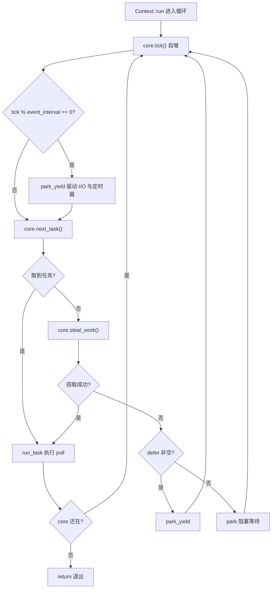
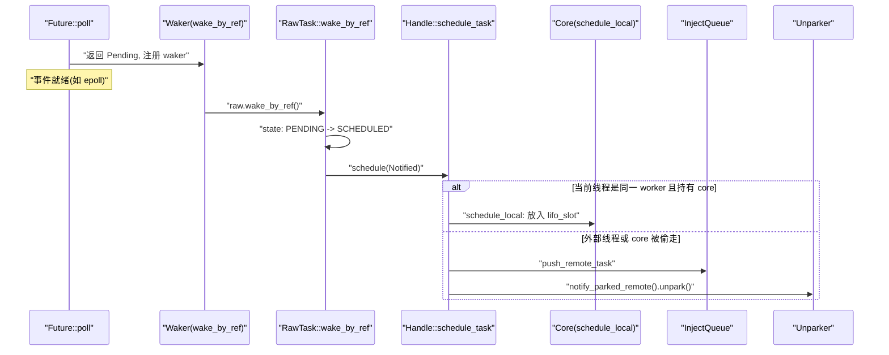
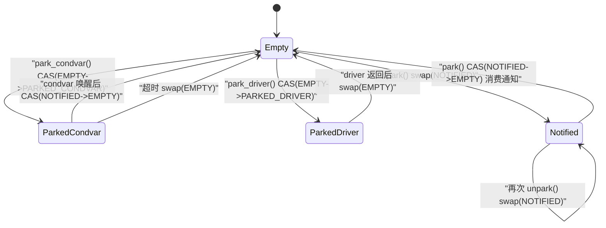

# 第 4 章：调度循环的心跳：poll 循环与工作窃取 (Work-Stealing) 算法

# 从队列到执行：worker 主循环的骨架

上一章我们把任务送进了 `Local` 队列或全局注入队列。但队列只是「待办清单」，真正让任务跑起来的，是 worker 线程里那个永不停止的循环。这一章我们追踪 `Context::run`——它是整个多线程调度器的心脏。

先建立直觉：worker 线程就像一个厨师，面前有一摞自己的订单（`run_queue`），旁边还有一个公共订单架（`inject`）。厨师先看自己手边最近的一张（`lifo_slot`），没有就从自己那摞拿，再没有就去公共架抓一把，还不行就去别的厨师那摞里偷几张。全都空了他才去休息，但休息时耳朵还竖着——一有订单进来就立刻醒来。

若没有这个循环，任务被入队后就永远躺在队列里，`Future::poll` 永远不会被调用，整个运行时就是一堆死数据。

## Core 的内存布局与状态字段

worker 的可变状态全部装在 `Core` 里，它被 `Box` 分配在堆上，通过 `AtomicCell<Core>` 在 `Worker` 与线程本地 `Context` 之间传递。

`Core` 的关键字段如下 [FACT:tokio/src/runtime/scheduler/multi_thread/worker.rs:113-167](https://github.com/tokio-rs/tokio/blob/e800714ad714f1d996ddd56265b550d879349c0a/tokio/src/runtime/scheduler/multi_thread/worker.rs#L113-L167)：

- `tick: u32`：每次循环自增，用于周期性触发维护（`maintenance`）和全局队列检查。
- `lifo_slot: Option<Notified>`：**LIFO 槽位**，这是本章最精妙的设计。当 worker 自己调度一个任务时，它不进 `run_queue`，而是放进这个槽位，下次取任务时**优先**从这里拿。
- `lifo_enabled: bool`：LIFO 槽位的开关，用于防止 ping-pong 场景下的饥饿。
- `run_queue: queue::Local<Arc<Handle>>`：本地队列，上一章剖析过的 `Local` 结构。
- `is_searching: bool`：worker 是否正在搜索可窃取的任务。
- `is_shutdown: bool` / `is_traced: bool`：关闭与追踪标志。
- `park: Option<Parker>`：park 器，用 `Option` 包裹是为了在借用检查器下方便地取出/放回。
- `global_queue_interval: u32`：多久检查一次全局队列。
- `rand: FastRand`：快速随机数生成器，用于随机选择窃取起点。

> **〔设计推断与架构权衡〕**
> 注意 `lifo_slot` 是 `Option<Notified>` 而非队列——它只存**一个**任务。这个设计动机在源码注释里说得很清楚 [FACT:tokio/src/runtime/scheduler/multi_thread/worker.rs:117-121](https://github.com/tokio-rs/tokio/blob/e800714ad714f1d996ddd56265b550d879349c0a/tokio/src/runtime/scheduler/multi_thread/worker.rs#L117-L121)：worker 自己调度的任务存进这个槽位，worker 会在检查 `run_queue` **之前**先检查它，效果是「最后被调度的任务下一个运行」（LIFO）。这是为了改善局部性，对消息传递模式特别有效，能降低延迟。

为什么 LIFO 能降低延迟？考虑一个典型的消息传递场景：任务 A 处理完消息后唤醒任务 B，B 处理完又唤醒 A。如果 A 唤醒 B 后 B 立刻运行，B 需要的数据很可能还在 CPU 缓存里（因为 A 刚碰过）。如果 B 被塞到队列尾部，等前面几十个任务跑完，缓存早被冲掉了。

但 LIFO 有饥饿风险。源码用 `MAX_LIFO_POLLS_PER_TICK = 3` 来限制 [FACT:tokio/src/runtime/scheduler/multi_thread/worker.rs:263-263](https://github.com/tokio-rs/tokio/blob/e800714ad714f1d996ddd56265b550d879349c0a/tokio/src/runtime/scheduler/multi_thread/worker.rs#L263-L263)：每个 tick 最多优先 LIFO 槽位 3 次，超过就禁用，让其他任务有机会执行。

## 主循环 walkthrough：一次完整的调度周期

我们代入一个具体场景：worker 0 刚从 `park` 中醒来，`run_queue` 里有 5 个任务，`lifo_slot` 里有 1 个任务，全局队列有 3 个任务。

主循环入口是 `Context::run` [FACT:tokio/src/runtime/scheduler/multi_thread/worker.rs:570-642](https://github.com/tokio-rs/tokio/blob/e800714ad714f1d996ddd56265b550d879349c0a/tokio/src/runtime/scheduler/multi_thread/worker.rs#L570-L642)。它先重置 `lifo_enabled`（因为 core 可能被 `block_in_place` 偷走过，状态需要归位）[FACT:tokio/src/runtime/scheduler/multi_thread/worker.rs:571-573](https://github.com/tokio-rs/tokio/blob/e800714ad714f1d996ddd56265b550d879349c0a/tokio/src/runtime/scheduler/multi_thread/worker.rs#L571-L573)，然后进入 `while !core.is_shutdown` 循环。

每轮循环做四件事：

**第一步：tick 与维护。** `core.tick()` 自增计数器 [FACT:tokio/src/runtime/scheduler/multi_thread/worker.rs:587](https://github.com/tokio-rs/tokio/blob/e800714ad714f1d996ddd56265b550d879349c0a/tokio/src/runtime/scheduler/multi_thread/worker.rs#L587)。接着 `self.maintenance(core)` 检查 `tick % event_interval == 0`，若是则调用 `park_yield` 以 0 超时驱动 I/O 和定时器 [FACT:tokio/src/runtime/scheduler/multi_thread/worker.rs:809-826](https://github.com/tokio-rs/tokio/blob/e800714ad714f1d996ddd56265b550d879349c0a/tokio/src/runtime/scheduler/multi_thread/worker.rs#L809-L826)。

**第二步：取任务。** `core.next_task(&self.worker)` 是核心取任务逻辑 [FACT:tokio/src/runtime/scheduler/multi_thread/worker.rs:1090-1156](https://github.com/tokio-rs/tokio/blob/e800714ad714f1d996ddd56265b550d879349c0a/tokio/src/runtime/scheduler/multi_thread/worker.rs#L1090-L1156)。它分两条路径：

- 当 `tick % global_queue_interval == 0` 时，**优先**从全局队列取，取不到再取本地 [FACT:tokio/src/runtime/scheduler/multi_thread/worker.rs:1091-1098](https://github.com/tokio-rs/tokio/blob/e800714ad714f1d996ddd56265b550d879349c0a/tokio/src/runtime/scheduler/multi_thread/worker.rs#L1091-L1098)。这是为了防止全局队列里的任务被饿死。
- 否则**优先**取本地任务 [FACT:tokio/src/runtime/scheduler/multi_thread/worker.rs:1090-1156](https://github.com/tokio-rs/tokio/blob/e800714ad714f1d996ddd56265b550d879349c0a/tokio/src/runtime/scheduler/multi_thread/worker.rs#L1090-L1156)。

本地取任务由 `next_local_task` 完成 [FACT:tokio/src/runtime/scheduler/multi_thread/worker.rs:1158-1160](https://github.com/tokio-rs/tokio/blob/e800714ad714f1d996ddd56265b550d879349c0a/tokio/src/runtime/scheduler/multi_thread/worker.rs#L1158-L1160)：

```rust
fn next_local_task(&mut self) -> Option {
    self.lifo_slot.take().or_else(|| self.run_queue.pop())
}
```

先取 LIFO 槽位，再取队列头部（LIFO 弹出）。这就是上一章说的「本地 LIFO」。

如果本地为空但全局队列非空，worker 会**批量**从全局队列拉取任务 [FACT:tokio/src/runtime/scheduler/multi_thread/worker.rs:1110-1154](https://github.com/tokio-rs/tokio/blob/e800714ad714f1d996ddd56265b550d879349c0a/tokio/src/runtime/scheduler/multi_thread/worker.rs#L1110-L1154)。批量大小 `n` 的计算很讲究：`min(inject.len() / remotes.len() + 1, cap)`，其中 `cap` 又取 `min(remaining_slots, max_capacity / 2)`。源码注释解释了为什么限制在队列容量的一半 [FACT:tokio/src/runtime/scheduler/multi_thread/worker.rs:1120-1131](https://github.com/tokio-rs/tokio/blob/e800714ad714f1d996ddd56265b550d879349c0a/tokio/src/runtime/scheduler/multi_thread/worker.rs#L1120-L1131)：确保拉取的任务落在本地队列的**前半部分**，这样即使后续发生溢出，这些任务也不会被推回全局队列（溢出只影响后半部分）。

**第三步：运行任务。** 拿到任务后调用 `run_task` [FACT:tokio/src/runtime/scheduler/multi_thread/worker.rs:647-796](https://github.com/tokio-rs/tokio/blob/e800714ad714f1d996ddd56265b550d879349c0a/tokio/src/runtime/scheduler/multi_thread/worker.rs#L647-L796)。这是本章最复杂的函数，我们下一节专门展开。

**第四步：窃取或 park。** 如果 `next_task` 返回 `None`，说明本地和全局都没活了，调用 `steal_work` [FACT:tokio/src/runtime/scheduler/multi_thread/worker.rs:1167-1195](https://github.com/tokio-rs/tokio/blob/e800714ad714f1d996ddd56265b550d879349c0a/tokio/src/runtime/scheduler/multi_thread/worker.rs#L1167-L1195)。窃取失败则进入 `park` 或 `park_yield` [FACT:tokio/src/runtime/scheduler/multi_thread/worker.rs:613-621](https://github.com/tokio-rs/tokio/blob/e800714ad714f1d996ddd56265b550d879349c0a/tokio/src/runtime/scheduler/multi_thread/worker.rs#L613-L621)。

整个控制流如下：



## run_task：poll 与 LIFO 槽位的闭环

`run_task` 是任务真正被 `poll` 的地方，也是「唤醒 → 入队 → 再 poll」闭环的收口点。

进入函数后第一件事是 `assert_owner` [FACT:tokio/src/runtime/scheduler/multi_thread/worker.rs:648](https://github.com/tokio-rs/tokio/blob/e800714ad714f1d996ddd56265b550d879349c0a/tokio/src/runtime/scheduler/multi_thread/worker.rs#L648)，把 `Notified` 转换成 `Task`，同时断言当前线程确实是这个任务的 owner（debug 断言）。

接着 `transition_from_searching` [FACT:tokio/src/runtime/scheduler/multi_thread/worker.rs:652](https://github.com/tokio-rs/tokio/blob/e800714ad714f1d996ddd56265b550d879349c0a/tokio/src/runtime/scheduler/multi_thread/worker.rs#L652)——如果 worker 之前在搜索状态，现在找到任务了，要退出搜索状态，并可能唤醒其他 parked worker。

然后是关键的 budget 包裹 [FACT:tokio/src/runtime/scheduler/multi_thread/worker.rs:695-795](https://github.com/tokio-rs/tokio/blob/e800714ad714f1d996ddd56265b550d879349c0a/tokio/src/runtime/scheduler/multi_thread/worker.rs#L695-L795)：

```rust
coop::budget(|| {
    task.run();
    let mut lifo_polls = 0;
    loop {
        let mut core = match self.core.borrow_mut().take() {
            Some(core) => core,
            None => return ControlFlow::Break(()),
        };
        let task = match core.lifo_slot.take() {
            Some(task) => task,
            None => {
                self.reset_lifo_enabled(&mut core);
                core.stats.end_poll();
                return ControlFlow::Continue(core);
            }
        };
        if !coop::has_budget_remaining() {
            core.run_queue.push_back_or_overflow(task, ...);
            return ControlFlow::Continue(core);
        }
        lifo_polls += 1;
        if lifo_polls >= MAX_LIFO_POLLS_PER_TICK {
            core.lifo_enabled = false;
        }
        let task = self.worker.handle.shared.owned.assert_owner(task);
        *self.core.borrow_mut() = Some(core);
        task.run();
    }
})
```

这段代码揭示了 LIFO 槽位的完整闭环：`task.run()` 执行 `Future::poll`，poll 过程中如果任务唤醒了自己或别的任务，`schedule_local` 会把新任务放进 `lifo_slot` [FACT:tokio/src/runtime/scheduler/multi_thread/worker.rs:1396-1408](https://github.com/tokio-rs/tokio/blob/e800714ad714f1d996ddd56265b550d879349c0a/tokio/src/runtime/scheduler/multi_thread/worker.rs#L1396-L1408)。poll 返回后，循环立刻检查 `lifo_slot`，如果有任务就继续跑——**不回到主循环**，直接在同一个 budget 内连续 poll。

这就是「唤醒 → 入队 → 再 poll」在 LIFO 路径上的体现：唤醒时任务被放进 `lifo_slot`，poll 返回后立即被取出再 poll，形成紧密的闭环。

注意 `self.core.borrow_mut().take()` 的 `None` 分支 [FACT:tokio/src/runtime/scheduler/multi_thread/worker.rs:716-724](https://github.com/tokio-rs/tokio/blob/e800714ad714f1d996ddd56265b550d879349c0a/tokio/src/runtime/scheduler/multi_thread/worker.rs#L716-L724)：如果 core 被偷走了（比如任务里调用了 `block_in_place`），worker 必须返回 `ControlFlow::Break(())`，让 `Context::run` 退出。这是 `block_in_place` 与调度循环的交互点。

## 唤醒路径：Waker 如何触发重新入队

当 `Future::poll` 返回 `Pending` 时，任务需要注册一个 `Waker`，等事件就绪时被唤醒。Tokio 的 `Waker` 实现极其精简——它就是一个指向任务 `Header` 的裸指针加一张 vtable。

`waker_ref` 构造 `WakerRef` [FACT:tokio/src/runtime/task/waker.rs:11-34](https://github.com/tokio-rs/tokio/blob/e800714ad714f1d996ddd56265b550d879349c0a/tokio/src/runtime/task/waker.rs#L11-L34)，用 `ManuallyDrop` 包裹 `Waker` 避免 drop 时减引用计数。vtable 是静态的 [FACT:tokio/src/runtime/task/waker.rs:119-119](https://github.com/tokio-rs/tokio/blob/e800714ad714f1d996ddd56265b550d879349c0a/tokio/src/runtime/task/waker.rs#L119-L119)：

```rust
static WAKER_VTABLE: RawWakerVTable =
    RawWakerVTable::new(clone_waker, wake_by_val, wake_by_ref, drop_waker);
```

四个函数都只是把裸指针还原成 `Header`，然后调用 `RawTask` 的对应方法 [FACT:tokio/src/runtime/task/waker.rs:70-116](https://github.com/tokio-rs/tokio/blob/e800714ad714f1d996ddd56265b550d879349c0a/tokio/src/runtime/task/waker.rs#L70-L116)。比如 `wake_by_ref` 最终调用 `raw.wake_by_ref()` [FACT:tokio/src/runtime/task/waker.rs:106-116](https://github.com/tokio-rs/tokio/blob/e800714ad714f1d996ddd56265b550d879349c0a/tokio/src/runtime/task/waker.rs#L106-L116)。

`wake_by_ref` 的语义是：把任务状态从 `PENDING` 转为 `SCHEDULED`，如果转换成功（即之前确实是 PENDING），就调用 `Schedule::schedule` 把任务重新入队。

对于多线程调度器，`schedule` 的实现在 `Handle::schedule_task` [FACT:tokio/src/runtime/scheduler/multi_thread/worker.rs:1353-1376](https://github.com/tokio-rs/tokio/blob/e800714ad714f1d996ddd56265b550d879349c0a/tokio/src/runtime/scheduler/multi_thread/worker.rs#L1353-L1376)：

```rust
pub(super) fn schedule_task(&self, task: Notified, is_yield: bool) {
    with_current(|maybe_cx| {
        if let Some(cx) = maybe_cx {
            if self.ptr_eq(&cx.worker.handle) {
                if let Some(core) = cx.core.borrow_mut().as_mut() {
                    self.schedule_local(core, task, is_yield);
                    return;
                }
            }
        }
        self.push_remote_task(task);
        self.notify_parked_remote();
    });
}
```

逻辑分两支：

- 如果当前线程就是这个调度器的 worker，且持有 core，走 `schedule_local` [FACT:tokio/src/runtime/scheduler/multi_thread/worker.rs:1385-1417](https://github.com/tokio-rs/tokio/blob/e800714ad714f1d996ddd56265b550d879349c0a/tokio/src/runtime/scheduler/multi_thread/worker.rs#L1385-L1417)——放进 LIFO 槽位或本地队列。
- 否则（从外部线程唤醒，或 core 被偷走），走 `push_remote_task` 推入全局注入队列，并 `notify_parked_remote` 唤醒一个 parked worker [FACT:tokio/src/runtime/scheduler/multi_thread/worker.rs:1379-1383](https://github.com/tokio-rs/tokio/blob/e800714ad714f1d996ddd56265b550d879349c0a/tokio/src/runtime/scheduler/multi_thread/worker.rs#L1379-L1383)。

`schedule_local` 内部又分两支 [FACT:tokio/src/runtime/scheduler/multi_thread/worker.rs:1385-1417](https://github.com/tokio-rs/tokio/blob/e800714ad714f1d996ddd56265b550d879349c0a/tokio/src/runtime/scheduler/multi_thread/worker.rs#L1385-L1417)：如果是 `yield` 或 LIFO 已禁用，推入 `run_queue` 尾部；否则放进 `lifo_slot`，并把原来槽位里的任务挤到队列尾部。



## park 与 unpark：状态机与唤醒的原子性

worker 没活干时要 park，但 park/unpark 是最容易出竞态的地方。Tokio 用 `AtomicUsize` 状态机加 `Condvar` 兜底来解决。

`Inner` 的字段 [FACT:tokio/src/runtime/scheduler/multi_thread/park.rs:31-43](https://github.com/tokio-rs/tokio/blob/e800714ad714f1d996ddd56265b550d879349c0a/tokio/src/runtime/scheduler/multi_thread/park.rs#L31-L43)：`state: AtomicUsize`、`mutex: Mutex<()>`、`condvar: Condvar`、`shared: Arc<Shared>`。状态常量有四个 [FACT:tokio/src/runtime/scheduler/multi_thread/park.rs:36-45](https://github.com/tokio-rs/tokio/blob/e800714ad714f1d996ddd56265b550d879349c0a/tokio/src/runtime/scheduler/multi_thread/park.rs#L36-L45)：

- `EMPTY = 0`：未 park。
- `PARKED_CONDVAR = 1`：在 condvar 上 park。
- `PARKED_DRIVER = 2`：在 I/O driver 上 park。
- `NOTIFIED = 3`：已被唤醒。

这是一个显式状态机，我们用它画状态图（这是本章唯一符合 `stateDiagram-v2` 准入条件的地方——源码里确实有这四个状态常量）：



`unpark` 的实现 [FACT:tokio/src/runtime/scheduler/multi_thread/park.rs:277-290](https://github.com/tokio-rs/tokio/blob/e800714ad714f1d996ddd56265b550d879349c0a/tokio/src/runtime/scheduler/multi_thread/park.rs#L277-L290) 用 `swap` 而非 CAS，源码注释解释了原因 [FACT:tokio/src/runtime/scheduler/multi_thread/park.rs:277-290](https://github.com/tokio-rs/tokio/blob/e800714ad714f1d996ddd56265b550d879349c0a/tokio/src/runtime/scheduler/multi_thread/park.rs#L277-L290)：必须执行 release 操作让 park 线程观察到 unpark 之前的写入，所以即使 state 已经是 `NOTIFIED` 也要写一次。

`park` 先尝试消费已有的通知 [FACT:tokio/src/runtime/scheduler/multi_thread/park.rs:132-149](https://github.com/tokio-rs/tokio/blob/e800714ad714f1d996ddd56265b550d879349c0a/tokio/src/runtime/scheduler/multi_thread/park.rs#L132-L149)：如果 CAS `NOTIFIED -> EMPTY` 成功，说明之前已被唤醒，直接返回不阻塞。否则尝试拿 driver 锁，拿到就在 driver 上 park，拿不到就用 condvar 兜底 [FACT:tokio/src/runtime/scheduler/multi_thread/park.rs:143-148](https://github.com/tokio-rs/tokio/blob/e800714ad714f1d996ddd56265b550d879349c0a/tokio/src/runtime/scheduler/multi_thread/park.rs#L143-L148)。

`park_condvar` 里有个经典的双重检查 [FACT:tokio/src/runtime/scheduler/multi_thread/park.rs:162-180](https://github.com/tokio-rs/tokio/blob/e800714ad714f1d996ddd56265b550d879349c0a/tokio/src/runtime/scheduler/multi_thread/park.rs#L162-L180)：先 CAS `EMPTY -> PARKED_CONDVAR`，如果失败且是 `NOTIFIED`，说明在设置状态前就被唤醒了，此时必须 `swap(EMPTY)` 来同步 unpark 的写入 [FACT:tokio/src/runtime/scheduler/multi_thread/park.rs:167-177](https://github.com/tokio-rs/tokio/blob/e800714ad714f1d996ddd56265b550d879349c0a/tokio/src/runtime/scheduler/multi_thread/park.rs#L167-L177)。注释特别强调：即使知道是 `NOTIFIED` 也必须读一次，因为 unpark 可能在我们读 `NOTIFIED` 之后又被调用了一次。

`unpark_condvar` 的注释 [FACT:tokio/src/runtime/scheduler/multi_thread/park.rs:292-307](https://github.com/tokio-rs/tokio/blob/e800714ad714f1d996ddd56265b550d879349c0a/tokio/src/runtime/scheduler/multi_thread/park.rs#L292-L307) 点出了 condvar 的经典陷阱：parked 线程设置 `PARKED` 状态和真正 `wait` 之间有窗口期，如果在这期间 notify 会被忽略。解决方案是 park 线程此时持有 `mutex`，unpark 线程先 `drop(self.mutex.lock())` 获取锁（从而等待 park 线程释放），再 `notify_one`。

# 设计思考：为什么 LIFO 槽位是单槽而非队列

> **〔设计推断与架构权衡〕**
> 单槽设计是刻意的权衡。如果用队列，每次唤醒都要入队、每次取任务都要出队，开销更大；而且队列会积累多个任务，破坏「最近唤醒的最先跑」这个局部性假设。单槽的语义是「只记住最近一个」，被挤出的任务进普通队列——这恰好符合局部性收益递减的规律：最近一个任务最热，第二个次之，第三个往后收益就很小了。

`MAX_LIFO_POLLS_PER_TICK = 3` 这个魔数 [FACT:tokio/src/runtime/scheduler/multi_thread/worker.rs:263-263](https://github.com/tokio-rs/tokio/blob/e800714ad714f1d996ddd56265b550d879349c0a/tokio/src/runtime/scheduler/multi_thread/worker.rs#L263-L263) 也是经验值。源码注释说「跑几次 LIFO 槽位似乎足以受益于局部性，超过 3 次可能过度加权」。这防止了 A 唤醒 B、B 唤醒 A 的 ping-pong 场景把其他任务饿死。

另一个值得注意的设计是 `steal_work` 的「半数搜索」策略 [FACT:tokio/src/runtime/scheduler/multi_thread/worker.rs:1158-1160](https://github.com/tokio-rs/tokio/blob/e800714ad714f1d996ddd56265b550d879349c0a/tokio/src/runtime/scheduler/multi_thread/worker.rs#L1158-L1160)：只有当不到一半的 worker 在搜索时，新 worker 才真正尝试窃取。这避免了所有 worker 同时疯狂窃取导致的 CAS 争用。`transition_to_searching` 通过 `idle.transition_worker_to_searching()` 来协调 [FACT:tokio/src/runtime/scheduler/multi_thread/worker.rs:1197-1203](https://github.com/tokio-rs/tokio/blob/e800714ad714f1d996ddd56265b550d879349c0a/tokio/src/runtime/scheduler/multi_thread/worker.rs#L1197-L1203)。

窃取从随机起点开始 [FACT:tokio/src/runtime/scheduler/multi_thread/worker.rs:1172-1174](https://github.com/tokio-rs/tokio/blob/e800714ad714f1d996ddd56265b550d879349c0a/tokio/src/runtime/scheduler/multi_thread/worker.rs#L1172-L1174)，遍历所有 remote，跳过自己 [FACT:tokio/src/runtime/scheduler/multi_thread/worker.rs:1179-1182](https://github.com/tokio-rs/tokio/blob/e800714ad714f1d996ddd56265b550d879349c0a/tokio/src/runtime/scheduler/multi_thread/worker.rs#L1179-L1182)，调用 `steal_into` 尝试窃取。全部失败后回退到全局队列 [FACT:tokio/src/runtime/scheduler/multi_thread/worker.rs:1197-1203](https://github.com/tokio-rs/tokio/blob/e800714ad714f1d996ddd56265b550d879349c0a/tokio/src/runtime/scheduler/multi_thread/worker.rs#L1197-L1203)。

# 本章小结

worker 主循环 `Context::run` 是调度器的心脏：每轮 tick 后先取任务（LIFO 槽位 → 本地队列 → 全局队列），取到就 `run_task` 执行 poll，取不到就窃取，窃取失败就 park。`run_task` 内部的 LIFO 循环把「唤醒 → 入队 → 再 poll」压缩在同一个 budget 内，形成低延迟闭环。`Waker` 是裸指针加静态 vtable，`wake_by_ref` 通过状态转换触发 `schedule`，根据当前线程是否是同一 worker 决定走本地队列还是全局队列。`park`/`unpark` 用四状态原子机加 condvar 兜底，解决了唤醒丢失的经典竞态。

下一章我们将离开调度器，进入 I/O 世界：Reactor 如何把 epoll 事件翻译成 `Waker` 唤醒，让 `AsyncFd` 的 `Pending` 变成 `Ready`。

# 本章思考与自测

Q1: 如果把 `next_local_task` 改成先取 `run_queue` 再取 `lifo_slot`，在消息传递密集的场景下会有什么后果？

**参考解析**：`next_local_task` 当前实现是 `self.lifo_slot.take().or_else(|| self.run_queue.pop())` [FACT:tokio/src/runtime/scheduler/multi_thread/worker.rs:1158-1160](https://github.com/tokio-rs/tokio/blob/e800714ad714f1d996ddd56265b550d879349c0a/tokio/src/runtime/scheduler/multi_thread/worker.rs#L1158-L1160)，先取 LIFO 槽位。如果反过来先取 `run_queue`，那么刚被唤醒、数据还热的任务会被排到队列里其他任务之后执行。在 A→B→A 的消息传递模式下，B 被唤醒后不会立即运行，而是等队列里其他任务跑完，此时 A 写入的数据可能已被挤出 CPU 缓存，局部性收益丧失。更严重的是，`lifo_slot` 里的任务会一直等到 `run_queue` 清空才被执行，延迟显著上升。源码注释 [FACT:tokio/src/runtime/scheduler/multi_thread/worker.rs:117-121](https://github.com/tokio-rs/tokio/blob/e800714ad714f1d996ddd56265b550d879349c0a/tokio/src/runtime/scheduler/multi_thread/worker.rs#L117-L121) 明确指出这个顺序是为了「改善局部性，受益于消息传递模式并降低延迟」。

Q2: `park_condvar` 中，如果去掉 `Err(NOTIFIED)` 分支里的 `self.state.swap(EMPTY, SeqCst)`，只保留 `return`，会有什么问题？

**参考解析**：源码在 `Err(NOTIFIED)` 分支里执行 `let old = self.state.swap(EMPTY, SeqCst)` [FACT:tokio/src/runtime/scheduler/multi_thread/park.rs:167-177](https://github.com/tokio-rs/tokio/blob/e800714ad714f1d996ddd56265b550d879349c0a/tokio/src/runtime/scheduler/multi_thread/park.rs#L167-L177)。注释解释 [FACT:tokio/src/runtime/scheduler/multi_thread/park.rs:168-173](https://github.com/tokio-rs/tokio/blob/e800714ad714f1d996ddd56265b550d879349c0a/tokio/src/runtime/scheduler/multi_thread/park.rs#L168-L173)：unpark 可能在我们读到 `NOTIFIED` 之后又被调用了一次，必须执行一次 acquire 操作与那个 unpark 同步，才能观察到它之前的所有写入。如果只 `return` 不 swap，state 会停留在 `NOTIFIED`，下一次 park 时 CAS `NOTIFIED -> EMPTY` 会成功并立即返回（消费了一个已经过期的通知），但更糟的是 unpark 的 release 写入没有被同步，park 线程可能看不到 unpark 之前写入的数据，导致内存可见性问题。这是典型的「丢失唤醒 + 内存序」双重 bug。

Q3: `run_task` 中，当 `self.core.borrow_mut().take()` 返回 `None` 时为什么返回 `ControlFlow::Break(())` 而不是 `Continue`？

**参考解析**：`self.core.borrow_mut().take()` 返回 `None` 意味着 core 已经被偷走 [FACT:tokio/src/runtime/scheduler/multi_thread/worker.rs:716-724](https://github.com/tokio-rs/tokio/blob/e800714ad714f1d996ddd56265b550d879349c0a/tokio/src/runtime/scheduler/multi_thread/worker.rs#L716-L724)。core 被偷走的唯一途径是任务内部调用了 `block_in_place`，它会通过 `maybe_move_runtime` 把 core 从 `cx.core` 取出并交给新线程 [FACT:tokio/src/runtime/scheduler/multi_thread/worker.rs:473-497](https://github.com/tokio-rs/tokio/blob/e800714ad714f1d996ddd56265b550d879349c0a/tokio/src/runtime/scheduler/multi_thread/worker.rs#L473-L497)。此时当前线程已经不再持有调度能力，如果返回 `Continue`，`Context::run` 会继续循环并调用 `core.next_task()` 等需要 core 的方法，但 core 已经不在 `self.core` 里了，会导致 panic 或状态不一致。返回 `Break` 让 `Context::run` 直接 `return` [FACT:tokio/src/runtime/scheduler/multi_thread/worker.rs:594-597](https://github.com/tokio-rs/tokio/blob/e800714ad714f1d996ddd56265b550d879349c0a/tokio/src/runtime/scheduler/multi_thread/worker.rs#L594-L597)，把控制权交还给 `run` 函数，由它处理后续（比如 `cx.defer.wake()` [FACT:tokio/src/runtime/scheduler/multi_thread/worker.rs:564](https://github.com/tokio-rs/tokio/blob/e800714ad714f1d996ddd56265b550d879349c0a/tokio/src/runtime/scheduler/multi_thread/worker.rs#L564)）。注释也说明 [FACT:tokio/src/runtime/scheduler/multi_thread/worker.rs:719-721](https://github.com/tokio-rs/tokio/blob/e800714ad714f1d996ddd56265b550d879349c0a/tokio/src/runtime/scheduler/multi_thread/worker.rs#L719-L721)：此时不能调用 `reset_lifo_enabled`，因为 core 被偷走了，偷走者会在 `Context::run` 顶部处理。
