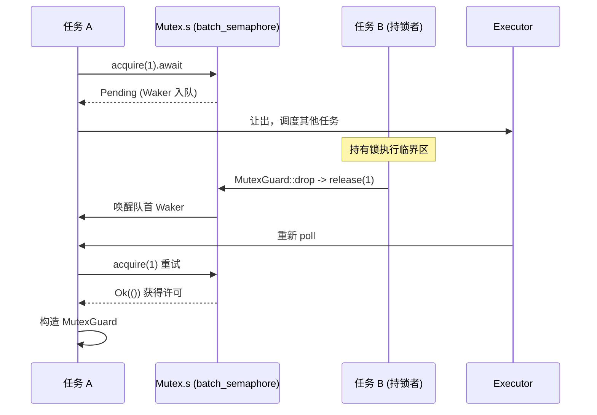

# 第 7 章：同步原语深度剖析：tokio::sync (Mutex, RwLock, Notify, mpsc)

上一章揭示了时间如何被抽象为一种 I/O 事件，让定时器与 fd 就绪共享同一个 park/unpark 等待入口。然而，当多个任务竞争同一把锁或通过通道传递消息时，等待的对象不再是 fd 或时钟，而是另一个任务的状态变化。本章进入 tokio::sync 家族，探明一次 lock().await 或 recv().await 在阻塞时究竟把 Waker 存到了哪里，被唤醒时又如何被重新调度。

# 为什么异步 Mutex 不能复用 std 的实现

## 直觉模型：从「占着茅坑」到「让出座位」

`std::sync::Mutex` 的 `lock()` 在锁被占用时会**阻塞当前线程**——线程被操作系统挂起，直到锁释放。这在异步运行时里是灾难性的：一个 worker 线程可能同时驱动成百上千个任务，如果它因为等一把锁而阻塞，它承载的所有其他任务全部停摆。异步 Mutex 的核心诉求是：等锁时**让出线程**，把「我在等这把锁」这件事登记到一个队列里，然后返回 `Pending`，让执行器去跑别的任务。

Tokio 的 `Mutex` 没有自己实现等待队列，而是**完全建立在信号量之上**。

## 数据结构与内存布局

`Mutex<T>` 的字段极简：

[FACT:tokio/src/sync/mutex.rs:133-138]

```rust
pub struct Mutex {
    #[cfg(all(tokio_unstable, feature = "tracing"))]
    resource_span: tracing::Span,
    s: semaphore::Semaphore,
    c: UnsafeCell,
}
```

三个字段各司其职：`s` 是一个**许可数为 1 的信号量**，`c` 是 `UnsafeCell<T>` 包裹的受保护数据。注意这里的 `semaphore` 是 `batch_semaphore` 的别名 [FACT:tokio/src/sync/mutex.rs:3-3]，也就是底层实现，而非 `sync::Semaphore` 那层公开封装。

`MutexGuard<'a, T>` 则只持有一个对 `Mutex` 的引用：

[FACT:tokio/src/sync/mutex.rs:151-157]

```rust
pub struct MutexGuard {
    #[cfg(all(tokio_unstable, feature = "tracing"))]
    resource_span: tracing::Span,
    lock: &'a Mutex,
}
```

这里有个关键设计：`MutexGuard` **不持有信号量许可对象**，只持有 `&Mutex`。释放锁的动作发生在 `Drop` 里，直接调用 `self.lock.s.release(1)` [FACT:tokio/src/sync/mutex.rs:959-961]。这与 `SemaphorePermit` 持有 `permits: usize` 计数、在 Drop 时归还不同——Mutex 的许可数恒为 1，不需要计数。

`Send`/`Sync` 的边界值得单独看：

[FACT:tokio/src/sync/mutex.rs:258-259]

```rust
unsafe impl Send for Mutex where T: ?Sized + Send {}
unsafe impl Sync for Mutex where T: ?Sized + Send {}
```

`Sync` 只要求 `T: Send` 而非 `T: Sync`——这是合理的，因为互斥访问保证了同一时刻只有一个线程能触碰 `T`，跨线程传递 `T` 的所有权（`Send`）就够了，不需要 `T` 本身可被共享（`Sync`）。这正是 `Mutex<T>` 能把非 `Sync` 的 `T` 变成 `Sync` 的原因。

## Step-by-Step：一次 `lock().await` 的完整旅程

代入场景：任务 A 调用 `mutex.lock().await`，此时锁空闲。

第一步，`lock()` 构造一个 async 块，内部先 `self.acquire().await`，成功后构造 `MutexGuard` [FACT:tokio/src/sync/mutex.rs:434-443]。

第二步，`acquire()` 直接委托给信号量：

[FACT:tokio/src/sync/mutex.rs:655-663]

```rust
async fn acquire(&self) {
    crate::trace::async_trace_leaf().await;
    self.s.acquire(1).await.unwrap_or_else(|_| {
        unreachable!()
    });
}
```

`unwrap_or_else(|_| unreachable!())` 这行注释道出了设计约束：Mutex 从不显式 close 信号量，且独占持有它，所以 `acquire` 永远不会返回 `Err`。这是把「信号量关闭」这一错误路径在类型层面排除掉。

第三步，若锁被占用，`s.acquire(1)` 返回 `Pending`，当前任务的 Waker 被登记进信号量的等待队列。**Waker 存在哪里？** 答案在 `batch_semaphore` 的等待队列里（本章源码材料未展开该文件，但其角色是：每个等待者持有一个 Waker，按 FIFO 排队）。

第四步，持有锁的任务 B 释放锁时，`MutexGuard::drop` 调用 `s.release(1)` [FACT:tokio/src/sync/mutex.rs:965-975]，信号量把许可交给队首等待者并唤醒其 Waker，任务 A 被重新调度，`acquire` 返回 `Ok`，构造出 `MutexGuard`。

整个流程可以用下面的时序图刻画：



## 设计思考：FIFO 公平性与取消安全

文档明确声明 Tokio 的 Mutex 保证 FIFO [FACT:tokio/src/sync/mutex.rs:20-22]。这一公平性来自底层信号量的排队语义。公平的代价是：一次 `lock` 被取消（比如在 `select!` 中落败）会让你**失去队列中的位置** [FACT:tokio/src/sync/mutex.rs:415-419]。这不是 bug，而是 FIFO 队列的必然——取消意味着从队列中移除，重新 `lock` 就得重新排队。

另一个反直觉的设计是**不投毒**（no poisoning）。`std::sync::Mutex` 在持锁线程 panic 时会标记为 poisoned，后续 `lock` 返回 `Err`。Tokio 的 Mutex 不这么做：持锁者 panic 时锁会被正常释放 [FACT:tokio/src/sync/mutex.rs:122-125]。文档警告，如果 panic 被捕获，受保护数据可能处于不一致状态。这是异步场景下的务实取舍——panic 在异步任务里通常意味着任务终止，投毒机制反而增加复杂度。

`MutexGuard::map` 系列方法值得一提。它允许把整个 `MutexGuard<T>` 降级为只保护某个子字段的 `MappedMutexGuard<U>`。实现上，它先用闭包算出子字段指针 `data`，再通过 `skip_drop` 把原 guard 拆解成不触发 Drop 的 `MutexGuardInner`，最后构造新的 guard [FACT:tokio/src/sync/mutex.rs:869-883]。`skip_drop` 用 `ManuallyDrop` + `ptr::read` 转移字段所有权，避免 `Drop` 被调用两次 [FACT:tokio/src/sync/mutex.rs:827-836]。这是 Rust 里「转移所有权但不触发析构」的经典手法。

# Semaphore：许可计数与等待队列如何实现背压

## 直觉模型：停车场的车位

信号量就像停车场：`acquire` 是开车进场，有空位就进，没空位就在门口排队；`release` 是开车离场，空出一个位子就通知队首的车进场。许可数就是车位总数，`acquire_many(n)` 就是一辆占 n 个车位的大车。

## 数据结构与内存布局

公开的 `Semaphore` 只是底层 `batch_semaphore::Semaphore` 的薄封装：

[FACT:tokio/src/sync/semaphore.rs:427-432]

```rust
pub struct Semaphore {
    ll_sem: ll::Semaphore,
    #[cfg(all(tokio_unstable, feature = "tracing"))]
    resource_span: tracing::Span,
}
```

`SemaphorePermit<'a>` 持有信号量引用和许可计数：

[FACT:tokio/src/sync/semaphore.rs:442-445]

```rust
pub struct SemaphorePermit {
    sem: &'a Semaphore,
    permits: usize,
}
```

`permits` 字段是理解 `forget`/`merge`/`split` 的关键。`forget` 把 `permits` 置零 [FACT:tokio/src/sync/semaphore.rs:1193-1195]，这样 Drop 时归还 0 个许可——等价于「永久消耗」这些许可。`split` 从当前许可里切出 n 个给新 permit [FACT:tokio/src/sync/semaphore.rs:1260-1271]。`merge` 把另一个 permit 的计数合并进来，并断言两者来自同一信号量 [FACT:tokio/src/sync/semaphore.rs:1230-1240]。

> **〔设计推断与架构权衡〕**
> `MAX_PERMITS` 是 `usize::MAX >> 3` [FACT:tokio/src/sync/semaphore.rs:476-479]。为什么右移 3 位？ 底层 `batch_semaphore` 需要在高位比特里编码状态标志（如关闭标志），所以把可用许可数限制在低位，留出高位做标志位。这是把「计数 + 状态」压进单个 `usize` 的常见技巧。

## Step-by-Step：acquire 与 release 的许可流转

场景：信号量初始 2 个许可，任务 A `acquire()`，任务 B `acquire_many(2)`。

`acquire()` 委托给 `ll_sem.acquire(1)`，成功后构造 `SemaphorePermit { permits: 1 }` [FACT:tokio/src/sync/semaphore.rs:614-631]。`acquire_many(2)` 类似，但传 2 [FACT:tokio/src/sync/semaphore.rs:661-679]。

若许可不足，`ll_sem.acquire(n)` 返回 `Pending`，Waker 入队。这里有个公平性细节：文档指出，如果队首是一个 `acquire_many(5)` 而当前只剩 3 个许可，即使后面有个 `acquire(1)` 能立刻满足，它也必须等——因为队首的大车占着队 [FACT:tokio/src/sync/semaphore.rs:19-24]。这是严格 FIFO 的代价，避免了饥饿。

释放路径在 Drop：

[FACT:tokio/src/sync/semaphore.rs:1402-1404]

```rust
impl Drop for SemaphorePermit {
    fn drop(&mut self) {
        self.sem.add_permits(self.permits);
    }
}
```

`add_permits` 委托给 `ll_sem.release(n)` [FACT:tokio/src/sync/semaphore.rs:568-570]，底层把许可还给等待队列，唤醒能凑够许可的等待者。

内存序方面，文档给出了强保证：acquire、release、close 都是 `AcqRel` 操作，彼此全序，等价于单个原子变量上的 `AcqRel` [FACT:tokio/src/sync/semaphore.rs:35-42]。这意味着「先写数据再 release 许可」的写入，对「后 acquire 许可」的任务可见——信号量可以安全地在任务间传递数据。

## 设计思考：close 与背压

`close()` 让所有等待者收到 `AcquireError`，且后续 `try_acquire` 返回 `Closed` [FACT:tokio/src/sync/semaphore.rs:1161-1163]。这是优雅关闭的基础：当接收端不再需要数据时，close 信号量能让所有阻塞的发送者立刻失败返回，而不是永远等待。

背压的本质在 mpsc 里体现得最清楚。下一节会看到，mpsc 的容量控制就是用一个许可数等于 buffer 大小的信号量实现的。

# 通道家族：等待者队列与 Waker 唤醒的不同取舍

## 直觉模型：四种通道，四种等待策略

`oneshot` 是「一次性信封」——只能送一封信，发送方不等待（`send` 是同步的），接收方 `await` 等信。`mpsc` 是「有界传送带」——发送方在传送带满时等待，接收方在空时等待，容量由信号量控制。`broadcast` 和 `watch` 是「广播喇叭」——一个发送方，多个接收方，但两者对「落后」的处理截然不同。

本节源码材料聚焦 `oneshot` 和 `mpsc::bounded`，我们逐一拆解。

## oneshot：用状态位编码的极简握手

`oneshot` 的 `Inner` 结构是理解其设计的核心：

[FACT:tokio/src/sync/oneshot.rs:386-409]

```rust
struct Inner {
    state: AtomicUsize,
    value: UnsafeCell>,
    tx_task: Task,
    rx_task: Task,
}
```

`state` 是一个 `AtomicUsize`，用位标志编码整个通道的状态。四个标志位定义在文件末尾：

[FACT:tokio/src/sync/oneshot.rs:1488-1505]

```rust
const RX_TASK_SET: usize = 0b00001;
const VALUE_SENT: usize = 0b00010;
const CLOSED: usize = 0b00100;
const TX_TASK_SET: usize = 0b01000;
```

`value` 是 `UnsafeCell<Option<T>>`，`tx_task` 和 `rx_task` 是 `Task` 类型，内部是 `UnsafeCell<MaybeUninit<Waker>>` [FACT:tokio/src/sync/oneshot.rs:411-411]。注意 `MaybeUninit`——Waker 可能未初始化，是否有效由 `state` 里的 `RX_TASK_SET`/`TX_TASK_SET` 位决定 [FACT:tokio/src/sync/oneshot.rs:396-399]。

**这个设计的精髓**：`VALUE_SENT` 位不仅表示「值已发送」，还决定了 `UnsafeCell` 的访问权归属。注释写得非常明确 [FACT:tokio/src/sync/oneshot.rs:1491-1496]：若 `VALUE_SENT` 置位，`UnsafeCell` 只能被接收方访问；若未置位，只能被发送方访问。这样就用一个原子位实现了无锁的所有权转移，避免了额外的锁。

`send` 的流程：

[FACT:tokio/src/sync/oneshot.rs:622-646]

```rust
pub fn send(mut self, t: T) -> Result {
    let inner = self.inner.take().unwrap();
    inner.value.with_mut(|ptr| unsafe {
        *ptr = Some(t);
    });
    if !inner.complete() {
        unsafe {
            return Err(inner.consume_value().unwrap());
        }
    }
    Ok(())
}
```

先把值写入 `UnsafeCell`（此时 `VALUE_SENT` 未置位，接收方不会访问），再调用 `complete()` 尝试置位 `VALUE_SENT`。`complete()` 是一个 CAS 循环：

[FACT:tokio/src/sync/oneshot.rs:1516-1549]

```rust
fn set_complete(cell: &AtomicUsize) -> State {
    let mut state = cell.load(Ordering::Relaxed);
    loop {
        if State(state).is_closed() {
            break;
        }
        match cell.compare_exchange_weak(
            state, state | VALUE_SENT, Ordering::AcqRel, Ordering::Acquire,
        ) {
            Ok(_) => break,
            Err(actual) => state = actual,
        }
    }
    State(state)
}
```

为什么用 CAS 而非简单的 `fetch_or`？注释解释得很清楚 [FACT:tokio/src/sync/oneshot.rs:1517-1529]：如果通道已 `CLOSED`，就**不能**再置 `VALUE_SENT`。因为一旦置位，接收方会认为可以访问 `UnsafeCell`，而此时发送方正准备把值取回去（`consume_value`），两边同时访问就会数据竞争。所以 CAS 循环在发现 `CLOSED` 时提前 break，不置位。

`complete()` 返回后，如果成功置位且 `RX_TASK_SET` 已置位，就唤醒接收方：

[FACT:tokio/src/sync/oneshot.rs:1300-1315]

```rust
fn complete(&self) -> bool {
    let prev = State::set_complete(&self.state);
    if prev.is_closed() {
        return false;
    }
    if prev.is_rx_task_set() {
        unsafe {
            self.rx_task.with_task(Waker::wake_by_ref);
        }
    }
    true
}
```

接收方的 `poll_recv` 是状态机的核心：

[FACT:tokio/src/sync/oneshot.rs:1317-1384]

它先加载状态，若 `is_complete()` 则直接 `consume_value` 返回；若 `is_closed()` 返回 `Err`；否则进入「登记 Waker」分支。登记时先检查 `is_rx_task_set()`，若已设置且 `will_wake` 判断是同一个 Waker 就不重复设置；若不同则先 unset 再 set。这里有个微妙的竞态处理：unset 之后如果发现 `is_complete()` 变真了，要把标志位**重新 set 回去** [FACT:tokio/src/sync/oneshot.rs:1342-1344]，否则 Waker 会在 Drop 时泄漏（因为 Drop 依赖标志位判断是否要 drop Waker）。

这个「unset 后重新 set」的模式在 `poll_closed` 里也出现 [FACT:tokio/src/sync/oneshot.rs:839-848]，是 oneshot 处理并发唤醒的标准手法。

## mpsc::bounded：信号量驱动的背压

mpsc 的容量控制完全交给信号量。`channel` 函数创建一个许可数等于 buffer 的信号量：

[FACT:tokio/src/sync/mpsc/bounded.rs:159-171]

```rust
pub fn channel(buffer: usize) -> (Sender, Receiver) {
    assert!(buffer > 0, "mpsc bounded channel requires buffer > 0");
    let semaphore = Semaphore {
        semaphore: semaphore::Semaphore::new(buffer),
        bound: buffer,
    };
    let (tx, rx) = chan::channel(semaphore);
    let tx = Sender::new(tx);
    let rx = Receiver::new(rx);
    (tx, rx)
}
```

`Semaphore` 是 mpsc 内部的包装，同时持有底层信号量和 `bound`（最大容量）[FACT:tokio/src/sync/mpsc/bounded.rs:176-179]。`bound` 用于 `max_capacity` 查询，而 `available_permits` 给出当前容量 [FACT:tokio/src/sync/mpsc/bounded.rs:591-593]。

发送路径 `send` 先 `reserve` 再 `send`：

[FACT:tokio/src/sync/mpsc/bounded.rs:816-824]

```rust
pub async fn send(&self, value: T) -> Result> {
    match self.reserve().await {
        Ok(permit) => {
            permit.send(value);
            Ok(())
        }
        Err(_) => Err(SendError(value)),
    }
}
```

`reserve` 内部调用 `reserve_inner(1)`，后者先检查 `n > max_capacity` 直接返回错误，再 `acquire(n)` [FACT:tokio/src/sync/mpsc/bounded.rs:1272-1311]。这里有个精妙的 `WakeReceiverOnDrop` 守卫：

[FACT:tokio/src/sync/mpsc/bounded.rs:1286-1301]

```rust
struct WakeReceiverOnDrop {
    chan: &'a chan::Tx,
}
impl Drop for WakeReceiverOnDrop {
    fn drop(&mut self) {
        use chan::Semaphore;
        let semaphore = self.chan.semaphore();
        if semaphore.is_closed() && semaphore.is_idle() {
            self.chan.wake_rx();
        }
    }
}
```

注释解释了动机 [FACT:tokio/src/sync/mpsc/bounded.rs:1279-1285]：如果 `reserve` 在拿到部分许可后被取消（比如 `select!` 落败），底层 `Acquire` 会在 Drop 时归还这些许可，但**不会**像 `Permit` 那样通知接收方。如果此时通道已关闭且空闲，接收方可能永远等不到「通道已关闭」的通知。这个守卫在 Drop 时补上这个唤醒。成功时用 `mem::forget(guard)` 取消守卫 [FACT:tokio/src/sync/mpsc/bounded.rs:1306-1306]，因为成功路径由 `Permit` 接管通知职责。

`Permit` 的 Drop 也做同样的事：

[FACT:tokio/src/sync/mpsc/bounded.rs:1732-1745]

```rust
impl Drop for Permit {
    fn drop(&mut self) {
        use chan::Semaphore;
        let semaphore = self.chan.semaphore();
        semaphore.add_permit();
        if semaphore.is_closed() && semaphore.is_idle() {
            self.chan.wake_rx();
        }
    }
}
```

`Permit::send` 则用 `mem::forget` 跳过 Drop，避免归还许可 [FACT:tokio/src/sync/mpsc/bounded.rs:1721-1728]。

接收路径 `recv` 用 `poll_fn` 包装 `chan.recv(cx)` [FACT:tokio/src/sync/mpsc/bounded.rs:243-246]。`poll_recv` 直接委托 [FACT:tokio/src/sync/mpsc/bounded.rs:650-652]。真正的等待队列逻辑在 `chan` 模块（本章未展开），但可以推断：接收方 Waker 存在 `chan::Rx` 里，当发送方 `send` 时唤醒。

`try_send` 展示了非阻塞路径：

[FACT:tokio/src/sync/mpsc/bounded.rs:924-934]

```rust
pub fn try_send(&self, message: T) -> Result> {
    match self.chan.semaphore().semaphore.try_acquire(1) {
        Ok(()) => {}
        Err(TryAcquireError::Closed) => return Err(TrySendError::Closed(message)),
        Err(TryAcquireError::NoPermits) => return Err(TrySendError::Full(message)),
    }
    self.chan.send(message);
    Ok(())
}
```

`try_acquire` 的两种错误精确映射到 `Closed` 和 `Full`，区分了「通道关闭」和「缓冲区满」两种失败。

## 设计思考：取消安全与消息丢失

mpsc 文档反复强调取消安全 [FACT:tokio/src/sync/mpsc/bounded.rs:776-784]：`send` 在 `select!` 中落败时，**消息会被丢弃**。要避免丢失，必须用 `reserve` 拿到 `Permit` 再 `send`——因为 `Permit` 已经预留了容量，`send` 是同步的、不会被打断。

`recv` 则是取消安全的 [FACT:tokio/src/sync/mpsc/bounded.rs:199-204]：若 `recv` 在 `select!` 中落败，保证没有消息被消费。这是因为 `recv` 的 `poll_recv` 只在真正取到消息时才返回 `Ready`，`Pending` 时不动队列。

`oneshot` 的 `Receiver` 作为 Future 也是取消安全的 [FACT:tokio/src/sync/oneshot.rs:246-251]。但要注意：`oneshot` 的 `send` 是同步的，所以不存在「send 被取消」的问题——要么发出去，要么 `Err` 返回原值。

# 设计思考与生产踩坑

**坑一：用异步 Mutex 保护纯数据。** 文档明确建议 [FACT:tokio/src/sync/mutex.rs:26-36]：如果受保护的是纯数据（无 `.await` 需求），用 `std::sync::Mutex` 或 `parking_lot` 更快。异步 Mutex 的开销在于信号量的原子操作和可能的任务调度。只有当需要在持锁期间 `.await`（比如持锁访问数据库连接）时，才用异步 Mutex。

**坑二：持锁跨 `.await` 导致死锁。** 这是异步 Mutex 最危险的陷阱。如果任务 A 持锁后 `.await` 一个需要任务 B 完成的事件，而任务 B 又在等这把锁，就死锁了。`std::sync::Mutex` 的 guard 不是 `Send`（在可移动任务中），编译器会阻止跨 `.await` 持有；但异步 Mutex 的 guard 是 `Send` [FACT:tokio/src/sync/mutex.rs:314-314]，编译器不拦你，需要自己保证不形成循环等待。

**坑三：`reserve` 后忘记 `send`。** `Permit` 的 Drop 会归还许可 [FACT:tokio/src/sync/mpsc/bounded.rs:1732-1745]，所以不会泄漏容量。但如果通道已关闭且空闲，Drop 会唤醒接收方——这个唤醒是必要的，否则接收方可能永远等不到关闭通知。

**坑四：`oneshot` 的 `poll` 可能虚假 `Pending`。** 文档说明 [FACT:tokio/src/sync/oneshot.rs:236-242]：即使消息已发送，`poll` 也可能返回 `Pending`。这不是 bug，而是并发竞态下的正常现象——调用者会被唤醒重试，消息不会丢失，只是延迟。

**坑五：`forget_permits` 的语义。** `forget_permits(n)` 尝试减少 n 个许可，返回实际减少的数量 [FACT:tokio/src/sync/semaphore.rs:576-578]。它不会阻塞，也不会唤醒等待者——只是单纯地「吞掉」许可。用于动态收缩信号量容量。

# 本章小结

本章揭示了 `tokio::sync` 的核心模式：**所有异步等待原语都建立在「等待者队列 + Waker 唤醒」之上，而队列的具体实现因场景而异**。

- `Mutex` 复用许可数为 1 的信号量，`MutexGuard` 只持引用，Drop 时 `release(1)`，FIFO 公平但不投毒。
- `Semaphore` 是许可计数 + 等待队列，`SemaphorePermit` 用 `permits` 计数支持 `forget`/`merge`/`split`，`MAX_PERMITS` 右移 3 位为状态标志留位。
- `oneshot` 用单个 `AtomicUsize` 的位标志编码状态，`VALUE_SENT` 位同时决定 `UnsafeCell` 的访问权归属，CAS 循环防止在 `CLOSED` 后置位。
- `mpsc::bounded` 用许可数等于 buffer 的信号量实现背压，`WakeReceiverOnDrop` 守卫处理取消时的唤醒补偿。

# 本章思考与自测

Q: 如果把 `set_complete` 的 CAS 循环改成简单的 `fetch_or(VALUE_SENT)`，在什么并发场景下会触发数据竞争？

**参考解析**：`set_complete` 用 CAS 循环而非 `fetch_or` 的原因在注释里写明 [FACT:tokio/src/sync/oneshot.rs:1517-1529]：必须在置 `VALUE_SENT` 前检查 `CLOSED`。如果改成无条件 `fetch_or`，考虑这个时序：接收方先调用 `close()` 置 `CLOSED` [FACT:tokio/src/sync/oneshot.rs:1569-1574]，发送方随后 `send` 写入值并 `fetch_or(VALUE_SENT)`。此时 `VALUE_SENT` 和 `CLOSED` 同时置位，接收方的 `poll_recv` 看到 `is_complete()` 为真，会调用 `consume_value` 取走值 [FACT:tokio/src/sync/oneshot.rs:1325-1330]；而发送方的 `complete()` 返回后，因为 `prev.is_closed()` 为真，会调用 `consume_value` 把值取回 [FACT:tokio/src/sync/oneshot.rs:1300-1315]。两边同时访问 `UnsafeCell`，数据竞争。CAS 循环在发现 `CLOSED` 时提前 break，不置 `VALUE_SENT`，从而保证「关闭后发送方独占访问权」这一不变量。

Q: `reserve_inner` 里的 `WakeReceiverOnDrop` 守卫在成功路径上用 `mem::forget` 跳过，如果去掉这个 `forget` 会发生什么？

**参考解析**：守卫的 Drop 逻辑是「若信号量已关闭且空闲则唤醒接收方」[FACT:tokio/src/sync/mpsc/bounded.rs:1290-1298]。成功路径上，`acquire(n)` 返回 `Ok`，调用者拿到许可并会构造 `Permit`，由 `Permit` 负责后续的通知职责。如果不去掉守卫，守卫在函数返回时 Drop，会额外检查一次「已关闭且空闲」——但此时许可已被 `reserve_inner` 的调用者持有，信号量并非空闲（`is_idle` 为假），所以实际上不会重复唤醒。但更关键的是语义清晰：成功路径的唤醒职责应完全由 `Permit` 承担，守卫只负责「取消/失败」路径的补偿。`mem::forget` 明确表达了「这条路径不需要守卫」的意图。如果去掉 `forget` 且恰好信号量处于「已关闭且空闲」的边界状态（比如 `acquire` 返回 `Ok` 但许可尚未被 `Permit` 接管），可能产生一次多余的唤醒——虽然不会导致错误，但会浪费一次调度。

Q: 若把 `MutexGuard` 改成持有信号量许可对象（像 `SemaphorePermit` 那样），会引入什么问题？

**参考解析**：当前 `MutexGuard` 只持有 `&Mutex`，Drop 时调用 `self.lock.s.release(1)` [FACT:tokio/src/sync/mutex.rs:959-961]。如果改成持有许可对象，会引入几个问题。其一，`MutexGuard::map` 系列方法需要把 guard 拆解成 `MappedMutexGuard`，只保护子字段 [FACT:tokio/src/sync/mutex.rs:869-883]。当前设计下，`MappedMutexGuard` 只需持有 `&Semaphore` 和子字段指针 [FACT:tokio/src/sync/mutex.rs:190-199]，Drop 时 `self.s.release(1)` [FACT:tokio/src/sync/mutex.rs:1252-1262]。如果 guard 持有许可对象，map 时就得转移许可对象的所有权，而 `MappedMutexGuard` 的字段布局会更复杂。其二，许可对象通常带 `permits: usize` 计数，对 Mutex 而言这个计数恒为 1，是冗余的。其三，`MutexGuard` 的 `Send`/`Sync` 边界已经通过 `unsafe impl` 精确控制 [FACT:tokio/src/sync/mutex.rs:260-263]，持有许可对象会引入额外的 trait 约束。当前「只持引用 + 手动 release」的设计更轻量，也更容易支持 `map`。

至此，我们已经看清 `tokio::sync` 如何用「等待者队列 + Waker 唤醒」这一统一模式，支撑起 Mutex、Semaphore 与各类通道的异步等待。但并非所有阻塞都能被异步化——有些操作（如文件系统调用、CPU 密集计算）本质上会阻塞线程。下一章我们将进入 `spawn_blocking` 线程池与 `block_on` 的边界，看看 Tokio 如何在异步运行时与同步阻塞之间架起桥梁。

Waker 的存放位置因原语而异：Mutex/Semaphore 存在底层信号量的等待队列，oneshot 存在 Inner 的 tx_task/rx_task 字段，mpsc 存在 chan 模块的收发队列。但唤醒机制统一：状态变更时取出 Waker 调用 wake_by_ref，执行器重新调度任务。至此，异步原语内部的等待与唤醒已清晰可见。然而，并非所有代码都能异步化——下一章将探讨如何用 spawn_blocking 桥接阻塞操作，以及 block_on 如何在非异步上下文中驱动 Future。
