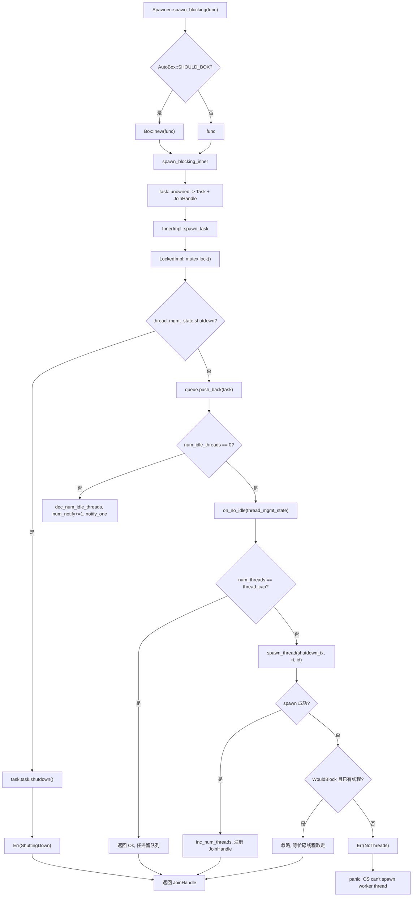
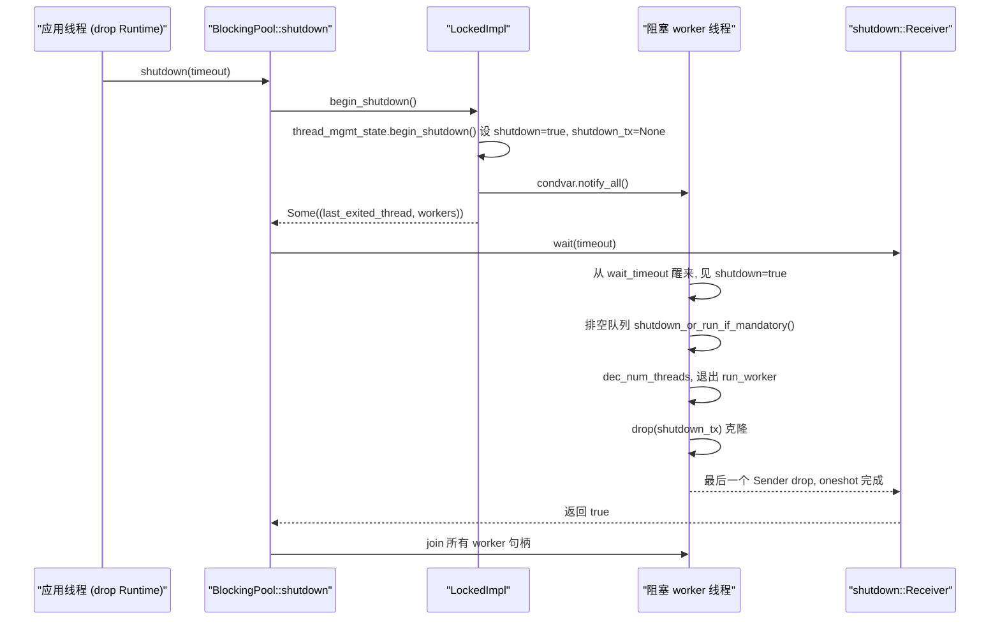

# 第 8 章：阻塞线程池与外部互操作：spawn_blocking 与任务隔离

上一章我们看到，异步 Mutex 和通道之所以能在等待时不占用线程，关键在于把 Waker 存进等待队列，等条件满足后再由唤醒者重新调度任务。但这一切的前提是任务能在 Pending 时主动让出线程。一旦代码调用 std::fs::read、libsqlite3 或纯 CPU 压缩循环，它就会霸占 worker 线程直到返回，期间该线程上的其他任务全部饿死。Tokio 的解法是把这类工作外包给独立的阻塞线程池，并用 block_on 在非异步上下文里驱动 Future。本章拆解这两条边界。

# 8.1 阻塞线程池的内存布局：Inner 与双实现队列

**直觉模型**：`spawn_blocking` 线程池就像餐厅的「外包帮工池」。前台服务员（worker 线程）只负责点单和传菜，遇到需要慢炖的菜就写一张工单丢进后厨的传菜窗口（队列），帮工（阻塞线程）从窗口取单。若没有这个池子，服务员就得亲自下厨，整个餐厅停摆。

**核心结构**。整个池子由 `BlockingPool` 持有，它只存两样东西：一个可克隆的 `Spawner`（投递入口）和一个 `shutdown_rx`（关闭信号接收端）[FACT:tokio/src/runtime/blocking/pool.rs:20-23]。`Spawner` 内部是 `Arc<Inner>`，所有投递者共享同一份状态 [FACT:tokio/src/runtime/blocking/pool.rs:26-28]。

`Inner` 是池子的全部状态，字段值得逐个看 [FACT:tokio/src/runtime/blocking/pool.rs:77-104]：

- `inner_impl: InnerImpl`：队列 + 通知 + 锁拓扑的实现，是一个枚举，有 `Locked` 和 `Sharded` 两个变体 [FACT:tokio/src/runtime/blocking/pool.rs:107-110]。这是本章最关键的抽象——它把「单锁队列」和「分片队列」两种拓扑统一在一个接口下。
- `thread_cap: usize`：线程数上限，即 `max_blocking_threads`。
- `scheduler_threads: usize`：调度器 worker 线程数，用于在指标里扣除，使 `num_blocking_threads` 只统计阻塞线程 [FACT:tokio/src/runtime/blocking/pool.rs:455-460]。
- `keep_alive: Duration`：空闲线程存活时长，默认 `KEEP_ALIVE = 10s` [FACT:tokio/src/runtime/blocking/pool.rs:231]。
- `metrics: SpawnerMetrics`：三个原子计数器——`num_threads`、`num_idle_threads`、`queue_depth` [FACT:tokio/src/runtime/blocking/pool.rs:31-35]。

> **〔设计推断与架构权衡〕**
> **为什么用原子计数器而不是锁内字段？**  `num_idle_threads` 在 `spawn_task` 的热路径上被读取（判断是否需要唤醒空闲线程），如果它藏在 `Mutex` 里，每次投递都要先拿锁再读。把它做成 `MetricAtomicUsize` 后，投递路径可以在不持有队列锁的情况下先做一次快速判断。代价是这些计数与队列状态之间没有原子性保证，因此代码里用 `num_notify` 计数器来补偿——见下文。

**线程管理状态**。`ThreadManagementState` 被单独抽出来，供两种队列实现复用 [FACT:tokio/src/runtime/blocking/pool.rs:135-150]：

- `shutdown: bool`：关闭标志。
- `shutdown_tx: Option<shutdown::Sender>`：每个 worker 线程持有一份克隆，全部 drop 后 `shutdown_rx` 收到通知。
- `last_exiting_thread: Option<JoinHandle<()>>`：上一个超时退出的线程句柄。
- `worker_threads: HashMap<usize, JoinHandle<()>>`：所有存活 worker 的句柄。
- `worker_thread_index: usize`：单调递增的线程 ID 分配器。

`last_exiting_thread` 的设计动机在注释里写得很清楚：超时退出的线程会 join 上一个超时退出的线程，避免 Valgrind 误报 [FACT:tokio/src/runtime/blocking/pool.rs:135-150]。`worker_timed_out` 正是这个链式 join 的实现——它移除自己的句柄，把旧的 `last_exiting_thread` 换出来返回给调用者去 join [FACT:tokio/src/runtime/blocking/pool.rs:172-178]。

**任务封装**。队列里存的是 `Task`，它包了一个 `UnownedTask<BlockingSchedule>` 和一个 `Mandatory` 标志 [FACT:tokio/src/runtime/blocking/pool.rs:187-191]。`Mandatory` 决定关闭时这个任务是被丢弃还是强制执行：`shutdown_or_run_if_mandatory` 在 `NonMandatory` 时调 `shutdown()`，在 `Mandatory` 时调 `run()` [FACT:tokio/src/runtime/blocking/pool.rs:223-228]。这就是 `spawn_blocking`（非强制）与 `spawn_mandatory_blocking`（强制，供 fs 使用）的区别 [FACT:tokio/src/runtime/blocking/pool.rs:233-265]。

**单锁实现的内存布局**。`LockedImpl` 是最原始的拓扑：一个 `Mutex<LockedInner>` 加一个 `Condvar` [FACT:tokio/src/runtime/blocking/pool.rs:113-116]。`LockedInner` 里是 `VecDeque<Task>`、`num_notify: u32` 和 `thread_mgmt_state` [FACT:tokio/src/runtime/blocking/pool.rs:118-124]。注意 `num_notify` 与 `thread_mgmt_state` 在同一个锁下，而 `num_idle_threads` 是锁外的原子量——这种「部分状态在锁内、部分在锁外」的混合布局，正是后面所有并发微妙性的根源。

# 8.2 投递路径：从 spawn_blocking 到线程唤醒

**场景**：异步任务里调用 `tokio::task::spawn_blocking(move || heavy_compute(data))`，此刻发生了什么？

**第一步：装箱决策与任务构造**。`Spawner::spawn_blocking` 先测量闭包大小 `fn_size`，然后根据 `AutoBox::<F>::SHOULD_BOX` 决定是否把闭包 `Box` 起来 [FACT:tokio/src/runtime/blocking/pool.rs:359-389]。这是 Tokio 通用的「大 Future 自动装箱」策略：闭包过大时装箱，避免任务结构体膨胀。

进入 `spawn_blocking_inner`，先分配任务 ID，再用 `blocking_task` 把闭包包成一个 Future，最后用 `task::unowned` 构造出 `UnownedTask` 和 `JoinHandle` [FACT:tokio/src/runtime/blocking/pool.rs:440-449]。注意这里返回的是 `(JoinHandle<R>, Result<(), SpawnError>)` 二元组——句柄和投递结果分开返回。

**第二步：投递结果的三种处理**。回到 `spawn_blocking`，对 `spawn_result` 做匹配 [FACT:tokio/src/runtime/blocking/pool.rs:381-388]：

- `Ok(())`：正常，返回句柄。
- `Err(ShuttingDown)`：**不 panic**，仍然返回句柄。注释说明这是兼容性考虑——句柄永远不会 resolve，但调用方不会因为运行时正在关闭而崩溃。
- `Err(NoThreads(e))`：OS 无法创建线程且池中无人接手，直接 panic。

**第三步：入队与唤醒决策**。`spawn_task` 把 `on_no_idle` 闭包传给 `InnerImpl::spawn_task`，由具体实现决定何时调用它 [FACT:tokio/src/runtime/blocking/pool.rs:462-506]。看 `LockedImpl::spawn_task` 的临界区 [FACT:tokio/src/runtime/blocking/pool.rs:603-639]：

```rust
let mut locked = self.mutex.lock();

if locked.thread_mgmt_state.shutdown {
    task.task.shutdown();
    return Err(SpawnError::ShuttingDown);
}

locked.queue.push_back(task);
metrics.inc_queue_depth();

if metrics.num_idle_threads() == 0 {
    on_no_idle(&mut locked.thread_mgmt_state)?;
} else {
    metrics.dec_num_idle_threads();
    locked.num_notify += 1;
    self.condvar.notify_one();
}
```

这里有两个关键点。其一，关闭检查在入队之前，且即使任务是 `Mandatory` 也直接 `shutdown()`——注释解释：它在关闭开始之后才被调度，所以丢弃是合法的 [FACT:tokio/src/runtime/blocking/pool.rs:614-620]。其二，唤醒决策依赖锁外的 `num_idle_threads`：若为 0，调 `on_no_idle` 尝试起新线程；否则递减空闲计数、递增 `num_notify`、`notify_one`。

**`num_notify` 为什么必须存在？** 因为 `Condvar` 可能产生虚假唤醒（spurious wakeup）。如果只用 `notify_one` 而不计数，一个虚假唤醒的线程会误以为有任务可取，结果发现队列为空又睡回去，而真正被唤醒的线程可能永远收不到通知。`num_notify` 把「合法唤醒」变成可计数的令牌：投递方 `+1`，被唤醒方在 `num_notify != 0` 时才认为唤醒合法并 `-1` [FACT:tokio/src/runtime/blocking/pool.rs:674-684]。

**第四步：起新线程**。`on_no_idle` 闭包在持有队列锁的情况下执行 [FACT:tokio/src/runtime/blocking/pool.rs:462-506]。它先检查 `num_threads == thread_cap`，达到上限就直接返回 `Ok(())`——任务留在队列里等现有线程处理，这就是背压。否则克隆 `shutdown_tx`，调 `spawn_thread` 创建线程，成功后递增 `num_threads`、递增 `worker_thread_index`、把句柄插入 `worker_threads`。

`spawn_thread` 用 `thread::Builder` 设置线程名和栈大小，然后 spawn 一个闭包：进入运行时上下文 `rt.enter()`，调用 `inner.run(id)`，最后 drop `shutdown_tx` [FACT:tokio/src/runtime/blocking/pool.rs:508-528]。

**OS 线程创建失败的容错**。`spawn_thread` 可能失败。代码对错误做了分类 [FACT:tokio/src/runtime/blocking/pool.rs:488-500]：若是 `WouldBlock`（临时性错误，由 `is_temporary_os_thread_error` 判定 [FACT:tokio/src/runtime/blocking/pool.rs:750-752]）且池中已有阻塞线程，则**静默忽略**——任务会被某个当前忙碌的线程最终取走。否则返回 `SpawnError::NoThreads`，最终导致 panic。

用一张控制流图总结投递路径的决策分支：



# 8.3 worker 主循环：BUSY/IDLE 状态机与超时回收

**直觉模型**：每个阻塞线程就是一个「待命帮工」。有单时连续干活（BUSY），没单时打盹（IDLE），打盹超过 `keep_alive` 就下班（超时退出）。若没有超时回收，池子会永久保留峰值时创建的所有线程，浪费内存与内核调度开销。

**主循环结构**。`LockedImpl::run_worker` 是一个 `'main` 循环，内部交替处于 BUSY 和 IDLE 两个阶段 [FACT:tokio/src/runtime/blocking/pool.rs:642-735]。注意：这里的 BUSY/IDLE 是循环内的**阶段**，不是显式枚举状态，所以下面用流程图而非状态图描述。

**BUSY 阶段**：内层 `while let Some(task) = locked.queue.pop_front()` 不断取任务 [FACT:tokio/src/runtime/blocking/pool.rs:655-661]。取到后递减 `queue_depth`，**drop 锁**，执行 `task.run()`，再重新拿锁。drop 锁这一步至关重要——阻塞任务可能跑很久，绝不能持锁执行。

**IDLE 阶段**：队列空了，递增 `num_idle_threads`，设 `is_counted_idle = true`，然后进入等待循环 [FACT:tokio/src/runtime/blocking/pool.rs:663-696]。核心是 `condvar.wait_timeout(locked, keep_alive)`，返回后检查三件事：

1. `num_notify != 0`：合法唤醒。递减 `num_notify`，设 `is_counted_idle = false`（因为投递方已经递减过 `num_idle_threads` 了），break 回 BUSY [FACT:tokio/src/runtime/blocking/pool.rs:674-684]。

2. 未关闭且超时：调 `worker_timed_out` 拿到上一个退出线程的句柄，`break 'main` 退出循环 [FACT:tokio/src/runtime/blocking/pool.rs:689-693]。

3. 否则是虚假唤醒，继续等待。

**关闭时的队列排空**。若 `thread_mgmt_state.shutdown` 为真，进入排空逻辑 [FACT:tokio/src/runtime/blocking/pool.rs:698-710]：逐个弹出任务，drop 锁，调 `task.shutdown_or_run_if_mandatory()`——非强制任务被丢弃，强制任务照常执行。然后 break 退出主循环。

**退出清理**。线程退出前递减 `num_threads` [FACT:tokio/src/runtime/blocking/pool.rs:714]。若 `is_counted_idle` 为真，还要递减 `num_idle_threads`，并用 `assert_ne!(prev_idle, 0)` 断言没有下溢 [FACT:tokio/src/runtime/blocking/pool.rs:716-726]。这个断言是调试期的护栏：一旦 `num_idle_threads` 记账出错，这里会立刻 panic 而不是让错误静默传播。

最后，若正在关闭且 `num_threads == 0`（最后一个线程），`notify_one` 唤醒可能在等待的关闭发起者 [FACT:tokio/src/runtime/blocking/pool.rs:728-730]。返回 `join_on_thread`，由 `Inner::run` 在退出前 join [FACT:tokio/src/runtime/blocking/pool.rs:755-771]。

**关闭握手**。`BlockingPool::shutdown` 先调 `begin_shutdown` 拿到所有 worker 句柄 [FACT:tokio/src/runtime/blocking/pool.rs:310-312]。`LockedImpl::begin_shutdown` 设置关闭标志、drop `shutdown_tx`、`notify_all` 唤醒所有等待线程 [FACT:tokio/src/runtime/blocking/pool.rs:740-745]。然后 `shutdown_rx.wait(timeout)` 阻塞等待 [FACT:tokio/src/runtime/blocking/pool.rs:324]。

`shutdown::Receiver::wait` 的实现很讲究 [FACT:tokio/src/runtime/blocking/shutdown.rs:37-70]：先处理 `timeout == 0` 的快速路径直接返回 false；再调 `try_enter_blocking_region()` 进入阻塞区域，若失败且当前正在 panic 则返回 false，否则 panic 并给出「不能在异步上下文中 drop runtime」的提示 [FACT:tokio/src/runtime/blocking/shutdown.rs:44-57]。最后根据 timeout 调 `block_on_timeout` 或 `block_on` 驱动那个 oneshot。

`shutdown_tx` 的机制是：每个 worker 线程持有一份 `Arc<oneshot::Sender<()>>` 的克隆 [FACT:tokio/src/runtime/blocking/shutdown.rs:12-14]。所有线程退出后，所有克隆被 drop，`Arc` 计数归零，`oneshot::Sender` 被 drop，`Receiver` 收到通知。这就是「所有 Sender drop 后 Receiver 被唤醒」的经典模式。



# 8.4 block_on：在非异步上下文驱动 Future

**直觉模型**：`block_on` 是运行时的「正门」。它把当前线程变成临时的执行器，反复 poll 传入的 Future 直到完成。若没有它，`main` 函数就无法启动任何异步代码。

**入口与装箱**。`Runtime::block_on` 同样先测大小、按 `SHOULD_BOX` 决定是否 `Box::pin`，然后进 `block_on_inner` [FACT:tokio/src/runtime/runtime.rs:343-350]。`block_on_inner` 里有两段条件编译的 trace 包装（taskdump 和 tracing），然后 `self.enter()` 进入运行时上下文，最后按调度器类型分派 [FACT:tokio/src/runtime/runtime.rs:353-383]：

```rust
let _enter = self.enter();

match &self.scheduler {
    Scheduler::CurrentThread(exec) => exec.block_on(&self.handle.inner, future),
    Scheduler::MultiThread(exec) => exec.block_on(&self.handle.inner, future),
}
```

两种调度器的 `block_on` 语义不同，文档里说得很清楚 [FACT:tokio/src/runtime/runtime.rs:302-320]：

- **多线程调度器**：Future 在 I/O 驱动和定时器上下文中运行，`block_on` 返回后已 spawn 的任务继续运行。
- **当前线程调度器**：`block_on` 可以被多个线程并发调用，第一个调用者取得 I/O 和定时器驱动的所有权，其他线程「钩入」它。第一个 `block_on` 完成后，其他线程可以「偷走」驱动。`block_on` 返回后已 spawn 的任务被挂起，再次调用 `block_on` 会恢复它们。

**关键限制：不能在异步上下文中调用**。文档明确 `block_on` 在异步执行上下文中调用会 panic [FACT:tokio/src/runtime/runtime.rs:321-324]。原因很直接：`block_on` 会阻塞当前线程直到 Future 完成，若当前线程本身是某个 worker 线程，就会阻塞整个执行器——这正是 `spawn_blocking` 要解决的问题，所以两者互斥。

**关闭路径**。`Runtime::drop` 按调度器类型分派 [FACT:tokio/src/runtime/runtime.rs:506-521]：当前线程调度器需要先 `try_set_current` 进入上下文再 shutdown（保证任务在运行时上下文中被 drop）；多线程调度器直接 shutdown（worker 线程本身已在上下文中）。`shutdown_timeout` 先关调度器再关阻塞池 [FACT:tokio/src/runtime/runtime.rs:457-461]，`shutdown_background` 等价于 `shutdown_timeout(Duration::from_nanos(0))` [FACT:tokio/src/runtime/runtime.rs:494-496]。

# 设计思考、错误恢复与生产踩坑

**为什么 `spawn_blocking` 的 `ShuttingDown` 不 panic？** [FACT:tokio/src/runtime/blocking/pool.rs:383-384] 注释说是兼容性考虑。`spawn_blocking` 返回 `JoinHandle` 而非 `Result`，若在关闭时 panic，会让「运行时正在关闭」这个可预期状态变成崩溃。返回一个永不 resolve 的句柄，调用方 `await` 时会一直挂起——但此时运行时已关闭，整个 `block_on` 也会退出，所以实际不会永久泄漏。

**`max_blocking_threads` 的背压语义**。默认值很大（512），因为 `spawn_blocking` 常用于文件 I/O。但文档警告：跑 CPU 密集任务时要用信号量限制并发，否则会创建大量线程 [FACT:tokio/src/task/blocking.rs:94-100]。达到上限后任务在队列里排队，形成背压——但注意这个背压只作用于阻塞池，不会反压到异步调度器。

**`spawn_blocking` 不可取消**。文档明确：`abort` 对已开始运行的阻塞任务无效，任务会继续跑完 [FACT:tokio/src/task/blocking.rs:106-120]。只有尚未开始的任务可能被 abort 阻止。关闭时运行时会等待所有已开始的阻塞任务，`shutdown_timeout` 超时后会泄漏这些线程。

**`num_idle_threads` 的记账陷阱**。`is_counted_idle` 标志的存在说明这个计数很容易出错。投递方在唤醒时递减 `num_idle_threads`，被唤醒方看到 `num_notify != 0` 后设 `is_counted_idle = false`，避免重复递减 [FACT:tokio/src/runtime/blocking/pool.rs:679-682]。若这条路径有 bug，`assert_ne!(prev_idle, 0)` 会在退出时 panic [FACT:tokio/src/runtime/blocking/pool.rs:722-725]。生产环境若见到「`num_idle_threads` underflowed on thread exit」，说明池子的记账逻辑被破坏。

> **〔设计推断与架构权衡〕**
> **`last_exiting_thread` 链式 join 的代价**。超时退出的线程会 join 上一个超时退出的线程 [FACT:tokio/src/runtime/blocking/pool.rs:172-178]。这形成一个 join 链：每个退出的线程都要等前一个真正结束。在高频创建/销毁阻塞线程的场景下，这条链可能变长，导致线程退出延迟累积。 这是为了避免 Valgrind 误报而做的权衡，正常生产环境影响有限，但在线程频繁超时的负载下值得关注。

**`InnerImpl` 枚举抽象的意义**。注释说明 `Locked` 变体的行为与重构前完全一致，而 `Sharded` 变体为未来的并发队列预留了对称的槽位 [FACT:tokio/src/runtime/blocking/pool.rs:537-539]。`spawn_task`、`run_worker`、`begin_shutdown` 三个方法都通过枚举分派 [FACT:tokio/src/runtime/blocking/pool.rs:548-582]。这种「枚举分派 + 每变体自持临界区」的设计，使得新增队列拓扑时不需要改动调用方。

# 本章小结

本章拆解了 Tokio 容纳同步代码的两条边界。`spawn_blocking` 把闭包投递到独立的阻塞线程池：`Inner` 持有队列、线程上限、存活时长与原子指标；`LockedImpl` 用单锁 + `Condvar` 实现队列，`num_notify` 计数器补偿虚假唤醒；worker 在 BUSY/IDLE 间循环，空闲超时后链式 join 退出；`max_blocking_threads` 达到上限后任务排队形成背压。`block_on` 则在非异步上下文驱动 Future，多线程与当前线程调度器语义不同，且严禁在异步上下文中调用。关闭路径通过 `shutdown_tx` 的 `Arc` 计数归零触发 `oneshot`，实现「所有 worker 退出后唤醒关闭发起者」的握手。

# 本章思考与自测

Q1: 若把 `LockedImpl::spawn_task` 中 `if metrics.num_idle_threads() == 0` 的判断改成恒为真（即每次都调 `on_no_idle`），在高并发投递场景下会发生什么？为什么？

**参考解析**：`on_no_idle` 会检查 `num_threads == thread_cap`，未达上限就创建新线程 [FACT:tokio/src/runtime/blocking/pool.rs:471-487]。若判断恒为真，即使有空闲线程也会尝试起新线程，导致线程数迅速冲到 `thread_cap`。更严重的是，空闲线程不会被 `notify_one` 唤醒（因为走了 `on_no_idle` 分支而非 `else` 分支的 `num_notify += 1; notify_one` [FACT:tokio/src/runtime/blocking/pool.rs:627-636]），队列里的任务可能无人处理，直到某个新线程启动后才发现队列非空。这会造成「线程爆满但任务仍排队」的假死状态。原判断的意义正是：有空闲线程时优先唤醒它们，避免无谓的线程创建。

Q2: `LockedImpl::run_worker` 在 BUSY 阶段执行 `task.run()` 前会 `drop(locked)` [FACT:tokio/src/runtime/blocking/pool.rs:657-658]。如果去掉这个 `drop`，在什么场景下会触发死锁？

**参考解析**：`task.run()` 执行的是用户闭包，闭包内部完全可能再次调用 `spawn_blocking` 投递新任务。投递路径 `LockedImpl::spawn_task` 第一件事就是 `self.mutex.lock()` [FACT:tokio/src/runtime/blocking/pool.rs:612]。若 worker 持锁执行闭包，闭包内的投递就会尝试获取同一把锁，而 `std::sync::Mutex` 不可重入，直接死锁。此外，持锁执行长任务会阻塞所有其他投递者和 worker 的取任务操作，即使不死锁也会让整个池子串行化。`drop(locked)` 是必须的。

Q3: `shutdown::Receiver::wait` 在 `try_enter_blocking_region()` 失败且当前正在 panic 时返回 false，否则 panic [FACT:tokio/src/runtime/blocking/shutdown.rs:44-57]。为什么要在 panic 时特殊处理？如果去掉这个分支，在什么场景下会出问题？

**参考解析**：`try_enter_blocking_region` 失败意味着当前处于异步上下文，不允许阻塞。正常情况下应 panic 提示用户「不能在异步上下文中 drop runtime」。但如果当前线程已经在 panic（`std::thread::panicking()` 为真），再 panic 会导致双重 panic，Rust 默认行为是直接 abort 进程。场景：用户在异步任务里 drop 一个 Runtime，而该任务本身因为其他原因正在 panic，此时 drop 触发的 shutdown 会二次 panic。返回 false 让 shutdown 放弃等待，避免进程 abort，给用户保留看到原始 panic 信息的机会。这是「panic 安全」的典型处理。

阻塞线程池与 block_on 划定了异步运行时的能力边界：前者把无法让出线程的工作隔离到专用线程，后者让非异步入口也能驱动 Future。但这两条边界在代码里往往不是手写的——下一章我们将进入宏的世界，看看 #[tokio::main]、select! 和 join! 如何在编译期生成这些运行时代码。
