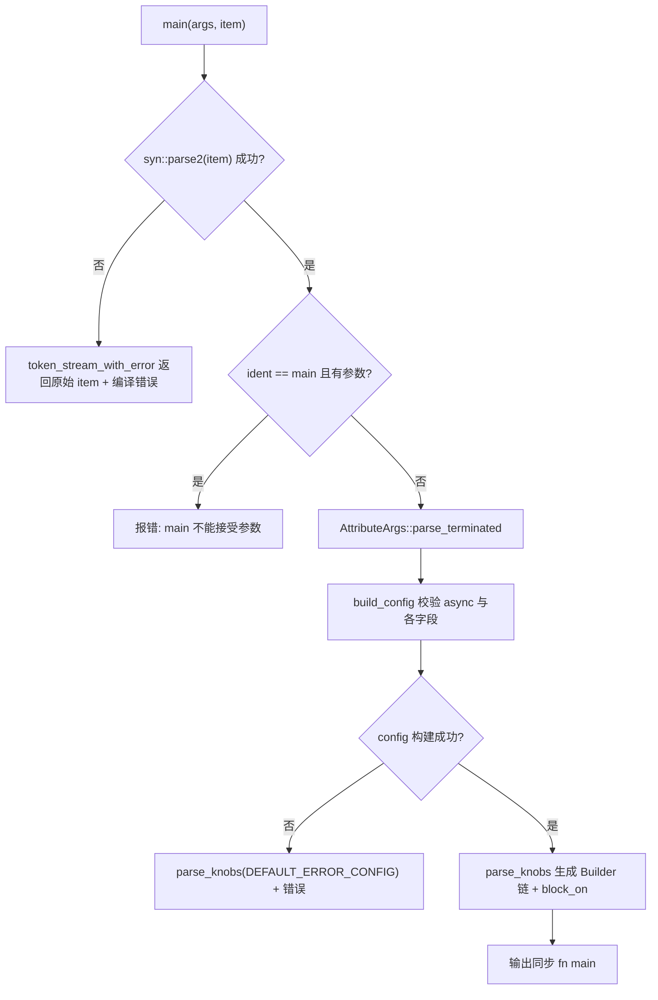
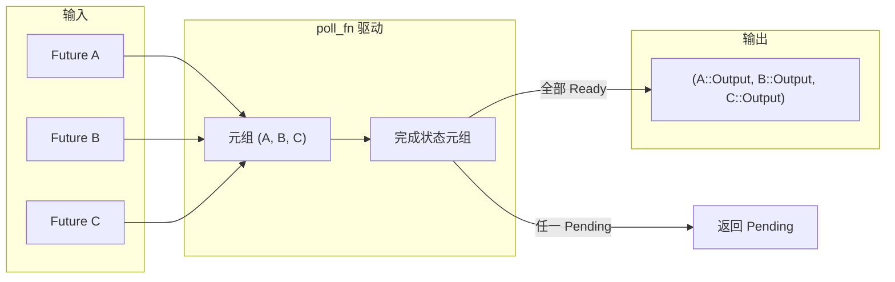

# 第 9 章：协作式调度预算：coop 机制如何防止异步任务饥饿

上一章我们看到 `block_on` 与阻塞线程池如何划定异步运行时的能力边界，而用户几乎从不手写这些边界——他们写 `#[tokio::main]`、`select!`、`join!`，让宏在编译期把这些样板代码铺开。宏是 Tokio 给用户的第一层糖衣，也是编译期真正生成运行时代码的地方。本章聚焦 `tokio-macros` crate 与 `tokio/src/macros/select.rs`，拆解三条最常用的宏展开路径，重点回答一个问题：宏展开后，真实的调用链长什么样，以及为什么 `select!` 的取消安全语义必须单独警惕。

# 9.1 #[tokio::main]：把 async fn 改写成 Runtime::block_on

**直觉模型**：`#[tokio::main]` 就像一张「装修委托书」。你交出一间毛坯房（`async fn main`），它替你铺好水电（构建 Runtime）、装好门窗（`enable_all`），最后把你原本的家具（函数体）搬进去。若没有它，每个 `main` 都得手写 `Builder::new_multi_thread().enable_all().build().unwrap().block_on(...)`，样板代码会淹没业务逻辑。

## 数据结构与内存布局

宏本身不产生运行时数据结构，但它解析出的配置被装进两个结构体。`Configuration` 是「解析期的可变累加器」，字段全是 `Option`，因为属性参数可能缺省、可能重复、可能非法 [FACT:tokio-macros/src/entry.rs:74-84](https://github.com/tokio-rs/tokio/blob/e800714ad714f1d996ddd56265b550d879349c0a/tokio-macros/src/entry.rs#L74-L84)。注意 `worker_threads`、`start_paused`、`unhandled_panic` 都带 `Span`——这是为了在报错时把错误定位到用户写的那一行，而不是宏内部 [FACT:tokio-macros/src/entry.rs:74-84](https://github.com/tokio-rs/tokio/blob/e800714ad714f1d996ddd56265b550d879349c0a/tokio-macros/src/entry.rs#L74-L84)。`FinalConfig` 则是「校验后的不可变结果」，`flavor` 不再是 `Option`，因为 `build()` 已经用 `default_flavor` 兜底 [FACT:tokio-macros/src/entry.rs:55-62](https://github.com/tokio-rs/tokio/blob/e800714ad714f1d996ddd56265b550d879349c0a/tokio-macros/src/entry.rs#L55-L62)。

`RuntimeFlavor` 只有三个变体：`CurrentThread`、`Threaded`、`Local` [FACT:tokio-macros/src/entry.rs:10-14](https://github.com/tokio-rs/tokio/blob/e800714ad714f1d996ddd56265b550d879349c0a/tokio-macros/src/entry.rs#L10-L14)。`from_str` 里特意为历史遗留名字给出友好报错：`single_thread` 提示应叫 `current_thread`，`basic_scheduler` 提示已改名，`threaded_scheduler` 提示已改名 [FACT:tokio-macros/src/entry.rs:17-27](https://github.com/tokio-rs/tokio/blob/e800714ad714f1d996ddd56265b550d879349c0a/tokio-macros/src/entry.rs#L17-L27)。这是宏作为「用户第一接触面」的典型设计：错误信息即文档。

## Step-by-Step 展开流程

代入场景：用户写下 `#[tokio::main(flavor = "multi_thread", worker_threads = 4)] async fn main() { ... }`。

第一步，`main` 入口先解析 item 为自定义的 `ItemFn` [FACT:tokio-macros/src/entry.rs:577-580](https://github.com/tokio-rs/tokio/blob/e800714ad714f1d996ddd56265b550d879349c0a/tokio-macros/src/entry.rs#L577-L580)。这个 `ItemFn` 不是 `syn::ItemFn`，而是 Tokio 自己实现的解析器，原因写在注释里：它不想递归解析整条语句，只做「按 token tree 缓冲、遇到分号切分」的轻量解析 [FACT:tokio-macros/src/entry.rs:720-764](https://github.com/tokio-rs/tokio/blob/e800714ad714f1d996ddd56265b550d879349c0a/tokio-macros/src/entry.rs#L720-L764)。这避免了在宏里对函数体做完整 AST 构建的开销。

第二步，`build_config` 校验 `async` 关键字是否存在，缺失则报 "the `async` keyword is missing" [FACT:tokio-macros/src/entry.rs:346-349](https://github.com/tokio-rs/tokio/blob/e800714ad714f1d996ddd56265b550d879349c0a/tokio-macros/src/entry.rs#L346-L349)。随后遍历属性参数，把 `worker_threads`、`flavor`、`start_paused`、`crate`、`unhandled_panic`、`name` 分派到对应 setter [FACT:tokio-macros/src/entry.rs:369-399](https://github.com/tokio-rs/tokio/blob/e800714ad714f1d996ddd56265b550d879349c0a/tokio-macros/src/entry.rs#L369-L399)。注意 `core_threads` 被显式拒绝并提示已改名 [FACT:tokio-macros/src/entry.rs:379-382](https://github.com/tokio-rs/tokio/blob/e800714ad714f1d996ddd56265b550d879349c0a/tokio-macros/src/entry.rs#L379-L382)。

第三步，`Configuration::build` 做跨字段一致性校验。这里有三条关键约束：`worker_threads` 只允许 `multi_thread` [FACT:tokio-macros/src/entry.rs:197-217](https://github.com/tokio-rs/tokio/blob/e800714ad714f1d996ddd56265b550d879349c0a/tokio-macros/src/entry.rs#L197-L217)；`start_paused` 只允许 `current_thread`/`local` [FACT:tokio-macros/src/entry.rs:219-229](https://github.com/tokio-rs/tokio/blob/e800714ad714f1d996ddd56265b550d879349c0a/tokio-macros/src/entry.rs#L219-L229)；`unhandled_panic` 同样只允许 `current_thread`/`local` [FACT:tokio-macros/src/entry.rs:231-241](https://github.com/tokio-rs/tokio/blob/e800714ad714f1d996ddd56265b550d879349c0a/tokio-macros/src/entry.rs#L231-L241)。若用户选了 `multi_thread` 但 `rt-multi-thread` feature 未开，报错信息会根据是否显式指定 flavor 而不同 [FACT:tokio-macros/src/entry.rs:209-216](https://github.com/tokio-rs/tokio/blob/e800714ad714f1d996ddd56265b550d879349c0a/tokio-macros/src/entry.rs#L209-L216)。

第四步，`parse_knobs` 生成代码。它先抹掉 `asyncness` [FACT:tokio-macros/src/entry.rs:441](https://github.com/tokio-rs/tokio/blob/e800714ad714f1d996ddd56265b550d879349c0a/tokio-macros/src/entry.rs#L441)，然后根据 flavor 选择 builder 起点：`CurrentThread`/`Local` 用 `Builder::new_current_thread()`，`Threaded` 用 `Builder::new_multi_thread()` [FACT:tokio-macros/src/entry.rs:468-477](https://github.com/tokio-rs/tokio/blob/e800714ad714f1d996ddd56265b550d879349c0a/tokio-macros/src/entry.rs#L468-L477)。`Local` 特殊之处在于 build 调用是 `build_local(Default::default())` 而非 `build()` [FACT:tokio-macros/src/entry.rs:479-483](https://github.com/tokio-rs/tokio/blob/e800714ad714f1d996ddd56265b550d879349c0a/tokio-macros/src/entry.rs#L479-L483)。随后按需链式追加 `.worker_threads(#v)`、`.start_paused(#v)`、`.unhandled_panic(...)`、`.name(#v)` [FACT:tokio-macros/src/entry.rs:485-497](https://github.com/tokio-rs/tokio/blob/e800714ad714f1d996ddd56265b550d879349c0a/tokio-macros/src/entry.rs#L485-L497)。

第五步，生成最终函数体。核心是 `last_block`：`return #rt.enable_all().#build.expect("Failed building the Runtime").block_on(body)` [FACT:tokio-macros/src/entry.rs:509-522](https://github.com/tokio-rs/tokio/blob/e800714ad714f1d996ddd56265b550d879349c0a/tokio-macros/src/entry.rs#L509-L522)。注意那个显式 `return`，注释指向 tokio-rs/tokio#4636，是为了修复类型推断问题 [FACT:tokio-macros/src/entry.rs:508](https://github.com/tokio-rs/tokio/blob/e800714ad714f1d996ddd56265b550d879349c0a/tokio-macros/src/entry.rs#L508)。

第六步，函数体被包成 `async #body` 并做类型检查。非 test 路径下，若返回类型不是 `!` 且不含 `impl Trait`，会插入 `if false { let _: &dyn Future<Output = #output_type> = &body; }` 做编译期断言 [FACT:tokio-macros/src/entry.rs:551-571](https://github.com/tokio-rs/tokio/blob/e800714ad714f1d996ddd56265b550d879349c0a/tokio-macros/src/entry.rs#L551-L571)。test 路径则用 `pin!` 把 body 钉在栈上并转成 `Pin<&mut dyn Future>`，注释解释这是为了减少 `block_on` 泛型实例化的编译开销 [FACT:tokio-macros/src/entry.rs:526-548](https://github.com/tokio-rs/tokio/blob/e800714ad714f1d996ddd56265b550d879349c0a/tokio-macros/src/entry.rs#L526-L548)。



## 设计思考与生产踩坑

`main` 与 `test` 共享 `parse_knobs`，但默认 flavor 不同：`test` 默认 `CurrentThread`，`main` 默认 `Threaded` [FACT:tokio-macros/src/entry.rs:91-94](https://github.com/tokio-rs/tokio/blob/e800714ad714f1d996ddd56265b550d879349c0a/tokio-macros/src/entry.rs#L91-L94)。这解释了为什么 `#[tokio::test]` 默认单线程——测试通常不需要多核，且单线程更容易复现。

一个容易被忽略的坑：宏展开后每次调用函数都会新建 Runtime。文档明确警告，若函数被频繁调用，应改用 Builder 复用 Runtime [FACT:tokio-macros/src/lib.rs:31-35](https://github.com/tokio-rs/tokio/blob/e800714ad714f1d996ddd56265b550d879349c0a/tokio-macros/src/lib.rs#L31-L35)。把 `#[tokio::main]` 用在普通函数上是合法的，但每次调用都付一次 Runtime 构建成本。

另一个坑是 `crate` 重命名。当用户 `use tokio as tokio1` 时，宏内部默认生成的 `tokio::runtime::Builder` 会找不到路径，必须显式 `crate = "tokio1"` [FACT:tokio-macros/src/lib.rs:239-264](https://github.com/tokio-rs/tokio/blob/e800714ad714f1d996ddd56265b550d879349c0a/tokio-macros/src/lib.rs#L239-L264)。`parse_knobs` 里 `crate_path` 的默认值是 `Ident::new("tokio", ...)` [FACT:tokio-macros/src/entry.rs:456-462](https://github.com/tokio-rs/tokio/blob/e800714ad714f1d996ddd56265b550d879349c0a/tokio-macros/src/entry.rs#L456-L462)，这正是重命名场景报错的根源。

# 9.2 select!：多分支轮询、位掩码与随机公平性

**直觉模型**：`select!` 像一位「同时盯多个取餐窗口的服务员」。哪个窗口先出餐，他就端走哪份，其余窗口的排队作废。若没有它，用户得手写 `poll_fn` 把多个 Future 塞进一个元组逐个 poll，还要自己处理「某个分支就绪后其余分支该丢弃」的逻辑。

## 数据结构与内存布局

`select!` 展开后生成一个局部模块 `__tokio_select_util`，里面有一个枚举 `Out` 和一个类型别名 `Mask` [FACT:tokio/src/macros/select.rs:615-619](https://github.com/tokio-rs/tokio/blob/e800714ad714f1d996ddd56265b550d879349c0a/tokio/src/macros/select.rs#L615-L619)。`Out` 的变体名是 `_0`、`_1`……每个分支一个，外加一个 `Disabled` 表示所有分支都失效 [FACT:tokio-macros/src/select.rs:33-39](https://github.com/tokio-rs/tokio/blob/e800714ad714f1d996ddd56265b550d879349c0a/tokio-macros/src/select.rs#L33-L39)。`Mask` 的底层类型按分支数动态选择：≤8 用 `u8`，≤16 用 `u16`，≤32 用 `u32`，≤64 用 `u64`，超过 64 直接 panic [FACT:tokio-macros/src/select.rs:17-31](https://github.com/tokio-rs/tokio/blob/e800714ad714f1d996ddd56265b550d879349c0a/tokio-macros/src/select.rs#L17-L31)。这个位掩码是 `select!` 的核心状态：第 i 位为 1 表示第 i 个分支已被禁用。

所有 Future 被存进一个元组 `futures`，每个元素先经 `IntoFuture::into_future` 转换 [FACT:tokio/src/macros/select.rs:654-656](https://github.com/tokio-rs/tokio/blob/e800714ad714f1d996ddd56265b550d879349c0a/tokio/src/macros/select.rs#L654-L656)。注意这里先构造 `futures_init` 再逐个 `into_future`，注释解释这是为了利用临时生命周期延长 [FACT:tokio/src/macros/select.rs:641-646](https://github.com/tokio-rs/tokio/blob/e800714ad714f1d996ddd56265b550d879349c0a/tokio/src/macros/select.rs#L641-L646)。随后 `let mut futures = &mut futures;` 把元组降级为可变引用，避免 `poll_fn` 闭包夺取所有权 [FACT:tokio/src/macros/select.rs:658-662](https://github.com/tokio-rs/tokio/blob/e800714ad714f1d996ddd56265b550d879349c0a/tokio/src/macros/select.rs#L658-L662)。

## Step-by-Step 轮询流程

代入场景：`select! { v = stream1.next() => ..., v = stream2.next() => ..., else => break }`。

第一步，宏入口规则匹配。若有 `biased;` 前缀，`start=0` [FACT:tokio/src/macros/select.rs:801-803](https://github.com/tokio-rs/tokio/blob/e800714ad714f1d996ddd56265b550d879349c0a/tokio/src/macros/select.rs#L801-L803)；否则 `start` 是一个随机表达式 `thread_rng_n(BRANCHES)` [FACT:tokio/src/macros/select.rs:805-809](https://github.com/tokio-rs/tokio/blob/e800714ad714f1d996ddd56265b550d879349c0a/tokio/src/macros/select.rs#L805-L809)。这就是文档所说的「默认随机挑选分支先检查」的公平性来源 [FACT:tokio/src/macros/select.rs:61-65](https://github.com/tokio-rs/tokio/blob/e800714ad714f1d996ddd56265b550d879349c0a/tokio/src/macros/select.rs#L61-L65)。

第二步，归一化。tt-muncher 把每个分支规整成 `(skip) pat = fut, if cond => handler,` 形式，`skip` 是一串 `_`，长度等于该分支之前的 branch 数 [FACT:tokio/src/macros/select.rs:770-793](https://github.com/tokio-rs/tokio/blob/e800714ad714f1d996ddd56265b550d879349c0a/tokio/src/macros/select.rs#L770-L793)。`skip` 既用于生成元组字段访问 `futures_init.$($skip)*`，也用于 `count!` 算出分支索引。

第三步，前置条件求值。对每个分支的 `if $c`，若为 false，则 `disabled |= 1 << index` [FACT:tokio/src/macros/select.rs:631-636](https://github.com/tokio-rs/tokio/blob/e800714ad714f1d996ddd56265b550d879349c0a/tokio/src/macros/select.rs#L631-L636)。注意：即使分支被禁用，其 `$fut` 表达式仍会被求值，只是不会被 poll [FACT:tokio/src/macros/select.rs:39-41](https://github.com/tokio-rs/tokio/blob/e800714ad714f1d996ddd56265b550d879349c0a/tokio/src/macros/select.rs#L39-L41)。

第四步，进入 `poll_fn` 闭包。先检查协作预算：`ready!(poll_budget_available(cx))`，预算耗尽直接返回 `Pending` [FACT:tokio/src/macros/select.rs:664-667](https://github.com/tokio-rs/tokio/blob/e800714ad714f1d996ddd56265b550d879349c0a/tokio/src/macros/select.rs#L664-L667)。这保证 `select!` 不会霸占 worker。

第五步，循环 `for i in 0..BRANCHES`，`branch = (start + i) % BRANCHES` [FACT:tokio/src/macros/select.rs:680-685](https://github.com/tokio-rs/tokio/blob/e800714ad714f1d996ddd56265b550d879349c0a/tokio/src/macros/select.rs#L680-L685)。对每个 branch：先查 `disabled & mask == mask`，已禁用则 `continue` [FACT:tokio/src/macros/select.rs:694-699](https://github.com/tokio-rs/tokio/blob/e800714ad714f1d996ddd56265b550d879349c0a/tokio/src/macros/select.rs#L694-L699)；否则从元组取出该 Future，用 `Pin::new_unchecked` 包一层（安全性依赖 Future 存于栈上且不被移动）[FACT:tokio/src/macros/select.rs:701-707](https://github.com/tokio-rs/tokio/blob/e800714ad714f1d996ddd56265b550d879349c0a/tokio/src/macros/select.rs#L701-L707)；poll 之，`Ready(out)` 则先 `disabled |= mask` 再匹配模式 [FACT:tokio/src/macros/select.rs:710-730](https://github.com/tokio-rs/tokio/blob/e800714ad714f1d996ddd56265b550d879349c0a/tokio/src/macros/select.rs#L710-L730)。

第六步，模式匹配。若 `out` 匹配 `$bind`，返回 `Poll::Ready(Out::_i(out))` [FACT:tokio/src/macros/select.rs:727-733](https://github.com/tokio-rs/tokio/blob/e800714ad714f1d996ddd56265b550d879349c0a/tokio/src/macros/select.rs#L727-L733)；若不匹配，`continue` 继续轮询其他分支——这正是文档步骤 5 所说的「模式不匹配则禁用当前分支」[FACT:tokio/src/macros/select.rs:44-47](https://github.com/tokio-rs/tokio/blob/e800714ad714f1d996ddd56265b550d879349c0a/tokio/src/macros/select.rs#L44-L47)。

第七步，循环结束。若 `is_pending` 为真返回 `Pending`，否则所有分支都失效，返回 `Out::Disabled` [FACT:tokio/src/macros/select.rs:740-745](https://github.com/tokio-rs/tokio/blob/e800714ad714f1d996ddd56265b550d879349c0a/tokio/src/macros/select.rs#L740-L745)。外层 `match output` 把 `Out::_i` 映射到对应 handler，`Disabled` 映射到 `else` 表达式 [FACT:tokio/src/macros/select.rs:749-755](https://github.com/tokio-rs/tokio/blob/e800714ad714f1d996ddd56265b550d879349c0a/tokio/src/macros/select.rs#L749-L755)。

```mermaid
flowchart TD
    start["poll_fn 闭包被调用"] --> budget{"poll_budget_available(cx)?"}
    budget -->|否| pending_budget["返回 Pending"]
    budget -->|是| init["is_pending = false; start = $start"]
    init --> loop{"i |否| check_pending{"is_pending?"}
    check_pending -->|是| pending["返回 Pending"]
    check_pending -->|否| disabled_out["返回 Out::Disabled"]
    loop -->|是| branch["branch = (start+i) % BRANCHES"]
    branch --> is_disabled{"disabled & mask == mask?"}
    is_disabled -->|是| next_i["i += 1"]
    is_disabled -->|否| poll_fut["Pin::new_unchecked(fut).poll(cx)"]
    poll_fut --> poll_res{"Poll 结果?"}
    poll_res -->|Pending| set_pending["is_pending = true; i += 1"]
    poll_res -->|Ready| disable["disabled |= mask"]
    disable --> pat_match{"out 匹配 $bind?"}
    pat_match -->|否| next_i
    pat_match -->|是| ready_out["返回 Out::_i(out)"]
    next_i --> loop
    set_pending --> loop
```

## 设计思考与生产踩坑

**为什么用位掩码而不是 `Vec<bool>`？** 位掩码是栈上单个整数，无堆分配，且 `disabled |= mask` 是单条指令。对于热路径上的 `select!`，这避免了每次迭代的堆访问。

**为什么模式不匹配要禁用分支？** 这是 `select!` 与「简单 race」的关键区别。考虑 `Some(v) = stream.next() => ...`，若 `stream.next()` 返回 `None`（流结束），模式不匹配，该分支被永久禁用，避免无限轮询一个已结束的流。文档示例正是靠这个语义收集两个流直到都结束 [FACT:tokio/src/macros/select.rs:198-223](https://github.com/tokio-rs/tokio/blob/e800714ad714f1d996ddd56265b550d879349c0a/tokio/src/macros/select.rs#L198-L223)。

**取消安全的真正含义**：`select!` 一旦某分支就绪，其余分支的 Future 会被 drop。若被 drop 的 Future 已经消费了数据但尚未返回，数据就丢了。文档明确列出 `read_exact`、`read_to_end`、`write_all` 不取消安全 [FACT:tokio/src/macros/select.rs:119-124](https://github.com/tokio-rs/tokio/blob/e800714ad714f1d996ddd56265b550d879349c0a/tokio/src/macros/select.rs#L119-L124)，而 `Mutex::lock`、`Semaphore::acquire` 因为排队公平性，取消会丢失队列位置 [FACT:tokio/src/macros/select.rs:126-133](https://github.com/tokio-rs/tokio/blob/e800714ad714f1d996ddd56265b550d879349c0a/tokio/src/macros/select.rs#L126-L133)。判定方法：找 `.await` 点，若在 `.await` 处重启函数仍正确，则取消安全 [FACT:tokio/src/macros/select.rs:135-139](https://github.com/tokio-rs/tokio/blob/e800714ad714f1d996ddd56265b550d879349c0a/tokio/src/macros/select.rs#L135-L139)。

**`if` 前置条件的竞态陷阱**：文档给了一个经典错误示例——用 `if !sleep.is_elapsed()` 守卫 `sleep` 分支，但 `is_elapsed()` 可能在 `while` 检查与 `select!` 之间变为 true，导致超时被漏掉 [FACT:tokio/src/macros/select.rs:336-376](https://github.com/tokio-rs/tokio/blob/e800714ad714f1d996ddd56265b550d879349c0a/tokio/src/macros/select.rs#L336-L376)。正确写法是去掉 `if`，让 `sleep` 分支始终参与轮询，超时后 `break` [FACT:tokio/src/macros/select.rs:378-405](https://github.com/tokio-rs/tokio/blob/e800714ad714f1d996ddd56265b550d879349c0a/tokio/src/macros/select.rs#L378-L405)。

**`biased;` 的代价**：随机 RNG 有 CPU 成本，且某些场景需要确定的轮询顺序 [FACT:tokio/src/macros/select.rs:67-74](https://github.com/tokio-rs/tokio/blob/e800714ad714f1d996ddd56265b550d879349c0a/tokio/src/macros/select.rs#L67-L74)。但 `biased;` 把公平性责任交给用户：若一个分支永远就绪，后面的分支会饿死 [FACT:tokio/src/macros/select.rs:75-81](https://github.com/tokio-rs/tokio/blob/e800714ad714f1d996ddd56265b550d879349c0a/tokio/src/macros/select.rs#L75-L81)。

# 9.3 join! 与宏展开的工程约束

**直觉模型**：`join!` 像「同时等所有快递都到齐」。它不像 `select!` 那样谁先到就取消其余，而是把所有 Future 的 `Ready` 值聚合成一个元组。若没有它，用户得手写 `poll_fn` 维护每个 Future 的完成状态。

## 数据结构与内存布局

`join!` 的展开同样基于元组存 Future，但状态不是位掩码，而是一个「已完成值」的元组。每个 Future 完成后，其值被取出存入结果元组，对应槽位标记为已完成。与 `select!` 不同，`join!` 不会 drop 未完成的 Future——它必须等所有 Future 都完成才返回。

## Step-by-Step 流程

`join!` 的轮询逻辑与 `select!` 共享「元组存 Future + `poll_fn` 驱动」的骨架，但语义相反：`select!` 是「任一就绪即返回」，`join!` 是「全部就绪才返回」。每轮 poll 遍历所有未完成的 Future，任一返回 `Pending` 则整体 `Pending`，全部 `Ready` 则聚合返回。



## 设计思考与生产踩坑

`join!` 的取消安全语义与 `select!` 不同：`join!` 被 drop 时，所有未完成的 Future 都会被 drop，同样可能丢失数据。但由于 `join!` 不主动取消任何分支，它不会像 `select!` 那样「因为另一个分支就绪而取消本分支」。真正的风险在于 `join!` 整体被外层 `select!` 或超时取消。

`join!` 与 `try_join!` 的区别值得注意：`try_join!` 在任一 Future 返回 `Err` 时立即返回，取消其余 Future，因此它继承了 `select!` 的取消安全风险。

# 设计思考

**宏作为编译期代码生成器的边界**。`#[tokio::main]` 把配置校验放在编译期，非法组合（如 `multi_thread` + `start_paused`）直接编译失败，而不是运行时 panic。这是宏相对 Builder 的核心优势：错误提前。

**声明式宏 + 过程宏的混合架构**。`select!` 的主体是 `macro_rules!`，但两处关键逻辑委托给过程宏：`select_priv_declare_output_enum` 生成 `Out` 枚举和 `Mask` 类型 [FACT:tokio-macros/src/lib.rs:658-660](https://github.com/tokio-rs/tokio/blob/e800714ad714f1d996ddd56265b550d879349c0a/tokio-macros/src/lib.rs#L658-L660)，`select_priv_clean_pattern` 清除模式中的 `ref`/`mut` [FACT:tokio-macros/src/lib.rs:666-668](https://github.com/tokio-rs/tokio/blob/e800714ad714f1d996ddd56265b550d879349c0a/tokio-macros/src/lib.rs#L666-L668)。为什么？注释解释：声明式宏难以生成「按分支数动态选择整数类型」的代码，也难以在模式位置做 token 级清洗 [FACT:tokio/src/macros/select.rs:577-579](https://github.com/tokio-rs/tokio/blob/e800714ad714f1d996ddd56265b550d879349c0a/tokio/src/macros/select.rs#L577-L579)。

**`clean_pattern` 的必要性**。`select!` 把 `out` 以 `&out` 形式匹配模式 [FACT:tokio/src/macros/select.rs:727](https://github.com/tokio-rs/tokio/blob/e800714ad714f1d996ddd56265b550d879349c0a/tokio/src/macros/select.rs#L727)，若用户写 `ref v`，会变成 `&ref v` 导致类型错误。`clean_pattern` 递归删除 `by_ref`、`mutability`，以及 `Reference` 模式的 `mutability` [FACT:tokio-macros/src/select.rs:68-73](https://github.com/tokio-rs/tokio/blob/e800714ad714f1d996ddd56265b550d879349c0a/tokio-macros/src/select.rs#L68-L73)[FACT:tokio-macros/src/select.rs:100-103](https://github.com/tokio-rs/tokio/blob/e800714ad714f1d996ddd56265b550d879349c0a/tokio-macros/src/select.rs#L100-L103)。这是宏在「用户直觉」与「借用检查器」之间做的妥协。

**64 分支上限的工程现实**。`count!`、`count_field!`、`select_variant!` 三个宏各自手写了 0 到 64 的匹配规则 [FACT:tokio/src/macros/select.rs:821-1017](https://github.com/tokio-rs/tokio/blob/e800714ad714f1d996ddd56265b550d879349c0a/tokio/src/macros/select.rs#L821-L1017)[FACT:tokio/src/macros/select.rs:1021-1217](https://github.com/tokio-rs/tokio/blob/e800714ad714f1d996ddd56265b550d879349c0a/tokio/src/macros/select.rs#L1021-L1217)[FACT:tokio/src/macros/select.rs:1221-1414](https://github.com/tokio-rs/tokio/blob/e800714ad714f1d996ddd56265b550d879349c0a/tokio/src/macros/select.rs#L1221-L1414)。注释直言「I'm not happy about it either」[FACT:tokio/src/macros/select.rs:816-817](https://github.com/tokio-rs/tokio/blob/e800714ad714f1d996ddd56265b550d879349c0a/tokio/src/macros/select.rs#L816-L817)。这是声明式宏无法做算术的代价：只能用 token 数量硬编码映射到整数。

# 本章小结

# 本章思考与自测

Q1: `select!` 的 `disabled` 位掩码在每次进入 `select!` 时都重新初始化为 `Default::default()` [FACT:tokio/src/macros/select.rs:627](https://github.com/tokio-rs/tokio/blob/e800714ad714f1d996ddd56265b550d879349c0a/tokio/src/macros/select.rs#L627)。如果把这一行移到 `poll_fn` 闭包内部，在「循环调用 select! 且某分支模式不匹配」的场景下会发生什么？

**参考解析**：`disabled` 若在闭包内初始化，每次 poll 都会重置，导致上一轮因模式不匹配被禁用的分支重新参与轮询。考虑 `Some(v) = stream.next() => ...` 且 `stream` 已结束（返回 `None`），模式不匹配后该分支本应永久禁用。若 `disabled` 被重置，下一轮 poll 会再次 poll 这个已结束的流，若流不是 fused（即结束后再次 poll 可能 panic 或返回未定义行为），就会出问题。即便流是 fused，也会浪费 CPU 反复 poll 一个永远返回 `None` 的流。文档明确说「Re-entering select! due to a loop clears the disabled state」[FACT:tokio/src/macros/select.rs:37-38](https://github.com/tokio-rs/tokio/blob/e800714ad714f1d996ddd56265b550d879349c0a/tokio/src/macros/select.rs#L37-L38)，指的是重新进入 `select!` 宏（新一轮循环），而非同一 `select!` 内的多次 poll。`disabled` 必须在闭包外初始化，才能在同一 `select!` 调用的多次 poll 间保持状态。

Q2: `select!` 在 poll 到 `Ready(out)` 后先执行 `disabled |= mask` 再匹配模式 [FACT:tokio/src/macros/select.rs:720-730](https://github.com/tokio-rs/tokio/blob/e800714ad714f1d996ddd56265b550d879349c0a/tokio/src/macros/select.rs#L720-L730)。如果去掉 `disabled |= mask`，在模式不匹配且该 Future 每次 poll 都立即返回 `Ready` 的场景下会发生什么？

**参考解析**：去掉 `disabled |= mask` 后，若 `out` 不匹配 `$bind`，代码走 `continue` 继续轮询其他分支。但下一轮 `poll_fn` 被调用时（例如其他分支返回 `Pending` 后再次 poll），这个分支仍未被禁用，会再次被 poll。若该 Future 每次 poll 都立即返回 `Ready` 且值不匹配模式，就会形成「poll -> Ready -> 不匹配 -> continue -> 其他分支 Pending -> 返回 Pending -> 再次 poll -> 再次 Ready -> ...」的活锁，CPU 空转。`disabled |= mask` 在 `Ready` 后立即置位，确保即使模式不匹配，该分支也不会被再次 poll。注意置位发生在模式匹配之前，所以「Ready 但模式不匹配」和「Ready 且模式匹配」两种情况都会禁用该分支——前者是防止活锁，后者是防止重复消费。

Q3: `parse_knobs` 在非 test 路径下插入 `if false { let _: &dyn Future<Output = #output_type> = &body; }` 做类型检查 [FACT:tokio-macros/src/entry.rs:557-561](https://github.com/tokio-rs/tokio/blob/e800714ad714f1d996ddd56265b550d879349c0a/tokio-macros/src/entry.rs#L557-L561)，但对返回 `!` 或含 `impl Trait` 的类型跳过检查 [FACT:tokio-macros/src/entry.rs:551-556](https://github.com/tokio-rs/tokio/blob/e800714ad714f1d996ddd56265b550d879349c0a/tokio-macros/src/entry.rs#L551-L556)。为什么 `impl Trait` 需要跳过？如果强行检查会怎样？

**参考解析**：`impl Trait` 在返回位置是「不透明类型」，编译器不允许把它强制转换为 `&dyn Future<Output = impl Trait>`，因为 `dyn` 要求具体类型，而 `impl Trait` 的具体类型在函数外部不可见。若强行插入检查，会报「the size for values of type `impl Future` cannot be known at compilation time」或「cannot be made into an object」之类的错误。返回 `!` 的类型同理：`!` 可以强制转换为任何类型，但 `&dyn Future<Output = !>` 的 `Output = !` 本身可能触发 never type 的不稳定特性问题。跳过检查的代价是：若用户写了 `async fn main() -> impl Trait` 但实际返回类型与 `impl Trait` 不符，错误会在 `block_on` 处才暴露，错误信息可能不如显式检查清晰。这是「编译期检查完整性」与「类型系统限制」之间的权衡。

宏把样板代码与编译期校验从用户手里接了过去，但它生成的仍是普通的 Future 与 `poll` 调用。下一章我们将离开宏的编译期世界，进入运行时的 I/O 抽象层，看看 `AsyncRead`/`AsyncWrite` 如何把字节流切成帧，以及 `Framed` 编解码框架如何在 `select!` 的取消安全约束下正确工作。

`#[tokio::main]` 的本质是「配置解析 + Builder 链生成 + `block_on` 包裹」，配置校验在编译期完成，flavor 决定 builder 起点与 build 方法。`select!` 的核心是「元组存 Future + 位掩码记禁用 + 随机起点保公平」，模式不匹配即禁用分支，取消安全取决于被 drop 的 Future 是否在 `.await` 处可重启。`join!` 与 `select!` 共享骨架但语义相反，前者等全部完成，后者任一就绪即返回。三者共同展示了 Tokio 宏设计的核心权衡：把样板代码与编译期校验交给宏，把运行时语义的复杂性（尤其是取消安全）留给用户显式理解。理解了宏如何生成运行时代码之后，下一个自然的问题是：当这些代码真正开始读写字节流时，Tokio 提供了怎样的抽象？第 10 章将剖析 `AsyncRead`/`AsyncWrite` 与编解码框架，看 `BufReader`/`BufWriter` 如何减少系统调用、`copy_bidirectional` 如何驱动双向转发、`Framed` 如何把字节流切分为帧，从而回答「异步 I/O 的抽象边界在哪里」。
