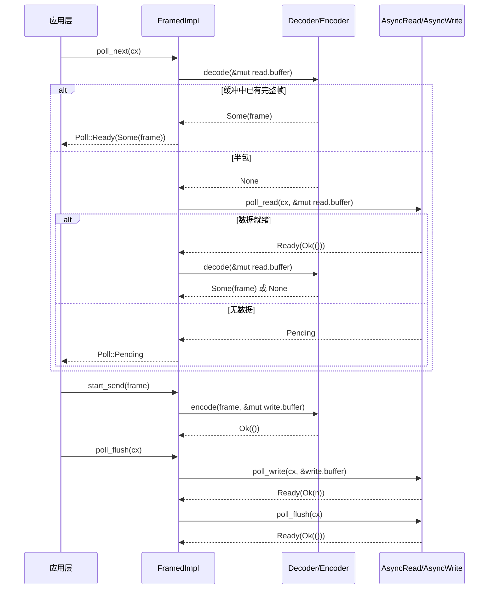

# 第 10 章：背压与流控机制：异步通道的缓冲区管理与流处理

上一章拆解了 tokio-macros 的展开过程，我们看到 #[tokio::main]、select!、join! 如何把样板代码与编译期校验从用户手里接过去。但宏生成的仍是普通的 Future 与 poll 调用——当这些 Future 真正开始读写字节时，Tokio 提供的底层抽象只有两个 trait：AsyncRead 与 AsyncWrite。它们的问题在于「太底层」：一次 poll_read 只保证「读了一些字节」，不保证「读到一个完整消息」。而绝大多数协议（HTTP、Redis、gRPC、自定义 RPC）都是面向「帧」而非「字节流」的。本章要回答的核心问题是：异步 I/O 的抽象边界应该划在哪里？Tokio 的答案分两层：tokio::io 提供字节流级别的 trait 与工具（BufReader/BufWriter/copy_bidirectional），tokio-util 的 codec 框架在此之上提供帧级别的 Stream/Sink 适配（Framed/LengthDelimitedCodec）。理解这两层的分工，就理解了「为什么协议实现几乎都从 Framed 开始」。

# 一、AsyncRead/AsyncWrite：为什么不能直接复用 std::io::Read

## 直觉模型

`std::io::Read::read` 是「阻塞式取货」：你站在窗口前，货没到就一直等，线程被挂起。`AsyncRead::poll_read` 是「取餐凭证式取货」：你问一句「好了吗」，没好（`Poll::Pending`）就先去做别的事，同时留下一个 Waker 让系统在货到时叫你。若没有这个 trait，所有异步 I/O 都得手写 `epoll` 注册与 Waker 映射——这正是第 5 章 Reactor 做的事，而 `AsyncRead` 是它暴露给上层的统一门面。

## 数据结构与内存布局

`AsyncRead` 的定义极其精简，只有一个方法：

```rust
pub trait AsyncRead {
    fn poll_read(
        self: Pin,
        cx: &mut Context,
        buf: &mut ReadBuf,
    ) -> Poll>;
}
```

[FACT:tokio/src/io/async_read.rs:44-60]

三个参数各有讲究。`self: Pin<&mut Self>` 而非 `&mut self`：因为 `AsyncRead` 常常被 `async fn` 生成的 Future 持有，而 Future 一旦被 poll 就不可移动（自引用），`Pin` 是编译器强制的契约。`cx: &mut Context<'_>` 携带 Waker，是「取餐器」的传递通道。`buf: &mut ReadBuf<'_>` 是 Tokio 对 `&mut [u8]` 的封装——它同时记录「已填充长度」与「未初始化容量」，避免 `std::io::Read` 那种「返回读取字节数但缓冲区可能未初始化」的歧义。

文档明确列出三种返回语义 [FACT:tokio/src/io/async_read.rs:15-32]：`Ready(Ok(()))` 表示数据已写入 `buf`，读取量由 `ReadBuf::filled` 的长度增量决定；若增量为 0，要么是 EOF，要么是 `buf.remaining() == 0`（缓冲区零容量）；`Pending` 表示当前不可读但已注册唤醒；`Ready(Err(e))` 是底层 I/O 错误。这里有一个容易被忽略的陷阱：**「读取量为 0」并不等于 EOF**——如果调用者传入一个零容量缓冲区，`poll_read` 会立即返回 `Ready(Ok(()))` 但什么都没读。上层若把「0 字节」当 EOF 处理，就会误判连接关闭。

## 场景驱动 Walkthrough：从 `&[u8]` 读一段字节

考虑最简单的实现——对 `&[u8]` 的 `AsyncRead`：

```rust
impl AsyncRead for &[u8] {
    fn poll_read(
        mut self: Pin,
        _cx: &mut Context,
        buf: &mut ReadBuf,
    ) -> Poll> {
        let amt = std::cmp::min(self.len(), buf.remaining());
        let (a, b) = self.split_at(amt);
        buf.put_slice(a);
        *self = b;
        Poll::Ready(Ok(()))
    }
}
```

[FACT:tokio/src/io/async_read.rs:98-108]

逐步解析：`self.len()` 是剩余未读切片长度，`buf.remaining()` 是目标缓冲区剩余容量，取二者较小值 `amt`。`split_at(amt)` 把切片切成「本次要拷贝的 `a`」与「剩余待读的 `b`」。`buf.put_slice(a)` 把 `a` 拷入 `ReadBuf` 并推进其 filled 指针。`*self = b` 把切片自身推进到剩余部分——这是 `&[u8]` 作为「游标」的关键：每次 poll 后 `self` 指向未读部分。最后返回 `Ready(Ok(()))`，因为内存切片永远「就绪」，不会 `Pending`。

注意 `_cx` 被忽略：内存数据源不需要 Waker。这与网络 socket 形成对比——后者在无数据时会返回 `Pending` 并注册可读兴趣。

`io::Cursor<T>` 的实现多了一层边界检查 [FACT:tokio/src/io/async_read.rs:113-134]：先取 `position()`，若 `pos > slice.len()`（位置越界）直接返回 `Ready(Ok(()))` 而不 panic [FACT:tokio/src/io/async_read.rs:113-134]。这是防御性设计：`Cursor` 的 position 可以被外部 `set_position` 设置到任意值，越界时按「已读完」处理比 panic 更符合 I/O 语义。

## 设计思考：deref 宏与 Pin 的传播

`AsyncRead` 为 `Box<T>`、`&mut T`、`Pin<P>` 提供了转发实现。前两者通过 `deref_async_read!` 宏生成 [FACT:tokio/src/io/async_read.rs:64-70]，核心是 `Pin::new(&mut **self).poll_read(cx, buf)`——把 `Pin<&mut Box<T>>` 解引用为 `Pin<&mut T>` 再转发。`Pin<P>` 的实现更微妙 [FACT:tokio/src/io/async_read.rs:87-93]：它调用 `crate::util::pin_as_deref_mut(self)`，把 `Pin<&mut Pin<P>>` 投影为 `Pin<&mut P::Target>`。这一层投影是必要的，否则嵌套 `Pin` 会导致类型不匹配。

> **〔设计推断与架构权衡〕**
> 这里的设计动机是「零成本抽象」：转发实现让 `Box<dyn AsyncRead>`、`&mut T` 等包装类型无需手写 `poll_read`，同时保持 `Pin` 语义正确。代价是每个转发层都会引入一次间接调用，编译器通常能内联消除。

---

# 二、copy_bidirectional：双向转发的状态机

## 直觉模型

`copy_bidirectional` 是「双向传菜员」：它同时盯着 A→B 和 B→A 两个方向，任何一边读到数据就写到对面。若没有它，实现一个 TCP 代理就得手写两个 `copy` Future 并用 `select!` 组合——而 `select!` 的取消安全约束（第 9 章）会让「读到一半被取消」的数据丢失。`copy_bidirectional` 用一个显式状态机把「读-写-关闭」的中间状态保存下来，从而做到取消安全。

## 数据结构与内存布局

核心是一个三态枚举：

```rust
enum TransferState {
    Running(CopyBuffer),
    ShuttingDown(u64),
    Done(u64),
}
```

[FACT:tokio/src/io/util/copy_bidirectional.rs:10-14]

`Running` 持有 `CopyBuffer`（内含 8KB 缓冲区与读写计数），表示「正在搬运数据」。`ShuttingDown(u64)` 携带已拷贝字节数，表示「读端已 EOF，正在关闭写端」。`Done(u64)` 表示「关闭完成，记录最终字节数」。这个枚举是取消安全的关键：**任何时刻被 drop，状态都保存在枚举里，下次 poll 可从断点继续**。

`CopyBuffer` 来自 `copy.rs`，默认大小由 `DEFAULT_BUF_SIZE` 决定（8KB）[FACT:tokio/src/io/util/copy_bidirectional.rs:76-88]。两个方向各持有一个独立的 `CopyBuffer`，因此内存开销是 16KB。

## 场景驱动 Walkthrough：一次双向转发的完整生命周期

`copy_bidirectional_impl` 用 `poll_fn` 把两个方向的状态机组合起来：

```rust
let mut a_to_b = TransferState::Running(a_to_b_buffer);
let mut b_to_a = TransferState::Running(b_to_a_buffer);
poll_fn(|cx| {
    let a_to_b = transfer_one_direction(cx, &mut a_to_b, a, b)?;
    let b_to_a = transfer_one_direction(cx, &mut b_to_a, b, a)?;
    let a_to_b = ready!(a_to_b);
    let b_to_a = ready!(b_to_a);
    Poll::Ready(Ok((a_to_b, b_to_a)))
})
.await
```

[FACT:tokio/src/io/util/copy_bidirectional.rs:127-151]

注意 `transfer_one_direction` 的调用顺序：先推进 a→b，再推进 b→a，两者都返回 `Poll`。`ready!` 宏在任一方向未完成时立即返回 `Pending`——但**另一个方向的状态已经被推进了**。这正是注释强调的 [FACT:tokio/src/io/util/copy_bidirectional.rs:143-144]：即使 `ready!` 提前返回，另一方向下次 poll 时仍会返回 `Done(count)`，不会丢失进度。

`transfer_one_direction` 内部是一个 `loop`，按状态推进：

```rust
loop {
    match state {
        TransferState::Running(buf) => {
            let count = ready!(buf.poll_copy(cx, r.as_mut(), w.as_mut()))?;
            *state = TransferState::ShuttingDown(count);
        }
        TransferState::ShuttingDown(count) => {
            ready!(w.as_mut().poll_shutdown(cx))?;
            *state = TransferState::Done(*count);
        }
        TransferState::Done(count) => return Poll::Ready(Ok(*count)),
    }
}
```

[FACT:tokio/src/io/util/copy_bidirectional.rs:29-42]

`Running` 状态下调用 `poll_copy`，它内部循环「读一块、写一块」直到读端 EOF 或写端阻塞。EOF 时返回已拷贝总数，状态转为 `ShuttingDown`。`ShuttingDown` 调用 `poll_shutdown` 关闭写端（发送 FIN），完成后转 `Done`。`Done` 直接返回计数。

下面的流程图展示了单方向状态机的推进逻辑与错误分支：

```mermaid
flowchart TD
    start["transfer_one_direction 进入 loop"] --> match_state{"当前 TransferState?"}
    match_state -->|Running| poll_copy["buf.poll_copy(cx, r, w)"]
    poll_copy --> copy_ready{"poll_copy 结果?"}
    copy_ready -->|Pending| ret_pending["返回 Poll::Pending状态保持 Running"]
    copy_ready -->|Err| ret_err["返回 Poll::Ready(Err)错误向上传播"]
    copy_ready -->|Ok(count)| to_shutdown["state = ShuttingDown(count)"]
    to_shutdown --> match_state
    match_state -->|ShuttingDown| poll_shutdown["w.poll_shutdown(cx)"]
    poll_shutdown --> shutdown_ready{"shutdown 结果?"}
    shutdown_ready -->|Pending| ret_pending2["返回 Poll::Pending状态保持 ShuttingDown"]
    shutdown_ready -->|Err| ret_err
    shutdown_ready -->|Ok| to_done["state = Done(count)"]
    to_done --> match_state
    match_state -->|Done| ret_done["返回 Poll::Ready(Ok(count))"]
```

## 设计思考：为什么用显式状态机而非 async fn

> **〔设计推断与架构权衡〕**
> 如果 `transfer_one_direction` 写成 `async fn`，编译器会生成一个 Future，其内部状态（`CopyBuffer`、已拷贝计数）被隐藏在生成的状态机里。这在单方向使用时没问题，但 `copy_bidirectional` 需要在**同一个 poll 周期内**同时推进两个方向——若用两个 `async fn` 加 `select!`，任一方向完成时另一个会被 drop，其内部缓冲区与计数丢失，违反取消安全。显式 `TransferState` 把状态暴露在栈上，`poll_fn` 每次重新进入时状态仍在，从而保证「被取消后可从断点恢复」。

错误处理上，`poll_copy` 返回的 `Err` 会通过 `?` 立即向上传播 [FACT:tokio/src/io/util/copy_bidirectional.rs:32]。文档明确说明 [FACT:tokio/src/io/util/copy_bidirectional.rs:67-70]：中断的读写会被重试，其他错误立即返回，且**部分已读数据可能丢失**（未写入对面）。这是生产环境需要注意的点：`copy_bidirectional` 不保证「要么全成功要么全失败」，错误发生时可能已有一半数据在途。

`copy_bidirectional_with_sizes` 额外做了零大小断言 [FACT:tokio/src/io/util/copy_bidirectional.rs:99-125]，因为零容量缓冲区会导致 `poll_copy` 永远返回 `Ready(Ok(0))` 被误判为 EOF，形成忙循环。

---

# 三、Framed：把字节流切成帧

## 直觉模型

`Framed` 是「香肠机」：上游是连续的水流（`AsyncRead`/`AsyncWrite`），下游是切好的香肠段（`Stream<Item = Frame>` / `Sink<Frame>`）。`Decoder` 负责「从水流中切出一段」，`Encoder` 负责「把一段包成水流」。若没有 `Framed`，每个协议实现都要手写「缓冲区管理 + 半包处理 + 粘包拆分」——这正是 codec 框架要消除的重复劳动。

## 数据结构与内存布局

`Framed` 本身只是一个薄包装：

```rust
pub struct Framed {
    #[pin]
    inner: FramedImpl
}
```

[FACT:tokio-util/src/codec/framed.rs:38-41]

真正的状态在 `FramedImpl` 的 `state: RWFrames` 里，包含 `read: ReadFrame` 与 `write: WriteFrame` 两部分。`ReadFrame` 的字段在 `with_capacity` 中可见 [FACT:tokio-util/src/codec/framed.rs:107-126]：`eof: bool`（读端是否 EOF）、`is_readable: bool`（是否已注册可读兴趣）、`buffer: BytesMut`（读缓冲）、`has_errored: bool`（是否已出错，防止重复读）。`WriteFrame` 字段 [FACT:tokio-util/src/codec/framed.rs:119-122]：`buffer: BytesMut`（写缓冲）、`backpressure_boundary: usize`（背压阈值）。

`backpressure_boundary` 是背压机制的关键：当写缓冲超过该阈值时，`poll_ready` 会返回 `Pending` 直到数据被刷出，从而对上游 `Sink` 施加背压。默认等于 `capacity` [FACT:tokio-util/src/codec/framed.rs:121]，可通过 `set_backpressure_boundary` 调整 [FACT:tokio-util/src/codec/framed.rs:271-273]。

## 场景驱动 Walkthrough：从 socket 读一个帧

`Framed` 的 `Stream` 实现只是转发给 `FramedImpl::poll_next` [FACT:tokio-util/src/codec/framed.rs:309-311]。真正的逻辑在 `FramedImpl` 里（本章未提供该文件，但可从 `Framed` 的接口推断调用链）：

1. `poll_next` 先检查 `read.buffer` 中是否已有完整帧（调用 `codec.decode`）；

2. 若 `decode` 返回 `Some(frame)`，直接产出，不触碰底层 I/O；

3. 若返回 `None`（半包），检查 `read.eof`：若已 EOF 且缓冲非空，说明有残留数据无法解码，返回错误或 `None`；

4. 否则调用底层 `AsyncRead::poll_read` 读更多字节到 `read.buffer`；

5. 读到的字节再次尝试 `decode`，循环直到产出帧或 `Pending`。

这个「先 decode 再 read」的顺序很重要：它保证**一次 read 可能产出多个帧**（粘包），且**一个帧可能跨多次 read**（半包）。`is_readable` 标志避免重复注册可读兴趣——若上次 poll 已注册且未就绪，本次直接返回 `Pending` 而不重复调用底层。

`Sink` 实现的调用链 [FACT:tokio-util/src/codec/framed.rs:315-338]：`start_send` 调用 `codec.encode(item, &mut write.buffer)` 把帧编码进写缓冲；`poll_flush` 把 `write.buffer` 刷到底层 `AsyncWrite`；`poll_ready` 检查 `write.buffer.len() >= backpressure_boundary`，超阈值则先 flush 再返回就绪。

下面的时序图展示了 `Framed` 在一次「读帧-写帧」往返中的跨组件协作：



## 取消安全：Framed 的文档警告

`Framed` 的文档专门列出取消安全语义 [FACT:tokio-util/src/codec/framed.rs:23-30]：`SinkExt::send` 若在 `select!` 中被其他分支抢先完成，**消息保证未发送，但消息本身丢失**——因为 `send` 内部先 `poll_ready` 再 `start_send`，若在 `poll_ready` 阶段被 drop，`item` 已被消费但未编码。而 `StreamExt::next` 是取消安全的：它只持有对底层 stream 的引用，drop 不会丢失已解码的帧。

> **〔设计推断与架构权衡〕**
> 这个不对称性源于读写路径的差异：读路径的状态（`read.buffer`）保存在 `Framed` 内部，`next` 被 drop 只是放弃「取帧」这个动作，缓冲区不受影响；写路径的状态（待发送的 `item`）在 `send` 的 Future 栈上，drop 即丢失。生产代码中若在 `select!` 里用 `send`，必须确保消息可重发或接受丢失。

## 设计思考：`into_parts` 与 `map_codec`

`Framed` 提供了 `into_parts`/`from_parts` 用于「换 codec 但保留缓冲区」[FACT:tokio-util/src/codec/framed.rs:290-298] [FACT:tokio-util/src/codec/framed.rs:155-166]。`map_codec` 就是基于这对方法实现的 [FACT:tokio-util/src/codec/framed.rs:221-234]：先 `into_parts` 拆出 `io`/`codec`/`read_buf`/`write_buf`，再用 `map` 函数转换 codec，最后 `from_parts` 重组。这个设计允许在协议升级（如从明文切换到 TLS）时保留已缓冲的数据，避免重新读取。

`FramedParts` 的 `_priv: ()` 字段 [FACT:tokio-util/src/codec/framed.rs:373-375] 是「非穷尽结构体」技巧：私有字段阻止外部直接构造，强制走 `new`/`from_parts`，从而允许未来添加字段而不破坏兼容性。

---

# 四、LengthDelimitedCodec：长度前缀编解码的状态机

## 直觉模型

`LengthDelimitedCodec` 是「按长度切香肠」的专用刀具：它假设每个帧前面有一个固定字节数的长度字段，先读长度再读 payload。若没有它，实现一个长度前缀协议就得手写「读 4 字节 → 解析长度 → 读 N 字节 → 循环」的状态机——这正是它内部 `DecodeState` 做的事。

## 数据结构与内存布局

```rust
pub struct LengthDelimitedCodec {
    builder: Builder,
    state: DecodeState,
}

enum DecodeState {
    Head,
    Data(usize),
}
```

[FACT:tokio-util/src/codec/length_delimited.rs:451-457]

`DecodeState` 是显式状态机：`Head` 表示「正在读长度字段」，`Data(n)` 表示「已解析出长度 n，正在读 payload」。这个状态跨 `decode` 调用保持，因此**半包场景下不会丢失进度**。

`Builder` 持有全部配置 [FACT:tokio-util/src/codec/length_delimited.rs:416-435]：`max_frame_len`（默认 8MB）、`length_field_len`（默认 4 字节）、`length_field_offset`（默认 0）、`length_adjustment`（默认 0）、`num_skip`（默认 `None`，即 `offset + len`）、`length_field_is_big_endian`（默认 true）。

## 场景驱动 Walkthrough：解码一个长度前缀帧

`decode` 是状态机入口：

```rust
fn decode(&mut self, src: &mut BytesMut) -> io::Result> {
    let n = match self.state {
        DecodeState::Head => match self.decode_head(src)? {
            Some(n) => {
                self.state = DecodeState::Data(n);
                n
            }
            None => return Ok(None),
        },
        DecodeState::Data(n) => n,
    };

    match self.decode_data(n, src) {
        Some(data) => {
            self.state = DecodeState::Head;
            src.reserve(self.builder.num_head_bytes().saturating_sub(src.len()));
            Ok(Some(data))
        }
        None => Ok(None),
    }
}
```

[FACT:tokio-util/src/codec/length_delimited.rs:579-603]

`Head` 状态下调用 `decode_head`。若返回 `None`（数据不足），直接返回 `Ok(None)` 等待更多数据；若返回 `Some(n)`，状态转为 `Data(n)`。`Data` 状态下直接取 n。然后调用 `decode_data(n, src)`：若缓冲中已有 n 字节，`split_to(n)` 切出帧，状态回到 `Head`，并预留下一帧头部的空间；否则返回 `None` 等待。

`decode_head` 是核心解析逻辑：

```rust
let head_len = self.builder.num_head_bytes();
let field_len = self.builder.length_field_len;

if src.len()  self.builder.max_frame_len as u64 {
        return Err(io::Error::new(
            io::ErrorKind::InvalidData,
            LengthDelimitedCodecError { _priv: () },
        ));
    }

    let n = n as usize;
    let n = if self.builder.length_adjustment  n,
        None => {
            return Err(io::Error::new(
                io::ErrorKind::InvalidInput,
                "provided length would overflow after adjustment",
            ));
        }
    }
};

src.advance(self.builder.get_num_skip());
src.reserve(n.saturating_sub(src.len()));
Ok(Some(n))
```

[FACT:tokio-util/src/codec/length_delimited.rs:504-562]

逐步解析：先检查 `src.len() >= head_len`，不足则返回 `None` [FACT:tokio-util/src/codec/length_delimited.rs:499-502]。用 `Cursor` 包装 `src` 以便 `advance`/`get_uint` 操作而不消耗原缓冲。`advance(length_field_offset)` 跳过头部前缀 [FACT:tokio-util/src/codec/length_delimited.rs:517]。按端序读取 `field_len` 字节的长度值 [FACT:tokio-util/src/codec/length_delimited.rs:520-524]。

**关键防御**：若 `n > max_frame_len`，立即返回 `InvalidData` 错误 [FACT:tokio-util/src/codec/length_delimited.rs:526-531]。这防止恶意对端发送「长度字段为 4GB」的帧导致内存耗尽——这是长度前缀协议最经典的 DoS 攻击面。

长度调整用 `checked_sub`/`checked_add` 而非裸运算 [FACT:tokio-util/src/codec/length_delimited.rs:537-541]，溢出时返回 `InvalidInput` 错误而非 panic。`get_num_skip()` 返回 `num_skip` 或默认的 `offset + len` [FACT:tokio-util/src/codec/length_delimited.rs:1070-1073]，跳过头部剩余部分。最后 `reserve(n.saturating_sub(src.len()))` 预留 payload 空间 [FACT:tokio-util/src/codec/length_delimited.rs:559]——用 `saturating_sub` 是因为 `src` 可能已包含部分 payload。

下面的流程图展示了 `decode` 的完整决策路径：

```mermaid
flowchart TD
    entry["decode(src)"] --> check_state{"self.state?"}
    check_state -->|Head| head["decode_head(src)"]
    head --> head_result{"结果?"}
    head_result -->|Ok(None)| ret_none1["返回 Ok(None)等待更多数据"]
    head_result -->|Err| ret_err1["返回 Err长度超限或溢出"]
    head_result -->|Ok(Some(n))| set_data["state = Data(n)"]
    set_data --> decode_data
    check_state -->|Data(n)| decode_data["decode_data(n, src)"]
    decode_data --> data_result{"src.len() >= n?"}
    data_result -->|否| ret_none2["返回 Ok(None)等待更多数据"]
    data_result -->|是| split["src.split_to(n)state = Headreserve 下一帧头部"]
    split --> ret_frame["返回 Ok(Some(frame))"]
```

## 设计思考：max_frame_len 的裁剪与溢出防护

`Builder::adjust_max_frame_len` 在构造 codec 时把 `max_frame_len` 裁剪到长度字段能表示的最大值 [FACT:tokio-util/src/codec/length_delimited.rs:1075-1081]。`max_allowed_frame_len` 计算 `max_length_field_value + length_adjustment` [FACT:tokio-util/src/codec/length_delimited.rs:1083-1089]，其中 `max_length_field_value` 用 `checked_shl` 处理 `length_field_len == 8` 时的移位溢出 [FACT:tokio-util/src/codec/length_delimited.rs:1091-1096]。这个裁剪防止用户设置「长度字段 2 字节但 max_frame_len 设为 1MB」这种矛盾配置——2 字节最多表示 65535，裁剪后 max_frame_len 变为 65535。

编码路径的对称防护：`encode` 检查 `n > max_frame_len` 返回 `InvalidInput` [FACT:tokio-util/src/codec/length_delimited.rs:607-607]，长度调整同样用 `checked_add`/`checked_sub` [FACT:tokio-util/src/codec/length_delimited.rs:620-631]。注意编码时的调整方向与解码相反：解码是「读到的长度 ± adjustment = payload 长度」，编码是「payload 长度 ∓ adjustment = 写入的长度字段」[FACT:tokio-util/src/codec/length_delimited.rs:620-624]。

> **〔设计推断与架构权衡〕**
> 这种「解码加、编码减」的对称设计是为了让 `length_adjustment` 语义统一：它表示「长度字段值与 payload 长度之差」。当协议的长度字段包含头部时（如 Example 3），`adjustment = -2`，解码时 `n - (-2) = n + 2` 得到 payload 长度，编码时 `payload - (-2) = payload + 2` 写回长度字段。

---

# 设计思考：抽象边界的三个层次

回顾本章，Tokio 的 I/O 抽象呈现清晰的三层结构：

**第一层：字节流 trait（`AsyncRead`/`AsyncWrite`）**。只承诺「读/写一些字节」，不承诺帧边界。这是最小接口，任何 I/O 源（socket、文件、内存切片）都能实现。代价是上层必须自己处理半包/粘包。

**第二层：字节流工具（`BufReader`/`BufWriter`/`copy_bidirectional`）**。在 trait 之上提供「减少系统调用」「双向转发」等通用能力。`copy_bidirectional` 的显式状态机展示了「取消安全」如何在工具层实现——状态保存在栈上而非 Future 内部。

**第三层：帧适配（`Framed`/`Decoder`/`Encoder`）**。把字节流提升为 `Stream<Frame>`/`Sink<Frame>`，让协议实现只需关心「帧的编解码」而非「缓冲管理」。`LengthDelimitedCodec` 是这一层的标准范例，其 `DecodeState` 状态机与 `max_frame_len` 防护是所有长度前缀协议都应复用的模式。

> **〔设计推断与架构权衡〕**
> 这三层的划分不是偶然的：它对应「抽象泄漏」的三个梯度。越底层越通用但越难用，越上层越好用但越专用。Tokio 选择把「帧」作为一等公民放在 `tokio-util` 而非 `tokio` 核心，是因为帧的定义因协议而异——`tokio` 只提供字节流，`tokio-util` 提供帧框架，具体协议（HTTP/Redis/gRPC）在各自 crate 里实现 `Decoder`/`Encoder`。

---

# 本章小结

- `AsyncRead::poll_read` 用 `Pin<&mut Self>` + `Context` + `ReadBuf` 三参数替代 `std::io::Read::read`，把「阻塞等待」变为「注册 Waker + 返回 Pending」。`Ready(Ok(()))` 且读取量为 0 时需区分 EOF 与零容量缓冲区。
- `copy_bidirectional` 用 `TransferState` 三态枚举（`Running`/`ShuttingDown`/`Done`）保存中间状态，使双向转发在 `select!` 取消下仍能恢复。错误发生时部分数据可能丢失。
- `Framed` 把 `AsyncRead`/`AsyncWrite` 适配为 `Stream`/`Sink`，`ReadFrame`/`WriteFrame` 分别管理读写缓冲与背压。`SinkExt::send` 非取消安全（消息丢失），`StreamExt::next` 取消安全。
- `LengthDelimitedCodec` 用 `DecodeState`（`Head`/`Data(n)`）状态机处理半包，`max_frame_len` 防护长度字段 DoS，`checked_add`/`checked_sub` 防护调整溢出。

# 本章思考与自测

Q1: `copy_bidirectional` 的 `transfer_one_direction` 中，若把 `TransferState::ShuttingDown` 分支的 `ready!(w.as_mut().poll_shutdown(cx))?` 改为直接 `*state = TransferState::Done(*count)`（跳过 shutdown），在什么场景下会导致对端连接无法正常关闭？

**参考解析**：`poll_shutdown` 的作用是向对端发送 FIN 包，通知「我这边没有更多数据了」。若跳过它直接转 `Done`，写端不会关闭，对端会一直等待数据，形成「半开连接」——对端可能永远阻塞在 `read` 上，直到超时。在 TCP 代理场景中，这会导致连接泄漏：客户端已断开，但代理到后端的连接仍保持。源码中 `ShuttingDown` 状态的存在 [FACT:tokio/src/io/util/copy_bidirectional.rs:35-39] 正是为了确保 EOF 后显式关闭写端。注意 `poll_shutdown` 本身可能返回 `Pending`（如发送缓冲区满），所以必须用 `ready!` 等待而非忽略。

Q2: `LengthDelimitedCodec::decode_head` 中，若去掉 `if n > self.builder.max_frame_len as u64` 的检查 [FACT:tokio-util/src/codec/length_delimited.rs:526-531]，恶意客户端发送长度字段为 `0xFFFFFFFF`（4GB）的帧头会触发什么后果？为什么这个检查必须在 `length_adjustment` 之前？

**参考解析**：去掉检查后，`n` 会被转为 `usize` 并传给 `decode_data`。`decode_data` 检查 `src.len() < n` 时返回 `None`，但 `decode_head` 末尾的 `src.reserve(n.saturating_sub(src.len()))` [FACT:tokio-util/src/codec/length_delimited.rs:559] 会尝试预留 4GB 内存，导致 OOM 或分配失败 panic。检查必须在 `length_adjustment` 之前，因为 `length_adjustment` 可能为负数（如 `-2`），若先调整再检查，`0xFFFFFFFF - 2` 仍接近 4GB，检查形同虚设；且负调整可能让 `checked_sub` 先失败，错误信息会误导为「溢出」而非「帧过大」。源码顺序 [FACT:tokio-util/src/codec/length_delimited.rs:526-

至此，我们理清了 Tokio 在字节流与消息帧之间的两层抽象：tokio::io 负责字节搬运，tokio-util 的 codec 框架负责帧切分与编解码。Framed 之所以成为协议实现的起点，正是因为它把「读到一个完整消息」这一高频需求封装成了可复用的 Stream/Sink 适配。但帧只是数据的容器，当协议需要处理动态任务集合、结构化取消或更复杂的流式组合时，仅靠 Framed 还不够。下一章将进入 tokio-stream 与 tokio-util 的扩展机制，看看 StreamExt 组合子、StreamMap/JoinSet/TaskTracker 以及 CancellationToken 如何复用底层 Waker 与调度机制，为异步迭代与任务管理提供更上层的工具。
