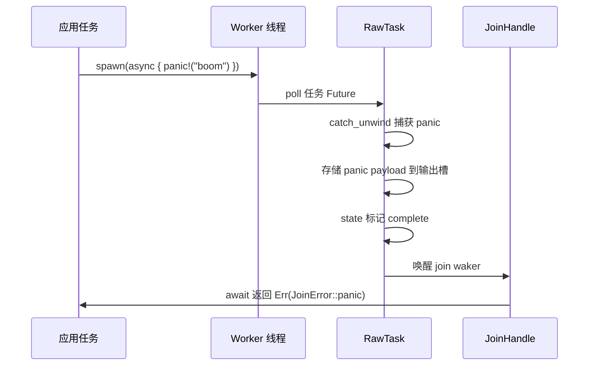
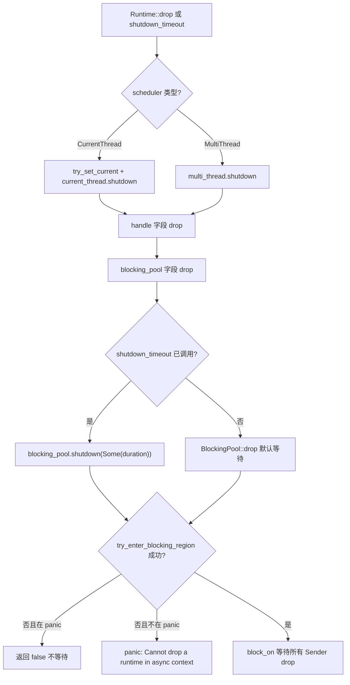
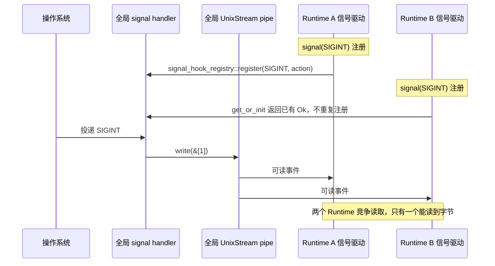

# 第 13 章：性能调优与高并发陷阱：上下文切换、内存分配与死锁排查

上一章我们拆解了 coop 协作预算：每个任务在一次调度周期内只有有限预算，耗尽后必须让出，从而避免单个任务饿死其他任务。但预算机制只解决了「公平调度」问题，真实生产环境还有一类更隐蔽的陷阱——取消安全、panic 传播与关闭顺序。当 select! 取消一个 Future、当任务 panic 被捕获、当 Runtime 开始关闭，代码的边界行为往往与直觉相悖。本章就从取消安全切入，先看一个被 drop 的 Future 到底丢了什么。

# 13.2 panic 传播：JoinError 如何捕获崩溃

## 直觉模型

Tokio 任务 panic 不会让整个进程崩溃（除非 panic=abort），而是被捕获、打包成 `JoinError`，通过 `JoinHandle::await` 返回。这就像工厂流水线上某个工位出了事故，安全网接住了工人，但产品报废——你拿到的是「事故报告」而非产品。

## 数据结构与状态

`JoinHandle<T>` 的 `Future::Output` 是 `super::Result<T>`，即 `Result<T, JoinError>` [FACT:tokio/src/runtime/task/join.rs:325](https://github.com/tokio-rs/tokio/blob/e800714ad714f1d996ddd56265b550d879349c0a/tokio/src/runtime/task/join.rs#L325)。`JoinError` 有两种形态：panic 和 cancelled。文档示例展示了 panic 场景：

```rust
let join_handle = tokio::spawn(async { panic!("boom"); });
let err = join_handle.await.unwrap_err();
assert!(err.is_panic());
```

[FACT:tokio/src/runtime/task/join.rs:121-127](https://github.com/tokio-rs/tokio/blob/e800714ad714f1d996ddd56265b550d879349c0a/tokio/src/runtime/task/join.rs#L121-L127)

panic 被捕获的机制在 `RawTask` 的 poll 路径里：任务 poll 时用 `catch_unwind` 包裹，panic 发生后把 payload 存进任务的输出槽位，标记状态为 complete，然后唤醒 join waker。`JoinHandle::poll` 通过 `try_read_output` 读到的是 `Err(JoinError::panic(payload))`。

## 场景驱动的 Walkthrough：panic 传播链



关键点：panic 的 payload 被完整保留，`JoinError` 实现了 `std::error::Error`，可以通过 `into_panic()` 取回 `Box<dyn Any + Send>`，再用 `downcast_ref::<&str>()` 提取 panic 消息。

## 设计思考与踩坑

**坑 1：`JoinHandle` 的 `UnwindSafe` 是手动实现的。**

```rust
impl UnwindSafe for JoinHandle {}
impl RefUnwindSafe for JoinHandle {}
```

[FACT:tokio/src/runtime/task/join.rs:176-181](https://github.com/tokio-rs/tokio/blob/e800714ad714f1d996ddd56265b550d879349c0a/tokio/src/runtime/task/join.rs#L176-L181)

这是无条件实现，不要求 `T: UnwindSafe`。原因：`JoinHandle` 本身不持有 `T`，`T` 在堆上的任务分配里，panic 时已经被 `catch_unwind` 隔离。所以即使 `T` 不是 `UnwindSafe`，`JoinHandle` 也是安全的。

**坑 2：panic 不会自动传播到父任务。** 如果任务 A spawn 了任务 B，B panic 了，A 不会自动收到通知，除非 A await 了 B 的 `JoinHandle`。如果 A 没 await，B 的 panic 就被静默吞掉了。这是生产环境中最隐蔽的 bug 来源之一。

**坑 3：`spawn_blocking` 的 panic 同样被捕获。** 阻塞线程池的 worker 也用 `catch_unwind` 包裹任务，panic 后线程不会死，而是回到池里继续接活。但如果你在阻塞任务里持有 `Mutex` 并在 panic 时没释放，会导致锁中毒——这是 `std::sync::Mutex` 的固有行为，Tokio 不介入。

**坑 4：Runtime drop 时的 panic。** 如果任务在 Runtime drop 过程中 panic，`catch_unwind` 仍然生效，但此时 join waker 可能已经失效，panic payload 会被丢弃。这是关闭顺序问题的子集，下一节展开。

# 13.3 关闭顺序：阻塞线程与 I/O 资源的清理

## 直觉模型

Runtime 关闭像餐厅打烊：先让前台停止接客（停止接受新任务），再等厨房做完手头的菜（异步任务跑到下一个 yield 点），最后等外包帮工收工（阻塞线程返回）。顺序错了就会出问题——比如先赶走帮工，厨房的菜就永远做不完。

## 数据结构与关闭路径

`Runtime` 的三个字段决定了关闭顺序：

```rust
pub struct Runtime {
    scheduler: Scheduler,
    handle: Handle,
    blocking_pool: BlockingPool,
}
```

[FACT:tokio/src/runtime/runtime.rs:97-106](https://github.com/tokio-rs/tokio/blob/e800714ad714f1d996ddd56265b550d879349c0a/tokio/src/runtime/runtime.rs#L97-L106)

`Drop` 实现：

```rust
impl Drop for Runtime {
    fn drop(&mut self) {
        match &mut self.scheduler {
            Scheduler::CurrentThread(current_thread) => {
                let _guard = context::try_set_current(&self.handle.inner);
                current_thread.shutdown(&self.handle.inner);
            }
            Scheduler::MultiThread(multi_thread) => {
                multi_thread.shutdown(&self.handle.inner);
            }
        }
    }
}
```

[FACT:tokio/src/runtime/runtime.rs:506-521](https://github.com/tokio-rs/tokio/blob/e800714ad714f1d996ddd56265b550d879349c0a/tokio/src/runtime/runtime.rs#L506-L521)

注意：`Drop` 只处理 `scheduler`，**没有显式处理 `blocking_pool`**。`blocking_pool` 的关闭发生在它自己的 `Drop` 里，在 `Runtime::drop` 返回后由字段 drop 顺序触发。字段 drop 顺序是声明顺序：`scheduler` → `handle` → `blocking_pool`。所以阻塞池是最后关闭的。

但 `shutdown_timeout` 是显式控制顺序的：

```rust
pub fn shutdown_timeout(mut self, duration: Duration) {
    self.handle.inner.shutdown();
    self.blocking_pool.shutdown(Some(duration));
}
```

[FACT:tokio/src/runtime/runtime.rs:457-461](https://github.com/tokio-rs/tokio/blob/e800714ad714f1d996ddd56265b550d879349c0a/tokio/src/runtime/runtime.rs#L457-L461)

先 `handle.inner.shutdown()` 通知调度器和 I/O 驱动停止，再 `blocking_pool.shutdown(Some(duration))` 等待阻塞任务，最多等 `duration`。

## 阻塞池关闭的底层机制

`blocking/shutdown.rs` 用了一个精巧的 oneshot channel：

```rust
pub(super) struct Sender {
    _tx: Arc>,
}

pub(super) struct Receiver {
    rx: oneshot::Receiver,
}
```

[FACT:tokio/src/runtime/blocking/shutdown.rs:13-19](https://github.com/tokio-rs/tokio/blob/e800714ad714f1d996ddd56265b550d879349c0a/tokio/src/runtime/blocking/shutdown.rs#L13-L19)

每个阻塞 worker 持有一个 `Sender` 克隆（内部是 `Arc<oneshot::Sender>`）。当所有 worker 退出、所有 `Sender` 被 drop 后，`Receiver` 收到通知。`wait` 方法：

```rust
pub(crate) fn wait(&mut self, timeout: Option) -> bool {
    use crate::runtime::context::try_enter_blocking_region;

    if timeout == Some(Duration::from_nanos(0)) {
        return false;
    }

    let mut e = match try_enter_blocking_region() {
        Some(enter) => enter,
        _ => {
            if std::thread::panicking() {
                return false;
            } else {
                panic!(
                    "Cannot drop a runtime in a context where blocking is not allowed. \
                    This happens when a runtime is dropped from within an asynchronous context."
                );
            }
        }
    };

    if let Some(timeout) = timeout {
        e.block_on_timeout(&mut self.rx, timeout).is_ok()
    } else {
        let _ = e.block_on(&mut self.rx);
        true
    }
}
```

[FACT:tokio/src/runtime/blocking/shutdown.rs:37-70](https://github.com/tokio-rs/tokio/blob/e800714ad714f1d996ddd56265b550d879349c0a/tokio/src/runtime/blocking/shutdown.rs#L37-L70)

逐步解析：

1. `timeout == Some(0)` 直接返回 false——这是 `shutdown_background` 的路径，不等待。

2. `try_enter_blocking_region()` 尝试进入阻塞区域。如果当前在异步上下文里（比如在 async 任务里 drop Runtime），返回 `None`。

3. 进入失败时，如果正在 panic，返回 false（不在 panic 中再 panic）；否则 panic 并给出明确错误信息。

4. 有 timeout 时用 `block_on_timeout`，超时返回 false；无 timeout 时无限等待。

## 关闭顺序的完整流程



## 设计思考与踩坑

**坑 1：在 async 上下文里 drop Runtime 会 panic。** 错误信息很明确：「Cannot drop a runtime in a context where blocking is not allowed」[FACT:tokio/src/runtime/blocking/shutdown.rs:51-54](https://github.com/tokio-rs/tokio/blob/e800714ad714f1d996ddd56265b550d879349c0a/tokio/src/runtime/blocking/shutdown.rs#L51-L54)。解决方案是用 `shutdown_background()`，它等价于 `shutdown_timeout(Duration::from_nanos(0))` [FACT:tokio/src/runtime/runtime.rs:494-496](https://github.com/tokio-rs/tokio/blob/e800714ad714f1d996ddd56265b550d879349c0a/tokio/src/runtime/runtime.rs#L494-L496)，不等待阻塞任务。

**坑 2：`shutdown_background` 会泄漏阻塞任务。** 文档明确警告「this may result in a resource leak (in that any blocking tasks are still running until they return)」[FACT:tokio/src/runtime/runtime.rs:470-472](https://github.com/tokio-rs/tokio/blob/e800714ad714f1d996ddd56265b550d879349c0a/tokio/src/runtime/runtime.rs#L470-L472)。阻塞任务会继续跑直到自然返回，但 Runtime 已经 drop，它们持有的资源可能已经失效。

**坑 3：I/O 资源在 Runtime drop 后失效。** 文档说明「Once the runtime has been dropped, any outstanding I/O resources bound to it will no longer function」[FACT:tokio/src/runtime/runtime.rs:52-54](https://github.com/tokio-rs/tokio/blob/e800714ad714f1d996ddd56265b550d879349c0a/tokio/src/runtime/runtime.rs#L52-L54)。`is_rt_shutdown_err` 函数就是用来检测这种错误的 [FACT:tokio/src/runtime/runtime.rs:585-593](https://github.com/tokio-rs/tokio/blob/e800714ad714f1d996ddd56265b550d879349c0a/tokio/src/runtime/runtime.rs#L585-L593)。

**坑 4：`Drop` 默认无限等待。** 文档指出「The `Drop` implementation waits forever for this」[FACT:tokio/src/runtime/runtime.rs:43-44](https://github.com/tokio-rs/tokio/blob/e800714ad714f1d996ddd56265b550d879349c0a/tokio/src/runtime/runtime.rs#L43-L44)。如果阻塞任务卡死（比如死循环），drop Runtime 会永久挂起。生产环境应该用 `shutdown_timeout` 设上限。

# 13.4 信号处理与多 Runtime 冲突

## 直觉模型

Unix 信号是进程级的，但 Tokio 的 `Signal` 是绑定到 Runtime 的。这就像全楼共用一个火警铃，但每个房间都装了独立的接收器——第一个装接收器的人改了铃的接线方式，后面的人只能共享这个改动。

## 数据结构与全局状态

`signal_enable` 是注册信号处理器的入口：

```rust
fn signal_enable(signal: SignalKind, handle: &Handle) -> io::Result {
    let signal = signal.0;
    if signal  slot,
        None => return Err(io::Error::other("signal too large")),
    };

    siginfo
        .init
        .get_or_init(|| {
            unsafe { signal_hook_registry::register(signal, move || action(globals, signal)) }
                .map(|_| ())
                .map_err(|e| e.raw_os_error())
        })
        .map_err(|e| {
            e.map_or_else(
                || Error::other("registering signal handler failed"),
                || Error::from_raw_os_error,
            )
        })
}
```

[FACT:tokio/src/signal/unix.rs:266-296](https://github.com/tokio-rs/tokio/blob/e800714ad714f1d996ddd56265b550d879349c0a/tokio/src/signal/unix.rs#L266-L296)

关键点：

1. `signal <= 0 || FORBIDDEN.contains(&signal)` 拒绝非法信号。

2. `handle.check_inner()` 检查信号驱动是否在运行——如果 Runtime 已关闭，这里会失败。

3. `siginfo.init.get_or_init(...)` 用 `OnceLock` 保证每个信号只注册一次 OS handler。`get_or_init` 的闭包调用 `signal_hook_registry::register`，这是全局的、进程级的注册。

4. 注册的 handler 是 `action(globals, signal)`，它做两件事：`globals.record_event(signal)` 记录事件，然后往 pipe 写一个字节唤醒驱动 [FACT:tokio/src/signal/unix.rs:252-259](https://github.com/tokio-rs/tokio/blob/e800714ad714f1d996ddd56265b550d879349c0a/tokio/src/signal/unix.rs#L252-L259)。

## 多 Runtime 冲突的根源

`globals()` 返回的是进程级的全局 `Globals`，`OsExtraData` 里的 `UnixStream` 对也是全局的：

```rust
pub(crate) struct OsExtraData {
    sender: UnixStream,
    pub(crate) receiver: UnixStream,
}
```

[FACT:tokio/src/signal/unix.rs:61-64](https://github.com/tokio-rs/tokio/blob/e800714ad714f1d996ddd56265b550d879349c0a/tokio/src/signal/unix.rs#L61-L64)

`Default` 实现创建一对 `UnixStream` [FACT:tokio/src/signal/unix.rs:61-64](https://github.com/tokio-rs/tokio/blob/e800714ad714f1d996ddd56265b550d879349c0a/tokio/src/signal/unix.rs#L61-L64)。这个 pipe 是全局唯一的，所有 Runtime 的信号驱动共享它。

问题来了：`signal_enable` 里 `handle.check_inner()` 检查的是**当前 Runtime** 的信号驱动。但 `signal_hook_registry::register` 注册的 handler 是**进程级**的，它写入的是**全局** pipe。如果 Runtime A 先注册了 SIGINT，然后 Runtime B 也注册 SIGINT，`get_or_init` 会直接返回已有的 `Ok(())`，不会重复注册。但 Runtime B 的信号驱动会从全局 pipe 读数据——两个 Runtime 会竞争同一个 pipe 的字节。

## 场景驱动的 Walkthrough：多 Runtime 信号竞争



## 设计思考与踩坑

**坑 1：信号处理器永不卸载。** 文档明确警告「Once a signal handler is registered with the process the underlying libc signal handler is never unregistered」[FACT:tokio/src/signal/unix.rs:379-380](https://github.com/tokio-rs/tokio/blob/e800714ad714f1d996ddd56265b550d879349c0a/tokio/src/signal/unix.rs#L379-L380)。即使 `Signal` 实例被 drop，后续信号仍会被 Tokio 捕获，默认行为不会恢复 [FACT:tokio/src/signal/unix.rs:338-340](https://github.com/tokio-rs/tokio/blob/e800714ad714f1d996ddd56265b550d879349c0a/tokio/src/signal/unix.rs#L338-L340)。

**坑 2：信号会被合并。** 文档说明「before `poll` is called, all signal notifications are coalesced into one item returned from `poll`」[FACT:tokio/src/signal/unix.rs:312-315](https://github.com/tokio-rs/tokio/blob/e800714ad714f1d996ddd56265b550d879349c0a/tokio/src/signal/unix.rs#L312-L315)。如果你收到 10 个 SIGINT 但只 poll 了一次，只会看到一个事件。这是 Unix 信号本身的特性（标准信号不排队），Tokio 没有额外合并。

**坑 3：多 Runtime 下信号可能丢失。** 由于全局 pipe 被多个 Runtime 竞争读取，一个 Runtime 可能读走字节而另一个永远等不到。生产环境应该只在一个 Runtime 里处理信号，或者用 `signal_hook` 自己管理。

**坑 4：`signal` 函数 panic 条件。** 文档说明「This function panics if there is no current reactor set, or if the `rt` feature flag is not enabled」[FACT:tokio/src/signal/unix.rs:398-405](https://github.com/tokio-rs/tokio/blob/e800714ad714f1d996ddd56265b550d879349c0a/tokio/src/signal/unix.rs#L398-L405)。在 Runtime 外调用 `signal()` 会 panic。

**坑 5：`recv()` 的取消安全。** 文档保证「This method is cancel safe. If you use it as a branch in `tokio::select!` and another branch completes first, then it is guaranteed that no signal is lost」[FACT:tokio/src/signal/unix.rs:423-427](https://github.com/tokio-rs/tokio/blob/e800714ad714f1d996ddd56265b550d879349c0a/tokio/src/signal/unix.rs#L423-L427)。这是因为信号事件存在全局的 `EventInfo` 里，`recv()` 只是读取，不消费底层状态。

# 设计思考

本章三个主题共享一个底层模式：**状态的所有权决定了取消/关闭/信号的安全性**。

- `JoinHandle` 取消安全，因为输出在堆上，handle 只是引用。
- Runtime 关闭顺序敏感，因为阻塞池和调度器共享 `Handle`，顺序错了会死锁或 panic。
- 信号多 Runtime 冲突，因为 handler 和 pipe 是进程级全局状态，而 `Signal` 是 Runtime 级视图。

理解这个模式后，避坑清单可以归纳为三条原则：

1. **取消安全 = 状态在 Future 外部。** 如果 Future 内部有缓冲区，drop 就会丢数据。`JoinHandle`、`Signal::recv`、`tokio::sync::mpsc::Receiver::recv` 都满足这个条件。

2. **关闭顺序 = 依赖方向的反序。** 谁依赖谁，就先关被依赖者。调度器依赖 I/O 驱动，所以先关调度器；阻塞池独立，最后关。

3. **全局状态 = 多实例冲突。** 任何进程级资源（信号 handler、pipe、文件描述符表）在多 Runtime 下都会冲突，要么限制单 Runtime，要么用外部同步。

# 本章小结

# 本章思考与自测

Q1：如果把 `JoinHandle::poll` 中的 `coop::poll_proceed(cx)` 去掉，在什么场景下会导致其他任务饿死？为什么 `try_read_output` 本身不消耗预算？

**参考解析**：`coop::poll_proceed(cx)` 在 [FACT:tokio/src/runtime/task/join.rs:325-325](https://github.com/tokio-rs/tokio/blob/e800714ad714f1d996ddd56265b550d879349c0a/tokio/src/runtime/task/join.rs#L325-L325) 处消耗协作预算。如果去掉，一个在循环里反复 `select!` 多个 `JoinHandle` 的任务可以在一次调度周期内无限轮询所有 handle，永不返回 `Pending`，从而饿死同 worker 上的其他任务。`try_read_output` 本身不消耗预算，因为它只是一次内存读取 + 可能的 waker 存储，不涉及 I/O 或锁竞争，开销极小。预算机制的设计意图是约束「可能长时间运行的操作」，而不是每次 poll 都收费。注意 `coop.made_progress()` 只在 `ret.is_ready()` 时调用 [FACT:tokio/src/runtime/task/join.rs:349-351](https://github.com/tokio-rs/tokio/blob/e800714ad714f1d996ddd56265b550d879349c0a/tokio/src/runtime/task/join.rs#L349-L351)，即只有真正拿到输出才归还预算——这是为了防止「轮询了但没结果」的操作累积消耗预算。

Q2：`blocking/shutdown.rs` 的 `wait` 方法中，如果 `try_enter_blocking_region()` 返回 `None` 且当前正在 panic，为什么选择返回 `false` 而不是继续等待？如果改成继续等待会发生什么？

**参考解析**：`try_enter_blocking_region()` 返回 `None` 表示当前在异步上下文里，不允许阻塞 [FACT:tokio/src/runtime/blocking/shutdown.rs:44-57](https://github.com/tokio-rs/tokio/blob/e800714ad714f1d996ddd56265b550d879349c0a/tokio/src/runtime/blocking/shutdown.rs#L44-L57)。如果此时正在 panic，代码选择返回 `false` 不等待 [FACT:tokio/src/runtime/blocking/shutdown.rs:47-49](https://github.com/tokio-rs/tokio/blob/e800714ad714f1d996ddd56265b550d879349c0a/tokio/src/runtime/blocking/shutdown.rs#L47-L49)。原因是：panic 展开过程中再次 panic 会导致进程 abort（double panic）。如果改成继续等待，就需要调用 `block_on`，而在异步上下文里 `block_on` 会 panic——在 panic 展开中 panic 会直接 abort 进程，丢失所有诊断信息。返回 `false` 让 drop 继续完成，panic 信息得以保留。这是一个「优雅降级」的设计：关闭不完整总比进程崩溃好。

Q3：假设你在 Runtime A 里创建了 `Signal` 监听 SIGTERM，然后把 `Signal` 移到 Runtime B 里 poll。`signal_enable` 里的 `handle.check_inner()` 检查的是哪个 Runtime？如果 Runtime A 先 drop 了，Runtime B 里的 `Signal` 还能收到信号吗？

**参考解析**：`signal_enable` 在 `signal()` 调用时执行，此时 `handle` 是 Runtime A 的 [FACT:tokio/src/signal/unix.rs:398-405](https://github.com/tokio-rs/tokio/blob/e800714ad714f1d996ddd56265b550d879349c0a/tokio/src/signal/unix.rs#L398-L405)。`check_inner()` 检查的是 Runtime A 的信号驱动 [FACT:tokio/src/signal/unix.rs:275](https://github.com/tokio-rs/tokio/blob/e800714ad714f1d996ddd56265b550d879349c0a/tokio/src/signal/unix.rs#L275)。`Signal` 内部是 `RxFuture`，包装的是 `watch::Receiver<()>` [FACT:tokio/src/signal/unix.rs:366-368](https://github.com/tokio-rs/tokio/blob/e800714ad714f1d996ddd56265b550d879349c0a/tokio/src/signal/unix.rs#L366-L368)，这个 receiver 注册在全局 `Globals` 的 `EventInfo` 上。如果 Runtime A drop 了，它的信号驱动停止从全局 pipe 读数据，但全局 handler 仍然会 `record_event` 并写 pipe。Runtime B 的信号驱动如果也在运行，会读到 pipe 数据并触发 `EventInfo`，从而唤醒 `Signal` 的 waker。所以 Runtime B 里的 `Signal` **可能**还能收到信号，但取决于 Runtime B 是否有信号驱动在运行。如果 Runtime B 没有信号驱动（比如没启用 signal feature 或驱动已关闭），pipe 数据无人读取，`Signal` 永远等不到唤醒。这就是多 Runtime 信号处理的脆弱性。

# 章末过渡

取消安全、panic 传播、关闭顺序、信号冲突——这四个问题的共同根源是「状态所有权」在异步边界上的模糊。Tokio 通过把状态放在堆上、用引用计数管理生命周期、用 `catch_unwind` 隔离 panic、用全局 `Globals` 共享信号状态，给出了工程上可用的答案。但这些答案都有边界条件，生产环境必须显式处理。

下一章将进入架构权衡与未来演进：从 io_uring 到可插拔驱动。我们会看到 Tokio 如何在保持 API 稳定的前提下，为新一代 I/O 接口预留扩展空间，以及当前架构中哪些设计决策是历史包袱、哪些是前瞻布局。

至此，我们走完了 Tokio 生产环境中最容易踩坑的边界地带：取消安全依赖输出存储在堆上、try_read_output 的原子性；JoinHandle::drop 不取消任务，abort 才真正取消但对 spawn_blocking 无效；panic 被 catch_unwind 捕获后打包成 JoinError，不 await 就静默丢失；Runtime 关闭有严格顺序，在 async 上下文 drop 会 panic；信号 handler 是进程级全局状态，注册后永不卸载。这些规则背后是 Tokio 在正确性与性能之间的反复权衡。下一章我们将跳出具体机制，站在架构高度回顾这些权衡的由来，并展望 io_uring、驱动重构与自定义执行器接口将把 Tokio 带向何方。
