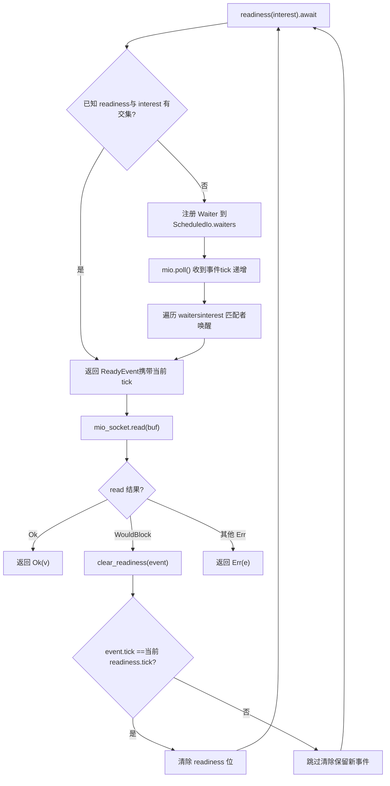
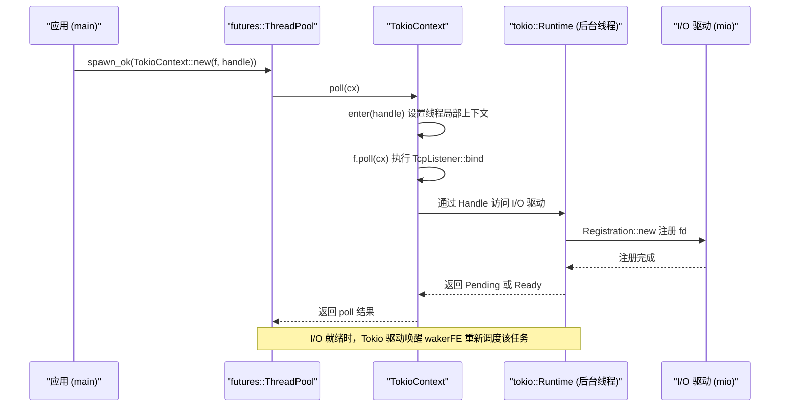

# 第 14 章：演进历程与架构沉思：Tokio 从微内核到工业级运行时的权衡

上一章我们梳理了取消安全、panic 传播、关闭顺序与信号冲突这四类生产陷阱，它们看似分散，实则都指向同一个架构问题：状态所有权在异步边界上如何被清晰地划分。而划分所有权的方式，恰恰由运行时最底层的三个架构决策决定——任务如何被调度、I/O 事件如何被分发、并发正确性如何被验证。本章不再钻进某个具体函数的实现细节，而是站到架构高度，回顾 Tokio 在这些决策上的取舍，并沿着官方文档与源码中已经埋下的演进线索，看看 io_uring、驱动重构与自定义执行器接口会把 Tokio 带向何方。读完本章，你应该能回答一个实践问题：什么时候该扩展 Tokio，什么时候该绕开它。

# 一、三个历史权衡：为什么是现在这个样子

## 直觉模型

把 Tokio 想象成一家已经开了十年的餐厅。厨房的排班方式（work-stealing）、传菜员的独立编制（I/O 驱动与调度器分离）、以及后厨的卫生检查制度（loom 并发验证），都不是开业第一天就设计好的，而是在「客人变多、菜品变复杂」的过程中逐步演化出来的。理解这些演化，才能判断哪些设计是前瞻布局、哪些是历史包袱。

## 权衡一：work-stealing 而非全局队列

> **〔设计推断与架构权衡〕**
> 全局队列的实现最简单：所有任务进一个 `Mutex<VecDeque>`，worker 线程抢锁取任务。但锁竞争会随核数增加而恶化，且缓存局部性差——任务在哪个核上被创建、在哪个核上被执行完全随机。

work-stealing 的取舍是：每个 worker 持有本地队列，`spawn` 时优先入本地队列（无锁、缓存友好），本地空了才去别的 worker 队列尾部窃取。代价是负载均衡有延迟，且窃取本身需要原子操作与内存屏障。Tokio 选择后者，是因为现代服务器动辄几十核，锁竞争的成本远高于偶发的窃取开销。

> **〔设计推断与架构权衡〕**
> 这个决策的边界条件是：**任务粒度不能太细**。如果每个任务只做几微秒的工作，窃取与调度的开销占比就会失控。这也是为什么 Tokio 在 `spawn_blocking` 之外，还要求长任务主动 `yield_now()`——协作式调度本质上是在替 work-stealing 兜底。

## 权衡二：I/O 驱动独立于调度器

这是本章源码材料里最值得玩味的一处。看 `tokio/src/runtime/io/mod.rs` 的模块结构：

[FACT:tokio/src/runtime/io/mod.rs:5-22](https://github.com/tokio-rs/tokio/blob/e800714ad714f1d996ddd56265b550d879349c0a/tokio/src/runtime/io/mod.rs#L5-L22)

```rust
mod driver;
use driver::{Direction, Tick};
pub(crate) use driver::{Driver, Handle, ReadyEvent};

mod registration;
pub(crate) use registration::Registration;

mod registration_set;
use registration_set::RegistrationSet;

mod scheduled_io;
use scheduled_io::ScheduledIo;

mod metrics;
use metrics::IoDriverMetrics;

use crate::util::ptr_expose::PtrExposeDomain;
static EXPOSE_IO: PtrExposeDomain = PtrExposeDomain::new();
```

注意 `driver`、`registration`、`scheduled_io` 是三个独立模块，且对外只暴露 `Driver`、`Handle`、`ReadyEvent`、`Registration` 这几个类型。`ScheduledIo` 是 `pub(crate)` 的——它被 `PtrExposeDomain` 包裹，用于在 loom 测试下把裸指针暴露给并发检查。

> **〔设计推断与架构权衡〕**
> 为什么 I/O 驱动不直接嵌进调度器？因为两者的生命周期与并发模型不同。调度器关心的是「哪个任务该跑」，I/O 驱动关心的是「哪个 fd 就绪了」。如果耦合，那么每次调度策略调整都要动 I/O 路径，反之亦然。更重要的是，`block_on` 单线程运行时也需要 I/O 驱动，但不需要 work-stealing 调度器——分离让两种运行时能复用同一套 I/O 实现。

## 权衡三：loom 做并发模型检验

`tokio/src/loom/mod.rs` 只有 14 行，却揭示了 Tokio 并发正确性的验证策略：

[FACT:tokio/src/loom/mod.rs:1-14](https://github.com/tokio-rs/tokio/blob/e800714ad714f1d996ddd56265b550d879349c0a/tokio/src/loom/mod.rs#L1-L14)

```rust
//! This module abstracts over `loom` and `std::sync` depending on whether we
//! are running tests or not.

#![allow(unused)]

#[cfg(not(all(test, loom)))]
mod std;
#[cfg(not(all(test, loom)))]
pub(crate) use self::std::*;

#[cfg(all(test, loom))]
mod mocked;
#[cfg(all(test, loom))]
pub(crate) use self::mocked::*;
```

关键在 `#[cfg(all(test, loom))]` 这个条件：只有同时开启 `test` 和 `loom` 两个 cfg 时，才会用 `mocked` 模块替换 `std`。这意味着生产构建里根本没有 loom 的代码，零运行时开销。

> **〔设计推断与架构权衡〕**
> loom 的价值在于它能把「线程交错的所有可能顺序」穷举出来。像 `ScheduledIo` 里 `AtomicUsize` 的读改写、`Waiters` 链表的插入删除，这些在真实硬件上可能跑一百万次都不出错，但 loom 能在几秒内构造出触发竞态的交错。代价是测试运行慢、内存占用高，所以只能用于单元测试，不能进生产。

## 设计思考

这三个权衡有一个共同特征：**它们都选择了「更复杂但更可扩展」的方案，并把复杂度限制在内部**。work-stealing 的复杂度藏在调度器里，I/O 驱动的复杂度藏在 `ScheduledIo` 里，loom 的复杂度藏在 cfg 条件里。对外暴露的 API 始终是 `spawn`、`TcpStream::read` 这些简单接口。

> **〔设计推断与架构权衡〕**
> 这也是判断「何时该扩展 Tokio」的第一条准则：**如果你的需求能被现有 API 表达，就不要碰内部结构**。一旦你开始依赖 `pub(crate)` 的类型或 `tokio_unstable` 的 cfg，就意味着你把自己绑在了 Tokio 的内部实现上，升级时会付出代价。

---

# 二、驱动重构：从「一个 waker 一个方向」到「任意兴趣集」

## 直觉模型

早期的 Tokio I/O 类型有个硬性限制：`async fn read(&mut self)` 需要 `&mut self`。这就像餐厅只有一个取餐窗口，同一时间只能有一个人排队——因为 waker 被存在 I/O 资源内部，而不是存在操作对应的 Future 里。`tokio/docs/reactor-refactor.md` 完整记录了这个限制的成因与重构方案。

## 旧架构的痛点

文档开篇就点明了问题：

[FACT:tokio/docs/reactor-refactor.md:16-20](https://github.com/tokio-rs/tokio/blob/e800714ad714f1d996ddd56265b550d879349c0a/tokio/docs/reactor-refactor.md#L16-L20)

```rust
Currently, I/O types require `&mut self` for `async` functions. The reason for
this is the task's waker is stored in the I/O resource's internal state
(`ScheduledIo`) instead of in the future returned by the `async` function.
Because of this limitation, I/O types limit the number of wakers to one per
direction (a direction is either read-related events or write-related events).
```

> **〔设计推断与架构权衡〕**
> 把 waker 存在资源内部，意味着「一个方向只能有一个等待者」。如果你同时想读和写同一个 `TcpStream`，就必须 `split()` 成两半，各自持有独立的 waker 槽。这就是 `TcpStream::split()` 存在的原因——它不是 API 设计偏好，而是内部数据结构的直接约束。

## 新架构：把 waker 移到 Future 里

重构的核心思路是「把 waker 从资源状态移到操作 Future 里」，从而支持每个操作注册多个 waker：

[FACT:tokio/docs/reactor-refactor.md:22-25](https://github.com/tokio-rs/tokio/blob/e800714ad714f1d996ddd56265b550d879349c0a/tokio/docs/reactor-refactor.md#L22-L25)

```rust
Moving the waker from the internal I/O resource's state to the operation's
future enables multiple wakers to be registered per operation. The "intrusive
wake list" strategy used by `Notify` applies to this case, though there are some
concerns unique to the I/O driver.
```

新的 `ScheduledIo` 结构如下：

[FACT:tokio/docs/reactor-refactor.md:97-134](https://github.com/tokio-rs/tokio/blob/e800714ad714f1d996ddd56265b550d879349c0a/tokio/docs/reactor-refactor.md#L97-L134)

```rust
#[derive(Debug)]
pub(crate) struct ScheduledIo {
    /// Resource's known state packed with other state that must be
    /// atomically updated.
    readiness: AtomicUsize,

    /// Tracks tasks waiting on the resource
    waiters: Mutex,
}

#[derive(Debug)]
struct Waiters {
    // List of intrusive waiters.
    list: LinkedList,

    /// Waiter used by `AsyncRead` implementations.
    reader: Option,

    /// Waiter used by `AsyncWrite` implementations.
    writer: Option,
}

// This struct is contained by the **future** returned by `readiness()`.
#[derive(Debug)]
struct Waiter {
    /// Intrusive linked-list pointers
    pointers: linked_list::Pointers,

    /// Waker for task waiting on I/O resource
    waiter: Option,

    /// Readiness events being waited on. This is
    /// the value passed to `readiness()`
    interest: mio::Ready,

    /// Should not be `Unpin`.
    _p: PhantomPinned,
}
```

这里有几个精妙的设计点值得展开：

**第一，`readiness` 是 `AtomicUsize`，`waiters` 是 `Mutex<Waiters>`。** 为什么不用一把锁保护两者？因为 `readiness` 的读操作极其频繁（每次 `readiness()` 调用都要检查），而写操作只在收到 mio 事件时发生。用原子变量让读路径无锁，是典型的读写分离优化。

**第二，`Waiter` 是侵入式链表节点。** `pointers: linked_list::Pointers<Waiter>` 让 `Waiter` 本身成为链表的一部分，不需要额外分配节点。`_p: PhantomPinned` 明确标记它不可 `Unpin`——因为侵入式链表的节点地址一旦移动，链表就断了。

**第三，`reader` 和 `writer` 两个 `Option<Waker>` 是给 `AsyncRead`/`AsyncWrite` 用的。** 文档解释了原因：

[FACT:tokio/docs/reactor-refactor.md:210-213](https://github.com/tokio-rs/tokio/blob/e800714ad714f1d996ddd56265b550d879349c0a/tokio/docs/reactor-refactor.md#L210-L213)

```rust
The `AsyncRead` and `AsyncWrite` traits use a "poll" based API. This means that
it is not possible to use an intrusive linked list to track the waker.
Additionally, there is no future associated with the operation which means it is
not possible to cancel interest in the readiness events.
```

> **〔设计推断与架构权衡〕**
> 这是新旧两套机制的妥协共存：`async fn` 路径用侵入式链表（支持多等待者、可取消），`poll` 路径用固定槽位（不支持取消、但兼容 trait）。这种「两套机制并存」是渐进式重构的典型代价。

## 竞态条件与 tick 机制

重构中最棘手的问题是竞态。文档给了一个具体的死锁场景：

[FACT:tokio/docs/reactor-refactor.md:175-175](https://github.com/tokio-rs/tokio/blob/e800714ad714f1d996ddd56265b550d879349c0a/tokio/docs/reactor-refactor.md#L175-L175)

```rust
If care is not taken, if between `mio_socket.read(buf)` returning and
`clear_readiness(event)` is called, a readiness event arrives, the `read()`
function could deadlock. This happens because the readiness event is received,
`clear_readiness()` unsets the readiness event, and on the next iteration,
`readiness().await` will block forever as a new readiness event is not received.
```

解决方案是引入 tick 机制，把 `readiness` 这个 `AtomicUsize` 拆成多个位段：

[FACT:tokio/docs/reactor-refactor.md:199-199](https://github.com/tokio-rs/tokio/blob/e800714ad714f1d996ddd56265b550d879349c0a/tokio/docs/reactor-refactor.md#L199-L199)

```
| shutdown | generation |  driver tick | readiness |
|----------+------------+--------------+-----------|
|   1 bit  |   7 bits   +    8 bits    +  16 bits  |
```

> **〔设计推断与架构权衡〕**
> 这个位段布局是「用空间换正确性」的经典案例。`tick` 每次 `mio::poll()` 递增，`ReadyEvent` 携带读取时的 tick。`clear_readiness()` 只在 tick 匹配时才清除就绪状态——如果 tick 不匹配，说明期间有新事件到达，不能清除。这样就把「清除」和「新事件到达」的竞态消解在了一个原子读改写里。

下面这张流程图刻画了 `readiness()` 与 `clear_readiness()` 之间的决策路径：



这张图的关键分支在 `tick_match`：如果 tick 不匹配，`clear_readiness` 必须放弃清除，否则会丢掉刚到达的事件，导致下一轮 `readiness()` 永久阻塞。

## 取消兴趣与内存泄漏

侵入式链表带来一个新问题：如果 `readiness()` 返回的 Future 被提前 drop，链表节点必须被摘除。文档明确警告：

[FACT:tokio/docs/reactor-refactor.md:144-148](https://github.com/tokio-rs/tokio/blob/e800714ad714f1d996ddd56265b550d879349c0a/tokio/docs/reactor-refactor.md#L144-L148)

```rust
The future returned by `readiness()` uses an intrusive linked list to store the
waker with `ScheduledIo`. Because `readiness()` can be called concurrently, many
wakers may be stored simultaneously in the list. If the `readiness()` future is
dropped early, it is essential that the waker is removed from the list. This
prevents leaking memory.
```

> **〔设计推断与架构权衡〕**
> 这正是上一章「取消安全」在 I/O 层的体现。`readiness()` 的 Future 必须在 `Drop` 实现里把自己从链表摘除，否则节点会永久留在 `ScheduledIo` 里，既泄漏内存，又会在下次事件到达时被错误唤醒。

## 设计思考与生产踩坑

**为什么不用 `Vec<Waker>` 而用侵入式链表？** 文档在讨论 `&Resource` 实现时给出了答案：

[FACT:tokio/docs/reactor-refactor.md:228-233](https://github.com/tokio-rs/tokio/blob/e800714ad714f1d996ddd56265b550d879349c0a/tokio/docs/reactor-refactor.md#L228-L233)

```rust
It is only possible to implement `AsyncRead` and `AsyncWrite` for resource types
themselves and not for `&Resource`. Implementing the traits for `&Resource`
would permit concurrent operations to the resource. Because only a single waker
is stored per direction, any concurrent usage would result in deadlocks. An
alternate implementation would call for a `Vec` but this would result in
memory leaks.
```

> **〔设计推断与架构权衡〕**
> `Vec<Waker>` 的问题是：Future 被 drop 后，对应的 waker 留在 Vec 里无法定位删除，只能等下次事件到达时才发现「这个 waker 已经失效」。侵入式链表让节点地址就是 Future 内部字段的地址，drop 时能精确摘除。

**生产踩坑点**：`TcpStream::by_ref()` 返回的 `TcpStreamRef` 持有 `read_waiter` 和 `write_waiter` 两个节点：

[FACT:tokio/docs/reactor-refactor.md:238-244](https://github.com/tokio-rs/tokio/blob/e800714ad714f1d996ddd56265b550d879349c0a/tokio/docs/reactor-refactor.md#L238-L244)

```rust
struct TcpStreamRef {
    stream: &'a TcpStream,

    // `Waiter` is the node in the intrusive waiter linked-list
    read_waiter: Waiter,
    write_waiter: Waiter,
}
```

> **〔设计推断与架构权衡〕**
> 这意味着 `TcpStreamRef` 一旦被 drop，两个 waiter 节点同时失效。如果你在 `select!` 里用 `by_ref()` 的引用跨分支共享，要小心生命周期——`TcpStreamRef` 不能活得比 `TcpStream` 长，也不能在多个 `select!` 分支间被同时借用。

---

# 三、自定义执行器：TokioContext 与「绕开 Tokio」的边界

## 直觉模型

有时你不想用 Tokio 的调度器，只想借它的 I/O 和定时器。这就像你不想在餐厅堂食，只想用它的外卖窗口。`examples/custom-executor.rs` 展示了这种「混合模式」：用 `futures::executor::ThreadPool` 做调度，用 Tokio 做 I/O。

## 核心机制：TokioContext

整个例子的关键在 `TokioContext` 这个包装类型：

[FACT:examples/custom-executor.rs:51-54](https://github.com/tokio-rs/tokio/blob/e800714ad714f1d996ddd56265b550d879349c0a/examples/custom-executor.rs#L51-L54)

```rust
impl ThreadPool {
    fn spawn(&self, f: impl Future + Send + 'static) {
        let handle = self.rt.handle().clone();
        self.inner.spawn_ok(TokioContext::new(f, handle));
    }
}
```

> **〔设计推断与架构权衡〕**
> `TokioContext::new(f, handle)` 把 Future 和 Tokio 的 `Handle` 绑在一起。当外部执行器 poll 这个包装 Future 时，`TokioContext` 会先进入 Tokio 的运行时上下文（设置线程局部的 `Handle`），再 poll 内部的 `f`。这样 `f` 里调用 `TcpListener::bind` 时，就能找到 Tokio 的 I/O 驱动。

看整个例子的结构：

[FACT:examples/custom-executor.rs:38-48](https://github.com/tokio-rs/tokio/blob/e800714ad714f1d996ddd56265b550d879349c0a/examples/custom-executor.rs#L38-L48)

```rust
static EXECUTOR: Lazy = Lazy::new(|| {
    // Spawn tokio runtime on a single background thread
    // enabling IO and timers.
    let rt = tokio::runtime::Builder::new_multi_thread()
        .enable_all()
        .build()
        .unwrap();
    let inner = futures::executor::ThreadPool::builder().create().unwrap();

    ThreadPool { inner, rt }
});
```

> **〔设计推断与架构权衡〕**
> 这里 Tokio 运行时被创建但**没有被 `block_on` 驱动**——它只是「存在」，提供 I/O 驱动和定时器。真正的任务调度由 `futures::executor::ThreadPool` 负责。这种模式下，Tokio 的 worker 线程实际上在空转（等待 I/O 事件），任务执行发生在 futures 的线程池里。

## 数据流：一次 TcpListener::bind 的跨执行器旅程



这张时序图的关键在于：**任务的 poll 发生在 futures 线程池，但 I/O 事件的等待发生在 Tokio 后台线程**。两者通过 `Handle` 和 waker 连接。

## 设计思考：何时该绕开 Tokio

> **〔设计推断与架构权衡〕**
> 这个例子的存在本身就是一个信号：Tokio 的架构允许「只用 I/O 驱动，不用调度器」。判断标准可以归纳为三条：

1. **如果你需要与已有的执行器生态集成**（比如某些框架强制要求 `futures::executor`），用 `TokioContext` 是最小侵入的方案。

2. **如果你需要完全控制调度策略**（比如实时系统要求确定性调度），Tokio 的 work-stealing 不满足需求，但它的 I/O 驱动仍然可用。

3. **如果你只是嫌 Tokio 的 API 复杂**，那不该绕开——`TokioContext` 引入的跨执行器边界会带来新的调试难度，得不偿失。

**生产踩坑点**：`TokioContext` 模式下，Tokio 运行时的 `block_on` 从未被调用，意味着 `Runtime::shutdown` 的清理逻辑不会自动触发。你必须在程序退出前显式 drop `Runtime`，否则 I/O 驱动的后台线程可能不会优雅关闭。

## 与 io_uring 的关系

> **〔设计推断与架构权衡〕**
> `tokio/src/runtime/io/mod.rs` 顶部的 cfg 条件透露了 io_uring 的接入方式：

[FACT:tokio/src/runtime/io/mod.rs:1-4](https://github.com/tokio-rs/tokio/blob/e800714ad714f1d996ddd56265b550d879349c0a/tokio/src/runtime/io/mod.rs#L1-L4)

```rust
#![cfg_attr(
    not(all(feature = "rt", feature = "net", feature = "io-uring", tokio_unstable)),
    allow(dead_code)
)]
```

注意 `feature = "io-uring"` 和 `tokio_unstable` 同时出现。这意味着 io_uring 支持目前是**实验性的**，必须同时开启 unstable 特性才能编译。`allow(dead_code)` 则说明：当这些特性未开启时，模块里的部分代码不会被使用，编译器会警告——用 `allow` 压掉。

> **〔设计推断与架构权衡〕**
> io_uring 与 epoll 的根本区别在于：epoll 是「就绪通知」，io_uring 是「完成通知」。前者需要应用自己发起 `read`/`write` 系统调用，后者由内核直接完成 I/O 并返回结果。这对 Tokio 的 `ScheduledIo` 模型是巨大冲击——`readiness()` 的语义在 io_uring 下不再适用，需要一套全新的「提交-完成」抽象。这也是为什么 io_uring 支持迟迟停留在 unstable：它不是加一个后端那么简单，而是要重构整个 I/O 驱动的抽象层。

---

# 本章小结

本章从架构高度回顾了 Tokio 的三个核心权衡，并展望了三条演进路径：

**历史权衡**：

- work-stealing 用调度复杂度换取多核扩展性，边界是任务粒度不能太细；
- I/O 驱动独立于调度器，让 `block_on` 与多线程运行时复用同一套 I/O 实现；
- loom 通过 cfg 条件在生产构建中完全消失，只在测试时穷举线程交错。

**驱动重构**（`reactor-refactor.md`）：

- 把 waker 从 `ScheduledIo` 内部移到操作 Future 里，用侵入式链表支持多等待者；
- 用 `AtomicUsize` 的位段布局（shutdown/generation/tick/readiness）消解 `clear_readiness` 的竞态；
- `AsyncRead`/`AsyncWrite` 因 poll 语义无法用侵入式链表，保留 `reader`/`writer` 固定槽位作为妥协。

**未来演进**：

- io_uring 需要「提交-完成」新抽象，目前受 `tokio_unstable` 保护；
- `TokioContext` 允许只用 I/O 驱动、不用调度器，但需手动管理 Runtime 生命周期；
- 判断「扩展还是绕开」的准则：能用现有 API 表达就不碰内部结构。

# 本章思考与自测

Q1: 在 `ScheduledIo` 的 `readiness` 位段布局中，如果把 `tick` 字段从 8 位缩减到 4 位，在什么场景下会触发错误？请结合 `clear_readiness` 的 tick 匹配逻辑分析。

**参考解析**：`tick` 在每次 `mio::poll()` 时递增 [FACT:tokio/docs/reactor-refactor.md:185-185](https://github.com/tokio-rs/tokio/blob/e800714ad714f1d996ddd56265b550d879349c0a/tokio/docs/reactor-refactor.md#L185-L185)。`clear_readiness` 只在 `event.tick == 当前 readiness.tick` 时才清除就绪位 [FACT:tokio/docs/reactor-refactor.md:199-199](https://github.com/tokio-rs/tokio/blob/e800714ad714f1d996ddd56265b550d879349c0a/tokio/docs/reactor-refactor.md#L199-L199)。如果 tick 只有 4 位，那么每 16 次 poll 就会回绕。假设某个 `ReadyEvent` 携带 tick=15，在它被 `clear_readiness` 之前，mio 又 poll 了 1 次，tick 回绕到 0。此时 `clear_readiness` 发现 tick 不匹配（15 != 0），会错误地跳过清除——但实际上期间可能没有新事件到达，只是 tick 回绕了。这会导致就绪位被永久保留，后续 `readiness()` 立即返回但 `read` 仍然 `WouldBlock`，陷入忙循环。8 位 tick 在正常负载下足够（256 次 poll 内完成一次 read-clear 循环），但极端高并发下仍有回绕风险，这是位段布局的固有边界。

Q2: `examples/custom-executor.rs` 中，Tokio 运行时被创建但从未 `block_on`。如果此时调用 `rt.shutdown_timeout()`，会发生什么？为什么这个例子选择不调用？

**参考解析**：`rt.shutdown_timeout()` 会等待所有任务完成并关闭 I/O 驱动。但在这个例子里，任务实际运行在 `futures::executor::ThreadPool` 上 [FACT:examples/custom-executor.rs:51-54](https://github.com/tokio-rs/tokio/blob/e800714ad714f1d996ddd56265b550d879349c0a/examples/custom-executor.rs#L51-L54)，Tokio 运行时里没有任务——它只提供 I/O 驱动。如果调用 `shutdown_timeout`，它会立即返回（因为没有任务），但 I/O 驱动的后台线程可能仍在运行。例子选择不调用，是因为 `EXECUTOR` 是 `Lazy` 静态变量，程序退出时由 Rust 的静态析构机制处理。真正的坑在于：如果 `TokioContext` 包装的 Future 还在运行，而 `Runtime` 被 drop，那么 Future 里的 I/O 操作会 panic（找不到运行时上下文）。生产环境必须确保所有 `TokioContext` Future 完成后才 drop Runtime。

Q3: 假设你要为 Tokio 添加一个基于 io_uring 的 I/O 后端。根据 `reactor-refactor.md` 中 `readiness()` 的语义，哪些部分可以直接复用，哪些必须重写？

**参考解析**：可以直接复用的是 `Registration` 的注册接口和 `ScheduledIo` 的 `waiters` 链表结构——它们管理的是「谁在等」，与底层是 epoll 还是 io_uring 无关。必须重写的是 `readiness()` 的语义：epoll 下它返回「fd 就绪」，io_uring 下没有「就绪」概念，只有「提交的 SQE 完成」。`clear_readiness` 的 tick 机制也需要重新设计——io_uring 的完成事件自带 user_data 标识，不需要 tick 来区分新旧事件。最根本的改动是：`readiness()` 返回的 Future 在 io_uring 下应该变成「提交 SQE 并等待 CQE」，这意味着 `Waiter` 结构需要携带 SQE 参数，而不仅仅是 `interest`。这也是为什么 io_uring 支持受 `tokio_unstable` 保护 [FACT:tokio/src/runtime/io/mod.rs:1-4](https://github.com/tokio-rs/tokio/blob/e800714ad714f1d996ddd56265b550d879349c0a/tokio/src/runtime/io/mod.rs#L1-L4)——它不是替换后端，而是改变 I/O 驱动的抽象契约。

至此，我们完成了从具体陷阱到架构权衡的爬升。回顾全书，从 Future 的惰性求值到调度器的公平性，从取消安全到关闭顺序，再到本章的 io_uring 与可插拔驱动，所有讨论都围绕一个核心：在异步边界上清晰地划分状态所有权。Tokio 的架构并非一成不变，io_uring 的零拷贝 I/O、驱动层的解耦、自定义执行器接口的开放，都在推动它向更灵活、更高效的方向演进。当你合上这本书，希望留下的不是一堆 API 用法，而是一套判断力：知道何时该信任运行时，何时该介入底层，以及如何在生产环境中避开那些会咬人的组合。异步 Rust 的生态仍在快速生长，保持对源码与官方文档的追踪，比记住任何结论都更重要。
