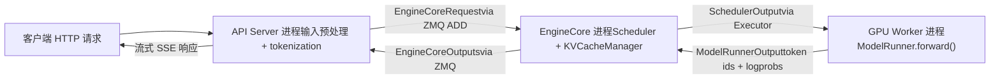
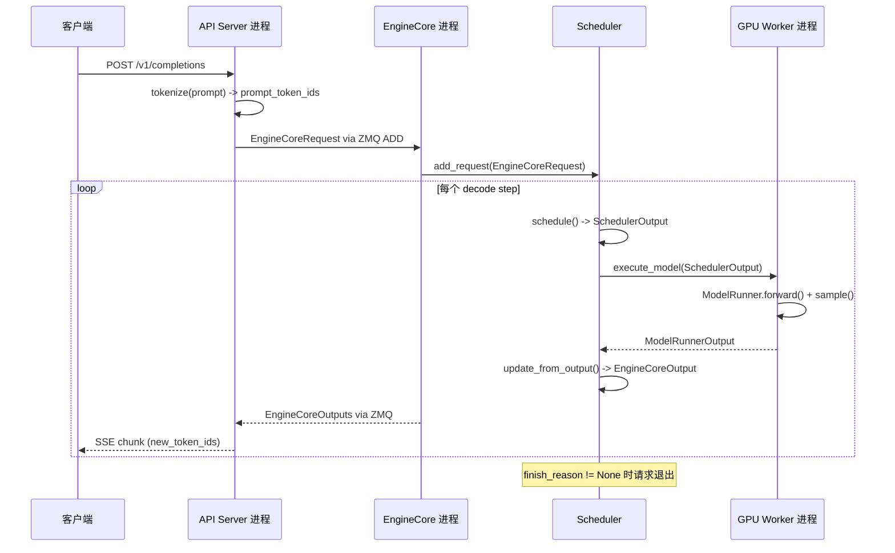

# Kapitel 1: vLLMs Designphilosophie und Gesamtarchitektur im Überblick

Angenommen, Sie haben eine A100 und möchten mit LLaMA-7B einen Online-Inferenzdienst anbieten. Der naivste Ansatz ist: Ein Request kommt an, model.generate() wird einmal ausgeführt, das Ergebnis wird zurückgegeben. Dieser Ansatz bricht bei steigender Parallelität sofort zusammen – nicht weil die GPU-Rechenleistung nicht ausreicht, sondern wegen zweier Dinge: Erstens wird der Speicher durch Fragmentierung aufgefressen. Die autoregressive Generierung erfordert das Caching der Key/Value-Tensoren jeder Schicht (KV-Cache). Wenn für jeden Request eine ganze zusammenhängende Speicherregion gemäß max_model_len vorab alloziert wird, belegt ein Request mit 4096 Token mehrere Dutzend MB, während die tatsächlich generierte Sequenz möglicherweise nur 200 Token umfasst. Schlimmer noch: Requests unterschiedlicher Länge kommen und gehen abwechselnd, zusammenhängende Speicherblöcke werden zerstückelt, und am Ende ist zwar die Gesamtmenge ausreichend, aber es findet sich kein ausreichend großer zusammenhängender Bereich – das ist das klassische Speicherfragmentierungsproblem. Zweitens ist die Batch-Verarbeitung ineffizient. Traditionelles statisches Batching erfordert, dass alle Requests in einem Batch gleichzeitig beginnen und gleichzeitig enden. Aber die Ausgabelänge von Generierungsaufgaben ist naturgemäß unvorhersehbar: Ein Request könnte nach 10 Token stoppen, ein anderer muss 2000 generieren. Nachdem ein kurzer Request beendet ist, kann sein belegter Batch-Slot nur leer warten, bis der lange Request fertig ist, und die GPU-Auslastung fällt abrupt ab. vLLMs zwei Design-Grundpfeiler zielen genau auf diese beiden Schmerzpunkte: PagedAttention beseitigt Speicherfragmentierung durch einen Paging-Mechanismus, Continuous Batching beseitigt Batch-Leerlauf durch Scheduling auf Iterationsebene. Dieses Kapitel geht nicht in die Implementierungsdetails dieser beiden Mechanismen ein (das ist Thema von Kapitel 2 und 4), sondern erstellt zunächst eine globale Landkarte: Wie die Prozessarchitektur von vLLM v1 aussieht, wie die Verantwortlichkeiten der einzelnen Schichten aufgeteilt sind, welche Komponenten ein Request vom Eintritt ins System bis zur Ausgabe von Token durchläuft. Erst mit Verständnis dieser Landkarte haben die Quellcode-Interpretationen der folgenden Kapitel einen Anknüpfungspunkt.

# Prozessarchitektur: Warum vLLM kein Single-Process-Programm ist

## Intuitives Modell

Stellen Sie sich vLLM als ein Restaurant vor. Der Empfang (API Server) ist für den Empfang der Gäste und die Aufnahme der Bestellungen zuständig; die Küchenzentrale (EngineCore) entscheidet, welches Gericht zuerst zubereitet wird und welcher Herd verwendet wird; jeder Herd (GPU Worker) wird exklusiv von einem Koch bedient. Wenn eine Person sowohl empfängt als auch kocht, herrscht in Stoßzeiten zwangsläufig Chaos – deshalb trennt vLLM diese Rollen in eigenständige Prozesse auf.

> **[Design Inference & Architectural Trade-offs]**
> Das Kernmotiv dieser Multi-Process-Aufteilung ist**Trennung der Belange**: HTTP-Parsing, Tokenisierung und multimodales Datenladen sind CPU-intensiv und können blockieren, während die Modell-Vorwärtspropagierung GPU-intensiv ist. Wenn beides im selben Prozess läuft, behindern sich beide gegenseitig durch den Python-GIL. Nach der Aufteilung in eigenständige Prozesse kann der API Server kontinuierlich neue Requests empfangen, EngineCore kann kontinuierlich schedulen, GPU Worker kann kontinuierlich rechnen, und alle drei sind über ZMQ-Nachrichtenwarteschlangen entkoppelt.

## Prozesstopologie und Mengenverhältnisse

Die Prozessarchitektur von vLLM v1 lässt sich mit einer Formel zusammenfassen. Für`N`GPUs, Tensor-Parallelitätsgrad`TP`, Pipeline-Parallelitätsgrad`PP`, Daten-Parallelitätsgrad`DP`, Anzahl der API Server`A`einer Bereitstellung:

| Prozesstyp | Anzahl | Verantwortlichkeit |
| --- | --- | --- |
| API Server | `A`(standardmäßig gleich`DP`） | HTTP-Request-Verarbeitung, Eingabe-Vorverarbeitung, Streaming-Rückgabe der Ergebnisse |
| EngineCore | `DP`(standardmäßig 1) | Scheduling, KV-Cache-Verwaltung, Koordination der GPU Worker |
| GPU Worker | `N`（= `DP × PP × TP`） | Laden von Gewichten, Ausführung der Vorwärtspropagierung, Verwaltung des Speichers |
| DP Coordinator | `DP > 1`bei  ist 1, andernfalls 0 | Lastausgleich zwischen DP-Rängen und MoE-Wellenkoordination |

[FACT:docs/design/arch_overview.md:113-113]liefert die autoritative Definition dieser Tabelle. Ein typisches Single-Node-4-GPU-Deployment (`vllm serve -tp=4`) erzeugt 1 API Server + 1 EngineCore + 4 GPU Worker = 6 Prozesse[FACT:docs/design/arch_overview.md:115-115]. Ein 8-GPU-TP=2/DP=4-Deployment hingegen wächst auf 4 + 4 + 8 + 1 = 17 Prozesse[FACT:docs/design/arch_overview.md:123-123]。

Hier gibt es ein leicht zu übersehendes Detail:**Die Anzahl der API Server folgt standardmäßig der DP-Größe**. Wenn`--data-parallel-size 4`, werden automatisch 4 API Server gestartet, die jeweils über ZMQ in einer Many-to-Many-Topologie mit allen EngineCores verbunden sind[FACT:docs/design/arch_overview.md:73-73]. Das bedeutet, dass jeder API Server Anfragen an jeden beliebigen EngineCore weiterleiten kann, wodurch ein Single Point of Failure vermieden wird.

## Datenfluss

Die folgende Abbildung zeigt den vollständigen Übertragungsweg einer Anfrage zwischen den Prozessen. Beachten Sie, dass an jedem Knoten die tatsächlichen Klassennamen und Datenstrukturen angegeben sind:



Der Schlüssel dieser Abbildung liegt darin:**Zwischen API Server und EngineCore findet asynchrone Nachrichtenübermittlung statt**, kein Funktionsaufruf. Die Anfrage wird in die`EngineCoreRequest`-Struktur serialisiert (eine`msgspec.Struct`, siehe[FACT:vllm/v1/engine/__init__.py:109-113]), über den ZMQ-`ADD`-Nachrichtentyp gesendet[FACT:vllm/v1/engine/__init__.py:287-299]. Nach der Verarbeitung durch EngineCore werden die Ergebnisse in`EngineCoreOutputs`verpackt und zurückgegeben[FACT:vllm/v1/engine/__init__.py:256-260]。

> **[Design Inference & Architectural Trade-offs]**
> ZMQ wurde anstelle von gRPC oder Shared Memory gewählt, weil ZMQ in Interprozesskommunikationsszenarien eine extrem niedrige Latenz (Mikrosekundenbereich) bietet und von Natur aus Many-to-Many-Topologien und Message-Queue-Semantik unterstützt. Für Inferenzdienste, die empfindlich auf die Latenz des ersten Tokens reagieren, muss der Kommunikationsaufwand so gering wie möglich sein.

## Design-Überlegung: Warum EngineCore ein eigenständiger Prozess und kein Thread ist

Eine naheliegende Frage ist: Da EngineCore und API Server auf derselben Maschine laufen, warum werden sie nicht im selben Prozess mit Thread-Kommunikation untergebracht?

Die Antwort liegt im Arbeitsmodus von EngineCore verborgen. EngineCore betreibt eine**Busy-Loop**(busy loop), die kontinuierlich Anfragen plant und Arbeit an GPU Worker verteilt[FACT:docs/design/arch_overview.md:73-73]. Diese Schleife darf nicht unterbrochen werden – sobald sie durch HTTP-Parsing oder Tokenization blockiert wird, entstehen Lücken in der gesamten Inferenz-Pipeline. Ein eigenständiger Prozess stellt sicher, dass die CPU-Zeitscheibe von EngineCore nicht durch Frontend-Logik beansprucht wird.

Darüber hinaus bringt ein eigenständiger Prozess auch**Fehlerisolierung**: Wenn der API Server aufgrund einer fehlerhaften Anfrage abstürzt, bleiben EngineCore und GPU Worker unberührt und können weiterhin Anfragen bedienen, die von anderen API Servern weitergeleitet werden.

# Geschichtetes mentalen Modell: Verantwortungsgrenzen vom Einstiegspunkt bis zur GPU

## Intuitives Modell

Wenn die Prozessarchitektur beschreibt, „wer wo arbeitet", dann beschreibt das Schichtenmodell, „welche Entscheidungen jede Schicht trifft". Die Code-Organisation von vLLM folgt einem klaren Schichtungsprinzip:**Die obere Schicht entscheidet, was zu tun ist, die untere Schicht entscheidet, wie es zu tun ist**. Die Einstiegsschicht entscheidet, welche Anfragen angenommen werden, die Engine-Core-Schicht entscheidet, wer zuerst verarbeitet wird, die Executor-Schicht entscheidet, welche Parallelisierungsstrategie verwendet wird, und die Worker-Schicht entscheidet, wie Ergebnisse auf der konkreten Hardware erzielt werden.

## Vier-Schichten-Struktur

**Einstiegsschicht (Entrypoints)**bietet zwei Interaktionsmodi: die`LLM`-Klasse für Offline-Inferenz und den`vllm serve`-Befehl für den Online-Dienst[FACT:docs/design/arch_overview.md:16-16][FACT:docs/design/arch_overview.md:56-56]. Die Kernaufgabe dieser Schicht ist die Eingabevorverarbeitung – Tokenization, multimodales Datenladen, Parsing der Sampling-Parameter – sowie die Ausgabe-Detokenization und das Streaming der Rückgabe. Sie kümmert sich nicht um Scheduling-Strategien und berührt auch nicht die GPU.

**Engine-Core-Schicht (EngineCore)**ist das Gehirn des gesamten Systems. Sie hält den Scheduler (entscheidet, welche Anfragen in jedem Decode-Schritt verarbeitet werden) und den KV Cache Manager (verwaltet den paginierten Speicher) und kommuniziert über die Executor-Abstraktion mit den GPU Workern[FACT:docs/design/arch_overview.md:79-85]. Das Schlüsseldesign dieser Schicht ist die**Trennung von Scheduling und Ausführung**: Der Scheduler erzeugt nur die Entscheidung, „welche Tokens in diesem Schritt ausgeführt werden" (`SchedulerOutput`), wie genau sie auf der GPU ausgeführt werden, ist Sache der Worker.

**Executor-Schicht (Executor)**ist die Brücke zwischen EngineCore und Worker. Sie kapselt die verteilte Ausführungsstrategie – für Single-Process wird`UniProcExecutor`verwendet, für Multi-Process`MultiprocExecutor`, für Ray-Cluster`RayDistributedExecutor`. Die abstrakte Schnittstelle des Executors ermöglicht es EngineCore, nicht zu wissen, ob darunter eine einzelne GPU oder 8 GPUs mit TP läuft.

**Worker-Schicht**Für jede GPU gibt es einen Worker-Prozess, der intern einen ModelRunner und das tatsächliche`torch.nn.Module`-Modellobjekt hält[FACT:docs/design/arch_overview.md:171-191]. Der ModelRunner ist für die Vorbereitung der Eingabe-Tensoren, das Erfassen von CUDA Graphs und die Ausführung der Vorwärtsberechnung verantwortlich. Diese Schicht ist der einzige Ort, der direkt GPU-Speicher und CUDA-Streams manipuliert.

## Konfigurationsobjekt: Globaler Zustand, der alle Schichten durchdringt

Wie werden Informationen zwischen den vier Schichten übermittelt? Die Antwort ist`VllmConfig`– ein riesiges Dataclass, das alle Konfigurationen enthält[FACT:vllm/config/vllm.py:357-357]。

```python
@config(config=ConfigDict(arbitrary_types_allowed=True))
class VllmConfig:
    """Dataclass which contains all vllm-related configuration."""
    model_config: ModelConfig = None
    cache_config: CacheConfig = Field(default_factory=CacheConfig)
    parallel_config: ParallelConfig = Field(default_factory=ParallelConfig)
    scheduler_config: SchedulerConfig = Field(default_factory=SchedulerConfig.default_factory)
    # ... 还有 20+ 个子配置
```

[FACT:vllm/config/vllm.py:363-371]zeigt die Kernfelder. Die Logik hinter dieser Designentscheidung verdient eine nähere Betrachtung.

> **[Design Inference & Architectural Trade-offs]**
> Die Dokumentation erklärt ausdrücklich, warum ein großes Konfigurationsobjekt anstelle verstreuter Parameterübergabe verwendet wird:**Erweiterbarkeit**. Angenommen, man möchte ein neues Feature hinzufügen, das nur den ModelRunner betrifft, dann muss man nur in`VllmConfig`ein Feld hinzufügen, das der ModelRunner direkt lesen kann, ohne die Konstruktorsignaturen von Engine, Worker und Model ändern zu müssen[FACT:docs/design/arch_overview.md:203-203]. In einem sich schnell entwickelnden Inferenz-Framework reduziert diese Fähigkeit, „Felder hinzuzufügen, ohne Schnittstellen zu ändern“, die Entwicklungsreibung erheblich.

Der Preis dafür ist, dass`VllmConfig`extrem groß wird – wie aus[FACT:vllm/config/vllm.py:356-3509]ersichtlich ist, umfasst diese Klasse über 3000 Codezeilen mit Dutzenden von Feldern und Validierungsmethoden.`__post_init__`Die Methode[FACT:vllm/config/vllm.py:1405-2317]ist sogar über 900 Zeilen lang und übernimmt die gesamte übergreifende Validierung und Ableitung von Standardwerten für alle Konfigurationselemente.

## Hashing und Caching der Konfiguration

`VllmConfig`Es gibt noch eine leicht zu übersehende, aber sehr wichtige Fähigkeit:`compute_hash()` [FACT:vllm/config/vllm.py:464-580]. Sie generiert einen kurzen Hash für alle Konfigurationselemente, die die Struktur des Berechnungsgraphen beeinflussen.

```python
def compute_hash(self, include_version: bool = True) -> str:
    factors: list[Any] = []
    vllm_factors: list[Any] = []
    if include_version:
        from vllm import __version__
        vllm_factors.append(__version__)
    if self.model_config:
        vllm_factors.append(self.model_config.compute_hash())
    # ... 逐个追加各子配置的哈希
    hash_str = safe_hash(str(factors).encode(), usedforsecurity=False).hexdigest()[:10]
    return hash_str
```

[FACT:vllm/config/vllm.py:479-580]zeigt den vollständigen Hash-Berechnungsablauf. Beachten Sie die Warnung im Kommentar: „Whenever a new field is added to this config, ensure that it is included in the factors list if it affects the computation graph“[FACT:vllm/config/vllm.py:465-467]。

> **[Design Inference & Architectural Trade-offs]**
> Der Zweck dieses Hashes ist**torch.compile Cache-Schlüssel**. vLLM verwendet`torch.compile`, um den Vorwärtsgraphen des Modells zu kompilieren, und das Kompilierungsergebnis wird auf der Festplatte zwischengespeichert. Beim nächsten Start kann, wenn der Konfigurations-Hash identisch ist, der Kompilierungs-Cache direkt wiederverwendet und der zeitaufwändige Kompilierungsprozess übersprungen werden. Wenn ein Konfigurationselement, das den Berechnungsgraphen beeinflusst, nicht in den Hash aufgenommen wird, führt dies zu einem fehlerhaften Cache-Treffer – der mit der alten Konfiguration kompilierte Graph wird mit der neuen Konfiguration ausgeführt, was zu stillen Fehlern führt. Deshalb wird im Kommentar wiederholt betont: „Felder, die den Berechnungsgraphen beeinflussen, müssen in den Hash aufgenommen werden“.

# Walkthrough des Request-Lebenszyklus: Von HTTP zu Token

## Szenario

Angenommen, ein Client sendet an den von`vllm serve`gestarteten Dienst eine OpenAI-kompatible`/v1/completions`-Anfrage, der Prompt lautet „The capital of France is“, und es sollen 16 Token generiert werden. Wir verfolgen die vollständige Reise dieser Anfrage entlang des Quellcodes.

## Schritt 1: API Server empfängt und verarbeitet vor

Nachdem der API-Server-Prozess die HTTP-Anfrage empfangen hat, führt er Tokenisierung und Parsing der Sampling-Parameter durch und konstruiert dann`EngineCoreRequest`：

```python
class EngineCoreRequest(
    msgspec.Struct,
    array_like=True,
    omit_defaults=True,
    gc=False,
):
    request_id: str
    prompt_token_ids: list[int] | None
    mm_features: list[MultiModalFeatureSpec] | None
    sampling_params: SamplingParams | None
    pooling_params: PoolingParams | None
    arrival_time: float
    lora_request: LoRARequest | None
    cache_salt: str | None
    data_parallel_rank: int | None
    prompt_embeds: torch.Tensor | None = None
    # ... 更多字段
```

[FACT:vllm/v1/engine/__init__.py:109-124]definiert die Kernstruktur der Anfrage. Beachten Sie`msgspec.Struct`in Kombination mit`array_like=True`und`omit_defaults=True`die Kombination[FACT:vllm/v1/engine/__init__.py:109-113]– dies dient der**Serialisierungsleistung**。`array_like`, damit msgspec Positionsarrays anstelle von Dictionaries zum Kodieren verwendet,`omit_defaults`Standardwertfelder überspringt, und beides zusammen das Volumen der ZMQ-Nachrichten erheblich reduziert.

> **[Design Inference & Architectural Trade-offs]**
> `gc=False`teilt msgspec mit, keinen GC-Tracking-Code für diese Struktur zu generieren[FACT:vllm/v1/engine/__init__.py:109-113]. Für häufig erstellte/zerstörte Nachrichtenobjekte kann das Deaktivieren des GC-Trackings den Druck auf den Python-Garbage-Collector reduzieren, was in Szenarien mit Tausenden von Anfragen pro Sekunde eine notwendige Optimierung ist.

## Schritt 2: EngineCore-Scheduling

Nachdem EngineCore die Anfrage empfangen hat, legt der Scheduler sie in die Warteschlange. In jedem Scheduling-Schritt entscheidet der Scheduler, ob diese Anfrage in den aktuellen Batch aufgenommen wird. Wenn ja, weist der KV Cache Manager ihr physische Blöcke zu (die Kernoperation von PagedAttention, siehe Kapitel 2).

Das Scheduling-Ergebnis wird als`SchedulerOutput`gekapselt und über den Executor an den GPU Worker gesendet.

## Schritt 3: GPU Worker führt Vorwärtsberechnung aus

Der ModelRunner des Workers empfängt`SchedulerOutput`, bereitet die Eingabe-Tensoren vor (einschließlich block table, slot mapping und anderer Attention-Metadaten), führt die Vorwärtsberechnung des Modells aus und sampelt das nächste Token.

## Schritt 4: Ergebnisrückgabe

Das vom Worker erzeugte Token wird als`EngineCoreOutput`：

```python
class EngineCoreOutput(
    msgspec.Struct,
    array_like=True,
    omit_defaults=True,
    gc=False,
):
    request_id: str
    new_token_ids: list[int]
    new_logprobs: LogprobsLists | None = None
    finish_reason: FinishReason | None = None
    stop_reason: int | str | None = None
    # ...
```

[FACT:vllm/v1/engine/__init__.py:199-217]gekapselt. definiert die Ausgabestruktur.`finish_reason`ist ein`IntEnum`, die Werte umfassen`STOP`、`LENGTH`、`ABORT`、`ERROR`、`REPETITION` [FACT:vllm/v1/engine/__init__.py:68-69]. Der Kommentar erklärt, warum`Int`anstelle von`Str`：「Int rather than Str for more compact serialization」[FACT:vllm/v1/engine/__init__.py:56-57]verwendet wird – wieder eine Optimierung des Serialisierungsvolumens.

Mehrere`EngineCoreOutput`werden in`EngineCoreOutputs`verpackt und über ZMQ an den API Server zurückgegeben[FACT:vllm/v1/engine/__init__.py:256-260]。

## Schritt 5: API Server gibt streaming zurück

Nachdem der API Server`EngineCoreOutputs`empfangen hat, führt er für jedes`EngineCoreOutput`eine De-Tokenisierung durch und pusht es dann über SSE (Server-Sent Events) streaming an den Client.

## Vollständige Zeitsequenz

Das folgende Sequenzdiagramm zeigt die vollständige prozessübergreifende Interaktion, mit den echten Funktionsnamen und Datenstrukturen jedes Schritts:



Die Schlüsselinformationen dieses Diagramms:**Jeder Decode-Schritt erzeugt eine`EngineCoreOutputs`Rückgabe**, anstatt erst nach der vollständigen Generierung der gesamten Sequenz zurückzukehren. Genau das spiegelt Continuous Batching wider – abgeschlossene Sequenzen werden sofort beendet, neue Anfragen sofort aufgenommen, und die Ausgabe wird streaming an den Client zurückgegeben.

# Design-Überlegungen und Produktions-Fallstricke

## Das „Post-Initialisierungs“-Muster der Konfigurationsvalidierung

`VllmConfig.__post_init__`ist das Herzstück des gesamten Konfigurationssystems. Es ist keine einfache Feldzuweisung, sondern eine**mehrstufige Validierungspipeline**：

1. Zunächst wird der Multimodal-Encoder-Modus analysiert[FACT:vllm/config/vllm.py:1416-1416]

2. Dann wird`try_verify_and_update_config()`aufgerufen, damit modellspezifische Konfigurations-Hooks die Möglichkeit haben, die Konfiguration zu ändern[FACT:vllm/config/vllm.py:1434-1434]

3. Anschließend wird die Konsistenz zwischen Parallelkonfiguration, Quantisierungskonfiguration und LoRA-Konfiguration validiert[FACT:vllm/config/vllm.py:1442-1444]

4. Schließlich werden Kompatibilitätsprüfungen für Laufzeitmerkmale wie asynchrone Planung, CUDA Graph, KV Transfer und weitere durchgeführt[FACT:vllm/config/vllm.py:1544-1635]

> **[Design Inference & Architectural Trade-offs]**
> Dieses „Post-Initialisierungs"-Muster löst einen grundlegenden Widerspruch:**Zwischen Konfigurationseinträgen bestehen Abhängigkeiten, aber Benutzer könnten sie in beliebiger Reihenfolge festlegen**. Zum Beispiel:`async_scheduling`Ob aktiviert wird, hängt von mehreren Bedingungen ab: dem Methodentyp in speculative_config, ob das Executor-Backend dies unterstützt, ob Pipeline-Parallelismus verwendet wird und weiteren[FACT:vllm/config/vllm.py:1544-1575]. Wenn man diese Logik in die`__set__`des Feldes legen würde, entstünden komplexe zirkuläre Abhängigkeiten. Einheitlich in`__post_init__`platziert und sequenziell abgearbeitet, ist die Logik klar und leicht zu debuggen.

## Stolperfalle: Konflikt zwischen KV Connector und expandable_segments

[FACT:vllm/config/vllm.py:1219-1260]In`_verify_kv_transfer_compat`offenbart sich eine sehr versteckte Produktionsfalle.

Wenn KV Connector (wie NIXL, Mooncake) für PD-disaggregierte Bereitstellung verwendet wird, pinnen diese Connectoren über Mechanismen wie`ibv_reg_mr`**die physischen Speicherseiten des KV-Cache.**. Wenn jedoch gleichzeitig`PYTORCH_CUDA_ALLOC_CONF=expandable_segments:True`gesetzt ist, kann der CUDA-VMM-Allocator von PyTorch zur Laufzeit dieselbe virtuelle Adresse auf andere physische Seiten remappen[FACT:vllm/config/vllm.py:1227-1233]。

Was ist die Folge? Die vom Connector registrierten RDMA-Speicherbereiche zeigen auf bereits ungültige physische Seiten. Die erste knotenübergreifende KV-Übertragung meldet dann`IBV_WC_REM_ACCESS_ERR`oder`NIXL_ERR_REMOTE_DISCONNECT` [FACT:vllm/config/vllm.py:1232-1233]。

Die Gegenstrategie von vLLM ist**konservative Ablehnung**: Sobald`expandable_segments:True`erkannt wird und irgendein KV-Connector konfiguriert ist, wird direkt eine Exception geworfen[FACT:vllm/config/vllm.py:1249-1260]. Die einzige Ausnahme ist die Aktivierung von`enable_cumem_allocator`– weil der CuMem-Allocator`expandable_segments` [FACT:vllm/config/vllm.py:1238-1241]。

> **[Design Inference & Architectural Trade-offs]**
> 〔Designableitung und Architekturabwägungen〕**Die Lehre aus diesem Fall ist:**RDMA-Speicherregistrierung und virtuelles Speicher-Remapping sind semantisch inkompatibel. Jede Funktion, die GPU-Speicher-Pinning betrifft (KV-Übertragung, NCCL-Registrierungspuffer usw.), muss sicherstellen, dass die zugrunde liegenden physischen Seiten nicht vom Allocator stillschweigend verschoben werden. Bei der Fehlersuche in solchen Fällen sollte man, wenn RDMA-Übertragungen bei der ersten knotenübergreifenden Kommunikation fehlschlagen, als erste Reaktion`PYTORCH_CUDA_ALLOC_CONF`。

## prüfen.

`__post_init__`Stolperfalle: Automatische Degradationskette der asynchronen Planung`async_scheduling`In[FACT:vllm/config/vllm.py:1544-1635]zur Behandlung von**zeigt sich eine sorgfältig entworfene**。

automatische Degradationskette`async_scheduling`Wenn der Benutzer`None`nicht explizit setzt (Wert ist

- ), versucht vLLM, es automatisch zu aktivieren, muss aber nacheinander eine Reihe von Inkompatibilitätsbedingungen prüfen:[FACT:vllm/config/vllm.py:1578-1587]
- Bei einem Pooling-Modell deaktivieren[FACT:vllm/config/vllm.py:1588-1601]
- Wenn die speculative-Methode nicht in der Unterstützungsliste steht, deaktivieren`disable_padded_drafter_batch=True`Wenn[FACT:vllm/config/vllm.py:1602-1610]
- , deaktivieren[FACT:vllm/config/vllm.py:1611-1617]
- Wenn das Executor-Backend dies nicht unterstützt, deaktivieren[FACT:vllm/config/vllm.py:1618-1624]
- Bei ROCm DeepEP High-Throughput DBO deaktivieren[FACT:vllm/config/vllm.py:1625-1633]

Bei PP > 1 und Verwendung des V1 Model Runner deaktivieren[FACT:vllm/config/vllm.py:1639-1640]。

> **[Design Inference & Architectural Trade-offs]**
> 〔Designableitung und Architekturabwägungen〕**Die Designphilosophie dieser Degradationskette ist:**Standardmäßig die optimale Konfiguration aktivieren, bei Inkompatibilität stillschweigend degradieren und eine Warnung protokollieren. Dies ist deutlich benutzerfreundlicher, als vom Benutzer die manuelle Konfiguration jedes Kompatibilitätsschalters zu verlangen. Der Preis dafür ist jedoch: Wenn die Leistung nicht den Erwartungen entspricht, muss der Benutzer die Logs durchsuchen, um festzustellen, dass die asynchrone Planung automatisch deaktiviert wurde. Wenn in der Produktionsumgebung ein anormaler Durchsatz festgestellt wird, wird empfohlen, in den Startlogs nach der Warnung „Async scheduling will be disabled" zu suchen.

# Zusammenfassung dieses Kapitels

Dieses Kapitel hat das globale mentale Modell von vLLM v1 etabliert. Die Kernpunkte:

1. **Die zwei grundlegenden Probleme, die vLLM löst**: Speicherfragmentierung (PagedAttention-Seitenverwaltung) und Batch-Leerlauf (Continuous Batching mit Iterationsplanung).

2. **Multiprozess-Architektur**: API Server (Eingang) → EngineCore (Planung) → GPU Worker (Ausführung), drei Prozessebenen, die über ZMQ asynchron kommunizieren. Die Prozessanzahl folgt der`A + DP + N`-Formel.

3. **Vier-Ebenen-Schichtenmodell**: Die Eingangsebene übernimmt die Vorverarbeitung, die Engine-Core-Ebene die Planungsentscheidungen, die Executor-Ebene die verteilte Strategie und die Worker-Ebene die GPU-Berechnung.

4. **VllmConfig ist der globale Zustand, der alle Ebenen durchzieht**, unterstützt Compile-Caching über`compute_hash()`und realisiert die Validierung über Konfigurationseinträge hinweg sowie die Ableitung von Standardwerten über`__post_init__`.

5. **Request-Lebenszyklus**：HTTP → tokenize → `EngineCoreRequest` → Scheduler → Worker forward → `EngineCoreOutput`→ SSE-Streaming-Rückgabe.

# Denkanstöße und Selbsttests zu diesem Kapitel

Q1: Wenn man die`EngineCoreRequest`-Parameter von`msgspec.Struct`von`array_like=True, omit_defaults=True`auf den Standardwert ändert (also`array_like=False, omit_defaults=False`), in welchen Szenarien würde dies zu Leistungsproblemen führen? Bitte analysieren Sie dies unter Berücksichtigung von[FACT:vllm/v1/engine/__init__.py:109-113]und[FACT:vllm/v1/engine/__init__.py:256-260].

**Referenzanalyse**：`array_like=True`lässt msgspec Positionsarrays statt Dictionaries zur Struktur-Kodierung verwenden,`omit_defaults=True`überspringt Felder mit Standardwerten. In der Standardkonfiguration wird jedes`EngineCoreRequest`wird als Dictionary-Struktur mit allen Feldnamen kodiert, wodurch sich die Größe um das 2- bis 3-Fache aufblähen kann. In Szenarien mit hoher Nebenläufigkeit (mehrere Tausend Anfragen pro Sekunde) steigt die Menge der ZMQ-Nachrichten zwischen API Server und EngineCore erheblich, was zu erhöhtem CPU-Aufwand für Serialisierung/Deserialisierung und verschwendeter Netzwerkbandbreite führt.`EngineCoreOutputs`verwendet ebenfalls diese beiden Parameter[FACT:vllm/v1/engine/__init__.py:256-260], und es entsteht bei jedem Decode-Schritt, was die Auswirkungen verstärkt. Darüber hinaus`gc=False`deaktiviert GC-Tracking, was bei hochfrequenten kurzlebigen Objekten den Druck auf den Python-GC verringern kann.

Q2: In`VllmConfig.__post_init__`,`async_scheduling`die automatische Aktivierungslogik ([FACT:vllm/config/vllm.py:1576-1635]) verfolgt die Strategie „nacheinander inkompatible Bedingungen prüfen, erst bei vollständigem Bestehen aktivieren“. Wenn ein neues Feature hinzugefügt wird, das mit asynchronem Scheduling inkompatibel ist, aber der Entwickler vergisst, den entsprechenden Zweig in diese Prüfkette einzufügen, welche Probleme würde das verursachen? Bitte aus der Perspektive des Systemverhaltens analysieren.

**Referenzanalyse**: Wenn der Prüfzweig vergessen wird, würde asynchrones Scheduling fälschlicherweise aktiviert. Die Kernannahme des asynchronen Schedulings ist, dass „die Scheduling-Entscheidung des aktuellen Schritts nicht von der Ausgabe des vorherigen Schritts abhängt“, was es EngineCore erlaubt, den nächsten Schritt zu planen, während die GPU-Berechnung des vorherigen Schritts noch nicht abgeschlossen ist. Wenn das neue Feature diese Annahme verletzt (z. B. eine Nachbearbeitungslogik, die die Logits des vorherigen Schritts lesen muss), führt asynchrones Scheduling zu Datenrennen oder fehlerhaften Ergebnissen. Noch subtiler ist, dass solche Bugs möglicherweise nur bei bestimmten Nebenläufigkeits-Timings ausgelöst werden und schwer zu reproduzieren sind. Genau deshalb verwendet der explizite Aktivierungspfad in[FACT:vllm/config/vllm.py:1549-1552]eine „Hard-Fail“-Strategie – wenn der Benutzer ihn aktiviert, wird direkt ein Fehler gemeldet statt stillschweigend herabgestuft, um den Entwickler zur Auseinandersetzung mit dem Kompatibilitätsproblem zu zwingen.

Q3: `VllmConfig.compute_hash()`Der Kommentar warnt: „Felder, die den Berechnungsgraphen beeinflussen, müssen zur factors-Liste hinzugefügt werden“ ([FACT:vllm/config/vllm.py:465-467]). Angenommen, ein neues Feld`attention_sink_tokens`beeinflusst die Attention-Berechnungslogik, wird aber im Hash ausgelassen – welche Art von Fehlern würde dies in einer Produktionsumgebung auslösen? Warum sind solche Fehler besonders gefährlich?

**Referenzanalyse**：`compute_hash()`Die Ausgabe von wird als Schlüssel für den torch.compile-Kompilierungscache verwendet. Wenn`attention_sink_tokens`die Struktur des Berechnungsgraphen beeinflusst, aber nicht in den Hash einbezogen wird, dann bleibt der Hash-Wert unverändert, wenn der Benutzer von`attention_sink_tokens=0`zu`attention_sink_tokens=4`wechselt, und vLLM verwendet den zuvor kompilierten Graphen wieder (ohne Sink-Token-Logik). Das Ergebnis ist, dass das Modell stillschweigend fehlerhafte Ausgaben produziert – kein Fehler, kein Absturz, nur falsche Ergebnisse. Solche Fehler sind besonders gefährlich, weil: (1) sie keine Ausnahmen oder Log-Warnungen auslösen; (2) die Ausgabe immer noch „plausibel aussehender“ Text ist, nur mit verminderter Qualität oder anormalem Verhalten; (3) die Fehlersuche den Vergleich von Kompilierungscache-Treffern und tatsächlichen Konfigurationsunterschieden erfordert, was extrem hohe Lokalisierungskosten verursacht. Deshalb wird in den Kommentaren wiederholt betont, dass neue Felder darauf bewertet werden müssen, ob sie den Berechnungsgraphen beeinflussen.

Dieses Kapitel beginnt mit dem Absturz einer naiven Inferenzanfrage und deckt die beiden grundlegenden Widersprüche auf, die vLLM lösen muss: Speicherfragmentierung und Batch-Leerlauf, und präsentiert die beiden Schlüssel: PagedAttention und Continuous Batching. Anschließend geben wir einen Überblick über die Gesamtarchitektur von vLLM v1 und klären das Prozessmodell, die Komponentenschichtung und den vollständigen Lebenszyklus einer Anfrage. Mit dieser globalen Karte wird das nächste Kapitel in die Kern-Datenstrukturen von vLLM eintauchen – Request, Sequence und den Block-Verwaltungsmechanismus des KV Cache – und aufzeigen, wie PagedAttention auf Codeebene die Speicherzuordnung „logisch kontinuierlich, physisch diskret“ implementiert.
