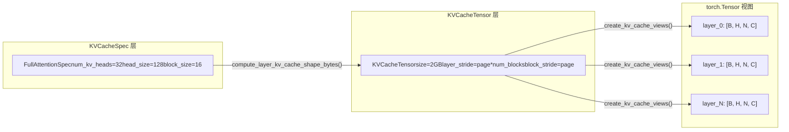

# Kapitel 2: Kernabstraktionen: Request, Sequence und KV-Cache-Datenstrukturen

Im vorherigen Kapitel haben wir das geschichtete mentale Modell von vLLM v1 aufgebaut und wissen, dass eine Anfrage vom API Server ausgeht, durch EngineCore läuft und schließlich den Worker zur Ausführung erreicht. Aber wie wird aus einem JSON-String in einem HTTP-Anfragekörper ein Objekt, das innerhalb der Engine geplant, verfolgt und unterbrochen werden kann? Das ist die Frage, die die Request-Klasse beantworten soll.

# Das Spezifikationssystem des KV Cache: Von KVCacheSpec zur Registry

Request löst das Problem „wer berechnen soll“, während`KVCacheSpec`das Problem „wo berechnet werden soll“ löst. In der Welt von PagedAttention muss der KV-Cache jeder Modellschicht präzise beschrieben werden: wie viele Heads er hat, wie groß jeder Head ist, wie viele Tokens ein Block speichern kann, ob Quantisierung erforderlich ist. Diese Informationen sind im Vererbungssystem von`KVCacheSpec`kodiert.

## Intuitives Modell: KVCacheSpec ist der „Grundriss“ des Speichers

> **[Design Inference & Architectural Trade-offs]**
> Wenn man den GPU-Speicher als ein zu erschließendes Stück Land betrachtet, dann ist`KVCacheSpec`der Grundriss jedes Gebäudes (jeder Cache-Gruppe): Er legt fest, wie viele Zimmer (Head-Slots) jede Etage (jeder Block) hat, wie groß jedes Zimmer ist (head_size) und wie viele Personen untergebracht werden können (block_size Tokens). Und`KVCacheConfig`ist der Plan für die gesamte Wohnanlage – wie viele Gebäude insgesamt, wie viel Land jedes Gebäude belegt und welche Gebäude dasselbe Fundament teilen (block table).

Ohne dieses Spezifikationssystem könnte die KV-Cache-Zuweisung nur auf hartcodierten Annahmen basieren und wäre nicht in der Lage, die vielfältigen Modellanforderungen von Standard-MHA bis MLA, von Full Attention bis Sliding Window, von FP16 bis FP8-Quantisierung zu unterstützen.

## Datenstruktur: Der Vererbungsbaum von KVCacheSpec und die wichtigsten Felder

`KVCacheSpec`ist die Basisklasse aller Spezifikationen, sie ist eine`@dataclass(frozen=True)` [FACT:vllm/v1/kv_cache_interface.py:150-152]. frozen bedeutet, dass das Spezifikationsobjekt nach seiner Erstellung unveränderlich ist – dies stellt sicher, dass mehrere Komponenten (Scheduler, Worker, KV Cache Manager) dieselbe Spezifikation sehen und keine Inkonsistenzen durch Änderungen an einer Stelle entstehen.

Die Basisklasse definiert drei abstrakte Attribute, die von Unterklassen implementiert werden müssen:`num_heads`、`tokens_per_state`、`state_content_size_bytes` [FACT:vllm/v1/kv_cache_interface.py:182-183]. Diese drei Attribute bestimmen gemeinsam`page_size_bytes`– also die Anzahl der Bytes, die ein Block belegt.

`AttentionSpec`ist die zentralste Unterklasse, sie führt`num_kv_heads`、`head_size`、`dtype`、`kv_quant_mode`und weitere Felder ein[FACT:vllm/v1/kv_cache_interface.py:485-498]. Besonders das Design des Feldes`tokens_per_state`ist bemerkenswert: Der Standardwert ist 1, was bedeutet, dass ein State einem Token entspricht; er kann jedoch auf eine ganze Zahl größer als 1 gesetzt werden (z. B. komprimiert das sparse MLA von DeepSeek-V4 mehrere Tokens zu einem State) oder auf einen Bruch kleiner als 1 (z. B. verwendet das Block-Pooling von Whisper`Fraction(1, block_pool_size)`, um auszudrücken, dass ein Token mehreren States entspricht)[FACT:vllm/v1/kv_cache_interface.py:501-501]。

`FullAttentionSpec`erweitert`AttentionSpec`um`sliding_window`und`attention_chunk_size` [FACT:vllm/v1/kv_cache_interface.py:566-566]. Beachten Sie, dass der Docstring eine wichtige Designentscheidung erklärt: Wenn der Hybrid-Allocator deaktiviert ist, wird die Sliding-Window-Attention-Schicht im KV Cache Manager wie Full Attention behandelt (für alle Tokens werden Blöcke zugewiesen), aber zur Laufzeit des Modells wird weiterhin gemäß Sliding Window berechnet[FACT:vllm/v1/kv_cache_interface.py:540-545]. Dies ist eine**konservative Zuweisung, präzise Berechnung**Strategie.

`MLAAttentionSpec`ist die Schlüsselspezifikation der DeepSeek-Modellreihe. Sie setzt`head_size_v`standardmäßig auf 0[FACT:vllm/v1/kv_cache_interface.py:670], da MLA nur einen latent vector speichert und kein separates V hat.`alignment`Das Feld dient der seitenausgerichteten Auffüllung[FACT:vllm/v1/kv_cache_interface.py:646-652], was für Backends wie FlashMLA, die eine bestimmte Ausrichtung benötigen, entscheidend ist.

`MambaSpec`hingegen folgt überhaupt nicht dem Attention-Ansatz. Es verwendet`shapes`und`dtypes`Tupel, um die Form des State-Tensors zu beschreiben[FACT:vllm/v1/kv_cache_interface.py:1027-1028]，`state_content_size_bytes`ist die Summe aller State-Tensor-Größen[FACT:vllm/v1/kv_cache_interface.py:1048-1052]. Mambas`max_memory_usage_bytes`hat je nach`mamba_cache_mode`drei verschiedene Berechnungsweisen[FACT:vllm/v1/kv_cache_interface.py:1073-1084], was die Komplexität der Mamba-State-Verwaltung widerspiegelt – sie wächst nicht linear wie bei Attention, sondern hat eine feste State-Größe.

## Szenariogesteuert: Die Konvertierung von Spezifikationen zum VRAM-Layout

Wenn die Engine startet, muss sie die`KVCacheSpec`aller Schichten in das tatsächliche VRAM-Layout konvertieren. Dieser Prozess wird von`KVCacheTensor`und`create_kv_cache_views`durchgeführt.

`KVCacheTensor`beschreibt die Position einer Gruppe gleichförmiger Schichten in der KV-Cache-Zuweisung[FACT:vllm/v1/kv_cache_interface.py:1406-1427]. Seine Kernfelder sind`layer_stride`und`block_stride`: Ersteres ist der Byte-Abstand zwischen benachbarten Schichten, Letzteres der Byte-Abstand zwischen benachbarten Blöcken. Der Docstring erklärt ausführlich zwei Layout-Modi: Das Layer-outermost-Layout gibt jeder Schicht einen zusammenhängenden Bereich, das Block-outermost-Layout lässt jeden Block die Pages aller Schichten enthalten[FACT:vllm/v1/kv_cache_interface.py:1416-1416]。

`create_kv_cache_views`Die Funktion ist das Herzstück dieses Prozesses[FACT:vllm/v1/kv_cache_interface.py:353-417]. Sie empfängt einen flachen int8-Buffer und erstellt über`torch.as_strided`für jede Schicht eine 4D-Ansicht`[B, H, N, C]`. Der Schlüsselparameter ist`strides`, der aus`compute_layout_strides`berechnet wird[FACT:vllm/v1/kv_cache_interface.py:314-350]. Diese Funktion berechnet gemäß der durch`layout.stride_order`angegebenen Dimensionsreihenfolge, beginnend von der innersten Dimension rückwärts, die Byte-Schrittweite jeder Dimension.

Hier gibt es eine bemerkenswerte Grenzprüfung: Wenn kernel_block_size kleiner als spec.block_size ist (d. h. ein Manager-Block wird in mehrere Kernel-Blöcke aufgeteilt), überprüft der Code, ob block_stride gleich dense_page_size ist[FACT:vllm/v1/kv_cache_interface.py:381-382]. Ist dies nicht der Fall, bedeutet das, dass Padding im Layout vorhanden ist und keine gleichmäßige Aufteilung möglich ist; in diesem Fall wird ein ValueError mit einem klaren Reparaturvorschlag ausgelöst.

## Designüberlegungen: Registry-Muster und Erweiterbarkeit

`KVCacheSpecRegistry`ist ein entscheidendes Design für die Erweiterbarkeit von vLLM[FACT:vllm/v1/kv_cache_spec_registry.py:39-40]. Es verwaltet zwei globale Dictionaries:`_REGISTRY_KVCACHESPEC_LIST`speichert die Zuordnung von Spec-Klassen zu Metadaten,`_REGISTRY_ROLE_MANAGERS`speichert die Zuordnung von Rollen zu Managern[FACT:vllm/v1/kv_cache_spec_registry.py:35-36]。

`get_manager_class`Die Methode zeigt die zentrale Suchlogik der Registry: Sie durchläuft die MRO (Method Resolution Order) der Spec-Klasse aufwärts und findet die erste registrierte Basisklasse[FACT:vllm/v1/kv_cache_spec_registry.py:129-130]. Das bedeutet, dass eine benutzerdefinierte`CustomFullAttentionSpec`, wenn sie nicht separat registriert ist, automatisch den Manager von`FullAttentionSpec`erbt. Diese**vererbungsbasierte Suche**ermöglicht es, beim Hinzufügen neuer Spec-Typen nur die Unterschiede zu registrieren.

`check_kv_cache_spec_registry`Die Methode validiert beim Start, dass alle Specs aller Schichten registriert sind[FACT:vllm/v1/kv_cache_spec_registry.py:165-174]. Beachten Sie, dass sie`raise ValueError`anstelle von`assert`verwendet; der Kommentar erklärt ausdrücklich, dass dies dazu dient, auch in der Produktionsumgebung wirksam zu sein[FACT:vllm/v1/kv_cache_spec_registry.py:165-174]. Dies ist eine wichtige technische Entscheidung: Pythons`-O`-Flag entfernt assert, aber Konfigurationsfehler in der Produktionsumgebung müssen beim Start aufgedeckt werden und nicht erst zur Laufzeit zum Absturz führen.

> **[Design Inference & Architectural Trade-offs]**
> Das Design der verzögerten Initialisierung der Registry (`_ensure_registered`) löst ein zirkuläres Abhängigkeitsproblem:`kv_cache_interface.py`muss auf die Registry verweisen, um den Spec-Typ zu überprüfen, während die Registry importieren muss`single_type_kv_cache_manager`um die Manager-Klasse zu erhalten, die wiederum von`kv_cache_interface`abhängt. Durch die Verzögerung der tatsächlichen Registrierung bis zur ersten Abfrage wird dieser Zyklus durchbrochen.

# Zusammenfassung dieses Kapitels

Dieses Kapitel analysiert die beiden zentralen Datenstrukturen von vLLM v1.`Request`ist der Lebenszyklusträger einer Anfrage innerhalb der Engine. Durch doppelte Token-Listen, asynchrone Scheduling-Zähler und den Block-Hash-Mechanismus unterstützt es die beiden Kernfunktionen Continuous Batching und Prefix Caching.`KVCacheSpec`und seine Vererbungshierarchie definieren die Speicherlayout-Spezifikation des KV-Cache, von der standardmäßigen`FullAttentionSpec`bis zur`MLAAttentionSpec`、`MambaSpec`und decken damit die vielfältigen Anforderungen unterschiedlicher Modellarchitekturen ab. Das Registry-Muster ermöglicht es, neue Spec-Typen hinzuzufügen, ohne den Kerncode zu ändern, und gewährleistet so die Erweiterbarkeit des Systems.

Damit haben wir gesehen, wie Request aus EngineCoreRequest konvertiert wird und wie es durch Statuszähler, Block-Hash und andere Mechanismen Scheduling-Entscheidungen unterstützt. Doch wie gelangt eine externe Anfrage tatsächlich durch den API Server, das Chat-Template und die multimodale Verarbeitung und wird schließlich zu einem EngineCoreRequest? Das nächste Kapitel betritt die Request-Eingangsschicht und verfolgt diesen Pfad vollständig vom HTTP/CLI bis zum EngineCore.
