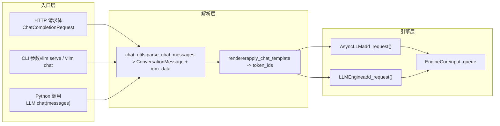

# Kapitel 3: Request-Eingang: Der vollständige Pfad von HTTP/CLI zum EngineCore

Im vorherigen Kapitel haben wir die beiden zentralen Datenstrukturen innerhalb der Engine analysiert, Request und KVCacheSpec, und verstanden, wie logische Sequenzen und physische Speicherblöcke entkoppelt werden. Doch wie gelangt ein HTTP-Request-Body oder ein Python-String tatsächlich durch den API Server, das Chat-Template und die multimodale Verarbeitung und wird schließlich zu einem EngineCoreRequest? Dieses Kapitel verfolgt diesen Pfad vollständig und zeigt, wie die drei Eingangspfade – synchrones CLI, asynchrone API und die Offline-LLM-Klasse – im selben Engine-Kern zusammenlaufen.

# 3.1 Der Konvergenzpunkt der drei Eingangspfade: AsyncLLMEngine und LLMEngine

Bevor wir in die Request-Analyse eintauchen, müssen wir zunächst die Topologie der drei Eingangspfade verstehen. vLLM bietet drei Nutzungsarten:`vllm serve`den gestarteten OpenAI-kompatiblen HTTP-Dienst, das Kommandozeilen-`vllm`Werkzeug sowie die direkte Instanziierung der`LLM`Klasse in Python für Offline-Inferenz. Sie erscheinen unabhängig, teilen sich aber tatsächlich denselben Engine-Kern.

Betrachten wir zunächst den Alias-Mechanismus des asynchronen API-Pfads.

[FACT:vllm/engine/async_llm_engine.py:7-7]

Diese Datei ist so kurz, dass sie kaum wie ein Modul wirkt – sie tut nur eine Sache: den`AsyncLLMEngine`Alias auf`vllm.v1.engine.async_llm.AsyncLLM`zeigen zu lassen. Dies ist eine typische Spur einer Architekturmigration. Im vLLM-v0-Zeitalter war`AsyncLLMEngine`eine große und komplexe Klasse; nach dem Rewrite der v1-Architektur übernahm die neue`AsyncLLM`dieselbe Verantwortung. Um bestehenden Benutzercode nicht zu brechen, behält vLLM den alten Modulpfad als Kompatibilitätsschicht bei.

> **[Design Inference & Architectural Trade-offs]**
> Dieses Muster „alter Pfad als Alias auf neue Implementierung“ tritt in vLLM wiederholt auf (etwa die Deprecation-Warnung von`api_server.py`), was zeigt, dass das Projekt bei der Migration von v0 zu v1 eine schrittweise Strategie verfolgt: Neuer Code verwendet neue Pfade, alter Code wirft keine Fehler, erhält aber Warnungen, sodass Benutzern ausreichend Migrationsfenster bleibt.

Betrachten wir nun den Eingang des Offline-Pfads.

[FACT:vllm/entrypoints/llm.py:344-346]

`LLM.__init__`ruft schließlich`LLMEngine.from_engine_args`auf und übergibt`UsageContext.LLM_CLASS`. Diese`UsageContext`Enum ist der Schlüssel zur Unterscheidung der Eingangspfade – sie lässt die Engine wissen, ob sie im Offline-Batch-Modus oder im Online-Service-Modus läuft, und passt entsprechend Logging, Metriken und Ressourcenverwaltungsstrategien an.

[FACT:vllm/entrypoints/llm.py:357-359]

Beachten Sie hier die Zuweisung von`self.renderer = self.llm_engine.renderer`und`self.input_processor = self.llm_engine.input_processor`. Die Offline-`LLM`Klasse implementiert das Chat-Template-Rendering nicht selbst, sondern verwendet die engine-interne`renderer`wieder. Das bedeutet, dass die Parsing-Logik des Chat-Templates im Offline- und Online-Pfad derselbe Code ist, nur der Aufrufzeitpunkt unterscheidet sich.

Die Konvergenzbeziehung der drei Pfade lässt sich durch das folgende Datenflussdiagramm darstellen.

Dieses Diagramm offenbart ein zentrales Design: Egal ob die Anfrage über HTTP, CLI oder Python kommt,`chat_utils`ist der einzige Eingang für multimodale und Chat-Template-Verarbeitung. Es vereinheitlicht heterogene Eingabeformate zu einer`ConversationMessage`Liste plus`MultiModalDataDict`und übergibt sie dann an den Renderer zur Erzeugung der Token-Sequenz.

# 3.2 chat_utils: Von heterogenen Nachrichten zu einer einheitlichen Dialogstruktur

`chat_utils.py`ist das komplexeste Modul der gesamten Request-Eingangsschicht. 2264 Zeilen Code verarbeiten alle Eingabeformen wie OpenAI-kompatibles Format, benutzerdefinierte Erweiterungen, multimodale Einbettungen und Tool-Aufrufe. Seine Kernaufgabe lässt sich in einem Satz zusammenfassen: eine beliebige vom Benutzer übergebene Nachrichtenliste in eine`ConversationMessage`Liste zu normalisieren, die das Chat-Template verstehen kann, und gleichzeitig multimodale Daten in eine separate`MultiModalDataDict`zu extrahieren.

## Intuitives Modell: Übersetzer und Gepäck-Sortierer

Stellen Sie sich`chat_utils`als Übersetzer und Gepäck-Sortierer am Flughafen vor. Reisende (Benutzer) kommen aus verschiedenen Ländern (OpenAI-Format, benutzerdefiniertes Format, Harmony-Format) und sprechen verschiedene Sprachen. Der Übersetzer übersetzt zunächst die Worte aller in eine einheitliche Arbeitssprache (`ConversationMessage`), während das von Passagieren aufgegebene Gepäck (Bilder, Audio, Video) auf separate Förderbänder sortiert wird (`MultiModalDataDict`), mit einem Etikett (UUID) versehen wird und schließlich Mensch und Gepäck getrennt in dasselbe Flugzeug (Engine) gebracht werden.

Ohne diese Schicht müsste die Engine die Details jedes Eingabeformats verstehen, die Extraktionslogik für multimodale Daten würde sich über die einzelnen Einstiegspunkte verteilen, und jede neue Formatunterstützung würde Änderungen am Engine-Kern erfordern.

## Datenstruktur: Die Zwei-Klassen-Zusammenarbeit von Tracker und Parser

`chat_utils`Der Kern von  besteht in der Zusammenarbeit zweier Klassengruppen:`BaseMultiModalItemTracker`und seine Unterklassen sind für das „Verfolgen" multimodaler Elemente zuständig,`BaseMultiModalContentParser`und seine Unterklassen sind für das „Parsen" der Inhaltsabschnitte zuständig.

Betrachten wir zunächst das Feldlayout des Trackers.

[FACT:vllm/entrypoints/chat_utils.py:598-601]

`_items_by_modality`ist ein`defaultdict[str, list[_T]]`, das die zu verarbeitenden Elemente nach Modalität (image, audio, video usw.) gruppiert speichert.`_modality_order`hingegen zeichnet speziell für die`vision_chunk`-Modalität die ursprüngliche Modalität jedes Chunks auf (image oder video), da das einheitliche visuelle Chunk-Modell beide auf`vision_chunk`abbildet, die nachfolgende Verarbeitung jedoch den ursprünglichen Typ kennen muss.

[FACT:vllm/entrypoints/chat_utils.py:613-615]

`use_unified_vision_chunk_modality`ist ein`cached_property`, das das`use_unified_vision_chunk`-Flag aus der HuggingFace-Konfiguration liest. Die Verwendung von`cached_property`anstelle eines normalen Attributs liegt daran, dass diese Prüfung bei jedem`add`-Aufruf ausgelöst wird und das Caching wiederholten`getattr`-Overhead vermeidet.

Die`add`-Methode des Trackers ist der zentrale Einstiegspunkt.

[FACT:vllm/entrypoints/chat_utils.py:656-684]

`add`Die`_validate_add`-Methode ruft zunächst`prompt_embeds`zur Validierung auf und speichert dann die Elemente je nachdem, ob die einheitliche visuelle Chunk-Modalität verwendet wird, unter verschiedenen Schlüsseln. Beachten Sie die`_items_by_modality["prompt_embeds"]`-Sonderbehandlung: Sie hängt direkt an`None`an und gibt

`_validate_add`zurück, da vorberechnete Einbettungen nicht den HF-Prozessor durchlaufen und keine Platzhalterzeichenfolge haben.

[FACT:vllm/entrypoints/chat_utils.py:686-721]

Die Validierungslogik in`enable_mm_embeds=True`verdient eine genauere Betrachtung.`_embeds`Hier gibt es einen subtilen Zweig: Wenn

## und das Pro-Prompt-Limit dieser Modalität 0 ist und die ursprüngliche Modalität auf

endet, wird die Mengenvalidierung übersprungen. Dies dient dazu, Embedding-Eingaben die Umgehung der Mengenbeschränkung der ursprünglichen Modalität zu ermöglichen – Embeddings sind vorberechnet und belegen keine Verarbeitungsressourcen der ursprünglichen Modalität.`parse_chat_messages`Szenariogesteuert: Wie eine Chat-Anfrage mit Bild analysiert wird

[FACT:vllm/entrypoints/chat_utils.py:2161-2197]

`parse_chat_messages`Angenommen, ein Benutzer sendet eine Chat-Anfrage mit einer Bild-URL und Text.`MultiModalItemTracker`ist der Einstiegspunkt des synchronen Pfads.`_parse_chat_message_content`erstellt`_postprocess_messages`, durchläuft jede Nachricht und ruft`mm_tracker.resolve_items()`auf, ruft schließlich

`_parse_chat_message_content`zur Verarbeitung der Tool-Aufrufparameter auf und materialisiert dann die multimodalen Daten über

[FACT:vllm/entrypoints/chat_utils.py:2007-2029]

.`None`ist für die Analyse einer einzelnen Nachricht zuständig.`_parse_chat_message_content_parts`Es normalisiert zunächst content:`wrap_dicts`wird zu einer leeren Liste, eine Zeichenfolge zu einem einzelnen Text-part. Dann wird`content_format == "openai"`aufgerufen, wobei der

`_parse_chat_message_content_parts`-Parameter von

[FACT:vllm/entrypoints/chat_utils.py:1814-1853]

bestimmt wird – dies entscheidet, ob die Ausgabe eine strukturierte Wörterbuchliste oder eine zusammengefügte Zeichenfolge ist.`_parse_chat_message_content_part`durchläuft jeden part.`wrap_dicts=False`Jeder part wird durch`wrap_dicts=True`verarbeitet. Wenn

`_parse_chat_message_content_part`, wird schließlich Text und Platzhalter zu einer einzelnen Zeichenfolge zusammengefügt; wenn

[FACT:vllm/entrypoints/chat_utils.py:1875-1884]

, wird eine strukturierte Wörterbuchliste zurückgegeben.`wrap_dicts`ist der Kern der Verteilung.`_parse_chat_message_content_mm_part`Für reine Text-parts wird zuerst die Platzhalter-Erhaltungsprüfung durchgeführt, dann wird basierend auf

[FACT:vllm/entrypoints/chat_utils.py:1690-1723]

`_parse_chat_message_content_mm_part`das Rückgabeformat bestimmt. Für strukturierte parts wird`MM_PARSER_MAP`aufgerufen, um Typ und Inhalt zu extrahieren.`uuid is None`sucht die entsprechende Parsing-Funktion über

[FACT:vllm/entrypoints/chat_utils.py:1731-1733]

. Beachten Sie die Bedingung von`part_type is None`– wenn der Benutzer eine UUID bereitstellt, bedeutet dies, dass die Mediendaten möglicherweise nicht im Anfragetext enthalten sind (auf andere Weise hochgeladen), und in diesem Fall wird der folgende direkte URL-Feld-Zweig genommen.`uuid is not None`Wenn

oder`_parse_chat_message_content_part`, versucht der Code, das URL-Feld direkt aus dem part zu extrahieren. Diese „lockere Analyse" dient der Kompatibilität mit Clients, die das OpenAI-Format nicht strikt befolgen.`mm_parser`Zurück zu

[FACT:vllm/entrypoints/chat_utils.py:1923-1968]

, werden parts vom Medientyp an die entsprechenden`parse_*`-Methoden verteilt.`tracker.add`Jeder Medientyp ruft die entsprechende`interleave_strings`-Methode auf, die intern`None`。

[FACT:vllm/entrypoints/chat_utils.py:1984-1999]

`prompt_embeds`aufruft, um das Element zum Tracker hinzuzufügen, und eine Platzhalterzeichenfolge zurückgibt. Schließlich wird basierend auf`interleave_strings`entschieden, ob der Platzhalter oder`PROMPT_EMBEDS_PLACEHOLDER_TOKEN`zurückgegeben wird. Die Behandlung von`missing_placeholders`ist speziell: Unabhängig von

## wird

zurückgegeben. Der Kommentar erklärt den Grund – prompt_embeds werden an Token-Offsets angehängt, die Position ist wichtig, und wenn die`AsyncMultiModalItemTracker`-Vorabauffüllungslogik durchlaufen würde, würde die Reihenfolge durcheinandergebracht.`AsyncMultiModalContentParser`Unterschiede des asynchronen Pfads`resolve_items`。

[FACT:vllm/entrypoints/chat_utils.py:906-952]

Der asynchrone Pfad verwendet`asyncio.gather`und`return_exceptions=True`. Der Kernunterschied liegt in

## . Die asynchrone Version verwendet

> **[Design Inference & Architectural Trade-offs]**
> lässt alle Aufgaben entweder abschließen oder fehlschlagen, bevor einheitlich eine Ausnahme ausgelöst wird, um zu vermeiden, dass beim ersten Fehler laufende Netzwerkanfragen aufgegeben werden.`BaseMultiModalItemTracker`Designüberlegung: Warum Tracker und Parser getrennt sind

# 〔Design-Inferenz und Architektur-Abwägung〕

`chat_utils`Die Trennung von Tracker und Parser ist ein nachdenkenswertes Design. Der Tracker ist für das „Zustandsmanagement" zuständig – Aufzeichnung, wie viele Elemente jede Modalität hat, Validierung von Mengenbeschränkungen, Pflege der ursprünglichen Modalitätsreihenfolge von vision_chunk. Der Parser ist für die „Inhaltsextraktion" zuständig – Abrufen von Bildern von URLs, Dekodieren von Einbettungen aus base64, Verarbeitung von Audioformatkonvertierungen. Diese Trennung ermöglicht es dem synchronen und asynchronen Pfad, die Tracking-Logik zu teilen (`ConversationMessage`ist eine abstrakte Basisklasse), und nur auf der Parser-Ebene zu divergieren. Wenn sie zu einer Klasse zusammengefasst würden, würden die Unterschiede zwischen synchron und asynchron in die Tracking-Logik eindringen, was zu Code-Duplikation und komplexerem Zustandsmanagement führen würde.`MultiModalDataDict`3.3 Von der Nachricht zum Token: Die Übergabe von renderer an EngineCore

## Die von

`parse_chat_messages`Nach der Rückgabe ruft der Aufrufer (z. B.`OpenAIServingChat`)`conversation`und`mm_data`an den Renderer übergibt. Der Renderer wendet das Chat-Template an, rendert die`ConversationMessage`-Liste in Text und tokenisiert sie in eine Token-ID-Sequenz. Multimodale Platzhalter (z. B.`<##IMAGE##>`) werden nach dem Tokenisieren durch modellspezifische Platzhalter-Token ersetzt.

Nach dem Rendern wird die Anfrage als`EngineCoreRequest`verpackt und über`AsyncLLM.add_request()`oder`LLMEngine.add_request()`an die Eingabewarteschlange von EngineCore übermittelt.

[FACT:vllm/entrypoints/llm.py:420-484]

Die Offline-`LLM.generate`-Methode zeigt diese Kette: Sie validiert zunächst`runner_type`, ruft die Standard-Sampling-Parameter ab und ruft dann`_run_completion`。`_run_completion`auf. Intern wird der Renderer aufgerufen, um den Prompt zu rendern, und die Anfrage dann über`llm_engine`übermittelt.

[FACT:vllm/entrypoints/llm.py:615-708]

`LLM.chat`Die`messages`-Methode zeigt den Chat-Pfad: Sie empfängt die`_run_chat`-Liste und ruft`parse_chat_messages`auf, was intern

## Designüberlegung: Warum der Renderer innerhalb der Engine

> **[Design Inference & Architectural Trade-offs]**
> `LLM.__init__`In`self.renderer = self.llm_engine.renderer`offenbart die Zeile`self.renderer.warmup(ChatParams(...))`eine wichtige Designentscheidung: Der Renderer gehört zur Engine, nicht zur Eingangsschicht. Das bedeutet, dass das Laden, Cachen und Vorwärmen des Chat-Templates (`LLM`) während der Engine-Initialisierung erfolgen, und die Eingangsschicht nur der Aufrufer ist. Der Vorteil: Offline-`AsyncLLM`und Online-

## teilen dieselbe Renderer-Implementierung und denselben Cache, wodurch wiederholtes Laden von Tokenizer und Chat-Template vermieden wird. Gleichzeitig kann das Vorwärmen des Renderers beim Engine-Start erfolgen, um Kaltstart-Latenz bei der ersten Anfrage zu vermeiden.

`_postprocess_messages`Fehlerbehebung und Produktions-Fallstricke

[FACT:vllm/entrypoints/chat_utils.py:2118-2158]

Die Verarbeitung von Tool-Aufrufparametern in`tool_calls`ist eine typische Produktionsfalle.`arguments`Wenn eine Assistant-Nachricht`arguments`enthält, kann das

-Feld ein JSON-String, ein Dictionary oder ungültiges JSON sein. Der Code versucht, den JSON-String zu parsen; bei Fehlschlag wird eine Warnung protokolliert und zwangsweise in ein leeres Objekt konvertiert. Der Kommentar erklärt den Grund: Fehlerhaft formatierte

[FACT:vllm/entrypoints/chat_utils.py:1856-1872]

existieren im Konversationsverlauf; wenn die Anfrage hier fehlschlägt, wird jede nachfolgende Runde fehlschlagen und die Konversation kann nicht wiederhergestellt werden. Dies ist ein durchdachtes Fehlertoleranz-Design – lieber soll das Modell leere Tool-Parameter sehen, als dass die gesamte Konversation blockiert.`enable_prompt_embeds`Eine weitere Falle ist der Injektionsschutz für reservierte Platzhalter.`PROMPT_EMBEDS_PLACEHOLDER_TOKEN`Wenn`_reject_reserved_placeholder_in_text`aktiviert ist, wird

[FACT:vllm/entrypoints/chat_utils.py:1889-1892]

als unteilbares spezielles Token registriert. Wenn der Benutzertext zufällig diese literale Sequenz enthält, kodiert der Tokenizer sie als dieselbe Token-ID, und der Renderer hält sie fälschlicherweise für einen Konkatenationspunkt, wodurch der Aufrufer durch reinen Textinhalt die Konkatenationsposition verschieben oder injizieren kann.`isinstance(part, str)`lehnt solche Eingaben bei der Text-Part-Analyse ab und schließt diese Sicherheitslücke.

# Beachten Sie, dass diese Prüfung sowohl im

-Zweig als auch im strukturierten Text-Zweig aufgerufen wird, um sicherzustellen, dass alle Textpfade geschützt sind.`LLM`Kapitelzusammenfassung`chat_utils`Dieses Kapitel verfolgt das erste Segment des Pfades, über den eine Anfrage von außen in das System gelangt. Drei Eingangspfade – HTTP API, CLI und die Offline-`BaseMultiModalItemTracker`-Klasse – münden schließlich alle in die multimodale Parsing-Schicht von`BaseMultiModalContentParser`.`parse_chat_messages`ist für die Zustandsverwaltung zuständig,`ConversationMessage`für die Inhaltsextraktion. Die Trennung beider ermöglicht es, dass synchrone und asynchrone Pfade dieselbe Tracing-Logik teilen.`MultiModalDataDict`normalisiert heterogene Nachrichten in eine`EngineCoreRequest`-Liste und

# und übergibt sie an den engine-internen Renderer, der Chat-Template-Rendering und Tokenisierung durchführt. Schließlich wird die Anfrage als

verpackt und an die Eingabewarteschlange von EngineCore übermittelt.`_parse_chat_message_content_mm_part`Kapitel-Reflexion und Selbsttest`uuid is None`F1: In`if isinstance(part_type, str) and part_type in MM_PARSER_MAP:`, wenn die Bedingung

**entfernt würde (d. h. geändert zu**：`uuid is None`), in welchen Szenarien würde dies zu Problemen führen?`MM_PARSER_MAP[part_type](part)`Referenzanalyse`image_url`Die Bedingung`None`existiert, um das Szenario zu behandeln, in dem „der Benutzer eine UUID bereitstellt, aber die Mediendaten nicht im Anfragekörper enthalten sind". Wenn der Benutzer eine UUID bereitstellt, wurden die Mediendaten möglicherweise bereits auf andere Weise hochgeladen (z. B. vorab in den Medien-Cache). In diesem Fall enthält der Part im Anfragekörper möglicherweise nur die UUID und keine tatsächliche URL oder Daten. Wenn diese Bedingung entfernt würde, würde der Code versuchen, über`parse_image(None, uuid)`zu parsen, aber der Part enthält möglicherweise kein entsprechendes Datenfeld (z. B. ist`_connector.fetch_image(None)`leer), was zu`uuid is not None`-Inhalten führt. Schwerwiegender ist, dass das nachfolgende[FACT:vllm/entrypoints/chat_utils.py:1713-1723][FACT:vllm/entrypoints/chat_utils.py:1731-1733]。

Q2: `AsyncMultiModalItemTracker.resolve_items`aufruft, was unnötige Netzwerkanfragen oder Ausnahmen auslösen kann.`asyncio.gather(..., return_exceptions=True)`Der`return_exceptions=False`-Zweig hingegen folgt dem direkten Feld-Extraktionspfad und behandelt den Fall „UUID vorhanden, aber keine Daten" korrekt. Siehe`False`und

**.**：`return_exceptions=False`verwendet`asyncio.gather`anstelle des standardmäßigen`return_exceptions=True`Alle Aufgaben entweder abschließen oder fehlschlagen lassen und erst dann einheitlich prüfen, um sicherzustellen, dass keine Aufgabe verwaist. Der Kommentar erläutert dies ausdrücklich: „Gathering with return_exceptions=True lets every task finish (or itself fail) before we raise, instead of abandoning still-in-flight fetches (real network/thread-pool work) the moment the first one fails." Siehe[FACT:vllm/entrypoints/chat_utils.py:924-931]。

Q3: `_postprocess_messages`, wenn`arguments`ungültiges JSON ist, entscheidet sich der Code dafür, zwangsweise in ein leeres Objekt umzuwandeln, anstatt eine Ausnahme auszulösen. Wenn stattdessen eine Ausnahme ausgelöst würde, in welchem Produktionsszenario würde dies zu einem nicht wiederherstellbaren Dialogzustand führen?

**Referenzanalyse**：`arguments`Das Feld existiert im Dialogverlauf (der`tool_calls`der Assistant-Nachricht). Wenn das Modell in einer Dialogrunde ein fehlerhaft formatiertes`arguments`generiert, wird dieser Fehler im Dialogverlauf gespeichert. Wenn`_postprocess_messages`beim Parsen des Verlaufs eine Ausnahme auslöst, schlägt jede nachfolgende Anfrage aufgrund dieses Fehlers im Verlauf fehl – selbst wenn die Eingabe der aktuellen Runde vollständig korrekt ist. Der Benutzer kann diesen Dialog nicht fortsetzen und muss die gesamte Sitzung aufgeben und neu beginnen. Die erzwungene Umwandlung in ein leeres Objekt ermöglicht es dem Dialog fortzufahren, und das Modell generiert nach dem Anzeigen der leeren Werkzeugparameter einen korrekten Aufruf neu. Der Kommentar erklärt dies: „A malformed arguments string lives in conversation history, so failing the request here would fail every subsequent turn too and leave the conversation unrecoverable." Siehe[FACT:vllm/entrypoints/chat_utils.py:2124-2139]。

Das nächste Kapitel führt in den Scheduler ein und zeigt, wie EngineCore diese Anfragen mit kontinuierlichem Batching und speicherbewussten Strategien orchestriert.

Bis hierhin hat die Anfrage die normalisierte Umwandlung von externer Eingabe zu EngineCoreRequest abgeschlossen und den Eingang des Engine-Kerns erreicht. Doch nach dem Eintritt wird die Anfrage nicht sofort ausgeführt – die Engine muss entscheiden, welche Anfragen in jedem Schritt verarbeitet werden und wie die begrenzten VRAM-Ressourcen zugewiesen werden. Das nächste Kapitel taucht in die Scheduling-Schleife von EngineCore ein, analysiert, wie der Scheduler im kontinuierlichen Batching Durchsatz und Latenz abwägt, und wie chunked prefill, prefix caching und KV-Block-Zuweisung zusammenwirken.
