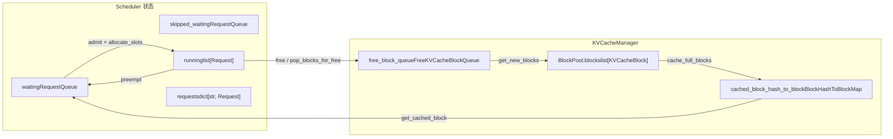
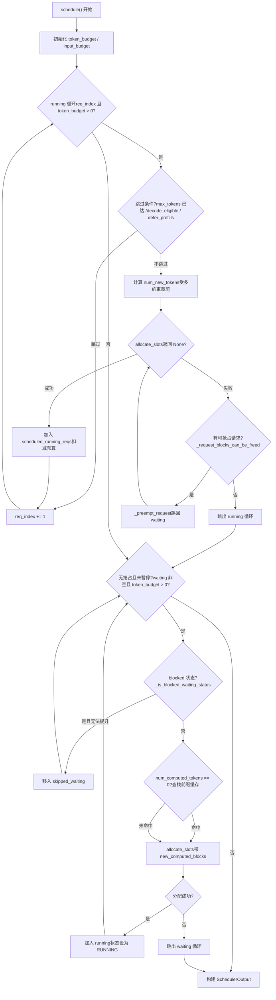

# Kapitel 4: Scheduler: Kontinuierliches Batching und speicherbewusste Anfrage-Orchestrierung

Nachdem Anfragen in die Eingabewarteschlange von EngineCore gelangt sind, werden sie nicht sofort ausgeführt. Welche Anfragen in jedem Schritt verarbeitet werden, wie viel Token-Budget jeder Anfrage zugewiesen wird und wer bei unzureichendem VRAM vorrangig geopfert wird – diese Entscheidungen sind in der`Scheduler.schedule()`Methode konzentriert. Dieses Kapitel beginnt mit den Datenstrukturen des Schedulers und verfolgt, wie ein`schedule()`Aufruf die waiting-Warteschlange, die running-Liste und den KV-Cache-Pool zu einem ausführbaren Batch organisiert.

# 4.1 Datenstrukturen des Schedulers: Drei Warteschlangen und ein VRAM-Pool

Die Kernfrage, die der Scheduler beantworten muss, lautet:**Welche Anfragen sollen in diesem Schritt um wie viele Token voranschreiten, unter einem begrenzten Token-Budget und KV-Block-Budget?**Um dies zu verstehen, muss man zunächst erkennen, welche Zustände er verwaltet.

Der Scheduler unterhält drei Arten von Anfrage-Containern.`self.requests`ist ein globales Dictionary,`req_id -> Request`, die einzige Wahrheitsquelle für alle aktiven Anfragen[FACT:vllm/v1/core/sched/scheduler.py:208-209]。`self.waiting`und`self.skipped_waiting`sind zwei Prioritätswarteschlangen; erstere enthält Anfragen, die normal auf Scheduling warten, letztere enthält Anfragen, die aufgrund asynchroner Abhängigkeiten oder Einschränkungen vorübergehend nicht geplant werden können (z. B. Warten auf remote KV, Warten auf Kompilierung der strukturierten Ausgabegrammatik)[FACT:vllm/v1/core/sched/scheduler.py:208-209]。`self.running`ist eine gewöhnliche Liste, die Anfragen enthält, die bereits in den Ausführungszustand eingetreten sind und KV-Blöcke halten[FACT:vllm/v1/core/sched/scheduler.py:208-209]。

Hier gibt es ein leicht zu übersehendes Design:`max_num_running_reqs`und`max_num_active_reqs`sind zwei verschiedene Obergrenzen. Erstere stammt aus`max_num_seqs`und bestimmt die Anzahl der Slots des Model Runners; letztere stammt aus`max_num_active_seqs`und begrenzt nur die Anzahl der Anfragen, die in RUNNING eintreten können, standardmäßig gleich der ersteren[FACT:vllm/v1/core/sched/scheduler.py:123-131]. Diese Trennung ermöglicht es, die tatsächliche Batch-Größe für paralleles Decoding zu reduzieren, ohne die CUDA-Graph-Capture-Kapazität zu verkleinern.

Die VRAM-Seite wird einheitlich von`KVCacheManager`verwaltet, das intern`BlockPool`。`BlockPool`hält. Der Kern von`self.blocks`ist`KVCacheBlock`(eine Liste aller`free_block_queue`) und[FACT:vllm/v1/core/block_pool.py:171-177](eine doppelt verkettete Liste freier Blöcke in Eviction-Reihenfolge). Beachten Sie die Existenz von`null_block`: Es ist der erste Block, der vom Kopf der Freiliste entnommen wird,`is_null=True`, der Referenzzähler wird nicht in die reguläre Wartung einbezogen und dient speziell als Platzhalter[FACT:vllm/v1/core/block_pool.py:183-187]. Wenn eine bestimmte Token-Position einer Anfrage keinen echten KV-Block benötigt (z. B. eine durch ein Sliding Window übersprungene Position), wird dieser Null-Block in die Block-Tabelle eingetragen.

Die Indexstruktur des Prefix-Caching ist`BlockHashToBlockMap`, es bildet`BlockHashWithGroupId`auf ein`KVCacheBlock`oder ein`{block_id: KVCacheBlock}`Dictionary ab[FACT:vllm/v1/core/block_pool.py:56-59]. Warum Union-Typen verwendet werden? Der Kommentar gibt die Antwort: Die meisten Hashes entsprechen nur einem Block, und die Verwendung eines Wörterbuchs würde unnötigen GC-Overhead verursachen; erst wenn derselbe Hash von mehreren Blöcken geteilt wird, wird zu einem Wörterbuch hochgestuft[FACT:vllm/v1/core/block_pool.py:56-59]. Dies ist ein typischer Kompromiss zwischen Typkomplexität und Laufzeitoverhead.

`KVCacheBlocks`ist das Schnittstellenobjekt zwischen dem Scheduler und dem KV-Cache-Manager, das die internen Datenstrukturen verbirgt. Seine`blocks`Felder sind`tuple[Sequence[KVCacheBlock], ...]`, wobei die äußere Dimension die KV-Cache-Gruppe und die innere die Blocksequenz ist[FACT:vllm/v1/core/kv_cache_manager.py:41-54]. Der Kommentar erklärt ausdrücklich, warum Blöcke nicht als äußere Dimension verwendet werden: Das würde voraussetzen, dass alle Gruppen die gleiche Anzahl von Blöcken haben, während in Zukunft möglicherweise unterschiedliche Blockgrößen für verschiedene Gruppen konfiguriert werden[FACT:vllm/v1/core/kv_cache_manager.py:43-48]。



Diese Abbildung verankert den Datenfluss zwischen dem Scheduler und dem Speicherpool: Anfragen in der waiting-Warteschlange gelangen über`allocate_slots`in den running-Zustand, running-Anfragen kehren bei Preemption in die waiting-Warteschlange zurück, freigegebene Blöcke gehen zurück in die Freiliste, und die Prefix-Cache-Hash-Tabelle ist der Einstiegspunkt für waiting-Anfragen, die den Cache treffen.

# 4.2 schedule() Hauptablauf: running zuerst, waiting als Ergänzung, Preemption als Fallback

`schedule()`ist die Kernmethode des gesamten Schedulers und gibt ein`SchedulerOutput`zurück, das beschreibt, was in diesem Schritt ausgeführt werden soll. Der Kommentar am Anfang der Methode verdeutlicht die Designphilosophie: Im Scheduler gibt es keine Unterscheidung zwischen „Decode-Phase" und „Prefill-Phase", jede Anfrage hat nur`num_computed_tokens`und`num_tokens_with_spec`, und die Aufgabe des Schedulers ist es, Ersteres an Letzteres heranzuführen[FACT:vllm/v1/core/sched/scheduler.py:559-568]. Diese einheitliche Perspektive ist die Grundlage dafür, dass chunked prefill, prefix caching und spekulative Dekodierung koexistieren können.

## 4.2.1 Budget-Initialisierung und Schwellenwertberechnung

Vor dem Eintritt in die Hauptschleife setzt der Scheduler zwei Budgets:`token_budget`wird initialisiert auf`max_num_scheduled_tokens`，`input_budget`wird initialisiert auf`max_num_batched_tokens` [FACT:vllm/v1/core/sched/scheduler.py:577-580]. Beide sind normalerweise gleich, aber wenn das Modell möglicherweise Token im Batch anhängt (z. B. bei spekulativer Dekodierung),`max_num_scheduled_tokens`kleiner als`max_num_batched_tokens`, und die Differenz ist der Platz, der für Draft-Token reserviert ist.

`long_prefill_token_threshold`Die Behandlung von verdient eine separate Betrachtung. Ihre Aufgabe ist es zu verhindern, dass ein langer Prefill andere Anfragen aushungert, aber wenn derzeit nur eine Anfrage vorhanden ist, wird niemand ausgehungert, daher wird der Schwellenwert auf null gesetzt[FACT:vllm/v1/core/sched/scheduler.py:606-616]. Wenn`adaptive_long_prefill_threshold`aktiviert ist, wird der Schwellenwert zusätzlich auf`input_budget // num_eligible_reqs`angehoben, um sicherzustellen, dass das Budget einer einzelnen Anfrage nicht unter den fairen Anteil gedrückt wird[FACT:vllm/v1/core/sched/scheduler.py:617-622]。

## 4.2.2 Scheduling-Schleife für running-Anfragen

Die Hauptschleife beginnt am Kopf von`self.running`und durchläuft,`req_index`ist der Cursor[FACT:vllm/v1/core/sched/scheduler.py:624-627]. Für jede Anfrage werden zunächst eine Reihe von Überspringungsprüfungen durchgeführt:

- Bei asynchronem Scheduling: Wenn der Ausgabeplatzhalter der Anfrage anzeigt, dass sie bereits`max_tokens`erreicht hat, überspringen, um einen zusätzlichen Schritt zu vermeiden[FACT:vllm/v1/core/sched/scheduler.py:631-645]。
- Im V2 + PP + asynchronen Szenario: Wenn der aktuelle Schritt noch nicht`next_decode_eligible_step`erreicht hat, überspringen, um mit dem Sampling-Token-Broadcast-Rhythmus auf der Worker-Seite übereinzustimmen[FACT:vllm/v1/core/sched/scheduler.py:647-651]。
- Wenn DP-Prefill-Balancing aktiviert ist, werden Prefill-Chunks auf nicht rhythmisch ausgerichteten Schritten verzögert[FACT:vllm/v1/core/sched/scheduler.py:653-657]。

Nach den Überspringungsprüfungen wird berechnet, um wie viele Token diese Anfrage in diesem Schritt vorankommen kann:

```
num_new_tokens = request.num_tokens_with_spec
               + request.num_output_placeholders
               - request.num_computed_tokens
```

Dann wird es nacheinander durch`long_prefill_token_threshold`、`token_budget`、`input_budget - draft_slots`und`max_model_len`eingeschränkt[FACT:vllm/v1/core/sched/scheduler.py:670-688]. Wenn die Anfrage Encoder-Eingaben enthält, muss sie zusätzlich durch`_try_schedule_encoder_inputs`angepasst werden[FACT:vllm/v1/core/sched/scheduler.py:700-712]。

Als Nächstes folgt der entscheidendste Schritt: KV-Blöcke zuweisen.`allocate_slots`wird in eine`while True`-Schleife eingebettet[FACT:vllm/v1/core/sched/scheduler.py:742-747]. Wenn`None`zurückgegeben wird, bedeutet dies, dass der Speicher nicht ausreicht, und der Scheduler beginnt mit der Preemption: Nach der Strategie wird ein Opfer ausgewählt (die PRIORITY-Strategie wählt die niedrigste Priorität, die FCFS-Strategie wählt das Ende der running-Liste)[FACT:vllm/v1/core/sched/scheduler.py:761-767], ruft`_preempt_request`auf, um es zurück in die waiting-Warteschlange zu werfen, und versucht dann die Zuweisung erneut[FACT:vllm/v1/core/sched/scheduler.py:801-806]. Wenn das Opfer die aktuelle Anfrage selbst ist, bedeutet dies, dass es keine preemptierbaren Objekte mehr gibt, die Schleife wird verlassen und die aktuelle Anfrage kann ebenfalls nicht geplant werden[FACT:vllm/v1/core/sched/scheduler.py:807-813]。

In der Preemption-Logik gibt es ein raffiniertes Detail: Unter der PRIORITY-Strategie, wenn die preemptierte Anfrage bereits in`scheduled_running_reqs`ist (d. h. in diesem Schritt wurden bereits Ressourcen für sie zugewiesen), müssen ihr Token-Budget, ihre Blöcke, spekulative Token und das Encoder-Budget vollständig zurückgegeben werden[FACT:vllm/v1/core/sched/scheduler.py:779-797]. Dies gewährleistet die Konsistenz des Budget-Buchs.

Nach erfolgreicher Zuweisung wird die Anfrage zu`scheduled_running_reqs`hinzugefügt, Blöcke und Token-Anzahl werden aufgezeichnet, das Budget wird reduziert[FACT:vllm/v1/core/sched/scheduler.py:815-823]. Token im Zusammenhang mit spekulativer Dekodierung werden hier zugeschnitten und aufgezeichnet[FACT:vllm/v1/core/sched/scheduler.py:825-841]。

## 4.2.3 Zulassung von waiting-Anfragen

Nach dem Ende der running-Schleife, wenn in diesem Schritt keine Preemption stattgefunden hat und der Scheduler nicht pausiert ist, wird mit der Verarbeitung der waiting-Warteschlange begonnen[FACT:vllm/v1/core/sched/scheduler.py:868-872]. Vor der Zulassung werden zwei Obergrenzen geprüft:`max_num_active_reqs`und`input_budget` [FACT:vllm/v1/core/sched/scheduler.py:873-879]。

Das Scheduling von waiting-Anfragen hat im Vergleich zu running einen zusätzlichen Prefix-Cache-Suchschritt. Wenn`request.num_computed_tokens == 0`, wird`_get_local_prefix_cache_hit`aufgerufen, um einen lokalen Cache-Treffer zu suchen[FACT:vllm/v1/core/sched/scheduler.py:932-939]. Wenn ein KV-Connector konfiguriert ist, wird auch ein Remote-Cache-Treffer abgefragt[FACT:vllm/v1/core/sched/scheduler.py:942-954]。

Hier gibt es eine feine Logik zur Behandlung von Konflikten zwischen lokalen und Remote-Treffern. Ein lokaler Treffer ist möglicherweise nicht blockausgerichtet (`partial_tail`), und wenn ein Remote-Treffer den lokalen vollständigen Treffer strikt übertrifft, wird das Ende des lokalen Teilblocks verworfen, damit das Remote-Laden es überschreibt, um Copy-on-Write zu vermeiden[FACT:vllm/v1/core/sched/scheduler.py:977-988]. Andernfalls wird das lokale Ende beibehalten und nichts Externes geladen[FACT:vllm/v1/core/sched/scheduler.py:989-995]。

Nach erfolgreicher Zulassung wird die Anfrage aus der waiting-Warteschlange entfernt, der Status auf RUNNING gesetzt und zur running-Liste hinzugefügt[FACT:vllm/v1/core/sched/scheduler.py:1263-1319]. Wenn sie nach diesem Schritt noch im Prefill ist (`num_computed_tokens + num_new_tokens < request.num_tokens`), wird sie zur`_inflight_prefills`-Menge hinzugefügt[FACT:vllm/v1/core/sched/scheduler.py:1326-1328]。



Dieses Kontrollflussdiagramm deckt die beiden großen Schleifen und den Preemption-Zweig von`schedule()`ab. Beachten Sie den Preemption-Wiederholungspfad nach einem`allocate_slots`-Fehler in der running-Schleife sowie die Verschiebung von Anfragen im blocked-Zustand in der waiting-Schleife`skipped_waiting`der Bypass.

# 4.3 Speicherbewusstes Kernstück: allocate_slots und Preemption

`allocate_slots`ist das Ventil zwischen Scheduler und Speicher. Seine Parameterliste selbst ist ein Speicherkontobuch:`num_new_tokens`ist die Anzahl der neu zu berechnenden Token,`num_new_computed_tokens`ist die Anzahl der neu im Prefix-Cache getroffenen Token,`num_external_computed_tokens`ist die Anzahl der vom Connector bereitgestellten externen Treffer,`num_lookahead_tokens`sind die für spekulative Dekodierung reservierten Slots[FACT:vllm/v1/core/kv_cache_manager.py:371-383]。

Der Kommentar am Anfang der Methode beschreibt das Blocklayout präzise mit einem ASCII-Diagramm[FACT:vllm/v1/core/kv_cache_manager.py:417-438]：

```
|  |  |   |   |  |
                                          |        |
                        |                       |
```

`comp`sind bereits berechnete Token,`new_comp`sind Prefix-Cache-Treffer,`ext_comp`sind externe Treffer,`new`ist die in diesem Schritt neu berechnete Menge,`lookahead`ist die spekulative Reservierung. Die Zuweisung erfolgt in drei Phasen: Zuerst werden nicht benötigte Blöcke freigegeben und geprüft, ob genügend freie Blöcke vorhanden sind, dann werden Prefix-Token verarbeitet, und schließlich werden Blöcke für neu zu berechnende Token zugewiesen[FACT:vllm/v1/core/kv_cache_manager.py:458-461]。

## 4.3.1 Wasserstandslinie und Zugangskontrolle

`allocate_slots`Es gibt zwei Zugangsschranken. Die erste ist`full_sequence_must_fit`: Wenn aktiviert, wird zuerst geprüft, ob die gesamte Anfragesequenz (nicht nur der erste Chunk) hineinpasst; falls nicht, wird direkt zurückgegeben`None` [FACT:vllm/v1/core/kv_cache_manager.py:515-531]. Dies verhindert übermäßige Zulassung bei chunked prefill, die zu KV-Cache-Schwankungen führt.

Die zweite ist die Wasserstandslinie.`watermark_blocks`Sie wirkt nur, wenn der Anforderungsstatus WAITING oder PREEMPTED ist und bereits Anforderungen geplant wurden[FACT:vllm/v1/core/kv_cache_manager.py:506-513]. Sie verlangt, dass nach der Zuweisung mindestens ein bestimmter Anteil freier Blöcke erhalten bleibt, um häufige Eviction und Preemption zu vermeiden.`reserved_blocks`Dient asynchronen KV-Ladeszenarien und stellt sicher, dass reservierte Blöcke für in-flight Prefill nicht von neuen Anforderungen verbraucht werden[FACT:vllm/v1/core/kv_cache_manager.py:564-570]。

## 4.3.2 Kosten und Wiederherstellung von Preemption

> **[Design Inference & Architectural Trade-offs]**
> `_preempt_request`Tut etwas scheinbar Brutales, aber Notwendiges: Es setzt die`num_computed_tokens`der Anforderung auf 0 zurück[FACT:vllm/v1/core/sched/scheduler.py:1560-1561]. Das bedeutet, dass eine preemptierte Anforderung bei der nächsten Planung von vorne neu prefillen muss. Warum dieses Design? Weil vLLMs KV-Blöcke anforderungsprivat sind, müssen bei Preemption alle Blöcke freigegeben werden, und nach der Freigabe kann nicht garantiert werden, dass bei der Neuzuweisung dieselben Blöcke erhalten werden, daher kann nur von vorne berechnet werden. Die Existenz des Prefix-Caches kompensiert diesen Aufwand teilweise: Wenn das Prefix der preemptierten Anforderung bereits gecacht ist, kann bei der Neuplanung der Cache getroffen werden, und eine echte Neuberechnung ist nicht erforderlich.

Preemption behandelt auch das Problem "veralteter Ausgaben" unter asynchroner Planung.`num_stale_output_tokens`Wird auf`num_in_flight_tokens`gesetzt, wodurch alle in-flight Ausgaben als veraltet markiert werden[FACT:vllm/v1/core/sched/scheduler.py:1571-1574]. Diese Token werden weiterhin ausgeliefert (Verwerfen würde die Akzeptanzrate der spekulativen Dekodierung stören), aber die zurückgesetzten Zähler nicht ändern.`drop_stale_output`Das Flag entscheidet, ob verworfen oder ausgeliefert wird[FACT:vllm/v1/core/sched/scheduler.py:1539-1547]。

## 4.3.3 Verzögerte Freigabe: Read-after-Write-Risiko bei asynchronen Connectoren

Bei Verwendung eines KV-Connectors und mehreren in-flight Batches wird`defer_block_free`auf`True` [FACT:vllm/v1/core/sched/scheduler.py:175-181]gesetzt. Der Grund: Ein Schritt könnte noch KV-Blöcke einer freigegebenen Anforderung schreiben, während ein Consumer-Connector diese Blöcke durch ein Laden, das nicht mit diesem Schreiben geordnet ist, neu zuweisen und füllen könnte.

Die verzögerte Freigabe wird durch`deferred_frees`eine Doppelende-Warteschlange implementiert, wobei jeder Eintrag`(fence_seq, blocks)` [FACT:vllm/v1/core/sched/scheduler.py:388-390]。`_free_request_blocks`ist. Es wird geprüft`_request_blocks_can_be_freed`, ob der letzte Planungsschritt der Anforderung noch nicht abgeschlossen ist; falls doch, werden die Blöcke in die Verzögerungswarteschlange gelegt[FACT:vllm/v1/core/sched/scheduler.py:2679-2688]。`_drain_deferred_frees`In`update_from_output`wird nach dem Vorrücken`processed_step_seq`aufgerufen, um Blöcke freizugeben, deren Fence bereits erfüllt ist[FACT:vllm/v1/core/sched/scheduler.py:2701-2706]。

# 4.4 Prefix-Cache-Trefferbestimmung und Blocklebenszyklus

Der Einstiegspunkt für die Prefix-Cache-Suche ist`KVCacheManager.get_computed_blocks`. Es wird zuerst geprüft, ob der Cache aktiviert ist und die Anforderung nicht als Lesen überspringen markiert ist[FACT:vllm/v1/core/kv_cache_manager.py:286-287]. Dann wird`coordinator.find_longest_cache_hit`aufgerufen, wobei`request.block_hashes`und`max_cache_hit_length = request.num_tokens - 1` [FACT:vllm/v1/core/kv_cache_manager.py:295-300]。

übergeben werden. Warum`num_tokens - 1`? Der Kommentar erklärt: Wenn alle Token den Cache treffen, muss das letzte Token neu berechnet werden, um Logits zu erhalten[FACT:vllm/v1/core/kv_cache_manager.py:289-294]. Dies ist ein leicht zu übersehender Grenzfall: Selbst wenn das Prefix vollständig getroffen wird, muss mindestens ein Token berechnet werden.

Der Lebenszyklus eines Blocks wird von`BlockPool`verwaltet.`get_new_blocks`Entnimmt einen Block vom Kopf der Freiliste; wenn der Cache aktiviert ist, wird zuerst`_maybe_evict_cached_block`aufgerufen, um seine Hash-Metadaten zu löschen, und dann der Referenzzähler erhöht[FACT:vllm/v1/core/block_pool.py:683-702]。`free_blocks`Entscheidet je nachdem, ob der Block einen Hash hat, ob er an den Kopf oder das Ende der Warteschlange zurückgelegt wird: Blöcke ohne Hash werden LIFO wiederverwendet (bessere GPU-Lokalität), Blöcke mit Hash FIFO wiederverwendet (LRU-Eviction-Verhalten)[FACT:vllm/v1/core/block_pool.py:785-805]。

`cache_full_blocks`Ist der Moment, in dem ein Block in die Prefix-Cache-Hash-Tabelle geschrieben wird. Es durchläuft neu gefüllte Blöcke, überspringt Null-Blöcke und maskierte Blöcke, berechnet für jeden Block einen Hash und fügt ihn ein`cached_block_hash_to_block` [FACT:vllm/v1/core/block_pool.py:272-300]. Wenn ein Block bereits einen Hash hat (Szenario, in dem ein Teilblock zu einem vollen Block aufgewertet wird), wird zuerst der alte Hash entfernt und dann der neue eingefügt[FACT:vllm/v1/core/block_pool.py:285-293]。

`touch`Die Methode behandelt den Referenzzähler bei Cache-Treffern: Wenn sich der Block in der Freiliste befindet (`ref_cnt == 0`), wird er zuerst aus der Warteschlange entfernt und dann der Referenzzähler erhöht[FACT:vllm/v1/core/block_pool.py:754-770]. Dies stellt sicher, dass getroffene Blöcke nicht evictiert werden.

# Design-Überlegungen

> **[Design Inference & Architectural Trade-offs]**
> **Warum wählt Preemption "Neuberechnung von vorne" statt "teilweise Beibehaltung"?**Teilweise Beibehaltung würde erfordern, die physische Position der Blöcke jeder Anforderung zum Zeitpunkt der Preemption aufzuzeichnen und beim Neuplanen zu versuchen, die Zuordnung wiederherzustellen. Aber der Blockpool ist global gemeinsam genutzt, und andere Anforderungen könnten diese Blöcke bereits belegt haben. Die Komplexität und der Speicheraufwand für die Pflege dieser Zuordnung übersteigen die Kosten der Neuberechnung, insbesondere wenn der Prefix-Cache den Großteil des Prefixes treffen kann.

> **[Design Inference & Architectural Trade-offs]**
> **Warum ist die Wasserstandslinie standardmäßig 0?**Die Wasserstandslinie ist eine Versicherung gegen häufige Preemption, aber sie geht zu Lasten der Speicherauslastung. Standardmäßig deaktiviert bedeutet, dass vLLM Durchsatz gegenüber Stabilität priorisiert; Benutzer müssen sie je nach Lastcharakteristik selbst aktivieren.

> **[Design Inference & Architectural Trade-offs]**
> **`skipped_waiting`Die Bedeutung der Existenz der Warteschlange.**Ohne diese Warteschlange würden blockierte Anfragen dauerhaft den Kopf der waiting-Warteschlange besetzen, sodass nachfolgende Anfragen (unter FCFS-Strategie) nicht eingeplant werden könnten. Durch die Trennung kann der Scheduler blockierte Anfragen überspringen und mit den nachfolgenden fortfahren, während der Zustand der blockierten Anfragen für spätere Beförderung erhalten bleibt.

# Zusammenfassung dieses Kapitels

Der Kern des Schedulers ist`schedule()`die beiden Schleifen in der Methode: Die running-Schleife priorisiert die Weiterleitung bereits laufender Anfragen, die waiting-Schleife lässt neue Anfragen zu, wenn das Budget es erlaubt. Bei unzureichendem Speicher wird durch Präemption der Anfrage mit der niedrigsten Priorität in der running-Liste Platz geschaffen; bei der präemptierten Anfrage wird`num_computed_tokens`auf 0 zurückgesetzt, aber der Prefix-Cache kann einen Teil der Neuberechnungskosten kompensieren.`allocate_slots`ist das Speicher-Gate, das durch`full_sequence_must_fit`, Wasserstandsmarken und`reserved_blocks`eine dreistufige Zugangskontrolle eine Überallokation verhindert. Der Prefix-Cache ermöglicht durch Block-Hash-Indizierung eine gemeinsame Nutzung über Anfragen hinweg; die Trefferprüfung verwendet`num_tokens - 1`als Obergrenze, um sicherzustellen, dass mindestens ein Token berechnet wird, um Logits zu erhalten.

# Denkanstöße und Selbsttests zu diesem Kapitel

Q1: In der`schedule()`running-Schleife, wenn`allocate_slots`zurückgibt`None`und`_request_blocks_can_be_freed`für das Opfer zurückgibt`False`, bricht der Code`break`aus der Schleife aus. Wenn diese Prüfung entfernt und direkt`_preempt_request`aufgerufen wird, in welchem Szenario führt dies zu inkonsistentem Zustand?

**Referenzanalyse**：`_request_blocks_can_be_freed`prüft`request.last_sched_seq <= self.processed_step_seq` [FACT:vllm/v1/core/sched/scheduler.py:2672-2677]. Wenn`defer_block_free`aktiviert ist und der letzte Scheduling-Schritt des Opfers noch nicht abgeschlossen ist, könnten seine Blöcke noch von einem laufenden GPU-Schritt beschrieben werden. Direkte Präemption ruft`_free_request_blocks`auf, und letzteres legt bei`_request_blocks_can_be_freed`gleich`False`die Blöcke in`deferred_frees`statt sie sofort freizugeben[FACT:vllm/v1/core/sched/scheduler.py:2679-2688]. Aber die Semantik der Präemption ist „sofort Blöcke für die aktuelle Anfrage freimachen"; verzögerte Freigabe kann diesen Bedarf nicht erfüllen,`allocate_slots`schlägt erneut fehl, es entsteht eine Endlosschleife. Noch schwerwiegender: Wenn die Blöcke des Opfers nach verzögerter Freigabe von der aktuellen Anfrage zugewiesen werden, während die GPU noch in die Blöcke des Opfers schreibt, entsteht eine Datenrennen-Situation.

Q2: `get_computed_blocks`in`max_cache_hit_length = request.num_tokens - 1`. Wenn stattdessen`request.num_tokens`verwendet wird, unter welchen Umständen führt dies zu fehlerhafter Ausgabe?

**Referenzanalyse**: Wenn alle Token einer Anfrage den Cache treffen, wird`num_computed_tokens`gleich`num_tokens`. Dann geht der Scheduler davon aus, dass kein neues Token berechnet werden muss, aber das Sampling von Logits benötigt den Hidden State der letzten Position, und der Hidden State stammt aus dem Forward-Pass. Wenn kein Token berechnet wird, gibt es keine Logits zum Samplen, die Anfrage bleibt hängen oder erzeugt fehlerhafte Ausgabe. Der Kommentar erläutert dies ausdrücklich[FACT:vllm/v1/core/kv_cache_manager.py:289-294]. Darüber hinaus erfordert`allocate_slots`, dass`num_computed_tokens`blockgrößenausgerichtet ist; die Neuberechnung des letzten Tokens kann die Neuberechnung eines ganzen Blocks auslösen, was eine bekannte Einschränkung der aktuellen Implementierung ist.

Q3: `_preempt_request`setzt`num_computed_tokens`auf 0 zurück, behält aber`request.num_tokens`(Prompt + bereits generierte Token) bei. Wenn die präemptierte Anfrage bei erneuter Einplanung einen Prefix-Cache-Fehlschlag hat, wie viele Token muss sie neu berechnen? Wenn sie trifft, wie viel wird eingespart?

**Referenzanalyse**：`num_computed_tokens = 0`bedeutet, dass bei erneuter Einplanung ab dem ersten Token begonnen wird;[FACT:vllm/v1/core/sched/scheduler.py:1561]。`request.num_tokens`bleibt unverändert und enthält den ursprünglichen Prompt und die bereits generierten Ausgabe-Token. Bei einem Prefix-Cache-Fehlschlag müssen alle`num_tokens`Token per Prefill neu berechnet werden. Bei einem Treffer gibt`get_computed_blocks`die getroffenen Blöcke zurück,`num_computed_tokens`beginnt ab der Trefferposition[FACT:vllm/v1/core/kv_cache_manager.py:296-300]. Beachten Sie, dass die Ausgabe-Token der präemptierten Anfrage ebenfalls in`num_tokens`enthalten sind; ihre Prefix-Hashes wurden bei der Generierung bereits zwischengespeichert (falls aktiviert), sodass bei erneuter Einplanung auch die Prefixes dieser Ausgabe-Token treffen können. Aber`max_cache_hit_length = num_tokens - 1`bedeutet, dass das letzte Token immer neu berechnet werden muss.

Die vom Scheduler ausgegebene`SchedulerOutput`spezifiziert den Inhalt der Ausführung dieses Schritts: Block-IDs neuer Anfragen, Anzahl der Token zwischengespeicherter Anfragen, spekulative Token, Encoder-Eingaben usw. Das nächste Kapitel verfolgt, wie diese Ausgabe vom ModelRunner konsumiert wird, von`SchedulerOutput`bis hin zum GPU-Forward-Pass.
