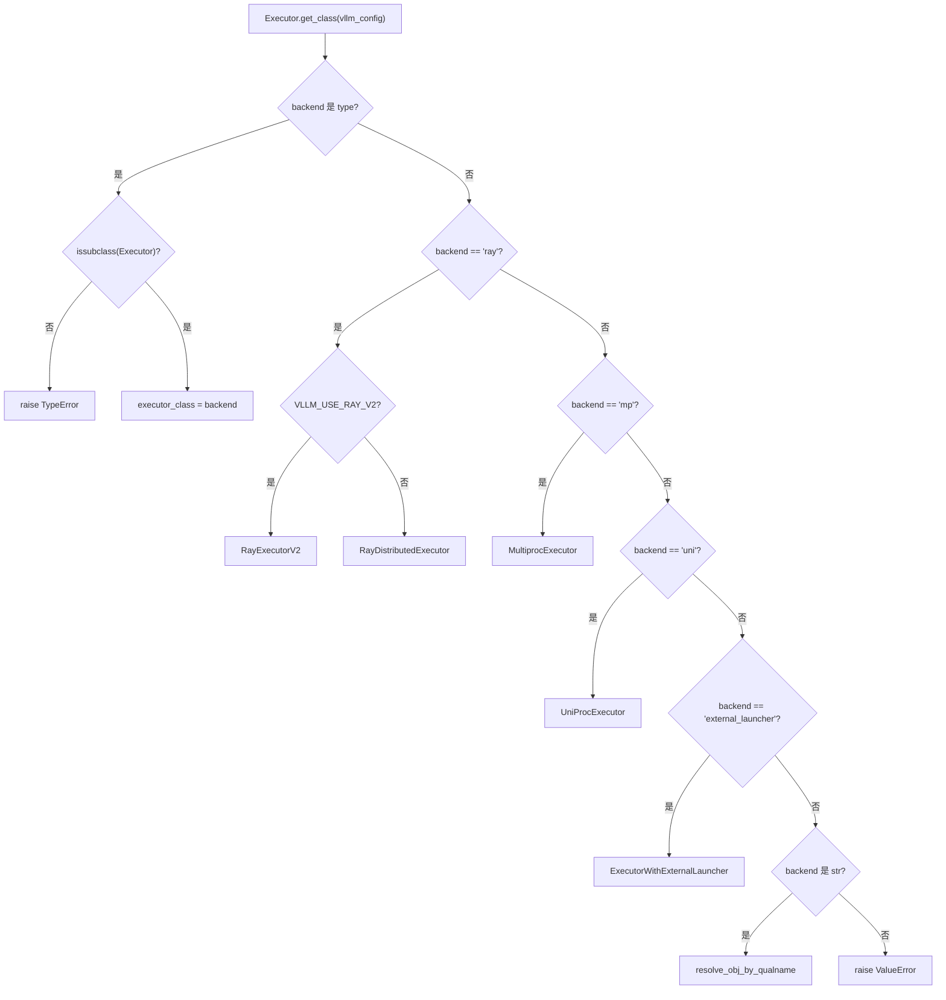
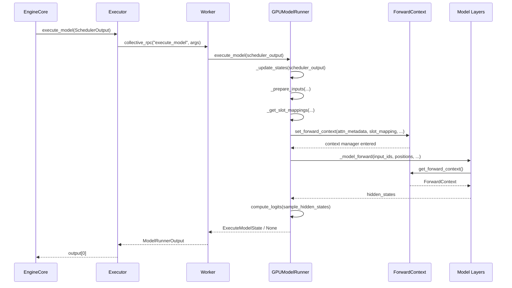

# Kapitel 5: Der Modellausführungs-Hauptstrang: Von SchedulerOutput zum GPU-Forward-Pass

Im vorherigen Kapitel haben wir gesehen, wie der Scheduler in jeder Scheduling-Schleife entscheidet, welche Anfragen in die running-Warteschlange aufgenommen, welche präemptiert und welche wegen unzureichenden Speichers zurückgestellt werden, und schließlich eine SchedulerOutput erzeugt – sie beschreibt, was in diesem Schritt berechnet werden soll: welche Anfragen, wie viele Token jeweils, welche KV-Blöcke. Aber diese Liste ist nur eine logische Absicht; die GPU benötigt physische Tensoren. Dieses Kapitel verfolgt, wie SchedulerOutput vom Executor an die Worker verteilt wird, dann vom GPUModelRunner in GPU-ausführbare Eingaben wie input_ids, positions, slot_mapping und block table übersetzt wird und schließlich über forward_context die schichtübergreifend geteilte Batch-Beschreibung in jede Modellschicht injiziert wird – und so den Sprung von der Scheduling-Entscheidung zum Forward-Pass vollzieht.

# 5.1 Executor: Das Scheduling-Ergebnis an jede Karte übermitteln

## Intuitives Modell

`Executor`ist der „Bote" zwischen EngineCore und GPU-Worker. Ohne ihn müsste EngineCore selbst wissen, wie viele Karten im Cluster sind, in welchem Prozess sich jede Karte befindet, wie man die`SchedulerOutput`Serialisierung der Vergangenheit – die Scheduling-Logik würde mit der verteilten Topologie verflochten.`Executor`Diese Verantwortlichkeit herausziehen: EngineCore kümmert sich nur um den Aufruf von`execute_model(scheduler_output)`, der Rest – „an wen senden, wie senden, wie viele Ergebnisse empfangen" – wird vom Executor entschieden.

## Klassenhierarchie und Felder

`Executor`ist eine abstrakte Basisklasse, deren Klassenfelder direkt die Backend-Fähigkeiten kodieren[FACT:vllm/v1/executor/abstract.py:48-49]：

```python
uses_ray: bool = False  # whether the executor uses Ray for orchestration.
supports_pp: bool = False  # whether the executor supports PP
```

Diese beiden Flags sind nicht dekorativ – der übergeordnete Code liest sie, um zu entscheiden, ob bestimmte Optimierungspfade aktiviert werden.`__init__`In werden initialisiert`sleeping_tags`、`kv_output_aggregator`、`ec_output_aggregator`drei Statusfelder[FACT:vllm/v1/executor/abstract.py:119-120], die jeweils für Sleep-Mode-Label-Tracking, KV-Connector-Ausgabeaggregation und Encoder-Connector-Ausgabeaggregation verwendet werden.

## Backend-Auswahl:`get_class`Branch-Routing von

`get_class`ist eine statische Factory, die abhängig von der`distributed_executor_backend`-Konfiguration die konkrete Executor-Klasse zurückgibt[FACT:vllm/v1/executor/abstract.py:51-96]. Ihre Verzweigungsstruktur verdient eine genauere Betrachtung:

- Wenn die Konfiguration selbst eine`type`ist, validiere, ob sie eine`Executor`-Unterklasse ist, und verwende sie direkt[FACT:vllm/v1/executor/abstract.py:52-61]；
- `"ray"`Unter dem -Branch gibt es weitere Unterbranches:`VLLM_USE_RAY_V2_EXECUTOR_BACKEND`Wenn wahr, verwende`RayExecutorV2`, andernfalls verwende`RayDistributedExecutor` [FACT:vllm/v1/executor/abstract.py:64-72]；
- `"mp"`wird auf abgebildet`MultiprocExecutor`，`"uni"`wird auf abgebildet`UniProcExecutor` [FACT:vllm/v1/executor/abstract.py:73-80]；
- Benutzerdefinierte Backends in String-Form werden über`resolve_obj_by_qualname`dynamisch aufgelöst[FACT:vllm/v1/executor/abstract.py:85-90]。



## Step-by-Step: Der Aufrufablauf eines`execute_model`-Aufrufs

Szenario: EngineCore schließt einen Scheduling-Schritt ab, erhält`SchedulerOutput`, ruft auf`executor.execute_model(scheduler_output)`。

`Executor.execute_model`Die Implementierung von ist extrem minimalistisch[FACT:vllm/v1/executor/abstract.py:237-238]：

```python
def execute_model(
    self, scheduler_output: SchedulerOutput, non_block: bool = False
) -> ModelRunnerOutput | None | Future[ModelRunnerOutput | None]:
    output = self.collective_rpc(
        "execute_model", args=(scheduler_output,), non_block=non_block
    )
    return output[0]
```

> **[Design Inference & Architectural Trade-offs]**
> Der Schlüssel liegt in`collective_rpc`– es broadcastet den Methodennamen und die Parameter an alle Worker, sammelt die Rückgabewertlisten jedes Workers und`output[0]`nimmt nur den ersten. Warum nur den ersten? Weil unter Tensor-Parallelität alle Worker dieselbe logische Vorwärtsberechnung ausführen und die Ausgaben semantisch äquivalent sind; das Sampling-Ergebnis wird vom letzten PP-Stage oder Rank 0 bestimmt, und das Nehmen von`output[0]`vermeidet doppelte Aggregation.`collective_rpc`Die Dokumentation von empfiehlt ausdrücklich, „nur Kontrollnachrichten zu senden, Datenebenen-Kommunikation separat aufzubauen"[FACT:vllm/v1/executor/abstract.py:220-221], genau das ist die Positionierung von`SchedulerOutput`– es ist eine Kontrollnachricht, die tatsächlichen Token-Daten fließen über GPU-Tensoren innerhalb der Worker.

`sample_tokens`folgt demselben Muster[FACT:vllm/v1/executor/abstract.py:257-258], aber der Rückgabetyp enthält kein`None`– Sampling erzeugt zwangsläufig ein Ergebnis. Die Aufgabenteilung dieser beiden Methoden entspricht dem „Execution-Sampling-Trennung"-Design von vLLM v1:`execute_model`kann zurückgeben`None`(was bedeutet, dass die Vorwärtsberechnung übermittelt, aber das Sampling verzögert wurde), wobei der Zustand vorübergehend in`ExecuteModelState`gespeichert wird.

## Design-Überlegungen

`collective_rpc`ist als`@abstractmethod` [FACT:vllm/v1/executor/abstract.py:186-192]deklariert, was bedeutet, dass verschiedene Backends selbst implementieren müssen, „wie RPC an Worker gesendet wird".`MultiprocExecutor`verwendet Shared-Memory-Queues,`RayDistributedExecutor`verwendet Ray-Actor-Aufrufe,`UniProcExecutor`ruft direkt lokal auf. Diese Abstraktion macht es dem übergeordneten Code vollständig möglich, sich nicht um verteilte Details zu kümmern.

Ein leicht zu übersehendes Detail:`supported_tasks`ist als`@cached_property` [FACT:vllm/v1/executor/abstract.py:306-309]markiert, der Kommentar sagt direkt „unnötige RPC-Aufrufe vermeiden". Weil`get_supported_tasks`prozessübergreifende Kommunikation erfordert und die Aufgabenliste sich während des Modelllebenszyklus nicht ändert, ist Caching eine korrekte und notwendige Optimierung.

# 5.2 GPUModelRunner: Von SchedulerOutput zu Eingabe-Tensoren

## Intuitives Modell

`GPUModelRunner`ist ein „Übersetzer": Es übersetzt die logischen Beschreibungen in`SchedulerOutput`(Request-ID, Token-Anzahl, Block-ID) in physische Tensoren, die die GPU direkt konsumieren kann. Ohne es müsste die Modellschicht selbst Fragen wie „In welchem KV-Slot befindet sich das 7. Token der 3. Anfrage" behandeln – das wäre eine katastrophale Leckage von Belangen.

## Kernzustand und Speicherlayout

`GPUModelRunner`erbt von drei Mixins[FACT:vllm/v1/worker/gpu_model_runner.py:479-480]：`LoRAModelRunnerMixin`、`KVConnectorModelRunnerMixin`、`ECConnectorModelRunnerMixin`, die jeweils LoRA-Adaption, KV-Connector- und Encoder-Connector-Fähigkeiten bereitstellen.

`__init__`cached alle Konfigurationsobjekte[FACT:vllm/v1/worker/gpu_model_runner.py:488-498]und initialisiert mehrere Schlüssel-Flags:

- `check_ep_fault`: Nur wenn Datenparallelität > 1 und es ein MoE-Modell ist, wird der EP-all2all-Manager abgefragt, ob er Fehlertoleranz unterstützt[FACT:vllm/v1/worker/gpu_model_runner.py:507-509]；
- `is_pooling_model`: Bestimmt durch`runner_type == "pooling"`[FACT:vllm/v1/worker/gpu_model_runner.py:515]；
- `enable_prompt_embeds`: Ob Prompt-Embedding-Eingabe aktiviert ist[FACT:vllm/v1/worker/gpu_model_runner.py:516]。

`ExecuteModelState`ist ein`NamedTuple`, der den temporären Zustand zwischen`execute_model()`und`sample_tokens()`trägt[FACT:vllm/v1/worker/gpu_model_runner.py:463-476]. Sein Felddesign offenbart die Essenz der Execution-Sampling-Trennung:`logits`、`hidden_states`、`sample_hidden_states`ist das Vorwärtsberechnungsprodukt,`spec_decode_metadata`、`slot_mappings`sind die in der Sampling-Phase noch benötigten Metadaten. Der Kommentar sagt ausdrücklich, dass dies „temporärer Cache-Zustand ist, der nach der Rückgabe von None durch execute_model() übergeben wird"[FACT:vllm/v1/worker/gpu_model_runner.py:464-464]。

## Step-by-Step：`_update_states`Wie der Cache-Zustand synchronisiert wird

Szenario: Der Scheduler entscheidet, in diesem Schritt die Anfragen A (neue Anfrage), B (Fortsetzung des Decode vom vorherigen Schritt), C (Wiederherstellung nach Preemption) zu verarbeiten, während Anfrage D bereits abgeschlossen ist.

**Erster Schritt: Abgeschlossene Anfragen bereinigen.**durchläuft`finished_req_ids`, entfernt den Zustand aus dem`self.requests`-Dictionary, entfernt`input_batch`aus[FACT:vllm/v1/worker/gpu_model_runner.py:1202-1217]. Beachten Sie den im Kommentar erwähnten Grenzfall:`finished_req_ids`und`scheduled_req_ids`können sich überschneiden – wenn eine Anfrage abgebrochen und dann mit derselben ID erneut eingereicht wird, werden sie als zwei verschiedene Anfragen betrachtet[FACT:vllm/v1/worker/gpu_model_runner.py:1211-1215]。

**Zweiter Schritt: Neu zugewiesene KV-Blöcke auf Null setzen.**Wenn`new_block_ids_to_zero`nicht leer ist, wird`_zero_block_ids`aufgerufen, um den Grafikspeicher auf Null zu setzen, um zu verhindern, dass veraltete NaN die Attention- oder SSM-Berechnung verunreinigen[FACT:vllm/v1/worker/gpu_model_runner.py:1219-1222]. Dies ist die Sicherheitsvoraussetzung für die Wiederverwendung von PagedAttention-Blöcken.

**Dritter Schritt: Menge der nicht geplanten Anfragen berechnen.**Dies ist der fehleranfälligste Schritt[FACT:vllm/v1/worker/gpu_model_runner.py:1238-1247]：

```python
scheduled_req_ids = scheduler_output.num_scheduled_tokens.keys()
cached_req_ids = self.input_batch.req_id_to_index.keys()
resumed_req_ids = scheduler_output.scheduled_cached_reqs.resumed_req_ids
unscheduled_req_ids = cached_req_ids - (scheduled_req_ids - resumed_req_ids)
```

Der Kommentar erklärt, warum`scheduled_req_ids - resumed_req_ids`statt direkt`scheduled_req_ids`verwendet wird: Normalerweise sind`cached_req_ids`und`resumed_req_ids`disjunkt, aber im durch`reset_prefix_cache`ausgelösten erzwungenen Preemption-Szenario müssen wiederhergestellte Anfragen zuerst aus dem persistenten Batch entfernt und dann erneut hinzugefügt werden[FACT:vllm/v1/worker/gpu_model_runner.py:1241-1246]。

**Vierter Schritt: Neue Anfragen verarbeiten.**Für jede`scheduled_new_reqs`wird`CachedRequestState` [FACT:vllm/v1/worker/gpu_model_runner.py:1295-1308]konstruiert. Wenn der Sampling-Typ`RANDOM_SEED`ist, wird ein`torch.Generator` [FACT:vllm/v1/worker/gpu_model_runner.py:1277-1284]mit Seed erstellt. Wenn das Modell M-RoPE verwendet, wird`_init_mrope_positions`aufgerufen, um die Positionen vorzuberechnen[FACT:vllm/v1/worker/gpu_model_runner.py:1319-1321]。

**Fünfter Schritt: Laufende Anfragen aktualisieren.**Für jede`scheduled_cached_reqs`wird`num_computed_tokens` [FACT:vllm/v1/worker/gpu_model_runner.py:1402]aktualisiert, Block-ID-Anhängung oder -Ersetzung behandelt[FACT:vllm/v1/worker/gpu_model_runner.py:1437-1448]. Wenn die Anfrage nicht im persistenten Batch ist (`req_index is None`), wird sie zu`reqs_to_add` [FACT:vllm/v1/worker/gpu_model_runner.py:1450-1465]。

**hinzugefügt** `condense()`Füllt die Lücke, die die Entfernungsanfrage hinterlässt[FACT:vllm/v1/worker/gpu_model_runner.py:1511-1512]，`_may_reorder_batch`Lässt das Attention-Backend bei Bedarf neu anordnen[FACT:vllm/v1/worker/gpu_model_runner.py:1513-1514]，`refresh_metadata()`Aktualisiert die Batch-Metadaten[FACT:vllm/v1/worker/gpu_model_runner.py:1515-1516]。

## Eingabe-Tensor-Vorbereitung:`_prepare_input_ids`asynchroner Schnellpfad

`_prepare_input_ids`Behandelt ein subtiles Problem: Unter asynchroner Planung befindet sich das Sampling-Token des vorherigen Schritts noch auf der GPU, und der aktuelle Schritt muss`input_ids`sie einfügen[FACT:vllm/v1/worker/gpu_model_runner.py:1767-1772]。

Normaler Pfad (`prev_sampled_token_ids is None`) kopiert CPU-Tensoren direkt auf die GPU[FACT:vllm/v1/worker/gpu_model_runner.py:1788-1794]. Der asynchrone Pfad hingegen durchläuft die Anfragen und berechnet den Index des letzten Tokens jeder Anfrage im flachgelegten`input_ids`[FACT:vllm/v1/worker/gpu_model_runner.py:1809-1836]. Die Kommentare geben konkrete Beispiele:`cu_num_tokens = [2, 5, 8]`、`draft_tokens = [1, 2, 2]`wenn,`sample_flattened_indices = [0, 2, 5]`，`spec_flattened_indices = [1, 3, 4, 6, 7]` [FACT:vllm/v1/worker/gpu_model_runner.py:1820-1822]。

Es gibt eine entscheidende Optimierung[FACT:vllm/v1/worker/gpu_model_runner.py:1859-1868]：

```python
if common_indices_match and max_flattened_index == (num_common_tokens - 1):
    self.input_ids.gpu[:num_common_tokens].copy_(
        self.input_batch.prev_sampled_token_ids[:num_common_tokens, 0],
        non_blocking=True,
    )
    return
```

Wenn der Batch unverändert ist und keine Neuanordnung stattfindet, sind die Indizes`0..N-1`dieselbe Permutation, und es kann direkt ein einzelner Slice-Copy verwendet werden, um den Scatter-Overhead zu vermeiden. Dies ist die direkte Umsetzung der persistenten Batch-Optimierung.

## `slot_mapping`und Block Table

`_get_slot_mappings`gibt zwei Formate zurück[FACT:vllm/v1/worker/gpu_model_runner.py:4078-4078]: nach KV-Cache-Gruppe indiziertes`dict[int, torch.Tensor]`für Attention-Metadaten, nach Layer-Namen indiziertes`dict[str, torch.Tensor]`für`ForwardContext`verwendet. Für eine encoder-only KV-Cache-Gruppe ist das Slot-Mapping ein All-Null-Tensor[FACT:vllm/v1/worker/gpu_model_runner.py:4096-4115]; andernfalls wird aus`block_table.slot_mapping.gpu`geschnitten[FACT:vllm/v1/worker/gpu_model_runner.py:4107-4109]. Unbenutztes Tail-Padding`-1`, die Kommentare erläutern, dass dies`reshape_and_cache`im Full-CUDA-Graph-Modus erforderlich ist[FACT:vllm/v1/worker/gpu_model_runner.py:4118-4122]。

`_get_block_table`Ruft für jede KV-Cache-Gruppe den Device-Tensor ab[FACT:vllm/v1/worker/gpu_model_runner.py:2319-2335], und füllt mit`NULL_BLOCK_ID`die CUDAGraph-Padding-Zeilen – Block 0 ist als Padding reserviert[FACT:vllm/v1/worker/gpu_model_runner.py:2332-2334]。

# 5.3 forward_context: Eine über alle Schichten gemeinsam genutzte Batch-Beschreibung

## Intuitives Modell

`forward_context`ist wie ein „einheitliches Ankündigungsbrett" vorne im Klassenzimmer: Jede Modellschicht kann auf einen Blick die Sitzordnung (Attention-Metadaten) und die Regeln (Slot-Mapping) für diese Prüfung sehen und muss nicht selbst nachfragen. Ohne es müsste jede Attention-Schicht diese Informationen aus den Parametern erhalten – aber die`forward`-Signatur der Modellschicht ist fest und kann nicht pro Schicht einzeln Parameter übergeben.

## Datenstruktur

`ForwardContext`ist ein`@dataclass` [FACT:vllm/forward_context.py:141-202], Kernfelder:

- `no_compile_layers`: Von`static_forward_context`kopiert, markiert Schichten, die nicht an der Kompilierung teilnehmen[FACT:vllm/forward_context.py:132-137]；
- `attn_metadata`: Mapping von Layer-Namen zu Attention-Metadaten, im DBO-Modus eine Liste der Länge 2 (eine pro Microbatch)[FACT:vllm/forward_context.py:144-152]；
- `slot_mapping`: Mapping von Layer-Namen zu Slot-Mapping-Tensoren[FACT:vllm/forward_context.py:145]；
- `cudagraph_runtime_mode`: Laufzeit-CUDA-Graph-Modus, Standard`NONE` [FACT:vllm/forward_context.py:155-157]；
- `batch_descriptor`: Batch-Deskriptor, verwendet für CUDA-Graph-Dispatch[FACT:vllm/forward_context.py:158]；
- `is_padding`: Boolesche Maske auf der Token-Achse,`True`kennzeichnet Padding-Zeilen[FACT:vllm/forward_context.py:162-165]。

`BatchDescriptor`ist ein weiteres`@dataclass(frozen=True)` [FACT:vllm/forward_context.py:30-57], das Felddesign folgt dem Prinzip „Minimierung der Beschreibungselemente":`num_tokens`、`num_reqs`(im PIECEWISE-Modus kann es None sein),`uniform`(alle Anfragen haben die gleiche Token-Anzahl),`has_lora`、`num_active_loras`. Die Kommentare erklären, warum`num_active_loras`existiert: Wenn`cudagraph_specialize_lora_count`aktiviert ist, erfasst jeder LoRA-Anzahlwert einen unabhängigen CUDA-Graph, da die Grid-Größe von Kernels wie`fused_moe_lora`von diesem Wert abhängt[FACT:vllm/forward_context.py:60-64]。

## Globales Singleton und Kontextverwaltung

`_forward_context`ist eine globale Variable auf Modulebene[FACT:vllm/forward_context.py:199-201], die über den`override_forward_context`-Kontextmanager beim Eintritt den alten Wert speichert und beim Austritt wiederherstellt[FACT:vllm/forward_context.py:263-274]。`set_forward_context`ist eine übergeordnete Kapselung[FACT:vllm/forward_context.py:277-394], die zusätzlich die DP-Metadaten-Konstruktion, die automatische Erstellung des Batch-Deskriptors und die Injektion plattformspezifischer kwargs übernimmt.

## Step-by-Step: Von`execute_model`zum Modell-Vorwärtsdurchlauf

Szenario:`GPUModelRunner.execute_model`Alle Eingabe-Tensoren sind vorbereitet, das Modell wird gleich aufgerufen.

In`execute_model`wird`set_forward_context`aufgerufen[FACT:vllm/v1/worker/gpu_model_runner.py:4408-4420]：

```python
with (
    set_forward_context(
        attn_metadata,
        self.vllm_config,
        num_tokens=num_tokens_padded,
        num_tokens_across_dp=num_tokens_across_dp,
        cudagraph_runtime_mode=cudagraph_mode,
        batch_descriptor=batch_desc,
        ubatch_slices=ubatch_slices_padded,
        slot_mapping=slot_mappings,
        skip_compiled=has_encoder_input,
        is_padding=is_padding,
    ),
    ...
):
    model_output = self._model_forward(...)
```

`set_forward_context`konstruiert intern zuerst`DPMetadata`(falls DP oder Sequence-Parallel-MoE aktiviert ist)[FACT:vllm/forward_context.py:299-328], ruft dann`create_forward_context`auf, um`ForwardContext`eine Instanz zu konstruieren[FACT:vllm/forward_context.py:347-358], und setzt schließlich über`override_forward_context`die globale Variable[FACT:vllm/forward_context.py:361-362]。

Die Modellschicht liest`get_forward_context()`über[FACT:vllm/forward_context.py:208-214]. Wenn nicht gesetzt, schlägt die Assertion fehl und weist auf die Verwendung von`set_forward_context`。



## Designüberlegungen

> **[Design Inference & Architectural Trade-offs]**
> Warum globale Variablen statt expliziter Parameterübergabe? Weil die`forward`-Signatur der Modellschicht durch die HuggingFace-Konvention festgelegt ist und keine zusätzlichen Parameter pro Schicht injiziert werden können. Globale Variablen + Kontextmanager sind die einzige Lösung, um eine schichtübergreifende Injektion ohne Änderung des Modellcodes zu erreichen. Der Preis ist eine implizite Abhängigkeit –`get_forward_context()`Der Aufrufer von muss sicherstellen, dass er sich im Gültigkeitsbereich von`set_forward_context`befindet.

`is_padding`Das Design des Feldes ist bemerkenswert[FACT:vllm/forward_context.py:162-165]: Die Kommentare besagen: „Konsumenten können es verwenden, um die Arbeit für Padding-Tokens zu überspringen." Dies ist eine Optimierung im CUDA-Graph-Szenario – Padding-Zeilen nehmen an der Graph-Erfassung teil, sollten aber keine tatsächliche Berechnung erzeugen.

`all_moe_layers`und`moe_layer_index`sind ein Paar raffinierter Workarounds[FACT:vllm/forward_context.py:170-195]. Die Kommentare erklären das Problem ausführlich:`vllm.moe_forward`Benutzerdefinierte Operatoren kodieren den Layer-Namen-String fest in den Graphen, was zu einer übermäßig langen Kaltstartzeit von torch.compile führt. Die Lösung besteht darin, die Liste der Layer-Namen in`ForwardContext`zu speichern, und der benutzerdefinierte Operator poppt die Strings der Reihe nach und erhöht einen Zähler. Die Kommentare geben auch offen zu, dass dies von der Annahme abhängt, dass „benutzerdefinierte Operatoren in Reihenfolge ausgeführt werden und torch.compile nicht neu anordnet"[FACT:vllm/forward_context.py:182-184]。

# Designüberlegungen und Produktions-Fallstricke

**Zustandskonsistenz bei asynchroner Planung.** `_update_states`verwendet unter asynchroner spekulativer Dekodierung eine „optimistische Annahme"-Strategie: Es wird angenommen, dass alle Draft-Tokens des vorherigen Schritts akzeptiert wurden, zuerst wird`output_token_ids`erweitert, dann wird eine verzögerte Korrekturfunktion registriert[FACT:vllm/v1/worker/gpu_model_runner.py:1376-1384]. Die Korrekturfunktion wird nach dem Start des Modell-Vorwärtsdurchlaufs aufgerufen[FACT:vllm/v1/worker/gpu_model_runner.py:1509-1510], liest die tatsächliche Akzeptanzanzahl von der GPU und rollt`num_computed_tokens` [FACT:vllm/v1/worker/gpu_model_runner.py:1547-1558]zurück. Das Raffinierte an diesem Design ist: Die Korrektur erfolgt, nachdem „der Batch gestartet wurde", blockiert den Vorwärtsdurchlauf nicht und bewahrt die Kontinuität der asynchronen Pipeline.

**`_may_reorder_batch`Auslösebedingung von.**Diese Methode prüft zuerst, ob`kv_cache_groups`leer ist[FACT:vllm/v1/worker/gpu_model_runner.py:1131-1132]. Die Kommentare erklären, warum nicht einfach geprüft werden kann, ob`is_attention_free`Das Mamba-Modell ist ebenfalls attention-frei, verwendet jedoch einen KV-Cache zur Speicherung des internen Zustands[FACT:vllm/v1/worker/gpu_model_runner.py:1116-1139]. Nur Modelle, die wirklich keine KV-Cache-Gruppe haben, überspringen die Neuordnung.

**`_prepare_input_ids`Die Indexberechnungsfalle.**Wenn der Batch sowohl Decode-Anfragen aus dem vorherigen Schritt als auch neue Anfragen enthält,`num_common_tokens < total_without_spec`, muss der CPU-Tensor zuerst kopiert und dann gescattert werden[FACT:vllm/v1/worker/gpu_model_runner.py:1849-1854]. Falls`num_common_tokens == 0`, bedeutet dies, dass keine Anfrage mit dem vorherigen Schritt überlappt, und es wird direkt zurückgegeben[FACT:vllm/v1/worker/gpu_model_runner.py:1855-1858]. Die Unterscheidung dieser beiden Zweige ist entscheidend – das Auslassen eines beliebigen führt dazu, dass`input_ids`teilweise nicht initialisiert bleibt.

**`AsyncGPUModelRunnerOutput`Die Stream-Synchronisation.**Die Ausgabekopie erfolgt auf einem separaten CUDA-Stream[FACT:vllm/v1/worker/gpu_model_runner.py:308-328], wobei`blocking=True`das Event verwendet wird, um Busy-Polling auf den CUDA-Treiber-Lock zu vermeiden[FACT:vllm/v1/worker/gpu_model_runner.py:296-298]。`get_output()`. Zuerst synchronisieren, dann die Geräte-Tensor-Referenz freigeben[FACT:vllm/v1/worker/gpu_model_runner.py:336-340], die Reihenfolge darf nicht vertauscht werden – andernfalls könnte der Tensor vor Abschluss der Kopie freigegeben werden.

# Zusammenfassung dieses Kapitels

Dieses Kapitel hat den vollständigen Pfad von`SchedulerOutput`von EngineCore bis zum GPU-Vorwärtsdurchlauf nachverfolgt.`Executor`Durch`collective_rpc`werden die Scheduling-Ergebnisse an alle Worker broadcastet,`GPUModelRunner`synchronisiert`_update_states`den Cache-Zustand,`_prepare_inputs`konstruiert die Eingabe-Tensoren,`_get_slot_mappings`generiert das KV-Slot-Mapping, und schließlich`set_forward_context`injiziert die Batch-Beschreibung in den globalen Kontext zur Konsumption durch die Modellschichten. Der asynchrone Scheduling-Pfad bewahrt die Pipeline-Kontinuität durch optimistische Annahmen und verzögerte Korrekturen, während`ForwardContext`das globale Singleton-Design den Konflikt zwischen festen Modellschicht-Signaturen und der Injektion von schichtübergreifenden Metadaten löst.

# Kapitelreflexion und Selbsttest

Q1: `_update_states`In`unscheduled_req_ids = cached_req_ids - (scheduled_req_ids - resumed_req_ids)`der Ausdruck`resumed_req_ids`, wenn man`cached_req_ids - scheduled_req_ids`aus der Subtraktion entfernt und zu

**wird, in welchem Szenario führt dies zu inkonsistentem Zustand?**Referenzanalyse[FACT:vllm/v1/worker/gpu_model_runner.py:1241-1246]，`cached_req_ids`: Der Kommentar weist explizit darauf hin, dass`resumed_req_ids`und`reset_prefix_cache`normalerweise disjunkt sind, aber im Szenario der durch`cached_req_ids`ausgelösten erzwungenen Preemption kann eine Anfrage gleichzeitig in`resumed_req_ids`und`scheduled_req_ids - resumed_req_ids`erscheinen. In diesem Fall`unscheduled_req_ids`schließt diese Anfrage aus der Menge der „bereits geplanten" aus, sodass sie in`resumed_req_ids`fällt, wodurch sie zuerst aus dem persistenten Batch entfernt und dann über den normalen resumed-Pfad wieder hinzugefügt wird. Wenn man`req_state.block_ids = new_block_ids` [FACT:vllm/v1/worker/gpu_model_runner.py:1448]entfernt, würde die Anfrage als „bereits geplant" betrachtet und im Batch verbleiben, aber ihre Block-ID wurde ersetzt (

Q2: `_prepare_input_ids`), was dazu führt, dass die alte Zeile in der Block-Tabelle nicht mit der neuen Block-ID übereinstimmt, und die Attention-Berechnung liest die falsche KV-Position.[FACT:vllm/v1/worker/gpu_model_runner.py:1859-1868]Der schnelle Pfad von`common_indices_match and max_flattened_index == (num_common_tokens - 1)`verwendet`common_indices_match`als Bedingung. Was passiert, wenn sich die Reihenfolge der Anfragen im Batch geändert hat (z. B. das Attention-Backend den Batch neu geordnet hat), aber

**immer noch True ist?**：`common_indices_match`Referenzanalyse`prev_index == flattened_index`akkumuliert in der Schleife durch[FACT:vllm/v1/worker/gpu_model_runner.py:1835]。`prev_index`den Wert`prev_positions`aus`flattened_index`, um die aktuelle Batch-Position auf die Batch-Position des vorherigen Schritts abzubilden;`prev_index`ist der flache Index des letzten Tokens dieser Anfrage im aktuellen Batch. Wenn der Batch neu geordnet wird, ändert sich die Zuordnung zwischen`flattened_index`und`common_indices_match`,`prev_index == flattened_index`wird zu False, und der schnelle Pfad wird nicht ausgelöst. Aber wenn die Neuordnung zufällig dazu führt, dass`prev_sampled_token_ids[:num_common_tokens, 0]`für alle Anfragen gilt (z. B. durch Vertauschen zweier Anfragen mit gleicher Token-Anzahl), würde der schnelle Pfad fälschlicherweise`max_flattened_index == num_common_tokens - 1`direkt zum Slice-Kopieren verwenden – dies würde das Sampling-Token von Anfrage A an die Position von Anfrage B schreiben.`0..N-1`Diese zusätzliche Bedingung dient genau dazu, diesen degenerierten Fall zu verhindern: Sie erfordert, dass die flachen Indizes genau eine Permutation von

Q3: `ForwardContext`sind, und schließt jede nicht-triviale Neuordnung aus.`_forward_context`verwendet eine modulglobale Variable`execute_model`anstelle einer thread-lokalen Variable. Unter asynchronem Scheduling, bei dem`sample_tokens`und`sample_tokens`getrennt sind, was gibt`get_forward_context()`zurück, wenn

**vor Abschluss des Vorwärtsdurchlaufs aufgerufen wird? Welche Probleme verursacht dies?**：`set_forward_context`Referenzanalyse[FACT:vllm/forward_context.py:278-288]ist ein Context-Manager`with`, der beim Verlassen des`override_forward_context`-Blocks durch`finally`den alten Wert[FACT:vllm/forward_context.py:263-274]wiederherstellt`execute_model`. In`set_forward_context`umschließt der`with`-Block von`_model_forward`nur den Aufruf[FACT:vllm/v1/worker/gpu_model_runner.py:4408-4433], und nach der Rückkehr des Vorwärtsdurchlaufs wird der Kontext sofort wiederhergestellt. Wenn`sample_tokens`nach Abschluss des Vorwärtsdurchlaufs aufgerufen wird,`get_forward_context()`schlägt die Assertion fehl[FACT:vllm/forward_context.py:208-214], weil`_forward_context`bereits auf`None`(oder den äußeren Wert) zurückgesetzt wurde. Genau deshalb existiert`ExecuteModelState`[FACT:vllm/v1/worker/gpu_model_runner.py:463-476]: Der für das Sampling benötigte Zustand (`logits`、`hidden_states`、`slot_mappings`) wird explizit in einem NamedTuple gespeichert, anstatt sich auf die implizite Übergabe von`ForwardContext`zu verlassen. Wenn man fälschlicherweise annimmt, dass`ForwardContext`in`sample_tokens`noch verfügbar ist, wird ein Assertion-Fehler ausgelöst oder falsche Metadaten gelesen.

Damit haben wir den vollständigen Pfad von SchedulerOutput bis zur GPU-Vorwärtspropagation durchlaufen: Executor-Dispatch, Worker-Ausführung, GPUModelRunner übersetzt die logische Liste in physische Tensoren und injiziert die Batch-Beschreibung über forward_context in jede Schicht. Der zeitaufwändigste Teil der Modell-Vorwärtspropagation – die Attention-Berechnung – wurde jedoch noch nicht behandelt. Das nächste Kapitel taucht in die Attention-Backends ein und zeigt, wie die Block-Tabelle und das Slot-Mapping in attn_metadata von PagedAttention-Kernels konsumiert werden und wie verschiedene Backends wie FlashAttention, FlashInfer und Triton über eine einheitliche Schnittstelle ausgewählt und gesteuert werden.
