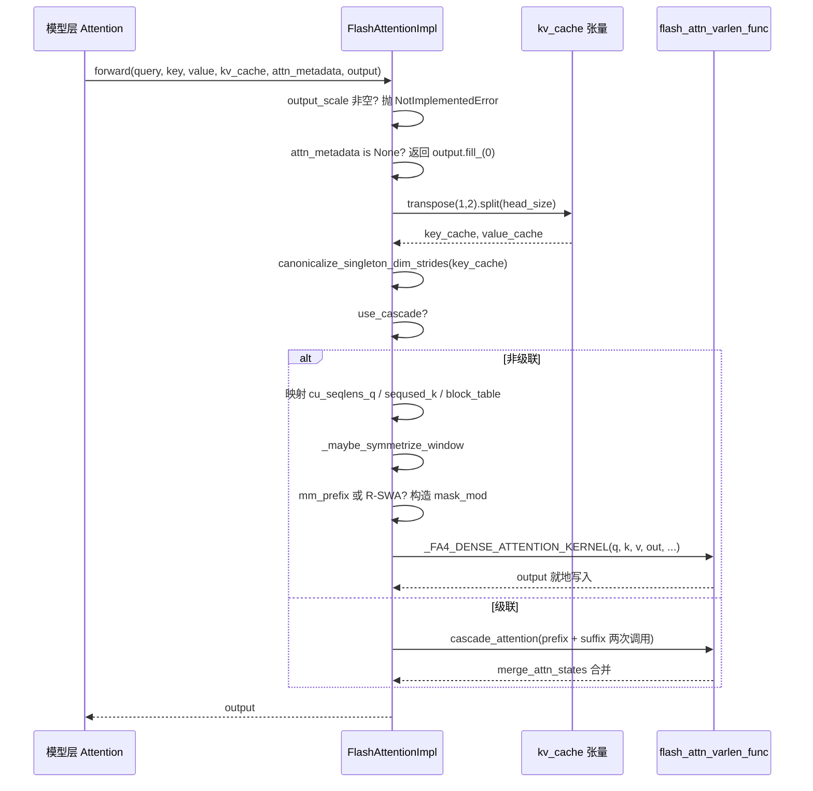

# Kapitel 6: Attention-Backends und PagedAttention-Kernel-Implementierung

Im vorherigen Kapitel haben wir gesehen, wie der GPUModelRunner die Scheduling-Ergebnisse in physische Tensoren wie input_ids, slot_mapping und block_table übersetzt und diese über forward_context in jede Schicht injiziert. Doch der eigentliche GPU-Zeitfresser – die Attention-Berechnung – hängt noch in der Luft. Wer konsumiert eigentlich die Tensoren in attn_metadata? Warum können FlashAttention, FlashInfer und Triton unter demselben Modellcode austauschbar sein? Die Antwort liegt in der AttentionBackend-Abstraktionsschicht. Sie entkoppelt „wie Attention berechnet wird" von „wie das Modell sie aufruft": Die Modellschicht hält nur eine AttentionImpl-Referenz und ruft das einheitliche forward(query, key, value, kv_cache, attn_metadata, output) auf; das konkrete Backend ist dafür verantwortlich, block_table, slot_mapping, seq_lens in Parameter zu übersetzen, die der eigene Kernel verarbeiten kann. Dieses Kapitel folgt dem FlashAttentionBackend als Hauptlinie, da es gleichzeitig die gather-Semantik von PagedAttention, CUDA-Graph-Kompatibilität, kaskadierte Attention, DCP Distributed Context und die reichhaltigsten Verzweigungen abdeckt. Wer es durchdringt, für den sind andere Backends nur Varianten der Parameterabbildung. Das Designmotiv „Backend-Registrierung + einheitliche Schnittstelle" ist unmittelbar einleuchtend: Attention-Kernel entwickeln sich extrem schnell weiter (FA2→FA3→FA4, FlashInfer-Iterationen, Triton-Eigenentwicklungen). Wenn die Modellschicht direkt von einem konkreten Kernel abhinge, müsste bei jedem Kernel-Upgrade der Modellcode geändert werden. Die Abstraktionsschicht isoliert die Änderungen hinter einer einzigen Factory-Methode get_impl_cls().

# Backend-Auswahl: Fähigkeitsdeklaration und Metadaten-Aufbau

## Intuitives Modell

Man stelle sich`AttentionBackend`als Stellenanzeige vor: Sie arbeitet nicht selbst, sondern deklariert nur „welche dtypes, welche head_size, welche KV-Cache-Quantisierungsformate, welche Attention-Typen ich verarbeiten kann". Der Scheduler gleicht die Modellkonfiguration damit ab; schlägt der Abgleich fehl, wird der nächste Kandidat genommen. Ohne diese Deklarationsschicht würde das System erst zur Laufzeit feststellen, dass „dieser head_size vom Kernel nicht unterstützt wird", und direkt abstürzen.

## Fähigkeitsmatrix: Felder als Vertrag

`FlashAttentionBackend`Die Klassenattribute von sind seine Fähigkeitsgrenzen.`supported_dtypes`beschränkt auf fp16/bf16[FACT:vllm/v1/attention/backends/flash_attn.py:287-287]；`supported_kv_cache_dtypes`erlaubt zusätzlich die fp8-Serie[FACT:vllm/v1/attention/backends/flash_attn.py:298-299]. Doch „deklarierte Unterstützung" bedeutet nicht „bedingungslose Unterstützung" –`supports_kv_cache_dtype`delegiert bei quantisiertem KV weiter an`flash_attn_supports_kv_cache_dtype`für geräteabhängige Entscheidungen[FACT:vllm/v1/attention/backends/flash_attn.py:431-438]。

Noch feiner ist`supports_combination`: Es empfängt ein ganzes Kombinationspaket aus head_size, dtype, block_size, use_mla, has_sink usw. und gibt`None`zurück, um Verfügbarkeit anzuzeigen, oder einen String, um den Ablehnungsgrund anzugeben[FACT:vllm/v1/attention/backends/flash_attn.py:454-507]. Beispielsweise wird sink auf Rechenleistung < 9.0 abgelehnt[FACT:vllm/v1/attention/backends/flash_attn.py:467-468], auf SM90 muss FP8 KV mit mm_prefix zwingend über Triton laufen[FACT:vllm/v1/attention/backends/flash_attn.py:472-472]. Dieses Design der „Rückgabe eines Grund-Strings" ermöglicht der oberen Schicht diagnostizierbare Fehlermeldungen statt stiller Fallbacks.

Die Wahl der block_size wird ebenfalls von den Fähigkeiten gesteuert. Standardmäßig wird`MultipleOf(16)`zurückgegeben, aber SM90 FP8-KV erzwingt 64[FACT:vllm/v1/attention/backends/flash_attn.py:297-324], und der FA4-Kernel mit head_size=256 erzwingt`FA4_HD256_PAGE_SIZE` [FACT:vllm/v1/attention/backends/flash_attn.py:326-352]. Das erklärt, warum die Blockgröße des KV-Cache nicht beliebig gewählt werden kann – sie wird von der TMA-Tile-Größe des Kernels invers eingeschränkt.

## Metadaten-Struktur: Feldlayout von FlashAttentionMetadata

`FlashAttentionMetadata`ist ein dataclass, die Felder zerfallen in vier Gruppen[FACT:vllm/v1/attention/backends/flash_attn.py:511-566]：

Die erste Gruppe ist die grundlegende Batch-Beschreibung:`num_actual_tokens`(die tatsächliche Token-Anzahl ohne Padding),`max_query_len`、`query_start_loc`(Präfixsumme, dient dem varlen-Kernel zur Lokalisierung von Anfang und Ende jeder Sequenz),`seq_lens`、`block_table`、`slot_mapping` [FACT:vllm/v1/attention/backends/flash_attn.py:520-526]. Beachten Sie die ASCII-Grafik im Quellcode-Kommentar[FACT:vllm/v1/attention/backends/flash_attn.py:512-518], sie unterscheidet präzise`context_len`(historischer KV),`query_len`(in diesem Schritt neu hinzugefügt),`seq_len`(die Summe beider) – dies ist der Schlüssel zum Verständnis der varlen-Kernel-Parameter.

Die zweite Gruppe sind die Felder für kaskadierte Attention:`use_cascade`、`common_prefix_len`、`cu_prefix_query_lens`usw.[FACT:vllm/v1/attention/backends/flash_attn.py:528-533]。

Die dritte Gruppe sind die DCP-Felder (Decode Context Parallel):`max_dcp_context_kv_len`、`dcp_context_kv_lens`, sowie Zähler zur Unterscheidung der Anzahl von decode-/prefill-Anfragen[FACT:vllm/v1/attention/backends/flash_attn.py:535-544]。

Die vierte Gruppe sind optionale Scheduling- und spezielle Masken:`scheduler_metadata`(für FA3 AOT-Scheduling),`causal`(kann bool oder Tensor sein, unterstützt per-Sequenz-Kausalität),`mm_prefix_query_range_tensor`(multimodale bidirektionale Bereiche), R-SWA-bezogene Felder[FACT:vllm/v1/attention/backends/flash_attn.py:546-566]。

> **[Design Inference & Architectural Trade-offs]**
> `causal`Der Feldtyp von ist`bool | torch.Tensor`statt reines bool, um das Szenario zu unterstützen, in dem „in derselben Batch einige Sequenzen kausal und andere nicht-kausal sind" (z. B. PrefixLM). Wenn es ein Tensor ist, übernimmt der`dynamic_causal`-Parameter von FA4, während FA2/FA3 direkt NotImplementedError werfen[FACT:vllm/v1/attention/backends/flash_attn.py:1429-1433]。

## build() Schritt für Schritt

Szenario: eine gemischte Batch, 3 decode-Sequenzen + 2 prefill-Sequenzen, ohne Kaskadierung, ohne DCP.

Erster Schritt: aus`common_attn_metadata`die Basis-Tensoren entpacken[FACT:vllm/v1/attention/backends/flash_attn.py:824-832]. Zweiter Schritt: Entscheiden, ob AOT-Scheduling aktiviert wird:`aot_schedule = self.aot_schedule and not fast_build and not envs.VLLM_BATCH_INVARIANT` [FACT:vllm/v1/attention/backends/flash_attn.py:836-838]。`self.aot_schedule`In`__init__`wird durch`get_flash_attn_version() == 3`entschieden[FACT:vllm/v1/attention/backends/flash_attn.py:709-709]——nur FA3 unterstützt die Vorberechnung von Scheduling-Metadaten. Dritter Schritt: Beim ersten Build wird`aot_sliding_window`lazy befüllt: Alle`FlashAttentionImpl`-Schichten werden durchlaufen, um die Sliding-Window-Konfiguration zu sammeln. Ist die Konfiguration eindeutig, wird sie übernommen; gibt es mehr als eine, wird AOT deaktiviert[FACT:vllm/v1/attention/backends/flash_attn.py:848-851]。

Vierter Schritt: Berechnung von`max_num_splits`. Standardmäßig 0 (damit FA3 die Heuristik verwendet); nur wenn full CUDA graph aktiviert ist und die Token-Anzahl im Erfassungsbereich liegt, wird`self.max_num_splits` [FACT:vllm/v1/attention/backends/flash_attn.py:856-866]gesetzt. Der Kommentar erklärt den Grund:`num_splits > 1`allokiert`[num_splits, num_heads, num_tokens, head_size]`Zwischenpuffer, was hohe VRAM-Kosten verursacht und nur im CUDA-graph-Szenario lohnenswert ist[FACT:vllm/v1/attention/backends/flash_attn.py:862-865]。

Fünfter Schritt: Den nicht-kaskadierten und nicht-DCP-Zweig durchlaufen und`_get_scheduler_metadata`aufrufen, um die Scheduling-Metadaten von FA3 zu erzeugen[FACT:vllm/v1/attention/backends/flash_attn.py:976-986]. Sechster Schritt:`_store_scheduler_metadata`behandelt das CUDA-graph-Szenario: Die neuen Metadaten werden in den vorab allokierten Puffer kopiert und der Rest wird auf null gesetzt[FACT:vllm/v1/attention/backends/flash_attn.py:671-684]. Das Nullsetzen ist entscheidend – der Kommentar weist ausdrücklich darauf hin, dass andernfalls einige Thread-Blöcke ungültige Metadaten lesen und den Ausgabepuffer überschreiben[FACT:vllm/v1/attention/backends/flash_attn.py:671-672]。

Siebter Schritt:`FlashAttentionMetadata`konstruieren und[FACT:vllm/v1/attention/backends/flash_attn.py:992-1015]。

```mermaid
flowchart TD
    start["build(common_prefix_len, common_attn_metadata)"] --> unpack["解包 query_start_loc / seq_lens / block_table / slot_mapping"]
    unpack --> aot{"aot_schedule 且非 fast_build 且非 BATCH_INVARIANT?"}
    aot -->|是| sw_check{"aot_sliding_window 已初始化?"}
    aot -->|否| maxsplit
    sw_check -->|否, 首次| collect["_get_sliding_window_configs 收集层滑窗"]
    collect --> sw_unique{"配置数量 == 1?"}
    sw_unique -->|是| set_sw["设置 aot_sliding_window"]
    sw_unique -->|否, >1| disable_aot["self.aot_schedule = False"]
    set_sw --> maxsplit
    disable_aot --> maxsplit
    sw_check -->|是| maxsplit["计算 max_num_splits"]
    maxsplit --> cg_check{"use_full_cuda_graph 且 tokens |是| set_splits["max_num_splits = self.max_num_splits"]
    cg_check -->|否| zero_splits["max_num_splits = 0"]
    set_splits --> branch
    zero_splits --> branch
    branch{"dcp_world_size > 1?"}
    branch -->|是| dcp_path["计算 dcp_context_kv_lens, 可能 skip"]
    branch -->|否| cascade_check{"common_prefix_len > 0?"}
    cascade_check -->|是| cascade_path["构造 prefix/suffix 双份 scheduler_metadata"]
    cascade_check -->|否| normal_path["_get_scheduler_metadata 单份"]
    dcp_path --> store
    cascade_path --> store
    normal_path --> store
    store["_store_scheduler_metadata: CUDA graph 时拷入预分配缓冲并清零尾部"] --> build_meta["构造 FlashAttentionMetadata"]
    build_meta --> mm_check{"mm_req_doc_ranges 非空?"}
    mm_check -->|是| fill_mm["fill_mm_prefix_query_ranges + 拷贝到 GPU"]
    mm_check -->|否| rswa_check
    fill_mm --> rswa_check{"rswa_window 非空?"}
    rswa_check -->|是| copy_rswa["拷贝 prefix_lens 到持久缓冲"]
    rswa_check -->|否| done
    copy_rswa --> done["返回 attn_metadata"]
```

---

# forward(): Die vollständige Kette von Metadaten bis zum Kernel-Aufruf

## Intuitives Modell

`forward()`ist die „Endmontagehalle" des Backends: Es nimmt die von den Modellschichten berechneten Q/K/V-, KV-Cache-Tensoren sowie die im vorherigen Schritt erstellten Metadaten entgegen, passt das physische Layout des KV-Cache auf die vom Kernel erwartete Form an und verteilt dann an den konkreten Kernel. Ohne diesen Schritt würde der Kernel ein falsches Speicherlayout lesen und stillschweigend falsche Ergebnisse liefern – schwerer zu finden als ein Absturz.

## Speicherlayout-Transformation des KV-Cache

Die physische Form des KV-Cache in vLLM ist`[num_blocks, num_kv_heads, block_size, 2 * head_size]`——K und V sind in der letzten Dimension zusammengefügt[FACT:vllm/v1/attention/backends/flash_attn.py:1246-1247]. Die FlashAttention-Kernel erwarten jedoch K und V getrennt, und zwar im Layout`[num_blocks, block_size, num_kv_heads, head_size]`。

Die Transformation erfolgt am Anfang von`forward()`:`kv_cache.transpose(1, 2).split(self.head_size, dim=-1)` [FACT:vllm/v1/attention/backends/flash_attn.py:1310-1310]。`transpose(1,2)`wandelt`[blocks, heads, block_size, 2D]`in`[blocks, block_size, heads, 2D]`，`split`um und schneidet entlang der letzten Dimension in K und V. Beachten Sie, dass`transpose`nur den Stride ändert und keine Daten verschiebt, sodass nachfolgende Kernel nicht-kontinuierlichen Zugriff unterstützen müssen.

Unmittelbar danach folgt`canonicalize_singleton_dim_strides` [FACT:vllm/v1/attention/backends/flash_attn.py:1310-1310]. Der Kommentar nennt die Motivation: Wenn`num_kv_heads=1`(im TP-Szenario üblich), ist der Stride der size-1-Dimension degeneriert, während FA3/FA4 auf H100+ TMA verwenden und einen Stride von mindestens 16-Byte-Ausrichtung erfordern[FACT:vllm/v1/attention/backends/flash_attn.py:1310-1310]. Dies ist eine typische Falle: „logisch äquivalent, physisch ungültig".

## Parameterfluss im nicht-kaskadierten Pfad

Nach Eintritt in den`if not attn_metadata.use_cascade`-Zweig werden die Parameter einzeln zugeordnet[FACT:vllm/v1/attention/backends/flash_attn.py:1326-1342]：`cu_seqlens_q = query_start_loc`，`seqused_k = seq_lens`，`block_table = attn_metadata.block_table`。`descale_shape`nimmt`(batch_size, num_kv_heads)`, verwendet für die Scale-Broadcast bei FP8-Quantisierung – der Kommentar erläutert, dass flash-attn die Descale-Form`(num_sequences, num_kv_heads)`erwartet und`.expand()`verwendet wird, um eine Kopie zu vermeiden[FACT:vllm/v1/attention/backends/flash_attn.py:1258-1258]。

Danach folgt die Symmetrisierung des Sliding Window.`_maybe_symmetrize_window`Logik: Das kausale Sliding Window`(w, 0)`muss im nicht-kausalen Szenario zu`(w, w)`werden, damit bidirektionale Queries in beide Richtungen blicken können[FACT:vllm/v1/attention/backends/flash_attn.py:587-589]. Der Kommentar betont außerdem: „Das Window der Schicht selbst hat Vorrang vor dem Window der Gruppe", da eine KV-Cache-Gruppe gleichzeitig Window-Schichten und globale Schichten enthalten kann (z. B. wenn Gemma-3 den hybrid KV cache manager deaktiviert)[FACT:vllm/v1/attention/backends/flash_attn.py:1362-1365]。

## Masken-Zweig: mm_prefix und R-SWA

Wenn`mm_prefix_query_ranges`nicht leer ist und die FA4- + statisch-kausalen Bedingungen erfüllt sind, konstruiert der Code das CuTE-DSL-`mask_mod` [FACT:vllm/v1/attention/backends/flash_attn.py:1374-1407]. Die Schlüsselaktionen sind`causal = False`und`sliding_window_size = None` [FACT:vllm/v1/attention/backends/flash_attn.py:1406-1407]. Der Kommentar erklärt den Grund: Die Semantik von mm_prefix ist`(causal ∧ window) ∨ bidirectional-range`, keine Teilmenge von causal; nach FA #155 löscht das Setzen von mask_mod nicht mehr automatisch causal/local, der Aufrufer muss explizit deaktivieren, andernfalls würde der eingebaute causal-Pfad mask_mod kurzschließen[FACT:vllm/v1/attention/backends/flash_attn.py:1402-1405]。

`_make_mm_prefix_mask_mod`verwendet`functools.cache`, um[FACT:vllm/v1/attention/backends/flash_attn.py:1793-1802]zu cachen. Der Kommentar liefert den handfesten Grund: FA4s`hash_callable`mischt`repr()`der Closure-Einheit in den Kompilierungsschlüssel ein; verschachtelte`_load_q_range`haben bei jedem Aufruf unterschiedliche Adressen, was bei jedem forward eine vollständige JIT-Neukompilierung auslöst[FACT:vllm/v1/attention/backends/flash_attn.py:1793-1802]. Dies ist ein typisches Beispiel für eine Performance-Falle in der Produktionsumgebung.

Innerhalb der Maske gibt es ein Detail zur Koordinatentransformation: FA4 übergibt lokale`q_idx`(0-basiert innerhalb des aktuellen Prefill-Chunks), während`kv_idx`eine absolute Position ist. Der Code verwendet`q_abs = q_idx + seqlen_k - seqlen_q`, um die absolute Position wiederherzustellen[FACT:vllm/v1/attention/backends/flash_attn.py:1859-1865]。`__vec_size__ = 1`Die Einstellung von`_load_q_range`hat ebenfalls ihren Grund:[FACT:vllm/v1/attention/backends/flash_attn.py:1897-1897]。

liest Lane 0, ein Aufruf darf nicht Query-Zeilen überspannen`causal & (in_prefix | in_window)` [FACT:vllm/v1/attention/backends/flash_attn.py:1945-1948]Das mask_mod von R-SWA ist ähnlich, aber die Semantik ist`use_fast_sampling = True`, und[FACT:vllm/v1/attention/backends/flash_attn.py:1950-1950]。

## lässt FA4 vollständig maskierte KV-Blöcke überspringen, ohne deren Daten zu laden

Spezielle Behandlung für FA4 hd256`self.fa4_hd256`Wenn`num_pages = cdiv(max_seqlen_k, FA4_HD256_PAGE_SIZE)`，`max_seqlen_k`wahr ist, erzwingt der Code Seitenausrichtung:`block_table`wird auf die Seitengrenze aufgerundet,`num_splits = 1` [FACT:vllm/v1/attention/backends/flash_attn.py:1442-1448]wird auf die exakte Seitenanzahl abgeschnitten,

. Der Kommentar erläutert, dass der hd256-Kernel seitenausgerichtete Längen, eine exakte Breite der Block Table und keine SplitKV-Unterstützung erfordert.`_FA4_DENSE_ATTENTION_KERNEL(...)`Schließlich wird[FACT:vllm/v1/attention/backends/flash_attn.py:1450-1475]。

## aufgerufen und q, k, v, out, cu_seqlens_q, seqused_k, block_table, softcap, mask_mod, aux_tensors usw. gemeinsam übergeben

`forward()`KV-Cache-Schreiben: do_kv_cache_update`do_kv_cache_update`liest den KV-Cache nur; das Schreiben erfolgt durch`reshape_and_cache_flash`. Es ruft`slot_mapping`auf und verwendet[FACT:vllm/v1/attention/backends/flash_attn.py:1532-1541], um die neu berechneten K/V streuend in den Cache zu schreiben`key`/`value`. Der Kommentar weist darauf hin:`slot_mapping`Nein, aber manuelles Slicing ist nicht nötig, da der op`slot_mapping`die Shape verwendet, um die tatsächliche Token-Anzahl zu bestimmen[FACT:vllm/v1/attention/backends/flash_attn.py:1527-1531]. Hier wird keine stride-Normalisierung durchgeführt, da kein TMA-Kernel beteiligt ist[FACT:vllm/v1/attention/backends/flash_attn.py:1520-1521]。



---

# Designüberlegung: Warum wurde es so geschrieben

> **[Design Inference & Architectural Trade-offs]**
> **Trennung von Fähigkeitsdeklaration und Implementierung**。`supports_combination`Gibt einen Begründungsstring statt bool zurück. Dies ermöglicht der oberen Ebene, beim Zurückfallen auf andere Backends zu protokollieren, „warum FA nicht verwendet wurde", was die Fehlersuche im Produktivbetrieb erheblich vereinfacht. Im Vergleich zum stillen Zurückfallen macht dieses Design die Entscheidungsgrundlage explizit.

**CUDA-Graph-Kompatibilität ist eine unsichtbare Einschränkung des Metadaten-Designs**。`_store_scheduler_metadata`Das Muster „Hineinkopieren + Tail-Nullen"[FACT:vllm/v1/attention/backends/flash_attn.py:671-684]tritt wiederholt im R-SWA-Persistenzpuffer[FACT:vllm/v1/attention/backends/flash_attn.py:787-798]und im mm_prefix-Zwischenspeicher[FACT:vllm/v1/attention/backends/flash_attn.py:800-813]auf. Das gemeinsame Muster ist: In`__init__`wird ein Persistenzpuffer maximaler Größe vorab allokiert,`build()`wird nur kopiert, nicht allokiert. Der Grund wird im Kommentar genannt – während der CUDA-Graph-Aufzeichnung dürfen keine Allokationsoperationen stattfinden[FACT:vllm/v1/attention/backends/flash_attn.py:1044-1046]。

**Gegenseitiger Ausschluss von DCP und fused draft decode**。`supports_draft_decode_metadata_update = self.dcp_world_size == 1` [FACT:vllm/v1/attention/backends/flash_attn.py:742-742]. Der Kommentar erklärt: fused draft decode verwendet das aufgezeichnete Metadaten-Objekt über Draft-Schritte hinweg wieder, aber die Build-Time-Host-seitigen Entscheidungen von DCP (wie`skip_dcp_context_attention()`) ändern die Metadaten-Shape, und diese Python-Felder werden zwischen Graph-Replays nicht in-place aktualisiert[FACT:vllm/v1/attention/backends/flash_attn.py:736-741]. Dies ist ein typischer Kompromiss: „Bei Konflikt zwischen Performance-Optimierung und Korrektheit wird Korrektheit gewählt."

**Heuristische Schwellenwerte für kaskadierte Attention**。`use_cascade_attention`Verwendet eine Reihe von Schwellenwertfiltern: common_prefix_len < 256 wird direkt abgelehnt[FACT:vllm/v1/attention/backends/flash_attn.py:1967-1967], alibi/sliding_window/local_attention werden nicht unterstützt[FACT:vllm/v1/attention/backends/flash_attn.py:1978-1979], Anfragenanzahl < 8 wird abgelehnt[FACT:vllm/v1/attention/backends/flash_attn.py:1982-1984], im DCP-Szenario deaktiviert[FACT:vllm/v1/attention/backends/flash_attn.py:1985-1987]. Nach dem Passieren wird noch mit einem groben Performance-Modell die CTA-Anzahl und Wave-Anzahl von cascade und FlashDecoding verglichen[FACT:vllm/v1/attention/backends/flash_attn.py:2011-2029]. Der Kommentar gibt offen zu, dass dieses Modell „very rough" ist[FACT:vllm/v1/attention/backends/flash_attn.py:2009-2010]。

**Produktions-Fallstricke**：`forward()`Enthält einen auffälligen Kommentar, der davor warnt, dass diese Methode im piece-wise CUDA graph im Eager-Modus ausgeführt wird,`view`/`slice`und dass scheinbar GPU-lose Methoden wie[FACT:vllm/v1/attention/backends/flash_attn.py:1277-1284]tatsächlich sehr langsam sind; Änderungen müssen gebenchmarkt werden`[:num_actual_tokens]`. Dies erklärt, warum im Code häufig

---

# Slicing statt „eleganterer" Schreibweisen verwendet wird – jede Stelle ist das Ergebnis einer Performance-Abwägung.

Kapitelzusammenfassung`FlashAttentionBackend`Dieses Kapitel folgt`supports_*`durch den vollständigen Lebenszyklus des Attention-Backends: Fähigkeitsdeklaration (`build()`-Serie) → Metadaten-Aufbau (`CommonAttentionMetadata`übersetzt`FlashAttentionMetadata`in`forward()`) → Kernel-Aufruf (`transpose+split`transformiert das KV-Cache-Layout, konstruiert Masken, dispatcht an den FA-Kernel). Zu den Kernmechanismen gehören: die

-Layout-Transformation des KV-Cache, die Normalisierung degenerierter Strides, das Persistenzpuffer-Muster unter CUDA Graph, die CuTE-DSL-Maskenkonstruktion für mm_prefix/R-SWA sowie die heuristische Entscheidungsfindung für kaskadierte Attention.

Zentrale Designprinzipien: Trennung von Fähigkeitsdeklaration und Implementierung, CUDA-Graph-Kompatibilität als Treiber der Metadaten-Voraballokation, Priorität der Korrektheit bei Konflikt zwischen Performance-Optimierung und Korrektheit (DCP deaktiviert fused draft decode).`logits`Das nächste Kapitel wendet sich Sampling und Ausgabe zu:

# wie

über die Prozessorkette (Temperatur, Top-p, Strafen) zu Tokens wird, wie strukturierte Ausgabe die Dekodierung einschränkt und wie Streaming-Rückgabe mit dem Scheduler zusammenarbeitet.`_store_scheduler_metadata`Kapitel-Reflexion und Selbsttest`self.scheduler_metadata[n:] = 0`Q1: Wenn man in

**die**：`_store_scheduler_metadata`-Nullungsoperation entfernt, in welchem Szenario führt dies zu fehlerhafter Ausgabe? Warum betont der Kommentar dies besonders?[FACT:vllm/v1/attention/backends/flash_attn.py:671-684]Referenzanalyse[FACT:vllm/v1/attention/backends/flash_attn.py:671-672]Kopiert im CUDA-Graph-Szenario neue Metadaten in die ersten n Positionen des vorab allokierten Puffers

Q2: `_make_mm_prefix_mask_mod`. Wenn der Tail nicht genullt wird, liest der Kernel die vom letzten Build verbliebenen Scheduling-Metadaten. Der Kommentar weist ausdrücklich darauf hin: „some thread blocks may use the invalid scheduler metadata and overwrite the output buffer"`functools.cache`. Auslöseszenario: Die Batch-Größe schrumpft (z. B. von 8 Sequenzen auf 3). Die ersten 3 Positionen des Puffers enthalten neue Daten, aber die Positionen 4–8 enthalten noch Daten des alten Batches. Die Scheduling-Metadaten von FA3 enthalten Tile-Zuweisungsinformationen. Wenn der Kernel gemäß batch_size liest und die batch_size-Berechnung abweicht oder der Kernel mit festem stride scannt, werden schmutzige Daten gelesen und die Ausgabe beschädigt. Dies ist die klassische Falle bei der Puffer-Wiederverwendung in CUDA Graphs: Die Puffer-Lebensdauer erstreckt sich über mehrere Replays, daher muss explizit bereinigt werden.

**Verwendet**-Caching; der Kommentar besagt, dass andernfalls „force a full JIT recompile every forward" auftritt. Um wie viel würde die Performance degradieren, wenn dieser Cache-Decorator entfernt würde? Warum wird der Kompilierungsschlüssel von FA4 durch die Closure-Adresse beeinflusst?`hash_callable`Referenzanalyse`repr()`: Der Kommentar erklärt, dass FA4s[FACT:vllm/v1/attention/backends/flash_attn.py:1793-1802]。`_make_mm_prefix_mask_mod`die`_load_q_range`der Closure-Zelle in den Kompilierungsschlüssel einmischt`repr()`Enthält Speicheradressen, die sich bei jedem Aufruf ändern → der Kompilierungsschlüssel ändert sich jedes Mal → FA4 geht davon aus, dass eine erneute JIT-Kompilierung erforderlich ist. Nach dem Caching ist er identisch.`(sliding_window, sliding_window_left)`Die Parameter verwenden dasselbe Funktionsobjekt wieder, der Kompilierungsschlüssel ist stabil. Das Ausmaß der Leistungsverschlechterung hängt von der FA4-Kompilierungsdauer ab, aber es steht fest, dass „bei jedem Forward eine vollständige Kompilierung ausgelöst wird“, und in der Decode-Schleife wird bei jedem Schritt einmal kompiliert, sodass die Latenz von Millisekunden auf Sekunden ansteigt. Dies ist ein typischer Fall, in dem eine „scheinbar harmlose Python-Closure“ die JIT-Cache-Invalidierung verursacht.

Q3: `supports_draft_decode_metadata_update = self.dcp_world_size == 1`Diese Codezeile deaktiviert fused draft decode im DCP-Szenario. Angenommen, Sie ändern sie gewaltsam zu`True`Welche konkreten Fehler treten bei der Kombination aus spekulativer Dekodierung + DCP auf?

**Referenzanalyse**: Der Kommentar erläutert, dass fused draft decode das erfasste Metadatenobjekt über Draft-Schritte hinweg wiederverwendet, während die hostseitigen Entscheidungen zur Build-Zeit von DCP (wie`skip_dcp_context_attention()`) die Form der Metadaten bzw. den Kontrollpfad ändern, zum Beispiel`max_dcp_context_kv_len` [FACT:vllm/v1/attention/backends/flash_attn.py:736-741]. Diese Python-Felder werden zwischen CUDA-Graph-Replays nicht in-place aktualisiert. Konkreter Fehler: Die Sequenzlänge wächst zwischen Draft-Schritten,`skip_dcp_context_attention`Die Bewertung kann von True zu False wechseln (oder umgekehrt), aber das wiederverwendete Metadatenobjekt behält weiterhin den alten Wert. Wenn der alte Wert`max_dcp_context_kv_len = 0`ist, nimmt der Kernel den Pfad „ohne DCP context“[FACT:vllm/v1/attention/backends/flash_attn.py:1565-1589], überspringt die Context-Attention über Ranks hinweg, was dazu führt, dass die Ausgabe Kontextinformationen verliert – ein stiller Fehler, kein Absturz. Genau dies zeigt „bei Konflikt zwischen Leistungsoptimierung und Korrektheit wird Korrektheit gewählt“.

Damit ist die vollständige Kette vom abstrakten Interface des Attention-Backends bis zur Kernel-Implementierung durchgängig: Die Modellschicht ruft einheitlich über AttentionImpl auf, das Backend ist dafür verantwortlich, Metadaten wie block_table und slot_mapping in konkrete Kernel-Parameter zu übersetzen, und die PagedAttention-Implementierung von FlashAttentionBackend zeigt die Gather-Semantik unter paged KV Cache sowie die CUDA-Graph-Kompatibilitätsstrategie. Aber die Attention-Berechnung erzeugt nur Hidden States; das Modell muss letztlich den nächsten Token ausgeben. Wie werden diese Hidden States zu Logits, wie werden die Logits durch Sampling und Nachverarbeitung verarbeitet und schließlich als Streaming-Text an den Client zurückgegeben? Das nächste Kapitel verfolgt diese letzte Meile.
