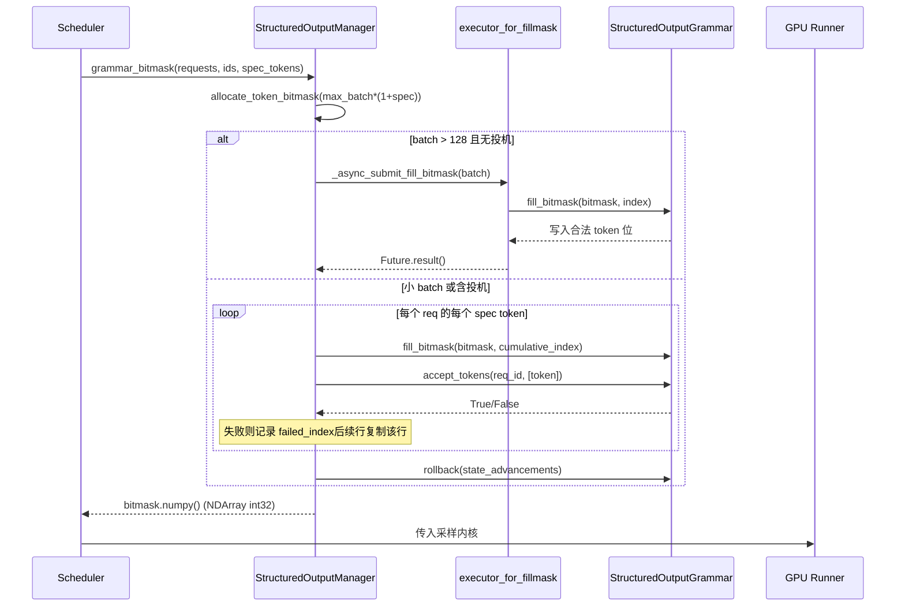

# Kapitel 7: Sampling und Ausgabe: Logits-Verarbeitung, strukturierte Ausgabe und Streaming-Rückgabe

Im vorherigen Kapitel haben wir verfolgt, wie das Attention-Backend die block table in Kernel-Parameter übersetzt und auf nicht zusammenhängendem Speicher eine Gather-Attention-Berechnung durchführt. Aber die Attention erzeugt nur Hidden States – was das Modell dem Benutzer tatsächlich liefern soll, ist der Text des nächsten Tokens. Dieses Kapitel verfolgt diese letzte Meile: Nachdem Hidden States über lm_head zu Logits projiziert wurden, wie durchlaufen sie eine sorgfältig sortierte Prozessorkette (Temperatur, Penalty, top-k/top-p, strukturelle Constraints), werden zu einer Token-ID gesampelt und anschließend durch den Detokenizer wieder in Text umgewandelt und per Streaming übertragen. Wenn auf dieser Kette irgendein Schritt in falscher Reihenfolge abläuft oder Zustand ausläuft, verschlechtert sich die Ausgabequalität still.

# Sampler: Die Reihenfolge der Prozessorkette ist die Korrektheit

**Intuitives Modell**: Der Sampler gleicht einer Montagelinie, und die Logits sind das zu bearbeitende Rohteil. Jede Station (processor) auf der Linie verändert das Rohteil, und die Reihenfolge der Stationen bestimmt direkt das Endprodukt – erst schneiden und dann schleifen ergibt etwas anderes als erst schleifen und dann schneiden. Ohne diese Kette könnte das Modell nur die rohe Wahrscheinlichkeitsverteilung ausgeben, und der Benutzer erhielte ein „nacktes Sampling“, bei dem Temperatur nicht steuerbar, Wiederholung nicht unterdrückbar und Format nicht einschränkbar ist.

## Datenstruktur und Speicherlayout

Der Sampler selbst ist`nn.Module`, aber sein Kernzustand ist extrem dünn: Er hält nur`topk_topp_sampler`Submodul,`logprobs_mode`und`use_fp64_gumbel`Flag[FACT:vllm/v1/sample/sampler.py:61-64]. Der eigentliche Batch-Zustand ist vollständig in`SamplingMetadata`gekapselt und wird über Forward-Parameter übergeben. Dieses Design aus „zustandslosem Sampler + externen Metadaten“ ist absichtlich: Die Sampler-Instanz wird während der Lebensdauer der Engine nur einmal erstellt, während sich die Batch-Zusammensetzung bei jedem Decode-Schritt ändert. Nur durch Auslagern des Zustands kann der Sampler nach dem Capture durch CUDA Graph sicher wiedergegeben werden.

Die Schlüsselkonstante ist`_SAMPLING_EPS = 1e-5` [FACT:vllm/v1/sample/sampler.py:18]. Sie dient gleichzeitig zwei Semantiken: Eine Temperatur unterhalb dieses Werts gilt als gierig, und`apply_temperature`dient als Fallback zur Vermeidung von Division durch null.

## Step-by-Step Walkthrough

Szenario: In einem Batch sind gierige Anfragen und Zufalls-Sampling-Anfragen gemischt, und bei einigen Anfragen ist zusätzlich logprobs aktiviert.

**Erster Schritt: Snapshot der ursprünglichen logprobs.**Bevor irgendeine Penalty oder Temperatur angewendet wird, wird, falls die Anfrage logprobs benötigt, zuerst gemäß`logprobs_mode`der Snapshot-Inhalt festgelegt[FACT:vllm/v1/sample/sampler.py:84-93]. Beachten Sie, dass der Kommentar ausdrücklich den Unterschied zu V0 hervorhebt: V1 verwendet**ursprüngliche Logits**(vor Penalty und Temperatur), um top-k logprobs zu berechnen[FACT:vllm/v1/sample/sampler.py:72-77]. Dies ist ein semantischer Vertrag – die vom Benutzer gesehenen logprob sollten die wahre Verteilung des Modells widerspiegeln, nicht eine durch Strafen verzerrte Verteilung.

**Zweiter Schritt: Vereinheitlichung auf float32.** [FACT:vllm/v1/sample/sampler.py:95-96]Unabhängig davon, ob die Eingabe bf16 oder fp16 ist, wird auf float32 hochkonvertiert. Der Grund ist, dass nachfolgende log_softmax-, top-k- und kumulative Wahrscheinlichkeitsberechnungen bei niedriger Präzision Fehler akkumulieren, insbesondere bei einem Vokabular von 150.000.

**Dritter Schritt: Prozessorkette für nicht-argmax-invariante Operationen.** `apply_logits_processors`Nacheinander angewendet: Allowed-Token-Whitelist-Maske, Bad-Words-Ausschluss,`non_argmax_invariant`Prozessoren, Strafterme[FACT:vllm/v1/sample/sampler.py:391-404]. Die Klassifizierung hier ist das zentrale Design –`non_argmax_invariant`bezieht sich auf diejenigen**, die das Greedy-Ergebnis verändern**Prozessoren (wie min_tokens, logit_bias), die vor dem Greedy-Sampling wirksam sein müssen; während`argmax_invariant`Prozessoren (wie min_p) das argmax nicht verändern und auf nach der Temperatur verschoben werden können.

**Vierter Schritt: Sampling.** `sample`Die Methode prüft zunächst, ob vollständig zufällig[FACT:vllm/v1/sample/sampler.py:256-271]: Falls`all_greedy`, direkt argmax zurückgeben; andernfalls zuerst das Greedy-Ergebnis als Reserve berechnen, dann Temperatur, argmax-invariante Prozessoren, top-k/top-p anwenden[FACT:vllm/v1/sample/sampler.py:275-291]. Schließlich mit`torch.where`anhand des Temperaturschwellenwerts zwischen Greedy- und Zufallsergebnis wählen[FACT:vllm/v1/sample/sampler.py:305-306], und`greedy_sampled`Tensor als Ausgabepuffer wiederverwenden, um zusätzliche Allokation zu vermeiden.

**Fünfter Schritt: logprobs sammeln und Ausgabe verpacken.**Nach`num_logprobs`drei Fälle: None gibt nur die logprobs des angegebenen Tokens zurück; -1 gibt alle unsortierten logprobs zurück; andernfalls top-k[FACT:vllm/v1/sample/sampler.py:120-131]. Schließlich Token-ID in int32 konvertieren, um die Größe zu komprimieren, erweitert zu`[num_requests, 1]`einem zweidimensionalen Tensor[FACT:vllm/v1/sample/sampler.py:138-148]。

```mermaid
flowchart TD
    in_logits["logits (bf16/fp16)"] --> snap{"需要 logprobs?"}
    snap -->|是| raw["compute_logprobs / cloneraw_logprobs 快照"]
    snap -->|否| f32
    raw --> f32["logits.to(float32)"]
    f32 --> proc["apply_logits_processors"]
    proc --> mask{"allowed_token_ids_mask?"}
    mask -->|是| fill["masked_fill_(-inf)"]
    mask -->|否| bad
    fill --> bad{"bad_words_token_ids?"}
    bad -->|是| apply_bad["apply_bad_words"]
    bad -->|否| noninv
    apply_bad --> noninv["non_argmax_invariant 处理器"]
    noninv --> pen["apply_penalties"]
    pen --> sample["sample()"]
    sample --> allg{"all_greedy?"}
    allg -->|是| greedy["greedy_sample (argmax)"]
    allg -->|否| temp["apply_temperature"]
    temp --> arginv["argmax_invariant 处理器"]
    arginv --> topp["topk_topp_sampler"]
    topp --> where["torch.where(temp  out
    where --> out["SamplerOutputsampled_token_ids"]
```

## Designüberlegungen und Fallstricke

**Warum müssen Strafterme vor der Temperatur angewendet werden?**Temperatur ist eine Skalierung der Verteilung, Strafe ist eine Zu- oder Abwertung bestimmter Tokens. Wenn zuerst skaliert und dann bestraft wird, wird die absolute Stärke der Strafe durch die Temperatur vergrößert oder verkleinert, was dazu führt, dass dieselben Strafparameter bei unterschiedlichen Temperaturen inkonsistent wirken. V1 legt die Strafe vor der Temperatur fest, um die Stabilität der Parametersemantik zu gewährleisten.

**`mark_unbacked`Der Kompilierungs-Fallstrick von**In`gather_logprobs`wird`batched_count_greater_than`kompiliert, und wenn die Batch-Dimension von 1 auf ≥2 wechselt, wird dynamos 0/1-Spezialisierung-Neukompilierung ausgelöst[FACT:vllm/v1/sample/sampler.py:345-348]。`mark_unbacked`markiert diese Dimension als vollständig symbolisch, um diese Neukompilierung zu vermeiden. Wenn in der Produktionsumgebung nach der ersten decode-Anfrage plötzlich eine einmalige Verzögerung auftritt, ist dies wahrscheinlich genau diese Art von Neukompilierung.

**`gpu_sync_allowed`Die Synchronisationsgrenze von** `batched_count_greater_than`kann intern GPU-Synchronisation auslösen, vLLM verwendet`gpu_sync_allowed(first_only=True)`Kontext, um explizit zu deklarieren: „Hier ist Synchronisation erlaubt, aber nur beim ersten Mal"[FACT:vllm/v1/sample/sampler.py:345-348]. Wenn innerhalb des CUDA-Graph-Capture-Bereichs unerwartet synchronisiert wird, schlägt die Aufnahme fehl – dies ist der Schlüsselhinweis zur Fehlersuche bei Graph-Capture-Problemen.

# Strukturierte Ausgabe: Dual-Track-Zustandsmaschine aus Bitmaske und Grammatik

**Intuitives Modell**: Strukturierte Ausgabe ist wie eine „Grammatikbrille" für den Sampler – bei jedem Schritt sind nur Tokens sichtbar, die dem JSON-Schema oder der Grammatik entsprechen. Ohne sie könnte das Modell syntaktisch fehlerhaftes JSON generieren, und der nachgelagerte Parser würde direkt abstürzen. Der Kern der vLLM-Implementierung liegt darin: Die Grammatik-Zustandsmaschine wird auf der CPU-Seite vorangetrieben, während die Einschränkungen in Form von Bitmasken an das GPU-seitige Sampling übergeben werden.

## Datenstrukturen und Speicherlayout

`StructuredOutputManager`ist ein Engine-Level-Singleton, das`backend`(eines von xgrammar/guidance/outlines/lm-format-enforcer),`reasoner_cls`und zwei Thread-Pools hält[FACT:vllm/v1/structured_output/__init__.py:39-98]。

Die Bitmaske ist die zentrale Datenstruktur:`_grammar_bitmask`ist ein int32-Tensor der Form`[max_batch_size * (1 + max_num_spec_tokens), vocab_size/32]`[FACT:vllm/v1/structured_output/__init__.py:327-336]. Jedes Bit entspricht der Legalität eines Tokens.`_full_mask = torch.tensor(-1, dtype=torch.int32)`bedeutet „alle 1" – alle Tokens legal[FACT:vllm/v1/structured_output/__init__.py:59]。

Die beiden Thread-Pools haben klare Aufgaben:`executor`ist für die Grammatik-Kompilierung zuständig (CPU-intensiv, Worker-Anzahl ist die Hälfte der CPU-Anzahl)[FACT:vllm/v1/structured_output/__init__.py:71-78]；`executor_for_fillmask`ist für die parallele Befüllung von Bitmasken bei großen Batches zuständig, wird nur aktiviert, wenn der Batch 128 überschreitet[FACT:vllm/v1/structured_output/__init__.py:62-69]。

## Step-by-Step Walkthrough

**Grammatik-Initialisierung.**Wenn eine Anfrage zum ersten Mal eintritt, wird`grammar_init`aufgerufen[FACT:vllm/v1/structured_output/__init__.py:115-176]. Falls das Backend nicht initialisiert ist, wird die Implementierung gemäß Konfiguration ausgewählt[FACT:vllm/v1/structured_output/__init__.py:130-165]. Danach wird der Kompilierungsauftrag übermittelt: Standardmäßig asynchron`executor.submit`, aber im`external_launcher`-Modus muss synchron[FACT:vllm/v1/structured_output/__init__.py:167-176]。

**Bitmasken-Generierung erfolgen.**Bei jedem decode step`grammar_bitmask`werden Masken für alle strukturierten Anfragen im Batch generiert[FACT:vllm/v1/structured_output/__init__.py:314-442]. Große Batches nehmen den parallelen Pfad: in 16er-Gruppen an den Thread-Pool übermittelt[FACT:vllm/v1/structured_output/__init__.py:346-373]. Kleine Batches nehmen den seriellen Pfad und treiben den Grammatik-Zustand Token für Token voran[FACT:vllm/v1/structured_output/__init__.py:374-433]。

**Masken-Ausrichtung bei spekulativer Dekodierung.**Dies ist der raffinierteste Teil. Wenn Draft-Tokens vorhanden sind, benötigt jede Anfrage`1 + max_num_spec_tokens`Zeilen Masken. Der serielle Pfad verarbeitet Token für Token: Wenn ein Draft-Token von der Grammatik abgelehnt wird, wird`failed_index`aufgezeichnet, und nachfolgende Zeilen kopieren direkt die Maske dieser Zeile[FACT:vllm/v1/structured_output/__init__.py:396-418]. Dies gewährleistet, dass „nach Ablehnung eines Drafts der Einschränkungszustand nachfolgender Positionen auf den Ablehnungspunkt zurückgesetzt wird".

**Zustands-Rollback.**Während der Bitmasken-Befüllung wird der Grammatik-Zustand um`state_advancements`Schritte vorangetrieben, aber das Draft-Token wurde noch nicht tatsächlich akzeptiert, daher muss`grammar.rollback(state_advancements)`zurückgerollt werden[FACT:vllm/v1/structured_output/__init__.py:422-430]. Die tatsächliche Akzeptanz erfolgt in`accept_tokens` [FACT:vllm/v1/structured_output/__init__.py:444-466]。



## Designüberlegungen und Fallstricke

**Warum muss external_launcher synchron kompilieren?**Der Kommentar gibt den genauen Grund an: Asynchrone Kompilierung führt dazu, dass`WAITING_FOR_STRUCTURED_OUTPUT_GRAMMAR → WAITING`Zustandsübergänge auf verschiedenen TP-Rängen zu unterschiedlichen Zeitpunkten stattfinden, was die von external_launcher vorausgesetzte Determinismus-Annahme verletzt[FACT:vllm/v1/structured_output/__init__.py:47-56]Dies ist ein typischer Fall des Konflikts zwischen verteilter Determinismus und asynchroner Optimierung.

**Der constraint-Startpunkt unter dem Inferenzmodell.** `_get_constraint_start`Entscheidet, ab welchem Token die Syntaxbeschränkung angewendet wird[FACT:vllm/v1/structured_output/__init__.py:220-292]. Bei Modellen mit Gedankenkette sollte die Reasoning-Phase nicht durch JSON eingeschränkt werden, sondern erst nach Abschluss des Reasonings gestartet werden.`enable_in_reasoning`Wenn True, wird direkt 0 zurückgegeben (durchgehende Einschränkung)[FACT:vllm/v1/structured_output/__init__.py:235-236]. Wenn der Reasoner`find_reasoning_end_offset`unterstützt, wird damit präzise lokalisiert[FACT:vllm/v1/structured_output/__init__.py:261-267]; andernfalls wird auf die tokenweise Rückwärtssuche zurückgegriffen[FACT:vllm/v1/structured_output/__init__.py:287-291]。

**`validate_tokens`die Präfixsemantik.**Bei spekulativer Dekodierung können Draft-Tokens gegen die Grammatik verstoßen,`validate_tokens`gibt das "längste legale Präfix" zurück[FACT:vllm/v1/structured_output/__init__.py:294-312]. Beachten Sie, dass zuerst die spekulative Auffüllung (-1) entfernt wird, dann der Constraint-Startpunkt berechnet wird und schließlich nur die Tokens innerhalb des Constraint-Intervalls einer Syntaxprüfung unterzogen werden.

# Detokenizer: Das Grenzspiel zwischen inkrementeller Dekodierung und Stop-String

**Intuitives Modell**: Der Detokenizer gleicht einem Schreiber, der Zeichen für Zeichen abschreibt und Token-IDs in für Menschen lesbaren Text übersetzt. Die Schwierigkeit besteht darin, dass Tokens und Zeichen nicht eins zu eins übereinstimmen (ein Token kann nur einem halben UTF-8-Zeichen entsprechen) und ein Stop-String sich über mehrere Tokens erstrecken kann. Ohne inkrementelle Dekodierung müsste bei jedem Schritt die gesamte Sequenz von Grund auf dekodiert werden, und der O(n²)-Aufwand würde den Durchsatz erheblich beeinträchtigen.

## Datenstrukturen und Speicherlayout

`IncrementalDetokenizer`Die Basisklasse hält nur`token_ids`Liste[FACT:vllm/v1/engine/detokenizer.py:32-33]。`BaseIncrementalDetokenizer`fügt stop-bezogene Felder hinzu:`stop`Liste,`min_tokens`、`include_stop_str_in_output`、`stop_buffer_length`und`_last_output_text_offset` [FACT:vllm/v1/engine/detokenizer.py:70-94]。

`stop_buffer_length`sind entscheidend: Wenn der Stop-String nicht in der Ausgabe enthalten ist, entspricht er der Länge des längsten Stop-Strings minus eins[FACT:vllm/v1/engine/detokenizer.py:87-90]. Dieser "Rückfallpuffer" stellt sicher, dass die Streaming-Ausgabe nicht vorzeitig Zeichen ausgibt, die ein Präfix eines Stop-Strings sein könnten.

Zwei Implementierungspfade:`FastIncrementalDetokenizer`Verwendung der`DecodeStream` [FACT:vllm/v1/engine/detokenizer.py:166-246]；`SlowIncrementalDetokenizer`der tokenizers-Bibliothek, Verwendung von`detokenize_incrementally` [FACT:vllm/v1/engine/detokenizer.py:249-305]auf der Python-Seite. Die Auswahl basiert darauf, dass die tokenizers-Version ≥ 0.22.0 ist und der Tokenizer-Typ übereinstimmt[FACT:vllm/v1/engine/detokenizer.py:32-33][FACT:vllm/v1/engine/detokenizer.py:61-63]。

## Step-by-Step Walkthrough

**Inkrementelle Dekodierung.** `update`Empfängt neue Token-IDs und`stop_terminated`Flag[FACT:vllm/v1/engine/detokenizer.py:96-142]. Wenn stop beendet wird und kein Stop-String enthalten ist, wird das letzte Token von der Dekodierung ausgeschlossen[FACT:vllm/v1/engine/detokenizer.py:107-111]. Anschließend wird tokenweise`decode_next`aufgerufen, um Text zu akkumulieren[FACT:vllm/v1/engine/detokenizer.py:117-122]。

**Stop-String-Erkennung.** `check_stop_strings`Sucht nur innerhalb des Bereichs neu hinzugefügter Zeichen[FACT:vllm/v1/engine/detokenizer.py:308-360]. Der Suchstartpunkt ist`1 - new_char_count - stop_string_len` [FACT:vllm/v1/engine/detokenizer.py:338], dieser Offset stellt sicher, dass Stop-Strings, die Token-Grenzen überspannen, ebenfalls erfasst werden. Wenn mehrere Stop-Strings gleichzeitig übereinstimmen, wird derjenige ausgewählt, der**am frühesten abgeschlossen ist**[FACT:vllm/v1/engine/detokenizer.py:342-347]。

**Streaming-Ausgabe-Slicing.** `get_next_output_text`Gemäß dem`delta`-Parameter wird entschieden, ob die Gesamtmenge oder das Inkrement zurückgegeben wird[FACT:vllm/v1/engine/detokenizer.py:148-163]. Wenn nicht abgeschlossen, werden`stop_buffer_length`Zeichen zurückgehalten und nicht ausgegeben[FACT:vllm/v1/engine/detokenizer.py:145-146], wobei`_last_output_text_offset`die bereits gesendete Position aufzeichnet[FACT:vllm/v1/engine/detokenizer.py:148-163]。

**Ausnahmewiederherstellung.** `FastIncrementalDetokenizer._protected_step`Behandelt zwei Arten von Ausnahmen: OverflowError/TypeError werden protokolliert und None zurückgegeben[FACT:vllm/v1/engine/detokenizer.py:225-229]; bei "Invalid prefix"-Fehlern wird**DecodeStream neu aufgebaut**und erneut versucht[FACT:vllm/v1/engine/detokenizer.py:222-246]. Letzteres behandelt Randfälle, in denen der Tokenizer nicht-monotone UTF-8-Ausgaben erzeugt.

## Designüberlegungen und Stolperfallen

**Abwägung bei stop_buffer_length.**Je länger der Puffer, desto größer die Streaming-Verzögerung (der Nutzer sieht den Text später), aber desto unwahrscheinlicher ist es, dass ein tokenübergreifender Stop-String übersehen wird. Die Wahl "Länge des längsten Stop-Strings minus eins" ist die exakte untere Schranke: Jedes Präfix eines Stop-Strings kann höchstens so lang sein.

**min_tokens und stop_check_offset.**Wenn die Anzahl der Ausgabe-Tokens`min_tokens`nicht erreicht,`stop_check_offset`wird kontinuierlich an das Textende verschoben[FACT:vllm/v1/engine/detokenizer.py:120-122], was bedeutet, dass dieser Text nicht von der Stop-Erkennung erfasst wird. Dies verhindert, dass das Modell gleich zu Beginn auf einen Stop-String trifft und eine leere Ausgabe erzeugt.

**added_token_ids-Cache im Fast-Pfad.**Wenn`spaces_between_special_tokens`False ist, müssen Leerzeichen zwischen speziellen Tokens unterdrückt werden[FACT:vllm/v1/engine/detokenizer.py:192-207]. Der Code speichert`added_token_ids`im Tokenizer-Objekt zwischen[FACT:vllm/v1/engine/detokenizer.py:195-200], um zu vermeiden, dass bei jedem Decode das Wörterbuch neu aufgebaut wird.

# Designüberlegungen

Drei Module teilen eine Designphilosophie:**Zustandsfortschritt und Constraint-Prüfung trennen, sodass die GPU-Seite nur zustandslose Tensoroperationen ausführt**. Der Sampler ist zustandslos, der Zustand liegt in`SamplingMetadata`; der Grammatik-Zustandsautomat wird auf der CPU-Seite vorangetrieben, die GPU konsumiert nur Bitmasken; der`_last_output_text_offset`des Detokenizers ist der einzige Streaming-Cursor. Diese Trennung ermöglicht es, jede GPU-seitige Komponente durch CUDA Graph zu erfassen.

Eine weitere Hauptlinie ist**Reihenfolge ist Semantik**. Die Reihenfolge der Prozessorkette des Samplers, der Constraint-Startpunkt der strukturierten Ausgabe, der Stop-Erkennungs-Offset des Detokenizers – ein Fehler in der Reihenfolge führt nie zum Absturz, sondern still zu falschen Ergebnissen – genau das macht diese Art von Code am schwierigsten zu debuggen.

# Zusammenfassung dieses Kapitels

- Die Prozessorkette des Samplers ist streng geordnet: Snapshot der ursprünglichen Logprobs → float32 → Whitelist/Bad Words → non-argmax-invariant → Strafen → Temperatur → argmax-invariant → top-k/top-p.
- Strukturierte Ausgabe verwendet Bitmasken, um den syntaktischen Zustand auf der CPU-Seite an die GPU zu übergeben; unter spekulativem Decoding wird durch`failed_index`Kopieren und`rollback`die Konsistenz des Zustands sichergestellt.
- Der Detokenizer verwendet`stop_buffer_length`einen Fallback-Puffer, um Streaming-Latenz und die Erkennung von Stop-Strings über Token-Grenzen hinweg auszubalancieren; der Fast-Pfad hängt von tokenizers ≥ 0.22.0 ab`DecodeStream`。

# Gedanken und Selbsttest zu diesem Kapitel

Q1: Wenn man`apply_logits_processors`den Strafterm (`apply_penalties`) so verschiebt, dass er nach der Temperatur angewendet wird, welche konkreten Abweichungen treten im Hochtemperatur-Sampling-Szenario mit temperature=2.0 auf? Warum?

**Referenzanalyse**: Die Temperatur ist eine Skalierung des gesamten Logits-Vektors (`logits.div_(temp)`）[FACT:vllm/v1/sample/sampler.py:241-242]. Der Strafterm (z. B. repetition penalty) ist eine multiplikative/additive Anpassung bestimmter Tokens. Wenn zuerst skaliert und dann bestraft wird, wird die absolute Stärke der Strafe durch die Temperatur um den Faktor 2 verstärkt, sodass dieselbe Gruppe von`repetition_penalty`Parametern bei hoher Temperatur eine viel stärkere Unterdrückung bewirkt als bei niedriger Temperatur; die Semantik der Parameter driftet mit der Temperatur. V1 legt die Strafe vor der Temperatur fest[FACT:vllm/v1/sample/sampler.py:403-404], um die Strafstärke von der Temperatur zu entkoppeln. Außerdem gehört die Strafe zur Kategorie`non_argmax_invariant`(beeinflusst das Greedy-Ergebnis), während der Greedy-Pfad bereits vor der Temperatur zurückkehrt[FACT:vllm/v1/sample/sampler.py:261-271]; würde sie nach die Temperatur verschoben, würden Greedy-Anfragen die Strafe vollständig umgehen, was zu inkonsistentem Verhalten führt.

Q2: Im seriellen Pfad von`grammar_bitmask`was passiert in der Kombination aus spekulativem Decoding + strukturierter Ausgabe, wenn man die Zeile`grammar.rollback(state_advancements)` [FACT:vllm/v1/structured_output/__init__.py:422-430]löscht? Bitte analysieren Sie dies im Zusammenhang mit dem Aufrufzeitpunkt von`accept_tokens`.

**Referenzanalyse**: Beim Füllen der Bitmaske ruft der Code für jedes Draft-Token`grammar.accept_tokens`auf, um den syntaktischen Zustand voranzutreiben und die Maske für die nächste Position zu erzeugen[FACT:vllm/v1/structured_output/__init__.py:396-418], aber dies ist nur ein „versuchsweises Vorantreiben“ – das Draft-Token wurde noch nicht vom Zielmodell verifiziert und akzeptiert. Wenn man`rollback`löscht, bleibt der syntaktische Zustand dauerhaft an der Position „alle Drafts wurden akzeptiert“. Wenn das Zielmodell tatsächlich einige Draft-Tokens ablehnt, passt die tatsächlich akzeptierte Token-Sequenz nicht zum syntaktischen Zustand:`accept_tokens` [FACT:vllm/v1/structured_output/__init__.py:444-466]validiert auf Basis des falschen syntaktischen Zustands, was dazu führt, dass legitime Tokens abgelehnt oder illegitime Tokens durchgelassen werden. Das Ergebnis ist eine stillschweigende Beschädigung der JSON-Ausgabe: kein Absturz, aber nachgelagerte Parser schlagen fehl.

Q3: `check_stop_strings`Der Suchstartpunkt von`1 - new_char_count - stop_string_len` [FACT:vllm/v1/engine/detokenizer.py:338]ist

**. Wenn man stattdessen ab 0 vollständig sucht, ist das funktional korrekt? Welche Performance-Probleme entstehen im Szenario langer Sequenzen mit Streaming?**Referenzanalyse`output_text`: Funktional korrekt – die Suche ab 0 findet alle Übereinstimmungen, einschließlich solcher über Token-Grenzen hinweg. Performance-mäßig führt jedoch jeder Schritt für den gesamten`find`ein**aus, wodurch die Komplexität von O(new_char_count) auf O(total_length) degeneriert, bei langen Sequenzen also O(n²). Noch schwerwiegender ist, dass die Suche ab 0 auf**bereits an den Benutzer gesendeten historischen Text`1 - new_char_count - stop_string_len`passen kann, was zu wiederholtem Auslösen des Stops oder falschem Abschneiden führt. Der Offset

des ursprünglichen Designs deckt genau das minimal notwendige Fenster „neu hinzugefügte Zeichen + möglicherweise grenzüberschreitendes Stop-String-Präfix“ ab und stellt sowohl sicher, dass nichts übersehen wird, als auch dass Fehlübereinstimmungen mit der Historie vermieden werden.
