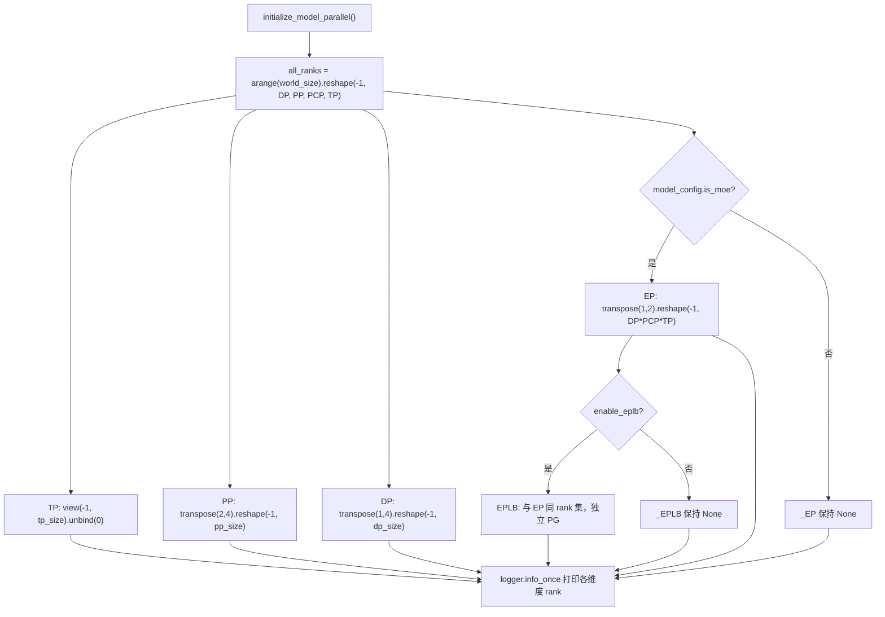
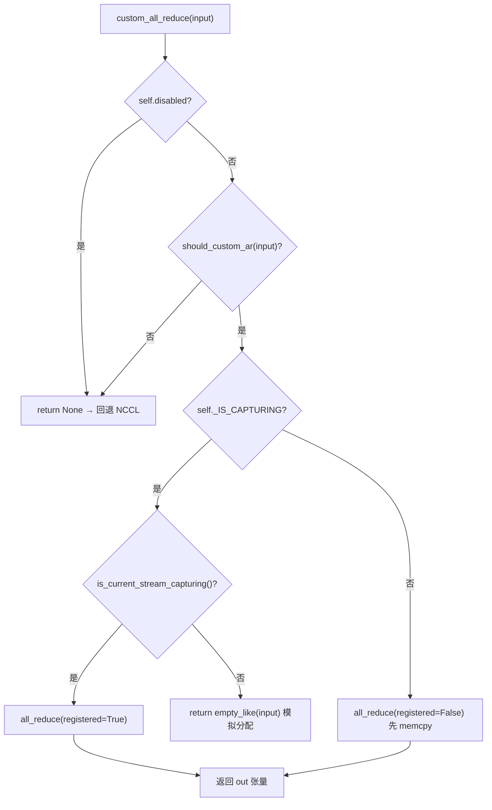

# Nächstes Kapitel: Kapitel 8 →

Verifikationsstatus: FACT-Zeilennummern echt verankert

# Im vorherigen Kapitel haben wir den letzten Kilometer des Lebenszyklus einer einzelnen Inferenz zurückgelegt, vom Logits-Sampling bis zur Streaming-Ausgabe. Sobald das Modell jedoch zu groß ist, um auf eine einzelne Karte zu passen, muss diese Pipeline auf mehrere Geräte aufgeteilt und kooperativ ausgeführt werden. Die erste Frage der verteilten Inferenz lautet nicht „Wie teilt man das Modell auf?“, sondern „Wer spricht nach der Aufteilung mit wem und auf welche Weise?“. vLLM überlässt diese beiden Fragen jeweils der Prozessgruppen-Topologie in parallel_state.py und der Communicator-Implementierung in custom_all_reduce.py. Dieses Kapitel folgt der Kette „Gruppe aufbauen → Aufteilen → Kommunizieren → Lastausgleich“ und zerlegt Schicht für Schicht die Parallelstrategien von TP, PP und EP sowie die zugrunde liegenden Kommunikationsprimitive.

## 8.1 Prozessgruppen-Topologie: Wie aus einem Rank-Gitter TP/PP/DP/EP herausgeschnitten werden

Intuitives Modell`new_group`, dann entsteht eine Kommunikationsverschiebung der Art „Ich dachte, du bist in der TP-Gruppe, aber eigentlich bist du in der DP-Gruppe“ – sobald bei der kollektiven Kommunikation ein Rank fehlt, hängt NCCL direkt und meldet keinen Fehler.

## Datenstruktur und Speicherlayout

`GroupCoordinator`ist der Träger all dessen. Sein Felddesign entspricht direkt der „mehrfachen Identität eines Prozesses über mehrere parallele Dimensionen“:

- `rank`ist der globale Rank,`ranks`ist die Liste der globalen Ranks der Mitglieder dieser Gruppe,`world_size`ist die Gruppengröße[FACT:vllm/distributed/parallel_state.py:434-436]。
- `local_rank`wird zum Binden des Geräts verwendet,`rank_in_group`ist die gruppeninterne Ordnungsnummer – der Quellcode unterscheidet beide präzise anhand einer Tabelle: In einer 4-Karten-Gruppe über zwei Knoten ist für Rank 2`local_rank`gleich 0 (auf Knoten 1 ist es die erste Karte), aber`rank_in_group`ist 2[FACT:vllm/distributed/parallel_state.py:437-445]。
- `cpu_group`und`device_group`existieren paarweise: Ersteres nutzt gloo für Metadaten-/Objektkommunikation, Letzteres nutzt NCCL für Tensorkommunikation[FACT:vllm/distributed/parallel_state.py:446-447]。

Hier gibt es ein entscheidendes Design:**Warum muss jede Gruppe eine CPU-Gruppe verwalten?**Weil`broadcast_object`、`send_object`bei Operationen dieser Art Python-Objekte (serialisierte Bytes) übertragen werden; über NCCL würde dies sowohl VRAM verschwenden als auch möglicherweise das aktuelle CUDA-Gerät verunreinigen.`barrier()`Die Kommentare machen diesen Punkt sehr deutlich: NCCLs barrier ist intern ein broadcast, erstellt heimlich GPU-Tensoren und kann leicht das aktuelle Gerät durcheinanderbringen, daher muss eine CPU-Gruppe verwendet werden[FACT:vllm/distributed/parallel_state.py:1355-1362]。

## Step-by-Step：`initialize_model_parallel`Wie das Gitter aufgeteilt wird

Nehmen wir ein konkretes Szenario: 8 Karten, TP=2, PP=4, DP=1. Der Kern besteht darin, die eindimensionale Rank-Sequenz in ein mehrdimensionales Gitter umzuformen und dann entlang jeder Dimension aufzuteilen.

Erster Schritt: das Rank-Gitter konstruieren. Die Layout-Reihenfolge ist explizit definiert als`ExternalDP x DP x PP x PCP x TP` [FACT:vllm/distributed/parallel_state.py:2045-2060]：

```python
all_ranks = torch.arange(world_size).reshape(
    -1, data_parallel_size, pipeline_model_parallel_size,
    prefill_context_model_parallel_size, tensor_model_parallel_size,
)
```

Zweiter Schritt: die TP-Gruppe aufteilen: das Gitter als`(-1, tp_size)`viewen und dann unbinden, um`[g0,g1],[g2,g3],...` [FACT:vllm/distributed/parallel_state.py:2065-2077]zu erhalten. Beachte, dass der TP-Gruppe zusätzlich`use_message_queue_broadcaster=True`übergeben wird, weil die TP-Gruppe Shared-Memory-Broadcast benötigt, um Metadaten zu verteilen.

Dritter Schritt: die PP-Gruppe aufteilen:`all_ranks.transpose(2, 4)`Die PP-Dimension an die letzte Dimension verschieben und dann aufteilen, um`[g0,g2,g4,g6],[g1,g3,g5,g7]` [FACT:vllm/distributed/parallel_state.py:2175-2188]zu erhalten. Genau das ist das im Docstring angegebene Beispiel[FACT:vllm/distributed/parallel_state.py:1997-1997]。

Vierter Schritt: die DP-Gruppe aufteilen:`transpose(1, 4)`danach[FACT:vllm/distributed/parallel_state.py:2195-2202]。

Fünfter Schritt: die EP-Gruppe aufteilen – hier gibt es ein leicht zu übersehendes Detail: Die EP-Gruppe wird nur unter MoE-Modellen erstellt, bei dense-Modellen wird sie direkt übersprungen[FACT:vllm/distributed/parallel_state.py:2210-2241]. Die Rank-Menge der EP-Gruppe ist das Produkt von`DP x PCP x TP`, was bedeutet, dass EP die physischen Karten von DP und TP wiederverwendet und keine unabhängige Dimension ist.



## Designüberlegungen und Stolperfallen

**Warum braucht EPLB eine unabhängige Prozessgruppe?**Die Kommentare liefern die Antwort: EPLB-Kommunikation von der kollektiven Kommunikation des MoE-Forward isolieren, um zu verhindern, dass „torch.distributed zur Ausführungszeit“ und „torch.distributed von EPLB“ sich gegenseitig deadlocken[FACT:vllm/distributed/parallel_state.py:2243-2246]. Dies ist ein typischer Trade-off von „Determinismus durch eine unabhängige Kommunikationsdomäne erkaufen“ – der VRAM-Overhead einer zusätzlichen PG wird dadurch erkauft, dass der Forward beim Gewichtsverschieben nicht blockiert.

**Synchronisationsbeschränkung der DP-Gruppe**ist die Stolperfalle, in die man in Produktionsumgebungen am häufigsten tritt: Alle Ranks innerhalb derselben DP-Gruppe müssen gleichzeitig`generate`aufrufen, sonst Deadlock[FACT:vllm/distributed/parallel_state.py:2048-2051]. Denn innerhalb der DP-Gruppe wird ein all-reduce der Gradienten-/Sampling-Ergebnisse durchgeführt; fehlt irgendein Rank, blockiert die kollektive Kommunikation dauerhaft.

**Zerstörungsreihenfolge**Auch hier gibt es Feinheiten.`destroy()`Zuerst wird der device communicator zerstört, dann device_group und cpu_group[FACT:vllm/distributed/parallel_state.py:1380-1393]. Die Kommentare erklären den Grund: Der device communicator kann Arbeitsbereiche für kollektive Kommunikation halten, die von diesen PGs abhängen (z. B. FlashInfer PCIe IPC barrier), und muss daher zuerst freigegeben werden[FACT:vllm/distributed/parallel_state.py:1377-1377]。

# 8.2 Kommunikationsprimitive: Wie ein benutzerdefiniertes all-reduce NCCL umgeht

## Intuitives Modell

NCCLs all-reduce ist ein „Universallastwagen“, der jede Fracht transportieren und jede Straße befahren kann, aber Start- und Protokoll-Overhead sind fest. Wenn man auf einer Maschine mit 8 Karten und vollständiger NVLink-Vernetzung wiederholt kleine Tensor-all-reduces durchführt (jede Attention-/MLP-Schicht von TP muss dies tun), wird die „Maut“ des Universallastwagens nicht mehr vernachlässigbar. Das benutzerdefinierte all-reduce ist ein „spezieller kleiner Handkarren“: Es wird nur auf derselben Maschine, bei vollständiger NVLink-Vernetzung und passender Tensorgröße aktiviert und ersetzt mit einem einzigen`cudaMemcpy`den Handshake- und Protokoll-Overhead von NCCL.

## Datenstruktur und Speicherlayout

`CustomAllreduce`Die Initialisierung ist eine Kombination aus „Fähigkeitserkennung + Ressourcenvorallokation“. Schlüsselfelder:

- `_SUPPORTED_WORLD_SIZES = [2, 4, 6, 8, 16]`: Unterstützt nur diese Gruppengrößen[FACT:vllm/distributed/device_communicators/custom_all_reduce.py:113-129]。
- `meta_ptrs`: Synchronisationsmetadaten + Zwischenergebnispuffer, Größe`ops.meta_size() + max_size` [FACT:vllm/distributed/device_communicators/custom_all_reduce.py:291-294]。
- `buffer_ptrs`: vorregistrierter IPC-Puffer; im eager-Modus wird der Eingabetensor zuerst hierher kopiert und dann berechnet[FACT:vllm/distributed/device_communicators/custom_all_reduce.py:298-305]。
- `rank_data`: 8 MB uint8-Tensor, der die IPC-Pufferzeiger-Tupel aller Ranks speichert[FACT:vllm/distributed/device_communicators/custom_all_reduce.py:309-315]。

**Warum müssen Puffer vorregistriert werden?**Weil CUDA Graph Capture erfordert, dass alle Adressen zum Zeitpunkt der Capture fest sind.`register_graph_buffers`Am Ende der Capture werden alle verwendeten Pufferadressen an alle Ranks gebroadcastet und registriert[FACT:vllm/distributed/device_communicators/custom_all_reduce.py:474-491]。

## Step-by-Step: Der Entscheidungsfluss eines all-reduce

Nehmen wir ein Szenario: Die MLP-Ausgabe einer Schicht innerhalb der TP-Gruppe muss all-reduce durchführen, die Eingabe ist ein 4 MB bf16-Tensor.

Erster Schritt,`custom_all_reduce`prüfen, ob deaktiviert und ob`should_custom_ar` [FACT:vllm/distributed/device_communicators/custom_all_reduce.py:529-533]。

Zweiter Schritt,`should_custom_ar`逐条过滤：world_size > 8 拒绝；dtype 必须是 fp32/fp16/bf16；字节数必须是 16 的倍数；必须弱连续；world_size==2 或全互联才继续[FACT:vllm/distributed/device_communicators/custom_all_reduce.py:493-508]。

第三步，根据是否在 CUDA Graph 捕获中分流：捕获中用`registered=True`（地址已固定），否则`registered=False`（需要先 memcpy 到预注册缓冲区）[FACT:vllm/distributed/device_communicators/custom_all_reduce.py:529-545]。

第四步，实际调用`ops.all_reduce`，传入`buffer_ptrs[rank]`和`max_size` [FACT:vllm/distributed/device_communicators/custom_all_reduce.py:519-527]。



## 设计思考与踩坑

**多机场景的降级路径**是这段代码最精妙的部分。`same_node`为假时，`mnnvl_only`置真[FACT:vllm/distributed/device_communicators/custom_all_reduce.py:198-199]，随后检查 MNNVL（Multi-Node NVLink）能力。如果组内不是每张卡都支持 MNNVL，直接禁用自定义集合通信[FACT:vllm/distributed/device_communicators/custom_all_reduce.py:228-233]。`_group_can_attempt_mnnvl`用一次 CPU all-reduce（MIN 操作）确保所有 rank 走同一条控制流[FACT:vllm/distributed/device_communicators/custom_all_reduce.py:59-73]——这是异构集群里避免"部分 rank 进 MNNVL 路径、部分走 NCCL"导致挂死的关键防护。

**P2P 检查的代价**：`_can_p2p`会遍历所有 peer 做`gpu_p2p_access_check`，注释说首次计算很贵但会缓存[FACT:vllm/distributed/device_communicators/custom_all_reduce.py:278-278]。生产环境如果发现启动慢，可以设`VLLM_SKIP_P2P_CHECK`跳过，直接信任驱动的 P2P 报告[FACT:vllm/distributed/device_communicators/custom_all_reduce.py:86-100]。

**reduce-scatter 的三级后端选择**值得单独看：`_select_reduce_scatter_backend`按优先级返回`mnnvl_multimem` > `mnnvl_lamport` > `legacy` [FACT:vllm/distributed/device_communicators/custom_all_reduce.py:601-636]。multimem 路径要求 world_size 在`(2,4,8)`且设备能力是 (10,0) 或 (10,3)（Blackwell 级）[FACT:vllm/distributed/device_communicators/custom_all_reduce.py:103-104]。注意`VLLM_BATCH_INVARIANT`会禁用 multimem 路径[FACT:vllm/distributed/device_communicators/custom_all_reduce.py:628]——因为 multimem 的归约顺序不确定，会破坏批不变性。

# 8.3 EPLB：专家负载再平衡的调度逻辑

## 直觉模型

MoE 模型里，256 个逻辑专家分到 32 张卡上，每卡 8 个。但真实流量下，某些"热门专家"（比如处理常见语法结构的）会被大量 token 路由到，导致持有它的卡成为瓶颈，其他卡空转。EPLB（Expert Parallel Load Balancer）就是"给热门专家加副本"：把热门专家的权重复制到空闲卡上，让 token 分流过去。若没有它，MoE 的实际吞吐会被最慢的那张卡锁死。

## 数据结构与内存布局

`EplbModelState`用三张映射表描述"逻辑专家 ↔ 物理专家"的关系：

- `physical_to_logical_map`：形状`(num_moe_layers, num_physical_experts)`，每个物理槽位存它承载的逻辑专家 id[FACT:vllm/distributed/eplb/eplb_state.py:105-120]。
- `logical_to_physical_map`：形状`(num_moe_layers, num_logical_experts, max_replicas+1)`，稀疏矩阵，-1 表示无映射[FACT:vllm/distributed/eplb/eplb_state.py:123-146]。
- `logical_replica_count`：每个逻辑专家有几个副本[FACT:vllm/distributed/eplb/eplb_state.py:147-161]。

`expert_load_window`是滑动窗口，形状`(window_size, num_moe_layers, num_physical_experts)` [FACT:vllm/distributed/eplb/eplb_state.py:180-187]。注释特别指出：现在记录所有物理专家的负载而非仅本地专家，以保证不同 dispatch 方法（naive all-to-all、DeepEP）统计一致；naive all-to-all 下每个 DP rank 贡献相同 token 集，负载会被乘以 dp_size[FACT:vllm/distributed/eplb/eplb_state.py:180-187]。

## Step-by-Step：一次重排的完整链路

代入场景：`expert_rearrangement_step`达到阈值，触发`rearrange()`。

第一步，把物理负载映射回逻辑专家。用`scatter_add_`按`physical_to_logical_map`聚合，无效槽位（<0）填到`invalid_idx`桶里最后丢弃[FACT:vllm/distributed/eplb/eplb_state.py:794-816]。

第二步，跨 rank all-reduce 得到全局逻辑负载。`_allreduce_list`对多个模型的负载做拼接后一次 all-reduce 再拆开，避免多次通信[FACT:vllm/distributed/eplb/eplb_state.py:1045-1068]。

第三步，调用策略计算新映射。`policy.rebalance_experts`在 host 上运行，所以负载窗口和当前映射都要拷回 CPU[FACT:vllm/distributed/eplb/eplb_state.py:859-867]。

第四步，ROCm 特化的"跳过重排"判断：如果新映射带来的 rank 负载不均衡改善小于 5%，就跳过这次重排[FACT:vllm/distributed/eplb/eplb_state.py:869-923]。这是一个务实的优化——重排本身有通信成本，收益不够就不做。

第五步，执行权重搬运并提交新映射[FACT:vllm/distributed/eplb/eplb_state.py:925-942]。

```mermaid
sequenceDiagram
    participant Main as 主线程 step()
    participant Policy as DefaultEplbPolicy
    participant Comm as EplbCommunicator
    participant Async as async_worker 线程
    Main->>Main: expert_rearrangement_step >= interval
    Main->>Main: scatter_add_ 物理负载→逻辑负载
    Main->>Main: _allreduce_list 跨 rank 聚合
    Main->>Policy: rebalance_experts(load, replicas, groups, nodes, gpus, map)
    Policy-->>Main: new_physical_to_logical_map
    alt 同步模式
        Main->>Comm: rearrange_expert_weights_inplace()
        Comm-->>Main: 权重搬运完成
        Main->>Main: _commit_eplb_maps()
    else 异步模式
        Main->>Main: eplb_stats = EplbStats(...); rebalanced = True
        Main->>Async: rearrange_event.record()
        Async->>Comm: 后台搬运权重到 expert_buffer
        Async-->>Main: pending_result 就绪
        Main->>Main: _move_to_workspace() 提交
    end
```

## 设计思考与踩坑

**异步模式的同步原语**是这段代码最微妙的地方。`rebalanced`标志依赖 GIL 在主线程和 async worker 之间同步[FACT:vllm/distributed/eplb/eplb_state.py:194-203]。但注释警告：`rebalanced`必须在所有 rank 上保持一致，否则`_all_ranks_result_ready`里的 all-reduce 会挂死[FACT:vllm/distributed/eplb/eplb_state.py:664-665]。`_all_ranks_result_ready`优先用 CPU 组做 all-reduce，因为 CPU 组更可靠[FACT:vllm/distributed/eplb/eplb_state.py:1024-1043]。

**滑动窗口的"提前录制"优化**：`_should_record_current_step`只在距离下次重排不超过`window_size`步时才开启录制[FACT:vllm/distributed/eplb/eplb_state.py:689-709]。注释解释：每个重排周期前`step_interval - window_size`步的数据会被滑动窗口覆盖，录了也白录，浪费 GPU 计算[FACT:vllm/distributed/eplb/eplb_state.py:1196-1199]。`should_record_tensor`是所有层共享的同一个标量张量，一次`fill_`更新所有层[FACT:vllm/distributed/eplb/eplb_state.py:272-278]。

**弹性 EP 的容量预留**：`enable_elastic_ep`时，`physical_expert_capacity`按`elastic_ep_max_dp_size`预留，映射表用 -1 填充多余槽位[FACT:vllm/distributed/eplb/eplb_state.py:375-386]。这样扩容时不需要重新分配显存，只需把 -1 槽位填上真实专家。`reconfigure_physical_expert_slots`负责在扩容/缩容时刷新视图[FACT:vllm/distributed/eplb/eplb_state.py:1135-1160]。

**`_commit_eplb_maps`的 pin memory 处理**：当`PIN_MEMORY`开启且源在 CPU 时，先拷到 pinned 内存再`non_blocking=True`异步拷贝到 GPU[FACT:vllm/distributed/eplb/eplb_state.py:1392-1400]。这是为了避免 H2D 拷贝阻塞主线程——映射表每层每轮都要更新，同步拷贝会成为瓶颈。

# 设计思考

Drei Codeblöcke teilen eine Designphilosophie:**Fähigkeitserkennung gegen deterministische Degradierung eintauschen**。`GroupCoordinator`In`world_size == 1`werden alle kollektiven Kommunikationen direkt umgangen[FACT:vllm/distributed/parallel_state.py:736-738]；`CustomAllreduce`wird zurückgegeben, wenn eine Bedingung nicht erfüllt ist`None`damit der Aufrufer auf NCCL zurückfallen kann[FACT:vllm/distributed/device_communicators/custom_all_reduce.py:532-533]; EPLB überspringt die Neuanordnung, wenn die Verbesserung unter 5% liegt[FACT:vllm/distributed/eplb/eplb_state.py:916]. Dieses Muster „schnelles Scheitern + elegante Degradierung“ ermöglicht es, dass derselbe Code auf der gesamten Hardware-Palette von Single-GPU bis Multi-Node-MNNVL läuft, ohne für jede Konfiguration Verzweigungen schreiben zu müssen.

Eine weitere Gemeinsamkeit ist**Kontrollflusskonsistenz hat Vorrang vor Leistung**。`_group_can_attempt_mnnvl`CPU-all-reduce erzwingt, dass alle Ranks denselben Zweig nehmen[FACT:vllm/distributed/device_communicators/custom_all_reduce.py:59-73]，`_all_ranks_result_ready`Ebenso[FACT:vllm/distributed/eplb/eplb_state.py:1024-1043]. In verteilten Systemen ist „einige Ranks nehmen den schnellen Pfad, einige den langsamen“ viel gefährlicher als „alle Ranks nehmen den langsamen Pfad“ – Ersteres führt zum Hängen, Letzteres ist nur langsam.

# Zusammenfassung dieses Kapitels

- `GroupCoordinator`Die eindimensionale Rank-Sequenz wird in ein`ExternalDP x DP x PP x PCP x TP`Gitter umgeformt und entlang jeder Dimension in TP/PP/DP/EP/EPLB-Prozessgruppen aufgeteilt; jede Gruppe unterhält gleichzeitig zwei PGs: CPU (gloo) und Device (NCCL).
- `CustomAllreduce`Durch Fähigkeitserkennung (gleicher Knoten, NVLink-Vollvermaschung, Tensor-Größe, dtype, 16-Byte-Ausrichtung) wird entschieden, ob all-reduce übernommen wird; in Multi-Node-Szenarien wird auf MNNVL oder NCCL degradiert.
- EPLB verwendet drei Mapping-Tabellen, um die Beziehung zwischen logischen und physischen Experten zu beschreiben, sammelt Laststatistiken über ein gleitendes Fenster, berechnet neue Mappings per Strategie und verschiebt Gewichte über Kommunikatoren; es unterstützt sowohl synchronen als auch asynchronen Modus.
- Das gemeinsame Designprinzip der drei: Fähigkeitserkennung + deterministische Degradierung + Kontrollflusskonsistenz hat Vorrang.

# Denkanstöße und Selbsttests dieses Kapitels

Q1: `GroupCoordinator.destroy()`Zuerst den Device-Communicator zerstören, dann die Prozessgruppe zerstören[FACT:vllm/distributed/parallel_state.py:1380-1393]. Was passiert, wenn man die Reihenfolge umkehrt und zuerst die PG und dann den Communicator zerstört – in welchem Szenario stürzt das ab?

**Referenzanalyse**: Der Kommentar weist ausdrücklich darauf hin, dass der Device-Communicator Arbeitsbereiche für kollektive Kommunikation halten kann, die von diesen PGs abhängen, z. B. FlashInfer PCIe IPC barrier[FACT:vllm/distributed/parallel_state.py:1377-1377]. Wenn zuerst die PG zerstört wird und der Communicator`destroy()`intern noch diese PGs für eine Barrier oder Aufräumkommunikation verwenden muss, greift er auf eine bereits zerstörte ProcessGroup zu, was use-after-free oder einen internen NCCL-Assertion-Fehler auslöst. Die richtige Reihenfolge ist „der Abhängige stirbt zuerst“: Der Communicator hängt von der PG ab, also wird der Communicator zuerst zerstört.

Q2: `should_custom_ar`Erfordert`inp_size % 16 == 0` [FACT:vllm/distributed/device_communicators/custom_all_reduce.py:493-508]. Was würde passieren, wenn diese Prüfung entfernt würde – bei einem 15-Byte-bf16-Tensor (z. B. 7,5 Elemente, praktisch unmöglich, aber angenommen 8 Elemente = 16-Byte-Grenzfall)? Warum benötigt der benutzerdefinierte Kernel diese Ausrichtung?

**Referenzanalyse**: Der benutzerdefinierte all-reduce-Kernel verwendet intern vektorisierte Ladeoperationen (z. B. 128-Bit-Load) und erfordert, dass Adresse und Größe auf 16 Byte ausgerichtet sind, um`float4`breite Ladebefehle verwenden zu können. Fehlende Ausrichtung führt dazu, dass der Kernel über die Grenzen liest oder eine misaligned-address-Ausnahme auslöst. Noch subtiler:`buffer_ptrs`vorregistrierte Puffer werden gemäß`max_size`zugewiesen. Wenn die Eingabegröße kein Vielfaches von 16 ist, können nach dem Kopieren in den Puffer Restdaten am Ende mit reduziert werden, was stille Fehler erzeugt. Diese Prüfung ist also sowohl Korrektheitsschutz als auch Leistungsvoraussetzung.

Q3: Im asynchronen EPLB-Modus`rebalanced`hängt das Flag von der GIL-Synchronisation ab[FACT:vllm/distributed/eplb/eplb_state.py:194-203], und der Kommentar warnt, dass alle Ranks konsistent bleiben müssen, sonst hängt all-reduce[FACT:vllm/distributed/eplb/eplb_state.py:664-665]. Angenommen, ein Rank setzt aufgrund von Netzwerk-Jitter durch den async-Worker`rebalanced`vorzeitig auf False, während die anderen Ranks noch True sind –`_all_ranks_result_ready`was passiert?

**Referenzanalyse**：`_all_ranks_result_ready`Führt all-reduce-Summierung über`has_result`durch und prüft dann, ob sie gleich der Gruppengröße ist[FACT:vllm/distributed/eplb/eplb_state.py:1030-1032]. Wenn`rebalanced`eines Ranks vorzeitig False wird, könnte sein`pending_result`bereits konsumiert sein,`has_result`ist 0, wodurch die Summe kleiner als die Gruppengröße wird und die anderen Ranks weiter warten. Schlimmer noch: Wenn dieser Rank die`while ms.rebalanced`Schleife bereits verlassen hat, nimmt er nicht mehr an nachfolgenden all-reduce-Operationen teil, und die all-reduce-Operationen der anderen Ranks blockieren dauerhaft – das ist es, was der Kommentar mit „hang at collective communication calls“ beschreibt. Schutzmaßnahmen sind:`_all_ranks_result_ready`die CPU-Gruppe statt der Device-Gruppe verwenden und`drain_async`vor der Neuanordnung explizit alle ausstehenden Ergebnisse leeren[FACT:vllm/distributed/eplb/eplb_state.py:985-1022]。

Damit haben wir die Mechanismen für Gruppenbildung, Aufteilung und Lastausgleich bei der Kommunikation zwischen Karten geklärt. Doch die Kommunikationsherausforderungen bei verteilter Inferenz beschränken sich nicht auf eine einzelne Instanz – wenn Prefill und Decode auf verschiedene Instanzen aufgeteilt werden, muss der KV-Cache knotenübergreifend übertragen werden. Im nächsten Kapitel verlassen wir die „Kommunikation zwischen Karten“ und gehen zur „Kommunikation zwischen Instanzen“ über: Wie der KV-Cache zwischen Prefill- und Decode-Instanzen in einer disaggregierten Bereitstellung übertragen wird und wie die KV-Connector-Abstraktion Übertragungs-Backends wie NIXL und Mooncake vereinheitlicht.
